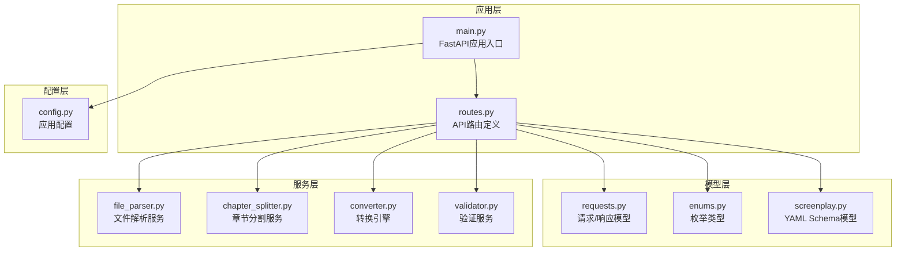
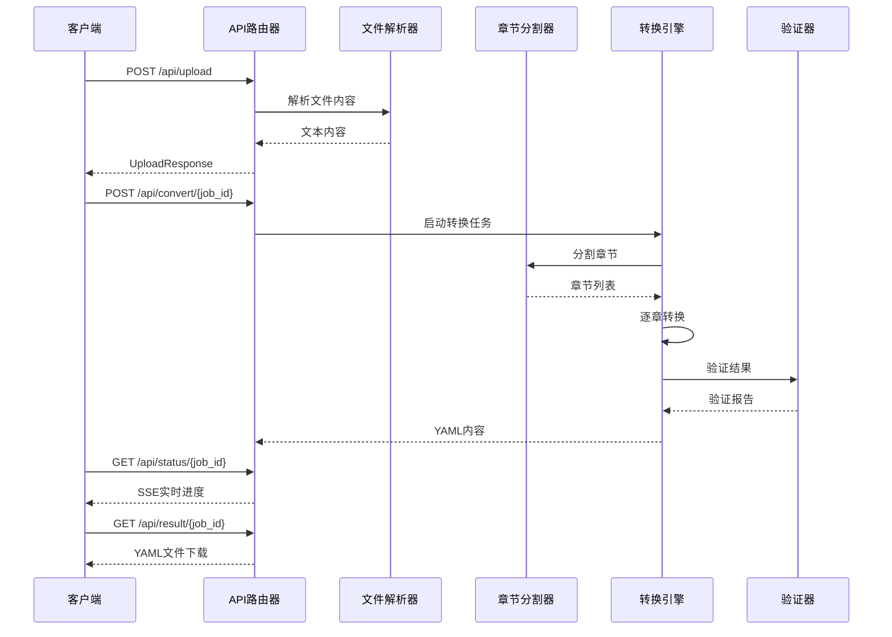
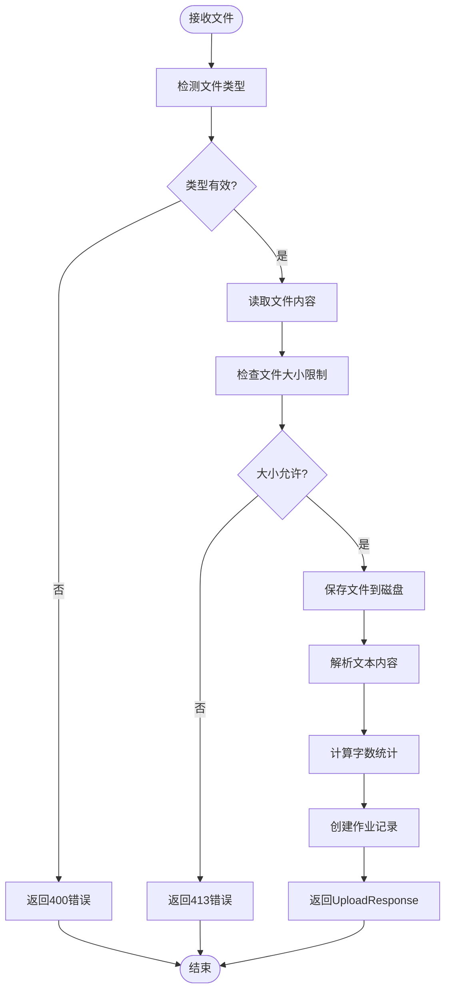
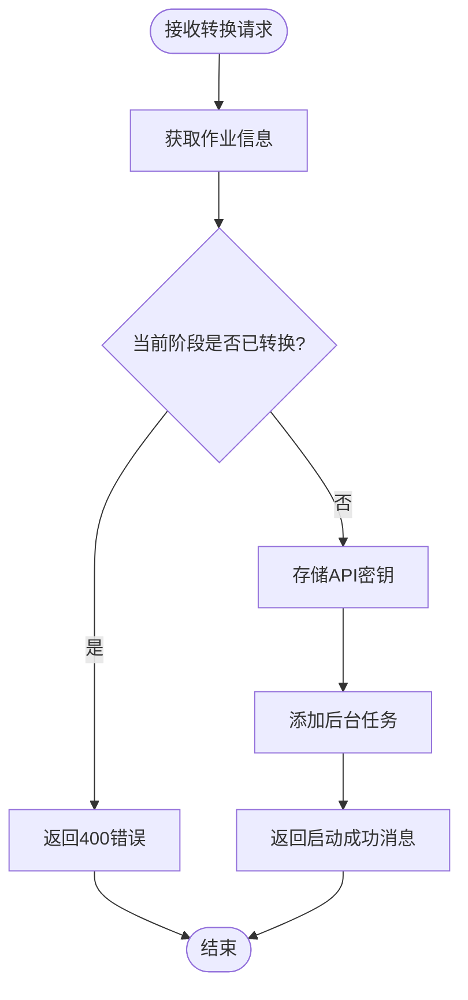
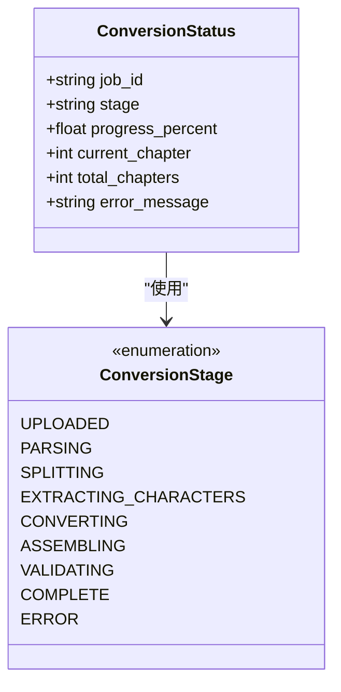
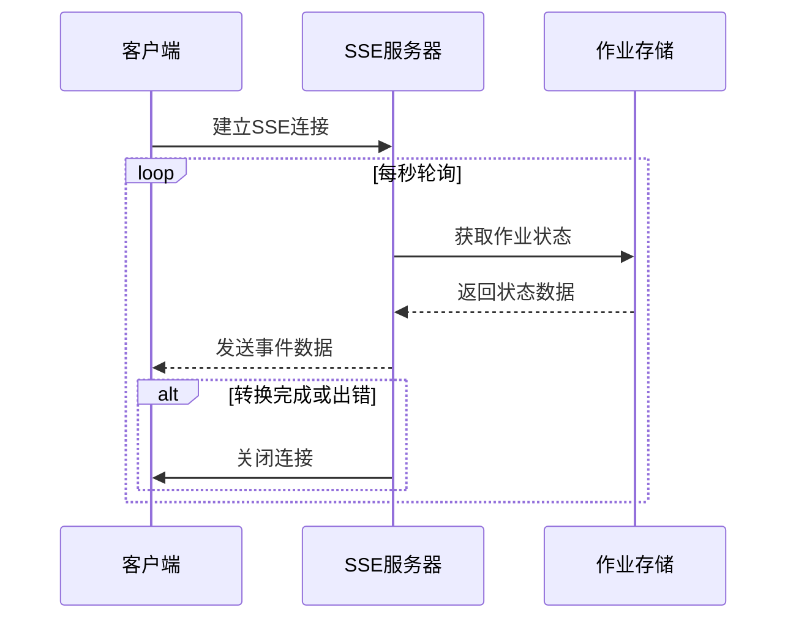
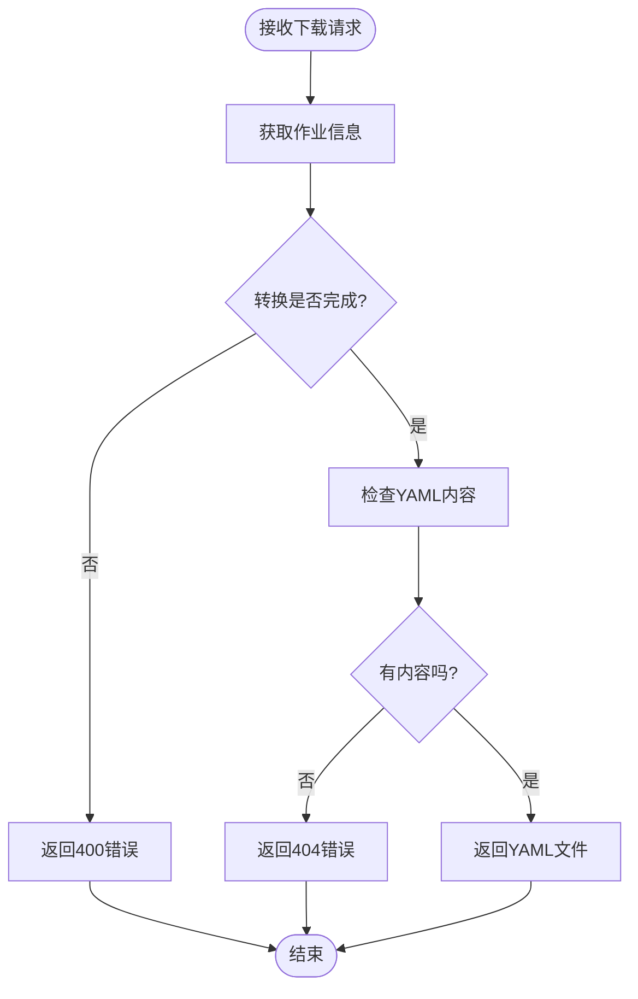
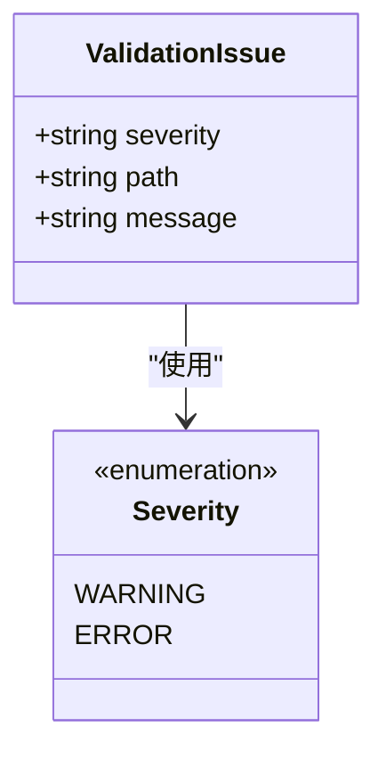
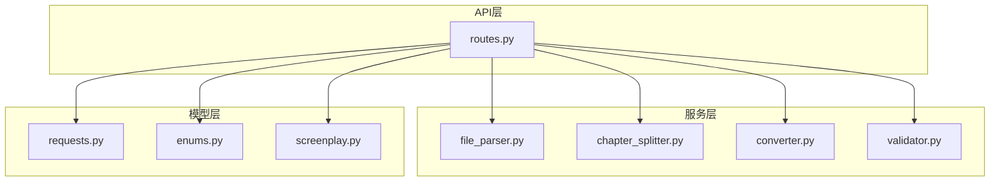

# API参考文档

<cite>
**本文档引用的文件**
- [app/api/routes.py](file://app/api/routes.py)
- [app/main.py](file://app/main.py)
- [app/models/requests.py](file://app/models/requests.py)
- [app/models/enums.py](file://app/models/enums.py)
- [app/models/screenplay.py](file://app/models/screenplay.py)
- [app/config.py](file://app/config.py)
- [app/services/file_parser.py](file://app/services/file_parser.py)
- [app/services/chapter_splitter.py](file://app/services/chapter_splitter.py)
- [app/services/converter.py](file://app/services/converter.py)
- [app/services/validator.py](file://app/services/validator.py)
- [app/static/js/upload.js](file://app/static/js/upload.js)
- [app/static/js/conversion.js](file://app/static/js/conversion.js)
- [README.md](file://README.md)
</cite>

## 目录
1. [简介](#简介)
2. [项目结构](#项目结构)
3. [核心组件](#核心组件)
4. [架构概览](#架构概览)
5. [详细组件分析](#详细组件分析)
6. [依赖分析](#依赖分析)
7. [性能考虑](#性能考虑)
8. [故障排除指南](#故障排除指南)
9. [结论](#结论)
10. [附录](#附录)

## 简介

这是一个基于FastAPI构建的小说到剧本转换API，能够将小说文本自动转换为结构化的YAML剧本格式。该系统提供了完整的文件上传、转换启动、进度查询、结果下载和验证功能，并支持实时进度推送。

主要特性包括：
- 多格式文件支持（TXT、MD、DOCX、PDF）
- 智能章节检测和角色提取
- 基于LLM的逐章转换
- 实时进度监控（SSE）
- 结构化YAML输出和验证

## 项目结构



**图表来源**
- [app/main.py:1-46](file://app/main.py#L1-L46)
- [app/api/routes.py:1-313](file://app/api/routes.py#L1-L313)

**章节来源**
- [app/main.py:1-46](file://app/main.py#L1-L46)
- [app/api/routes.py:1-313](file://app/api/routes.py#L1-L313)

## 核心组件

### API路由器
应用使用FastAPI的APIRouter来组织所有API端点，支持HTML响应和JSON响应。

### 数据模型
系统使用Pydantic模型确保API请求和响应的数据完整性：
- UploadResponse：文件上传后的响应
- ConversionStatus：转换状态模型
- ValidationIssue：验证问题模型
- ConvertRequest：转换请求体

### 业务服务
- 文件解析服务：支持多种文件格式的文本提取
- 章节分割服务：智能章节检测和分割
- 转换引擎：基于LLM的逐章转换
- 验证服务：结构化验证

**章节来源**
- [app/api/routes.py:68-206](file://app/api/routes.py#L68-L206)
- [app/models/requests.py:6-41](file://app/models/requests.py#L6-L41)
- [app/models/enums.py:72-83](file://app/models/enums.py#L72-L83)

## 架构概览



**图表来源**
- [app/api/routes.py:114-313](file://app/api/routes.py#L114-L313)
- [app/services/file_parser.py:16-56](file://app/services/file_parser.py#L16-L56)
- [app/services/chapter_splitter.py:42-63](file://app/services/chapter_splitter.py#L42-L63)

## 详细组件分析

### 文件上传端点

#### 端点定义
- **HTTP方法**: POST
- **URL模式**: `/api/upload`
- **请求参数**: multipart/form-data，包含单个文件字段
- **响应格式**: UploadResponse模型

#### 请求处理流程


**图表来源**
- [app/api/routes.py:68-112](file://app/api/routes.py#L68-L112)
- [app/services/file_parser.py:16-56](file://app/services/file_parser.py#L16-L56)

#### 请求示例
```javascript
// 使用fetch进行文件上传
const formData = new FormData();
formData.append('file', selectedFile);

const response = await fetch('/api/upload', {
    method: 'POST',
    body: formData
});
```

#### 响应示例
```json
{
  "job_id": "550e8400-e29b-41d4-a716-446655440000",
  "filename": "novel.txt",
  "file_type": "txt",
  "word_count": 15000
}
```

**章节来源**
- [app/api/routes.py:68-112](file://app/api/routes.py#L68-L112)
- [app/static/js/upload.js:88-104](file://app/static/js/upload.js#L88-L104)

### 转换启动端点

#### 端点定义
- **HTTP方法**: POST
- **URL模式**: `/api/convert/{job_id}`
- **路径参数**: job_id - 作业ID
- **请求参数**: ConvertRequest模型（可选的API密钥）
- **响应格式**: JSON对象

#### 请求处理逻辑


**图表来源**
- [app/api/routes.py:114-128](file://app/api/routes.py#L114-L128)

#### 请求示例
```javascript
const response = await fetch(`/api/convert/${jobId}`, {
    method: 'POST',
    headers: { 'Content-Type': 'application/json' },
    body: JSON.stringify({ 
        api_key: "your-deepseek-api-key" 
    })
});
```

#### 响应示例
```json
{
  "message": "Conversion started",
  "job_id": "550e8400-e29b-41d4-a716-446655440000"
}
```

**章节来源**
- [app/api/routes.py:114-128](file://app/api/routes.py#L114-L128)
- [app/static/js/upload.js:108-117](file://app/static/js/upload.js#L108-L117)

### 进度查询端点

#### SSE实时进度端点
- **HTTP方法**: GET
- **URL模式**: `/api/status/{job_id}`
- **媒体类型**: text/event-stream
- **响应格式**: Server-Sent Events流

#### JSON回退端点
- **HTTP方法**: GET
- **URL模式**: `/api/status/{job_id}/json`
- **响应格式**: JSON对象

#### 进度状态模型


**图表来源**
- [app/models/requests.py:14-22](file://app/models/requests.py#L14-L22)
- [app/models/enums.py:72-83](file://app/models/enums.py#L72-L83)

#### SSE实现机制


**图表来源**
- [app/api/routes.py:131-158](file://app/api/routes.py#L131-L158)

#### 前端SSE使用示例
```javascript
// 前端使用EventSource进行SSE连接
const eventSource = new EventSource(`/api/status/${jobId}`);
eventSource.onmessage = function(event) {
    const status = JSON.parse(event.data);
    updateProgress(status);
};
```

**章节来源**
- [app/api/routes.py:131-158](file://app/api/routes.py#L131-L158)
- [app/static/js/conversion.js:30-71](file://app/static/js/conversion.js#L30-L71)

### 结果下载端点

#### 主要下载端点
- **HTTP方法**: GET
- **URL模式**: `/api/result/{job_id}`
- **响应格式**: text/yaml
- **响应头**: Content-Disposition用于文件下载

#### 文本预览端点
- **HTTP方法**: GET
- **URL模式**: `/api/result/{job_id}/text`
- **响应格式**: text/plain; charset=utf-8

#### 下载流程


**图表来源**
- [app/api/routes.py:168-198](file://app/api/routes.py#L168-L198)

#### 响应示例
```json
{
  "Content-Type": "text/yaml",
  "Content-Disposition": "attachment; filename=screenplay_550e8400.yaml"
}
```

**章节来源**
- [app/api/routes.py:168-198](file://app/api/routes.py#L168-L198)

### 验证端点

#### 端点定义
- **HTTP方法**: GET
- **URL模式**: `/api/validate/{job_id}`
- **响应格式**: JSON对象

#### 验证规则
系统执行以下验证检查：
- 元数据完整性检查
- 角色引用有效性验证
- 结构编号连续性检查
- 场景元素完整性检查

#### 验证问题模型


**图表来源**
- [app/models/requests.py:24-29](file://app/models/requests.py#L24-L29)

#### 响应示例
```json
{
  "issues": [
    {
      "severity": "warning",
      "path": "structure.acts[0].scenes[2].elements[0].character_id",
      "message": "Character 'john-doe' not found in character catalog"
    }
  ]
}
```

**章节来源**
- [app/api/routes.py:201-205](file://app/api/routes.py#L201-L205)
- [app/services/validator.py:11-111](file://app/services/validator.py#L11-L111)

## 依赖分析

### 核心依赖关系


**图表来源**
- [app/api/routes.py:15-23](file://app/api/routes.py#L15-L23)

### 错误处理机制
系统实现了统一的HTTP异常处理：
- 404错误：作业不存在
- 400错误：转换已在进行或转换未完成
- 404错误：结果文件不存在
- 413错误：文件过大
- 400错误：文件解析失败

**章节来源**
- [app/api/routes.py:34-38](file://app/api/routes.py#L34-L38)
- [app/api/routes.py:119-120](file://app/api/routes.py#L119-L120)
- [app/api/routes.py:173-174](file://app/api/routes.py#L173-L174)

## 性能考虑

### 内存管理
- 使用异步I/O避免阻塞
- 作业状态存储在内存字典中
- 文件内容按需读取和处理

### LLM调用优化
- 章节长度限制（约12000字符）
- Token预算分配策略
- 连续性上下文传递减少重复

### 并发处理
- 后台任务队列处理转换
- SSE连接非阻塞
- 文件上传流式处理

## 故障排除指南

### 常见错误码
- **400 Bad Request**: 输入验证失败、转换已在进行、转换未完成
- **404 Not Found**: 作业不存在、结果文件不存在
- **413 Payload Too Large**: 文件超过大小限制
- **500 Internal Server Error**: 服务器内部错误

### 调试建议
1. 检查文件格式是否受支持
2. 验证DeepSeek API密钥有效性
3. 确认文件大小不超过限制
4. 查看服务器日志获取详细错误信息

**章节来源**
- [app/api/routes.py:74-77](file://app/api/routes.py#L74-L77)
- [app/api/routes.py:82-83](file://app/api/routes.py#L82-L83)

## 结论

该API提供了完整的小说到剧本转换解决方案，具有以下特点：

**优势**：
- 完整的文件格式支持
- 实时进度监控
- 结构化YAML输出
- 自动验证机制
- 易于扩展的架构

**适用场景**：
- 文学作品改编
- 剧本创作辅助
- 内容格式转换

## 附录

### API使用示例

#### 完整工作流程
```javascript
// 1. 上传文件
const formData = new FormData();
formData.append('file', novelFile);
const uploadResp = await fetch('/api/upload', { method: 'POST', body: formData });

// 2. 启动转换
const { job_id } = await uploadResp.json();
const convertResp = await fetch(`/api/convert/${job_id}`, {
    method: 'POST',
    headers: { 'Content-Type': 'application/json' },
    body: JSON.stringify({ api_key: deepseekKey })
});

// 3. 监控进度
const eventSource = new EventSource(`/api/status/${job_id}`);
eventSource.onmessage = function(event) {
    const status = JSON.parse(event.data);
    console.log(`进度: ${status.progress_percent}% (${status.stage})`);
};

// 4. 下载结果
const resultResp = await fetch(`/api/result/${job_id}`);
const yamlContent = await resultResp.text();
```

### 最佳实践

1. **文件大小控制**: 确保文件大小不超过配置限制
2. **错误处理**: 实现适当的错误处理和重试机制
3. **进度监控**: 使用SSE实现实时进度反馈
4. **验证检查**: 在下载前检查验证结果
5. **资源清理**: 转换完成后清理临时文件

### API版本控制

当前版本：1.0.0
- 版本号在应用配置中定义
- 保持向后兼容性
- 新功能通过扩展而非破坏性变更

**章节来源**
- [app/main.py:23-28](file://app/main.py#L23-L28)
- [app/models/screenplay.py:29](file://app/models/screenplay.py#L29)