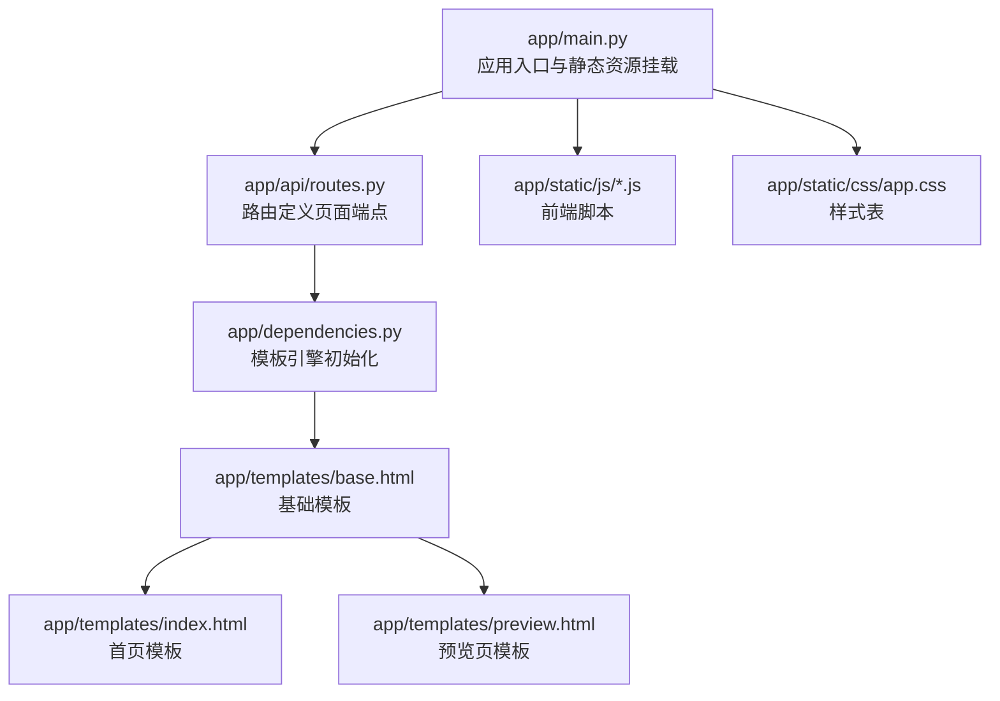
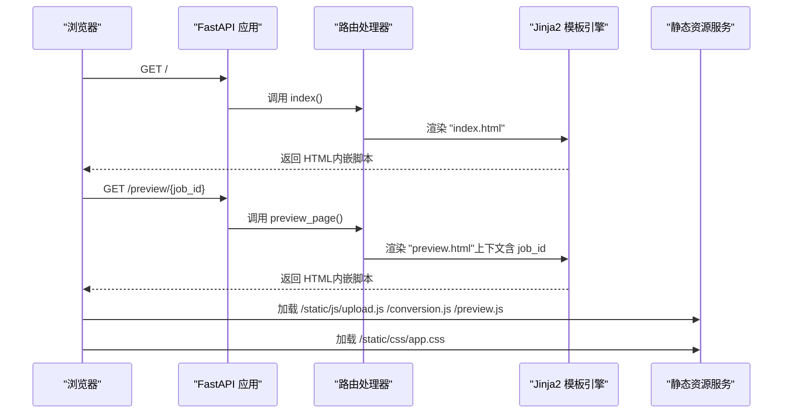
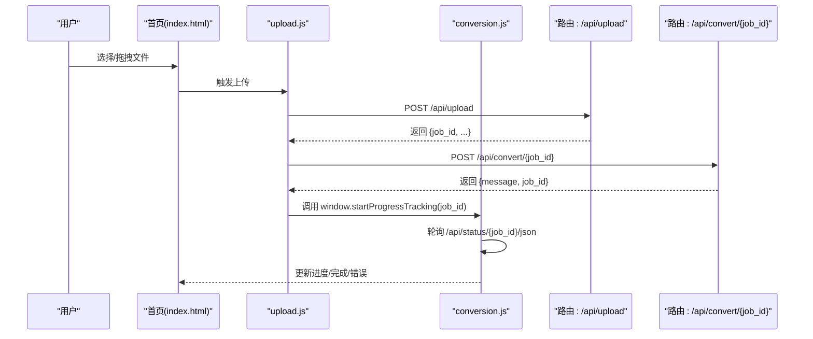
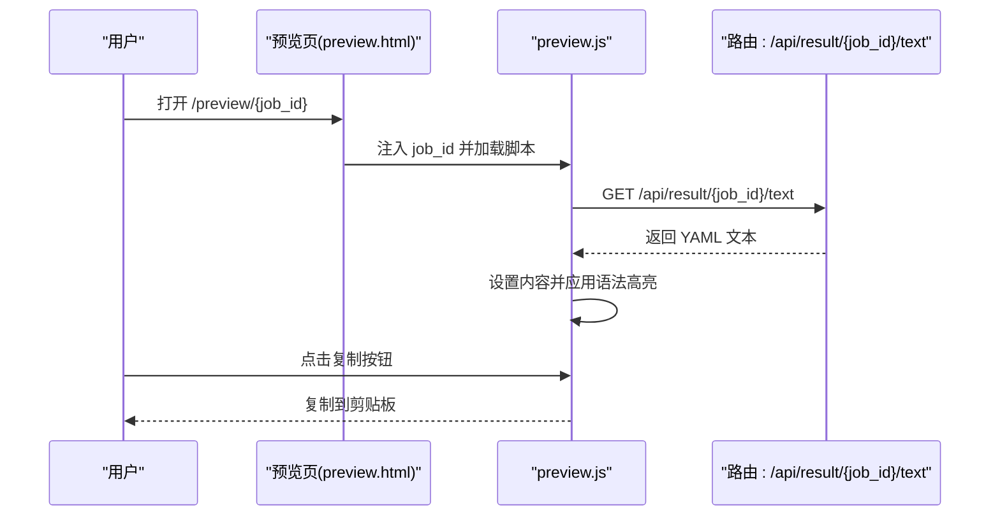
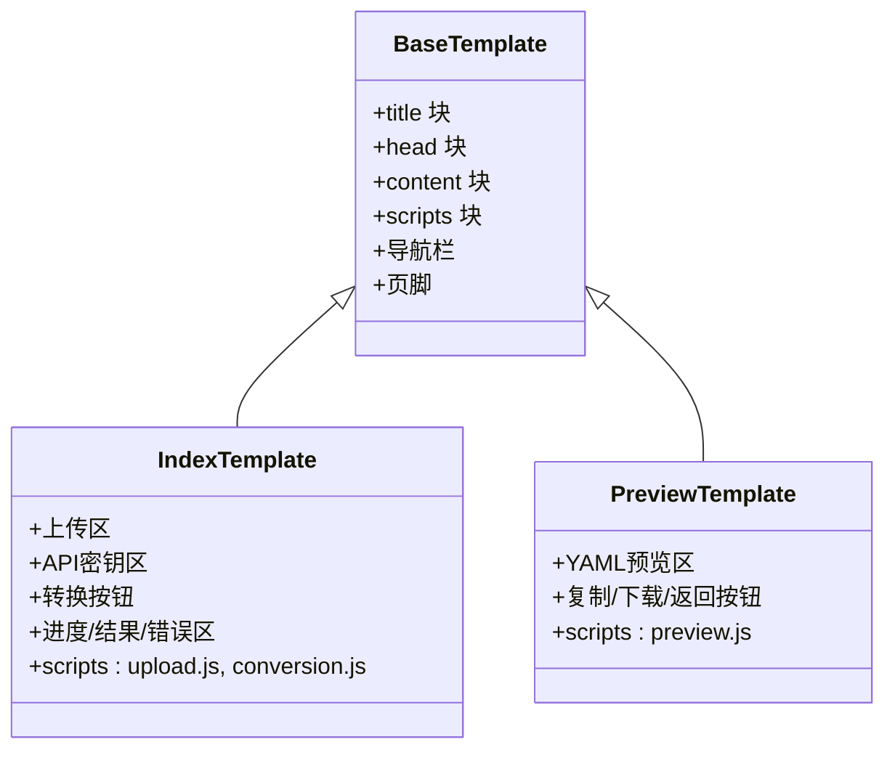
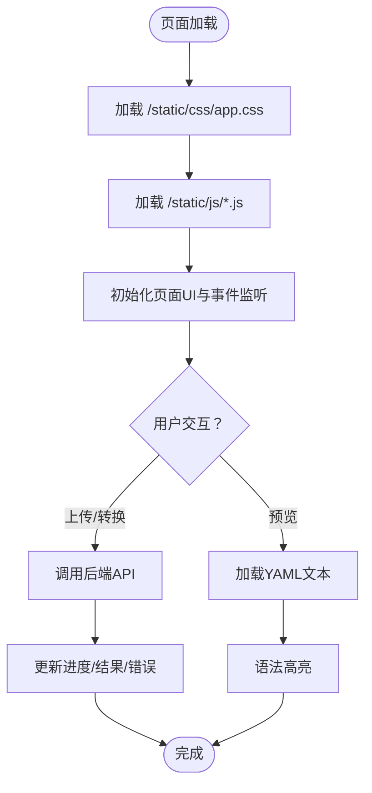
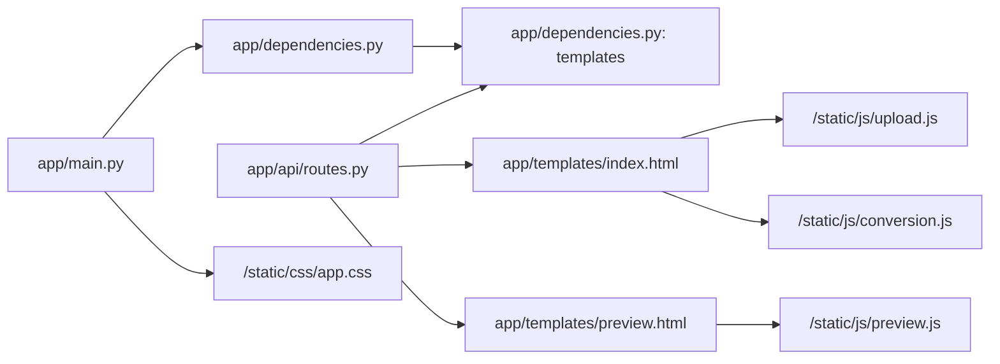

# Web界面端点

<cite>
**本文档引用的文件**
- [app/main.py](file://app/main.py)
- [app/api/routes.py](file://app/api/routes.py)
- [app/dependencies.py](file://app/dependencies.py)
- [app/templates/base.html](file://app/templates/base.html)
- [app/templates/index.html](file://app/templates/index.html)
- [app/templates/preview.html](file://app/templates/preview.html)
- [app/static/js/upload.js](file://app/static/js/upload.js)
- [app/static/js/conversion.js](file://app/static/js/conversion.js)
- [app/static/js/preview.js](file://app/static/js/preview.js)
- [app/static/css/app.css](file://app/static/css/app.css)
- [app/config.py](file://app/config.py)
- [app/models/enums.py](file://app/models/enums.py)
- [app/models/requests.py](file://app/models/requests.py)
- [README.md](file://README.md)
</cite>

## 目录
1. [简介](#简介)
2. [项目结构](#项目结构)
3. [核心组件](#核心组件)
4. [架构总览](#架构总览)
5. [详细组件分析](#详细组件分析)
6. [依赖分析](#依赖分析)
7. [性能考虑](#性能考虑)
8. [故障排除指南](#故障排除指南)
9. [结论](#结论)
10. [附录](#附录)

## 简介
本文件聚焦于Web界面的两个页面端点：首页上传界面（GET /）与YAML预览页面（GET /preview/{job_id}）。文档化内容涵盖：
- 页面渲染端点行为与返回类型
- Jinja2模板渲染机制与模板继承
- 静态资源服务与前端脚本集成
- 页面上下文数据与页面间数据传递
- 用户交互流程与错误处理
- 性能优化建议与浏览器兼容性说明

## 项目结构
Web界面端点位于FastAPI应用中，使用Jinja2模板渲染HTML，并通过StaticFiles提供静态资源。路由定义在API路由器中，模板与静态资源分别位于templates与static目录。

图表来源
- [app/main.py:37](file://app/main.py#L37)
- [app/api/routes.py:53](file://app/api/routes.py#L53)
- [app/dependencies.py:8](file://app/dependencies.py#L8)
- [app/templates/base.html:1](file://app/templates/base.html#L1)
- [app/templates/index.html:1](file://app/templates/index.html#L1)
- [app/templates/preview.html:1](file://app/templates/preview.html#L1)

章节来源
- [app/main.py:14](file://app/main.py#L14)
- [app/main.py:37](file://app/main.py#L37)
- [app/api/routes.py:53](file://app/api/routes.py#L53)
- [app/dependencies.py:8](file://app/dependencies.py#L8)

## 核心组件
- 应用入口与静态资源挂载：在应用启动时创建上传与输出目录，并挂载静态文件服务。
- 路由器与页面端点：定义首页与预览页的GET端点，使用Jinja2模板渲染HTML。
- 模板系统：基础模板提供通用头部、导航、页脚与块占位；子模板扩展内容与脚本。
- 前端脚本：首页负责文件选择与上传、转换触发与进度跟踪；预览页负责加载YAML文本、语法高亮与复制。

章节来源
- [app/main.py:14](file://app/main.py#L14)
- [app/main.py:37](file://app/main.py#L37)
- [app/api/routes.py:53](file://app/api/routes.py#L53)
- [app/dependencies.py:8](file://app/dependencies.py#L8)

## 架构总览
下图展示从浏览器请求到页面渲染与前端脚本执行的整体流程。

图表来源
- [app/api/routes.py:53](file://app/api/routes.py#L53)
- [app/api/routes.py:59](file://app/api/routes.py#L59)
- [app/dependencies.py:8](file://app/dependencies.py#L8)
- [app/main.py:37](file://app/main.py#L37)

## 详细组件分析

### 页面端点：GET /
- 端点路径：GET /
- 响应类型：HTMLResponse
- 渲染模板：index.html
- 上下文数据：无额外上下文（仅模板上下文request）
- 关键行为：
  - 渲染文件上传区域、API密钥输入、转换按钮与进度/结果/错误展示区
  - 通过前端脚本实现拖拽上传、文件信息展示、转换触发与进度轮询
- 前端交互要点：
  - 上传成功后调用后台转换接口，并切换到进度跟踪
  - 进度轮询失败时回退到“错误”状态并允许重试

图表来源
- [app/templates/index.html:136](file://app/templates/index.html#L136)
- [app/static/js/upload.js:82](file://app/static/js/upload.js#L82)
- [app/static/js/conversion.js:30](file://app/static/js/conversion.js#L30)
- [app/api/routes.py:68](file://app/api/routes.py#L68)
- [app/api/routes.py:114](file://app/api/routes.py#L114)

章节来源
- [app/api/routes.py:53](file://app/api/routes.py#L53)
- [app/templates/index.html:1](file://app/templates/index.html#L1)
- [app/static/js/upload.js:1](file://app/static/js/upload.js#L1)
- [app/static/js/conversion.js:1](file://app/static/js/conversion.js#L1)

### 页面端点：GET /preview/{job_id}
- 端点路径：GET /preview/{job_id}
- 响应类型：HTMLResponse
- 渲染模板：preview.html
- 上下文数据：{"job_id": job_id}
- 关键行为：
  - 校验job_id存在性（不存在则抛出404）
  - 渲染YAML预览页面，包含复制到剪贴板、下载YAML与返回首页按钮
  - 通过前端脚本异步加载YAML文本并进行语法高亮
- 页面间数据传递：
  - 首页完成转换后，通过链接跳转至 /preview/{job_id}
  - 预览页通过模板上下文注入job_id，前端脚本据此拉取YAML文本

图表来源
- [app/api/routes.py:59](file://app/api/routes.py#L59)
- [app/templates/preview.html:37](file://app/templates/preview.html#L37)
- [app/static/js/preview.js:9](file://app/static/js/preview.js#L9)

章节来源
- [app/api/routes.py:59](file://app/api/routes.py#L59)
- [app/templates/preview.html:1](file://app/templates/preview.html#L1)
- [app/static/js/preview.js:1](file://app/static/js/preview.js#L1)

### 模板系统与继承
- 基础模板（base.html）：
  - 提供通用HTML骨架、导航栏、页脚与块占位（title/head/content/scripts）
  - 引入Tailwind CSS与自定义样式表
- 子模板（index.html、preview.html）：
  - 通过 extends 继承基础模板
  - 在 content 区域填充页面特定内容
  - 在 scripts 区域引入对应前端脚本
- 模板上下文：
  - index.html：无额外上下文，仅使用request对象
  - preview.html：传入 job_id 用于前端脚本动态加载YAML

图表来源
- [app/templates/base.html:1](file://app/templates/base.html#L1)
- [app/templates/index.html:1](file://app/templates/index.html#L1)
- [app/templates/preview.html:1](file://app/templates/preview.html#L1)

章节来源
- [app/templates/base.html:1](file://app/templates/base.html#L1)
- [app/templates/index.html:1](file://app/templates/index.html#L1)
- [app/templates/preview.html:1](file://app/templates/preview.html#L1)

### 静态资源服务与前端集成
- 静态资源挂载：
  - 应用启动时挂载 /static 路径，指向本地 static 目录
- 前端脚本：
  - upload.js：处理文件选择、拖拽、上传与转换触发
  - conversion.js：基于轮询获取转换状态，更新UI并展示结果/错误
  - preview.js：加载YAML文本、语法高亮与复制功能
- 样式：
  - app.css：自定义拖拽高亮、YAML容器滚动与进度图标样式

图表来源
- [app/main.py:37](file://app/main.py#L37)
- [app/static/js/upload.js:1](file://app/static/js/upload.js#L1)
- [app/static/js/conversion.js:1](file://app/static/js/conversion.js#L1)
- [app/static/js/preview.js:1](file://app/static/js/preview.js#L1)
- [app/static/css/app.css:1](file://app/static/css/app.css#L1)

章节来源
- [app/main.py:37](file://app/main.py#L37)
- [app/static/js/upload.js:1](file://app/static/js/upload.js#L1)
- [app/static/js/conversion.js:1](file://app/static/js/conversion.js#L1)
- [app/static/js/preview.js:1](file://app/static/js/preview.js#L1)
- [app/static/css/app.css:1](file://app/static/css/app.css#L1)

### 页面功能说明与用户交互流程
- 首页（GET /）：
  - 支持拖拽或点击选择TXT/MD/DOCX/PDF文件
  - 显示文件元信息，可移除文件
  - 输入DeepSeek API Key（可明文/隐藏切换）
  - 点击“开始转换”，上传文件并触发转换，进入进度跟踪
  - 成功后提供“预览YAML”与“下载YAML”链接
  - 失败时显示错误信息并允许重试
- 预览页（GET /preview/{job_id}）：
  - 展示带语法高亮的YAML文本
  - 支持复制到剪贴板与下载YAML
  - 提供返回首页按钮

章节来源
- [app/templates/index.html:1](file://app/templates/index.html#L1)
- [app/templates/preview.html:1](file://app/templates/preview.html#L1)
- [app/static/js/upload.js:1](file://app/static/js/upload.js#L1)
- [app/static/js/conversion.js:1](file://app/static/js/conversion.js#L1)
- [app/static/js/preview.js:1](file://app/static/js/preview.js#L1)

### 错误页面处理
- 页面端点错误：
  - 预览页在job_id不存在时会触发404（由内部校验逻辑抛出）
- 前端错误处理：
  - 上传/转换阶段若HTTP响应非OK，捕获错误并提示
  - 进度轮询异常时切换到错误状态并允许重试
  - 预览页加载YAML失败时显示错误提示

章节来源
- [app/api/routes.py:34](file://app/api/routes.py#L34)
- [app/api/routes.py:59](file://app/api/routes.py#L59)
- [app/static/js/upload.js:124](file://app/static/js/upload.js#L124)
- [app/static/js/conversion.js:116](file://app/static/js/conversion.js#L116)
- [app/static/js/preview.js:24](file://app/static/js/preview.js#L24)

## 依赖分析
- 应用层依赖：
  - main.py 依赖 dependencies.py 初始化模板引擎
  - routes.py 依赖 templates 进行页面渲染
- 模板层依赖：
  - base.html 作为父模板被 index.html 与 preview.html 继承
- 前端依赖：
  - 预览页依赖CDN上的Highlight.js进行YAML语法高亮
  - 首页与预览页均依赖 /static/js 与 /static/css

图表来源
- [app/main.py:37](file://app/main.py#L37)
- [app/dependencies.py:8](file://app/dependencies.py#L8)
- [app/api/routes.py:53](file://app/api/routes.py#L53)
- [app/templates/index.html:136](file://app/templates/index.html#L136)
- [app/templates/preview.html:40](file://app/templates/preview.html#L40)

章节来源
- [app/main.py:37](file://app/main.py#L37)
- [app/dependencies.py:8](file://app/dependencies.py#L8)
- [app/api/routes.py:53](file://app/api/routes.py#L53)

## 性能考虑
- 模板渲染：
  - 使用Jinja2模板渲染，避免在视图函数中拼接HTML字符串，提高可维护性
- 静态资源：
  - 通过StaticFiles提供静态资源，建议生产环境配合CDN与缓存头
- 前端脚本：
  - 首页进度跟踪采用轮询而非SSE，以提升浏览器兼容性
  - 预览页仅在页面加载时请求一次YAML文本，避免重复请求
- 样式与脚本：
  - Tailwind CSS按需引入，app.css提供少量定制样式，减少首屏阻塞
- 建议优化（通用指导，非现有实现）：
  - 对于大文件，可考虑分块传输与进度条精确反馈
  - 预览页可增加“刷新”按钮以重新加载最新YAML
  - 对Highlight.js进行按需加载与缓存，减少重复高亮成本

## 故障排除指南
- 页面无法加载或空白：
  - 检查静态资源路径是否正确（/static/js、/static/css）
  - 确认应用已挂载静态资源服务
- 预览页空白或报错：
  - 确认job_id有效且转换已完成
  - 检查 /api/result/{job_id}/text 是否可访问
- 上传/转换失败：
  - 查看控制台网络面板确认API响应状态
  - 确认文件类型与大小限制
- 进度不更新：
  - 确认轮询URL /api/status/{job_id}/json可用
  - 检查浏览器对轮询的支持与跨域设置

章节来源
- [app/main.py:37](file://app/main.py#L37)
- [app/api/routes.py:161](file://app/api/routes.py#L161)
- [app/static/js/conversion.js:30](file://app/static/js/conversion.js#L30)

## 结论
本文档梳理了Web界面两个核心页面端点的渲染流程、模板继承机制、静态资源与前端脚本集成方式，并总结了用户交互流程与错误处理策略。通过明确的上下文数据传递与前后端协作，实现了从文件上传到YAML预览的完整用户体验。建议在生产环境中进一步完善静态资源缓存与CDN部署，以提升页面加载性能与稳定性。

## 附录
- 环境变量与配置项参考：
  - DEEPSEEK_API_KEY、DEEPSEEK_BASE_URL、DEEPSEEK_MODEL、MAX_UPLOAD_SIZE_MB、DATA_DIR
- 页面端点一览：
  - GET /：首页上传界面
  - GET /preview/{job_id}：YAML预览页面

章节来源
- [app/config.py:9](file://app/config.py#L9)
- [README.md](file://README.md)