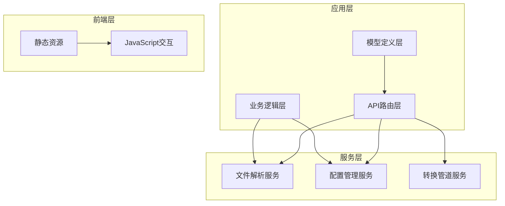
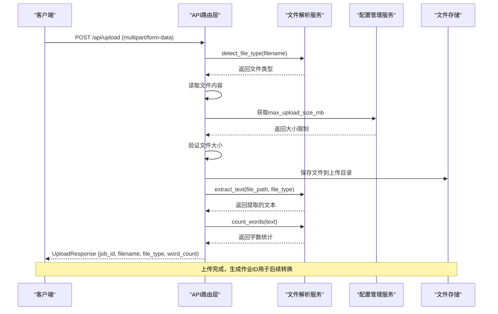
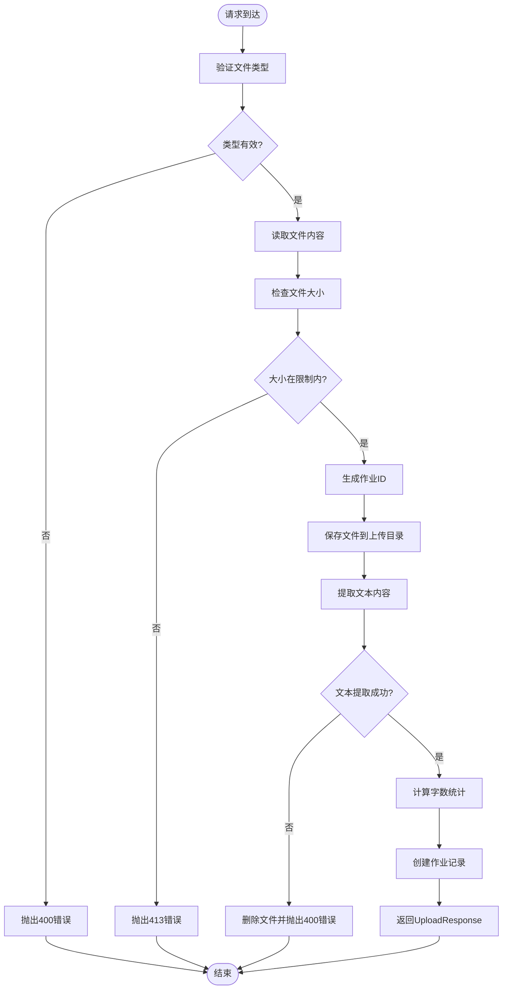
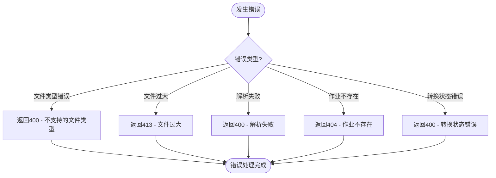
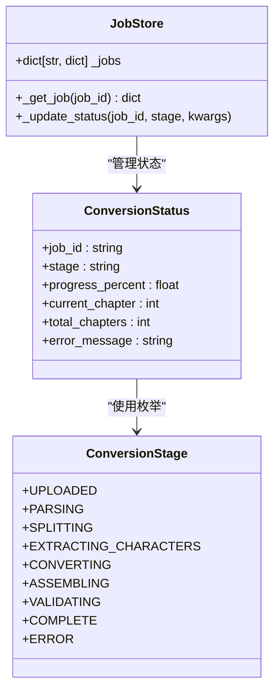
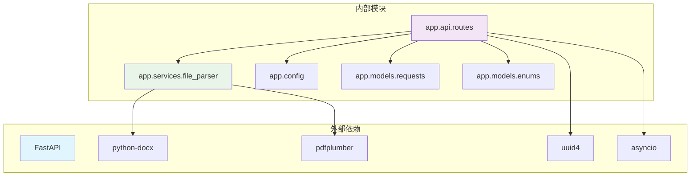

# 文件上传端点

<cite>
**本文档引用的文件**
- [app/api/routes.py](file://app/api/routes.py)
- [app/services/file_parser.py](file://app/services/file_parser.py)
- [app/models/requests.py](file://app/models/requests.py)
- [app/config.py](file://app/config.py)
- [app/models/enums.py](file://app/models/enums.py)
- [app/static/js/upload.js](file://app/static/js/upload.js)
- [README.md](file://README.md)
</cite>

## 目录
1. [简介](#简介)
2. [项目结构](#项目结构)
3. [核心组件](#核心组件)
4. [架构概览](#架构概览)
5. [详细组件分析](#详细组件分析)
6. [依赖关系分析](#依赖关系分析)
7. [性能考虑](#性能考虑)
8. [故障排除指南](#故障排除指南)
9. [结论](#结论)
10. [附录](#附录)

## 简介

本文档详细描述了 Novel to Screenplay 转换器中的文件上传端点，重点介绍 POST /api/upload 端点的功能实现。该端点负责接收用户上传的小说文件，执行文件类型验证、大小限制检查、文本提取和字数统计，并返回标准化的响应格式。

该系统支持多种文件格式（TXT、MD、DOCX、PDF），具有完善的错误处理机制和状态管理功能。上传后的文件会被保存到指定的上传目录，并生成唯一的作业ID用于后续的转换流程跟踪。

## 项目结构

项目采用模块化的架构设计，主要组件分布如下：



**图表来源**
- [app/api/routes.py:1-313](file://app/api/routes.py#L1-L313)
- [app/services/file_parser.py:1-187](file://app/services/file_parser.py#L1-L187)
- [app/config.py:1-45](file://app/config.py#L1-L45)

**章节来源**
- [app/api/routes.py:1-313](file://app/api/routes.py#L1-L313)
- [app/services/file_parser.py:1-187](file://app/services/file_parser.py#L1-L187)
- [app/config.py:1-45](file://app/config.py#L1-L45)

## 核心组件

### API路由层
API路由层负责处理HTTP请求和响应，包含以下关键组件：
- **上传端点**：POST /api/upload - 主要的文件上传处理逻辑
- **状态管理**：内存中的作业存储和状态跟踪
- **错误处理**：统一的HTTP异常处理机制

### 文件解析服务
文件解析服务提供多格式文件的文本提取能力：
- **格式支持**：TXT、MD、DOCX、PDF四种格式
- **编码处理**：自动检测和处理多种字符编码
- **文本预处理**：清理和规范化提取的文本内容

### 配置管理服务
配置管理服务提供应用运行时的配置参数：
- **文件大小限制**：可配置的最大上传文件大小
- **存储路径管理**：上传目录和输出目录的动态生成
- **环境变量支持**：基于.env文件的配置加载

**章节来源**
- [app/api/routes.py:68-111](file://app/api/routes.py#L68-L111)
- [app/services/file_parser.py:16-187](file://app/services/file_parser.py#L16-L187)
- [app/config.py:24-39](file://app/config.py#L24-L39)

## 架构概览

文件上传端点在整个系统中的位置和交互关系如下：



**图表来源**
- [app/api/routes.py:68-111](file://app/api/routes.py#L68-L111)
- [app/services/file_parser.py:16-56](file://app/services/file_parser.py#L16-L56)
- [app/config.py:24-39](file://app/config.py#L24-L39)

## 详细组件分析

### 上传端点实现

#### 请求处理流程
上传端点的核心处理流程包括以下几个关键步骤：



**图表来源**
- [app/api/routes.py:68-111](file://app/api/routes.py#L68-L111)

#### 文件类型验证机制
系统支持的文件类型及其验证逻辑：

| 文件扩展名 | 支持类型 | 验证方式 | 特殊处理 |
|-----------|----------|----------|----------|
| .txt | txt | 扩展名映射 | 直接读取 |
| .md | md | 扩展名映射 | 移除Markdown标记 |
| .markdown | md | 扩展名映射 | 移除Markdown标记 |
| .docx | docx | 扩展名映射 | DOCX文档解析 |
| .pdf | pdf | 扩展名映射 | PDF文本提取 |

**章节来源**
- [app/api/routes.py:73-78](file://app/api/routes.py#L73-L78)
- [app/services/file_parser.py:164-177](file://app/services/file_parser.py#L164-L177)

### 错误处理机制

系统实现了多层次的错误处理机制：

#### HTTP状态码定义
- **400 Bad Request**：文件类型不支持、文件解析失败
- **413 Payload Too Large**：文件大小超过限制
- **404 Not Found**：作业ID不存在
- **400 Bad Request**：转换已开始、转换未完成

#### 错误处理流程


**图表来源**
- [app/api/routes.py:76-77](file://app/api/routes.py#L76-L77)
- [app/api/routes.py:82-83](file://app/api/routes.py#L82-L83)
- [app/api/routes.py:94-95](file://app/api/routes.py#L94-L95)

**章节来源**
- [app/api/routes.py:73-95](file://app/api/routes.py#L73-L95)

### 响应格式定义

#### UploadResponse模型
UploadResponse是上传端点的标准响应格式，包含以下字段：

| 字段名 | 类型 | 描述 | 必需 |
|--------|------|------|------|
| job_id | string | 唯一作业标识符 | 是 |
| filename | string | 原始文件名 | 是 |
| file_type | string | 检测到的文件类型 | 是 |
| word_count | integer | 估算的字数统计 | 否，默认0 |

#### 响应示例
成功的上传响应示例：
```json
{
  "job_id": "550e8400-e29b-41d4-a716-446655440000",
  "filename": "novel.txt",
  "file_type": "txt",
  "word_count": 12345
}
```

**章节来源**
- [app/models/requests.py:6-11](file://app/models/requests.py#L6-L11)

### 状态管理和作业ID生成

#### 作业ID生成机制
系统使用UUID v4算法生成唯一的作业ID，确保每个上传任务都有独立的标识符：



**图表来源**
- [app/api/routes.py:30-49](file://app/api/routes.py#L30-L49)
- [app/models/enums.py:72-83](file://app/models/enums.py#L72-L83)

#### 状态跟踪机制
系统维护一个内存中的作业存储，用于跟踪每个上传任务的状态变化：

**章节来源**
- [app/api/routes.py:30-49](file://app/api/routes.py#L30-L49)
- [app/models/enums.py:72-83](file://app/models/enums.py#L72-L83)

## 依赖关系分析

### 组件依赖图


**图表来源**
- [app/api/routes.py:1-25](file://app/api/routes.py#L1-L25)
- [app/services/file_parser.py:97-120](file://app/services/file_parser.py#L97-L120)

### 关键依赖关系
- **FastAPI**：提供Web框架和路由处理能力
- **python-docx**：DOCX文件解析依赖
- **pdfplumber**：PDF文件文本提取依赖
- **uuid**：作业ID生成
- **asyncio**：异步处理支持

**章节来源**
- [app/api/routes.py:1-25](file://app/api/routes.py#L1-L25)
- [app/services/file_parser.py:97-120](file://app/services/file_parser.py#L97-L120)

## 性能考虑

### 文件大小限制
系统默认支持最大50MB的文件上传，这个限制可以通过环境变量进行配置：

- **默认限制**：50MB
- **配置方式**：通过MAX_UPLOAD_SIZE_MB环境变量设置
- **验证时机**：上传后立即检查，避免不必要的处理开销

### 内存使用优化
- **流式读取**：文件内容以流式方式读取，避免一次性加载到内存
- **及时释放**：文件解析完成后及时释放内存
- **异步处理**：转换过程采用异步方式，提高并发处理能力

### 存储管理
- **临时文件**：上传的文件保存在上传目录，转换完成后可被清理
- **目录结构**：自动创建必要的目录结构
- **文件命名**：使用作业ID+原始文件名的组合命名

## 故障排除指南

### 常见问题及解决方案

#### 文件类型错误
**问题**：上传不支持的文件格式
**原因**：文件扩展名不在支持列表中
**解决**：确认文件扩展名为.txt、.md、.markdown、.docx或.pdf之一

#### 文件过大错误
**问题**：收到413状态码
**原因**：文件大小超过配置的限制
**解决**：减小文件大小或调整MAX_UPLOAD_SIZE_MB配置

#### 解析失败错误
**问题**：收到400状态码，提示解析失败
**原因**：文件内容无法正确解析
**解决**：检查文件完整性，确认文件未损坏

#### 依赖缺失错误
**问题**：DOCX或PDF解析失败
**原因**：缺少相应的Python包
**解决**：安装python-docx和pdfplumber包

**章节来源**
- [app/api/routes.py:73-95](file://app/api/routes.py#L73-L95)
- [app/services/file_parser.py:97-143](file://app/services/file_parser.py#L97-L143)

## 结论

文件上传端点作为整个转换系统的核心入口，实现了以下关键功能：

1. **多格式支持**：全面支持TXT、MD、DOCX、PDF四种文件格式
2. **严格验证**：双重验证机制确保文件质量和大小合规
3. **状态管理**：完整的作业生命周期管理
4. **错误处理**：完善的错误处理和用户友好的错误信息
5. **性能优化**：异步处理和内存优化确保良好的用户体验

该端点为后续的文本提取、章节检测、角色提取和剧本转换提供了可靠的基础，是整个Novel to Screenplay转换器的重要组成部分。

## 附录

### API规范详情

#### 端点定义
- **方法**：POST
- **路径**：/api/upload
- **内容类型**：multipart/form-data
- **认证**：无需认证

#### 请求参数
| 参数名 | 类型 | 必需 | 描述 |
|--------|------|------|------|
| file | file | 是 | 要上传的文件 |

#### 响应格式
成功的响应返回UploadResponse对象，包含作业ID、文件信息和字数统计。

#### 错误码说明
- **400**：文件类型不支持或解析失败
- **413**：文件大小超过限制
- **404**：作业ID不存在

### 配置参数

| 环境变量 | 默认值 | 描述 |
|----------|--------|------|
| MAX_UPLOAD_SIZE_MB | 50 | 最大上传文件大小（MB） |
| DATA_DIR | ./data | 数据存储根目录 |

**章节来源**
- [app/config.py:24-39](file://app/config.py#L24-L39)
- [README.md:165-174](file://README.md#L165-L174)