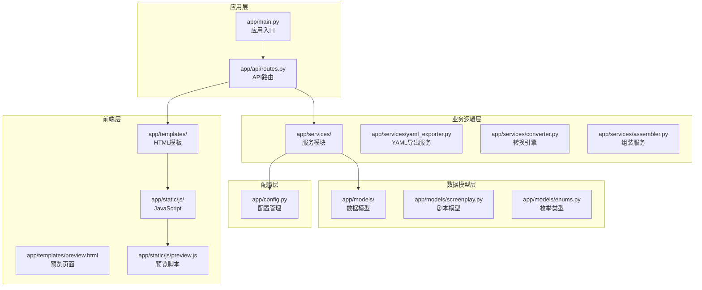
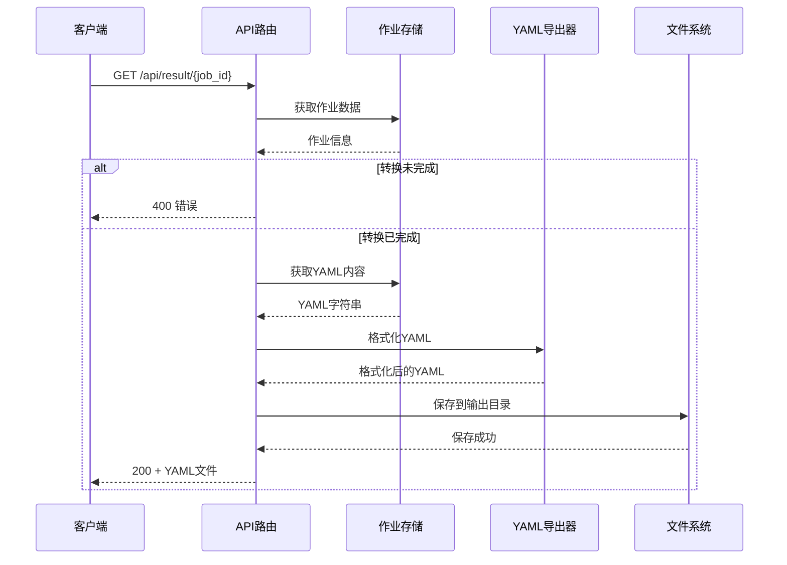
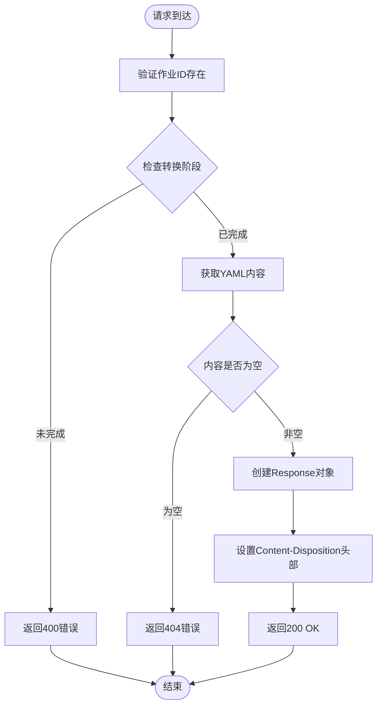
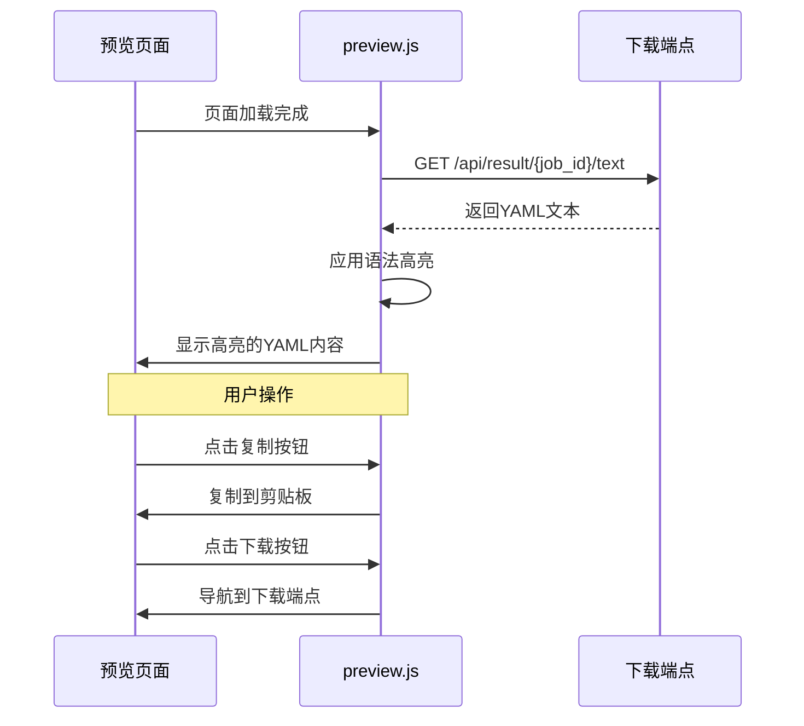
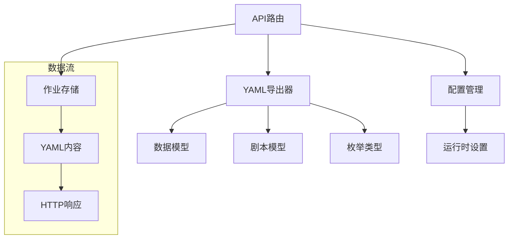
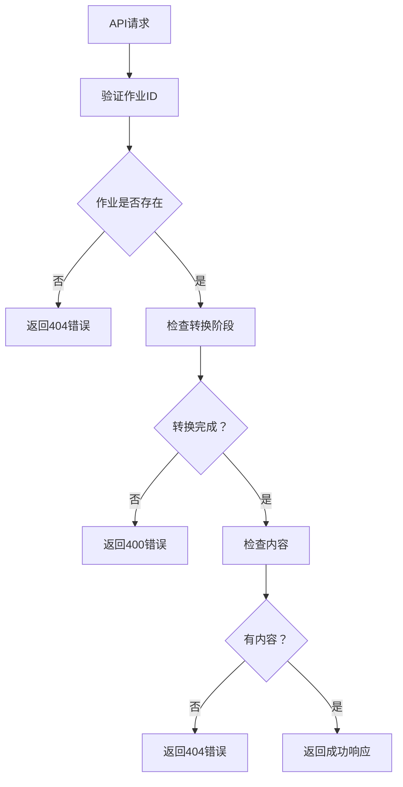

# 结果下载端点

<cite>
**本文档引用的文件**
- [app/main.py](file://app/main.py)
- [app/api/routes.py](file://app/api/routes.py)
- [app/services/yaml_exporter.py](file://app/services/yaml_exporter.py)
- [app/models/screenplay.py](file://app/models/screenplay.py)
- [app/models/enums.py](file://app/models/enums.py)
- [app/config.py](file://app/config.py)
- [app/templates/preview.html](file://app/templates/preview.html)
- [app/static/js/preview.js](file://app/static/js/preview.js)
- [README.md](file://README.md)
</cite>

## 目录
1. [简介](#简介)
2. [项目结构](#项目结构)
3. [核心组件](#核心组件)
4. [架构概览](#架构概览)
5. [详细组件分析](#详细组件分析)
6. [依赖关系分析](#依赖关系分析)
7. [性能考虑](#性能考虑)
8. [故障排除指南](#故障排除指南)
9. [结论](#结论)

## 简介

本文档详细说明了小说到剧本转换系统的两个结果下载端点：`GET /api/result/{job_id}`（YAML文件下载）和`GET /api/result/{job_id}/text`（纯文本预览）。这两个端点提供了完整的剧本文件下载和在线预览功能，支持用户在不同场景下获取转换结果。

系统基于FastAPI构建，采用异步处理模式，支持实时状态监控和错误处理。每个转换任务都有唯一的作业ID（job_id），用于跟踪和管理转换过程。

## 项目结构

该系统采用模块化架构，主要组件分布如下：

**图表来源**
- [app/main.py:1-46](file://app/main.py#L1-L46)
- [app/api/routes.py:1-313](file://app/api/routes.py#L1-L313)

**章节来源**
- [app/main.py:1-46](file://app/main.py#L1-L46)
- [app/api/routes.py:1-313](file://app/api/routes.py#L1-L313)

## 核心组件

### 下载端点（GET /api/result/{job_id}）

这个端点负责向用户提供完整的YAML剧本文件下载功能。其核心特性包括：

- **文件完整性验证**：确保转换已完成且有可用的结果
- **文件命名规则**：使用`screenplay_{job_id[:8]}.yaml`格式的文件名
- **Content-Disposition头部**：设置为附件下载模式
- **媒体类型**：返回`text/yaml`内容类型
- **错误处理**：针对未完成转换和空结果的专门处理

### 预览端点（GET /api/result/{job_id}/text）

此端点提供纯文本格式的YAML内容，主要用于在线预览：

- **文本格式化**：返回原始YAML文本内容
- **字符编码**：使用UTF-8编码
- **媒体类型**：`text/plain; charset=utf-8`
- **实时预览**：配合前端JavaScript进行语法高亮显示

**章节来源**
- [app/api/routes.py:168-198](file://app/api/routes.py#L168-L198)

## 架构概览

系统采用分层架构设计，实现了清晰的关注点分离：

**图表来源**
- [app/api/routes.py:168-184](file://app/api/routes.py#L168-L184)
- [app/api/routes.py:208-313](file://app/api/routes.py#L208-L313)

## 详细组件分析

### 下载端点实现分析

#### 端点定义与参数

下载端点位于`routes.py`文件中，具有以下特征：

- **HTTP方法**：GET
- **路径参数**：`job_id`（UUID字符串）
- **返回类型**：Response对象
- **认证要求**：无需特殊认证

#### 核心处理流程

**图表来源**
- [app/api/routes.py:168-184](file://app/api/routes.py#L168-L184)

#### 文件命名规则详解

系统采用统一的文件命名策略：

- **基础格式**：`screenplay_{job_id[:8]}.yaml`
- **命名依据**：使用作业ID的前8个字符作为标识符
- **扩展名**：`.yaml`确保文件类型明确
- **唯一性**：通过作业ID保证文件名的唯一性

#### Content-Disposition头部配置

头部设置遵循标准的HTTP规范：

- **类型**：`attachment`
- **文件名**：`screenplay_{job_id[:8]}.yaml`
- **浏览器行为**：强制下载对话框
- **安全性**：防止在浏览器中直接渲染

**章节来源**
- [app/api/routes.py:168-184](file://app/api/routes.py#L168-L184)

### 预览端点实现分析

#### 端点设计目的

预览端点专门为前端提供纯文本格式的YAML内容：

- **前端集成**：与JavaScript预览功能无缝集成
- **语法高亮**：支持Highlight.js进行YAML语法高亮
- **实时加载**：动态获取最新转换结果
- **用户体验**：提供即时的可视化反馈

#### 内容格式化特性

预览端点的响应具有以下特点：

- **媒体类型**：`text/plain; charset=utf-8`
- **字符编码**：UTF-8确保多语言支持
- **内容结构**：保持原始YAML格式
- **无额外处理**：直接返回存储的YAML字符串

**章节来源**
- [app/api/routes.py:187-198](file://app/api/routes.py#L187-L198)

### 前端集成分析

#### 预览页面实现

预览页面通过模板系统集成：

- **模板继承**：基于基础模板扩展
- **外部资源**：加载Highlight.js进行语法高亮
- **交互功能**：复制到剪贴板和下载功能
- **响应式设计**：使用Tailwind CSS实现现代化界面

#### JavaScript预览逻辑

前端JavaScript负责处理预览功能：

**图表来源**
- [app/static/js/preview.js:9-28](file://app/static/js/preview.js#L9-L28)
- [app/templates/preview.html:20-23](file://app/templates/preview.html#L20-L23)

**章节来源**
- [app/templates/preview.html:1-42](file://app/templates/preview.html#L1-L42)
- [app/static/js/preview.js:1-46](file://app/static/js/preview.js#L1-L46)

## 依赖关系分析

### 核心依赖链

系统中的关键依赖关系如下：

**图表来源**
- [app/api/routes.py:15-23](file://app/api/routes.py#L15-L23)
- [app/services/yaml_exporter.py:14-56](file://app/services/yaml_exporter.py#L14-L56)

### 数据模型依赖

YAML导出器依赖于完整的数据模型体系：

- **Screenplay模型**：根级模型，包含metadata、characters、structure
- **Metadata模型**：作品元数据，包含标题、作者、语言等信息
- **Character模型**：角色信息，包含角色关系和描述
- **Act/Scene模型**：结构层次，包含场景元素和转场信息

**章节来源**
- [app/services/yaml_exporter.py:14-56](file://app/services/yaml_exporter.py#L14-L56)
- [app/models/screenplay.py:161-167](file://app/models/screenplay.py#L161-L167)

## 性能考虑

### 异步处理优势

系统采用异步架构，具有以下性能优势：

- **并发处理**：多个转换任务可以并行执行
- **资源利用率**：避免阻塞I/O操作
- **响应速度**：快速响应其他API请求
- **内存管理**：合理控制内存使用

### 缓存策略

虽然当前实现没有显式的缓存机制，但系统具备良好的缓存潜力：

- **作业存储**：内存中的作业数据可作为天然缓存
- **文件系统**：已生成的YAML文件可被浏览器缓存
- **数据库持久化**：可扩展为持久化存储方案

## 故障排除指南

### 常见错误场景

#### 未完成转换错误

当尝试下载尚未完成的转换结果时：

- **错误码**：400 Bad Request
- **错误信息**：`"Conversion not yet complete"`
- **解决方案**：等待转换完成后再尝试下载

#### 无结果可用错误

当作业存在但没有生成结果时：

- **错误码**：404 Not Found
- **错误信息**：`"No result available"`
- **可能原因**：转换过程中出现异常
- **解决方案**：重新启动转换流程

#### 作业不存在错误

当使用无效的作业ID时：

- **错误码**：404 Not Found
- **错误信息**：`"Job not found"`
- **解决方案**：确认使用的作业ID正确

### 错误处理机制

系统实现了多层次的错误处理：

**图表来源**
- [app/api/routes.py:168-198](file://app/api/routes.py#L168-L198)

**章节来源**
- [app/api/routes.py:34-38](file://app/api/routes.py#L34-L38)
- [app/api/routes.py:168-198](file://app/api/routes.py#L168-L198)

## 结论

结果下载端点为小说到剧本转换系统提供了完整的结果交付解决方案。通过两个互补的端点，系统满足了不同用户场景的需求：

- **下载端点**：适合需要离线编辑和分享的用户
- **预览端点**：适合需要实时查看和验证的用户

系统的设计充分考虑了用户体验、性能和安全性。通过合理的错误处理、清晰的文件命名规则和标准的HTTP头部设置，为用户提供了可靠的文件下载体验。

未来可以考虑的功能增强包括：
- 添加文件大小限制和压缩选项
- 实现增量更新和版本控制
- 增加多种格式的导出选项
- 提供批量下载功能