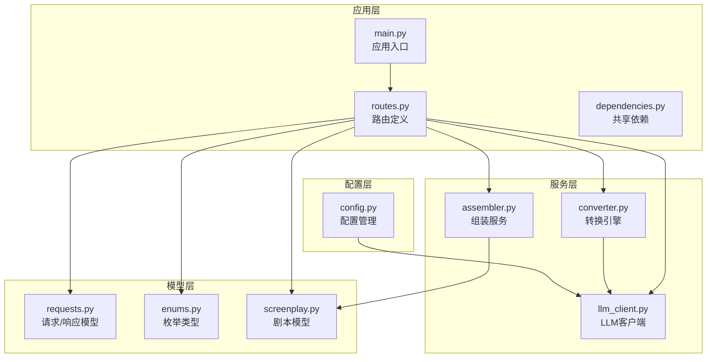
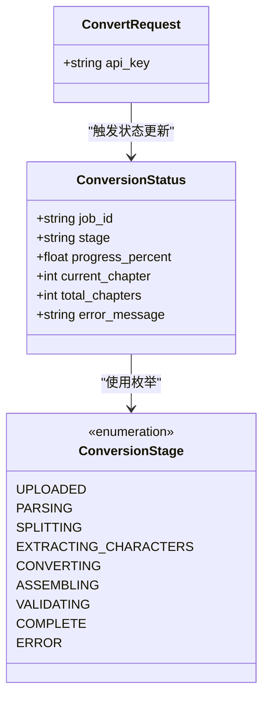
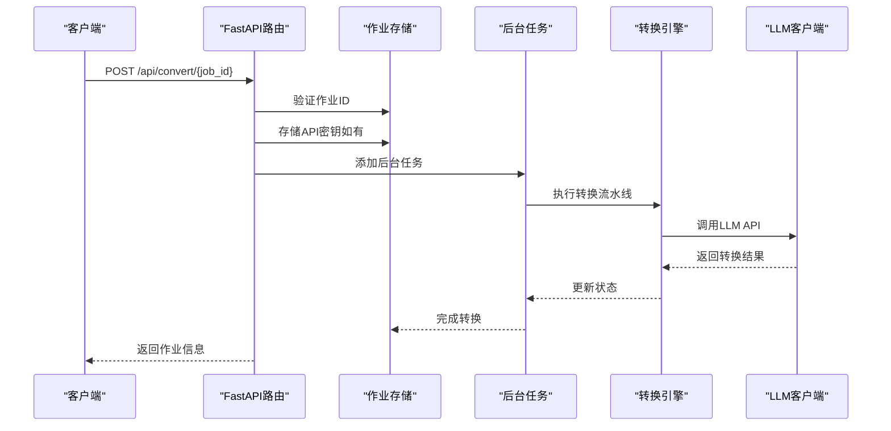
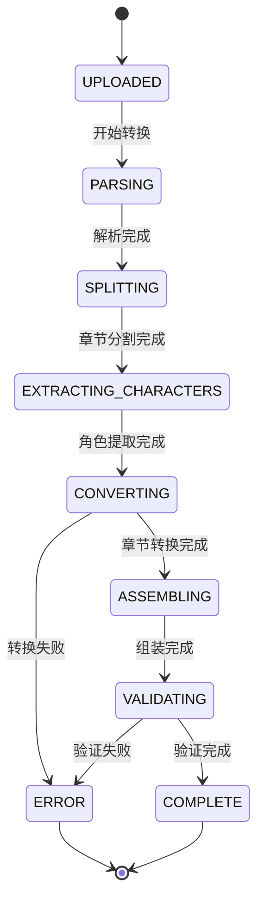
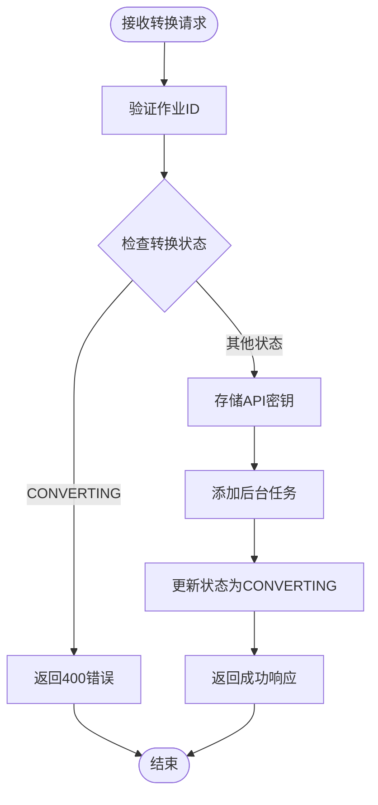
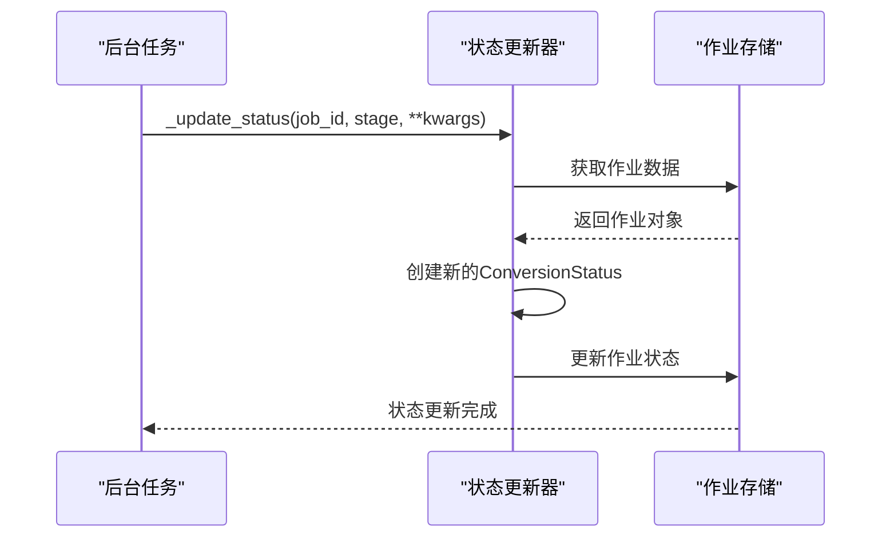
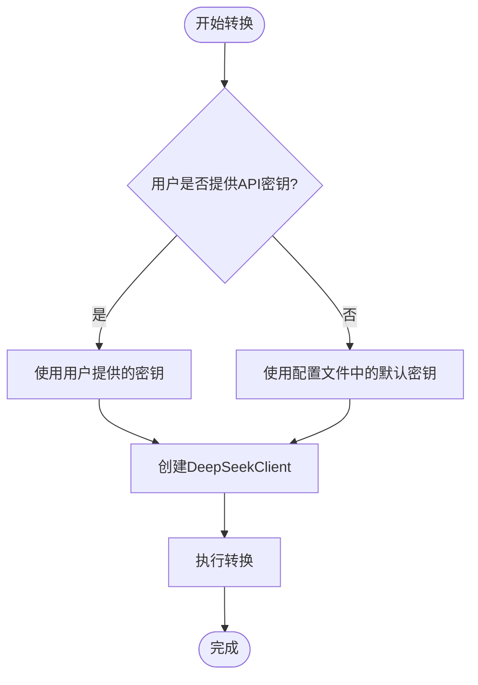
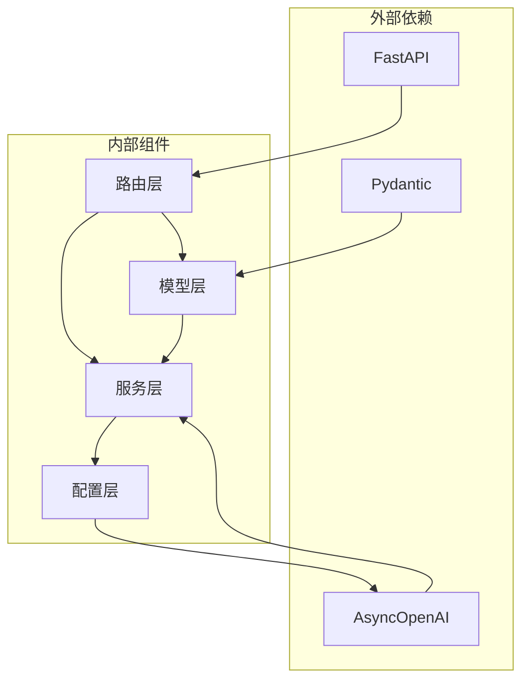

# 转换启动端点

<cite>
**本文档引用的文件**
- [routes.py](file://app/api/routes.py)
- [requests.py](file://app/models/requests.py)
- [enums.py](file://app/models/enums.py)
- [converter.py](file://app/services/converter.py)
- [llm_client.py](file://app/services/llm_client.py)
- [config.py](file://app/config.py)
- [main.py](file://app/main.py)
- [dependencies.py](file://app/dependencies.py)
- [screenplay_conversion.py](file://app/prompts/screenplay_conversion.py)
- [assembler.py](file://app/services/assembler.py)
- [README.md](file://README.md)
</cite>

## 目录
1. [简介](#简介)
2. [项目结构](#项目结构)
3. [核心组件](#核心组件)
4. [架构概览](#架构概览)
5. [详细组件分析](#详细组件分析)
6. [依赖关系分析](#依赖关系分析)
7. [性能考虑](#性能考虑)
8. [故障排除指南](#故障排除指南)
9. [结论](#结论)

## 简介

本文档详细描述了小说到剧本转换系统的转换启动端点 API。该端点允许用户启动异步转换任务，支持后台任务执行、API 密钥传递和转换状态初始化。系统基于 FastAPI 构建，采用异步编程模式，提供完整的转换流水线，从文件上传到最终的 YAML 剧本输出。

## 项目结构

转换启动端点位于应用的 API 层，采用模块化设计，主要组件包括：



**图表来源**
- [main.py:1-46](file://app/main.py#L1-L46)
- [routes.py:1-313](file://app/api/routes.py#L1-L313)
- [config.py:1-45](file://app/config.py#L1-L45)

**章节来源**
- [main.py:1-46](file://app/main.py#L1-L46)
- [routes.py:1-313](file://app/api/routes.py#L1-L313)
- [config.py:1-45](file://app/config.py#L1-L45)

## 核心组件

### 转换启动端点

转换启动端点是系统的核心入口，负责启动异步转换任务并管理转换状态。该端点实现了以下关键功能：

- **异步任务启动**：使用 FastAPI 的 BackgroundTasks 机制启动后台转换任务
- **作业ID验证**：确保提供的作业ID有效且存在
- **API密钥传递**：支持用户自定义 API 密钥覆盖默认配置
- **状态初始化**：设置初始转换状态为 UPLOADED

### 数据模型

系统使用 Pydantic 模型确保数据完整性和类型安全：



**图表来源**
- [requests.py:38-41](file://app/models/requests.py#L38-L41)
- [requests.py:14-22](file://app/models/requests.py#L14-L22)
- [enums.py:72-83](file://app/models/enums.py#L72-L83)

**章节来源**
- [requests.py:14-41](file://app/models/requests.py#L14-L41)
- [enums.py:72-83](file://app/models/enums.py#L72-L83)

## 架构概览

转换启动端点在整个系统架构中的位置和交互关系如下：



**图表来源**
- [routes.py:114-128](file://app/api/routes.py#L114-L128)
- [routes.py:208-313](file://app/api/routes.py#L208-L313)

## 详细组件分析

### 转换启动端点实现

转换启动端点位于 `routes.py` 文件中，实现了完整的转换启动逻辑：

#### 端点定义

端点路径：`POST /api/convert/{job_id}`

**请求参数：**
- **路径参数**：`job_id` (字符串) - 唯一作业标识符
- **请求体**：`ConvertRequest` 模型
- **背景任务**：`BackgroundTasks` 对象

**响应格式：**
```json
{
  "message": "Conversion started",
  "job_id": "string"
}
```

#### 转换流程状态管理

系统采用阶段化的转换状态管理，每个阶段都有明确的状态定义：



**图表来源**
- [enums.py:72-83](file://app/models/enums.py#L72-L83)
- [routes.py:219-313](file://app/api/routes.py#L219-L313)

#### 并发控制机制

系统通过内存字典 `_jobs` 实现作业存储和并发控制：



**图表来源**
- [routes.py:114-128](file://app/api/routes.py#L114-L128)
- [routes.py:34-49](file://app/api/routes.py#L34-L49)

**章节来源**
- [routes.py:114-128](file://app/api/routes.py#L114-L128)
- [routes.py:34-49](file://app/api/routes.py#L34-L49)

### 转换状态初始化

转换状态初始化过程确保每个新转换任务都有正确的起始状态：

#### 状态字段说明

| 字段名称 | 类型 | 描述 | 默认值 |
|---------|------|------|--------|
| job_id | string | 作业唯一标识符 | 必填 |
| stage | string | 当前转换阶段 | 必填 |
| progress_percent | float | 进度百分比 (0-100) | 0.0 |
| current_chapter | int | 当前转换章节号 | None |
| total_chapters | int | 总章节数 | None |
| error_message | string | 错误详情 | None |

#### 状态更新机制

状态更新通过 `_update_status` 函数实现，支持动态参数传递：



**图表来源**
- [routes.py:41-49](file://app/api/routes.py#L41-L49)
- [routes.py:219-313](file://app/api/routes.py#L219-L313)

**章节来源**
- [routes.py:41-49](file://app/api/routes.py#L41-L49)
- [routes.py:219-313](file://app/api/routes.py#L219-L313)

### API密钥传递机制

系统支持灵活的 API 密钥管理，既支持用户自定义密钥也支持配置文件中的默认密钥：

#### 密钥优先级



**图表来源**
- [routes.py:244](file://app/api/routes.py#L244)
- [llm_client.py:21-32](file://app/services/llm_client.py#L21-L32)

#### LLM客户端配置

LLM 客户端支持多种配置选项：

| 配置项 | 类型 | 默认值 | 描述 |
|--------|------|--------|------|
| api_key | string | 从环境变量读取 | DeepSeek API 密钥 |
| base_url | string | https://api.deepseek.com | API 基础URL |
| model | string | deepseek-chat | 使用的模型名称 |
| temperature | float | 0.3 | 生成温度 |
| max_output_tokens | int | 8192 | 最大输出token数 |
| timeout | int | 120秒 | 请求超时时间 |

**章节来源**
- [routes.py:244](file://app/api/routes.py#L244)
- [llm_client.py:18-103](file://app/services/llm_client.py#L18-L103)
- [config.py:18-32](file://app/config.py#L18-L32)

### 转换流水线详解

完整的转换流水线包含七个主要阶段，每个阶段都有特定的任务和状态更新：

#### 阶段1：解析 (PARSING)
- **任务**：验证上传的文件并提取文本内容
- **状态**：progress_percent = 5%
- **持续时间**：约0.1秒

#### 阶段2：章节分割 (SPLITTING)
- **任务**：使用正则表达式和启发式算法检测章节边界
- **状态**：progress_percent = 10%，记录总章节数
- **持续时间**：约0.1秒

#### 阶段3：角色提取 (EXTRACTING_CHARACTERS)
- **任务**：调用 LLM 从章节内容中提取角色信息
- **状态**：progress_percent = 20%，记录章节总数
- **持续时间**：取决于章节数量和 LLM 调用次数

#### 阶段4：章节转换 (CONVERTING)
- **任务**：逐章将小说内容转换为剧本格式
- **状态**：progress_percent = 30%，跟踪当前章节和总章节
- **持续时间**：最长阶段，取决于章节数量和 LLM 调用次数

#### 阶段5：组装 (ASSEMBLING)
- **任务**：将所有章节转换结果组装成完整的剧本
- **状态**：progress_percent = 85%，重新编号场景
- **持续时间**：相对较短

#### 阶段6：验证 (VALIDATING)
- **任务**：验证生成的剧本结构和完整性
- **状态**：progress_percent = 92%，收集验证问题
- **持续时间**：相对较短

#### 阶段7：导出 (EXPORT)
- **任务**：将剧本导出为 YAML 格式文件
- **状态**：progress_percent = 100%，保存到文件系统
- **持续时间**：相对较短

**章节来源**
- [routes.py:219-313](file://app/api/routes.py#L219-L313)
- [converter.py:36-84](file://app/services/converter.py#L36-L84)

## 依赖关系分析

转换启动端点涉及多个组件之间的复杂依赖关系：



**图表来源**
- [main.py:1-46](file://app/main.py#L1-L46)
- [routes.py:1-313](file://app/api/routes.py#L1-L313)
- [llm_client.py:1-103](file://app/services/llm_client.py#L1-L103)

### 关键依赖关系

1. **路由依赖**：`routes.py` 依赖于所有其他模块
2. **模型依赖**：数据模型独立于业务逻辑
3. **服务依赖**：转换服务依赖 LLM 客户端
4. **配置依赖**：所有组件都依赖配置管理

**章节来源**
- [main.py:1-46](file://app/main.py#L1-L46)
- [routes.py:15-24](file://app/api/routes.py#L15-L24)
- [llm_client.py:11-12](file://app/services/llm_client.py#L11-L12)

## 性能考虑

### 异步处理优势

系统采用异步编程模式，具有以下性能优势：

- **非阻塞I/O**：文件读写和网络请求不会阻塞主线程
- **并发处理**：多个转换任务可以并行执行
- **资源利用率**：更好的CPU和内存资源利用

### 内存管理

作业存储使用内存字典，需要注意以下方面：

- **内存占用**：每个作业占用一定内存空间
- **清理机制**：需要适当的作业清理策略
- **并发限制**：大量并发作业可能导致内存压力

### LLM调用优化

系统通过以下方式优化 LLM 调用：

- **批量处理**：多个章节转换可以并行进行
- **缓存机制**：重复的 LLM 调用可以缓存结果
- **超时控制**：防止长时间阻塞

## 故障排除指南

### 常见错误及解决方案

#### 404 错误：作业不存在
**原因**：提供的 job_id 无效或已过期
**解决方案**：重新上传文件获取新的 job_id

#### 400 错误：转换已在进行中
**原因**：同一作业已经启动了转换任务
**解决方案**：等待当前转换完成或使用新的作业ID

#### 500 错误：转换失败
**原因**：LLM API 调用失败或内部异常
**解决方案**：检查 API 密钥有效性，重试转换

### 状态监控最佳实践

#### SSE 状态监听
使用 Server-Sent Events 实时监控转换状态：

```javascript
const eventSource = new EventSource('/api/status/' + jobId);
eventSource.onmessage = function(event) {
    const status = JSON.parse(event.data);
    console.log('当前状态:', status.stage);
    console.log('进度:', status.progress_percent + '%');
};
```

#### JSON 状态查询
对于不支持 SSE 的客户端：

```javascript
fetch('/api/status/' + jobId + '/json')
    .then(response => response.json())
    .then(status => console.log(status));
```

### 错误处理策略

系统实现了多层次的错误处理：

1. **输入验证**：Pydantic 模型自动验证请求数据
2. **状态检查**：防止重复启动转换任务
3. **异常捕获**：后台任务中捕获并记录异常
4. **状态回滚**：发生错误时设置 ERROR 状态

**章节来源**
- [routes.py:114-128](file://app/api/routes.py#L114-L128)
- [routes.py:131-158](file://app/api/routes.py#L131-L158)
- [routes.py:210-217](file://app/api/routes.py#L210-L217)

## 结论

转换启动端点提供了完整、可靠的异步转换服务，具有以下特点：

### 核心优势
- **异步处理**：非阻塞的后台任务执行
- **状态管理**：完整的转换阶段跟踪
- **错误处理**：健壮的异常处理机制
- **灵活性**：支持用户自定义 API 密钥

### 技术特色
- **模块化设计**：清晰的组件分离和职责划分
- **类型安全**：完整的 Pydantic 模型验证
- **异步架构**：基于 asyncio 的高性能实现
- **配置管理**：灵活的环境变量配置

### 使用建议
1. **正确处理作业ID**：确保使用有效的作业ID
2. **监控转换状态**：使用 SSE 或定期查询状态
3. **处理错误情况**：实现适当的重试和错误恢复机制
4. **优化性能**：合理控制并发转换任务数量

该端点为小说到剧本的自动化转换提供了坚实的技术基础，支持大规模文本处理和高质量的剧本生成。