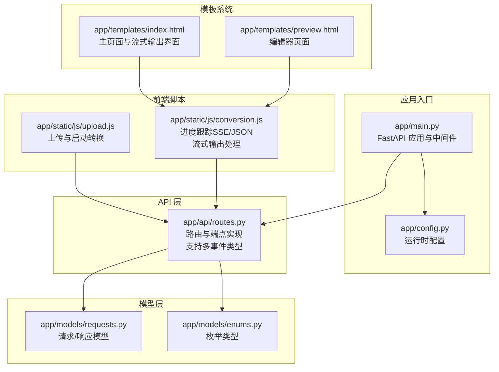
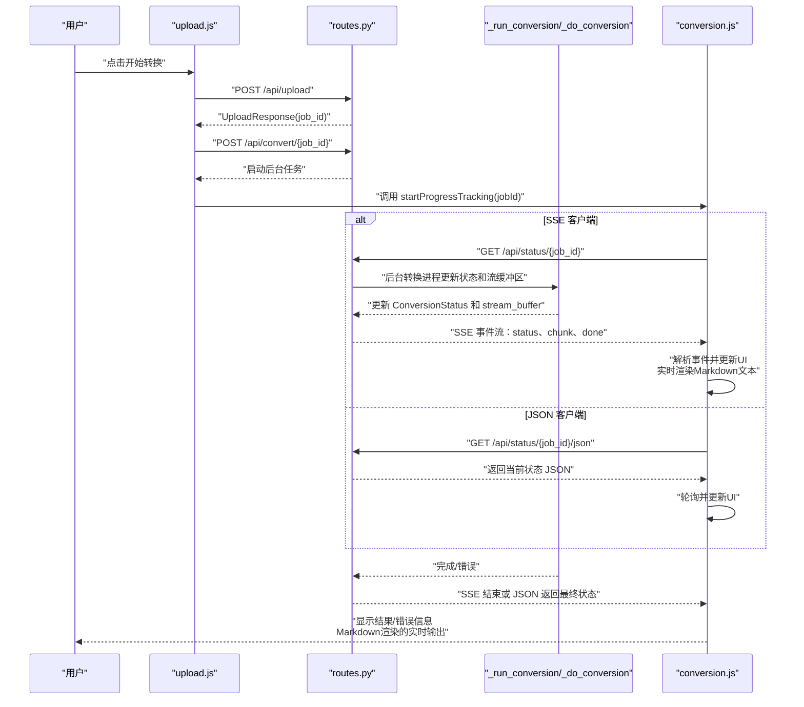
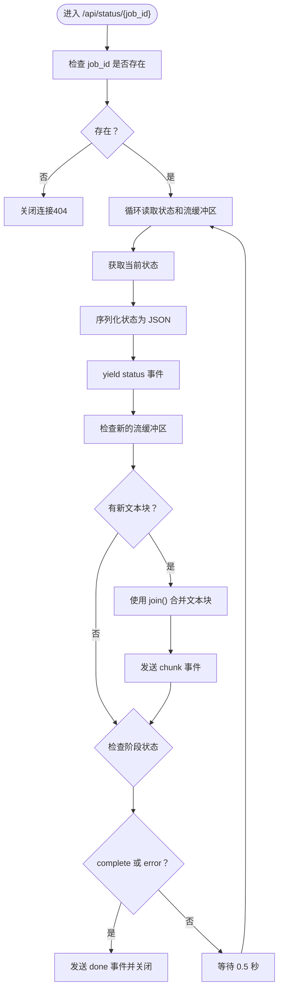
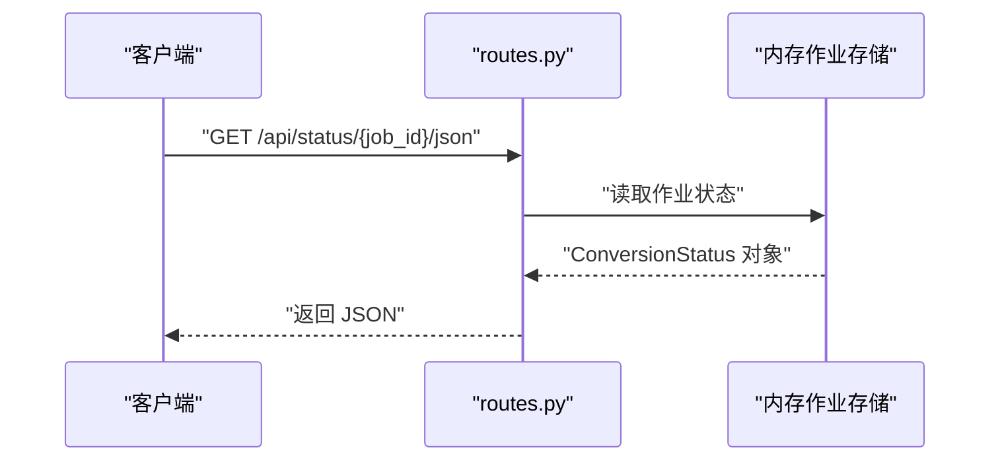
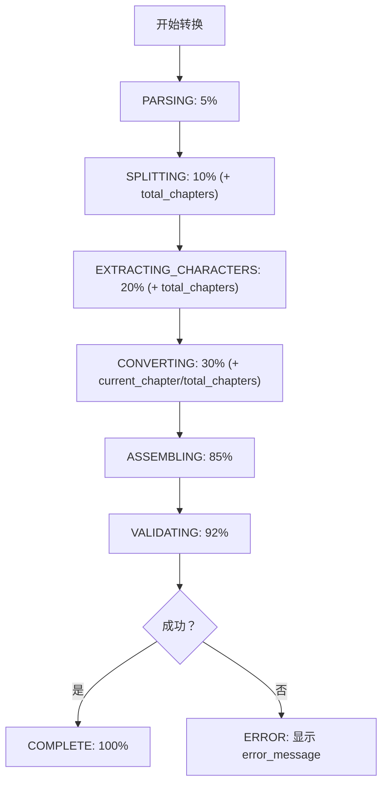
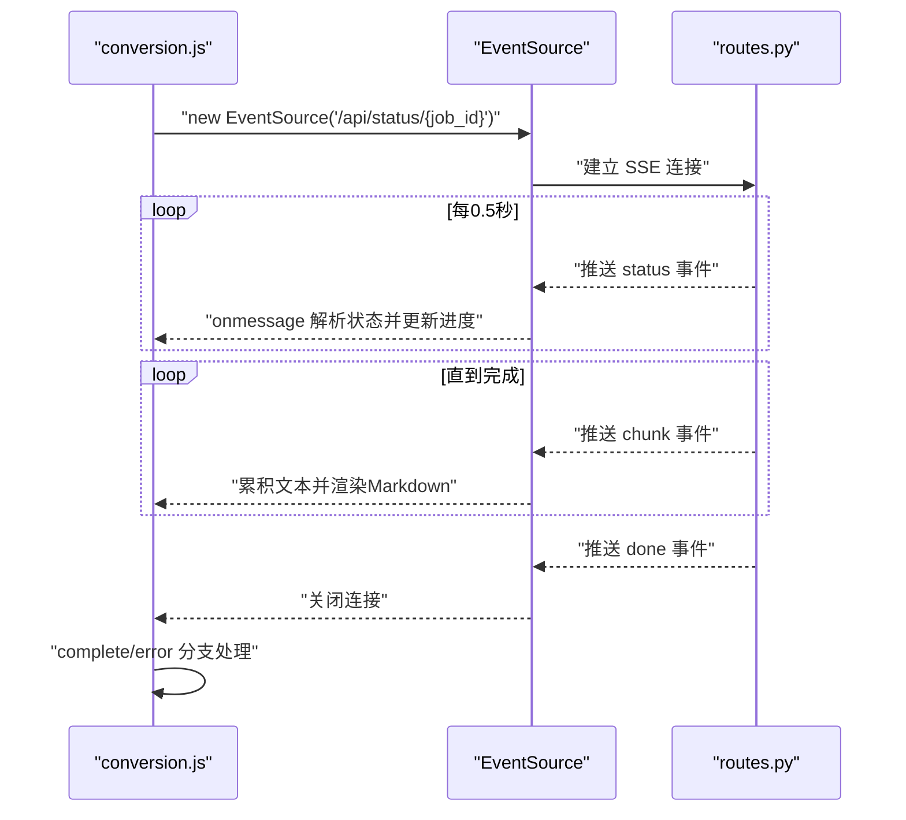
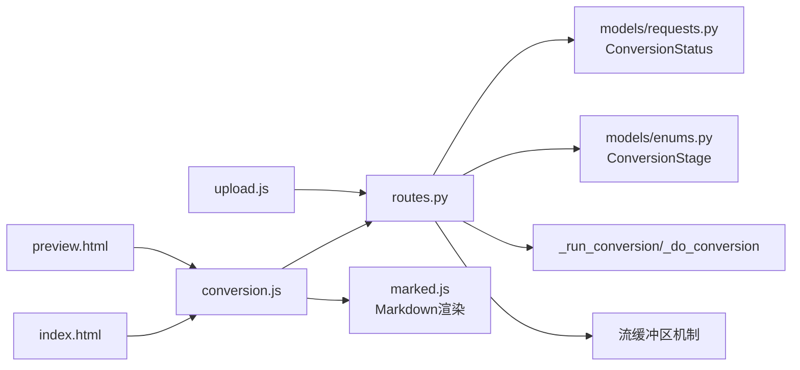

# 进度监控端点

<cite>
**本文档引用的文件**
- [app/api/routes.py](file://app/api/routes.py)
- [app/models/requests.py](file://app/models/requests.py)
- [app/models/enums.py](file://app/models/enums.py)
- [app/static/js/conversion.js](file://app/static/js/conversion.js)
- [app/static/js/upload.js](file://app/static/js/upload.js)
- [app/templates/index.html](file://app/templates/index.html)
- [app/templates/preview.html](file://app/templates/preview.html)
- [app/main.py](file://app/main.py)
- [app/config.py](file://app/config.py)
</cite>

## 更新摘要
**变更内容**
- 更新SSE端点实现，优化字符串格式化性能，移除不必要的字符串拼接操作
- 改进高频率更新时的性能表现，特别是在流式文本传输场景
- 保持原有的SSE多事件类型支持和实时状态推送机制

## 目录
1. [简介](#简介)
2. [项目结构](#项目结构)
3. [核心组件](#核心组件)
4. [架构总览](#架构总览)
5. [详细组件分析](#详细组件分析)
6. [依赖关系分析](#依赖关系分析)
7. [性能考量](#性能考量)
8. [故障排查指南](#故障排查指南)
9. [结论](#结论)
10. [附录](#附录)

## 简介
本文件聚焦于"进度监控端点"的详细API文档，涵盖以下两个端点：
- GET /api/status/{job_id}：基于 Server-Sent Events（SSE）的实时状态流，支持状态更新和文本块流式传输
- GET /api/status/{job_id}/json：返回当前转换状态的JSON响应（用于非SSE客户端的降级）

文档将深入说明：
- SSE 实现原理与多事件格式（status、chunk、done）
- 实时文本块流式传输机制
- 连接管理与生命周期控制
- 转换状态枚举（ConversionStage）与进度百分比计算
- 实时状态推送机制
- SSE 客户端实现示例与JSON端点使用方法
- 错误处理策略、浏览器兼容性与降级方案

## 项目结构
围绕进度监控端点的相关模块与职责划分如下：
- 路由层：定义并实现进度监控相关的API端点，支持多事件类型
- 模型层：定义状态模型与枚举类型
- 前端脚本：演示SSE与JSON两种模式的客户端实现，支持流式输出
- 模板系统：提供实时输出展示界面，支持Markdown渲染
- 应用入口与配置：提供运行时环境与中间件设置

**图表来源**
- [app/main.py:14-46](file://app/main.py#L14-L46)
- [app/api/routes.py:151-200](file://app/api/routes.py#L151-L200)
- [app/models/requests.py:14-22](file://app/models/requests.py#L14-L22)
- [app/models/enums.py:72-83](file://app/models/enums.py#L72-L83)
- [app/static/js/conversion.js:1-177](file://app/static/js/conversion.js#L1-L177)
- [app/static/js/upload.js:1-146](file://app/static/js/upload.js#L1-L146)
- [app/templates/index.html:115-124](file://app/templates/index.html#L115-L124)
- [app/templates/preview.html:140-153](file://app/templates/preview.html#L140-L153)

**章节来源**
- [app/main.py:14-46](file://app/main.py#L14-L46)
- [app/api/routes.py:151-200](file://app/api/routes.py#L151-L200)
- [app/models/requests.py:14-22](file://app/models/requests.py#L14-L22)
- [app/models/enums.py:72-83](file://app/models/enums.py#L72-L83)
- [app/static/js/conversion.js:1-177](file://app/static/js/conversion.js#L1-L177)
- [app/static/js/upload.js:1-146](file://app/static/js/upload.js#L1-L146)
- [app/templates/index.html:115-124](file://app/templates/index.html#L115-L124)
- [app/templates/preview.html:140-153](file://app/templates/preview.html#L140-L153)

## 核心组件
- 进度监控端点
  - SSE 端点：GET /api/status/{job_id}，支持多事件类型
  - JSON 端点：GET /api/status/{job_id}/json
- 状态模型与枚举
  - ConversionStatus：包含 job_id、stage、progress_percent、current_chapter、total_chapters、error_message
  - ConversionStage：枚举转换阶段（uploaded、parsing、splitting、extracting_characters、converting、assembling、validating、complete、error）
- 前端脚本
  - conversion.js：演示SSE与轮询两种进度跟踪方式，支持流式文本输出
  - upload.js：触发上传与转换，并调用进度跟踪
- 模板系统
  - index.html：主页面，包含实时输出展示区域
  - preview.html：编辑器页面，支持多种流式输出场景

**章节来源**
- [app/api/routes.py:151-200](file://app/api/routes.py#L151-L200)
- [app/models/requests.py:14-22](file://app/models/requests.py#L14-L22)
- [app/models/enums.py:72-83](file://app/models/enums.py#L72-L83)
- [app/static/js/conversion.js:1-177](file://app/static/js/conversion.js#L1-L177)
- [app/static/js/upload.js:1-146](file://app/static/js/upload.js#L1-L146)
- [app/templates/index.html:115-124](file://app/templates/index.html#L115-L124)
- [app/templates/preview.html:140-153](file://app/templates/preview.html#L140-L153)

## 架构总览
下图展示从用户操作到实时进度反馈的整体流程，包括SSE与JSON两种客户端路径，以及新增的流式文本传输机制。

**图表来源**
- [app/static/js/upload.js:90-144](file://app/static/js/upload.js#L90-L144)
- [app/api/routes.py:131-149](file://app/api/routes.py#L131-L149)
- [app/api/routes.py:151-200](file://app/api/routes.py#L151-L200)
- [app/api/routes.py:527-709](file://app/api/routes.py#L527-L709)
- [app/static/js/conversion.js:40-83](file://app/static/js/conversion.js#L40-L83)

## 详细组件分析

### SSE 端点：GET /api/status/{job_id}
- 功能概述
  - 以 Server-Sent Events 形式持续推送转换状态和实时文本块，直到达到完成或错误阶段
  - 支持三种事件类型：status（状态更新）、chunk（文本块）、done（转换完成）
- 实现要点
  - 事件生成器在循环中读取当前状态和流缓冲区
  - 发送状态更新事件和新的文本块事件
  - 当状态为 complete 或 error 时发送 done 事件并停止推送
  - 设置合适的HTTP头以禁用缓存、保持连接、避免代理缓冲
- 事件格式
  - status 事件：包含完整的 ConversionStatus 对象
  - chunk 事件：包含新增的文本块数据
  - done 事件：空数据，表示转换完成
- 连接管理
  - 客户端应正确处理连接中断与重连
  - 服务器端在作业不存在时会主动终止流

**更新** 优化了字符串格式化性能，使用 `"".join()` 替代多次字符串拼接，提高高频率更新时的性能表现

**图表来源**
- [app/api/routes.py:151-200](file://app/api/routes.py#L151-L200)

**章节来源**
- [app/api/routes.py:151-200](file://app/api/routes.py#L151-L200)

### JSON 端点：GET /api/status/{job_id}/json
- 功能概述
  - 返回当前转换状态的JSON对象，便于非SSE客户端轮询
- 返回字段
  - job_id：作业标识
  - stage：当前阶段（字符串枚举值）
  - progress_percent：进度百分比（0-100）
  - current_chapter：当前正在转换的章节号（可选）
  - total_chapters：检测到的总章节数（可选）
  - error_message：错误详情（当 stage 为 error 时）

**图表来源**
- [app/api/routes.py:203-207](file://app/api/routes.py#L203-L207)
- [app/models/requests.py:14-22](file://app/models/requests.py#L14-L22)

**章节来源**
- [app/api/routes.py:203-207](file://app/api/routes.py#L203-L207)
- [app/models/requests.py:14-22](file://app/models/requests.py#L14-L22)

### 转换状态与进度计算
- 状态枚举（ConversionStage）
  - uploaded：文件已上传
  - parsing：解析文件内容
  - splitting：检测章节
  - extracting_characters：提取角色
  - converting：逐章转换
  - assembling：组装剧本
  - validating：验证输出
  - complete：完成
  - error：发生错误
- 进度百分比（progress_percent）
  - 在不同阶段按固定权重推进
  - 在 converting 阶段，根据 total_chapters 与 current_chapter 动态计算
  - 示例计算逻辑：30 + (50 × 当前章节/总章节)
- 章节信息
  - total_chapters：检测到的章节总数
  - current_chapter：当前正在转换的章节号

**图表来源**
- [app/api/routes.py:536-709](file://app/api/routes.py#L536-L709)
- [app/models/enums.py:72-83](file://app/models/enums.py#L72-L83)

**章节来源**
- [app/api/routes.py:536-709](file://app/api/routes.py#L536-L709)
- [app/models/enums.py:72-83](file://app/models/enums.py#L72-L83)

### SSE 客户端实现示例
- 前端脚本 conversion.js 展示了两种进度跟踪方式：
  - SSE：使用 EventSource 接收事件流，解析 data 字段并更新UI
  - 轮询：当无法使用SSE时回退到定时轮询 /api/status/{job_id}/json
- 多事件处理
  - status 事件：更新进度条、阶段标签等UI元素
  - chunk 事件：累积文本并实时渲染为Markdown
  - done 事件：关闭连接，显示结果
- 关键行为
  - 根据 stage 更新进度标签与百分比
  - 在 complete 时显示结果与下载链接
  - 在 error 时显示错误信息并允许重试
  - 实时Markdown渲染，支持标题、列表、代码块等格式

**图表来源**
- [app/static/js/conversion.js:40-83](file://app/static/js/conversion.js#L40-L83)
- [app/api/routes.py:151-200](file://app/api/routes.py#L151-L200)

**章节来源**
- [app/static/js/conversion.js:1-177](file://app/static/js/conversion.js#L1-L177)
- [app/api/routes.py:151-200](file://app/api/routes.py#L151-L200)

### JSON 端点使用方法
- 客户端轮询策略
  - 每隔固定时间（如1.5秒）请求一次 /api/status/{job_id}/json
  - 根据 stage 判断是否继续轮询
  - complete 时停止轮询并处理结果
  - error 时停止轮询并提示错误
- 适用场景
  - 无法使用SSE的环境（如某些代理/CDN）
  - 简单的非浏览器客户端

**章节来源**
- [app/static/js/conversion.js:85-111](file://app/static/js/conversion.js#L85-L111)
- [app/api/routes.py:203-207](file://app/api/routes.py#L203-L207)

### 错误处理策略
- 作业不存在
  - SSE：连接建立后若作业不存在，服务器会主动终止流
  - JSON：返回404，客户端应停止轮询并提示错误
- 转换过程中异常
  - 后台任务捕获异常并设置 stage 为 error，同时记录 error_message
  - SSE：在最后一次事件后终止流
  - JSON：轮询返回 error 状态，客户端显示错误信息
- 重复启动转换
  - 若作业已在 converting 阶段，再次启动会返回400

**章节来源**
- [app/api/routes.py:43-47](file://app/api/routes.py#L43-L47)
- [app/api/routes.py:136-137](file://app/api/routes.py#L136-L137)
- [app/api/routes.py:527-534](file://app/api/routes.py#L527-L534)

### 流式文本传输机制
- 流缓冲区设计
  - 后台转换任务维护 stream_buffer 列表，累积生成的文本块
  - SSE端点通过比较 last_chunk_count 与当前缓冲区长度来识别新文本块
- 文本块生成
  - 转换过程中的各个阶段都会向流缓冲区添加描述性文本
  - 包括文件解析、章节检测、角色提取、章节转换等过程信息
- 实时渲染
  - 前端使用 marked.js 库将累积的Markdown文本实时渲染为HTML
  - 自动滚动到底部，确保用户看到最新的输出
- 事件类型
  - status：标准状态更新事件
  - chunk：新增文本块事件
  - done：转换完成事件

**更新** 优化了文本块合并算法，使用 `"".join(new_chunks)` 替代传统的字符串拼接方式，显著提升高频率更新场景下的性能表现

**章节来源**
- [app/api/routes.py:120](file://app/api/routes.py#L120)
- [app/api/routes.py:177-184](file://app/api/routes.py#L177-L184)
- [app/api/routes.py:542-544](file://app/api/routes.py#L542-L544)
- [app/static/js/conversion.js:63-72](file://app/static/js/conversion.js#L63-L72)

## 依赖关系分析
- 路由依赖
  - routes.py 依赖 models/requests.py 中的 ConversionStatus 与枚举
  - routes.py 依赖 models/enums.py 中的 ConversionStage
  - routes.py 依赖后台转换函数 _run_conversion/_do_conversion
  - routes.py 依赖流式输出机制（stream_buffer）
- 前端依赖
  - conversion.js 依赖 routes.py 的 SSE/JSON 端点
  - conversion.js 依赖 marked.js 进行Markdown渲染
  - upload.js 依赖 routes.py 的上传与启动转换端点
- 模板依赖
  - index.html 依赖 conversion.js 进行进度跟踪
  - preview.html 依赖 conversion.js 进行编辑器功能

**图表来源**
- [app/api/routes.py:13-24](file://app/api/routes.py#L13-L24)
- [app/models/requests.py:14-22](file://app/models/requests.py#L14-L22)
- [app/models/enums.py:72-83](file://app/models/enums.py#L72-L83)
- [app/static/js/conversion.js:1-177](file://app/static/js/conversion.js#L1-L177)
- [app/static/js/upload.js:1-146](file://app/static/js/upload.js#L1-L146)
- [app/templates/index.html:115-124](file://app/templates/index.html#L115-L124)
- [app/templates/preview.html:140-153](file://app/templates/preview.html#L140-L153)

**章节来源**
- [app/api/routes.py:13-24](file://app/api/routes.py#L13-L24)
- [app/models/requests.py:14-22](file://app/models/requests.py#L14-L22)
- [app/models/enums.py:72-83](file://app/models/enums.py#L72-L83)
- [app/static/js/conversion.js:1-177](file://app/static/js/conversion.js#L1-L177)
- [app/static/js/upload.js:1-146](file://app/static/js/upload.js#L1-L146)
- [app/templates/index.html:115-124](file://app/templates/index.html#L115-L124)
- [app/templates/preview.html:140-153](file://app/templates/preview.html#L140-L153)

## 性能考量
- SSE 连接
  - 服务器端每0.5秒推送一次，适合低延迟实时反馈
  - 注意代理/网关对长连接与缓冲的限制
- 流式输出优化
  - 使用增量文本块传输，避免一次性发送大量数据
  - 前端使用累积渲染策略，减少DOM操作次数
  - Markdown渲染使用marked.js库，支持高效HTML转换
  - **优化**：采用 `"".join()` 合并文本块，避免字符串拼接开销
- 轮询策略
  - 建议轮询间隔适中（如1.5秒），避免过度请求
  - 在 complete/error 后及时停止轮询
- 状态更新频率
  - 转换过程中的状态更新由后台任务驱动，SSE/JSON端点仅读取现有状态
  - 避免在客户端频繁发起请求导致不必要的负载

**更新** SSE实现已优化字符串格式化性能，使用高效的字符串合并算法，特别适用于高频率更新场景

## 故障排查指南
- 无法接收SSE事件
  - 检查网络代理/CDN是否支持SSE
  - 确认服务器端已设置正确的响应头（Cache-Control、Connection、X-Accel-Buffering）
  - 在浏览器开发者工具中查看网络面板的事件流
- 轮询返回404
  - 确认 job_id 是否正确且作业尚未过期
  - 检查作业是否存在（_jobs字典）
- 进度停滞
  - 检查后台转换任务是否仍在运行
  - 查看日志中是否有异常并导致状态停留在某个阶段
- 错误状态
  - 查看 error_message 字段了解具体错误原因
  - 重新尝试转换或修正输入
- 流式输出问题
  - 检查marked.js库是否正确加载
  - 确认stream_buffer中是否有新增文本块
  - 验证Markdown语法格式是否正确

**章节来源**
- [app/api/routes.py:192-200](file://app/api/routes.py#L192-L200)
- [app/api/routes.py:43-47](file://app/api/routes.py#L43-L47)
- [app/api/routes.py:527-534](file://app/api/routes.py#L527-L534)
- [app/static/js/conversion.js:63-72](file://app/static/js/conversion.js#L63-L72)

## 结论
- SSE 端点提供低延迟、高效的实时进度反馈和流式文本输出；JSON 端点为非SSE环境提供可靠降级方案
- 多事件类型设计（status、chunk、done）支持更丰富的交互体验
- 状态模型与枚举确保前后端一致的状态表达与进度计算
- 前端脚本展示了SSE与轮询两种实现路径，具备良好的兼容性与可维护性
- 实时Markdown渲染增强了用户体验，提供更好的可视化反馈
- **优化**：SSE实现已优化字符串格式化性能，在高频率更新场景下表现更佳
- 建议在生产环境中结合代理/网关配置优化SSE传输，并为非SSE客户端提供稳定的轮询策略

## 附录

### API 定义与使用说明
- GET /api/status/{job_id}
  - 响应类型：text/event-stream
  - 事件格式：支持三种事件类型
    - status：data: JSON（序列化后的 ConversionStatus）
    - chunk：data: {"text": "新增文本块"}
    - done：data: {}
  - 生命周期：直到 stage 为 complete 或 error
  - 适用：支持SSE的浏览器/客户端
- GET /api/status/{job_id}/json
  - 响应类型：application/json
  - 返回：当前状态对象（包含 job_id、stage、progress_percent、current_chapter、total_chapters、error_message）
  - 适用：非SSE客户端或降级场景

**章节来源**
- [app/api/routes.py:151-200](file://app/api/routes.py#L151-L200)
- [app/api/routes.py:203-207](file://app/api/routes.py#L203-L207)
- [app/models/requests.py:14-22](file://app/models/requests.py#L14-L22)

### 浏览器兼容性与降级方案
- SSE 兼容性
  - 现代浏览器普遍支持 EventSource
  - 代理/CDN可能对SSE有特殊限制，需在部署时进行配置
- 降级方案
  - 使用 conversion.js 中的轮询逻辑作为默认策略
  - 在检测到SSE不可用时再回退到轮询
- 建议
  - 在前端初始化时优先尝试SSE，失败后自动切换至轮询
  - 轮询间隔建议在1-2秒之间，避免过度请求
- Markdown渲染
  - marked.js库提供跨浏览器的Markdown渲染支持
  - 确保在离线环境下也能正常工作

**章节来源**
- [app/static/js/conversion.js:1-177](file://app/static/js/conversion.js#L1-L177)
- [app/templates/index.html:6-7](file://app/templates/index.html#L6-L7)