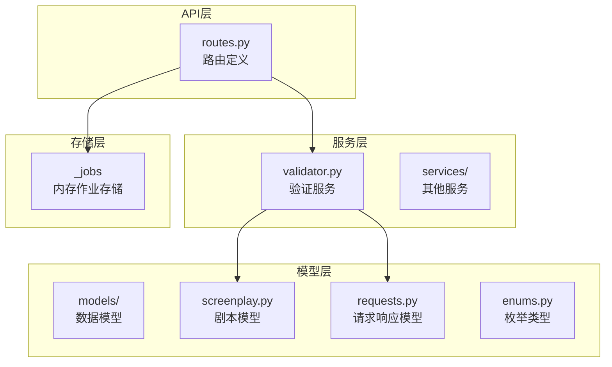
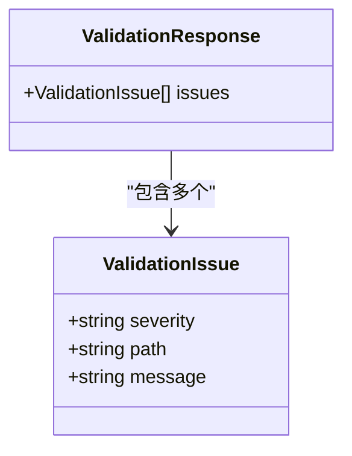
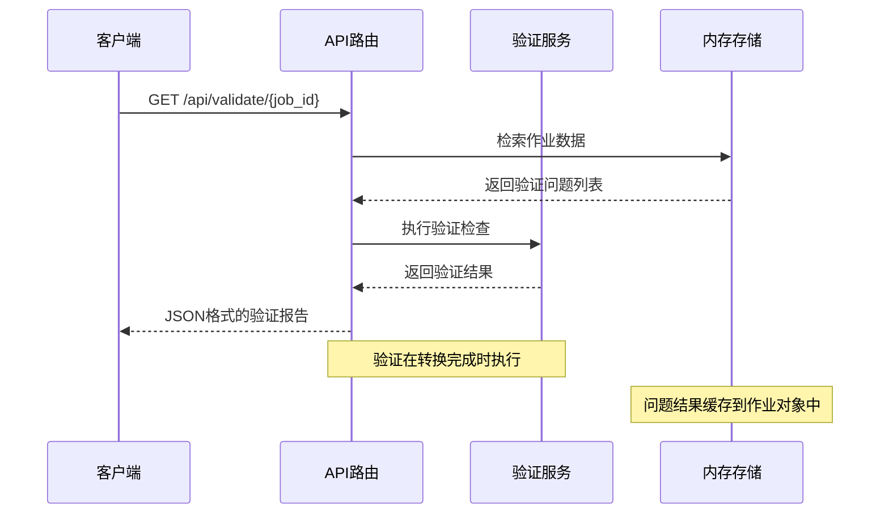
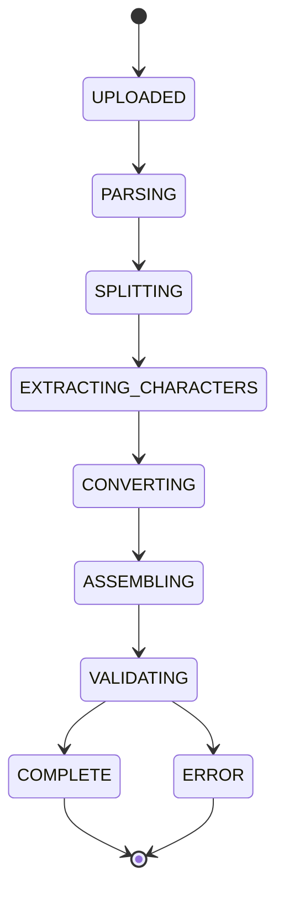
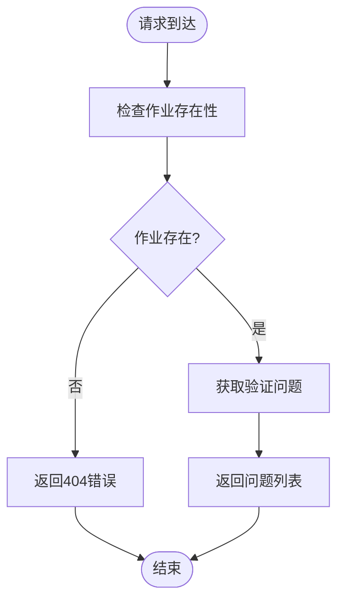
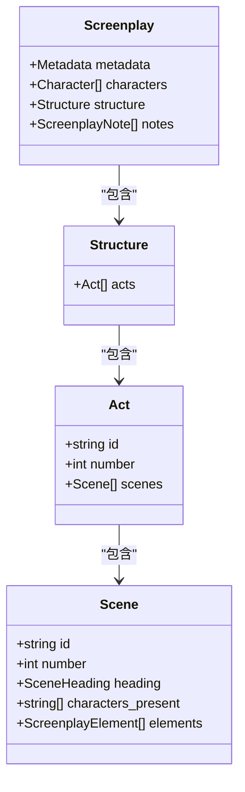
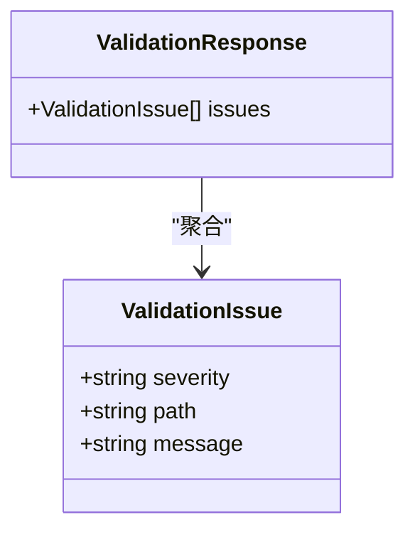
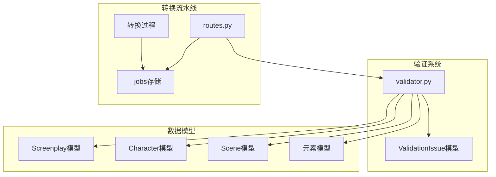

# 验证结果端点

<cite>
**本文档引用的文件**
- [routes.py](file://app/api/routes.py)
- [validator.py](file://app/services/validator.py)
- [screenplay.py](file://app/models/screenplay.py)
- [requests.py](file://app/models/requests.py)
- [enums.py](file://app/models/enums.py)
- [test_validator.py](file://tests/test_validator.py)
- [YAML_SCHEMA.md](file://docs/YAML_SCHEMA.md)
- [conversion.js](file://app/static/js/conversion.js)
</cite>

## 目录
1. [简介](#简介)
2. [项目结构](#项目结构)
3. [核心组件](#核心组件)
4. [架构概览](#架构概览)
5. [详细组件分析](#详细组件分析)
6. [依赖关系分析](#依赖关系分析)
7. [性能考虑](#性能考虑)
8. [故障排除指南](#故障排除指南)
9. [结论](#结论)

## 简介

本文档详细描述了验证结果端点 `GET /api/validate/{job_id}` 的功能和实现。该端点用于获取已完成转换的剧本验证结果，提供结构完整性检查、错误报告格式和验证状态信息。系统通过验证服务对生成的剧本进行多层次检查，确保输出符合行业标准和内部约束。

## 项目结构

验证系统位于小说到剧本转换应用的核心架构中，采用模块化设计：

**图表来源**
- [routes.py:1-313](file://app/api/routes.py#L1-L313)
- [validator.py:1-111](file://app/services/validator.py#L1-L111)
- [screenplay.py:1-167](file://app/models/screenplay.py#L1-L167)
- [requests.py:1-41](file://app/models/requests.py#L1-L41)

**章节来源**
- [routes.py:1-313](file://app/api/routes.py#L1-L313)
- [validator.py:1-111](file://app/services/validator.py#L1-L111)

## 核心组件

验证结果端点是转换流水线中的关键组件，负责提供验证状态和问题报告：

### 端点定义
- **路径**: `/api/validate/{job_id}`
- **方法**: GET
- **功能**: 获取已完成转换的剧本验证结果
- **返回格式**: JSON 对象，包含问题数组

### 验证流程
1. **作业状态检查**: 验证目标作业是否存在且已完成
2. **验证结果检索**: 从内存存储中获取已记录的问题
3. **格式化输出**: 返回标准化的问题列表

### 数据结构
验证结果采用统一的数据结构，确保前后端一致性：

**图表来源**
- [requests.py:24-29](file://app/models/requests.py#L24-L29)

**章节来源**
- [routes.py:201-206](file://app/api/routes.py#L201-L206)
- [requests.py:24-29](file://app/models/requests.py#L24-L29)

## 架构概览

验证系统在整个转换流水线中扮演着质量控制的关键角色：

**图表来源**
- [routes.py:201-206](file://app/api/routes.py#L201-L206)
- [validator.py:11-111](file://app/services/validator.py#L11-L111)

### 验证状态检查
系统通过转换阶段枚举跟踪验证状态：

**图表来源**
- [enums.py:72-83](file://app/models/enums.py#L72-L83)

**章节来源**
- [routes.py:291-310](file://app/api/routes.py#L291-L310)
- [enums.py:72-83](file://app/models/enums.py#L72-L83)

## 详细组件分析

### 验证结果端点实现

#### 端点行为
验证端点提供以下功能特性：
- **异步访问**: 支持实时验证结果查询
- **错误处理**: 对不存在的作业返回适当的HTTP状态码
- **数据完整性**: 确保只返回已完成转换的验证结果

#### 错误处理机制

**图表来源**
- [routes.py:34-38](file://app/api/routes.py#L34-L38)
- [routes.py:201-206](file://app/api/routes.py#L201-L206)

### 验证服务实现

#### 验证规则集
验证服务执行多层次检查：

1. **元数据完整性检查**
   - 标题字段验证
   - 作者信息验证
   - 类型字段验证

2. **结构完整性检查**
   - 幕数验证（至少一个幕）
   - 场景完整性（每个幕至少一个场景）
   - 元素完整性（每个场景至少一个元素）

3. **交叉引用验证**
   - 角色ID有效性检查
   - 场景角色列表验证
   - 关系完整性检查

#### 严重程度分类
验证问题按严重程度分为两类：

| 严重程度 | 描述 | 影响 |
|---------|------|------|
| error | 严重错误，阻止转换完成 | 必须修复 |
| warning | 警告信息，不影响转换完成 | 建议修复 |

**章节来源**
- [validator.py:11-111](file://app/services/validator.py#L11-L111)

### 数据模型分析

#### 剧本结构模型
验证系统基于严格的Pydantic模型：

**图表来源**
- [screenplay.py:161-167](file://app/models/screenplay.py#L161-L167)
- [screenplay.py:145-148](file://app/models/screenplay.py#L145-L148)
- [screenplay.py:134-141](file://app/models/screenplay.py#L134-L141)
- [screenplay.py:120-130](file://app/models/screenplay.py#L120-L130)

#### 验证问题模型

**图表来源**
- [requests.py:24-29](file://app/models/requests.py#L24-L29)

**章节来源**
- [screenplay.py:1-167](file://app/models/screenplay.py#L1-L167)
- [requests.py:24-29](file://app/models/requests.py#L24-L29)

## 依赖关系分析

验证系统与其他组件的依赖关系：

**图表来源**
- [validator.py:5-6](file://app/services/validator.py#L5-L6)
- [routes.py:21-23](file://app/api/routes.py#L21-L23)

### 外部依赖
- **Pydantic**: 数据验证和序列化
- **FastAPI**: Web框架和路由处理
- **AsyncIO**: 异步任务处理

**章节来源**
- [validator.py:1-111](file://app/services/validator.py#L1-L111)
- [routes.py:1-313](file://app/api/routes.py#L1-L313)

## 性能考虑

### 内存存储优化
验证结果存储在内存字典中，具有以下特点：
- **快速访问**: O(1) 时间复杂度的查找操作
- **内存效率**: 避免数据库开销
- **生命周期管理**: 作业完成后保持在内存中供查询

### 异步处理优势
- **非阻塞**: 验证过程不影响主线程
- **并发支持**: 支持多个同时进行的转换任务
- **资源利用**: 有效利用系统资源

## 故障排除指南

### 常见问题诊断

#### 1. 验证端点返回404错误
**症状**: `{"detail":"Job not found"}`

**可能原因**:
- 作业ID无效或不存在
- 作业已完成但已被清理
- 请求路径错误

**解决方案**:
- 确认作业ID正确性
- 检查作业状态是否为COMPLETE
- 验证API端点路径

#### 2. 验证结果为空数组
**症状**: `{"issues": []}`

**可能原因**:
- 转换尚未完成
- 验证通过无问题
- 作业数据未正确存储

**解决方案**:
- 等待转换完成后再查询
- 检查转换日志
- 验证作业状态

#### 3. 验证错误类型识别

| 错误类型 | 严重程度 | 描述 | 解决方案 |
|---------|---------|------|---------|
| 缺少标题 | error | metadata.title为空 | 添加有效的作品标题 |
| 无幕结构 | error | structure.acts为空 | 确保有至少一个幕 |
| 角色引用无效 | error | character_id不存在 | 检查角色ID拼写 |
| 场景无元素 | warning | scene.elements为空 | 添加至少一个场景元素 |
| 角色列表无效 | warning | characters_present引用不存在 | 更新角色列表 |

### 验证失败处理策略

#### 错误恢复机制
1. **自动重试**: 系统自动重试失败的转换
2. **手动干预**: 提供详细的错误报告便于修复
3. **增量更新**: 支持部分修复后的重新验证

#### 重新转换触发条件
- 验证结果显示严重错误
- 用户主动请求重新转换
- 系统检测到数据完整性问题

**章节来源**
- [validator.py:11-111](file://app/services/validator.py#L11-L111)
- [test_validator.py:19-63](file://tests/test_validator.py#L19-L63)

## 结论

验证结果端点 `GET /api/validate/{job_id}` 提供了完整的剧本质量控制功能。通过多层次的验证检查、清晰的问题报告格式和完善的错误处理机制，系统确保生成的剧本符合行业标准和内部约束。

### 主要优势
1. **全面性**: 覆盖元数据、结构和交叉引用的完整验证
2. **实时性**: 支持转换过程中的实时状态查询
3. **可扩展性**: 基于Pydantic模型的灵活数据结构
4. **用户友好**: 清晰的问题描述和修复建议

### 未来改进方向
1. **持久化存储**: 将验证结果持久化到数据库
2. **增量验证**: 支持部分文档的验证
3. **自定义规则**: 允许用户定义特定的验证规则
4. **性能优化**: 实现验证结果的缓存机制

该端点作为转换流水线的质量控制中心，为用户提供可靠的验证反馈，确保最终输出的剧本质量和一致性。