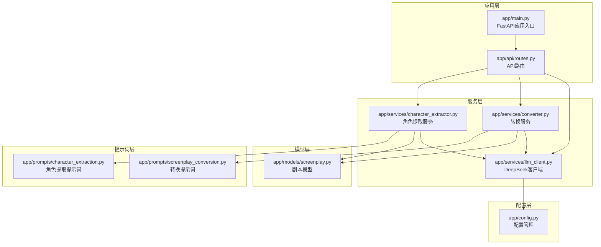
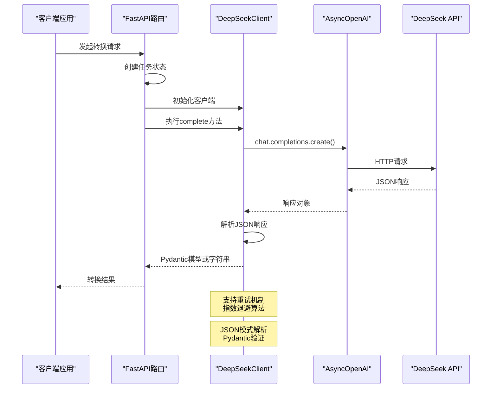
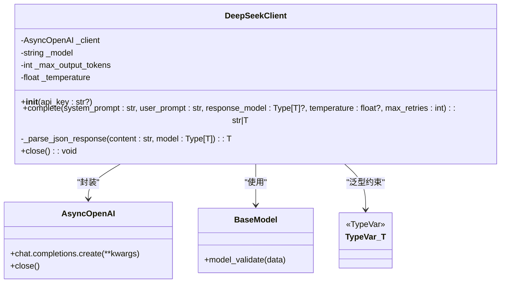
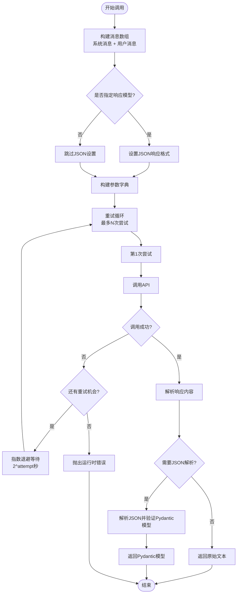
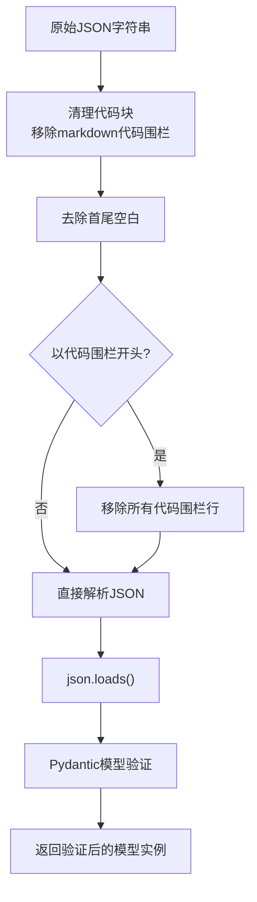
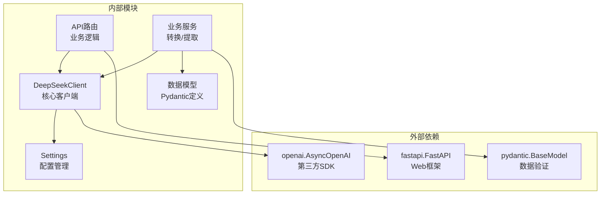

# LLM客户端实现

<cite>
**本文档引用的文件**
- [app/services/llm_client.py](file://app/services/llm_client.py)
- [app/config.py](file://app/config.py)
- [app/main.py](file://app/main.py)
- [app/api/routes.py](file://app/api/routes.py)
- [app/services/converter.py](file://app/services/converter.py)
- [app/services/character_extractor.py](file://app/services/character_extractor.py)
- [app/models/screenplay.py](file://app/models/screenplay.py)
- [app/prompts/screenplay_conversion.py](file://app/prompts/screenplay_conversion.py)
- [app/prompts/character_extraction.py](file://app/prompts/character_extraction.py)
- [README.md](file://README.md)
</cite>

## 目录
1. [简介](#简介)
2. [项目结构](#项目结构)
3. [核心组件](#核心组件)
4. [架构概览](#架构概览)
5. [详细组件分析](#详细组件分析)
6. [依赖关系分析](#依赖关系分析)
7. [性能考虑](#性能考虑)
8. [故障排除指南](#故障排除指南)
9. [结论](#结论)

## 简介

本文档深入分析了基于DeepSeek API的异步LLM客户端实现，重点介绍了DeepSeekClient类的设计与实现。该客户端作为整个小说转剧本工具的核心组件，提供了可靠的异步调用能力、智能的重试机制、结构化输出解析以及完善的错误处理策略。

该项目采用FastAPI框架构建，通过DeepSeek API实现从小说文本到结构化YAML剧本的自动化转换。客户端实现了OpenAI兼容接口，支持温度参数控制、最大输出Token限制、JSON模式解析等功能。

## 项目结构

项目采用模块化设计，主要包含以下核心模块：



**图表来源**
- [app/main.py:1-46](file://app/main.py#L1-L46)
- [app/api/routes.py:1-313](file://app/api/routes.py#L1-L313)
- [app/services/llm_client.py:1-103](file://app/services/llm_client.py#L1-L103)

**章节来源**
- [README.md:77-108](file://README.md#L77-L108)
- [app/main.py:1-46](file://app/main.py#L1-L46)

## 核心组件

### DeepSeekClient类

DeepSeekClient是整个系统的核心组件，提供了对DeepSeek API的异步封装。该类继承了AsyncOpenAI的功能，并添加了特定于项目的增强功能。

#### 初始化参数配置

客户端通过配置类进行参数管理，支持环境变量和运行时参数的灵活配置：

- **API密钥管理**：支持从构造函数参数或配置类中获取
- **基础URL配置**：默认指向DeepSeek官方API端点
- **模型选择**：默认使用deepseek-chat模型
- **超时设置**：可配置的请求超时时间
- **温度参数**：控制输出随机性
- **Token限制**：控制最大输出长度

#### AsyncOpenAI封装

客户端完全兼容OpenAI SDK的异步接口，提供了以下增强功能：

- **统一的错误处理**：集中处理各种网络和API异常
- **智能重试机制**：指数退避算法实现的可靠重试
- **结构化输出**：自动JSON模式解析和Pydantic模型验证
- **连接池管理**：高效的HTTP连接复用

**章节来源**
- [app/services/llm_client.py:18-32](file://app/services/llm_client.py#L18-L32)
- [app/config.py:18-31](file://app/config.py#L18-L31)

## 架构概览

系统采用分层架构设计，各组件职责明确，耦合度低：



**图表来源**
- [app/api/routes.py:244-312](file://app/api/routes.py#L244-L312)
- [app/services/llm_client.py:33-86](file://app/services/llm_client.py#L33-L86)

## 详细组件分析

### DeepSeekClient类架构



**图表来源**
- [app/services/llm_client.py:18-103](file://app/services/llm_client.py#L18-L103)

#### 初始化流程

客户端初始化过程展示了依赖注入和配置管理的最佳实践：

1. **配置加载**：通过`get_settings()`获取全局配置
2. **API密钥解析**：优先使用构造函数参数，否则使用配置中的密钥
3. **客户端创建**：初始化AsyncOpenAI实例，设置基础URL、超时等参数
4. **参数缓存**：将模型名称、温度、Token限制等参数缓存到实例属性中

#### complete方法核心功能

complete方法是客户端的核心接口，实现了完整的异步调用流程：



**图表来源**
- [app/services/llm_client.py:33-86](file://app/services/llm_client.py#L33-L86)

#### 异步调用机制和事件循环集成

客户端完全基于asyncio实现，与FastAPI的异步架构无缝集成：

- **非阻塞I/O**：所有网络操作都是异步的
- **事件循环**：利用当前运行时的事件循环
- **并发处理**：支持多个并发的LLM调用
- **资源管理**：提供显式的连接关闭机制

#### 错误处理策略

客户端实现了多层次的错误处理机制：

1. **异常捕获**：捕获所有底层异常
2. **重试机制**：指数退避算法，最多3次重试
3. **超时处理**：基于AsyncOpenAI的内置超时机制
4. **日志记录**：详细的警告信息便于调试

#### JSON模式解析功能

客户端提供了强大的JSON解析能力：



**图表来源**
- [app/services/llm_client.py:88-98](file://app/services/llm_client.py#L88-L98)

### 使用场景分析

#### 角色提取服务中的应用

角色提取服务展示了客户端在实际场景中的使用方式：

- **批量处理**：对多个章节进行角色提取
- **结构化输出**：使用CharacterExtractionResult模型接收JSON响应
- **错误恢复**：单个章节失败不影响整体流程
- **数据整合**：将多个章节的结果合并去重

#### 剧本转换服务中的应用

剧本转换服务体现了客户端在复杂工作流中的作用：

- **连续性保持**：通过上下文参数维持章节间的连贯性
- **温度调节**：针对不同任务调整输出的创造性程度
- **结构化解析**：直接获得Pydantic模型而非原始JSON字符串
- **降级处理**：转换失败时提供回退方案

**章节来源**
- [app/services/character_extractor.py:21-75](file://app/services/character_extractor.py#L21-L75)
- [app/services/converter.py:36-84](file://app/services/converter.py#L36-L84)

## 依赖关系分析

系统依赖关系清晰，遵循单一职责原则：



**图表来源**
- [app/services/llm_client.py:8-11](file://app/services/llm_client.py#L8-L11)
- [app/api/routes.py:15-24](file://app/api/routes.py#L15-L24)

**章节来源**
- [app/services/llm_client.py:1-103](file://app/services/llm_client.py#L1-L103)
- [app/api/routes.py:1-313](file://app/api/routes.py#L1-L313)

## 性能考虑

### 连接池管理

客户端通过AsyncOpenAI实现高效的连接池管理：

- **HTTP/1.1持久连接**：减少TCP连接建立开销
- **连接复用**：多个请求共享同一底层连接
- **自动回收**：连接池自动管理连接生命周期
- **资源清理**：提供显式的close方法确保资源释放

### 重试策略优化

指数退避算法的选择基于以下考虑：

- **避免雪崩效应**：指数增长的等待时间防止同时重试
- **适应网络波动**：根据失败次数动态调整等待时间
- **总时长控制**：最多3次重试，总等待时间可控
- **异常类型区分**：仅对瞬时性错误进行重试

### 内存使用优化

- **流式处理**：长文本按需处理，避免一次性加载到内存
- **分页机制**：大量数据分批处理
- **缓存策略**：配置参数缓存，避免重复查询
- **及时释放**：异步上下文中及时释放临时对象

### 并发处理

- **异步I/O**：充分利用现代硬件的并发能力
- **队列管理**：合理控制并发请求数量
- **背压处理**：防止下游系统过载
- **资源隔离**：每个任务拥有独立的客户端实例

## 故障排除指南

### 常见问题诊断

#### API密钥相关问题

**症状**：认证失败，返回401错误
**解决方案**：
1. 检查.env文件中的DEEPSEEK_API_KEY配置
2. 验证API密钥的有效性和权限
3. 确认基础URL配置正确
4. 检查网络连接和防火墙设置

#### 超时问题

**症状**：请求超时，抛出RuntimeError异常
**解决方案**：
1. 检查llm_timeout配置参数
2. 优化prompt长度和复杂度
3. 考虑增加超时时间
4. 实施更智能的重试策略

#### JSON解析错误

**症状**：Pydantic模型验证失败
**解决方案**：
1. 检查LLM输出是否符合预期格式
2. 验证响应模型定义的完整性
3. 添加更多的错误处理和回退逻辑
4. 使用更宽松的模型定义进行初步验证

#### 内存泄漏

**症状**：长时间运行后内存使用持续增长
**解决方案**：
1. 确保在适当时候调用client.close()
2. 检查是否有未完成的异步任务
3. 监控连接池状态
4. 实施定期的资源清理机制

### 调试技巧

#### 日志配置

启用详细的日志记录来跟踪客户端行为：

```python
import logging
logging.basicConfig(level=logging.DEBUG)
logger = logging.getLogger('app.services.llm_client')
```

#### 性能监控

监控关键指标以评估客户端性能：

- 请求成功率
- 平均响应时间
- 重试次数分布
- 连接池利用率
- 内存使用情况

#### 单元测试

为客户端实现编写全面的测试用例：

- 正常路径测试
- 错误路径测试
- 边界条件测试
- 性能基准测试
- 并发安全性测试

**章节来源**
- [app/services/llm_client.py:70-86](file://app/services/llm_client.py#L70-L86)
- [app/api/routes.py:311-312](file://app/api/routes.py#L311-L312)

## 结论

DeepSeekClient类实现了高性能、高可靠性的异步LLM客户端，具有以下显著特点：

### 设计优势

1. **简洁的接口设计**：提供直观的complete方法，隐藏复杂的实现细节
2. **强大的错误处理**：多层次的异常捕获和重试机制
3. **灵活的配置管理**：支持运行时和编译时的参数配置
4. **类型安全保证**：完整的Pydantic模型验证
5. **异步架构支持**：与现代异步框架完美集成

### 技术创新

1. **智能JSON解析**：自动处理LLM输出的格式问题
2. **指数退避重试**：平衡成功率和资源消耗
3. **连接池优化**：高效的HTTP连接管理
4. **结构化输出**：直接获得强类型的Pydantic模型

### 应用价值

该客户端为小说转剧本工具提供了稳定可靠的LLM服务支撑，实现了从原始文本到结构化剧本的自动化转换。其设计原则和实现模式可以作为其他AI应用开发的参考模板。

通过合理的配置和使用，该客户端能够满足生产环境的性能和可靠性要求，为用户提供高质量的AI服务体验。