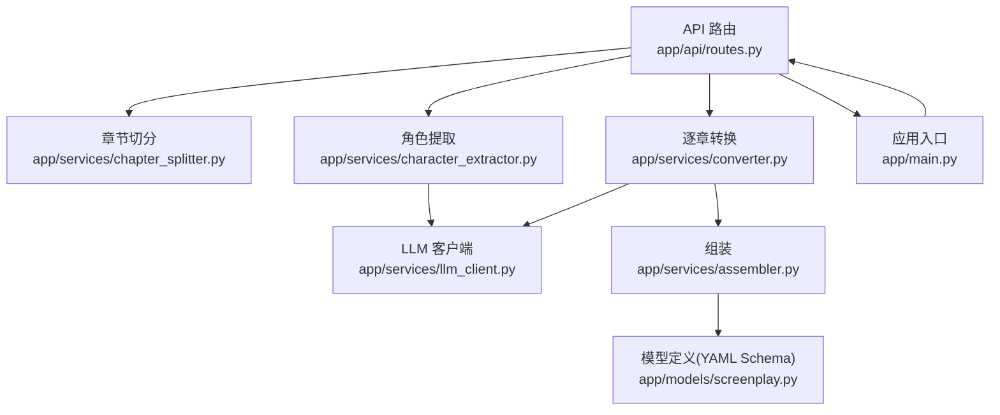
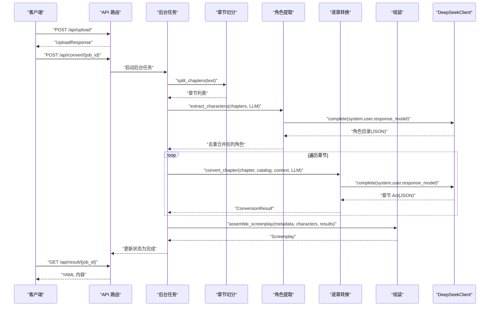
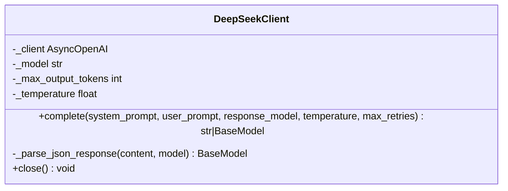
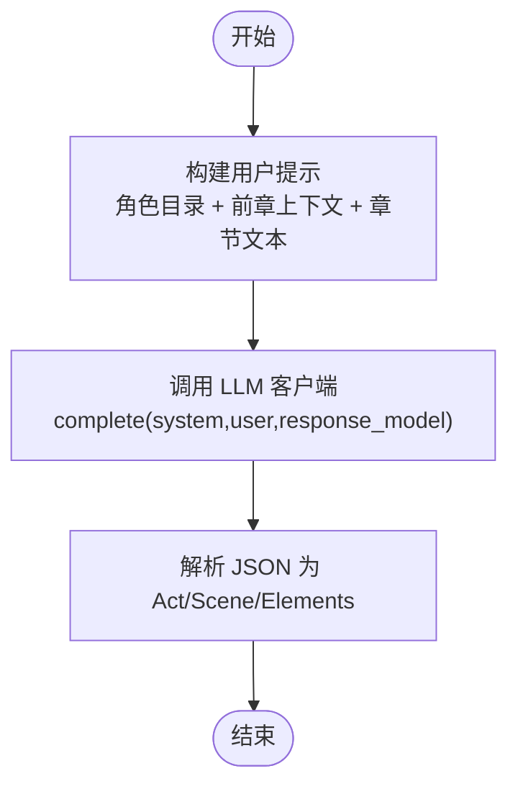
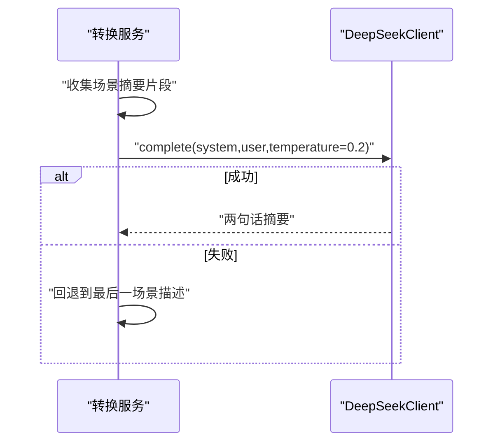
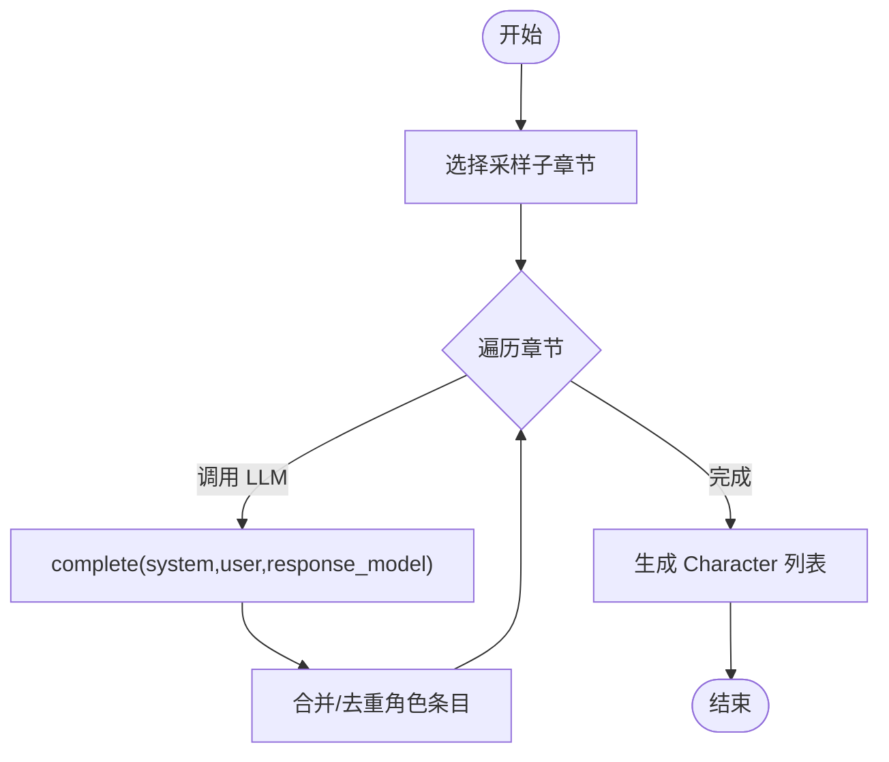
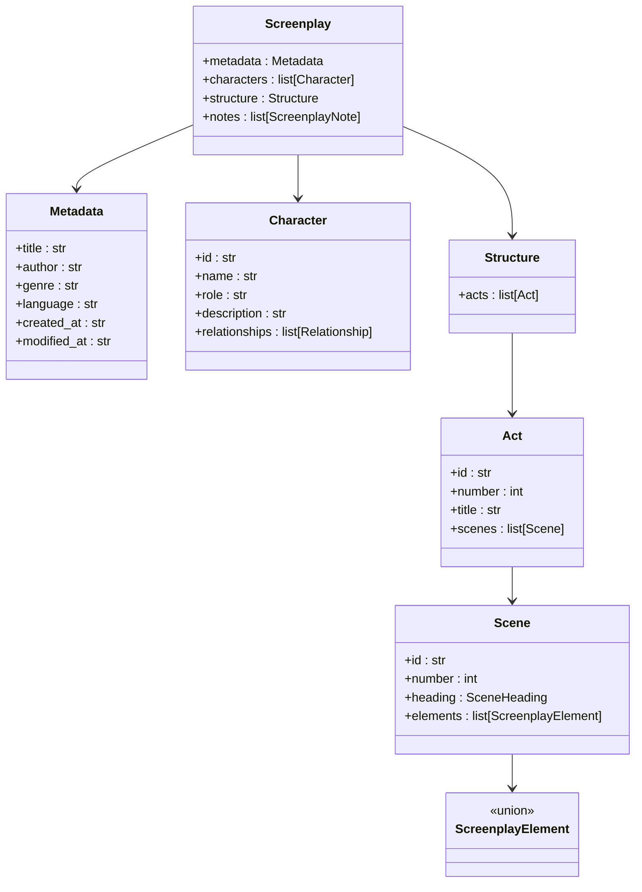
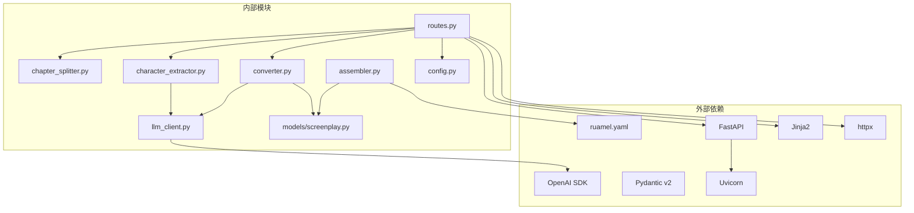

# LLM集成

<cite>
**本文档引用的文件**
- [app/services/llm_client.py](file://app/services/llm_client.py)
- [app/prompts/screenplay_conversion.py](file://app/prompts/screenplay_conversion.py)
- [app/prompts/continuity.py](file://app/prompts/continuity.py)
- [app/prompts/character_extraction.py](file://app/prompts/character_extraction.py)
- [app/prompts/chapter_detection.py](file://app/prompts/chapter_detection.py)
- [app/models/screenplay.py](file://app/models/screenplay.py)
- [app/config.py](file://app/config.py)
- [app/services/converter.py](file://app/services/converter.py)
- [app/services/character_extractor.py](file://app/services/character_extractor.py)
- [app/services/chapter_splitter.py](file://app/services/chapter_splitter.py)
- [app/api/routes.py](file://app/api/routes.py)
- [app/main.py](file://app/main.py)
- [README.md](file://README.md)
- [pyproject.toml](file://pyproject.toml)
</cite>

## 目录
1. [简介](#简介)
2. [项目结构](#项目结构)
3. [核心组件](#核心组件)
4. [架构总览](#架构总览)
5. [详细组件分析](#详细组件分析)
6. [依赖分析](#依赖分析)
7. [性能考虑](#性能考虑)
8. [故障排查指南](#故障排查指南)
9. [结论](#结论)
10. [附录](#附录)

## 简介
本项目提供一个基于 DeepSeek API 的异步 LLM 集成方案，用于将小说文本转换为结构化 YAML 剧本。系统通过精心设计的提示模板与 Pydantic 模型约束，确保输出的结构化与一致性；通过指数退避重试、上下文连续性与 Token 预算控制，保障大规模文本转换的稳定性与成本可控。

## 项目结构
项目采用“路由层 → 业务服务层 → LLM 客户端 → 提示模板”的分层组织方式，核心模块包括：
- API 路由：负责上传、状态流、结果下载与后台转换任务编排
- 业务服务：章节切分、角色提取、逐章转换、组装与验证
- LLM 客户端：异步封装 DeepSeek API，统一错误处理与重试
- 提示模板：面向不同任务的系统提示与用户提示模板
- 数据模型：基于 Pydantic 的 YAML Schema 定义，用于结构化输出与验证

图表来源
- [app/api/routes.py:209-313](file://app/api/routes.py#L209-L313)
- [app/services/chapter_splitter.py:42-64](file://app/services/chapter_splitter.py#L42-L64)
- [app/services/character_extractor.py:21-76](file://app/services/character_extractor.py#L21-L76)
- [app/services/converter.py:36-85](file://app/services/converter.py#L36-L85)
- [app/services/llm_client.py:18-103](file://app/services/llm_client.py#L18-L103)
- [app/services/assembler.py:18-51](file://app/services/assembler.py#L18-L51)
- [app/models/screenplay.py:161-167](file://app/models/screenplay.py#L161-L167)
- [app/main.py:14-46](file://app/main.py#L14-L46)

章节来源
- [README.md:77-118](file://README.md#L77-L118)
- [pyproject.toml:8-25](file://pyproject.toml#L8-L25)

## 核心组件
- LLM 客户端（DeepSeekClient）
  - 异步封装 OpenAI 兼容客户端，支持结构化 JSON 输出、指数退避重试、温度与最大输出 Token 控制
  - 关键能力：complete 方法、_parse_json_response 解析、重试与异常记录
- 提示模板
  - 剧本转换：screenplay_conversion（系统提示 + 用户模板，约束 JSON 结构）
  - 连续性：continuity（两句话总结章节结尾）
  - 角色提取：character_extraction（角色目录 JSON 结构）
  - 章节检测：chapter_detection（章节边界 JSON 结构）
- 数据模型（Pydantic）
  - Screenplay → Metadata/Characters/Structure/Notes，作为 YAML Schema 的权威定义
- 业务服务
  - 章节切分：正则 + 启发式 + LLM 双轨策略
  - 角色提取：采样章节 + 去重合并 + slug 化
  - 逐章转换：滑动窗口 + 上下文连续性 + 降级策略
  - 组装：全局编号、出场角色补全、首次出场标注

章节来源
- [app/services/llm_client.py:18-103](file://app/services/llm_client.py#L18-L103)
- [app/prompts/screenplay_conversion.py:1-91](file://app/prompts/screenplay_conversion.py#L1-L91)
- [app/prompts/continuity.py:1-20](file://app/prompts/continuity.py#L1-L20)
- [app/prompts/character_extraction.py:1-47](file://app/prompts/character_extraction.py#L1-L47)
- [app/prompts/chapter_detection.py:1-39](file://app/prompts/chapter_detection.py#L1-L39)
- [app/models/screenplay.py:161-167](file://app/models/screenplay.py#L161-L167)
- [app/services/chapter_splitter.py:42-64](file://app/services/chapter_splitter.py#L42-L64)
- [app/services/character_extractor.py:21-76](file://app/services/character_extractor.py#L21-L76)
- [app/services/converter.py:36-85](file://app/services/converter.py#L36-L85)
- [app/services/assembler.py:18-51](file://app/services/assembler.py#L18-L51)

## 架构总览
系统以 FastAPI 为入口，通过 SSE 实时推送转换进度，后台任务执行完整流水线：章节切分 → 角色提取 → 逐章转换 → 组装 → 验证 → YAML 导出。LLM 调用集中在转换与角色提取两个服务，统一由 DeepSeekClient 提供异步、可重试、结构化输出能力。

图表来源
- [app/api/routes.py:210-313](file://app/api/routes.py#L210-L313)
- [app/services/chapter_splitter.py:42-64](file://app/services/chapter_splitter.py#L42-L64)
- [app/services/character_extractor.py:21-76](file://app/services/character_extractor.py#L21-L76)
- [app/services/converter.py:36-85](file://app/services/converter.py#L36-L85)
- [app/services/assembler.py:18-51](file://app/services/assembler.py#L18-L51)
- [app/services/llm_client.py:33-87](file://app/services/llm_client.py#L33-L87)

## 详细组件分析

### LLM 客户端（DeepSeekClient）
- 异步调用机制
  - 基于 openai.AsyncOpenAI，构造消息数组（system + user），设置模型、温度、最大输出 Token
  - 支持 response_format=json_object，强制 LLM 返回 JSON 字符串
- 错误处理与重试
  - 对异常进行捕获与日志记录，最多尝试指定次数
  - 指数退避等待（2^attempt 秒），避免瞬时错误放大
- JSON 解析与校验
  - 去除 Markdown 代码块围栏，使用 Pydantic.model_validate 校验结构
- 生命周期管理
  - 提供 close 方法，确保底层 HTTP 客户端释放

图表来源
- [app/services/llm_client.py:18-103](file://app/services/llm_client.py#L18-L103)

章节来源
- [app/services/llm_client.py:18-103](file://app/services/llm_client.py#L18-L103)

### 剧本转换提示（screenplay_conversion）
- 设计原则
  - 展示而非叙述、现在时态、场景标题规则、角色引用一致性
  - 明确 JSON 输出结构（act/scenes/elements），限定元素类型与字段
- 上下文与预算
  - 包含角色目录、前章上下文摘要，控制输入长度避免超出预算
- 输出约束
  - 使用 response_model 强制 JSON 结构，便于后续解析与校验

图表来源
- [app/prompts/screenplay_conversion.py:76-91](file://app/prompts/screenplay_conversion.py#L76-L91)
- [app/services/llm_client.py:33-87](file://app/services/llm_client.py#L33-L87)

章节来源
- [app/prompts/screenplay_conversion.py:1-91](file://app/prompts/screenplay_conversion.py#L1-L91)
- [app/services/converter.py:36-85](file://app/services/converter.py#L36-L85)

### 连续性保持提示（continuity）
- 目标
  - 生成两句话的章节结尾摘要，用于下一章转换的上下文
- 输入
  - 章节场景摘要片段，限制长度避免溢出
- 降级策略
  - 若 LLM 失败，回退到最后一场景描述

图表来源
- [app/prompts/continuity.py:14-20](file://app/prompts/continuity.py#L14-L20)
- [app/services/converter.py:186-218](file://app/services/converter.py#L186-L218)

章节来源
- [app/prompts/continuity.py:1-20](file://app/prompts/continuity.py#L1-L20)
- [app/services/converter.py:186-218](file://app/services/converter.py#L186-L218)

### 角色提取提示（character_extraction）
- 目标
  - 从章节文本中抽取角色目录，包含别名、角色定位、关系、描述等
- 采样策略
  - 对长文本选择首三章与中间/末尾章节进行抽样，减少 Token 消耗
- 合并与去重
  - 归一化名称生成 slug，合并更丰富的描述与关系，去重后生成 Character 列表
- 降级策略
  - 若失败，创建占位角色（如 Narrator）

图表来源
- [app/prompts/character_extraction.py:38-47](file://app/prompts/character_extraction.py#L38-L47)
- [app/services/character_extractor.py:21-76](file://app/services/character_extractor.py#L21-L76)

章节来源
- [app/prompts/character_extraction.py:1-47](file://app/prompts/character_extraction.py#L1-L47)
- [app/services/character_extractor.py:21-76](file://app/services/character_extractor.py#L21-L76)

### 章节检测提示（chapter_detection）
- 目标
  - 在缺乏显式标题时，识别自然章节边界
- 输出
  - JSON 数组，包含每个章节起始位置与标题
- 与章节切分的关系
  - 作为正则与启发式之外的 LLM 辅助手段，增强鲁棒性

章节来源
- [app/prompts/chapter_detection.py:1-39](file://app/prompts/chapter_detection.py#L1-L39)
- [app/services/chapter_splitter.py:42-64](file://app/services/chapter_splitter.py#L42-L64)

### 数据模型与 JSON Schema 约束
- 模型层次
  - Screenplay → Metadata/Characters/Structure/Notes
  - Structure → Acts → Scenes → Elements（discriminated union）
- 约束与用途
  - 作为 YAML Schema 的权威定义，用于序列化、反序列化与验证
  - LLM 输出经 Pydantic 校验，确保结构一致与字段完备

图表来源
- [app/models/screenplay.py:17-167](file://app/models/screenplay.py#L17-L167)

章节来源
- [app/models/screenplay.py:17-167](file://app/models/screenplay.py#L17-L167)

### 逐章转换与上下文连续性
- 滑动窗口策略
  - 对超长章节进行断点截断，避免超出 Token 预算
- 上下文传递
  - 每章结束后生成两句话摘要，作为下一章的 previous_context
- 降级策略
  - LLM 失败时生成最小可用场景，保证流水线继续运行

章节来源
- [app/services/converter.py:36-85](file://app/services/converter.py#L36-L85)
- [app/services/converter.py:100-158](file://app/services/converter.py#L100-L158)
- [app/services/converter.py:160-184](file://app/services/converter.py#L160-L184)
- [app/services/converter.py:186-218](file://app/services/converter.py#L186-L218)

### 角色提取与去重合并
- 采样策略
  - 少量章节样本，平衡准确性与成本
- 合并与去重
  - slug 化、描述丰富度优先、关系去重合并
- 占位角色
  - 若无角色提取结果，创建占位角色以维持下游流程

章节来源
- [app/services/character_extractor.py:21-76](file://app/services/character_extractor.py#L21-L76)
- [app/services/character_extractor.py:95-154](file://app/services/character_extractor.py#L95-L154)

### 章节切分的双轨策略
- 正则检测
  - 支持英/中/罗马数字章节标题，快速识别结构化文本
- 启发式分割
  - 按段落数与字数目标均匀分布，保证最小章节数量
- LLM 辅助（章节检测）
  - 作为最后手段，识别隐式章节边界

章节来源
- [app/services/chapter_splitter.py:42-64](file://app/services/chapter_splitter.py#L42-L64)
- [app/services/chapter_splitter.py:66-97](file://app/services/chapter_splitter.py#L66-L97)
- [app/services/chapter_splitter.py:99-163](file://app/services/chapter_splitter.py#L99-L163)

### API 端到端流水线
- SSE 进度流
  - 每秒推送一次状态，支持非 SSE 客户端的轮询回退
- 后台任务
  - 串联解析 → 切分 → 角色提取 → 转换 → 组装 → 验证 → 导出
- 客户端密钥注入
  - 用户可在请求体中传入 API Key，覆盖全局配置

章节来源
- [app/api/routes.py:131-166](file://app/api/routes.py#L131-L166)
- [app/api/routes.py:210-313](file://app/api/routes.py#L210-L313)

## 依赖分析
- 外部依赖
  - FastAPI、Uvicorn、Jinja2、Pydantic v2、OpenAI SDK、ruamel.yaml、httpx
- 内部耦合
  - API 路由依赖各业务服务；业务服务依赖 LLM 客户端与提示模板；模型定义贯穿组装与导出
- 配置中心
  - Settings 提供 DeepSeek 基础 URL、模型、温度、超时、最大输出 Token 等参数

图表来源
- [pyproject.toml:13-25](file://pyproject.toml#L13-L25)
- [app/api/routes.py:15-24](file://app/api/routes.py#L15-L24)
- [app/config.py:9-45](file://app/config.py#L9-L45)
- [app/services/llm_client.py:8-11](file://app/services/llm_client.py#L8-L11)

章节来源
- [pyproject.toml:13-25](file://pyproject.toml#L13-L25)
- [app/config.py:9-45](file://app/config.py#L9-L45)

## 性能考虑
- Token 预算分配（参考 README）
  - 系统提示：~800；角色目录：~500；前章上下文：~200；章节文本：~5,000；输出 JSON：~4,000
  - 超长章节在场景断点处自动子切分，避免一次性溢出
- 温度与并发
  - 转换阶段默认较低温度，提升确定性；角色提取与连续性摘要分别使用不同温度
- I/O 与网络
  - 异步调用与指数退避，降低瞬时压力；合理设置超时与最大输出 Token，避免长时间阻塞

章节来源
- [README.md:119-130](file://README.md#L119-L130)
- [app/services/converter.py:53-57](file://app/services/converter.py#L53-L57)
- [app/services/llm_client.py:21-32](file://app/services/llm_client.py#L21-L32)

## 故障排查指南
- LLM 调用失败
  - 现象：抛出 RuntimeError，包含最终错误信息
  - 排查：检查 API Key、基础 URL、模型名称、超时设置；确认网络连通性
  - 降级：转换失败时生成最小场景；连续性摘要失败时回退到最后一场景描述
- JSON 解析失败
  - 现象：_parse_json_response 抛出异常
  - 排查：检查提示模板是否严格约束 JSON 结构；确认 LLM 是否返回纯 JSON（去除代码围栏）
- 角色提取为空
  - 现象：无角色或仅占位角色
  - 排查：检查采样章节数量与文本质量；必要时增加采样范围
- 章节切分不足
  - 现象：少于 2 个章节
  - 排查：检查正则模式是否匹配；启用启发式分割；必要时使用 LLM 章节检测

章节来源
- [app/services/llm_client.py:80-87](file://app/services/llm_client.py#L80-L87)
- [app/services/llm_client.py:88-99](file://app/services/llm_client.py#L88-L99)
- [app/services/converter.py:73-76](file://app/services/converter.py#L73-L76)
- [app/services/converter.py:211-218](file://app/services/converter.py#L211-L218)
- [app/services/character_extractor.py:66-75](file://app/services/character_extractor.py#L66-L75)
- [app/services/chapter_splitter.py:53-63](file://app/services/chapter_splitter.py#L53-L63)

## 结论
本项目通过结构化的提示模板、严格的 JSON Schema 约束与稳健的异步 LLM 客户端，实现了从小说到 YAML 剧本的自动化转换。系统在稳定性、成本控制与可维护性之间取得平衡，并提供了完善的降级与调试机制，适合在生产环境中持续演进与扩展。

## 附录

### 提示优化最佳实践
- 明确角色与输出格式：在系统提示中强调 JSON 结构与字段约束
- 控制输入长度：通过采样与截断避免超出预算；必要时拆分为多个小批次
- 温度与确定性：对结构化输出使用较低温度，减少随机性
- 上下文复用：利用连续性摘要保持跨章节一致性

### 调试技巧
- 启用日志：关注 LLM 调用警告与重试记录
- 分阶段验证：先验证角色提取，再验证转换，最后验证组装与导出
- 回退路径：确保降级策略可用，避免单点失败导致整条流水线中断

### 自定义提示模板指导
- 选择任务类型：角色提取、章节检测、剧本转换、连续性摘要
- 设计系统提示：明确角色、输出格式、约束与边界条件
- 设计用户提示：提供上下文（角色目录、前章摘要、章节文本）、限制输出长度
- 使用 JSON Schema：在系统提示中给出精确的 JSON 结构示例
- 测试与迭代：先小批量测试，逐步扩大规模，观察稳定性与成本