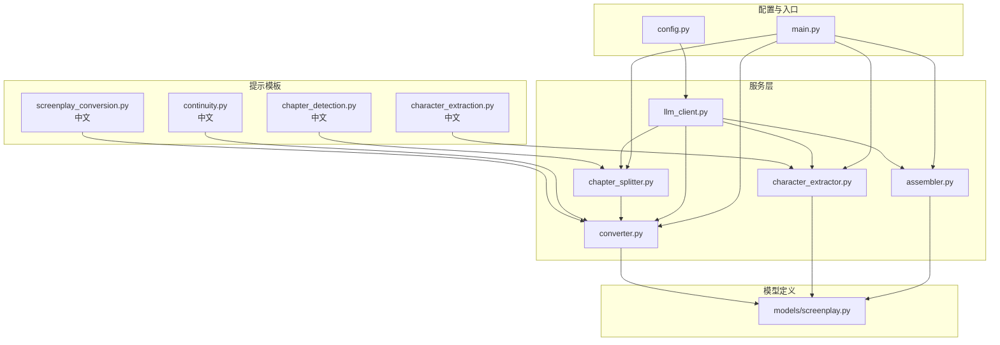
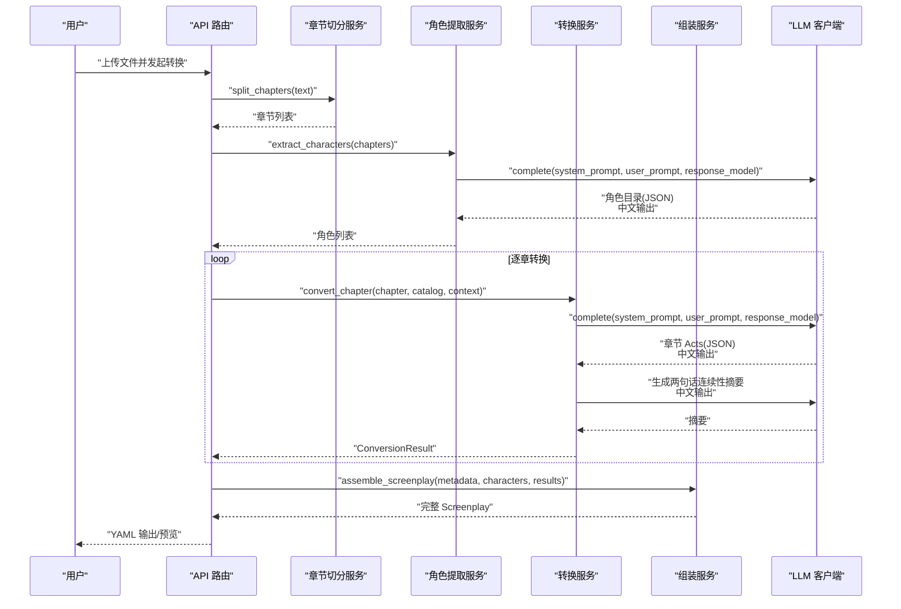
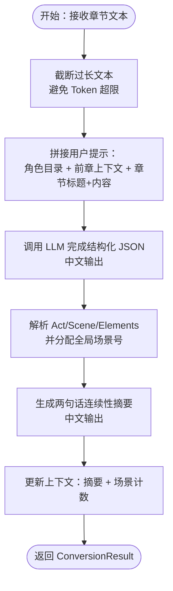
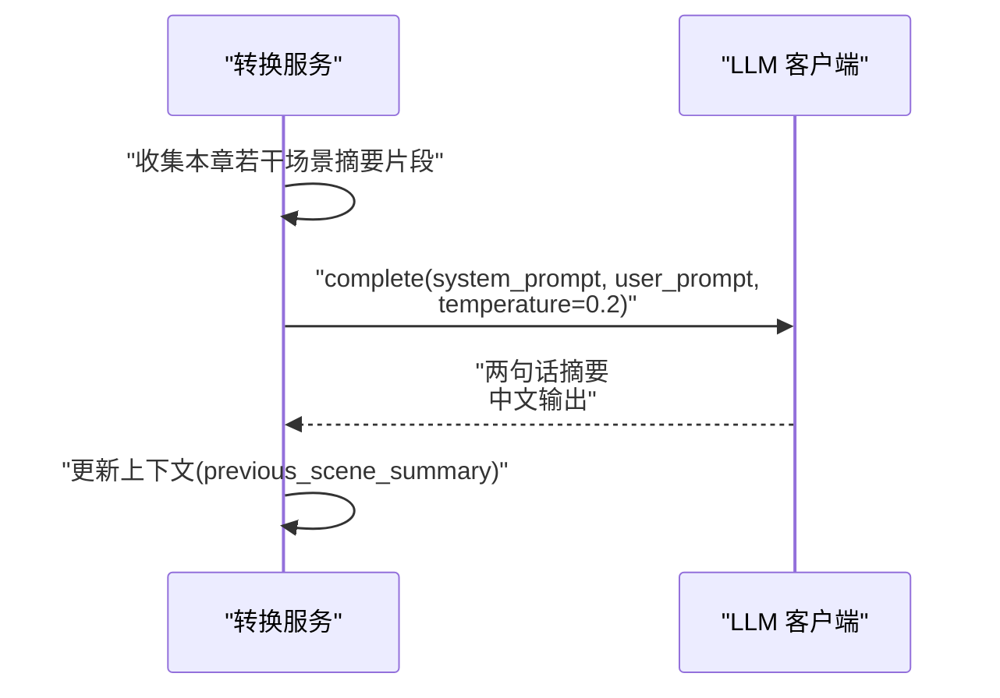
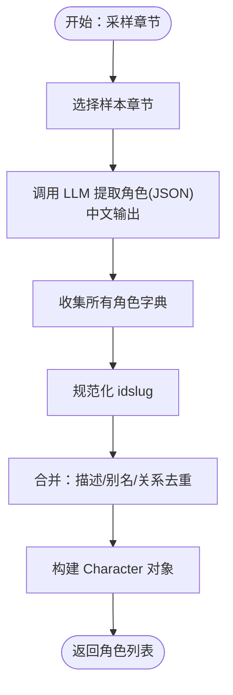
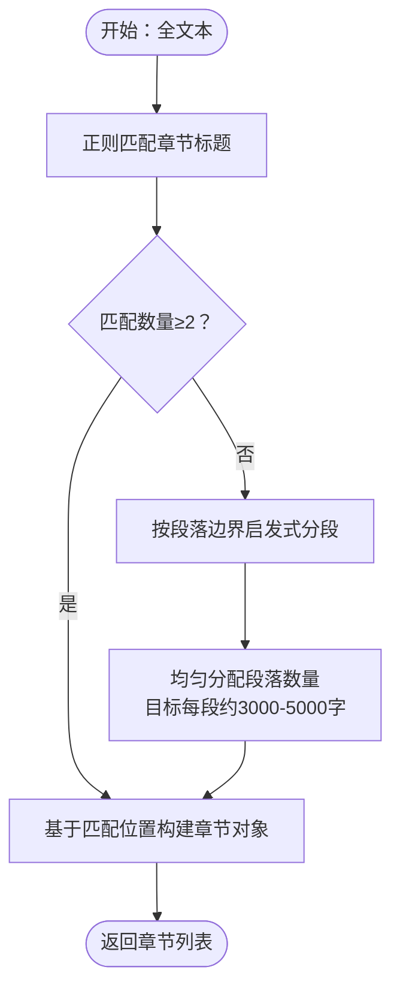
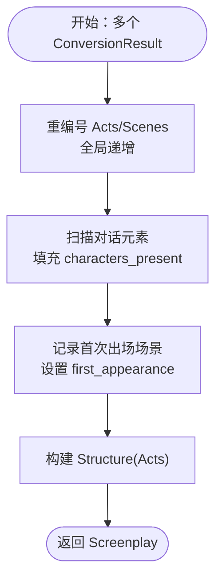
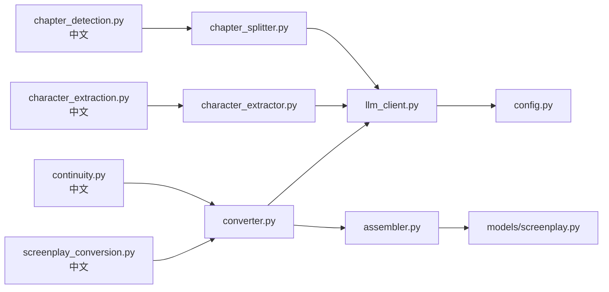

# 提示工程设计

<cite>
**本文引用的文件**
- [app/prompts/screenplay_conversion.py](file://app/prompts/screenplay_conversion.py)
- [app/prompts/continuity.py](file://app/prompts/continuity.py)
- [app/prompts/character_extraction.py](file://app/prompts/character_extraction.py)
- [app/prompts/chapter_detection.py](file://app/prompts/chapter_detection.py)
- [app/models/screenplay.py](file://app/models/screenplay.py)
- [app/services/converter.py](file://app/services/converter.py)
- [app/services/character_extractor.py](file://app/services/character_extractor.py)
- [app/services/chapter_splitter.py](file://app/services/chapter_splitter.py)
- [app/services/assembler.py](file://app/services/assembler.py)
- [app/services/llm_client.py](file://app/services/llm_client.py)
- [app/config.py](file://app/config.py)
- [app/main.py](file://app/main.py)
- [README.md](file://README.md)
- [tests/test_chapter_splitter.py](file://tests/test_chapter_splitter.py)
- [tests/test_assembler.py](file://tests/test_assembler.py)
</cite>

## 更新摘要
**所做更改**
- 更新了所有提示模板的中文内容说明
- 新增了中文输出格式要求的详细说明
- 更新了中文场景标题规则和角色引用规则
- 增强了中文连续性摘要生成的指导
- 完善了中文章节边界检测的信号识别

## 目录
1. [简介](#简介)
2. [项目结构](#项目结构)
3. [核心组件](#核心组件)
4. [架构总览](#架构总览)
5. [详细组件分析](#详细组件分析)
6. [依赖分析](#依赖分析)
7. [性能考虑](#性能考虑)
8. [故障排查指南](#故障排查指南)
9. [结论](#结论)
10. [附录](#附录)

## 简介
本文件系统性梳理该代码库中的提示工程设计，围绕四类提示模板展开：剧本转换提示（screenplay_conversion）、连续性提示（continuity）、角色提取提示（character_extraction）、章节检测提示（chapter_detection）。文档从设计原理、实现细节、数据流与处理逻辑、错误处理与性能优化等方面进行深入分析，并给出提示优化最佳实践、调试技巧与效果评估方法。

**更新** 所有提示模板已完全重写为中文，确保所有输出内容使用中文术语，包括场景标题、对白、动作描述、角色名称等。

## 项目结构
该项目采用"提示模板 + 服务层 + 模型定义"的分层组织方式：
- 提示模板集中于 app/prompts/，分别定义系统提示与用户模板，现已完全支持中文输出。
- 服务层位于 app/services/，负责调用 LLM、解析与组装结果、上下文管理与去重合并。
- 模型定义位于 app/models/，使用 Pydantic v2 对 YAML Schema 进行强类型约束与序列化。
- 配置与入口位于 app/config.py 与 app/main.py，统一管理 LLM 参数与运行时生命周期。

**图表来源**
- [app/prompts/screenplay_conversion.py:1-99](file://app/prompts/screenplay_conversion.py#L1-L99)
- [app/prompts/continuity.py:1-26](file://app/prompts/continuity.py#L1-L26)
- [app/prompts/character_extraction.py:1-54](file://app/prompts/character_extraction.py#L1-L54)
- [app/prompts/chapter_detection.py:1-45](file://app/prompts/chapter_detection.py#L1-L45)

## 核心组件
本节聚焦四类提示模板的设计要点与实现细节。

**更新** 所有提示模板均已完成中文重写，确保输出内容完全使用中文。

- **剧本转换提示（screenplay_conversion）**
  - 设计原则：强调"展示而非叙述"、现在时态、忠实原文、场景标题规范、对白自然化、动作可视化。
  - 输出约束：严格 JSON 结构，包含 acts → scenes → elements，元素类型覆盖 action、dialogue、parenthetical、transition、note；场景 heading 包含 location、time_of_day、int_ext；characters_present 用于角色出场清单。
  - 上下文注入：character_catalog 与 previous_context，前者确保角色 ID 一致性，后者维持跨章连续性。
  - 章节规模：建议每章 3–8 个场景，每个场景 5–15 个元素。
  - **新增** 中文输出要求：所有输出内容必须使用中文，包括对白、场景描述、动作描述等。

- **连续性提示（continuity）**
  - 目标：生成两句话的章节结尾摘要，聚焦地点、当前戏剧情境与未决张力。
  - 输入：上一章的若干场景摘要片段，作为上下文。
  - 温度控制：较低温度以增强稳定性与一致性。
  - **新增** 中文输出要求：输出内容必须使用中文，保持原文的语言风格。

- **角色提取提示（character_extraction）**
  - 目标：从文本中抽取角色目录，包含别名、角色定位、关系、年龄、性别、职业等。
  - 输出约束：JSON 结构，包含 characters 数组，每个角色有 id、name、aliases、role、description、age_range、gender、occupation、relationships。
  - 去重与合并：按 id 归并，保留更丰富的描述与关系，避免重复。
  - **新增** 中文输出要求：所有输出内容必须使用中文，角色名称、描述、关系等全部使用中文。

- **章节检测提示（chapter_detection）**
  - 目标：识别章节边界，即使没有显式标题也能发现自然断点。
  - 规则信号：显式标题、场景分隔符、时间跳跃、地点变化、视角切换、主题转变。
  - 输出约束：JSON 结构，包含 chapters 数组，每个元素含 position 与 title。
  - **新增** 中文输出要求：输出的章节标题必须使用中文，保持原文的语言风格。

**章节来源**
- [app/prompts/screenplay_conversion.py:1-99](file://app/prompts/screenplay_conversion.py#L1-L99)
- [app/prompts/continuity.py:1-26](file://app/prompts/continuity.py#L1-L26)
- [app/prompts/character_extraction.py:1-54](file://app/prompts/character_extraction.py#L1-L54)
- [app/prompts/chapter_detection.py:1-45](file://app/prompts/chapter_detection.py#L1-L45)

## 架构总览
提示工程贯穿"章节切分 → 角色提取 → 剧本转换 → 组装验证 → YAML 导出"的流水线。LLM 客户端统一处理请求、重试与 JSON 解析，服务层负责上下文管理、结果解析与去重合并。

**图表来源**
- [app/services/chapter_splitter.py:1-169](file://app/services/chapter_splitter.py#L1-L169)
- [app/services/character_extractor.py:1-213](file://app/services/character_extractor.py#L1-L213)
- [app/services/converter.py:1-245](file://app/services/converter.py#L1-L245)
- [app/services/assembler.py:1-101](file://app/services/assembler.py#L1-L101)
- [app/services/llm_client.py:1-155](file://app/services/llm_client.py#L1-L155)

## 详细组件分析

### 剧本转换提示（screenplay_conversion）
- **结构化指令设计**
  - 系统提示明确角色、动作、对白、场景标题的规范，限定输出 JSON 结构与元素类型，确保后续解析稳定。
  - 场景标题规则与时间词典、内外景枚举，减少歧义。
  - 字段约束：场景 heading、characters_present、elements 类型与重要性级别，便于渲染与验证。
  - **新增** 中文语言要求：所有输出内容必须使用中文，对白必须保持原文的语言风格。
- **上下文管理**
  - previous_context 注入上一章结尾摘要，帮助维持时间线、角色位置与情节张力的一致性。
  - character_catalog 保证角色 ID 在全篇一致，避免跨章漂移。
- **错误处理与回退**
  - LLM 解析失败时生成最小 Act，保留章节标题与简要说明，避免中断流程。
- **性能与长度控制**
  - 对超长章节进行截断，避免超出 Token 预算；全局场景编号与字符出场扫描在组装阶段补全。

**图表来源**
- [app/prompts/screenplay_conversion.py:1-99](file://app/prompts/screenplay_conversion.py#L1-L99)
- [app/services/converter.py:37-101](file://app/services/converter.py#L37-L101)

**章节来源**
- [app/prompts/screenplay_conversion.py:1-99](file://app/prompts/screenplay_conversion.py#L1-L99)
- [app/services/converter.py:37-101](file://app/services/converter.py#L37-L101)
- [app/models/screenplay.py:132-141](file://app/models/screenplay.py#L132-L141)

### 连续性保持提示（continuity）
- **上下文管理策略**
  - 以"两句话摘要"形式记录上一章结尾的关键信息，包括人物位置、当前情境与未决问题。
  - 该摘要作为下一章转换的 previous_context，形成跨章记忆链。
  - **新增** 中文输出要求：输出内容必须使用中文，保持原文的语言风格。
- **温度与稳定性**
  - 低温度设置提升摘要稳定性，减少风格漂移。
- **回退机制**
  - LLM 失败时回退到最后一场景描述，保证流程继续。

**图表来源**
- [app/prompts/continuity.py:1-26](file://app/prompts/continuity.py#L1-L26)
- [app/services/converter.py:213-245](file://app/services/converter.py#L213-L245)

**章节来源**
- [app/prompts/continuity.py:1-26](file://app/prompts/continuity.py#L1-L26)
- [app/services/converter.py:213-245](file://app/services/converter.py#L213-L245)

### 角色提取提示（character_extraction）
- **实体识别机制**
  - 通过系统提示明确抽取范围（所有命名角色）、关系推断、角色定位（主角/反派/配角/次要/群演）与属性分类（年龄、性别、职业）。
  - 输出结构化 JSON，便于后续去重与合并。
  - **新增** 中文输出要求：所有输出内容必须使用中文，角色名称、描述、关系等全部使用中文。
- **去重与合并策略**
  - 基于规范化 slug 的 id 分组，优先保留更丰富描述与别名集合，合并关系边，避免重复。
- **样本策略**
  - 对长文本采样首三章与中间/末尾章节，提高覆盖率并控制 Token 消耗。
- **回退与占位**
  - 若无角色提取结果，创建占位 Narrator 以保证后续流程可用。

**图表来源**
- [app/prompts/character_extraction.py:1-54](file://app/prompts/character_extraction.py#L1-L54)
- [app/services/character_extractor.py:21-75](file://app/services/character_extractor.py#L21-L75)
- [app/services/character_extractor.py:95-167](file://app/services/character_extractor.py#L95-L167)

**章节来源**
- [app/prompts/character_extraction.py:1-54](file://app/prompts/character_extraction.py#L1-L54)
- [app/services/character_extractor.py:21-75](file://app/services/character_extractor.py#L21-L75)
- [app/services/character_extractor.py:95-167](file://app/services/character_extractor.py#L95-L167)

### 章节检测提示（chapter_detection）
- **模式匹配算法**
  - 正则表达式库包含英文章节、书/部标题、中文章节/小节、Markdown 标题、数字序号等多种常见格式。
  - 若正则未检测到足够章节，回退到启发式分段：按段落边界均匀分布，目标每段约 3000–5000 字，最少 3 段。
  - **新增** 中文输出要求：输出的章节标题必须使用中文，保持原文的语言风格。
- **边界识别策略**
  - 以匹配位置为起点，去除标题行后截取内容，形成 Chapter 对象；若无标题则赋予"Section X"标题。
- **边界质量保障**
  - 分段在段落边界进行，避免单词撕裂；短文本直接返回单章。

**图表来源**
- [app/prompts/chapter_detection.py:1-45](file://app/prompts/chapter_detection.py#L1-L45)
- [app/services/chapter_splitter.py:42-63](file://app/services/chapter_splitter.py#L42-L63)
- [app/services/chapter_splitter.py:99-134](file://app/services/chapter_splitter.py#L99-L134)

**章节来源**
- [app/prompts/chapter_detection.py:1-45](file://app/prompts/chapter_detection.py#L1-L45)
- [app/services/chapter_splitter.py:42-63](file://app/services/chapter_splitter.py#L42-L63)
- [app/services/chapter_splitter.py:99-134](file://app/services/chapter_splitter.py#L99-L134)

### 组装与验证（assembler）
- **全局编号与角色出场**
  - 重编号 acts 与 scenes，确保全局连续；根据对话元素自动填充 characters_present。
- **首次出场标记**
  - 基于最早出现场景设置角色 first_appearance，便于后续渲染与索引。
- **结构完整性**
  - 将 Acts 组装为 Structure，形成完整 Screenplay 根模型，供导出与验证使用。

**图表来源**
- [app/services/assembler.py:18-50](file://app/services/assembler.py#L18-L50)
- [app/services/assembler.py:66-86](file://app/services/assembler.py#L66-L86)
- [app/services/assembler.py:88-101](file://app/services/assembler.py#L88-L101)

**章节来源**
- [app/services/assembler.py:18-50](file://app/services/assembler.py#L18-L50)
- [app/services/assembler.py:66-86](file://app/services/assembler.py#L66-L86)
- [app/services/assembler.py:88-101](file://app/services/assembler.py#L88-L101)

## 依赖分析
- **组件耦合**
  - 提示模板与服务层松耦合：通过字符串模板与 Pydantic 模型解耦，便于独立迭代。
  - LLM 客户端集中化：统一处理请求、重试、JSON 解析与响应格式化。
- **外部依赖**
  - DeepSeek API（OpenAI 兼容），配置项集中于 Settings。
- **接口契约**
  - 所有 LLM 调用均通过 llm_client.complete 完成，必要时指定 response_model 以获得结构化输出。

**图表来源**
- [app/prompts/screenplay_conversion.py:1-99](file://app/prompts/screenplay_conversion.py#L1-L99)
- [app/prompts/continuity.py:1-26](file://app/prompts/continuity.py#L1-L26)
- [app/prompts/character_extraction.py:1-54](file://app/prompts/character_extraction.py#L1-L54)
- [app/prompts/chapter_detection.py:1-45](file://app/prompts/chapter_detection.py#L1-L45)
- [app/services/converter.py:1-245](file://app/services/converter.py#L1-L245)
- [app/services/character_extractor.py:1-213](file://app/services/character_extractor.py#L1-L213)
- [app/services/chapter_splitter.py:1-169](file://app/services/chapter_splitter.py#L1-L169)
- [app/services/assembler.py:1-101](file://app/services/assembler.py#L1-L101)
- [app/services/llm_client.py:1-155](file://app/services/llm_client.py#L1-L155)
- [app/models/screenplay.py:1-167](file://app/models/screenplay.py#L1-L167)
- [app/config.py:1-45](file://app/config.py#L1-L45)

**章节来源**
- [app/services/llm_client.py:18-32](file://app/services/llm_client.py#L18-L32)
- [app/config.py:9-31](file://app/config.py#L9-L31)

## 性能考虑
- **Token 预算与长度控制**
  - 章节文本截断：超过阈值时截断并标注，避免超限。
  - 角色目录压缩：紧凑格式，减少上下文开销。
  - 连续性摘要固定长度：两句话，控制上下文长度。
- **并发与重试**
  - 异步 LLM 调用，失败自动指数回退，提升鲁棒性。
- **分布式分段**
  - 章节切分在段落边界均匀分布，避免长尾段落导致的不平衡。

**章节来源**
- [app/services/converter.py:56-59](file://app/services/converter.py#L56-L59)
- [app/services/character_extractor.py:44-45](file://app/services/character_extractor.py#L44-L45)
- [app/services/chapter_splitter.py:111-117](file://app/services/chapter_splitter.py#L111-L117)
- [app/services/llm_client.py:71-86](file://app/services/llm_client.py#L71-L86)

## 故障排查指南
- **LLM 调用失败**
  - 现象：异常日志、返回空内容。
  - 处理：检查 API Key、基础 URL、模型名与超时设置；确认 response_model 是否正确传入；启用重试。
- **JSON 解析失败**
  - 现象：响应被包裹在代码块或非 JSON 格式。
  - 处理：llm_client 内置清理与解析逻辑，确保去除代码块并解析 JSON；如仍失败，检查提示模板输出约束是否严格。
- **角色重复与关系缺失**
  - 现象：角色重复、别名/关系不完整。
  - 处理：确认 character_extractor 的去重与合并逻辑；必要时人工修正角色目录。
- **章节切分异常**
  - 现象：未检测到章节或切分不合理。
  - 处理：检查正则模式是否覆盖目标文本；若无标题，确认启发式分段参数与段落边界。
- **组装阶段编号错乱**
  - 现象：场景号不连续或角色出场缺失。
  - 处理：确认 assembler 的重编号与 characters_present 填充逻辑；核对对话元素中的角色 ID。

**章节来源**
- [app/services/llm_client.py:88-98](file://app/services/llm_client.py#L88-L98)
- [app/services/character_extractor.py:95-167](file://app/services/character_extractor.py#L95-L167)
- [app/services/chapter_splitter.py:42-63](file://app/services/chapter_splitter.py#L42-L63)
- [app/services/assembler.py:66-86](file://app/services/assembler.py#L66-L86)
- [tests/test_assembler.py:64-78](file://tests/test_assembler.py#L64-L78)
- [tests/test_chapter_splitter.py:36-57](file://tests/test_chapter_splitter.py#L36-L57)

## 结论
本项目的提示工程设计以"结构化输出 + 严格约束 + 上下文注入"为核心，结合 LLM 的强大泛化能力与 Pydantic 的强类型校验，实现了从章节切分、角色提取到剧本转换与组装的完整流水线。通过两句话连续性摘要与角色目录的去重合并，有效提升了跨章节一致性与角色建模质量。

**更新** 所有提示模板已完全重写为中文，确保输出内容使用中文术语，包括场景标题、对白、动作描述、角色名称等，为中文用户的使用提供了更好的本地化体验。

建议在实际部署中持续监控 Token 使用、优化提示模板的清晰度与稳定性，并建立自动化评估指标以衡量输出质量。

## 附录
- **提示优化最佳实践**
  - 指令清晰度：明确角色、动作、对白与场景标题的格式与约束，避免歧义。
  - 上下文长度控制：限制角色目录与前章摘要长度，防止上下文污染。
  - 输出格式约束：使用 JSON 格式与 Pydantic 模型，确保解析稳定性。
  - 温度与采样：对摘要与结构化输出采用较低温度，提升一致性。
  - **新增** 中文输出要求：确保所有输出内容使用中文，保持原文的语言风格。
- **提示调试技巧**
  - 逐步缩小输入：先用小段文本验证提示，再扩大至整章。
  - 对比不同温度与模型：观察输出稳定性与创造性之间的平衡。
  - 日志与回退：记录 LLM 调用与解析失败原因，完善回退策略。
  - **新增** 中文内容验证：检查输出是否符合中文格式要求。
- **效果评估方法**
  - 人工抽样评估：检查场景编号、角色出场、对白自然度与上下文连贯性。
  - 自动化指标：统计角色 ID 一致性、场景元素比例、摘要与结尾场景的匹配度。
  - 单元测试：针对关键流程（章节切分、角色去重、组装编号）编写测试用例，确保回归稳定。
  - **新增** 中文质量评估：检查中文输出的准确性、连贯性和本地化程度。

**章节来源**
- [README.md:119-129](file://README.md#L119-L129)
- [tests/test_assembler.py:49-88](file://tests/test_assembler.py#L49-L88)
- [tests/test_chapter_splitter.py:8-33](file://tests/test_chapter_splitter.py#L8-L33)