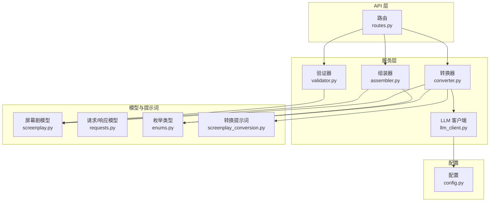
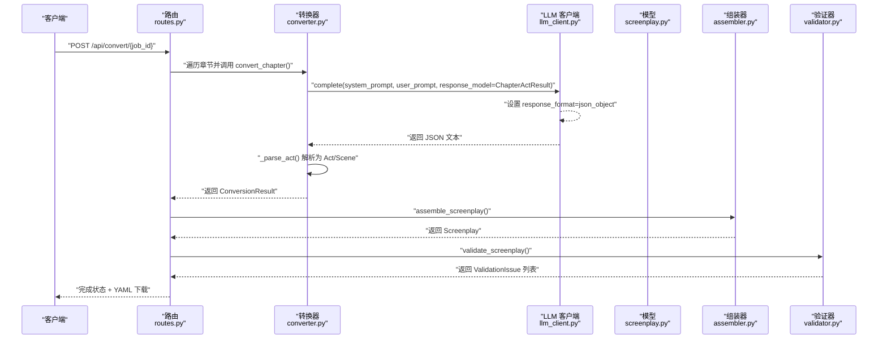
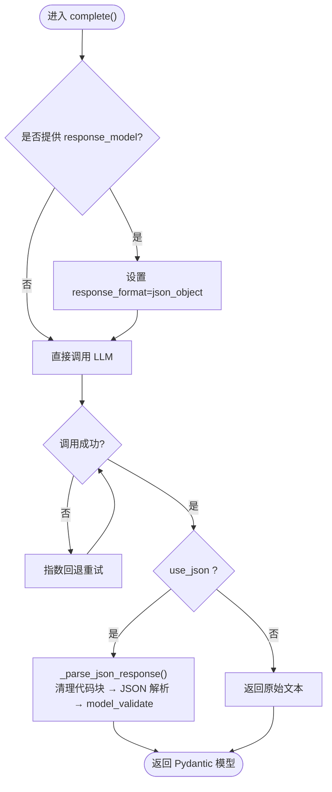
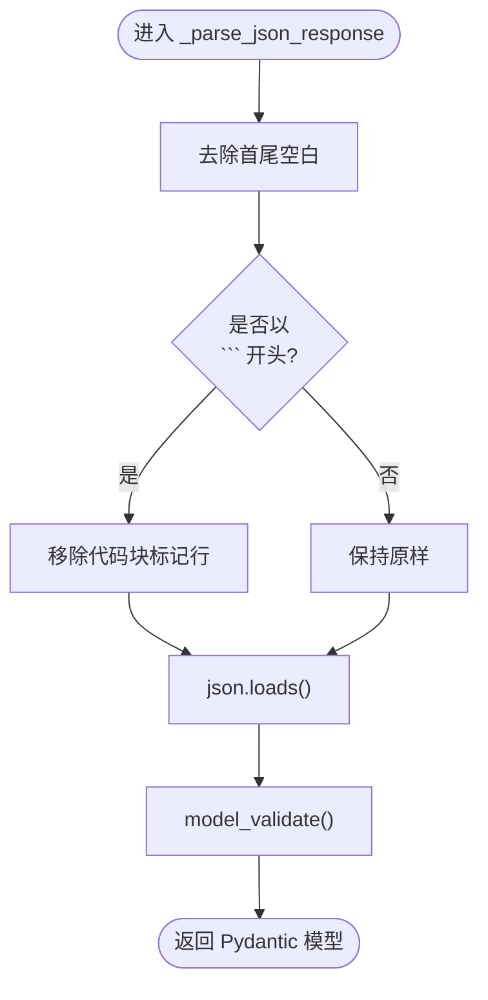
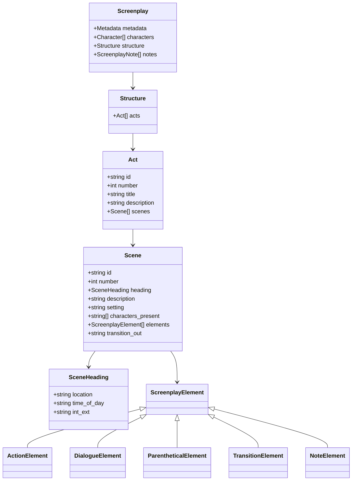
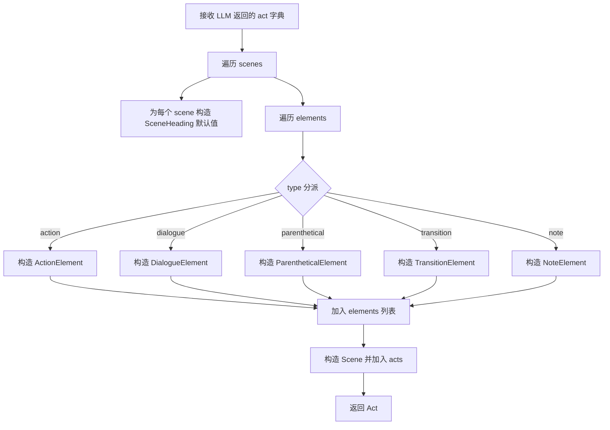
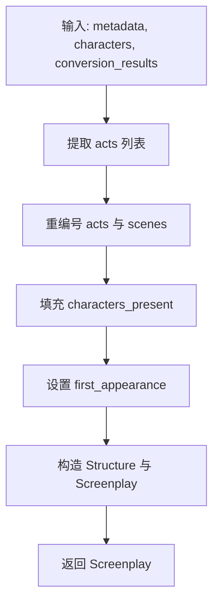
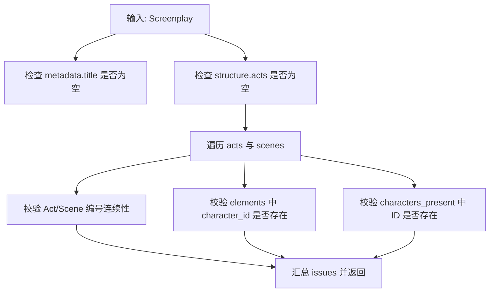
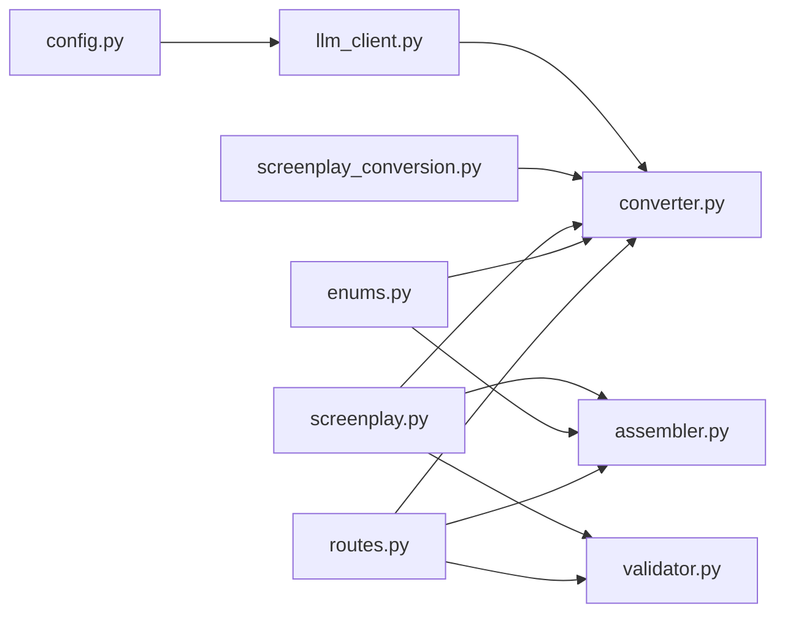

# 结构化输出处理

<cite>
**本文引用的文件**
- [llm_client.py](file://app/services/llm_client.py)
- [converter.py](file://app/services/converter.py)
- [assembler.py](file://app/services/assembler.py)
- [validator.py](file://app/services/validator.py)
- [screenplay.py](file://app/models/screenplay.py)
- [requests.py](file://app/models/requests.py)
- [enums.py](file://app/models/enums.py)
- [screenplay_conversion.py](file://app/prompts/screenplay_conversion.py)
- [routes.py](file://app/api/routes.py)
- [config.py](file://app/config.py)
- [test_models.py](file://tests/test_models.py)
- [test_validator.py](file://tests/test_validator.py)
- [YAML_SCHEMA.md](file://docs/YAML_SCHEMA.md)
</cite>

## 目录
1. [简介](#简介)
2. [项目结构](#项目结构)
3. [核心组件](#核心组件)
4. [架构总览](#架构总览)
5. [详细组件分析](#详细组件分析)
6. [依赖分析](#依赖分析)
7. [性能考虑](#性能考虑)
8. [故障排查指南](#故障排查指南)
9. [结论](#结论)
10. [附录](#附录)

## 简介
本文件系统性阐述本项目中的“结构化输出处理”能力，重点覆盖以下方面：
- LLM 输出的 JSON 模式约束与 response_format 参数使用
- Pydantic 模型验证机制与输出规范化
- _parse_json_response 方法的实现细节（Markdown 代码块清理、JSON 字符串解析、错误处理）
- Pydantic 模型验证过程（字段类型检查、数据格式验证、嵌套模型处理）
- 结构化输出的质量控制策略（验证失败重试、数据清洗、格式修正）
- 常见输出格式问题的解决方案与调试技巧
- 如何扩展支持新的数据模型与验证规则

## 项目结构
项目采用按职责分层的服务化架构，围绕“文件上传 → 文本解析 → 章节切分 → 角色提取 → 逐章转换 → 组装 → 验证 → YAML 导出”的流水线组织模块。与结构化输出直接相关的关键模块包括：
- LLM 客户端：负责调用 DeepSeek API，并通过 response_format 强制 JSON 对象输出
- 转换器：负责将 LLM 输出解析为 Pydantic 模型，并进行二次清洗与规范化
- 组装器：负责全局编号、角色出场信息与首次出场标记的统一处理
- 验证器：负责跨引用完整性与结构完整性校验
- 模型与提示词：定义输出模式与约束，确保 LLM 严格遵循



图表来源
- [routes.py:219-312](file://app/api/routes.py#L219-L312)
- [llm_client.py:33-86](file://app/services/llm_client.py#L33-L86)
- [converter.py:36-84](file://app/services/converter.py#L36-L84)
- [assembler.py:18-50](file://app/services/assembler.py#L18-L50)
- [validator.py:11-110](file://app/services/validator.py#L11-L110)
- [screenplay.py:161-167](file://app/models/screenplay.py#L161-L167)
- [enums.py:6-83](file://app/models/enums.py#L6-L83)
- [screenplay_conversion.py:23-64](file://app/prompts/screenplay_conversion.py#L23-L64)
- [config.py:9-44](file://app/config.py#L9-L44)

章节来源
- [routes.py:219-312](file://app/api/routes.py#L219-L312)
- [llm_client.py:33-86](file://app/services/llm_client.py#L33-L86)
- [converter.py:36-84](file://app/services/converter.py#L36-L84)
- [assembler.py:18-50](file://app/services/assembler.py#L18-L50)
- [validator.py:11-110](file://app/services/validator.py#L11-L110)
- [screenplay.py:161-167](file://app/models/screenplay.py#L161-L167)
- [enums.py:6-83](file://app/models/enums.py#L6-L83)
- [screenplay_conversion.py:23-64](file://app/prompts/screenplay_conversion.py#L23-L64)
- [config.py:9-44](file://app/config.py#L9-L44)

## 核心组件
- LLM 客户端（DeepSeekClient）
  - 通过 response_format 参数强制返回 JSON 对象，确保后续解析稳定
  - 在启用结构化输出时，调用 _parse_json_response 将文本解析为指定 Pydantic 模型
  - 内建指数回退重试机制，提升鲁棒性
- 转换器（converter）
  - 将 LLM 返回的原始 JSON 字典解析为 Act/Scene 等模型，并进行二次清洗（如默认值补全、ID 规范化）
  - 在解析失败时提供降级策略，保障整体流程可用
- 组装器（assembler）
  - 全局重编号、填充 characters_present、设置 first_appearance
- 验证器（validator）
  - 结构完整性与跨引用一致性校验，输出标准化的 ValidationIssue 列表
- 模型与提示词
  - Pydantic 模型作为 YAML Schema 的单源事实，定义字段类型、默认值与枚举约束
  - 提示词明确输出 JSON 结构与字段要求，减少歧义

章节来源
- [llm_client.py:33-86](file://app/services/llm_client.py#L33-L86)
- [converter.py:36-84](file://app/services/converter.py#L36-L84)
- [assembler.py:18-50](file://app/services/assembler.py#L18-L50)
- [validator.py:11-110](file://app/services/validator.py#L11-L110)
- [screenplay.py:16-167](file://app/models/screenplay.py#L16-L167)
- [screenplay_conversion.py:23-64](file://app/prompts/screenplay_conversion.py#L23-L64)

## 架构总览
下图展示了从 API 触发到最终 YAML 输出的结构化输出处理链路，重点标注了 response_format、模型解析与验证环节。



图表来源
- [routes.py:258-274](file://app/api/routes.py#L258-L274)
- [converter.py:36-84](file://app/services/converter.py#L36-L84)
- [llm_client.py:33-86](file://app/services/llm_client.py#L33-L86)
- [screenplay.py:161-167](file://app/models/screenplay.py#L161-L167)
- [assembler.py:18-50](file://app/services/assembler.py#L18-L50)
- [validator.py:11-110](file://app/services/validator.py#L11-L110)

## 详细组件分析

### LLM 客户端与 response_format 参数
- 使用方式
  - 当传入 response_model 参数时，客户端在请求中设置 response_format 为 json_object，强制 LLM 返回 JSON 对象
  - 若未传入 response_model，则按普通文本返回
- 重试机制
  - 支持最大重试次数，指数回退等待，提升网络波动下的成功率
- JSON 解析与模型验证
  - _parse_json_response 会先清理 Markdown 代码块，再进行 JSON 解析，最后用 model_validate 执行 Pydantic 校验



图表来源
- [llm_client.py:33-86](file://app/services/llm_client.py#L33-L86)
- [llm_client.py:88-98](file://app/services/llm_client.py#L88-L98)

章节来源
- [llm_client.py:33-86](file://app/services/llm_client.py#L33-L86)
- [llm_client.py:88-98](file://app/services/llm_client.py#L88-L98)

### _parse_json_response 方法实现
- Markdown 代码块清理
  - 去除首尾的 ``` 包裹，保留中间的 JSON 文本
- JSON 字符串解析
  - 使用标准 JSON 解析函数将字符串转为字典
- Pydantic 模型验证
  - 通过 model_validate 对字典进行类型与约束校验，失败抛出异常
- 错误处理
  - 外层调用方捕获异常并触发降级或重试逻辑



图表来源
- [llm_client.py:88-98](file://app/services/llm_client.py#L88-L98)

章节来源
- [llm_client.py:88-98](file://app/services/llm_client.py#L88-L98)

### Pydantic 模型验证过程
- 字段类型检查
  - 所有字段均声明类型与默认值，缺失或类型不符将被拒绝
- 数据格式验证
  - 枚举类型（如 TimeOfDay、IntExt、TransitionType）限制取值范围
  - Discriminated Union（ScreenplayElement）根据 type 字段安全解析不同元素
- 嵌套模型处理
  - Act/Scene/Character 等模型相互嵌套，形成完整的结构层次
- 校验失败重试与降级
  - LLM 层通过重试与 response_format 降低格式错误概率
  - 转换层在解析阶段进行二次清洗与默认值补全



图表来源
- [screenplay.py:161-167](file://app/models/screenplay.py#L161-L167)
- [screenplay.py:145-148](file://app/models/screenplay.py#L145-L148)
- [screenplay.py:134-141](file://app/models/screenplay.py#L134-L141)
- [screenplay.py:120-130](file://app/models/screenplay.py#L120-L130)
- [screenplay.py:113-118](file://app/models/screenplay.py#L113-L118)
- [screenplay.py:105-108](file://app/models/screenplay.py#L105-L108)

章节来源
- [screenplay.py:16-167](file://app/models/screenplay.py#L16-L167)
- [enums.py:6-83](file://app/models/enums.py#L6-L83)

### 转换器解析与质量控制
- 解析流程
  - 将 LLM 返回的 act 字典解析为 Act/Scene/Element 模型
  - 对每个元素根据 type 分派到具体模型构造器
  - 对场景 heading 与 elements 进行默认值补全
- 质量控制
  - 元素解析失败时记录警告并跳过该元素，避免中断整个流程
  - 通过 _create_fallback_act 提供最小可用结构，保证后续装配与验证仍能运行
- 连续性上下文
  - 使用 ConversionContext 维护上一场景摘要、全局场景计数与当前 Act 编号



图表来源
- [converter.py:100-157](file://app/services/converter.py#L100-L157)

章节来源
- [converter.py:36-84](file://app/services/converter.py#L36-L84)
- [converter.py:100-157](file://app/services/converter.py#L100-L157)
- [converter.py:160-183](file://app/services/converter.py#L160-L183)

### 组装器的全局规范化
- 全局编号
  - 重新编号 acts 与 scenes，确保 number 与 id 的一致性
- 出场信息填充
  - 若 LLM 已提供 characters_present，则进行去重与校验；否则从对话元素中抽取
- 首次出场标记
  - 基于最早出现场景设置每个角色的 first_appearance



图表来源
- [assembler.py:18-50](file://app/services/assembler.py#L18-L50)
- [assembler.py:53-64](file://app/services/assembler.py#L53-L64)
- [assembler.py:66-86](file://app/services/assembler.py#L66-L86)
- [assembler.py:88-101](file://app/services/assembler.py#L88-L101)

章节来源
- [assembler.py:18-50](file://app/services/assembler.py#L18-L50)
- [assembler.py:53-64](file://app/services/assembler.py#L53-L64)
- [assembler.py:66-86](file://app/services/assembler.py#L66-L86)
- [assembler.py:88-101](file://app/services/assembler.py#L88-L101)

### 验证器的结构与跨引用校验
- 校验内容
  - 标题必填、至少一个 Act、每个 Act 至少一个 Scene、每个 Scene 至少一个元素
  - 字符 ID 一致性：对话与括号元素的 character_id 必须存在于角色目录
  - 编号连续性：Act 与 Scene 的 number 必须连续
- 输出
  - 返回 ValidationIssue 列表，包含严重级别、路径与描述



图表来源
- [validator.py:11-110](file://app/services/validator.py#L11-L110)

章节来源
- [validator.py:11-110](file://app/services/validator.py#L11-L110)

### 提示词与模式约束
- 系统提示词明确输出 JSON 结构与字段要求，包括场景 heading、元素类型与取值范围
- 用户提示词提供角色目录、上下文与章节文本，帮助 LLM 生成符合 Schema 的 JSON

章节来源
- [screenplay_conversion.py:23-64](file://app/prompts/screenplay_conversion.py#L23-L64)
- [screenplay_conversion.py:76-90](file://app/prompts/screenplay_conversion.py#L76-L90)

## 依赖分析
- 组件耦合
  - 转换器依赖 LLM 客户端与提示词，同时依赖 Pydantic 模型进行解析与清洗
  - 组装器依赖转换器输出与角色目录，负责全局规范化
  - 验证器仅依赖模型，不依赖外部服务，便于独立测试
- 外部依赖
  - OpenAI 兼容客户端（DeepSeek API）
  - Pydantic v2（模型定义与验证）



图表来源
- [llm_client.py:33-86](file://app/services/llm_client.py#L33-L86)
- [converter.py:36-84](file://app/services/converter.py#L36-L84)
- [assembler.py:18-50](file://app/services/assembler.py#L18-L50)
- [validator.py:11-110](file://app/services/validator.py#L11-L110)
- [screenplay.py:16-167](file://app/models/screenplay.py#L16-L167)
- [enums.py:6-83](file://app/models/enums.py#L6-L83)
- [screenplay_conversion.py:23-64](file://app/prompts/screenplay_conversion.py#L23-L64)
- [config.py:9-44](file://app/config.py#L9-L44)
- [routes.py:258-274](file://app/api/routes.py#L258-L274)

章节来源
- [llm_client.py:33-86](file://app/services/llm_client.py#L33-L86)
- [converter.py:36-84](file://app/services/converter.py#L36-L84)
- [assembler.py:18-50](file://app/services/assembler.py#L18-L50)
- [validator.py:11-110](file://app/services/validator.py#L11-L110)
- [screenplay.py:16-167](file://app/models/screenplay.py#L16-L167)
- [enums.py:6-83](file://app/models/enums.py#L6-L83)
- [screenplay_conversion.py:23-64](file://app/prompts/screenplay_conversion.py#L23-L64)
- [config.py:9-44](file://app/config.py#L9-L44)
- [routes.py:258-274](file://app/api/routes.py#L258-L274)

## 性能考虑
- Token 预算与分块
  - 配置中限制单块最大长度与输出长度，避免超出模型上下文
- 重试与指数回退
  - 在网络抖动或临时错误时降低失败率
- 降级策略
  - 解析失败时生成最小可用结构，避免整条流水线中断

章节来源
- [config.py:27-31](file://app/config.py#L27-L31)
- [llm_client.py:70-86](file://app/services/llm_client.py#L70-L86)
- [converter.py:160-183](file://app/services/converter.py#L160-L183)

## 故障排查指南
- 常见问题与解决
  - LLM 返回非 JSON 或包含代码块：确认已设置 response_format=json_object，并在解析前清理代码块
  - 字段类型错误：检查提示词与模型定义，确保字段类型与取值范围一致
  - 角色引用缺失：在验证阶段定位具体路径，补充角色目录或修正引用
  - 编号不连续：使用组装器的重编号逻辑，确保全局顺序正确
- 调试技巧
  - 打开日志，观察重试次数与错误原因
  - 在转换器中打印中间结构，定位解析失败位置
  - 使用测试用例覆盖关键模型与验证逻辑

章节来源
- [llm_client.py:88-98](file://app/services/llm_client.py#L88-L98)
- [validator.py:11-110](file://app/services/validator.py#L11-L110)
- [test_models.py:22-124](file://tests/test_models.py#L22-L124)
- [test_validator.py:19-63](file://tests/test_validator.py#L19-L63)

## 结论
本项目通过“提示词约束 + response_format + Pydantic 模型 + 多层清洗与验证”的组合，实现了高质量的结构化输出。LLM 层负责生成符合 Schema 的 JSON，转换层负责解析与清洗，组装层负责全局规范化，验证层负责交叉一致性校验。配合重试与降级策略，整体流程具备良好的鲁棒性与可维护性。

## 附录

### response_format 参数使用说明
- 设置位置：当需要结构化输出时，在请求参数中设置 response_format 为 json_object
- 作用：强制 LLM 返回 JSON 对象，便于后续统一解析
- 注意：若 LLM 输出包含 Markdown 代码块，需在解析前清理

章节来源
- [llm_client.py:67-68](file://app/services/llm_client.py#L67-L68)
- [llm_client.py:88-98](file://app/services/llm_client.py#L88-L98)

### JSON 模式约束与输出规范化
- 模式约束来源
  - 提示词明确输出结构与字段
  - Pydantic 模型定义字段类型、默认值与枚举取值
- 输出规范化
  - 统一编号、补齐默认值、填充出场信息、设置首次出场标记

章节来源
- [screenplay_conversion.py:23-64](file://app/prompts/screenplay_conversion.py#L23-L64)
- [screenplay.py:16-167](file://app/models/screenplay.py#L16-L167)
- [assembler.py:53-64](file://app/services/assembler.py#L53-L64)
- [assembler.py:66-86](file://app/services/assembler.py#L66-L86)
- [assembler.py:88-101](file://app/services/assembler.py#L88-L101)

### 扩展新数据模型与验证规则
- 新增模型
  - 在 models/screenplay.py 中定义新模型，遵循现有命名与字段风格
  - 为新增字段补充默认值与枚举约束
- 更新提示词
  - 在 prompts/screenplay_conversion.py 中添加对应字段的说明与示例
- 更新验证器
  - 在 validator.py 中增加必要的跨引用与完整性检查
- 测试
  - 在 tests/test_models.py 与 tests/test_validator.py 中补充用例

章节来源
- [screenplay.py:16-167](file://app/models/screenplay.py#L16-L167)
- [screenplay_conversion.py:23-64](file://app/prompts/screenplay_conversion.py#L23-L64)
- [validator.py:11-110](file://app/services/validator.py#L11-L110)
- [test_models.py:22-124](file://tests/test_models.py#L22-L124)
- [test_validator.py:19-63](file://tests/test_validator.py#L19-L63)
- [YAML_SCHEMA.md:318-327](file://docs/YAML_SCHEMA.md#L318-L327)