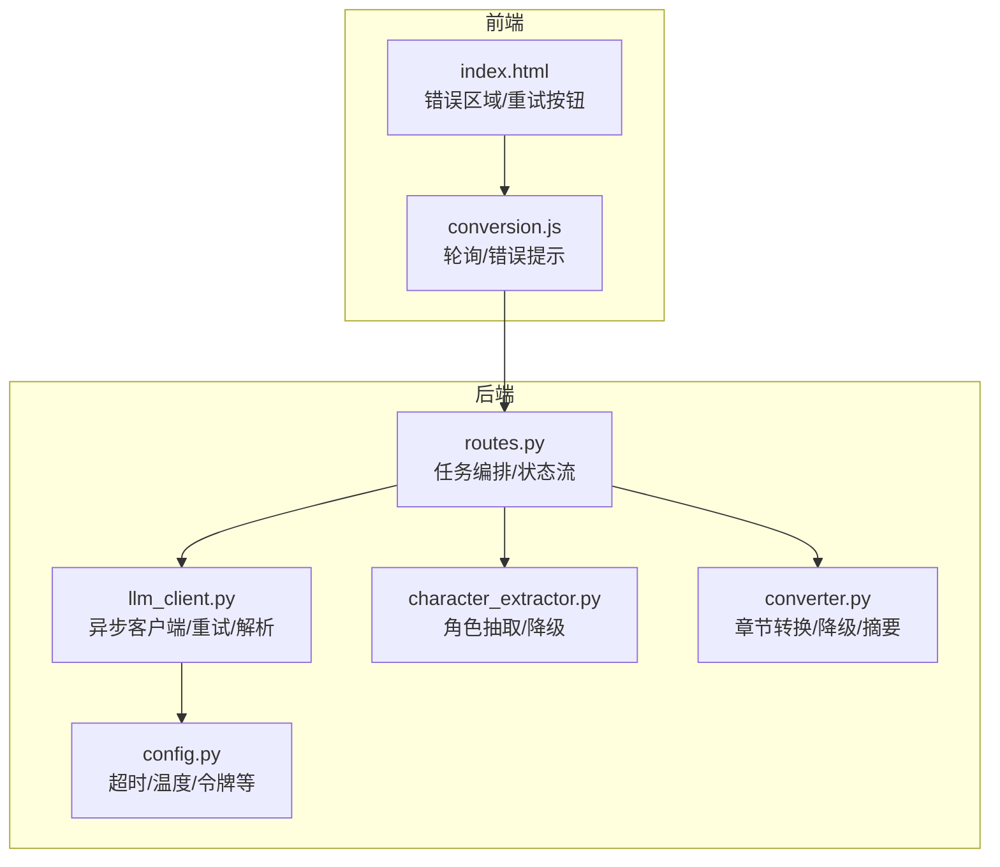
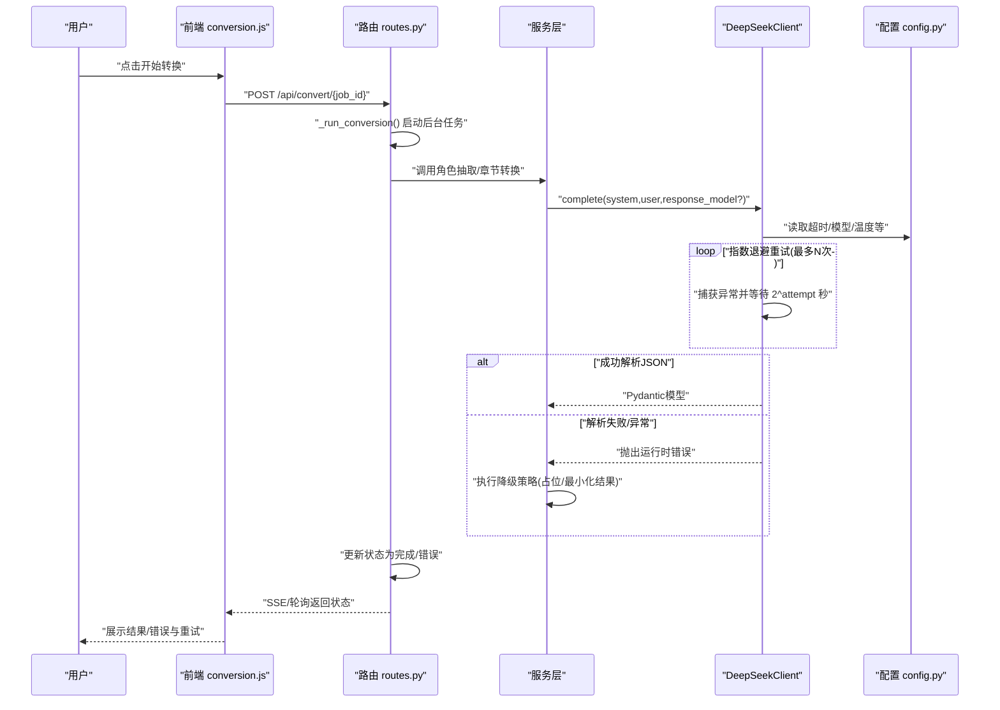
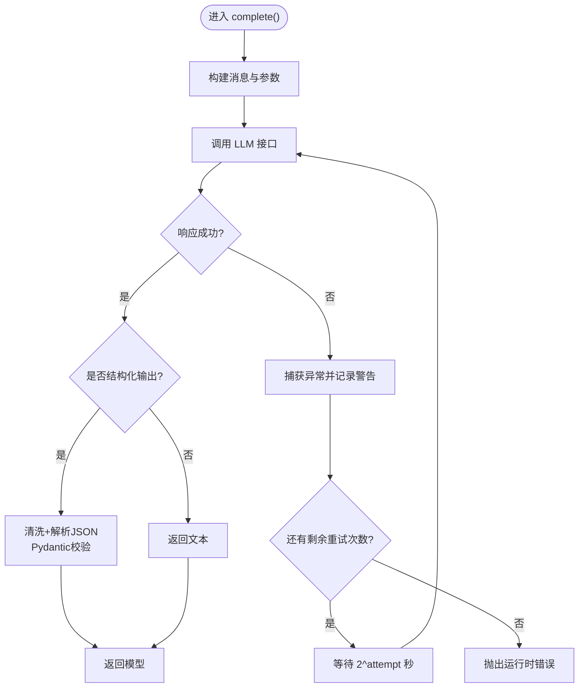
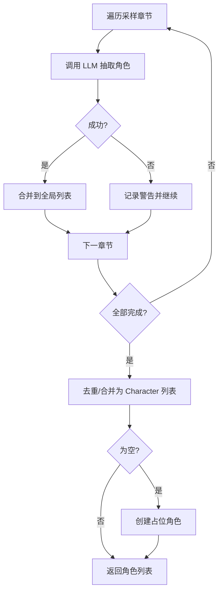
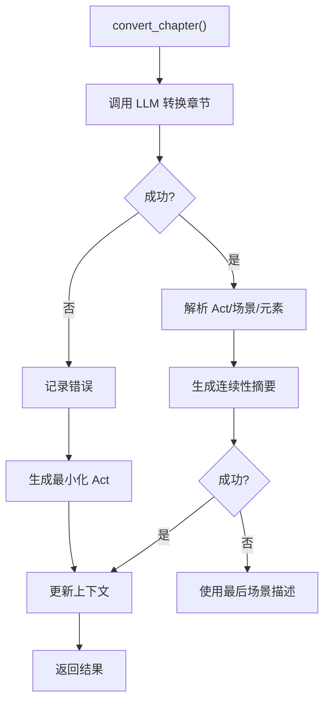
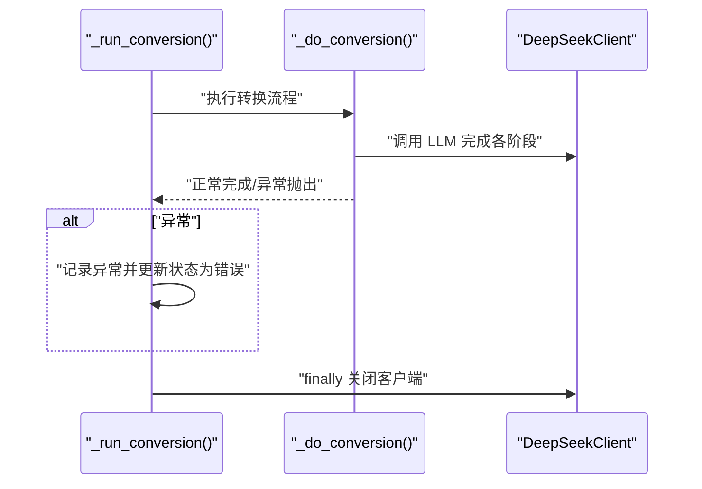
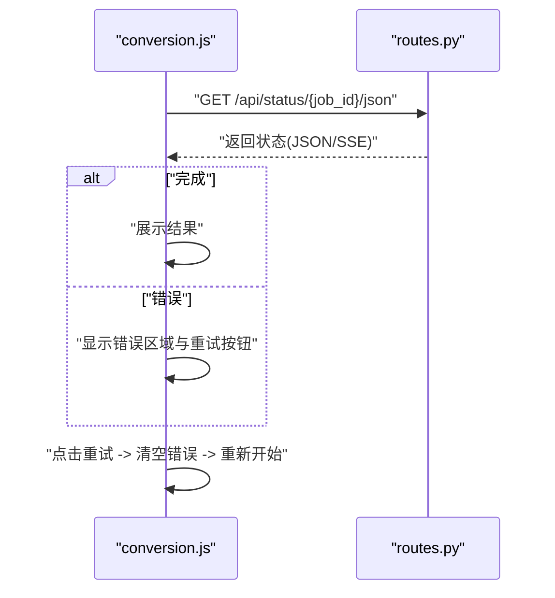
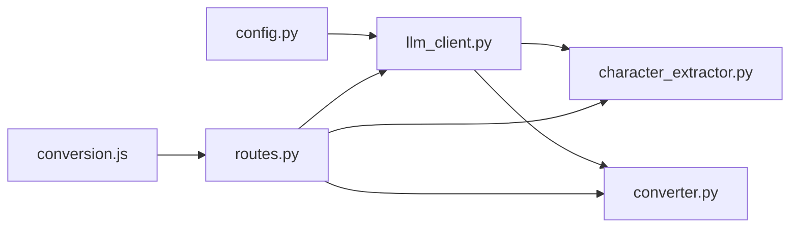

# 错误处理与重试机制

<cite>
**本文引用的文件**
- [app/services/llm_client.py](file://app/services/llm_client.py)
- [app/config.py](file://app/config.py)
- [app/api/routes.py](file://app/api/routes.py)
- [app/services/character_extractor.py](file://app/services/character_extractor.py)
- [app/services/converter.py](file://app/services/converter.py)
- [app/static/js/conversion.js](file://app/static/js/conversion.js)
- [app/templates/index.html](file://app/templates/index.html)
- [app/models/enums.py](file://app/models/enums.py)
- [pyproject.toml](file://pyproject.toml)
</cite>

## 目录
1. [简介](#简介)
2. [项目结构](#项目结构)
3. [核心组件](#核心组件)
4. [架构总览](#架构总览)
5. [详细组件分析](#详细组件分析)
6. [依赖分析](#依赖分析)
7. [性能考虑](#性能考虑)
8. [故障排查指南](#故障排查指南)
9. [结论](#结论)
10. [附录](#附录)

## 简介
本文件系统性梳理本项目的错误处理与重试机制，聚焦于大模型（LLM）调用失败的常见情形与应对策略，覆盖异常类型分类、重试算法、超时与连接管理、错误恢复策略、监控与日志最佳实践，并给出可扩展的自定义策略建议。读者无需深入技术背景即可理解整体流程与关键要点。

## 项目结构
本项目采用分层架构：API 路由层负责任务编排与状态管理；服务层封装业务逻辑与 LLM 客户端；配置层集中管理超时、温度等参数；前端通过轮询或 SSE 获取转换进度并在出错时展示与重试。

图表来源
- [app/api/routes.py:208-313](file://app/api/routes.py#L208-L313)
- [app/services/llm_client.py:18-103](file://app/services/llm_client.py#L18-L103)
- [app/config.py:9-44](file://app/config.py#L9-L44)
- [app/static/js/conversion.js:30-129](file://app/static/js/conversion.js#L30-L129)
- [app/templates/index.html:94-120](file://app/templates/index.html#L94-L120)

章节来源
- [app/api/routes.py:114-313](file://app/api/routes.py#L114-L313)
- [app/services/llm_client.py:18-103](file://app/services/llm_client.py#L18-L103)
- [app/config.py:9-44](file://app/config.py#L9-L44)
- [app/static/js/conversion.js:30-129](file://app/static/js/conversion.js#L30-L129)
- [app/templates/index.html:94-120](file://app/templates/index.html#L94-L120)

## 核心组件
- 异步 LLM 客户端：封装 OpenAI 兼容客户端，统一发送消息、处理 JSON 响应、执行指数退避重试、关闭底层连接。
- 配置中心：集中管理 LLM 超时、温度、输出长度、模型名等参数。
- 业务服务：角色抽取与章节转换服务在 LLM 失败时执行降级策略，保证流程可用。
- API 路由：统一调度转换流程，捕获异常并写入状态，最终关闭 LLM 客户端。
- 前端交互：轮询状态，展示错误并支持重试。

章节来源
- [app/services/llm_client.py:18-103](file://app/services/llm_client.py#L18-L103)
- [app/config.py:9-44](file://app/config.py#L9-L44)
- [app/services/character_extractor.py:21-76](file://app/services/character_extractor.py#L21-L76)
- [app/services/converter.py:36-84](file://app/services/converter.py#L36-L84)
- [app/api/routes.py:208-313](file://app/api/routes.py#L208-L313)
- [app/static/js/conversion.js:30-129](file://app/static/js/conversion.js#L30-L129)

## 架构总览
下图展示了从用户发起到 LLM 调用、重试与降级的整体流程，以及前端轮询与错误展示路径。

图表来源
- [app/api/routes.py:208-313](file://app/api/routes.py#L208-L313)
- [app/services/llm_client.py:33-86](file://app/services/llm_client.py#L33-L86)
- [app/services/character_extractor.py:52-75](file://app/services/character_extractor.py#L52-L75)
- [app/services/converter.py:66-84](file://app/services/converter.py#L66-L84)
- [app/static/js/conversion.js:30-71](file://app/static/js/conversion.js#L30-L71)

## 详细组件分析

### LLM 客户端：异常类型与重试策略
- 异常类型分类
  - 网络超时：由底层客户端超时触发，属于瞬时性故障，适合重试。
  - API 限流/配额不足：通常表现为速率限制或资源不可用，重试需谨慎，建议结合退避与上限控制。
  - 服务不可用：上游服务不可达或内部错误，重试可缓解但需设置最大尝试次数。
  - JSON 解析错误：当启用结构化输出时，若响应非合法 JSON 或被代码块包裹，解析阶段会失败，需要清洗与重试。
- 指数退避重试
  - 最大重试次数：默认 3 次，可在调用处传参覆盖。
  - 退避间隔：按 2 的幂次递增（秒），第 n 次等待 2^(n-1)，避免雪崩效应。
  - 异常捕获：对所有异常进行捕获并记录警告日志，最后一次失败抛出运行时错误。
- JSON 解析增强
  - 自动去除 Markdown 代码块围栏，再进行标准 JSON 解析。
  - 使用 Pydantic 校验，确保数据结构一致性。
- 资源清理
  - 提供显式关闭方法，释放底层 HTTP 客户端连接。

图表来源
- [app/services/llm_client.py:33-86](file://app/services/llm_client.py#L33-L86)
- [app/services/llm_client.py:88-98](file://app/services/llm_client.py#L88-L98)

章节来源
- [app/services/llm_client.py:18-103](file://app/services/llm_client.py#L18-L103)

### 角色抽取服务：降级与容错
- 当某章节 LLM 调用失败时，记录警告并跳过该章节，继续后续章节抽取。
- 若最终未提取到任何角色，使用占位角色（如旁白）保证流程继续。
- 对多章节抽取结果进行去重与合并，提升鲁棒性。

图表来源
- [app/services/character_extractor.py:21-75](file://app/services/character_extractor.py#L21-L75)

章节来源
- [app/services/character_extractor.py:21-76](file://app/services/character_extractor.py#L21-L76)

### 章节转换服务：降级与摘要生成
- 当章节转换失败时，记录错误并生成“最小化”的 Act 结果，保留基本场景与动作元素，确保流程不中断。
- 连续性摘要生成失败时，回退到使用最后场景描述作为摘要，保证上下文连续性。
- 通过较低温度与简洁提示词，降低输出不确定性带来的解析失败概率。

图表来源
- [app/services/converter.py:36-84](file://app/services/converter.py#L36-L84)
- [app/services/converter.py:186-217](file://app/services/converter.py#L186-L217)

章节来源
- [app/services/converter.py:36-84](file://app/services/converter.py#L36-L84)
- [app/services/converter.py:160-183](file://app/services/converter.py#L160-L183)
- [app/services/converter.py:186-217](file://app/services/converter.py#L186-L217)

### API 路由：状态管理与异常捕获
- 后台任务入口捕获顶层异常，记录日志并将状态标记为错误，携带错误信息。
- 在转换流程结束后，无论成功与否，均显式关闭 LLM 客户端，避免连接泄漏。
- 支持 SSE 与 JSON 两种状态查询方式，便于前端适配。

图表来源
- [app/api/routes.py:208-313](file://app/api/routes.py#L208-L313)

章节来源
- [app/api/routes.py:208-313](file://app/api/routes.py#L208-L313)

### 前端：轮询、错误展示与重试
- 前端通过轮询获取状态，遇到错误阶段显示错误区域与重试按钮。
- 点击重试后恢复初始界面，允许用户重新发起转换。
- 该机制与后端状态机配合，确保用户可见的错误与恢复路径清晰。

图表来源
- [app/static/js/conversion.js:30-129](file://app/static/js/conversion.js#L30-L129)
- [app/templates/index.html:94-120](file://app/templates/index.html#L94-L120)

章节来源
- [app/static/js/conversion.js:30-129](file://app/static/js/conversion.js#L30-L129)
- [app/templates/index.html:94-120](file://app/templates/index.html#L94-L120)

## 依赖分析
- LLM 客户端依赖 OpenAI 兼容 SDK，使用异步接口与统一超时配置。
- 业务服务依赖 LLM 客户端与提示模板，实现角色抽取与章节转换。
- API 路由协调服务与 LLM 客户端，维护作业状态与资源回收。
- 前端依赖后端状态接口，实现进度跟踪与错误反馈。

图表来源
- [app/config.py:9-44](file://app/config.py#L9-L44)
- [app/services/llm_client.py:18-103](file://app/services/llm_client.py#L18-L103)
- [app/services/character_extractor.py:11](file://app/services/character_extractor.py#L11)
- [app/services/converter.py:11](file://app/services/converter.py#L11)
- [app/api/routes.py:24](file://app/api/routes.py#L24)
- [app/static/js/conversion.js:30](file://app/static/js/conversion.js#L30)

章节来源
- [pyproject.toml:13-25](file://pyproject.toml#L13-L25)
- [app/services/llm_client.py:8](file://app/services/llm_client.py#L8)

## 性能考虑
- 指数退避：避免并发重试导致的级联失败，但需注意最大等待时间与总耗时。
- 超时设置：统一在配置中管理 LLM 超时，避免单次调用阻塞整条流水线。
- 输出长度与温度：合理设置最大输出与温度，减少无效重试与长尾响应。
- 连接管理：在流程结束时显式关闭客户端，防止连接池耗尽。
- 前端轮询：使用较短轮询间隔（如 1.5 秒）平衡实时性与服务器压力。

[本节为通用性能建议，不直接分析具体文件]

## 故障排查指南
- 常见错误定位
  - LLM 调用失败：查看日志中的警告与最终抛出的运行时错误，确认是否达到最大重试次数。
  - JSON 解析失败：检查响应是否被代码块包裹，确认结构化输出格式是否匹配。
  - 角色抽取为空：确认输入文本长度与采样策略，必要时手动指定 API Key 并提高重试次数。
  - 章节转换异常：关注最小化 Act 的生成路径，确认提示词与上下文传递是否正确。
- 日志与监控
  - 建议在 LLM 客户端增加错误分类计数（超时/限流/解析失败/其他），并记录请求耗时与重试次数。
  - 在 API 层记录作业 ID、阶段与错误信息，便于问题复现与追踪。
- 人工干预
  - 前端提供重试按钮，后端支持用户上传自定义 API Key，以绕过临时配额限制。
  - 对于持续性错误，建议开启更宽松的超时与更高的重试上限，并结合外部监控告警。

章节来源
- [app/services/llm_client.py:80-86](file://app/services/llm_client.py#L80-L86)
- [app/services/character_extractor.py:59-61](file://app/services/character_extractor.py#L59-L61)
- [app/services/converter.py:73-75](file://app/services/converter.py#L73-L75)
- [app/api/routes.py:214-216](file://app/api/routes.py#L214-L216)
- [app/static/js/conversion.js:116-129](file://app/static/js/conversion.js#L116-L129)

## 结论
本项目在 LLM 调用层面实现了统一的指数退避重试与结构化输出解析，在业务层提供了明确的降级策略与资源回收机制。通过前端轮询与错误展示，用户能够直观感知并恢复转换过程。建议在现有基础上补充错误分类统计与性能指标采集，进一步完善可观测性与可运维性。

[本节为总结性内容，不直接分析具体文件]

## 附录

### 配置项与默认行为
- LLM 超时：来自配置中心，默认值用于初始化异步客户端。
- 最大输出长度与温度：用于控制响应规模与多样性，减少无效重试。
- 模型名称：统一模型标识，便于切换与灰度。

章节来源
- [app/config.py:27-31](file://app/config.py#L27-L31)
- [app/services/llm_client.py:21-31](file://app/services/llm_client.py#L21-L31)

### 状态枚举与错误状态
- 转换阶段枚举：涵盖上传、解析、拆分、角色抽取、转换、组装、验证、完成、错误等阶段。
- 错误状态：当出现异常时，后端将状态更新为错误并携带错误信息，前端据此展示。

章节来源
- [app/models/enums.py:72-83](file://app/models/enums.py#L72-L83)
- [app/api/routes.py:214-216](file://app/api/routes.py#L214-L216)

### 扩展与自定义建议
- 新增异常类型处理
  - 在 LLM 客户端中区分不同异常类型（如超时、限流、解析失败），分别记录与统计。
  - 对特定异常（如限流）增加熔断或退避上限保护。
- 自定义重试策略
  - 将最大重试次数与退避系数参数化，支持按服务或作业级别调整。
  - 引入抖动因子，避免多个实例同时重试。
- 监控与日志
  - 增加埋点：错误分类计数、重试次数、响应耗时、成功率。
  - 输出结构化日志，包含作业 ID、阶段、异常类型、重试间隔等。
- 降级策略增强
  - 角色抽取与章节转换的降级结果可写入缓存或制品库，便于人工复核与二次处理。
  - 对关键步骤增加人工干预开关，允许在异常时暂停并由用户选择继续或终止。

[本节为扩展建议，不直接分析具体文件]