# JavaScript交互逻辑

<cite>
**本文档引用的文件**
- [upload.js](file://app/static/js/upload.js)
- [conversion.js](file://app/static/js/conversion.js)
- [editor.js](file://app/static/js/editor.js)
- [samples.js](file://app/static/js/samples.js)
- [index.html](file://app/templates/index.html)
- [preview.html](file://app/templates/preview.html)
- [app.css](file://app/static/css/app.css)
</cite>

## 更新摘要
**所做更改**
- 更新了编辑器模块，新增了剧本文本后处理器功能
- 增强了UI功能，包括改进的流式输出显示和终端风格界面
- 新增了Markdown渲染优化和实时预览功能
- 改进了API密钥管理和本地存储机制
- 更新了转换流程控制的错误处理和状态管理

## 目录
1. [简介](#简介)
2. [项目结构](#项目结构)
3. [核心组件](#核心组件)
4. [架构概览](#架构概览)
5. [详细组件分析](#详细组件分析)
6. [依赖关系分析](#依赖关系分析)
7. [性能考虑](#性能考虑)
8. [故障排除指南](#故障排除指南)
9. [结论](#结论)

## 简介

本项目是一个小说到剧本转换系统，提供了完整的前端JavaScript交互逻辑实现。系统包含四个主要的JavaScript模块：文件上传处理（upload.js）、转换流程控制（conversion.js）、编辑器功能（editor.js）和样例管理（samples.js）。这些模块协同工作，为用户提供从文件上传、转换进度跟踪到最终结果预览和编辑的完整体验。

系统采用现代JavaScript特性，包括异步函数、Promise链式调用、事件监听器管理和错误处理机制。通过模块化的架构设计，实现了清晰的功能分离和良好的可维护性。最新的更新包括新的剧本文本后处理器和改进的UI功能，显著提升了用户体验和输出质量。

## 项目结构

项目采用前后端分离的架构，JavaScript文件位于`app/static/js/`目录下，HTML模板文件位于`app/templates/`目录下。每个JavaScript文件负责特定的功能模块，通过事件驱动的方式进行交互。

```mermaid
graph TB
subgraph "前端静态资源"
JS[JavaScript文件]
CSS[CSS样式表]
HTML[HTML模板]
END
subgraph "业务逻辑模块"
Upload[文件上传模块]
Conversion[转换控制模块]
Editor[编辑器模块]
Samples[样例管理模块]
END
subgraph "用户界面"
DropZone[拖拽上传区域]
Progress[进度显示]
Result[结果展示]
Error[错误处理]
Validation[验证面板]
Streaming[流式输出]
EditorTabs[编辑器标签页]
PostProcessor[剧本文本后处理器]
END
JS --> Upload
JS --> Conversion
JS --> Editor
JS --> Samples
Upload --> DropZone
Conversion --> Progress
Conversion --> Result
Conversion --> Error
Conversion --> Validation
Conversion --> Streaming
Editor --> EditorTabs
Editor --> PostProcessor
```

**图表来源**
- [upload.js:1-160](file://app/static/js/upload.js#L1-L160)
- [conversion.js:1-230](file://app/static/js/conversion.js#L1-L230)
- [editor.js:1-511](file://app/static/js/editor.js#L1-L511)
- [samples.js:1-226](file://app/static/js/samples.js#L1-L226)

**章节来源**
- [upload.js:1-160](file://app/static/js/upload.js#L1-L160)
- [conversion.js:1-230](file://app/static/js/conversion.js#L1-L230)
- [editor.js:1-511](file://app/static/js/editor.js#L1-L511)
- [samples.js:1-226](file://app/static/js/samples.js#L1-L226)

## 核心组件

### 文件上传处理模块 (upload.js)

文件上传模块是整个系统的入口点，负责处理用户文件选择、拖拽上传和文件验证。该模块实现了完整的文件上传生命周期管理，包括文件类型验证、大小限制检查和上传进度反馈。

主要功能特性：
- 支持多种文件格式：TXT、MD、MARKDOWN、DOCX、PDF
- 拖拽上传和点击选择两种文件选择方式
- 实时文件信息显示和验证
- API密钥安全输入和切换显示
- 异步上传和转换启动
- **新增**：状态重置功能，支持转换完成后恢复按钮状态
- **新增**：本地存储API密钥缓存机制

### 转换流程控制模块 (conversion.js)

转换流程控制模块负责监控转换过程的状态变化，提供实时的进度反馈和用户交互。该模块实现了基于Server-Sent Events (SSE) 的实时进度跟踪，替代了传统的轮询机制，提高了效率和用户体验。

核心功能：
- **增强**：基于SSE的实时进度跟踪，支持流式输出显示
- 多阶段转换状态跟踪
- 实时进度百分比显示
- 章节检测进度指示
- 错误处理和重试机制
- 结果展示和下载链接生成
- **新增**：验证问题面板，显示详细的验证结果
- **新增**：状态重置功能，支持转换完成后的状态恢复
- **新增**：流式输出缓冲区管理

### 编辑器模块 (editor.js)

编辑器模块提供了完整的剧本编辑功能，集成了YAML编辑、AI建议修改和正式剧本生成。该模块实现了现代化的编辑器界面，支持多种编辑模式和实时预览。

关键特性：
- **新增**：CodeMirror YAML编辑器，支持语法高亮和智能编辑
- **新增**：AI建议修改功能，支持流式输出显示
- **新增**：正式剧本生成，支持Markdown渲染和编辑
- **新增**：标签页管理，支持YAML编辑、AI建议和剧本预览
- **新增**：流式输出处理，支持实时内容渲染
- **新增**：剧本文本后处理器，专门处理LLM输出格式问题
- **新增**：Markdown渲染优化，支持更好的显示效果
- **新增**：终端风格界面，提供更好的用户体验

### 样例管理模块 (samples.js)

样例管理模块负责处理样例小说的加载、显示和历史记录功能。该模块提供了用户友好的样例选择界面和实时的历史记录更新。

关键特性：
- **新增**：样例小说加载和显示功能
- **新增**：样例预览和使用功能
- **新增**：转换历史记录的实时更新
- **新增**：历史记录状态颜色标识
- **新增**：定期自动刷新机制

**章节来源**
- [upload.js:15-79](file://app/static/js/upload.js#L15-L79)
- [conversion.js:18-88](file://app/static/js/conversion.js#L18-L88)
- [editor.js:1-511](file://app/static/js/editor.js#L1-L511)
- [samples.js:1-226](file://app/static/js/samples.js#L1-L226)

## 架构概览

系统采用模块化架构设计，四个JavaScript模块通过事件驱动的方式协同工作。上传模块负责启动转换流程，转换模块提供进度跟踪和验证，编辑器模块处理结果编辑，样例模块管理样例和历史记录。

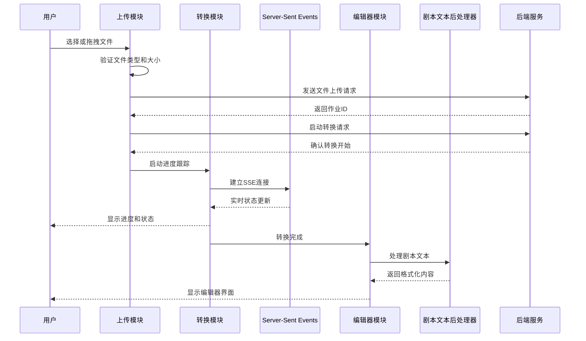

**图表来源**
- [upload.js:96-150](file://app/static/js/upload.js#L96-L150)
- [conversion.js:50-93](file://app/static/js/conversion.js#L50-L93)
- [editor.js:97-186](file://app/static/js/editor.js#L97-L186)

## 详细组件分析

### 文件上传处理组件

#### 数据结构和状态管理

文件上传模块使用简单的状态管理模式，主要维护以下状态变量：

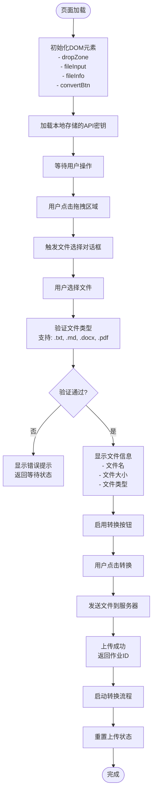

**图表来源**
- [upload.js:67-85](file://app/static/js/upload.js#L67-L85)
- [upload.js:96-150](file://app/static/js/upload.js#L96-L150)

#### 事件处理机制

模块实现了多层次的事件处理机制：

1. **拖拽事件处理**：
   - `dragover`：添加视觉反馈效果
   - `dragleave`：移除视觉反馈
   - `drop`：处理拖拽释放的文件

2. **文件选择处理**：
   - `click`：触发文件选择对话框
   - `change`：处理文件选择完成事件

3. **用户交互处理**：
   - `click`：删除已选文件
   - `click`：切换API密钥显示
   - **新增**：状态重置处理

#### 错误处理策略

文件上传模块采用了多层错误处理策略：

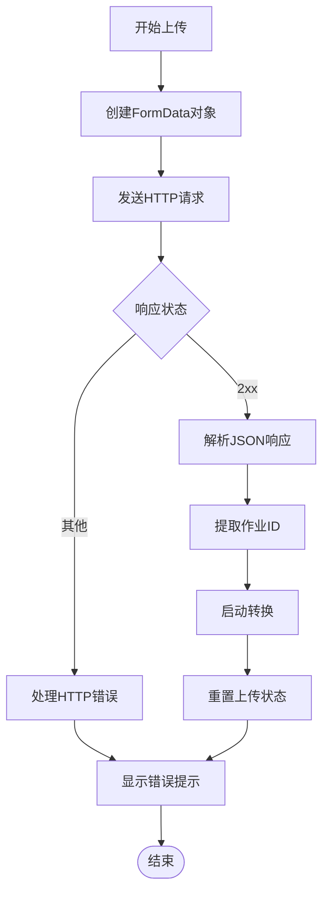

**图表来源**
- [upload.js:103-150](file://app/static/js/upload.js#L103-L150)

**章节来源**
- [upload.js:1-160](file://app/static/js/upload.js#L1-L160)

### 转换流程控制组件

#### 状态跟踪机制

转换流程控制模块实现了完整的状态跟踪机制，支持多个转换阶段：

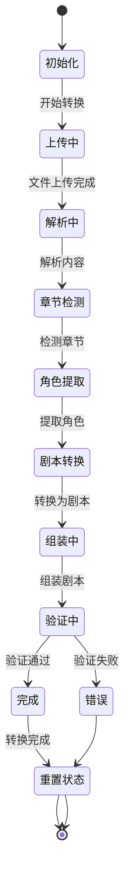

**图表来源**
- [conversion.js:27-37](file://app/static/js/conversion.js#L27-L37)
- [conversion.js:140-179](file://app/static/js/conversion.js#L140-L179)

#### 实时进度跟踪机制

模块使用Server-Sent Events (SSE) 实现实时进度跟踪，替代了传统的轮询机制：

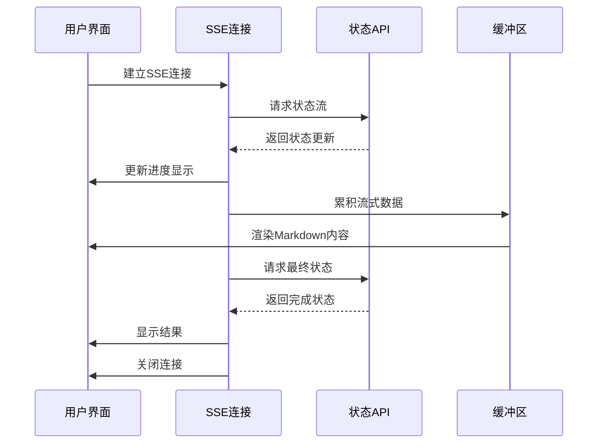

**图表来源**
- [conversion.js:57-93](file://app/static/js/conversion.js#L57-L93)

#### 验证问题面板

模块提供了详细的验证问题显示功能：

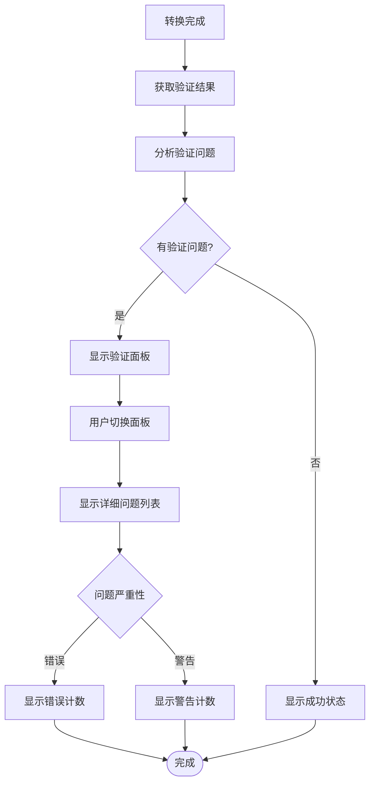

**图表来源**
- [conversion.js:152-179](file://app/static/js/conversion.js#L152-L179)
- [conversion.js:181-209](file://app/static/js/conversion.js#L181-L209)

#### 用户反馈系统

模块提供了丰富的用户反馈机制：

1. **实时进度百分比显示**：基于SSE的实时进度更新
2. **阶段文本描述**：显示当前转换阶段
3. **章节信息**：显示章节检测进度
4. **验证问题面板**：详细的问题列表和严重性标识
5. **流式输出显示**：实时渲染的Markdown内容
6. **错误处理**：友好的错误消息显示和重试机制
7. **状态重置**：转换完成后的状态恢复

**章节来源**
- [conversion.js:1-230](file://app/static/js/conversion.js#L1-L230)

### 编辑器组件

#### YAML编辑器功能

编辑器模块实现了完整的YAML编辑功能：

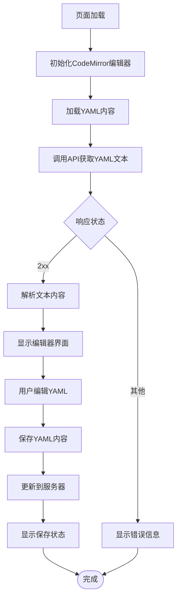

**图表来源**
- [editor.js:57-95](file://app/static/js/editor.js#L57-L95)

#### AI建议修改功能

模块提供了AI驱动的建议修改功能：

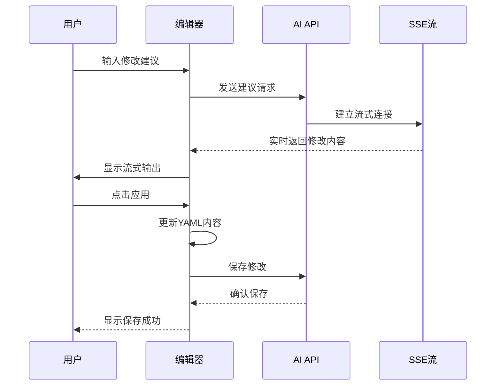

**图表来源**
- [editor.js:114-192](file://app/static/js/editor.js#L114-L192)

#### 正式剧本生成功能

模块实现了正式剧本的生成和编辑功能：

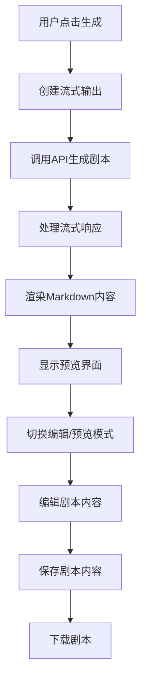

**图表来源**
- [editor.js:248-352](file://app/static/js/editor.js#L248-L352)

#### 剧本文本后处理器

**新增** 模块的核心创新功能，专门处理LLM输出的格式问题：

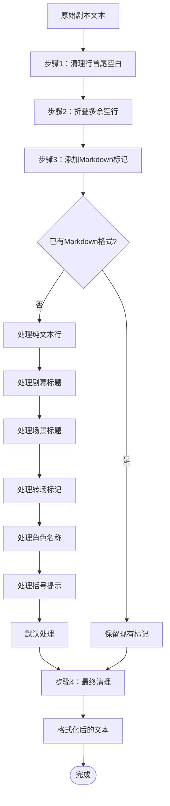

**图表来源**
- [editor.js:97-186](file://app/static/js/editor.js#L97-L186)

#### 交互功能

编辑器模块提供了多种用户交互功能：

1. **标签页管理**：YAML编辑、AI建议、正式剧本三个标签页
2. **CodeMirror集成**：专业的YAML编辑器，支持语法高亮
3. **流式输出**：实时渲染的Markdown内容显示
4. **内容保存**：自动保存和手动保存功能
5. **下载功能**：直接下载YAML和剧本内容
6. **错误处理**：网络错误时的降级显示
7. **终端风格界面**：提供更好的用户体验
8. **Markdown渲染优化**：支持更好的显示效果

**章节来源**
- [editor.js:1-511](file://app/static/js/editor.js#L1-L511)

### 样例管理组件

#### 样例加载机制

样例管理模块实现了样例小说的加载和显示机制：

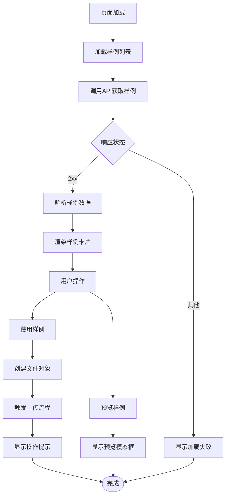

**图表来源**
- [samples.js:14-85](file://app/static/js/samples.js#L14-L85)

#### 历史记录功能

模块提供了实时的历史记录显示功能：

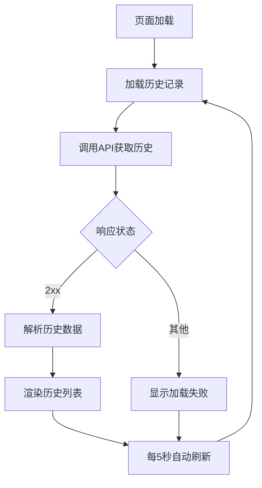

**图表来源**
- [samples.js:120-221](file://app/static/js/samples.js#L120-L221)

#### 交互功能

样例管理模块提供了多种用户交互功能：

1. **样例加载**：从服务器获取样例列表
2. **样例使用**：将样例转换为文件并触发上传流程
3. **样例预览**：显示样例内容的模态框
4. **历史记录**：显示转换历史和状态
5. **自动刷新**：定期更新历史记录状态
6. **错误处理**：网络错误时的降级显示

**章节来源**
- [samples.js:1-226](file://app/static/js/samples.js#L1-L226)

## 依赖关系分析

### 模块间依赖

```mermaid
graph LR
subgraph "外部依赖"
HLJS[highlight.js]
CodeMirror[CodeMirror]
Fetch[Fetch API]
Clipboard[Clipboard API]
marked[marked.js]
SSE[Server-Sent Events]
END
subgraph "内部模块"
Upload[upload.js]
Conversion[conversion.js]
Editor[editor.js]
Samples[samples.js]
END
Upload --> Fetch
Upload --> Conversion
Conversion --> SSE
Conversion --> Fetch
Editor --> CodeMirror
Editor --> marked
Editor --> Fetch
Samples --> Fetch
Editor --> Upload
Conversion --> Upload
```

**图表来源**
- [upload.js:107-133](file://app/static/js/upload.js#L107-L133)
- [conversion.js:58-71](file://app/static/js/conversion.js#L58-L71)
- [editor.js:34-44](file://app/static/js/editor.js#L34-L44)
- [samples.js:16-25](file://app/static/js/samples.js#L16-L25)

### 浏览器兼容性

系统在设计时充分考虑了浏览器兼容性：

1. **ES5+语法**：使用现代JavaScript特性但保持向后兼容
2. **渐进增强**：基础功能在旧版浏览器中仍可正常工作
3. **polyfill策略**：避免使用需要polyfill的高级特性
4. **降级处理**：关键功能的备用实现方案
5. **SSE兼容性**：提供轮询作为SSE失败的降级方案

### 性能优化策略

系统采用了多项性能优化措施：

1. **懒加载**：JavaScript文件按需加载
2. **事件委托**：减少事件监听器数量
3. **防抖处理**：避免重复的API调用
4. **内存管理**：及时清理DOM引用和事件监听器
5. **流式处理**：SSE和流式API的高效处理
6. **缓存机制**：localStorage用于API密钥缓存

**章节来源**
- [upload.js:1-160](file://app/static/js/upload.js#L1-L160)
- [conversion.js:1-230](file://app/static/js/conversion.js#L1-L230)
- [editor.js:1-511](file://app/static/js/editor.js#L1-L511)
- [samples.js:1-226](file://app/static/js/samples.js#L1-L226)

## 性能考虑

### 异步处理优化

系统充分利用现代JavaScript的异步特性：

1. **Promise链式调用**：避免回调地狱，提高代码可读性
2. **async/await语法**：简化异步代码编写
3. **错误捕获**：统一的错误处理机制
4. **并发控制**：合理控制同时进行的异步操作数量
5. **流式处理**：SSE和ReadableStream的高效处理

### 内存泄漏防护

模块实现了完善的内存泄漏防护机制：

1. **事件监听器管理**：在适当时候移除不需要的监听器
2. **DOM引用清理**：及时清理不再使用的DOM引用
3. **定时器管理**：确保轮询定时器正确停止
4. **SSE连接管理**：确保SSE连接正确关闭
5. **闭包优化**：避免不必要的闭包引用

### 用户体验优化

系统注重用户体验的各个方面：

1. **即时反馈**：用户操作后立即得到视觉反馈
2. **加载状态**：长时间操作时显示加载指示器
3. **错误友好**：错误消息清晰易懂，提供解决方案
4. **无障碍访问**：支持键盘导航和屏幕阅读器
5. **响应式设计**：适配不同屏幕尺寸的设备
6. **状态持久化**：使用localStorage存储用户偏好

## 故障排除指南

### 常见问题诊断

1. **文件上传失败**
   - 检查文件格式是否受支持
   - 验证文件大小限制
   - 确认网络连接稳定

2. **转换进度停滞**
   - 检查后端服务状态
   - 验证API密钥有效性
   - 查看浏览器控制台错误
   - **新增**：检查SSE连接状态

3. **YAML编辑器显示异常**
   - 确认CodeMirror库加载成功
   - 检查网络连接和CDN可用性
   - 验证YAML内容格式正确

4. **验证问题面板不显示**
   - 检查验证API的可用性
   - 确认作业ID有效
   - 查看浏览器控制台错误

5. **剧本文本后处理器失效**
   - 检查后处理器函数是否正确加载
   - 验证输入文本格式
   - 查看浏览器控制台错误

### 调试技巧

1. **浏览器开发者工具**：使用Network标签监控API调用
2. **控制台日志**：添加适当的调试输出
3. **错误边界**：实现全局错误处理机制
4. **性能分析**：使用Performance标签分析性能瓶颈
5. **SSE调试**：使用浏览器开发者工具的Network标签查看SSE连接

**章节来源**
- [upload.js:145-150](file://app/static/js/upload.js#L145-L150)
- [conversion.js:88-93](file://app/static/js/conversion.js#L88-L93)
- [editor.js:176-182](file://app/static/js/editor.js#L176-L182)

## 结论

本项目展示了现代JavaScript前端开发的最佳实践，通过模块化设计和清晰的职责分离，实现了复杂业务逻辑的优雅处理。四个JavaScript模块各司其职，既独立运行又紧密协作，为用户提供了流畅的文件转换和编辑体验。

系统在技术实现上体现了以下特点：
- **模块化架构**：清晰的功能分离和职责划分
- **现代JavaScript特性**：充分利用async/await、SSE、流式API等新特性
- **用户体验优先**：注重交互反馈和错误处理
- **性能优化**：合理的异步处理和内存管理
- **兼容性考虑**：平衡新特性和浏览器兼容性
- **实时性**：基于SSE的实时进度跟踪和流式输出
- **完整性**：从上传到编辑的完整工作流程
- **创新功能**：新增的剧本文本后处理器显著提升了输出质量

通过这些设计和实现，系统不仅满足了功能需求，还为后续的功能扩展和维护奠定了良好的基础。新增的验证问题面板、流式输出显示、状态重置功能和剧本文本后处理器进一步提升了用户体验和系统的实用性。

**最新更新**：剧本文本后处理器的引入是本次更新的核心亮点，它专门解决了LLM输出格式问题，通过智能识别和添加Markdown标记，显著改善了剧本内容的显示效果，为用户提供了更专业、更易读的剧本编辑体验。