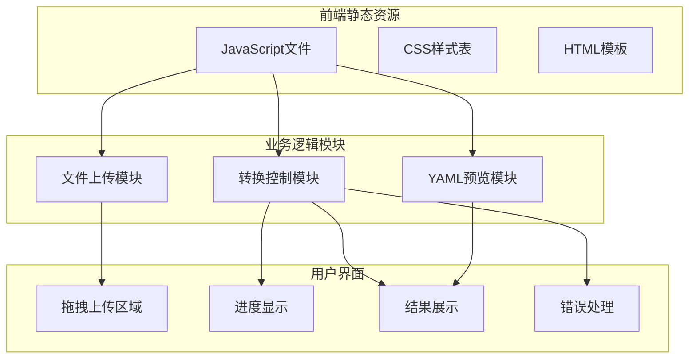
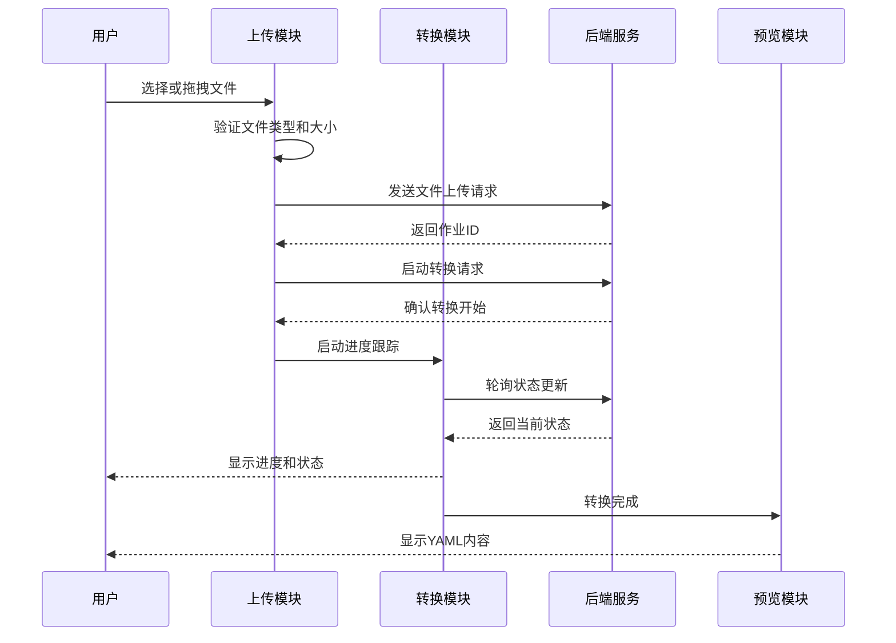
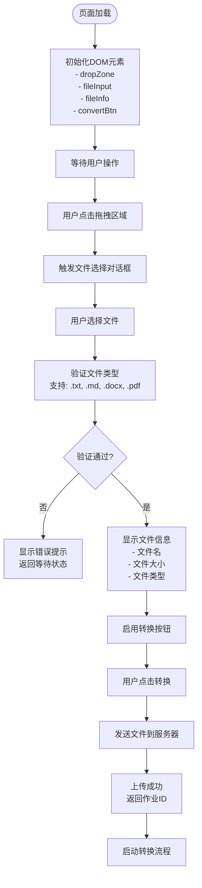
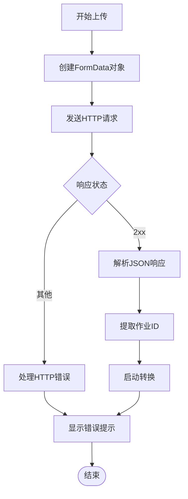
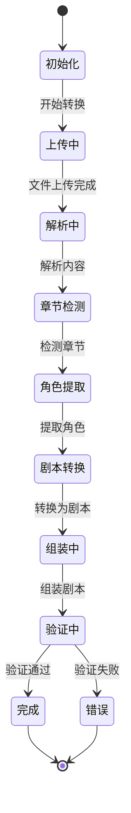
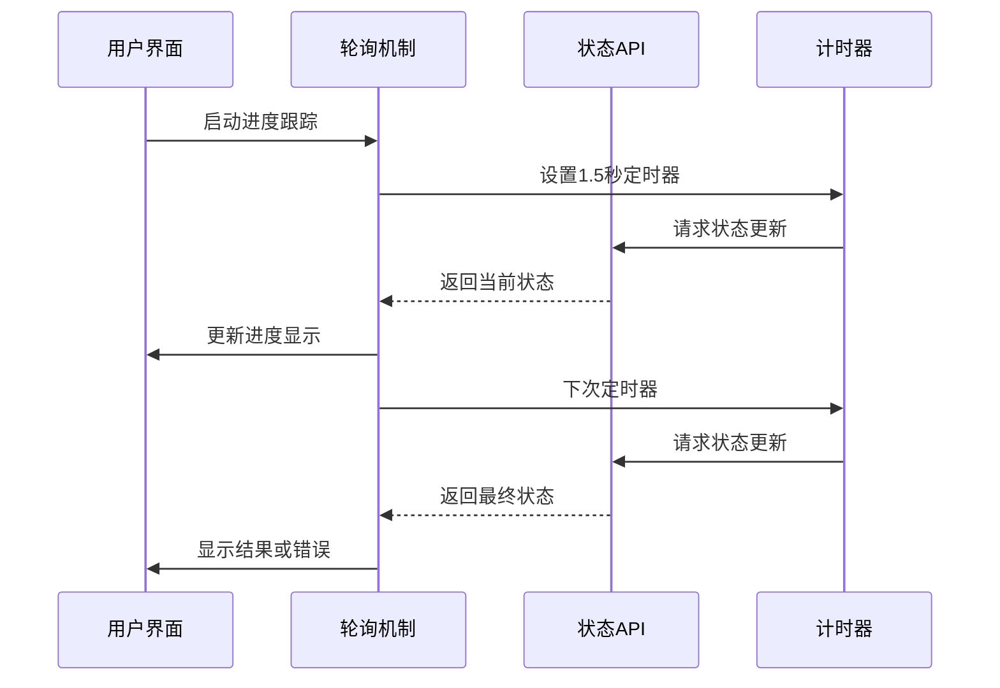
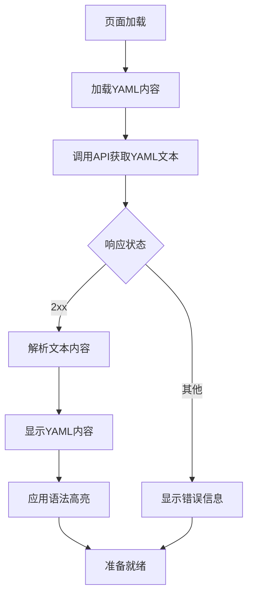
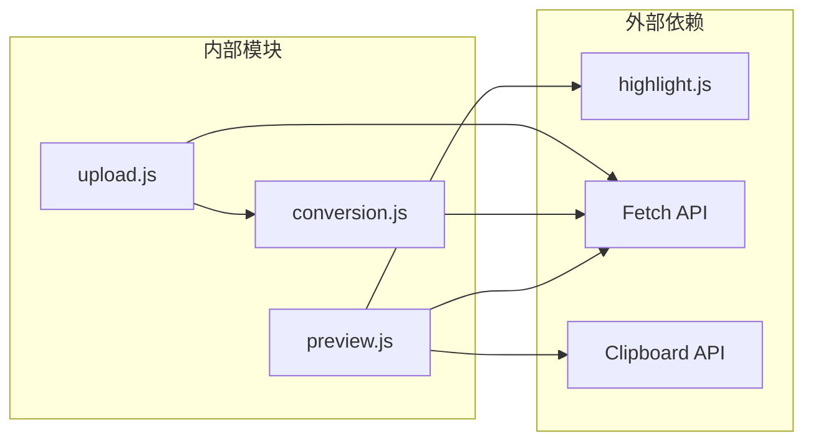

# JavaScript交互逻辑

<cite>
**本文档引用的文件**
- [upload.js](file://app/static/js/upload.js)
- [conversion.js](file://app/static/js/conversion.js)
- [preview.js](file://app/static/js/preview.js)
- [index.html](file://app/templates/index.html)
- [preview.html](file://app/templates/preview.html)
- [app.css](file://app/static/css/app.css)
</cite>

## 目录
1. [简介](#简介)
2. [项目结构](#项目结构)
3. [核心组件](#核心组件)
4. [架构概览](#架构概览)
5. [详细组件分析](#详细组件分析)
6. [依赖关系分析](#依赖关系分析)
7. [性能考虑](#性能考虑)
8. [故障排除指南](#故障排除指南)
9. [结论](#结论)

## 简介

本项目是一个小说到剧本转换系统，提供了完整的前端JavaScript交互逻辑实现。系统包含三个主要的JavaScript模块：文件上传处理（upload.js）、转换流程控制（conversion.js）和YAML预览功能（preview.js）。这些模块协同工作，为用户提供从文件上传、转换进度跟踪到最终结果预览的完整体验。

系统采用现代JavaScript特性，包括异步函数、Promise链式调用、事件监听器管理和错误处理机制。通过模块化的架构设计，实现了清晰的功能分离和良好的可维护性。

## 项目结构

项目采用前后端分离的架构，JavaScript文件位于`app/static/js/`目录下，HTML模板文件位于`app/templates/`目录下。每个JavaScript文件负责特定的功能模块，通过事件驱动的方式进行交互。

**图表来源**
- [upload.js:1-131](file://app/static/js/upload.js#L1-L131)
- [conversion.js:1-130](file://app/static/js/conversion.js#L1-L130)
- [preview.js:1-46](file://app/static/js/preview.js#L1-L46)

**章节来源**
- [upload.js:1-131](file://app/static/js/upload.js#L1-L131)
- [conversion.js:1-130](file://app/static/js/conversion.js#L1-L130)
- [preview.js:1-46](file://app/static/js/preview.js#L1-L46)

## 核心组件

### 文件上传处理模块 (upload.js)

文件上传模块是整个系统的入口点，负责处理用户文件选择、拖拽上传和文件验证。该模块实现了完整的文件上传生命周期管理，包括文件类型验证、大小限制检查和上传进度反馈。

主要功能特性：
- 支持多种文件格式：TXT、MD、DOCX、PDF
- 拖拽上传和点击选择两种文件选择方式
- 实时文件信息显示和验证
- API密钥安全输入和切换显示
- 异步上传和转换启动

### 转换流程控制模块 (conversion.js)

转换流程控制模块负责监控转换过程的状态变化，提供实时的进度反馈和用户交互。该模块实现了基于轮询的状态检查机制，替代了传统的Server-Sent Events，提高了浏览器兼容性。

核心功能：
- 多阶段转换状态跟踪
- 实时进度百分比显示
- 章节检测进度指示
- 错误处理和重试机制
- 结果展示和下载链接生成

### YAML预览模块 (preview.js)

YAML预览模块专注于提供高质量的YAML内容展示，集成了语法高亮和复制功能。该模块确保用户能够清晰地查看转换后的剧本内容。

关键特性：
- 语法高亮显示
- 复制到剪贴板功能
- 错误处理和降级显示
- 响应式布局适配

**章节来源**
- [upload.js:15-79](file://app/static/js/upload.js#L15-L79)
- [conversion.js:18-88](file://app/static/js/conversion.js#L18-L88)
- [preview.js:9-28](file://app/static/js/preview.js#L9-L28)

## 架构概览

系统采用模块化架构设计，三个JavaScript模块通过事件驱动的方式协同工作。上传模块负责启动转换流程，转换模块提供进度跟踪，预览模块展示最终结果。

**图表来源**
- [upload.js:82-129](file://app/static/js/upload.js#L82-L129)
- [conversion.js:30-71](file://app/static/js/conversion.js#L30-L71)

## 详细组件分析

### 文件上传处理组件

#### 数据结构和状态管理

文件上传模块使用简单的状态管理模式，主要维护以下状态变量：

**图表来源**
- [upload.js:61-79](file://app/static/js/upload.js#L61-L79)
- [upload.js:82-129](file://app/static/js/upload.js#L82-L129)

#### 事件处理机制

模块实现了多层次的事件处理机制：

1. **拖拽事件处理**：
   - `dragover`：添加视觉反馈效果
   - `dragleave`：移除视觉反馈
   - `drop`：处理拖拽释放的文件

2. **文件选择处理**：
   - `click`：触发文件选择对话框
   - `change`：处理文件选择完成事件

3. **用户交互处理**：
   - `click`：删除已选文件
   - `click`：切换API密钥显示

#### 错误处理策略

文件上传模块采用了多层错误处理策略：

**图表来源**
- [upload.js:88-128](file://app/static/js/upload.js#L88-L128)

**章节来源**
- [upload.js:1-131](file://app/static/js/upload.js#L1-L131)

### 转换流程控制组件

#### 状态跟踪机制

转换流程控制模块实现了完整的状态跟踪机制，支持多个转换阶段：

**图表来源**
- [conversion.js:18-28](file://app/static/js/conversion.js#L18-L28)

#### 进度更新机制

模块使用轮询机制替代Server-Sent Events，提高了浏览器兼容性：

**图表来源**
- [conversion.js:37-71](file://app/static/js/conversion.js#L37-L71)

#### 用户反馈系统

模块提供了丰富的用户反馈机制：

1. **进度百分比显示**：实时更新转换进度
2. **阶段文本描述**：显示当前转换阶段
3. **章节信息**：显示章节检测进度
4. **错误处理**：友好的错误消息显示
5. **重试机制**：错误发生时的恢复选项

**章节来源**
- [conversion.js:1-130](file://app/static/js/conversion.js#L1-L130)

### YAML预览组件

#### 内容加载机制

YAML预览模块实现了异步内容加载和显示机制：

**图表来源**
- [preview.js:9-28](file://app/static/js/preview.js#L9-L28)

#### 语法高亮集成

模块集成了highlight.js库，提供专业的YAML语法高亮：

1. **自动检测语言**：识别YAML语法
2. **主题应用**：使用GitHub风格的主题
3. **动态更新**：内容变更时重新高亮
4. **性能优化**：仅对可见内容进行高亮处理

#### 交互功能

预览模块提供了多种用户交互功能：

1. **一键复制**：将YAML内容复制到剪贴板
2. **下载功能**：直接下载转换结果
3. **导航控制**：返回主页面或继续转换
4. **错误处理**：网络错误时的降级显示

**章节来源**
- [preview.js:1-46](file://app/static/js/preview.js#L1-L46)

## 依赖关系分析

### 模块间依赖

**图表来源**
- [upload.js:92-112](file://app/static/js/upload.js#L92-L112)
- [conversion.js:41-47](file://app/static/js/conversion.js#L41-L47)
- [preview.js:11-22](file://app/static/js/preview.js#L11-L22)

### 浏览器兼容性

系统在设计时充分考虑了浏览器兼容性：

1. **ES5+语法**：使用现代JavaScript特性但保持向后兼容
2. **渐进增强**：基础功能在旧版浏览器中仍可正常工作
3. **polyfill策略**：避免使用需要polyfill的高级特性
4. **降级处理**：关键功能的备用实现方案

### 性能优化策略

系统采用了多项性能优化措施：

1. **懒加载**：JavaScript文件按需加载
2. **事件委托**：减少事件监听器数量
3. **防抖处理**：避免重复的API调用
4. **内存管理**：及时清理DOM引用和事件监听器

**章节来源**
- [upload.js:1-131](file://app/static/js/upload.js#L1-L131)
- [conversion.js:1-130](file://app/static/js/conversion.js#L1-L130)
- [preview.js:1-46](file://app/static/js/preview.js#L1-L46)

## 性能考虑

### 异步处理优化

系统充分利用现代JavaScript的异步特性：

1. **Promise链式调用**：避免回调地狱，提高代码可读性
2. **async/await语法**：简化异步代码编写
3. **错误捕获**：统一的错误处理机制
4. **并发控制**：合理控制同时进行的异步操作数量

### 内存泄漏防护

模块实现了完善的内存泄漏防护机制：

1. **事件监听器管理**：在适当时候移除不需要的监听器
2. **DOM引用清理**：及时清理不再使用的DOM引用
3. **定时器管理**：确保轮询定时器正确停止
4. **闭包优化**：避免不必要的闭包引用

### 用户体验优化

系统注重用户体验的各个方面：

1. **即时反馈**：用户操作后立即得到视觉反馈
2. **加载状态**：长时间操作时显示加载指示器
3. **错误友好**：错误消息清晰易懂，提供解决方案
4. **无障碍访问**：支持键盘导航和屏幕阅读器

## 故障排除指南

### 常见问题诊断

1. **文件上传失败**
   - 检查文件格式是否受支持
   - 验证文件大小限制
   - 确认网络连接稳定

2. **转换进度停滞**
   - 检查后端服务状态
   - 验证API密钥有效性
   - 查看浏览器控制台错误

3. **YAML预览显示异常**
   - 确认highlight.js库加载成功
   - 检查网络连接和CDN可用性
   - 验证YAML内容格式正确

### 调试技巧

1. **浏览器开发者工具**：使用Network标签监控API调用
2. **控制台日志**：添加适当的调试输出
3. **错误边界**：实现全局错误处理机制
4. **性能分析**：使用Performance标签分析性能瓶颈

**章节来源**
- [upload.js:88-128](file://app/static/js/upload.js#L88-L128)
- [conversion.js:64-67](file://app/static/js/conversion.js#L64-L67)
- [preview.js:24-27](file://app/static/js/preview.js#L24-L27)

## 结论

本项目展示了现代JavaScript前端开发的最佳实践，通过模块化设计和清晰的职责分离，实现了复杂业务逻辑的优雅处理。三个JavaScript模块各司其职，既独立运行又紧密协作，为用户提供了流畅的文件转换体验。

系统在技术实现上体现了以下特点：
- **模块化架构**：清晰的功能分离和职责划分
- **现代JavaScript特性**：充分利用async/await和Promise等新特性
- **用户体验优先**：注重交互反馈和错误处理
- **性能优化**：合理的异步处理和内存管理
- **兼容性考虑**：平衡新特性和浏览器兼容性

通过这些设计和实现，系统不仅满足了功能需求，还为后续的功能扩展和维护奠定了良好的基础。