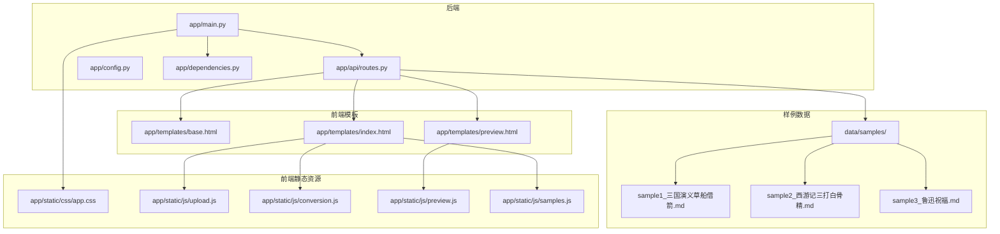
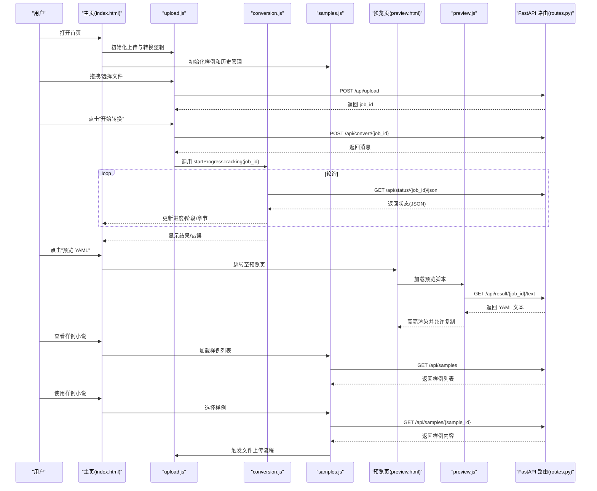
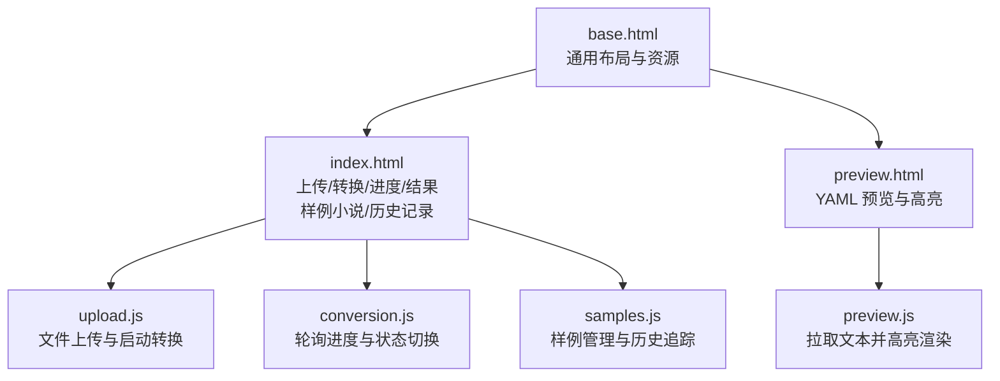
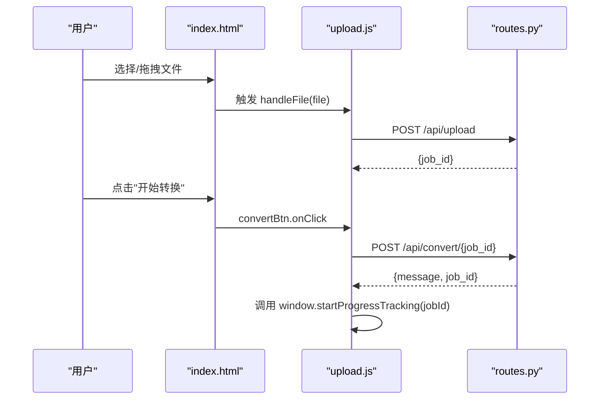
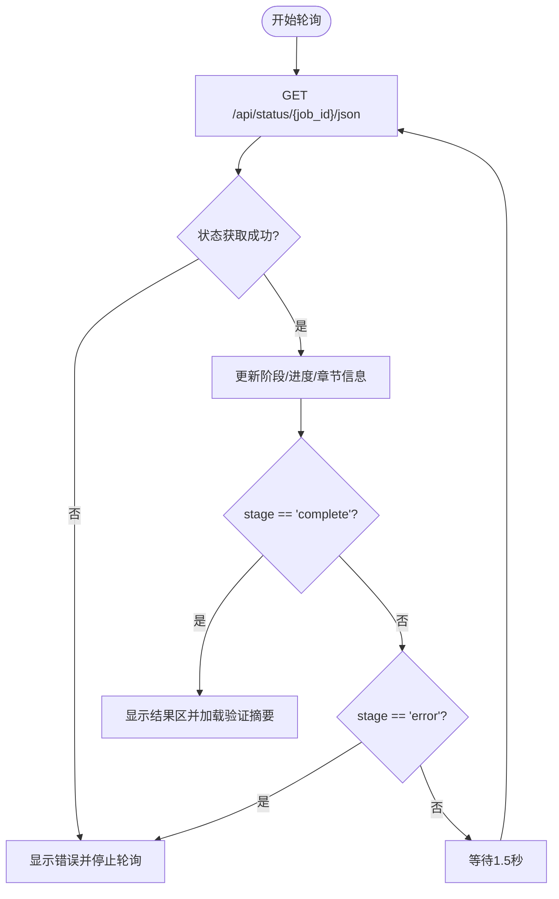
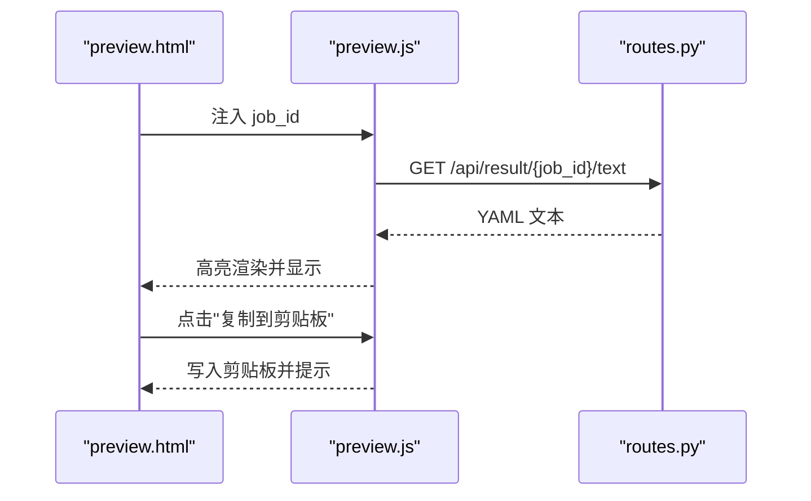
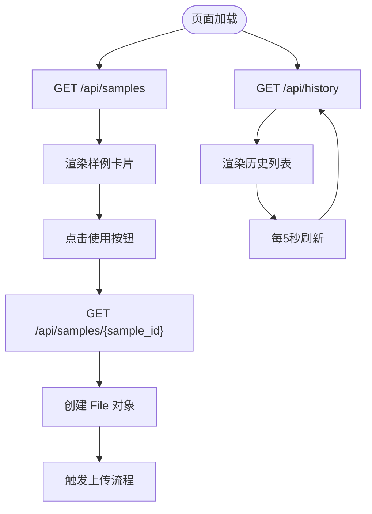
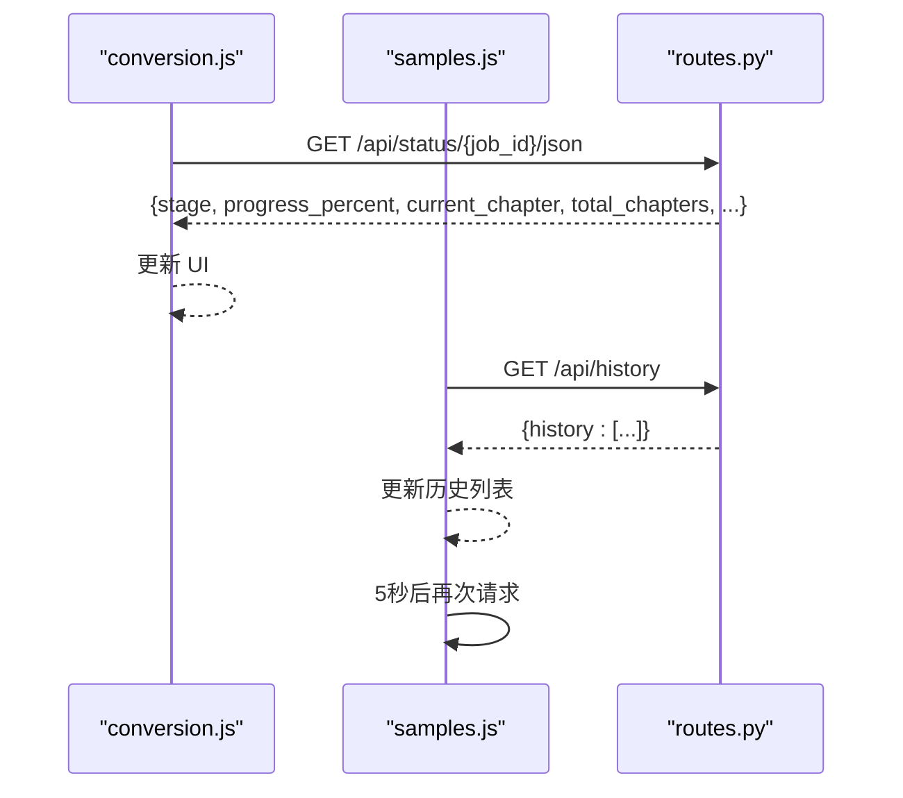
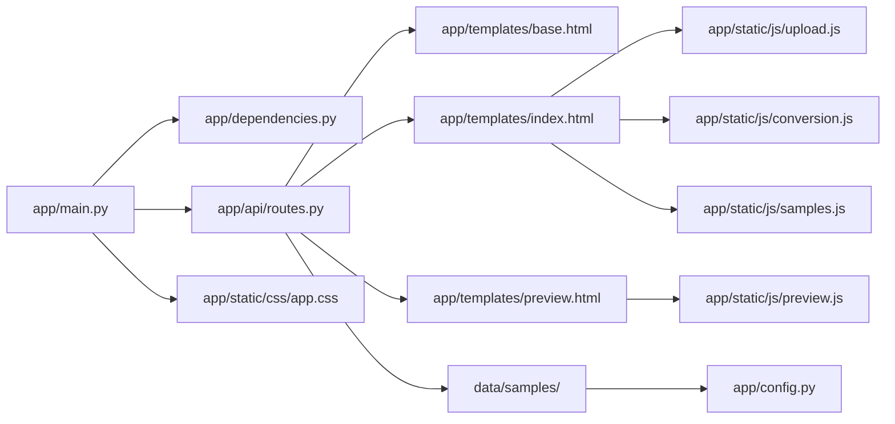

# 前端界面

<cite>
**本文引用的文件**
- [app/templates/base.html](file://app/templates/base.html)
- [app/templates/index.html](file://app/templates/index.html)
- [app/templates/preview.html](file://app/templates/preview.html)
- [app/static/js/upload.js](file://app/static/js/upload.js)
- [app/static/js/conversion.js](file://app/static/js/conversion.js)
- [app/static/js/preview.js](file://app/static/js/preview.js)
- [app/static/js/samples.js](file://app/static/js/samples.js)
- [app/static/css/app.css](file://app/static/css/app.css)
- [app/main.py](file://app/main.py)
- [app/api/routes.py](file://app/api/routes.py)
- [app/config.py](file://app/config.py)
- [app/dependencies.py](file://app/dependencies.py)
- [data/samples/sample3_鲁迅祝福.md](file://data/samples/sample3_鲁迅祝福.md)
- [README.md](file://README.md)
- [pyproject.toml](file://pyproject.toml)
</cite>

## 更新摘要
**变更内容**
- 新增样例小说系统支持，包括样例列表展示、预览和直接使用功能
- 新增转换历史功能，提供最近转换作业的实时状态追踪
- 新增 `samples.js` JavaScript模块处理样例和历史管理
- 更新主页模板以集成样例小说和历史功能区域
- 新增 `/api/samples` 和 `/api/history` API端点

## 目录
1. [简介](#简介)
2. [项目结构](#项目结构)
3. [核心组件](#核心组件)
4. [架构总览](#架构总览)
5. [详细组件分析](#详细组件分析)
6. [依赖分析](#依赖分析)
7. [性能考量](#性能考量)
8. [故障排查指南](#故障排查指南)
9. [结论](#结论)
10. [附录](#附录)

## 简介
本项目提供一个基于 Web 的"小说转剧本"工具，前端采用 Jinja2 模板系统、Tailwind CSS 样式框架与原生 JavaScript 实现，后端使用 FastAPI 提供 API 接口。用户可通过拖拽或选择文件的方式上传小说，输入 API Key 后启动转换流程；转换过程通过轮询接口获取进度，完成后可在线预览 YAML 并下载文件。**新增功能**包括内置样例小说系统，用户可以直接使用预设的小说样例进行测试转换，以及转换历史记录功能，实时追踪最近的转换作业状态。本文档聚焦前端界面的架构设计、模板系统、交互逻辑、样式体系、实时进度更新机制、可扩展性与自定义选项、跨浏览器兼容性与性能优化策略，以及前端与后端 API 的交互协议与错误处理。

## 项目结构
前端相关资源位于 app/static 与 app/templates 目录，分别存放静态资源（CSS/JS）与模板（HTML）。应用入口与路由在 app/main.py 与 app/api/routes.py 中定义，模板引擎与静态文件挂载在 FastAPI 应用中。**新增的样例小说系统**通过 `data/samples/` 目录提供内置样例文件。

**图表来源**
- [app/main.py:1-46](file://app/main.py#L1-L46)
- [app/api/routes.py:1-397](file://app/api/routes.py#L1-L397)
- [app/dependencies.py:1-9](file://app/dependencies.py#L1-L9)
- [app/templates/base.html:1-32](file://app/templates/base.html#L1-L32)
- [app/templates/index.html:1-176](file://app/templates/index.html#L1-L176)
- [app/templates/preview.html:1-42](file://app/templates/preview.html#L1-L42)
- [app/static/js/upload.js:1-131](file://app/static/js/upload.js#L1-L131)
- [app/static/js/conversion.js:1-130](file://app/static/js/conversion.js#L1-L130)
- [app/static/js/preview.js:1-46](file://app/static/js/preview.js#L1-L46)
- [app/static/js/samples.js:1-224](file://app/static/js/samples.js#L1-L224)
- [app/static/css/app.css:1-25](file://app/static/css/app.css#L1-L25)

**章节来源**
- [app/main.py:1-46](file://app/main.py#L1-L46)
- [app/api/routes.py:1-397](file://app/api/routes.py#L1-L397)
- [app/dependencies.py:1-9](file://app/dependencies.py#L1-L9)
- [app/templates/base.html:1-32](file://app/templates/base.html#L1-L32)
- [app/templates/index.html:1-176](file://app/templates/index.html#L1-L176)
- [app/templates/preview.html:1-42](file://app/templates/preview.html#L1-L42)
- [app/static/js/upload.js:1-131](file://app/static/js/upload.js#L1-L131)
- [app/static/js/conversion.js:1-130](file://app/static/js/conversion.js#L1-L130)
- [app/static/js/preview.js:1-46](file://app/static/js/preview.js#L1-L46)
- [app/static/js/samples.js:1-224](file://app/static/js/samples.js#L1-L224)
- [app/static/css/app.css:1-25](file://app/static/css/app.css#L1-L25)

## 核心组件
- 模板系统（Jinja2）
  - 基础模板 base.html 提供通用头部、导航、页脚与脚本块，供其他页面继承。
  - 主页模板 index.html 继承基础模板，定义上传区、API Key 输入、转换按钮、进度展示、错误与结果区域，**新增样例小说区域和转换历史区域**，并加载上传、转换和样例管理脚本。
  - 预览模板 preview.html 继承基础模板，引入语法高亮库，提供复制到剪贴板、下载 YAML 与返回按钮，并加载预览脚本。
- 前端样式（Tailwind CSS）
  - 通过 CDN 引入 Tailwind，结合自定义样式 app.css 实现拖拽高亮态、容器滚动与代码块排版等细节。
- JavaScript 交互
  - upload.js：处理文件选择、拖拽事件、表单上传、调用后端上传与转换接口，并将作业 ID 交由 conversion.js 追踪进度。
  - conversion.js：轮询后端状态接口，更新进度条、阶段文字与章节信息，完成或失败时切换 UI 状态，并加载验证摘要。
  - preview.js：拉取 YAML 文本，进行语法高亮渲染，提供复制到剪贴板能力。
  - **samples.js**：**新增**管理样例小说和转换历史，包括样例列表加载、预览、使用、历史记录刷新等功能。
- 后端 API 协议
  - 上传、启动转换、SSE/JSON 状态查询、结果下载、验证接口等，均在 routes.py 中定义，**新增样例列表和历史记录接口**，前端通过 fetch 发起请求。

**章节来源**
- [app/templates/base.html:1-32](file://app/templates/base.html#L1-L32)
- [app/templates/index.html:1-176](file://app/templates/index.html#L1-L176)
- [app/templates/preview.html:1-42](file://app/templates/preview.html#L1-L42)
- [app/static/js/upload.js:1-131](file://app/static/js/upload.js#L1-L131)
- [app/static/js/conversion.js:1-130](file://app/static/js/conversion.js#L1-L130)
- [app/static/js/preview.js:1-46](file://app/static/js/preview.js#L1-L46)
- [app/static/js/samples.js:1-224](file://app/static/js/samples.js#L1-L224)
- [app/static/css/app.css:1-25](file://app/static/css/app.css#L1-L25)
- [app/api/routes.py:68-397](file://app/api/routes.py#L68-L397)

## 架构总览
前端与后端通过 HTTP 接口通信，模板系统负责页面结构与资源加载，JavaScript 负责用户交互与状态驱动。**新增的样例小说系统**通过独立的 API 端点提供样例数据，支持直接使用样例文件进行转换。

**图表来源**
- [app/templates/index.html:136-175](file://app/templates/index.html#L136-L175)
- [app/static/js/upload.js:82-129](file://app/static/js/upload.js#L82-L129)
- [app/static/js/conversion.js:30-71](file://app/static/js/conversion.js#L30-L71)
- [app/static/js/samples.js:14-25](file://app/static/js/samples.js#L14-L25)
- [app/api/routes.py:131-165](file://app/api/routes.py#L131-L165)
- [app/templates/preview.html:40](file://app/templates/preview.html#L40)
- [app/static/js/preview.js:9-28](file://app/static/js/preview.js#L9-L28)
- [app/api/routes.py:187-198](file://app/api/routes.py#L187-L198)
- [app/api/routes.py:212-245](file://app/api/routes.py#L212-L245)
- [app/api/routes.py:248-267](file://app/api/routes.py#L248-L267)

## 详细组件分析

### 模板系统与页面复用
- 基础模板 base.html
  - 提供通用 meta、标题块、导航栏、主内容区与页脚，通过  机制供子模板覆盖。
  - 引入 Tailwind CSS CDN 与自定义样式 app.css。
- 主页模板 index.html
  - 继承 base.html，定义上传区、文件信息、API Key 输入与显示切换、转换按钮、进度区、错误区、结果区。
  - **新增样例小说区域**：包含样例列表展示、刷新按钮、使用和预览功能。
  - **新增转换历史区域**：显示最近转换作业的实时状态、进度和操作链接。
  - 在脚本块中加载 upload.js、conversion.js 和 samples.js。
- 预览模板 preview.html
  - 继承 base.html，引入 highlight.js 以实现 YAML 语法高亮。
  - 提供复制到剪贴板、下载 YAML、返回按钮，并注入 job_id 供 preview.js 使用。

**图表来源**
- [app/templates/base.html:1-32](file://app/templates/base.html#L1-L32)
- [app/templates/index.html:1-176](file://app/templates/index.html#L1-L176)
- [app/templates/preview.html:1-42](file://app/templates/preview.html#L1-L42)
- [app/static/js/upload.js:1-131](file://app/static/js/upload.js#L1-L131)
- [app/static/js/conversion.js:1-130](file://app/static/js/conversion.js#L1-L130)
- [app/static/js/preview.js:1-46](file://app/static/js/preview.js#L1-L46)
- [app/static/js/samples.js:1-224](file://app/static/js/samples.js#L1-L224)

**章节来源**
- [app/templates/base.html:1-32](file://app/templates/base.html#L1-L32)
- [app/templates/index.html:1-176](file://app/templates/index.html#L1-L176)
- [app/templates/preview.html:1-42](file://app/templates/preview.html#L1-L42)

### JavaScript 交互逻辑

#### 文件上传处理（upload.js）
- 功能要点
  - 支持点击与拖拽两种文件选择方式，限制文件类型为 txt/md/markdown/docx/pdf。
  - 读取文件名与大小，显示文件信息，隐藏上传区并显示"开始转换"按钮。
  - 上传文件至 /api/upload，成功后获取 job_id。
  - 向 /api/convert/{job_id} 发送 POST 请求启动转换，携带 API Key。
  - 调用 window.startProgressTracking(jobId) 将作业交给 conversion.js 轮询进度。
  - 错误处理：捕获网络与业务错误，提示用户并恢复按钮状态。
- 关键交互
  - 拖拽高亮态：通过 CSS 类切换实现视觉反馈。
  - API Key 明文/密文切换：通过 input type 切换实现。

**图表来源**
- [app/static/js/upload.js:61-79](file://app/static/js/upload.js#L61-L79)
- [app/static/js/upload.js:82-129](file://app/static/js/upload.js#L82-L129)
- [app/api/routes.py:114-128](file://app/api/routes.py#L114-L128)

**章节来源**
- [app/static/js/upload.js:1-131](file://app/static/js/upload.js#L1-L131)
- [app/api/routes.py:68-128](file://app/api/routes.py#L68-L128)

#### 转换流程控制（conversion.js）
- 功能要点
  - 接收 jobId，隐藏"开始转换"区域，显示进度区。
  - 使用轮询替代 SSE（兼容性更好），定时请求 /api/status/{job_id}/json 获取状态。
  - 根据阶段标签映射更新 UI 文案、进度百分比与章节信息。
  - 完成后显示结果区，设置预览与下载链接，并请求 /api/validate/{job_id} 获取验证摘要。
  - 出错时显示错误区，提供重试按钮恢复流程。
- 关键交互
  - 进度条动画：通过内联样式 width 动态更新。
  - 阶段文案：根据枚举映射到本地化描述。

**图表来源**
- [app/static/js/conversion.js:30-71](file://app/static/js/conversion.js#L30-L71)
- [app/static/js/conversion.js:73-88](file://app/static/js/conversion.js#L73-L88)
- [app/static/js/conversion.js:90-114](file://app/static/js/conversion.js#L90-L114)
- [app/static/js/conversion.js:116-120](file://app/static/js/conversion.js#L116-L120)
- [app/api/routes.py:161-165](file://app/api/routes.py#L161-L165)

**章节来源**
- [app/static/js/conversion.js:1-130](file://app/static/js/conversion.js#L1-L130)
- [app/api/routes.py:161-165](file://app/api/routes.py#L161-L165)

#### YAML 预览功能（preview.js）
- 功能要点
  - 页面加载时拉取 /api/result/{job_id}/text 获取 YAML 文本。
  - 成功后隐藏加载提示，显示代码块并调用 highlight.js 对 YAML 进行语法高亮。
  - 提供复制到剪贴板按钮，成功后短暂提示"已复制"，异常时弹窗提示。
- 关键交互
  - 容器滚动：通过自定义样式限制高度并启用滚动。
  - 高亮渲染：依赖 CDN 引入的 highlight.js 与 yaml 语言包。

**图表来源**
- [app/templates/preview.html:37-40](file://app/templates/preview.html#L37-L40)
- [app/static/js/preview.js:9-28](file://app/static/js/preview.js#L9-L28)
- [app/api/routes.py:187-198](file://app/api/routes.py#L187-L198)

**章节来源**
- [app/static/js/preview.js:1-46](file://app/static/js/preview.js#L1-L46)
- [app/api/routes.py:187-198](file://app/api/routes.py#L187-L198)

#### 样例小说管理系统（samples.js）
- 功能要点
  - **样例小说管理**：从 /api/samples 获取样例列表，渲染为卡片网格，支持使用和预览功能。
  - **样例使用**：通过 /api/samples/{sample_id} 获取样例内容，创建 File 对象并触发上传流程。
  - **样例预览**：弹出模态框显示样例完整内容，支持关闭和点击背景关闭。
  - **转换历史**：从 /api/history 获取最近转换作业，显示状态、进度、时间和操作链接。
  - **自动刷新**：页面加载时自动加载样例和历史，历史每5秒自动刷新一次。
  - **错误处理**：网络错误时显示友好的错误提示。
- 关键交互
  - 样例卡片：包含标题、字数统计、预览文本、使用和预览按钮。
  - 历史列表：按时间倒序排列，显示状态徽章和操作链接。
  - 安全处理：使用 escapeHtml 防止 XSS 攻击。

**图表来源**
- [app/static/js/samples.js:14-25](file://app/static/js/samples.js#L14-L25)
- [app/static/js/samples.js:65-83](file://app/static/js/samples.js#L65-L83)
- [app/static/js/samples.js:85-114](file://app/static/js/samples.js#L85-L114)
- [app/static/js/samples.js:118-128](file://app/static/js/samples.js#L118-L128)
- [app/static/js/samples.js:130-199](file://app/static/js/samples.js#L130-L199)
- [app/api/routes.py:212-245](file://app/api/routes.py#L212-L245)
- [app/api/routes.py:248-267](file://app/api/routes.py#L248-L267)
- [app/api/routes.py:270-289](file://app/api/routes.py#L270-L289)

**章节来源**
- [app/static/js/samples.js:1-224](file://app/static/js/samples.js#L1-L224)
- [app/api/routes.py:212-289](file://app/api/routes.py#L212-L289)

### 样式系统与自定义
- Tailwind CSS
  - 通过 CDN 引入，提供响应式布局、颜色与间距等原子类，减少手写样式。
- 自定义样式 app.css
  - 拖拽高亮态：为 #drop-zone 设置 dragover 类，改变边框与背景色。
  - YAML 预览容器：限制最大高度并启用滚动，确保长文本可读。
  - 代码块排版：调整字体大小、行高与内边距，提升可读性。
  - 进度阶段图标：统一阶段图标的对齐方式与尺寸。
  - **新增卡片样式**：样例小说卡片的悬停效果和过渡动画。

**章节来源**
- [app/templates/base.html:7-8](file://app/templates/base.html#L7-L8)
- [app/static/css/app.css:1-25](file://app/static/css/app.css#L1-L25)
- [app/templates/preview.html:31-34](file://app/templates/preview.html#L31-L34)
- [app/static/js/samples.js:35-53](file://app/static/js/samples.js#L35-L53)

### 实时进度更新机制
- 设计思路
  - 后端提供 SSE 与 JSON 两种状态查询接口：/api/status/{job_id}（SSE）与 /api/status/{job_id}/json（轮询）。
  - 前端优先尝试 SSE，若不可用则回退到轮询（conversion.js 中明确使用轮询）。
  - **转换历史**通过定期轮询 /api/history 实现实时状态更新。
- 前端实现
  - conversion.js 轮询间隔为 1.5 秒，持续获取状态并更新 UI。
  - 支持章节级进度（current_chapter/total_chapters）与总体百分比。
  - **samples.js** 每5秒自动刷新转换历史，保持状态最新。
- 后端实现
  - routes.py 中的事件生成器在状态为 complete 或 error 时终止流。
  - JSON 接口直接返回当前状态对象，便于非 SSE 客户端使用。
  - **新增历史接口**返回内存中的转换作业状态列表。

**图表来源**
- [app/static/js/conversion.js:30-71](file://app/static/js/conversion.js#L30-L71)
- [app/api/routes.py:131-165](file://app/api/routes.py#L131-L165)
- [app/static/js/samples.js:118-128](file://app/static/js/samples.js#L118-L128)
- [app/static/js/samples.js:218-219](file://app/static/js/samples.js#L218-L219)
- [app/api/routes.py:270-289](file://app/api/routes.py#L270-L289)

**章节来源**
- [app/static/js/conversion.js:30-71](file://app/static/js/conversion.js#L30-L71)
- [app/api/routes.py:131-165](file://app/api/routes.py#L131-L165)
- [app/static/js/samples.js:118-128](file://app/static/js/samples.js#L118-L128)
- [app/static/js/samples.js:218-219](file://app/static/js/samples.js#L218-L219)
- [app/api/routes.py:270-289](file://app/api/routes.py#L270-L289)

### 前端组件的可扩展性与自定义
- 模板扩展
  - 通过继承 base.html，新增页面只需覆盖 content 与 scripts 区块，保持一致的导航与样式。
  - **新增区域**：样例小说和转换历史区域可独立扩展功能。
- 样式扩展
  - 自定义 CSS 文件可按需增加新类，如新的进度指示器、卡片样式和模态框样式。
- JavaScript 扩展
  - upload.js 与 conversion.js 通过模块化 IIFE 暴露 window.startProgressTracking，便于在模板中直接调用。
  - **samples.js** 作为独立模块，可独立扩展样例管理和历史功能。
  - 新增页面可复用 preview.js 的文本拉取与高亮模式。
- 组件化建议
  - 将上传区、进度区、错误区、**样例区**、**历史区**封装为独立函数或小模块，便于复用与测试。
  - 为不同阶段添加更细粒度的状态类，便于样式与交互扩展。
  - **新增安全处理**：所有用户输入都经过 escapeHtml 处理，防止 XSS 攻击。

**章节来源**
- [app/templates/base.html:19-29](file://app/templates/base.html#L19-L29)
- [app/templates/index.html:136-175](file://app/templates/index.html#L136-L175)
- [app/static/js/conversion.js:30](file://app/static/js/conversion.js#L30)
- [app/static/js/samples.js:203-207](file://app/static/js/samples.js#L203-L207)

### 跨浏览器兼容性与性能优化
- 兼容性
  - 轮询替代 SSE：conversion.js 明确使用轮询，避免部分环境不支持 SSE 的问题。
  - **历史刷新**：samples.js 使用标准的 fetch 和 setInterval，确保广泛兼容性。
  - fetch 与 Promise：现代浏览器普遍支持，无需额外 polyfill。
  - Tailwind 原子类：减少复杂选择器，提升跨浏览器一致性。
- 性能优化
  - 轮询间隔：1.5 秒适中，既保证实时性又避免频繁请求。
  - **历史刷新优化**：5秒间隔平衡实时性和性能，避免过度刷新。
  - 预览高亮：仅在需要时渲染，避免不必要的计算。
  - 静态资源：CDN 引入 Tailwind 与 highlight.js，减少本地体积与加载时间。
  - 滚动容器：限制 YAML 预览容器高度并启用滚动，避免长文本导致布局抖动。
  - **样例预览**：使用模态框而非重定向，提升用户体验。

**章节来源**
- [app/static/js/conversion.js:34-71](file://app/static/js/conversion.js#L34-L71)
- [app/static/js/samples.js:218-219](file://app/static/js/samples.js#L218-L219)
- [app/static/css/app.css:8-18](file://app/static/css/app.css#L8-L18)
- [app/templates/preview.html:6-8](file://app/templates/preview.html#L6-L8)

### 前端与后端 API 交互协议与错误处理
- 交互协议
  - 上传：POST /api/upload，返回 job_id。
  - 启动转换：POST /api/convert/{job_id}，携带 API Key。
  - 进度查询：GET /api/status/{job_id}/json（轮询）。
  - 结果下载：GET /api/result/{job_id}（二进制 YAML）。
  - 预览文本：GET /api/result/{job_id}/text（纯文本）。
  - 验证摘要：GET /api/validate/{job_id}。
  - **样例列表**：GET /api/samples（返回样例数组）。
  - **样例内容**：GET /api/samples/{sample_id}（返回样例内容）。
  - **转换历史**：GET /api/history（返回历史数组）。
- 错误处理
  - 前端：upload.js 与 conversion.js 捕获网络与业务错误，提示用户并恢复 UI 状态。
  - **samples.js**：样例加载和历史刷新的错误都会显示友好的错误提示。
  - 后端：routes.py 对文件类型、大小、作业存在性、转换状态等进行校验，返回 4xx/5xx 并携带错误详情。
  - **新增样例处理**：样例文件不存在时返回 404 错误，历史为空时返回空数组。

**章节来源**
- [app/api/routes.py:68-397](file://app/api/routes.py#L68-L397)
- [app/static/js/upload.js:92-128](file://app/static/js/upload.js#L92-L128)
- [app/static/js/conversion.js:116-120](file://app/static/js/conversion.js#L116-L120)
- [app/static/js/samples.js:20-24](file://app/static/js/samples.js#L20-L24)
- [app/static/js/samples.js:124-127](file://app/static/js/samples.js#L124-L127)

## 依赖分析
- 模板与静态资源挂载
  - main.py 中将 /static 挂载到 app/static，模板引擎通过 dependencies.py 指向 app/templates。
- 依赖关系
  - routes.py 依赖模板引擎与配置，提供页面渲染与 API 接口，**新增样例和历史 API**。
  - 前端脚本通过模板块加载，与后端接口形成松耦合。
  - **新增样例数据依赖**：config.py 中的 data_dir 指向 ./data 目录。

**图表来源**
- [app/main.py:37-39](file://app/main.py#L37-L39)
- [app/dependencies.py:7-8](file://app/dependencies.py#L7-L8)
- [app/api/routes.py:53-63](file://app/api/routes.py#L53-L63)
- [app/templates/index.html:171-175](file://app/templates/index.html#L171-L175)
- [app/templates/preview.html:40](file://app/templates/preview.html#L40)
- [app/config.py:25](file://app/config.py#L25)

**章节来源**
- [app/main.py:37-39](file://app/main.py#L37-L39)
- [app/dependencies.py:7-8](file://app/dependencies.py#L7-L8)
- [app/api/routes.py:53-63](file://app/api/routes.py#L53-L63)
- [app/config.py:25](file://app/config.py#L25)

## 性能考量
- 请求频率与负载
  - 轮询间隔 1.5 秒，适合中小规模并发；若需更高并发，可考虑 SSE 或 WebSocket。
  - **历史刷新**每5秒一次，适合实时监控但不会造成过大负载。
- 资源加载
  - Tailwind 与 highlight.js 通过 CDN 引入，减少本地打包体积；生产环境可考虑本地化缓存。
  - **样例文件**按需加载，避免一次性加载所有样例。
- UI 渲染
  - 预览容器限制高度并启用滚动，避免长文本导致的布局重排。
  - 高亮渲染仅在文本到达后执行，避免重复计算。
  - **模态框渲染**使用动态插入，避免影响主页面布局。

## 故障排查指南
- 无法开始转换
  - 检查是否选择了有效文件类型与大小未超过限制。
  - 确认 API Key 已正确填写。
- 进度不更新
  - 确认后端服务正常运行，轮询接口可访问。
  - 若浏览器禁用 SSE，前端会自动回退到轮询。
- 预览空白或报错
  - 确认转换已完成且状态为 complete。
  - 检查 /api/result/{job_id}/text 是否可访问。
- 下载失败
  - 确认转换已完成，后端返回的 YAML 内容非空。
- **样例小说无法加载**
  - 检查 data/samples/ 目录是否存在且包含有效的 txt/md 文件。
  - 确认 /api/samples 接口可访问。
- **历史记录不刷新**
  - 检查 /api/history 接口是否正常工作。
  - 确认浏览器允许定时器执行。
- **样例使用失败**
  - 检查 /api/samples/{sample_id} 接口是否返回有效内容。
  - 确认文件对象创建和上传流程正常。

**章节来源**
- [app/static/js/upload.js:61-79](file://app/static/js/upload.js#L61-L79)
- [app/static/js/conversion.js:116-120](file://app/static/js/conversion.js#L116-L120)
- [app/api/routes.py:187-198](file://app/api/routes.py#L187-L198)
- [app/static/js/samples.js:14-25](file://app/static/js/samples.js#L14-L25)
- [app/static/js/samples.js:118-128](file://app/static/js/samples.js#L118-L128)
- [app/api/routes.py:212-289](file://app/api/routes.py#L212-L289)

## 结论
该前端界面以 Jinja2 模板系统为基础，结合 Tailwind CSS 与原生 JavaScript，实现了从文件上传、转换流程跟踪到 YAML 预览与下载的完整用户体验。**新增的样例小说系统**提供了便捷的测试入口，用户可以直接使用内置样例进行转换验证。**转换历史功能**让用户能够实时追踪最近的转换作业状态，提升了用户体验。通过轮询机制替代 SSE，提升了跨浏览器兼容性；通过模块化的脚本与可复用的模板区块，增强了可扩展性与维护性。配合后端的清晰 API 协议与错误处理，整体方案具备良好的可用性与可演进空间。

## 附录
- 快速开始与使用流程参见 README。
- 项目技术栈与依赖参见 pyproject.toml。
- **样例小说文件**位于 data/samples/ 目录，包含三国演义、西游记等经典作品片段。

**章节来源**
- [README.md:1-178](file://README.md#L1-L178)
- [pyproject.toml:1-47](file://pyproject.toml#L1-L47)
- [data/samples/sample3_鲁迅祝福.md:1-232](file://data/samples/sample3_鲁迅祝福.md#L1-L232)