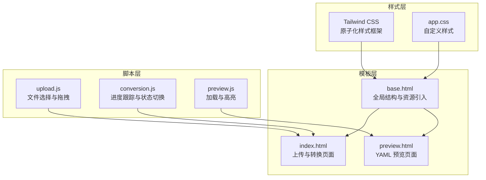
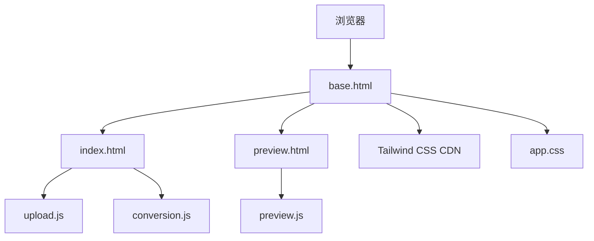
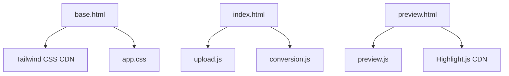

# 样式设计

<cite>
**本文档引用的文件**
- [app/static/css/app.css](file://app/static/css/app.css)
- [app/templates/base.html](file://app/templates/base.html)
- [app/templates/index.html](file://app/templates/index.html)
- [app/templates/preview.html](file://app/templates/preview.html)
- [app/static/js/upload.js](file://app/static/js/upload.js)
- [app/static/js/conversion.js](file://app/static/js/conversion.js)
- [app/static/js/preview.js](file://app/static/js/preview.js)
- [pyproject.toml](file://pyproject.toml)
</cite>

## 目录
1. [简介](#简介)
2. [项目结构](#项目结构)
3. [核心组件](#核心组件)
4. [架构总览](#架构总览)
5. [详细组件分析](#详细组件分析)
6. [依赖分析](#依赖分析)
7. [性能考虑](#性能考虑)
8. [故障排除指南](#故障排除指南)
9. [结论](#结论)
10. [附录](#附录)

## 简介
本项目采用“Jinja2 + Tailwind CSS + 原生 JavaScript”的前端技术栈，构建了一个从小说到结构化 YAML 剧本的 Web 工具。样式系统以 Tailwind CSS 作为基础原子化样式框架，结合少量自定义 CSS 实现特定交互态与容器样式，并通过原生 JavaScript 实现状态切换与进度反馈。本文档将深入解析样式系统的实现方式，涵盖实用类组合、响应式断点、暗色主题支持、颜色系统、字体排版、间距体系、移动端适配、模块化与可维护性、性能优化、浏览器兼容性、调试技巧以及主题定制方案等。

## 项目结构
前端静态资源位于 app/static 目录下，HTML 模板位于 app/templates 目录下。样式系统主要由以下部分组成：
- 模板基页：提供全局结构、引入 Tailwind CSS 和自定义 CSS
- 页面模板：基于基页扩展，使用 Tailwind 实用类组织布局与组件
- 自定义 CSS：覆盖特定交互态与容器样式
- 原生 JavaScript：驱动状态切换、进度展示与交互反馈

图表来源
- [app/templates/base.html:1-32](file://app/templates/base.html#L1-L32)
- [app/templates/index.html:1-140](file://app/templates/index.html#L1-L140)
- [app/templates/preview.html:1-42](file://app/templates/preview.html#L1-L42)
- [app/static/css/app.css:1-25](file://app/static/css/app.css#L1-L25)
- [app/static/js/upload.js:1-131](file://app/static/js/upload.js#L1-L131)
- [app/static/js/conversion.js:1-130](file://app/static/js/conversion.js#L1-L130)
- [app/static/js/preview.js:1-46](file://app/static/js/preview.js#L1-L46)

章节来源
- [app/templates/base.html:1-32](file://app/templates/base.html#L1-L32)
- [app/templates/index.html:1-140](file://app/templates/index.html#L1-L140)
- [app/templates/preview.html:1-42](file://app/templates/preview.html#L1-L42)
- [app/static/css/app.css:1-25](file://app/static/css/app.css#L1-L25)
- [app/static/js/upload.js:1-131](file://app/static/js/upload.js#L1-L131)
- [app/static/js/conversion.js:1-130](file://app/static/js/conversion.js#L1-L130)
- [app/static/js/preview.js:1-46](file://app/static/js/preview.js#L1-L46)

## 核心组件
- 基础模板与资源引入：在基页中引入 Tailwind CSS CDN 与自定义 CSS，设置视口元标签以支持响应式设计，并在主体中定义导航、主内容区与页脚的通用结构。
- 页面模板与实用类：各页面模板通过 Tailwind 实用类组织布局、颜色、边框、间距、圆角、阴影、过渡与动画等，确保一致的视觉风格与交互体验。
- 自定义样式：针对特定交互态（如拖拽高亮）与容器（如 YAML 预览区域）进行补充样式，保证用户体验与可读性。
- 交互脚本：通过原生 JavaScript 控制页面状态切换、进度更新与错误提示，配合 Tailwind 类实现流畅的视觉反馈。

章节来源
- [app/templates/base.html:1-32](file://app/templates/base.html#L1-L32)
- [app/templates/index.html:1-140](file://app/templates/index.html#L1-L140)
- [app/templates/preview.html:1-42](file://app/templates/preview.html#L1-L42)
- [app/static/css/app.css:1-25](file://app/static/css/app.css#L1-L25)
- [app/static/js/upload.js:1-131](file://app/static/js/upload.js#L1-L131)
- [app/static/js/conversion.js:1-130](file://app/static/js/conversion.js#L1-L130)
- [app/static/js/preview.js:1-46](file://app/static/js/preview.js#L1-L46)

## 架构总览
样式系统采用“模板 + 原子化样式 + 自定义覆盖 + 原生脚本”的分层架构。模板层负责结构与资源组织；样式层通过 Tailwind 提供一致的视觉语言；自定义 CSS 解决特定交互态与容器需求；脚本层负责状态驱动与动态更新。

图表来源
- [app/templates/base.html:1-32](file://app/templates/base.html#L1-L32)
- [app/templates/index.html:1-140](file://app/templates/index.html#L1-L140)
- [app/templates/preview.html:1-42](file://app/templates/preview.html#L1-L42)
- [app/static/css/app.css:1-25](file://app/static/css/app.css#L1-L25)
- [app/static/js/upload.js:1-131](file://app/static/js/upload.js#L1-L131)
- [app/static/js/conversion.js:1-130](file://app/static/js/conversion.js#L1-L130)
- [app/static/js/preview.js:1-46](file://app/static/js/preview.js#L1-L46)

## 详细组件分析

### 基础模板与资源组织
- 资源引入：在 head 中引入 Tailwind CSS CDN 与自定义 CSS，确保页面加载时具备原子化样式与自定义覆盖。
- 视口配置：设置 viewport 元标签，启用响应式设计。
- 主体结构：定义导航栏、主内容区与页脚，使用 Tailwind 类控制最大宽度、内边距、边框与背景色，形成统一的页面骨架。

章节来源
- [app/templates/base.html:1-32](file://app/templates/base.html#L1-L32)

### 上传与转换页面（index.html）
- 布局与间距：使用容器类控制最大宽度与水平居中，垂直间距通过空间类组织，确保内容层次清晰。
- 组件样式：卡片容器、边框、内边距与圆角统一使用 Tailwind 类，保持视觉一致性。
- 交互态：拖拽高亮通过类名切换实现，按钮状态通过禁用类与过渡类提供即时反馈。
- 进度与状态：进度条、百分比与阶段文本通过动态样式更新，错误与成功状态分别使用不同背景色与图标强化感知。

章节来源
- [app/templates/index.html:1-140](file://app/templates/index.html#L1-L140)
- [app/static/js/upload.js:1-131](file://app/static/js/upload.js#L1-L131)
- [app/static/js/conversion.js:1-130](file://app/static/js/conversion.js#L1-L130)

### YAML 预览页面（preview.html）
- 加载与高亮：通过外部 CDN 引入语法高亮库，在内容加载完成后应用高亮。
- 操作按钮：复制到剪贴板与下载按钮使用统一的尺寸与悬停反馈，增强可用性。
- 容器样式：预览容器设置最大高度与滚动，确保长文本可读。

章节来源
- [app/templates/preview.html:1-42](file://app/templates/preview.html#L1-L42)
- [app/static/js/preview.js:1-46](file://app/static/js/preview.js#L1-L46)

### 自定义样式（app.css）
- 拖拽高亮：针对拖拽目标容器设置边框颜色与背景色，提供明确的拖放反馈。
- YAML 容器：限制最大高度并启用滚动，预格式化文本设置合适的字号与行高，提升可读性。
- 进度图标：为进度阶段图标提供弹性布局，确保图标在容器中居中显示。

章节来源
- [app/static/css/app.css:1-25](file://app/static/css/app.css#L1-L25)

### 原生脚本与样式联动
- 文件选择与拖拽：通过事件监听切换类名，实现拖拽高亮与移除文件后的状态恢复。
- 进度跟踪：通过轮询获取状态并更新进度条、百分比与阶段文本，错误状态切换至错误面板。
- 预览加载：异步加载 YAML 内容并应用高亮，提供复制到剪贴板的即时反馈。

章节来源
- [app/static/js/upload.js:1-131](file://app/static/js/upload.js#L1-L131)
- [app/static/js/conversion.js:1-130](file://app/static/js/conversion.js#L1-L130)
- [app/static/js/preview.js:1-46](file://app/static/js/preview.js#L1-L46)

## 依赖分析
- Tailwind CSS：通过 CDN 引入，提供原子化样式能力，减少手写 CSS 的工作量。
- Highlight.js：用于 YAML 语法高亮，提升预览体验。
- 原生 JavaScript：负责状态切换与动态更新，与 Tailwind 类协同实现交互反馈。

图表来源
- [app/templates/base.html:1-32](file://app/templates/base.html#L1-L32)
- [app/templates/index.html:1-140](file://app/templates/index.html#L1-L140)
- [app/templates/preview.html:1-42](file://app/templates/preview.html#L1-L42)
- [app/static/css/app.css:1-25](file://app/static/css/app.css#L1-L25)
- [app/static/js/upload.js:1-131](file://app/static/js/upload.js#L1-L131)
- [app/static/js/conversion.js:1-130](file://app/static/js/conversion.js#L1-L130)
- [app/static/js/preview.js:1-46](file://app/static/js/preview.js#L1-L46)

章节来源
- [pyproject.toml:1-47](file://pyproject.toml#L1-L47)
- [app/templates/base.html:1-32](file://app/templates/base.html#L1-L32)

## 性能考虑
- 原子化样式优势：Tailwind 的原子化类减少了重复样式定义，便于缓存与压缩，提升加载性能。
- CDN 资源：Tailwind 与 Highlight.js 通过 CDN 引入，利用浏览器缓存与 CDN 加速，减少本地体积。
- 动态样式最小化：仅在必要时通过 JavaScript 更新样式属性（如进度条宽度），避免频繁重排与重绘。
- 滚动容器：YAML 预览容器设置最大高度并启用滚动，避免长文本导致的布局抖动。
- 轮询策略：进度跟踪采用定时轮询而非 SSE，降低复杂度与兼容性成本，同时通过条件判断及时停止轮询。

章节来源
- [app/static/css/app.css:1-25](file://app/static/css/app.css#L1-L25)
- [app/static/js/conversion.js:1-130](file://app/static/js/conversion.js#L1-L130)

## 故障排除指南
- 拖拽高亮无效：检查拖拽事件绑定与类名切换逻辑，确认自定义样式未被覆盖。
- 进度条不更新：确认轮询函数已启动且状态接口返回正确数据，检查网络请求与错误处理。
- YAML 高亮失败：确认 CDN 资源加载成功，检查内容加载完成后再调用高亮函数。
- 移动端显示异常：检查视口元标签是否正确设置，确认 Tailwind 断点类使用合理。
- 错误状态未显示：确认错误面板的可见性切换逻辑与错误消息注入是否正常执行。

章节来源
- [app/static/js/upload.js:1-131](file://app/static/js/upload.js#L1-L131)
- [app/static/js/conversion.js:1-130](file://app/static/js/conversion.js#L1-L130)
- [app/static/js/preview.js:1-46](file://app/static/js/preview.js#L1-L46)

## 结论
本项目的样式系统以 Tailwind CSS 为核心，结合少量自定义 CSS 与原生 JavaScript，实现了简洁、一致且高效的前端界面。通过原子化类的组合、合理的响应式断点与交互反馈，提升了用户体验与可维护性。建议在后续迭代中进一步探索主题定制与暗色模式支持，以满足更多用户场景。

## 附录

### 颜色系统与语义映射
- 蓝色系：用于强调按钮、进度条与链接，传达积极与可操作性。
- 灰色系：用于背景、边框、文字与页脚，营造稳定与中性的视觉基调。
- 红色系：用于错误状态，提供警示与可识别性。
- 绿色系：用于成功状态，传达完成与正确性。

章节来源
- [app/templates/index.html:1-140](file://app/templates/index.html#L1-L140)
- [app/templates/preview.html:1-42](file://app/templates/preview.html#L1-L42)

### 字体排版与字号体系
- 标题：使用较大的字号与粗体，突出层级与重要性。
- 正文：使用适中的字号与行高，确保可读性。
- 辅助信息：使用较小字号与浅色文字，降低视觉权重。

章节来源
- [app/templates/base.html:1-32](file://app/templates/base.html#L1-L32)
- [app/templates/index.html:1-140](file://app/templates/index.html#L1-L140)

### 间距体系与布局约束
- 容器最大宽度：通过容器类限制内容宽度，确保在大屏与小屏上的可读性。
- 内边距与外边距：使用统一的间距单位，保持视觉平衡与层次感。
- 卡片与边框：通过圆角与边框增强模块化与隔离感。

章节来源
- [app/templates/base.html:1-32](file://app/templates/base.html#L1-L32)
- [app/templates/index.html:1-140](file://app/templates/index.html#L1-L140)

### 响应式布局与移动端适配
- 视口配置：通过视口元标签启用响应式设计。
- 断点使用：在模板中使用 Tailwind 断点类组织布局，确保在不同设备上的良好表现。
- 移动端交互：按钮与输入框设置合适的尺寸与间距，提升触摸可操作性。

章节来源
- [app/templates/base.html:1-32](file://app/templates/base.html#L1-L32)
- [app/templates/index.html:1-140](file://app/templates/index.html#L1-L140)

### 暗色主题支持与定制方案
- 当前状态：项目未显式启用暗色主题，建议通过 Tailwind 的暗色模式开关或自定义 CSS 变量实现主题切换。
- 定制建议：为常用颜色建立命名映射，统一在自定义 CSS 中维护，便于主题切换与品牌一致性。

章节来源
- [app/templates/base.html:1-32](file://app/templates/base.html#L1-L32)
- [app/static/css/app.css:1-25](file://app/static/css/app.css#L1-L25)

### 模块化与可维护性最佳实践
- 模板复用：通过基页与块扩展实现模板复用，减少重复代码。
- 类名组织：遵循语义化命名，使用 Tailwind 类组合表达意图，避免过度嵌套。
- 自定义样式：集中管理自定义样式，避免与原子化类冲突，保持可维护性。

章节来源
- [app/templates/base.html:1-32](file://app/templates/base.html#L1-L32)
- [app/static/css/app.css:1-25](file://app/static/css/app.css#L1-L25)

### 浏览器兼容性与调试技巧
- 兼容性：CDN 资源与原生 JavaScript 在主流浏览器中具备良好支持，注意检查旧版浏览器的特性支持。
- 调试：利用浏览器开发者工具检查类名应用、样式覆盖与事件绑定，定位问题根因。

章节来源
- [app/templates/base.html:1-32](file://app/templates/base.html#L1-L32)
- [app/static/js/upload.js:1-131](file://app/static/js/upload.js#L1-L131)
- [app/static/js/conversion.js:1-130](file://app/static/js/conversion.js#L1-L130)
- [app/static/js/preview.js:1-46](file://app/static/js/preview.js#L1-L46)