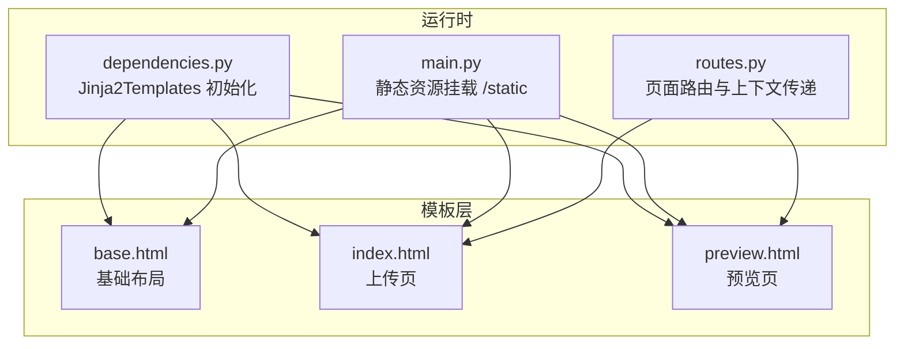
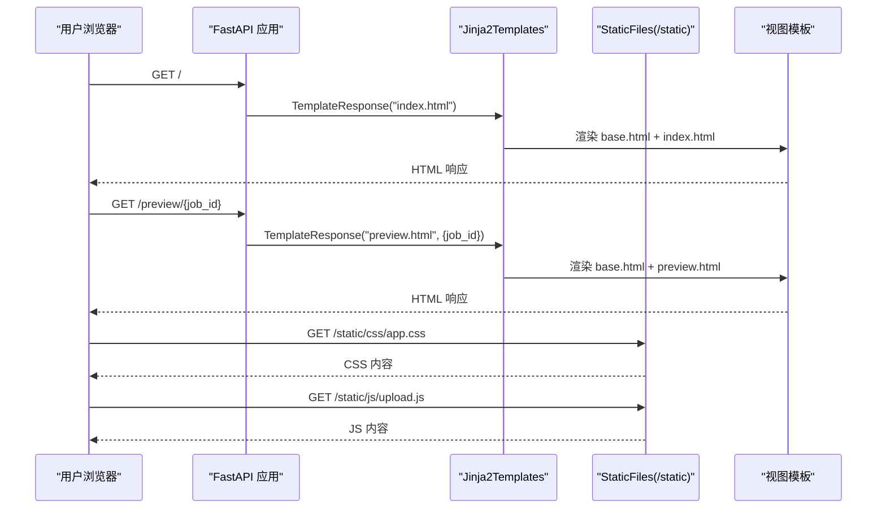
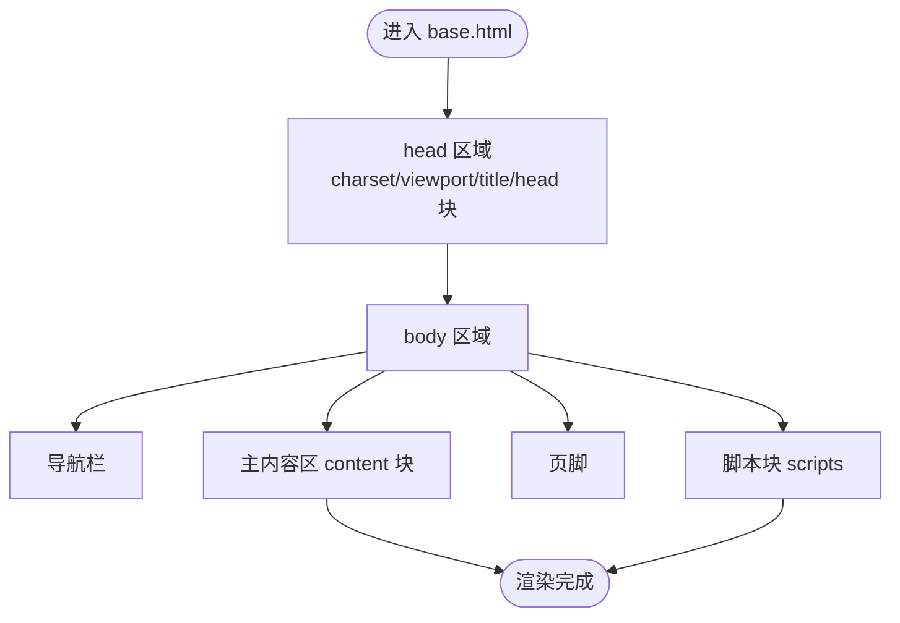
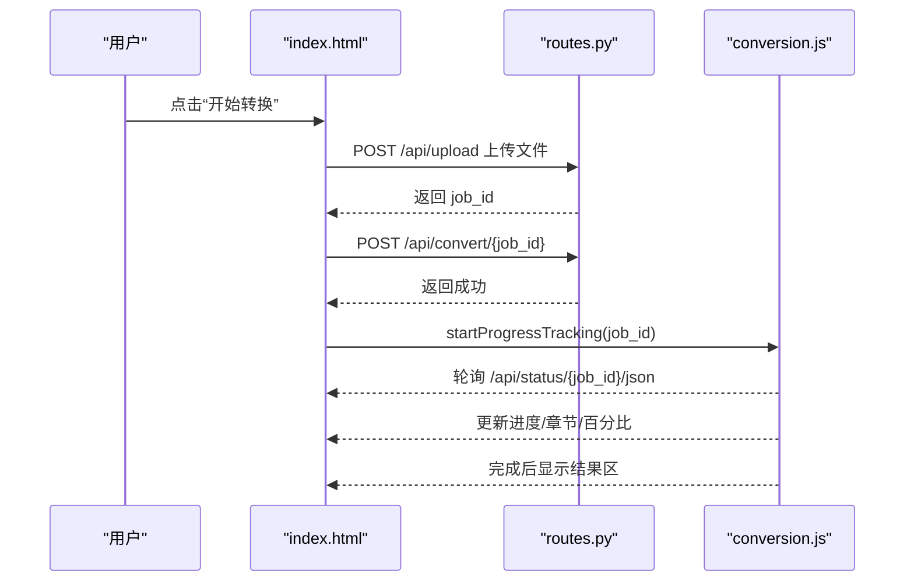
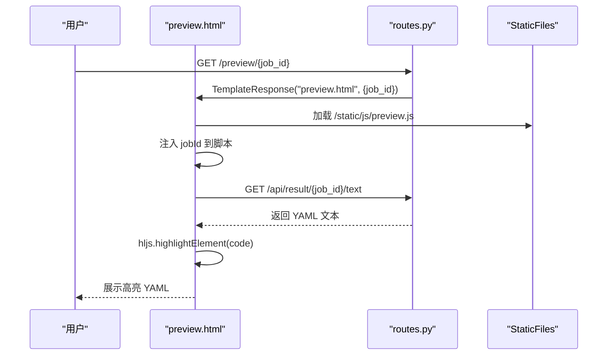
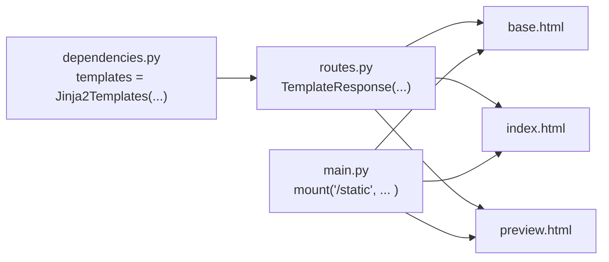

# 模板系统

<cite>
**本文引用的文件**
- [app/templates/base.html](file://app/templates/base.html)
- [app/templates/index.html](file://app/templates/index.html)
- [app/templates/preview.html](file://app/templates/preview.html)
- [app/dependencies.py](file://app/dependencies.py)
- [app/main.py](file://app/main.py)
- [app/api/routes.py](file://app/api/routes.py)
- [app/static/css/app.css](file://app/static/css/app.css)
- [app/static/js/upload.js](file://app/static/js/upload.js)
- [app/static/js/conversion.js](file://app/static/js/conversion.js)
- [app/static/js/preview.js](file://app/static/js/preview.js)
- [README.md](file://README.md)
</cite>

## 目录
1. [简介](#简介)
2. [项目结构](#项目结构)
3. [核心组件](#核心组件)
4. [架构总览](#架构总览)
5. [详细组件分析](#详细组件分析)
6. [依赖分析](#依赖分析)
7. [性能考虑](#性能考虑)
8. [故障排查指南](#故障排查指南)
9. [结论](#结论)
10. [附录](#附录)

## 简介
本文件聚焦于本项目的模板系统，系统基于 FastAPI 的 Jinja2Templates，采用模板继承与块（block）机制实现基础布局与页面级定制。基础模板（base.html）统一承载导航栏、页脚、样式与脚本的通用结构；页面模板（index.html、preview.html）通过继承基础模板并覆盖内容块（如 title、content、scripts、head）实现差异化展示。模板系统还结合前端 JavaScript 实现动态交互与状态更新，并通过静态资源挂载提供 CSS/JS 资源。

## 项目结构
模板系统位于 app/templates 目录，配合 app/dependencies.py 中的模板引擎初始化与 app/main.py 中的静态资源挂载共同工作。路由层在 app/api/routes.py 中负责渲染 HTML 页面并将动态上下文（如 job_id）传入模板。

图表来源
- [app/dependencies.py:1-9](file://app/dependencies.py#L1-L9)
- [app/main.py:37](file://app/main.py#L37)
- [app/api/routes.py:53-63](file://app/api/routes.py#L53-L63)

章节来源
- [README.md:77-108](file://README.md#L77-L108)
- [app/dependencies.py:1-9](file://app/dependencies.py#L1-L9)
- [app/main.py:37](file://app/main.py#L37)
- [app/api/routes.py:53-63](file://app/api/routes.py#L53-L63)

## 核心组件
- 基础模板 base.html：定义全局结构（head、body、导航、主内容区、页脚）、通用样式与脚本占位块（title、head、content、scripts）。
- 页面模板 index.html：继承基础模板，覆盖标题、内容区域（上传、进度、错误、结果等模块化区块）与脚本块，用于上传与转换流程。
- 页面模板 preview.html：继承基础模板，覆盖标题、head（引入语法高亮资源）、内容区域（YAML 预览与操作按钮）与脚本块，用于展示转换结果。
- 模板引擎与上下文：通过 dependencies.py 初始化 Jinja2Templates，路由层在渲染时传入上下文（如 job_id）。
- 静态资源：main.py 挂载 /static 目录，模板中通过相对路径引用 CSS/JS。

章节来源
- [app/templates/base.html:1-32](file://app/templates/base.html#L1-L32)
- [app/templates/index.html:1-140](file://app/templates/index.html#L1-L140)
- [app/templates/preview.html:1-42](file://app/templates/preview.html#L1-L42)
- [app/dependencies.py:5-8](file://app/dependencies.py#L5-L8)
- [app/api/routes.py:53-63](file://app/api/routes.py#L53-L63)
- [app/main.py:37](file://app/main.py#L37)

## 架构总览
模板系统与后端路由、静态资源的关系如下：

图表来源
- [app/api/routes.py:53-63](file://app/api/routes.py#L53-L63)
- [app/dependencies.py:5-8](file://app/dependencies.py#L5-L8)
- [app/main.py:37](file://app/main.py#L37)

## 详细组件分析

### 基础模板 base.html 设计
- 结构要点
  - 文档声明与语言设置
  - head 区域：字符集、视口、标题块、Tailwind CDN、本地 CSS、head 块
  - body 区域：导航栏、主内容区（content 块）、页脚、脚本块
- 块机制
  - title/head/content/scripts 作为可被子模板覆盖的占位符，确保通用结构与差异化内容解耦
- 响应式与样式
  - 使用 Tailwind 类控制布局与间距，最大宽度约束与居中容器
  - 本地 CSS 用于特定交互态与滚动容器优化

图表来源
- [app/templates/base.html:3-31](file://app/templates/base.html#L3-L31)

章节来源
- [app/templates/base.html:1-32](file://app/templates/base.html#L1-L32)
- [app/static/css/app.css:1-25](file://app/static/css/app.css#L1-L25)

### 页面模板 index.html：继承与内容定制
- 继承与覆盖
  - 继承 base.html，覆盖 title、content、scripts
- 内容组织
  - 上传区：拖拽/点击选择、文件信息展示、移除按钮
  - API Key 区：密码输入与显示/隐藏切换
  - 转换按钮区：触发上传与转换流程
  - 进度区：阶段指示、进度条、章节信息
  - 错误区：错误提示与重试
  - 结果区：预览链接与下载链接
- 上下文与脚本
  - 通过 routes.py 渲染 index.html，未传入额外上下文
  - 在 scripts 块加载 upload.js 与 conversion.js，实现上传、进度跟踪与结果展示

图表来源
- [app/api/routes.py:68-128](file://app/api/routes.py#L68-L128)
- [app/static/js/conversion.js:30-71](file://app/static/js/conversion.js#L30-L71)
- [app/templates/index.html:136-139](file://app/templates/index.html#L136-L139)

章节来源
- [app/templates/index.html:1-140](file://app/templates/index.html#L1-L140)
- [app/api/routes.py:53-63](file://app/api/routes.py#L53-L63)
- [app/static/js/upload.js:82-129](file://app/static/js/upload.js#L82-L129)
- [app/static/js/conversion.js:30-129](file://app/static/js/conversion.js#L30-L129)

### 页面模板 preview.html：继承与上下文传递
- 继承与覆盖
  - 继承 base.html，覆盖 title、head（引入 Highlight.js）、content、scripts
- 内容组织
  - 标题与操作按钮（复制到剪贴板、下载 YAML、返回）
  - YAML 容器：加载中提示与代码块，加载完成后进行语法高亮
- 上下文传递
  - routes.py 在渲染 preview.html 时传入 {job_id}，模板中通过 {{ job_id }} 注入到脚本与链接中

图表来源
- [app/api/routes.py:59-63](file://app/api/routes.py#L59-L63)
- [app/templates/preview.html:10-41](file://app/templates/preview.html#L10-L41)
- [app/static/js/preview.js:9-28](file://app/static/js/preview.js#L9-L28)

章节来源
- [app/templates/preview.html:1-42](file://app/templates/preview.html#L1-L42)
- [app/api/routes.py:59-63](file://app/api/routes.py#L59-L63)
- [app/static/js/preview.js:1-46](file://app/static/js/preview.js#L1-L46)

### 模板变量传递、条件渲染与循环遍历
- 变量传递
  - routes.py 在渲染 preview.html 时传入 {job_id}，模板中通过 {{ job_id }} 使用
- 条件渲染
  - index.html 中通过多个 id 对应的 DOM 区块（如 #progress-section、#result-section、#error-section）在不同阶段显隐，实现条件展示
- 循环遍历
  - 当前模板未直接展示 Jinja2 的循环语法，但业务逻辑中存在对章节/角色等集合的处理（例如转换流程中的章节迭代），这些数据在模板中通过上下文传递并在前端 JavaScript 中消费

章节来源
- [app/api/routes.py:62](file://app/api/routes.py#L62)
- [app/templates/index.html:68-133](file://app/templates/index.html#L68-L133)
- [app/static/js/conversion.js:73-114](file://app/static/js/conversion.js#L73-L114)

### 响应式设计与可扩展性
- 响应式设计
  - 使用 Tailwind 类控制布局（最大宽度、居中、间距、边框、颜色），适配不同屏幕尺寸
  - 主容器限制宽度并水平居中，确保内容在大屏与小屏上均保持良好阅读体验
- 可扩展性
  - 基于块（block）的继承机制允许新增页面时仅需覆盖必要块，避免重复代码
  - head/content/scripts 块为后续扩展样式与脚本提供了明确位置
  - 静态资源挂载统一管理 CSS/JS，便于按需引入第三方库

章节来源
- [app/templates/base.html:11-29](file://app/templates/base.html#L11-L29)
- [app/static/css/app.css:1-25](file://app/static/css/app.css#L1-L25)

### 模板自定义与主题切换最佳实践
- 自定义样式
  - 在 base.html 的 head 块中引入额外样式表，或在页面模板的 head 块中按需注入
  - 通过本地 CSS（如 app.css）覆盖特定交互态（如拖拽高亮态）
- 主题切换
  - 建议在 head 块中根据上下文动态选择主题类（如深色/浅色），或通过查询参数/环境变量控制
  - 保持 Tailwind 类命名一致性，避免硬编码颜色值
- 可维护性
  - 将公共组件拆分为独立模板片段（如导航、页脚），在基础模板中 include
  - 为每个页面模板提供最小化的 head/content/scripts 覆盖，减少模板复杂度

章节来源
- [app/templates/base.html:6-9](file://app/templates/base.html#L6-L9)
- [app/static/css/app.css:3-6](file://app/static/css/app.css#L3-L6)

## 依赖分析
- 模板引擎初始化
  - dependencies.py 使用 Jinja2Templates 指向 templates 目录，供路由层调用
- 路由与模板渲染
  - routes.py 中 index 与 preview 路由分别渲染 index.html 与 preview.html，并在 preview 中传入 job_id
- 静态资源挂载
  - main.py 挂载 /static 目录，模板中通过相对路径引用 CSS/JS

图表来源
- [app/dependencies.py:5-8](file://app/dependencies.py#L5-L8)
- [app/api/routes.py:53-63](file://app/api/routes.py#L53-L63)
- [app/main.py:37](file://app/main.py#L37)

章节来源
- [app/dependencies.py:1-9](file://app/dependencies.py#L1-L9)
- [app/api/routes.py:53-63](file://app/api/routes.py#L53-L63)
- [app/main.py:37](file://app/main.py#L37)

## 性能考虑
- 模板渲染性能
  - 减少模板中的复杂计算，将数据准备放在后端服务层，模板仅做展示
  - 控制块数量与嵌套深度，避免深层继承导致的渲染开销
- 静态资源优化
  - 合理拆分 CSS/JS，按需加载（如 preview.html 中仅在需要时引入 Highlight.js）
  - 使用 CDN 缓存常用库（如 Tailwind、Highlight.js），降低本地带宽压力
- 前端交互优化
  - index.html 的进度轮询间隔可适当调整，避免过于频繁的请求
  - 预览页在加载完成后才执行高亮，减少不必要的 DOM 操作

章节来源
- [app/static/js/conversion.js:34-71](file://app/static/js/conversion.js#L34-L71)
- [app/static/js/preview.js:21-22](file://app/static/js/preview.js#L21-L22)

## 故障排查指南
- 模板未找到
  - 确认 dependencies.py 中 templates 目录路径正确，且文件名大小写一致
- 上下文变量未生效
  - 检查 routes.py 中是否正确传入上下文（如 preview 路由传入 job_id）
- 静态资源 404
  - 确认 main.py 已挂载 /static 目录，模板中引用路径与实际目录一致
- 页面空白或样式异常
  - 检查 base.html 的 head 块是否正确引入 Tailwind 与本地 CSS
  - 确认 app.css 中的选择器与 DOM 结构匹配

章节来源
- [app/dependencies.py:5-8](file://app/dependencies.py#L5-L8)
- [app/api/routes.py:62](file://app/api/routes.py#L62)
- [app/main.py:37](file://app/main.py#L37)
- [app/templates/base.html:6-8](file://app/templates/base.html#L6-L8)
- [app/static/css/app.css:1-25](file://app/static/css/app.css#L1-L25)

## 结论
本模板系统通过 Jinja2 的块机制实现了基础布局与页面内容的解耦，具备良好的可维护性与扩展性。基础模板统一了通用结构与样式，页面模板专注于各自的功能展示并通过上下文传递实现动态数据驱动。结合静态资源挂载与前端脚本，系统在用户体验与开发效率之间取得了平衡。建议在后续迭代中进一步完善主题切换与组件化封装，以增强可复用性与一致性。

## 附录
- 关键实现路径参考
  - 基础模板：[app/templates/base.html:1-32](file://app/templates/base.html#L1-L32)
  - 上传页模板：[app/templates/index.html:1-140](file://app/templates/index.html#L1-L140)
  - 预览页模板：[app/templates/preview.html:1-42](file://app/templates/preview.html#L1-L42)
  - 模板引擎初始化：[app/dependencies.py:5-8](file://app/dependencies.py#L5-L8)
  - 静态资源挂载：[app/main.py](file://app/main.py#L37)
  - 页面路由与上下文：[app/api/routes.py:53-63](file://app/api/routes.py#L53-L63)
  - 本地样式：[app/static/css/app.css:1-25](file://app/static/css/app.css#L1-L25)
  - 上传与进度脚本：[app/static/js/upload.js:1-131](file://app/static/js/upload.js#L1-L131)、[app/static/js/conversion.js:1-130](file://app/static/js/conversion.js#L1-L130)
  - 预览脚本：[app/static/js/preview.js:1-46](file://app/static/js/preview.js#L1-L46)