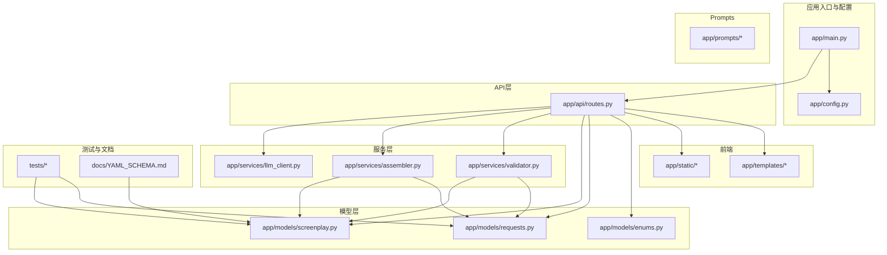
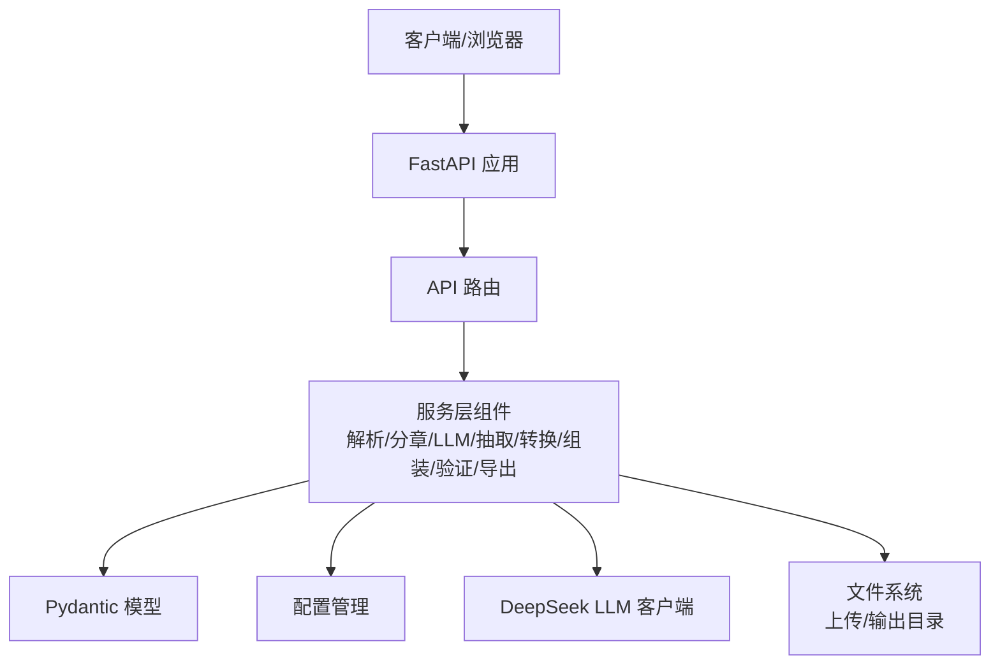
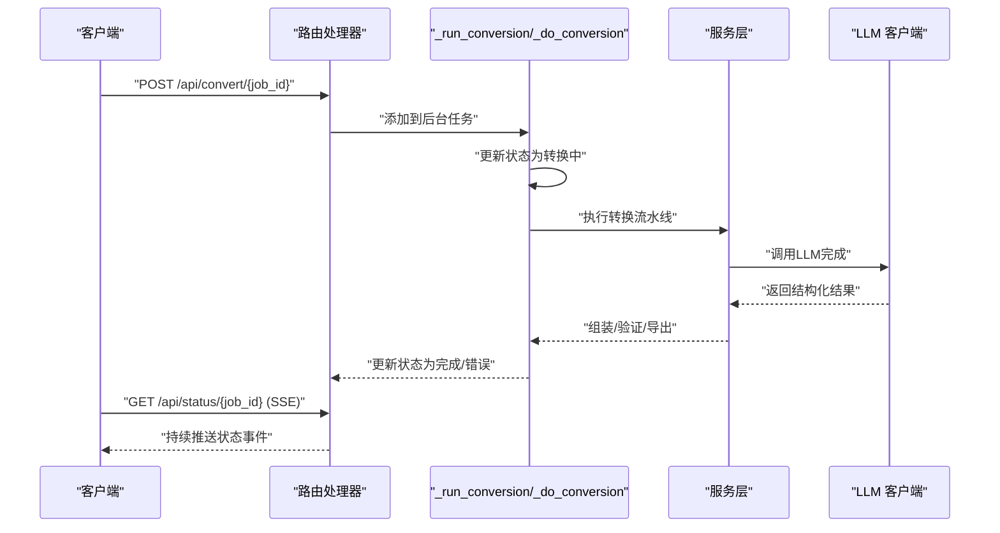
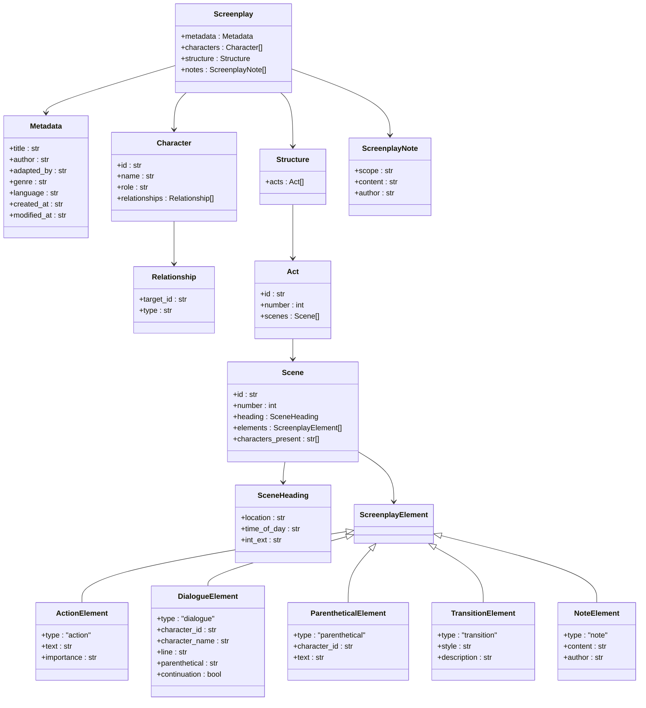
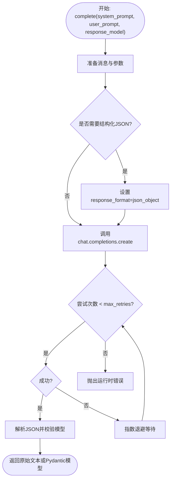
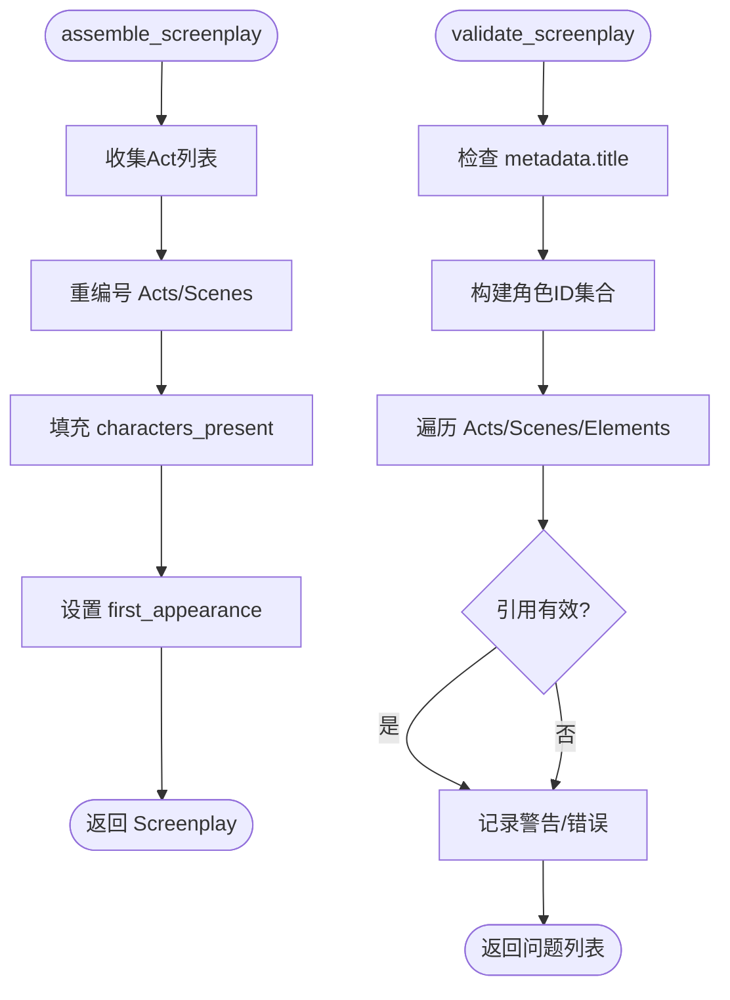
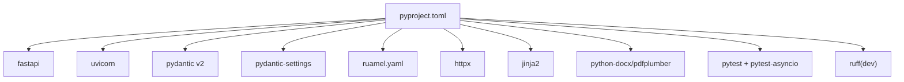

# 代码规范与最佳实践

<cite>
**本文档引用的文件**
- [README.md](file://README.md)
- [pyproject.toml](file://pyproject.toml)
- [app/main.py](file://app/main.py)
- [app/config.py](file://app/config.py)
- [app/api/routes.py](file://app/api/routes.py)
- [app/models/screenplay.py](file://app/models/screenplay.py)
- [app/models/enums.py](file://app/models/enums.py)
- [app/models/requests.py](file://app/models/requests.py)
- [app/services/llm_client.py](file://app/services/llm_client.py)
- [app/services/assembler.py](file://app/services/assembler.py)
- [app/services/validator.py](file://app/services/validator.py)
- [tests/test_models.py](file://tests/test_models.py)
- [tests/conftest.py](file://tests/conftest.py)
- [docs/YAML_SCHEMA.md](file://docs/YAML_SCHEMA.md)
</cite>

## 目录
1. [简介](#简介)
2. [项目结构](#项目结构)
3. [核心组件](#核心组件)
4. [架构总览](#架构总览)
5. [详细组件分析](#详细组件分析)
6. [依赖分析](#依赖分析)
7. [性能考虑](#性能考虑)
8. [故障排查指南](#故障排查指南)
9. [结论](#结论)
10. [附录](#附录)

## 简介
本指南面向本项目的Python代码规范与最佳实践，覆盖以下主题：
- Python编码风格与命名约定（函数、类、变量、常量）
- 注释与文档字符串规范
- 类型注解使用规范
- Pydantic模型使用规范与数据验证最佳实践
- FastAPI路由设计原则与异步编程规范
- ruff代码检查规则与自动修复流程
- 代码组织结构、模块导入规范
- 错误处理模式
- 性能优化与内存管理最佳实践

本指南以仓库现有实现为依据，结合测试与文档，形成可操作的规范与流程。

## 项目结构
项目采用按功能域划分的层次化组织方式：
- 应用入口与配置：app/main.py、app/config.py
- API层：app/api/routes.py
- 模型层：app/models/screenplay.py、app/models/enums.py、app/models/requests.py
- 服务层：app/services/*（解析、分章、LLM调用、抽取、转换、组装、验证、导出）
- Prompts：app/prompts/*
- 前端静态资源与模板：app/static、app/templates
- 测试：tests/*
- 文档：docs/YAML_SCHEMA.md
- 工程配置：pyproject.toml、README.md

图表来源
- [app/main.py:1-46](file://app/main.py#L1-L46)
- [app/api/routes.py:1-313](file://app/api/routes.py#L1-L313)
- [app/models/screenplay.py:1-167](file://app/models/screenplay.py#L1-L167)
- [app/models/requests.py:1-41](file://app/models/requests.py#L1-L41)
- [app/services/llm_client.py:1-103](file://app/services/llm_client.py#L1-L103)
- [app/services/assembler.py:1-101](file://app/services/assembler.py#L1-L101)
- [app/services/validator.py:1-111](file://app/services/validator.py#L1-L111)
- [docs/YAML_SCHEMA.md:1-496](file://docs/YAML_SCHEMA.md#L1-L496)

章节来源
- [README.md:77-108](file://README.md#L77-L108)
- [pyproject.toml:1-47](file://pyproject.toml#L1-L47)

## 核心组件
- 应用入口与生命周期：使用FastAPI应用工厂模式，通过lifespan确保运行时目录存在；注册CORS中间件与静态文件挂载；包含路由。
- 配置管理：基于pydantic-settings的Settings类，支持.env与环境变量加载，并提供缓存的工厂函数。
- API路由：提供上传、转换、状态流、结果下载/预览、验证等端点，使用Server-Sent Events推送状态。
- Pydantic模型：围绕YAML Schema构建的强类型模型，用于数据验证、序列化与JSON Schema生成。
- 服务层：封装LLM客户端、章节拆分、角色抽取、逐章转换、组装、验证、导出等业务逻辑。
- 测试与文档：测试覆盖模型行为；YAML Schema文档定义了结构、枚举与渲染规则。

章节来源
- [app/main.py:14-46](file://app/main.py#L14-L46)
- [app/config.py:9-44](file://app/config.py#L9-L44)
- [app/api/routes.py:53-313](file://app/api/routes.py#L53-L313)
- [app/models/screenplay.py:17-167](file://app/models/screenplay.py#L17-L167)
- [app/services/llm_client.py:18-103](file://app/services/llm_client.py#L18-L103)
- [docs/YAML_SCHEMA.md:1-496](file://docs/YAML_SCHEMA.md#L1-L496)

## 架构总览
系统采用“FastAPI + Pydantic + 服务层”的分层架构，API层负责请求接入与状态推送，服务层承载业务逻辑，模型层提供数据契约，配置层统一管理外部依赖与参数。

图表来源
- [app/main.py:23-46](file://app/main.py#L23-L46)
- [app/api/routes.py:15-313](file://app/api/routes.py#L15-L313)
- [app/services/llm_client.py:18-103](file://app/services/llm_client.py#L18-L103)
- [app/config.py:9-44](file://app/config.py#L9-L44)

## 详细组件分析

### FastAPI路由设计与异步规范
- 路由组织：按页面与API端点分离，使用独立的HTML响应与REST端点。
- 异步流程：后台任务启动转换流程，使用Server-Sent Events推送状态，避免阻塞主线程。
- 错误处理：HTTP异常与状态码明确区分；日志记录异常详情。
- SSE实现：事件生成器循环读取作业状态，直到完成或错误，设置合适的响应头。

图表来源
- [app/api/routes.py:114-313](file://app/api/routes.py#L114-L313)
- [app/services/llm_client.py:33-86](file://app/services/llm_client.py#L33-L86)

章节来源
- [app/api/routes.py:53-313](file://app/api/routes.py#L53-L313)

### Pydantic模型使用规范与数据验证最佳实践
- 单一数据源：以Pydantic模型作为YAML Schema的权威定义，确保验证、序列化与JSON Schema生成一致。
- 字段描述：使用Field描述信息，便于生成文档与调试。
- 裁判联合：使用Annotated + discriminator实现元素类型的区分联合，确保类型安全。
- 时间戳：使用UTC时间与工厂函数自动生成创建/修改时间。
- 枚举约束：通过枚举限制字段取值范围，保证下游一致性。
- 验证规则：服务层进行跨引用与结构性验证，确保角色引用有效、编号连续、非空结构等。

图表来源
- [app/models/screenplay.py:17-167](file://app/models/screenplay.py#L17-L167)

章节来源
- [app/models/screenplay.py:17-167](file://app/models/screenplay.py#L17-L167)
- [app/models/enums.py:6-83](file://app/models/enums.py#L6-L83)
- [app/models/requests.py:6-41](file://app/models/requests.py#L6-L41)
- [app/services/validator.py:11-111](file://app/services/validator.py#L11-L111)

### LLM客户端与异步调用
- 异步封装：基于AsyncOpenAI，支持重试、超时、温度与最大输出令牌控制。
- 结构化输出：当提供response_model时，解析JSON并反序列化为Pydantic模型。
- 错误处理：指数退避重试，最终失败抛出运行时错误。
- 资源释放：提供close方法关闭底层HTTP客户端。

图表来源
- [app/services/llm_client.py:33-86](file://app/services/llm_client.py#L33-L86)

章节来源
- [app/services/llm_client.py:18-103](file://app/services/llm_client.py#L18-L103)

### 组装与验证服务
- 组装：将各章节Act合并为完整结构，重编号、填充出场角色、设置首次出场场景。
- 验证：检查元数据完整性、角色引用有效性、编号连续性、非空结构等，输出问题清单。

图表来源
- [app/services/assembler.py:18-101](file://app/services/assembler.py#L18-L101)
- [app/services/validator.py:11-111](file://app/services/validator.py#L11-L111)

章节来源
- [app/services/assembler.py:18-101](file://app/services/assembler.py#L18-L101)
- [app/services/validator.py:11-111](file://app/services/validator.py#L11-L111)

## 依赖分析
- 工程配置：pyproject.toml声明了FastAPI、Uvicorn、Jinja2、Pydantic v2、pydantic-settings、ruamel.yaml、httpx、pytest、pytest-asyncio、ruff等依赖与脚本入口。
- 运行与开发：dev可选依赖包含ruff；scripts定义novel-serve入口。
- 测试：pytest配置启用asyncio模式，标记自定义标记。

图表来源
- [pyproject.toml:13-32](file://pyproject.toml#L13-L32)

章节来源
- [pyproject.toml:1-47](file://pyproject.toml#L1-L47)

## 性能考虑
- 异步I/O：LLM调用与文件读写均采用异步，避免阻塞事件循环。
- SSE推送：状态流采用异步生成器，按需推送，减少轮询开销。
- 缓存配置：Settings使用LRU缓存，降低重复初始化成本。
- 内存管理：避免在路由中持有大型对象；及时清理临时文件；在finally中关闭LLM客户端。
- 限流与超时：配置LLM超时与最大输出令牌，防止长时间占用。
- 上传限制：基于配置的最大上传大小，避免内存溢出。

章节来源
- [app/api/routes.py:131-158](file://app/api/routes.py#L131-L158)
- [app/services/llm_client.py:21-31](file://app/services/llm_client.py#L21-L31)
- [app/config.py:42-44](file://app/config.py#L42-L44)

## 故障排查指南
- LLM调用失败：检查API密钥、基础URL与模型名称；查看重试日志；确认网络连通性。
- 转换状态异常：确认作业ID存在；检查SSE连接头设置；查看后台任务异常日志。
- 验证失败：根据返回的问题路径定位字段；检查角色ID一致性与编号连续性。
- 文件上传过大：调整MAX_UPLOAD_SIZE_MB配置；检查磁盘空间。
- 配置未生效：确认.env文件存在且字段正确；检查lru_cache缓存是否需要重启进程。

章节来源
- [app/services/llm_client.py:80-86](file://app/services/llm_client.py#L80-L86)
- [app/api/routes.py:34-49](file://app/api/routes.py#L34-L49)
- [app/services/validator.py:11-111](file://app/services/validator.py#L11-L111)
- [app/config.py:24-25](file://app/config.py#L24-L25)

## 结论
本项目在FastAPI与Pydantic的支撑下，形成了清晰的分层架构与强类型数据契约。通过异步编程与SSE推送提升了用户体验，通过服务层封装实现了高内聚低耦合。建议在后续迭代中持续完善注释与文档字符串，强化类型注解覆盖，并保持ruff规则与自动修复流程的稳定性。

## 附录

### Python编码风格与命名约定
- 模块与包：小写下划线命名（如app.api.routes）；包内__init__.py用于聚合导出。
- 类：帕斯卡命名（如Settings、DeepSeekClient、Screenplay）。
- 函数与方法：小写下划线命名（如assemble_screenplay、_run_conversion）。
- 常量：全大写下划线（如MAX_UPLOAD_SIZE_MB）。
- 私有成员：前缀下划线（如_update_status、_jobs）。
- 类型变量：首字母大写（如T）。

章节来源
- [app/config.py:24-25](file://app/config.py#L24-L25)
- [app/services/llm_client.py:15](file://app/services/llm_client.py#L15)
- [app/api/routes.py:34-49](file://app/api/routes.py#L34-L49)

### 注释与文档字符串规范
- 模块级文档字符串：位于模块顶部，简述职责与用途。
- 函数/方法文档字符串：描述用途、参数、返回值与异常；必要时包含示例路径。
- 行内注释：解释复杂逻辑或边界条件；避免显而易见的注释。
- TODO/FIXME：使用明确的标签与上下文说明。

章节来源
- [app/main.py:1-1](file://app/main.py#L1-L1)
- [app/api/routes.py:210-217](file://app/api/routes.py#L210-L217)

### 类型注解使用规范
- 基本类型：优先使用内置类型与typing模块类型（如list、dict、Union、Literal、Annotated）。
- 泛型：使用TypeVar绑定基类（如T: TypeVar("T", bound=BaseModel)）。
- 可选类型：使用| None或Optional[T]。
- 复杂结构：使用Annotated与Field的discriminator实现区分联合。

章节来源
- [app/models/screenplay.py:10-12](file://app/models/screenplay.py#L10-L12)
- [app/services/llm_client.py:15-15](file://app/services/llm_client.py#L15-L15)

### Pydantic模型使用规范与数据验证最佳实践
- 字段约束：使用Field描述字段含义；默认值与工厂函数确保一致性。
- 枚举约束：通过枚举限定取值范围，避免无效值进入数据流。
- 裁判联合：使用Annotated + discriminator实现类型安全的联合。
- 校验顺序：先模型校验，再业务规则校验；输出结构化的ValidationIssue。

章节来源
- [app/models/screenplay.py:17-167](file://app/models/screenplay.py#L17-L167)
- [app/models/enums.py:6-83](file://app/models/enums.py#L6-L83)
- [app/services/validator.py:11-111](file://app/services/validator.py#L11-L111)

### FastAPI路由设计原则与异步编程规范
- 路由职责单一：页面渲染与API端点分离；SSE端点独立实现。
- 异步优先：后台任务与异步I/O；避免阻塞主请求线程。
- 错误处理：HTTP异常与状态码明确；日志记录异常详情。
- 生命周期：使用lifespan确保目录与资源初始化。

章节来源
- [app/api/routes.py:53-313](file://app/api/routes.py#L53-L313)
- [app/main.py:14-28](file://app/main.py#L14-L28)

### ruff代码检查规则与自动修复流程
- 配置项：目标Python版本、行长限制。
- 常用命令：检查与自动修复lint问题。
- 开发工作流：提交前执行ruff check app/ tests/；配合--fix自动修复。

章节来源
- [pyproject.toml:44-47](file://pyproject.toml#L44-L47)
- [README.md:158-163](file://README.md#L158-L163)

### 代码组织结构与模块导入规范
- 按功能域组织：models、services、prompts、templates、static。
- 明确导入边界：避免循环导入；使用相对导入或绝对导入保持一致性。
- 聚合导出：__init__.py用于暴露公共接口，简化上层导入。

章节来源
- [README.md:77-108](file://README.md#L77-L108)

### 错误处理模式
- HTTP异常：针对用户输入与状态错误返回明确的HTTP状态码。
- 日志记录：捕获异常并记录上下文信息，便于追踪。
- 资源清理：在finally中关闭LLM客户端，确保资源释放。

章节来源
- [app/api/routes.py:210-217](file://app/api/routes.py#L210-L217)
- [app/services/llm_client.py:100-103](file://app/services/llm_client.py#L100-L103)

### 文档字符串编写标准
- 模块：简述目的与职责。
- 类：描述用途与关键属性/方法。
- 方法：说明输入、输出、副作用与异常。
- 示例：必要时提供调用示例或相关文件路径。

章节来源
- [app/models/screenplay.py:1-6](file://app/models/screenplay.py#L1-L6)
- [app/services/llm_client.py:18-52](file://app/services/llm_client.py#L18-L52)

### 性能优化与内存管理最佳实践
- 异步I/O：LLM与文件读写异步化。
- SSE：按需推送，减少轮询。
- 缓存：Settings使用LRU缓存。
- 上传限制：基于配置限制上传大小。
- 资源释放：finally中关闭客户端。

章节来源
- [app/services/llm_client.py:100-103](file://app/services/llm_client.py#L100-L103)
- [app/api/routes.py:82-83](file://app/api/routes.py#L82-L83)
- [app/config.py:42-44](file://app/config.py#L42-L44)