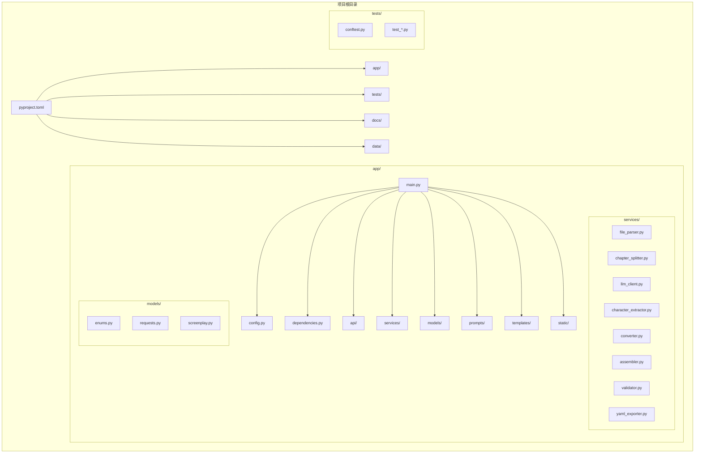

# 开发环境搭建

<cite>
**本文档引用的文件**
- [README.md](file://README.md)
- [pyproject.toml](file://pyproject.toml)
- [app/main.py](file://app/main.py)
- [app/config.py](file://app/config.py)
- [app/services/llm_client.py](file://app/services/llm_client.py)
- [.gitignore](file://.gitignore)
- [tests/conftest.py](file://tests/conftest.py)
- [tests/test_models.py](file://tests/test_models.py)
</cite>

## 目录
1. [简介](#简介)
2. [Python环境要求](#python环境要求)
3. [虚拟环境创建](#虚拟环境创建)
4. [依赖安装步骤](#依赖安装步骤)
5. [开发工具链安装](#开发工具链安装)
6. [IDE配置建议](#ide配置建议)
7. [环境变量配置](#环境变量配置)
8. [项目结构概览](#项目结构概览)
9. [环境验证](#环境验证)
10. [常见问题排查](#常见问题排查)
11. [性能优化建议](#性能优化建议)
12. [总结](#总结)

## 简介

这是一个基于FastAPI的AI驱动小说转剧本工具项目。该项目能够将小说文本自动转换为结构化的YAML剧本格式，支持多种文件格式输入（TXT、Markdown、DOCX、PDF），并通过LLM技术实现智能化的剧本转换。

## Python环境要求

### 版本要求
- **Python >= 3.10**：项目明确要求Python版本不低于3.10
- **兼容性**：项目已通过Python 3.10+的测试验证

### 环境检查
```bash
# 检查Python版本
python --version
# 或
python3 --version

# 验证版本满足要求
python --version | grep -E "(3\.1[0-9]|4\.)"
```

**章节来源**
- [README.md:30-34](file://README.md#L30-L34)
- [pyproject.toml:12](file://pyproject.toml#L12)

## 虚拟环境创建

### 创建虚拟环境
```bash
# 进入项目目录
cd novel

# 创建虚拟环境（推荐使用venv）
python3 -m venv .venv

# 激活虚拟环境
# Linux/macOS:
source .venv/bin/activate

# Windows:
# .venv\Scripts\activate
```

### 虚拟环境验证
```bash
# 检查Python路径指向虚拟环境
which python

# 验证Python版本
python --version
```

**章节来源**
- [README.md:37-44](file://README.md#L37-L44)

## 依赖安装步骤

### 安装完整开发环境
```bash
# 激活虚拟环境后执行
pip install -e ".[dev]"
```

### 手动安装核心依赖
```bash
# 核心依赖（必须）
pip install fastapi uvicorn jinja2 python-multipart

# LLM相关依赖
pip install openai pydantic pydantic-settings

# 文件处理依赖
pip install python-docx pdfplumber

# YAML处理依赖
pip install ruamel.yaml

# 开发工具（可选）
pip install pytest pytest-asyncio ruff
```

### 依赖验证
```bash
# 检查安装的包
pip list | grep -E "(fastapi|uvicorn|pydantic|openai)"

# 查看依赖树
pip show -f fastapi
```

**章节来源**
- [README.md:37-44](file://README.md#L37-L44)
- [pyproject.toml:13-25](file://pyproject.toml#L13-L25)
- [pyproject.toml:27-32](file://pyproject.toml#L27-L32)

## 开发工具链安装

### Ruff代码检查工具
```bash
# 安装Ruff
pip install ruff

# 基本使用
ruff check app/ tests/
ruff check app/ tests/ --fix

# 配置检查
ruff check --config pyproject.toml app/
```

### Pytest测试框架
```bash
# 安装pytest
pip install pytest pytest-asyncio

# 运行测试
python -m pytest tests/ -v

# 运行特定测试
python -m pytest tests/test_models.py -v

# 运行标记测试
python -m pytest -m live tests/
```

### Uvicorn开发服务器
```bash
# 安装Uvicorn
pip install uvicorn[standard]

# 启动开发服务器
python -m uvicorn app.main:app --reload --port 8000

# 或使用脚本
novel-serve
```

**章节来源**
- [README.md:152-163](file://README.md#L152-L163)
- [pyproject.toml:34-42](file://pyproject.toml#L34-L42)

## IDE配置建议

### VS Code配置

#### 推荐扩展
- **Python**：Microsoft官方Python扩展
- **Pylance**：快速类型检查和智能提示
- **Ruff**：Python代码检查工具
- **Python Docstring Generator**：自动生成文档字符串
- **GitLens**：增强的Git功能
- **Bracket Pair Colorizer**：括号配对着色

#### VS Code设置
```json
{
    "python.defaultInterpreterPath": "./.venv/bin/python",
    "python.linting.enabled": true,
    "python.linting.ruffEnabled": true,
    "python.formatting.provider": "ruff",
    "python.testing.pytestEnabled": true,
    "python.testing.unittestEnabled": false,
    "editor.codeActionsOnSave": {
        "source.fixAll": true
    },
    "files.exclude": {
        "**/__pycache__": true,
        "**/*.pyc": true
    }
}
```

### PyCharm配置

#### 基础设置
1. **项目解释器**：选择`.venv/bin/python`
2. **Python SDK**：确保选择正确的Python版本
3. **项目结构**：将`app`目录标记为Sources Root

#### 插件推荐
- **Python Security**：安全扫描
- **Rainbow Brackets**：彩虹括号
- **String Manipulation**：字符串处理工具
- **.ignore**：忽略文件管理

#### 测试配置
```python
# PyCharm测试运行器配置
# Run/Debug Configurations
# Add New Configuration
# Python tests -> pytest
# Target: tests/
# Additional Arguments: -v
```

**章节来源**
- [README.md:15-26](file://README.md#L15-L26)

## 环境变量配置

### 创建.env文件
```bash
# 复制示例配置文件
cp .env.example .env

# 编辑.env文件，添加DeepSeek API密钥
vim .env
```

### 环境变量详解

| 环境变量 | 默认值 | 说明 |
|---------|-------|------|
| `DEEPSEEK_API_KEY` | (必填) | DeepSeek API密钥 |
| `DEEPSEEK_BASE_URL` | `https://api.deepseek.com` | API基础URL |
| `DEEPSEEK_MODEL` | `deepseek-chat` | 使用的模型 |
| `MAX_UPLOAD_SIZE_MB` | `50` | 最大上传文件大小(MB) |
| `DATA_DIR` | `./data` | 运行时数据目录 |

### 配置文件示例
```env
# DeepSeek API配置
DEEPSEEK_API_KEY=sk-your-key-here
DEEPSEEK_BASE_URL=https://api.deepseek.com
DEEPSEEK_MODEL=deepseek-chat

# 应用程序配置
MAX_UPLOAD_SIZE_MB=50
DATA_DIR=./data

# LLM参数配置
MAX_TOKENS_PER_CHUNK=6000
MAX_OUTPUT_TOKENS=8192
LLM_TEMPERATURE=0.3
LLM_TIMEOUT=120
```

### 配置加载验证
```python
# 在Python中验证配置加载
from app.config import get_settings

settings = get_settings()
print(f"API Key: {settings.deepseek_api_key[:5]}...")
print(f"Upload Dir: {settings.upload_dir}")
print(f"Output Dir: {settings.output_dir}")
```

**章节来源**
- [README.md:48-60](file://README.md#L48-L60)
- [README.md:165-173](file://README.md#L165-L173)
- [app/config.py:9-44](file://app/config.py#L9-L44)

## 项目结构概览



**图表来源**
- [README.md:77-108](file://README.md#L77-L108)
- [app/main.py:1-46](file://app/main.py#L1-L46)

**章节来源**
- [README.md:77-108](file://README.md#L77-L108)

## 环境验证

### 启动应用验证
```bash
# 启动开发服务器
python -m uvicorn app.main:app --reload --port 8000

# 或使用脚本
novel-serve
```

### 测试运行验证
```bash
# 运行所有测试
python -m pytest tests/ -v

# 运行特定模块测试
python -m pytest tests/test_models.py -v

# 运行测试并生成覆盖率报告
pip install pytest-cov
python -m pytest tests/ --cov=app --cov-report=html
```

### 代码质量检查
```bash
# 运行Ruff检查
ruff check app/ tests/

# 自动修复简单问题
ruff check app/ tests/ --fix

# 检查导入排序
ruff check app/ tests/ --select=F401
```

### 基础功能验证
```python
# 验证核心模块导入
python -c "
from app.main import app
from app.config import get_settings
from app.services.llm_client import DeepSeekClient
print('所有模块导入成功')
"

# 验证配置加载
settings = get_settings()
print(f'配置加载成功: {settings.deepseek_api_key != \"\"}')
```

**章节来源**
- [README.md:62-68](file://README.md#L62-L68)
- [README.md:152-163](file://README.md#L152-L163)

## 常见问题排查

### Python版本问题
**问题**：Python版本过低
```bash
# 检查当前Python版本
python --version

# 解决方案：升级Python到3.10+
# 使用pyenv管理多个Python版本
pyenv install 3.10.13
pyenv global 3.10.13
```

**章节来源**
- [README.md:30-34](file://README.md#L30-L34)

### 依赖安装失败
**问题**：pip安装失败或依赖冲突
```bash
# 清理pip缓存
pip cache purge

# 升级pip和setuptools
pip install --upgrade pip setuptools wheel

# 使用国内镜像源
pip install -i https://pypi.tuna.tsinghua.edu.cn/simple/ -e ".[dev]"

# 指定Python版本重新安装
python3.10 -m pip install -e ".[dev]"
```

**章节来源**
- [pyproject.toml:13-32](file://pyproject.toml#L13-L32)

### LLM API连接问题
**问题**：无法连接DeepSeek API
```bash
# 验证网络连接
ping api.deepseek.com

# 检查API密钥
echo $DEEPSEEK_API_KEY

# 测试API连接
curl -X GET https://api.deepseek.com/v1/models \
  -H "Authorization: Bearer $DEEPSEEK_API_KEY"

# 检查代理设置
export http_proxy=http://proxy.server:port
export https_proxy=http://proxy.server:port
```

**章节来源**
- [app/services/llm_client.py:21-32](file://app/services/llm_client.py#L21-L32)
- [app/config.py:18-31](file://app/config.py#L18-L31)

### 端口占用问题
**问题**：端口8000被占用
```bash
# 检查端口占用
lsof -i :8000
netstat -an | grep :8000

# 更换端口启动
python -m uvicorn app.main:app --reload --port 8080

# 杀死占用进程
kill -9 $(lsof -t -i :8000)
```

**章节来源**
- [app/main.py:42-46](file://app/main.py#L42-L46)

### 虚拟环境问题
**问题**：激活虚拟环境失败
```bash
# 重新创建虚拟环境
rm -rf .venv
python3 -m venv .venv

# 在Windows上使用PowerShell
Set-ExecutionPolicy -ExecutionPolicy RemoteSigned -Scope CurrentUser
.venv\Scripts\Activate.ps1

# 检查虚拟环境路径
ls -la .venv/bin/python*
```

**章节来源**
- [.gitignore:10-14](file://.gitignore#L10-L14)

### 文件权限问题
**问题**：数据目录写入权限不足
```bash
# 检查数据目录权限
ls -la data/

# 设置正确的权限
chmod 755 data/
chmod 777 data/uploads/
chmod 777 data/outputs/

# 创建缺失目录
mkdir -p data/uploads data/outputs
```

**章节来源**
- [app/config.py:33-39](file://app/config.py#L33-L39)

## 性能优化建议

### 代码优化
```python
# 使用异步编程优化I/O密集操作
import asyncio
import aiohttp

# 实现连接池复用
session = aiohttp.ClientSession()

# 使用缓存减少重复计算
from functools import lru_cache

@lru_cache(maxsize=128)
def expensive_operation(param):
    # 复杂计算逻辑
    pass
```

### 内存管理
```python
# 及时释放资源
import gc

# 处理大量数据时定期清理
gc.collect()

# 使用生成器处理大数据集
def process_large_file(filename):
    with open(filename, 'r') as f:
        for line in f:
            yield process_line(line)
```

### 并发处理
```python
# 使用asyncio并发处理多个任务
async def concurrent_processing(tasks):
    results = await asyncio.gather(*tasks, return_exceptions=True)
    return results

# 限制并发数量
semaphore = asyncio.Semaphore(10)

async def limited_concurrent_task():
    async with semaphore:
        # 执行任务
        pass
```

## 总结

本开发环境搭建指南涵盖了从Python环境准备到项目部署的完整流程。关键要点包括：

### 核心要求
- **Python 3.10+**：确保满足最低版本要求
- **虚拟环境**：使用`.venv`隔离项目依赖
- **完整依赖**：安装核心依赖和开发工具

### 开发工具链
- **Ruff**：代码风格检查和自动修复
- **Pytest**：全面的测试框架
- **Uvicorn**：高性能ASGI服务器

### 配置管理
- **环境变量**：通过`.env`文件管理配置
- **Pydantic Settings**：类型安全的配置加载
- **默认值设置**：合理的默认配置

### 验证流程
- **功能测试**：确保核心功能正常
- **代码质量**：通过静态分析检查
- **性能测试**：验证系统性能指标

按照本指南的步骤执行，您应该能够成功搭建并运行这个小说转剧本工具的开发环境。如遇任何问题，请参考对应的章节进行排查解决。