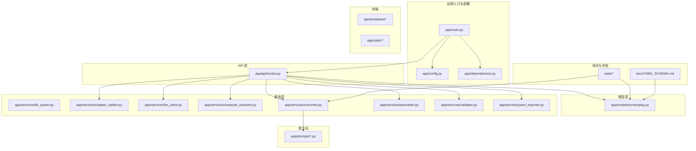
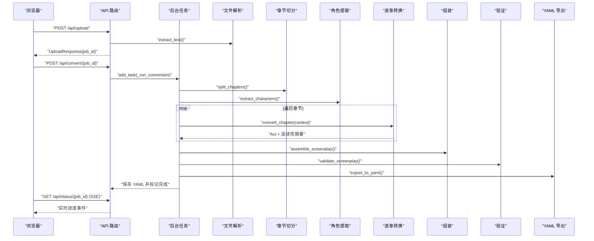
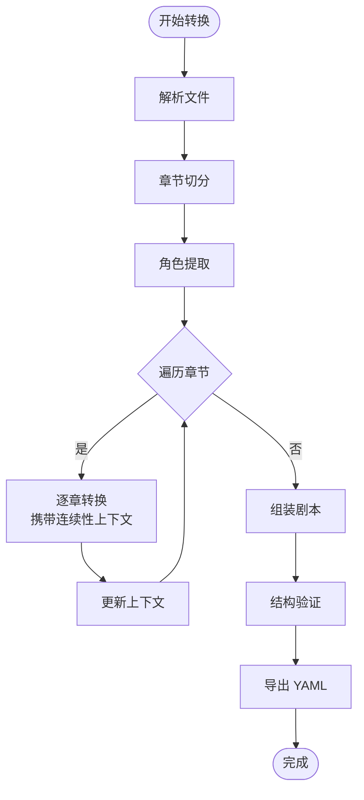
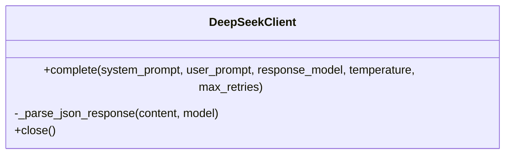
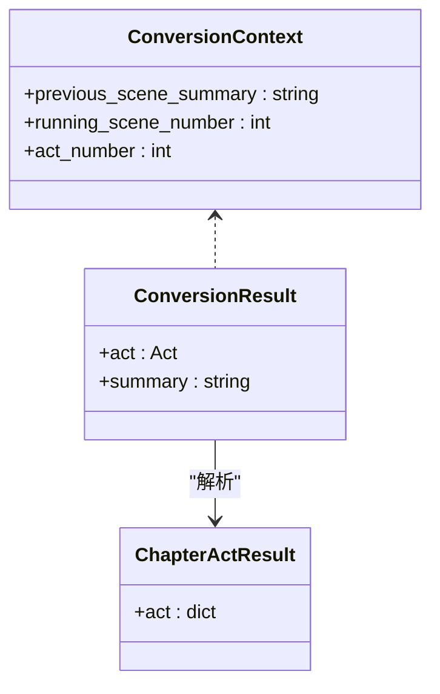
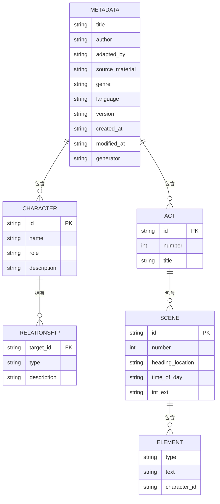
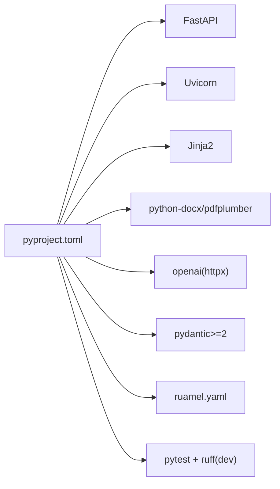

# 开发者指南

<cite>
**本文档引用的文件**
- [README.md](file://README.md)
- [pyproject.toml](file://pyproject.toml)
- [app/main.py](file://app/main.py)
- [app/config.py](file://app/config.py)
- [app/dependencies.py](file://app/dependencies.py)
- [app/api/routes.py](file://app/api/routes.py)
- [app/models/screenplay.py](file://app/models/screenplay.py)
- [app/services/converter.py](file://app/services/converter.py)
- [app/services/llm_client.py](file://app/services/llm_client.py)
- [app/prompts/screenplay_conversion.py](file://app/prompts/screenplay_conversion.py)
- [docs/YAML_SCHEMA.md](file://docs/YAML_SCHEMA.md)
- [tests/conftest.py](file://tests/conftest.py)
- [tests/test_models.py](file://tests/test_models.py)
</cite>

## 目录
1. [简介](#简介)
2. [项目结构](#项目结构)
3. [核心组件](#核心组件)
4. [架构总览](#架构总览)
5. [详细组件分析](#详细组件分析)
6. [依赖分析](#依赖分析)
7. [性能考量](#性能考量)
8. [故障排查指南](#故障排查指南)
9. [结论](#结论)
10. [附录](#附录)

## 简介
本指南面向贡献者与扩展开发者，提供从环境搭建、代码规范、Git 工作流到新功能开发、调试与性能优化的完整开发指引。项目基于 FastAPI 提供 Web 接口，结合 LLM 完成“小说转剧本”的自动化处理，并以结构化 YAML 输出。文档同时覆盖代码审查、测试与质量保障、许可证与法律注意事项。

## 项目结构
项目采用按功能域分层的组织方式：应用入口、配置、API 路由、模型定义、服务层（解析、章节切分、LLM 客户端、转换、组装、验证、导出）、提示词模板、前端静态资源与模板、测试与文档。

图表来源
- [app/main.py:1-46](file://app/main.py#L1-L46)
- [app/api/routes.py:1-313](file://app/api/routes.py#L1-L313)
- [app/models/screenplay.py:1-167](file://app/models/screenplay.py#L1-L167)
- [app/services/converter.py:1-218](file://app/services/converter.py#L1-L218)
- [app/services/llm_client.py:1-103](file://app/services/llm_client.py#L1-L103)
- [app/prompts/screenplay_conversion.py:1-91](file://app/prompts/screenplay_conversion.py#L1-L91)
- [docs/YAML_SCHEMA.md:1-496](file://docs/YAML_SCHEMA.md#L1-L496)

章节来源
- [README.md:77-108](file://README.md#L77-L108)
- [pyproject.toml:8-47](file://pyproject.toml#L8-L47)

## 核心组件
- 应用入口与生命周期：FastAPI 应用初始化、CORS 中间件、静态资源挂载、启动时确保运行目录存在。
- 配置系统：使用 pydantic-settings 从 .env 与环境变量加载设置，包含 LLM 服务参数与应用参数。
- API 路由：提供页面渲染、文件上传、转换任务启动、状态流式推送、结果下载与预览、验证查询等端点；后台任务执行完整转换流水线。
- 模型定义：基于 Pydantic v2 的 YAML Schema 单一真相模型，涵盖元数据、角色、场景、元素与结构。
- 服务层：文件解析、章节切分、角色提取、逐章转换（含连续性上下文）、组装、验证、YAML 导出。
- LLM 客户端：异步 OpenAI 兼容客户端，支持结构化输出与重试机制。
- 提示词模板：明确系统提示与用户模板，约束输出结构与风格。
- 测试与文档：模型单元测试、测试夹具、YAML Schema 设计文档。

章节来源
- [app/main.py:14-46](file://app/main.py#L14-L46)
- [app/config.py:9-44](file://app/config.py#L9-L44)
- [app/api/routes.py:53-313](file://app/api/routes.py#L53-L313)
- [app/models/screenplay.py:17-167](file://app/models/screenplay.py#L17-L167)
- [app/services/converter.py:16-218](file://app/services/converter.py#L16-L218)
- [app/services/llm_client.py:18-103](file://app/services/llm_client.py#L18-L103)
- [app/prompts/screenplay_conversion.py:1-91](file://app/prompts/screenplay_conversion.py#L1-L91)
- [tests/test_models.py:1-124](file://tests/test_models.py#L1-L124)
- [tests/conftest.py:1-167](file://tests/conftest.py#L1-L167)
- [docs/YAML_SCHEMA.md:1-496](file://docs/YAML_SCHEMA.md#L1-L496)

## 架构总览
系统采用“请求驱动 + 后台任务”的模式：前端上传文件后，后端记录作业状态并通过 SSE 实时推送进度；后台任务串行执行解析、章节切分、角色提取、逐章转换（携带连续性上下文）、组装、验证与导出。

图表来源
- [app/api/routes.py:208-313](file://app/api/routes.py#L208-L313)
- [app/services/converter.py:36-84](file://app/services/converter.py#L36-L84)
- [app/services/llm_client.py:33-86](file://app/services/llm_client.py#L33-L86)

## 详细组件分析

### API 路由与后台流水线
- 页面路由：首页与预览页渲染。
- 文件上传：类型检测、大小限制、持久化、词数统计。
- 转换启动：幂等检查、可选覆盖 API Key、加入后台任务队列。
- 进度推送：SSE 流与 JSON 回退接口。
- 结果下载与预览：YAML 下载与纯文本预览。
- 验证查询：返回结构化校验问题列表。
- 后台流水线：解析 → 切分 → 角色提取 → 逐章转换（携带连续性上下文）→ 组装 → 验证 → 导出。

图表来源
- [app/api/routes.py:210-313](file://app/api/routes.py#L210-L313)
- [app/services/converter.py:254-274](file://app/services/converter.py#L254-L274)

章节来源
- [app/api/routes.py:53-206](file://app/api/routes.py#L53-L206)
- [app/api/routes.py:210-313](file://app/api/routes.py#L210-L313)

### LLM 客户端与提示词
- LLM 客户端：异步 OpenAI 兼容封装，支持结构化 JSON 输出、温度与超时控制、指数回退重试。
- 提示词：系统提示约束输出风格与结构，用户模板注入角色目录、前章上下文、章节内容与标题。

图表来源
- [app/services/llm_client.py:18-103](file://app/services/llm_client.py#L18-L103)

章节来源
- [app/services/llm_client.py:18-103](file://app/services/llm_client.py#L18-L103)
- [app/prompts/screenplay_conversion.py:1-91](file://app/prompts/screenplay_conversion.py#L1-L91)

### 转换引擎与连续性上下文
- 转换上下文：维护上一场景摘要、全局场景号与幕序号，用于跨章节一致性。
- 章节转换：截断过长文本、构造用户提示、调用 LLM、解析 Act、生成两句话摘要并更新上下文。
- 回退策略：当 LLM 失败时生成最小可用 Act 以保证流程继续。

图表来源
- [app/services/converter.py:16-34](file://app/services/converter.py#L16-L34)
- [app/models/screenplay.py:134-157](file://app/models/screenplay.py#L134-L157)

章节来源
- [app/services/converter.py:16-84](file://app/services/converter.py#L16-L84)
- [app/models/screenplay.py:105-157](file://app/models/screenplay.py#L105-L157)

### 模型与 YAML Schema
- 模型层次：Metadata → Characters → Structure(Acts) → Scenes → Elements(Action/Dialogue/Parenthetical/Transition/Note)。
- 字段约束：Pydantic 字段校验、Discriminated Union 保证元素类型安全。
- 设计原则：可往返、LLM 友好、人类可编辑；与 Fountain/Final Draft/WGA 标准对齐。

图表来源
- [app/models/screenplay.py:17-167](file://app/models/screenplay.py#L17-L167)
- [docs/YAML_SCHEMA.md:25-327](file://docs/YAML_SCHEMA.md#L25-L327)

章节来源
- [app/models/screenplay.py:17-167](file://app/models/screenplay.py#L17-L167)
- [docs/YAML_SCHEMA.md:1-496](file://docs/YAML_SCHEMA.md#L1-L496)

## 依赖分析
- 运行时依赖：FastAPI、Uvicorn、Jinja2、multipart、docx/pdf 解析、OpenAI SDK、Pydantic v2、ruamel.yaml、httpx。
- 开发依赖：pytest、pytest-asyncio、ruff。
- 项目脚本：novel-serve 启动命令映射至应用入口。

图表来源
- [pyproject.toml:12-32](file://pyproject.toml#L12-L32)

章节来源
- [pyproject.toml:8-47](file://pyproject.toml#L8-L47)

## 性能考量
- LLM 调用成本控制：严格限制单次输入长度与输出长度，使用“滑动窗口 + 记忆”策略复用前章摘要，避免重复信息。
- IO 与并发：异步 LLM 客户端与后台任务，减少阻塞；SSE 实时推送降低轮询开销。
- 缓存与目录：应用启动时确保上传与输出目录存在，避免运行时异常。
- 前端体验：静态资源挂载与模板渲染，减少后端压力。

章节来源
- [app/main.py:14-20](file://app/main.py#L14-L20)
- [app/services/converter.py:53-57](file://app/services/converter.py#L53-L57)
- [app/services/llm_client.py:33-86](file://app/services/llm_client.py#L33-L86)

## 故障排查指南
- 环境变量缺失：确认 .env 或环境变量包含必需的 LLM 凭据与基础 URL。
- 文件过大：检查上传大小限制，必要时拆分输入文件。
- LLM 调用失败：查看重试日志与最终异常；确认网络连通与配额。
- 转换中断：检查作业状态流是否正常；确认后台任务未被提前终止。
- 验证失败：根据返回的验证问题列表修正角色引用、编号连续性与场景头格式。
- 前端无法加载：确认静态资源挂载路径与模板目录配置正确。

章节来源
- [app/config.py:18-31](file://app/config.py#L18-L31)
- [app/api/routes.py:81-95](file://app/api/routes.py#L81-L95)
- [app/services/llm_client.py:80-86](file://app/services/llm_client.py#L80-L86)
- [app/api/routes.py:201-206](file://app/api/routes.py#L201-L206)

## 结论
本项目通过清晰的分层架构与严格的模型约束，实现了从“小说文本”到“结构化 YAML 剧本”的自动化转换。建议在新增功能时遵循现有分层与命名约定，保持服务职责单一、测试覆盖充分、文档同步更新，并通过代码审查与持续集成保障质量。

## 附录

### 开发环境搭建
- Python 版本：>= 3.10
- 安装项目与开发依赖：使用可编辑安装包含 dev 依赖
- 环境变量：复制 .env.example 为 .env，填写 LLM 凭据与基础 URL
- 启动方式：使用 novel-serve 或直接运行 Uvicorn 指向应用入口

章节来源
- [README.md:30-68](file://README.md#L30-L68)
- [pyproject.toml:12-35](file://pyproject.toml#L12-L35)

### 代码规范与最佳实践
- 代码风格：使用 ruff 进行检查与自动修复，行宽 120，目标 Python 版本 3.10
- 命名约定：模块与类使用清晰语义，函数与变量描述性强；常量全大写
- 注释规范：公共接口与复杂逻辑添加说明；避免过度注释
- 错误处理：显式捕获与转换异常，记录上下文日志，必要时返回 HTTP 错误码
- 异步编程：优先使用异步函数与客户端，避免阻塞主线程

章节来源
- [pyproject.toml:44-47](file://pyproject.toml#L44-L47)
- [app/services/llm_client.py:80-86](file://app/services/llm_client.py#L80-L86)

### Git 工作流程与分支管理
- 分支策略：主分支保护，功能开发在特性分支，修复在 hotfix 分支
- 提交规范：简短主题 + 详细描述；关联 Issue 编号
- 合并与审查：开启 Pull Request，至少一次审查通过后合并
- 标签与发布：按语义化版本打标签并生成变更日志

（本节为通用实践建议，不直接对应具体源码）

### 代码审查标准与流程
- 覆盖率：新增/修改代码需有相应测试
- 可读性：命名一致、模块职责清晰、避免重复逻辑
- 安全性：输入校验、敏感信息脱敏、避免硬编码
- 性能：关注 LLM 调用次数与 Token 预算、IO 与并发瓶颈
- 文档：更新相关 README、Schema 文档与注释

（本节为通用实践建议，不直接对应具体源码）

### 新功能开发指导
- 模块设计：遵循现有分层（API → 服务 → 模型），尽量无副作用与可测试
- 测试要求：补充单元测试与集成测试，覆盖正常与异常路径
- 文档更新：更新 README 与 YAML Schema 文档，说明行为变化
- 配置与部署：如需新增配置项，完善默认值与校验逻辑

章节来源
- [app/models/screenplay.py:17-167](file://app/models/screenplay.py#L17-L167)
- [docs/YAML_SCHEMA.md:1-496](file://docs/YAML_SCHEMA.md#L1-L496)

### 调试技巧与问题排查
- 日志：启用 DEBUG 级别查看 LLM 请求与响应、转换阶段耗时
- 状态监控：通过 SSE 与 JSON 端点观察作业状态
- 回退策略：当 LLM 失败时使用最小可用结果保证流程继续
- 本地验证：使用测试夹具快速复现问题

章节来源
- [app/api/routes.py:131-166](file://app/api/routes.py#L131-L166)
- [app/services/converter.py:160-183](file://app/services/converter.py#L160-L183)

### 架构演进方向与扩展点
- 扩展提示词：增加领域特定提示，支持不同剧种与风格
- 多模型并行：在 LLM 客户端抽象之上支持多供应商与多模型切换
- 缓存与批处理：对重复章节与角色提取结果进行缓存
- 插件化导出：除 YAML 外支持其他剧本格式导出
- 交互式编辑：在前端增加所见即所得的编辑器与校验反馈

（本节为概念性建议，不直接对应具体源码）

### 社区贡献与沟通
- 提交 Issue：描述问题背景、复现步骤与期望结果
- 提交 PR：关联 Issue、提供测试与文档更新
- 讨论渠道：在 Issue 区域进行技术讨论与方案评审

（本节为通用实践建议，不直接对应具体源码）

### 性能优化与代码重构建议
- 优化 LLM 调用：合并相似请求、复用上下文、限制最大长度
- 重构建议：将重复逻辑抽取为独立服务；对长链路增加中间态持久化
- 监控与指标：埋点转换耗时、错误率与资源占用

（本节为通用实践建议，不直接对应具体源码）

### 许可证要求与法律考虑
- 许可证：项目采用 MIT 许可证，允许商用与再分发，需保留版权与许可声明
- 第三方依赖：注意各依赖的许可证兼容性，避免引入强 copyleft 许可
- 数据隐私：处理用户上传文件时遵守数据最小化与删除策略

章节来源
- [README.md:175-178](file://README.md#L175-L178)