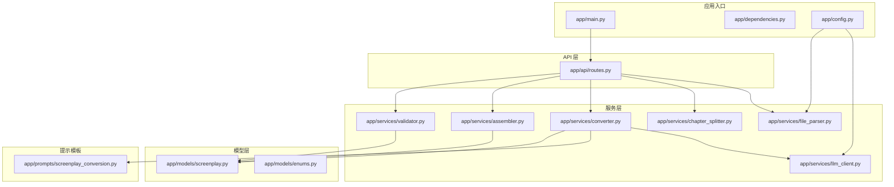
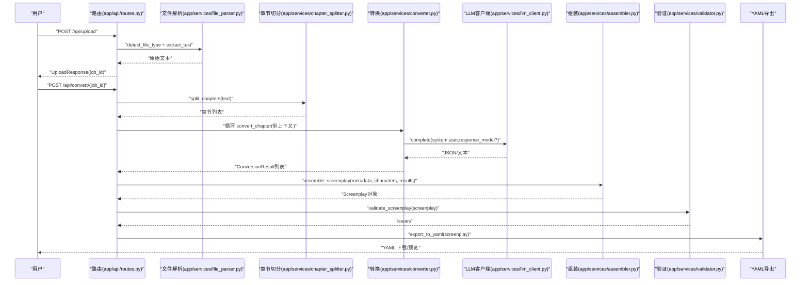
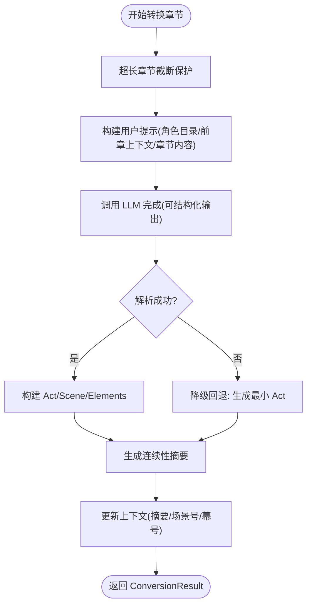
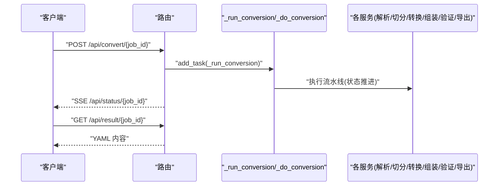
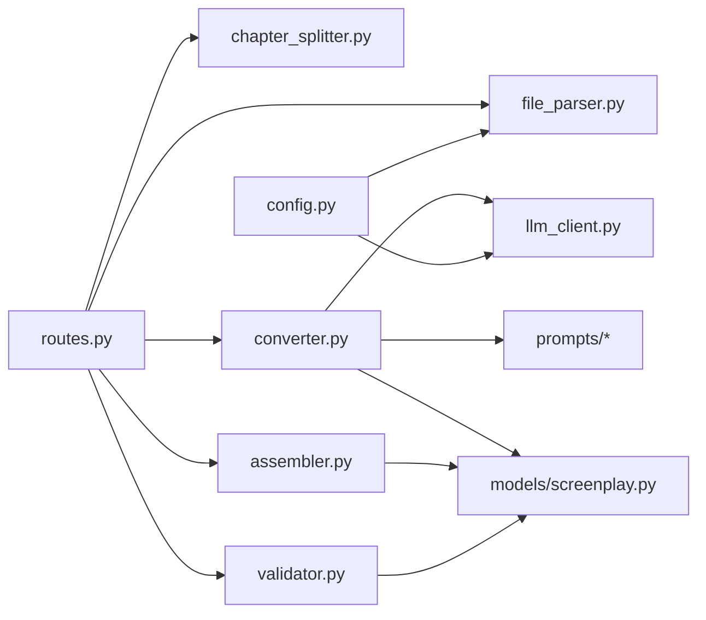

# 扩展开发指南

<cite>
**本文档引用的文件**
- [README.md](file://README.md)
- [pyproject.toml](file://pyproject.toml)
- [app/main.py](file://app/main.py)
- [app/config.py](file://app/config.py)
- [app/dependencies.py](file://app/dependencies.py)
- [app/api/routes.py](file://app/api/routes.py)
- [app/models/screenplay.py](file://app/models/screenplay.py)
- [app/models/enums.py](file://app/models/enums.py)
- [app/services/file_parser.py](file://app/services/file_parser.py)
- [app/services/chapter_splitter.py](file://app/services/chapter_splitter.py)
- [app/services/llm_client.py](file://app/services/llm_client.py)
- [app/services/converter.py](file://app/services/converter.py)
- [app/services/assembler.py](file://app/services/assembler.py)
- [app/services/validator.py](file://app/services/validator.py)
- [app/prompts/screenplay_conversion.py](file://app/prompts/screenplay_conversion.py)
</cite>

## 目录
1. [简介](#简介)
2. [项目结构](#项目结构)
3. [核心组件](#核心组件)
4. [架构总览](#架构总览)
5. [详细组件分析](#详细组件分析)
6. [依赖分析](#依赖分析)
7. [性能考量](#性能考量)
8. [故障排查指南](#故障排查指南)
9. [结论](#结论)
10. [附录](#附录)

## 简介
本指南面向希望扩展“小说转剧本”工具的开发者，涵盖以下主题：
- 新增文件格式支持与扩展现有解析器
- LLM 提示模板扩展与自定义提示设计原则
- 新增转换服务与扩展现有服务功能
- 插件架构扩展点与接口设计规范
- 第三方服务集成方法与最佳实践
- 配置系统扩展与新增配置项流程
- 新功能模块开发模板与示例路径
- 向后兼容性与迁移策略

## 项目结构
项目采用按职责分层的组织方式：API 路由层、业务服务层、模型层、提示模板层与静态资源层。核心处理管线为“上传 → 解析 → 章节切分 → 角色提取 → 逐章转换 → 组装 → 验证 → YAML 导出”。

图表来源
- [app/main.py:1-46](file://app/main.py#L1-L46)
- [app/dependencies.py:1-9](file://app/dependencies.py#L1-L9)
- [app/config.py:1-45](file://app/config.py#L1-L45)
- [app/api/routes.py:1-313](file://app/api/routes.py#L1-L313)
- [app/services/file_parser.py:1-187](file://app/services/file_parser.py#L1-L187)
- [app/services/chapter_splitter.py:1-163](file://app/services/chapter_splitter.py#L1-L163)
- [app/services/llm_client.py:1-103](file://app/services/llm_client.py#L1-L103)
- [app/services/converter.py:1-218](file://app/services/converter.py#L1-L218)
- [app/services/assembler.py:1-101](file://app/services/assembler.py#L1-L101)
- [app/services/validator.py:1-111](file://app/services/validator.py#L1-L111)
- [app/models/screenplay.py:1-167](file://app/models/screenplay.py#L1-L167)
- [app/models/enums.py:1-83](file://app/models/enums.py#L1-L83)
- [app/prompts/screenplay_conversion.py:1-91](file://app/prompts/screenplay_conversion.py#L1-L91)

章节来源
- [README.md:77-108](file://README.md#L77-L108)
- [pyproject.toml:1-47](file://pyproject.toml#L1-L47)

## 核心组件
- 配置系统：基于 pydantic-settings 的 Settings 类，集中管理 LLM 参数、上传限制与数据目录等。
- 文件解析器：统一入口函数负责根据扩展名选择具体解析器，并进行后处理与错误包装。
- 章节切分器：两阶段策略（正则 + 启发式），确保低质量文本也能被合理切分。
- LLM 客户端：异步 OpenAI 兼容客户端，支持结构化输出与指数退避重试。
- 转换器：章节级转换引擎，维护跨章节连续性上下文，支持降级回退。
- 组装器：全局编号重排、角色出场信息补全与首次出场标记设置。
- 验证器：对元数据、编号、角色引用与结构完整性进行校验。
- 提示模板：系统提示与用户提示模板，约束输出结构与风格。

章节来源
- [app/config.py:9-44](file://app/config.py#L9-L44)
- [app/services/file_parser.py:16-187](file://app/services/file_parser.py#L16-L187)
- [app/services/chapter_splitter.py:42-163](file://app/services/chapter_splitter.py#L42-L163)
- [app/services/llm_client.py:18-103](file://app/services/llm_client.py#L18-L103)
- [app/services/converter.py:16-218](file://app/services/converter.py#L16-L218)
- [app/services/assembler.py:18-101](file://app/services/assembler.py#L18-L101)
- [app/services/validator.py:11-111](file://app/services/validator.py#L11-L111)
- [app/prompts/screenplay_conversion.py:1-91](file://app/prompts/screenplay_conversion.py#L1-L91)

## 架构总览
下图展示从上传到导出的完整流水线，以及各组件间的调用关系与数据流。

图表来源
- [app/api/routes.py:114-313](file://app/api/routes.py#L114-L313)
- [app/services/file_parser.py:16-187](file://app/services/file_parser.py#L16-L187)
- [app/services/chapter_splitter.py:42-163](file://app/services/chapter_splitter.py#L42-L163)
- [app/services/converter.py:36-218](file://app/services/converter.py#L36-L218)
- [app/services/llm_client.py:33-103](file://app/services/llm_client.py#L33-L103)
- [app/services/assembler.py:18-101](file://app/services/assembler.py#L18-L101)
- [app/services/validator.py:11-111](file://app/services/validator.py#L11-L111)

## 详细组件分析

### 文件解析器扩展：新增文件格式支持
目标：在不破坏现有行为的前提下，支持新的输入格式（如 EPUB、RTF 等）。

扩展步骤
- 在统一入口函数中注册新格式映射与解析器
- 实现新格式解析器函数，遵循返回纯文本约定
- 添加后处理与异常包装，保持一致性
- 在文件类型检测函数中加入新扩展名映射
- 编写单元测试覆盖解析逻辑与边界情况

接口与契约
- 输入：文件路径与文件类型标识
- 输出：纯文本字符串
- 错误：抛出统一的解析错误类型

复杂度与性能
- 时间复杂度：取决于底层库实现；建议对大文件分块处理
- 异常处理：捕获底层异常并转换为统一错误类型

章节来源
- [app/services/file_parser.py:16-187](file://app/services/file_parser.py#L16-L187)

### LLM 提示模板扩展：自定义提示设计原则
目标：为不同适配需求定制提示模板，同时保持输出结构稳定。

设计原则
- 明确系统提示中的角色与约束，限定输出结构与风格
- 用户提示模板应包含上下文、输入与约束条件
- 对于结构化输出，使用 JSON Schema 约束与响应格式声明
- 控制 Token 预算，避免过长输入导致截断

扩展方法
- 新建提示模板模块，定义系统提示与用户模板
- 在转换服务中注入模板，必要时按章节动态拼接上下文
- 为不同场景（角色提取、章节转换、连续性摘要）分别设计模板

章节来源
- [app/prompts/screenplay_conversion.py:1-91](file://app/prompts/screenplay_conversion.py#L1-L91)
- [app/services/converter.py:58-84](file://app/services/converter.py#L58-L84)

### 转换服务扩展：逐章转换与连续性
目标：在保持跨章节一致性的前提下，增强转换能力（如多轮对话、场景细化）。

扩展点
- 上下文管理：在转换器中维护连续性摘要与场景计数
- 降级回退：当 LLM 返回异常时，生成最小可用结构
- 结果解析：将 LLM 输出映射到模型层的数据结构

流程图（章节转换主流程）

图表来源
- [app/services/converter.py:36-84](file://app/services/converter.py#L36-L84)
- [app/services/converter.py:100-184](file://app/services/converter.py#L100-L184)
- [app/services/converter.py:186-218](file://app/services/converter.py#L186-L218)

章节来源
- [app/services/converter.py:16-218](file://app/services/converter.py#L16-L218)

### 组装服务扩展：全局编号与角色出场
目标：在多章节转换后，统一编号、补全角色出场信息并标注首次出现。

扩展点
- 全局编号重排：确保 Act 与 Scene 的连续编号
- 角色出场补全：从对话元素中推断出场角色集合
- 首次出场标记：基于最早出现的场景设置角色首次出场

章节来源
- [app/services/assembler.py:18-101](file://app/services/assembler.py#L18-L101)

### 验证服务扩展：结构与引用校验
目标：在导出前进行结构完整性与引用一致性校验。

扩展点
- 元数据校验：必填字段检查
- 编号校验：Act/Scene 编号连续性
- 引用校验：对话与括注中的角色 ID 是否存在于角色目录
- 场景完整性：每个场景至少包含一个元素

章节来源
- [app/services/validator.py:11-111](file://app/services/validator.py#L11-L111)

### 章节切分器扩展：更精细的分段策略
目标：针对特定文本特征（如诗歌体、对话体）优化章节检测。

扩展点
- 增加正则模式：针对新格式的标题/分隔符
- 启发式策略：在正则不足时，按段落数量与字数分布进行均衡切分
- 边界处理：避免在标点或空白处截断

章节来源
- [app/services/chapter_splitter.py:16-163](file://app/services/chapter_splitter.py#L16-L163)

### LLM 客户端扩展：多模型与参数化
目标：支持不同 LLM 提供商或同一提供商的不同模型。

扩展点
- 配置参数：新增模型名称、基础 URL、温度、最大输出 Token 等
- 客户端抽象：将供应商差异封装在客户端内部
- 结构化输出：统一 JSON 响应解析与错误处理

章节来源
- [app/services/llm_client.py:18-103](file://app/services/llm_client.py#L18-L103)
- [app/config.py:18-31](file://app/config.py#L18-L31)

### API 路由扩展：后台任务与状态流
目标：为长耗时转换提供 SSE 状态流与后台任务管理。

扩展点
- 作业存储：以内存字典保存作业状态与中间结果
- 状态更新：按阶段更新进度百分比与当前章节
- SSE 推送：持续发送状态直至完成或错误

序列图（转换流程）

图表来源
- [app/api/routes.py:114-313](file://app/api/routes.py#L114-L313)

章节来源
- [app/api/routes.py:114-313](file://app/api/routes.py#L114-L313)

## 依赖分析
- 外部依赖：FastAPI、Jinja2、OpenAI SDK、pydantic、ruamel.yaml、pdfplumber、python-docx 等
- 内部耦合：API 路由依赖服务层；服务层依赖模型层与提示模板；转换器依赖 LLM 客户端与提示模板
- 配置耦合：配置类贯穿 LLM 客户端与文件解析器，作为单一可信源

图表来源
- [app/api/routes.py:15-24](file://app/api/routes.py#L15-L24)
- [app/services/converter.py:7-11](file://app/services/converter.py#L7-L11)
- [app/services/llm_client.py:11](file://app/services/llm_client.py#L11)
- [app/config.py:12-16](file://app/config.py#L12-L16)

章节来源
- [pyproject.toml:13-25](file://pyproject.toml#L13-L25)

## 性能考量
- LLM 调用：控制单次请求的 Token 预算，避免超限；对长章节进行截断保护
- IO 与并发：文件解析与 LLM 调用为 IO 密集；利用异步客户端与并发任务提升吞吐
- 内存占用：大文件解析与长文本处理需注意内存峰值；可采用分块读取与流式处理
- 缓存与重试：对 LLM 调用采用指数退避与有限重试，减少抖动

## 故障排查指南
常见问题与定位
- 文件解析失败：检查文件类型映射、编码与底层库安装
- LLM 调用异常：确认 API Key、基础 URL、模型名称与超时设置
- 转换失败降级：查看日志中降级回退路径，核对角色目录与章节内容
- 验证失败：关注角色引用缺失、编号不连续与场景空元素等警告

章节来源
- [app/services/file_parser.py:11-13](file://app/services/file_parser.py#L11-L13)
- [app/services/llm_client.py:80-86](file://app/services/llm_client.py#L80-L86)
- [app/services/converter.py:73-76](file://app/services/converter.py#L73-L76)
- [app/services/validator.py:84-99](file://app/services/validator.py#L84-L99)

## 结论
通过明确的扩展点与接口设计，本项目可在不破坏现有功能的前提下，平滑地增加新文件格式、增强提示模板、扩展转换服务与验证规则，并安全地接入第三方 LLM 服务。建议在每次扩展中严格遵循配置中心化、错误统一化与测试完备化的实践。

## 附录

### 插件架构扩展点与接口设计规范
- 扩展点
  - 文件解析器：在统一入口注册新格式映射与解析器
  - 提示模板：按功能域拆分模板模块，注入到转换器
  - LLM 客户端：抽象供应商差异，统一结构化输出解析
  - 验证器：按领域规则扩展校验逻辑，保持幂等与可组合
- 接口设计
  - 统一异常类型：便于上层捕获与降级
  - 结构化输出：通过 Pydantic 模型约束 LLM 输出
  - 配置中心化：所有外部依赖参数集中在配置类中

章节来源
- [app/services/file_parser.py:32-42](file://app/services/file_parser.py#L32-L42)
- [app/prompts/screenplay_conversion.py:1-91](file://app/prompts/screenplay_conversion.py#L1-L91)
- [app/services/llm_client.py:33-98](file://app/services/llm_client.py#L33-L98)
- [app/services/validator.py:11-111](file://app/services/validator.py#L11-L111)

### 第三方服务集成方法与最佳实践
- 集成步骤
  - 在配置中新增参数键，确保默认值与类型正确
  - 在客户端封装统一的请求/响应处理与错误映射
  - 在服务层注入客户端实例，按需传入模型/参数
- 最佳实践
  - 使用异步客户端与连接池
  - 对不稳定服务启用指数退避与熔断
  - 对结构化输出进行严格校验与回退策略

章节来源
- [app/config.py:18-31](file://app/config.py#L18-L31)
- [app/services/llm_client.py:18-103](file://app/services/llm_client.py#L18-L103)

### 配置系统扩展与新增配置项流程
- 新增配置项流程
  - 在配置类中添加字段与默认值
  - 在环境变量模板中补充说明
  - 在服务中通过配置读取并应用
- 注意事项
  - 保持向后兼容：为旧版本提供默认值
  - 类型安全：确保字段类型与默认值一致
  - 文档同步：更新 README 中的配置参数表

章节来源
- [app/config.py:9-44](file://app/config.py#L9-L44)
- [README.md:165-174](file://README.md#L165-L174)

### 新功能模块开发模板与示例路径
- 模块模板
  - 在 app/services/ 下新建模块文件，定义服务类/函数与异常类型
  - 在 app/api/routes.py 中注册路由与后台任务
  - 在 app/models/ 中补充必要的 Pydantic 模型
- 示例路径
  - 文件解析器扩展：[app/services/file_parser.py:16-187](file://app/services/file_parser.py#L16-L187)
  - 章节切分器扩展：[app/services/chapter_splitter.py:42-163](file://app/services/chapter_splitter.py#L42-L163)
  - LLM 客户端扩展：[app/services/llm_client.py:18-103](file://app/services/llm_client.py#L18-103)
  - 转换服务扩展：[app/services/converter.py:36-218](file://app/services/converter.py#L36-L218)
  - 组装服务扩展：[app/services/assembler.py:18-101](file://app/services/assembler.py#L18-101)
  - 验证服务扩展：[app/services/validator.py:11-111](file://app/services/validator.py#L11-111)
  - 提示模板扩展：[app/prompts/screenplay_conversion.py:1-91](file://app/prompts/screenplay_conversion.py#L1-L91)

章节来源
- [app/api/routes.py:15-24](file://app/api/routes.py#L15-L24)
- [app/models/screenplay.py:161-167](file://app/models/screenplay.py#L161-L167)

### 向后兼容性与迁移策略
- 字段演进
  - 新增非必填字段，保持默认值
  - 对于删除字段，保留读取但忽略，或提供迁移脚本
- API 版本
  - 通过路径版本或查询参数区分版本
  - 保持现有端点在一段时间内可用，标注废弃
- 配置迁移
  - 为旧配置项提供映射与默认值
  - 在启动时打印迁移提示与弃用警告

章节来源
- [app/models/screenplay.py:17-38](file://app/models/screenplay.py#L17-L38)
- [app/config.py:33-39](file://app/config.py#L33-L39)