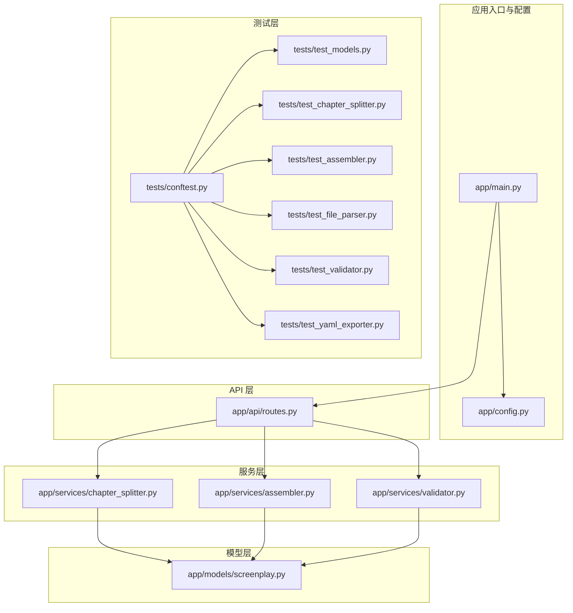
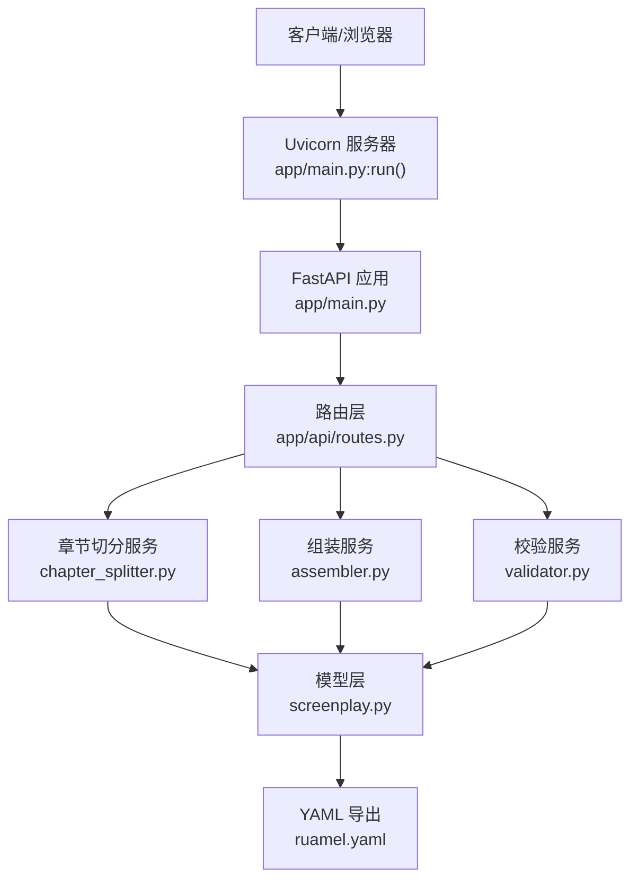
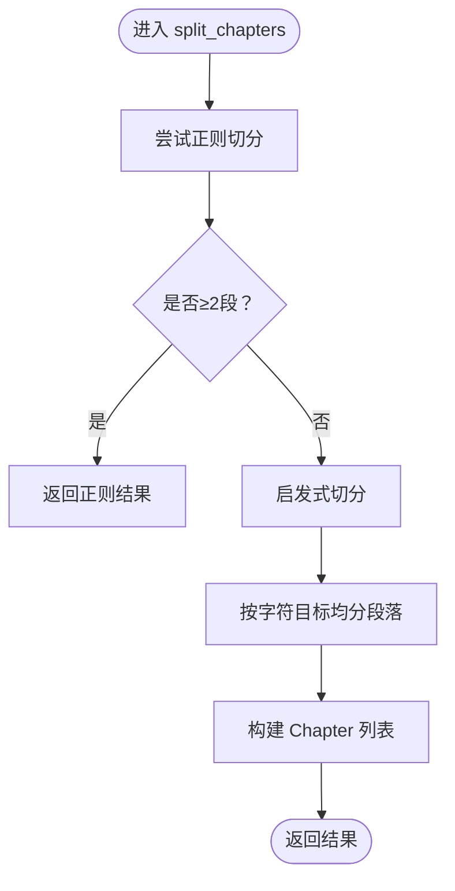
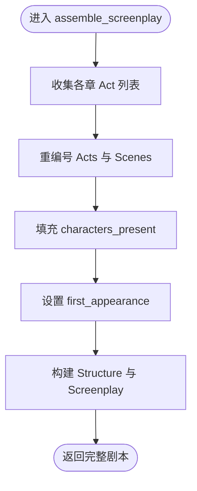
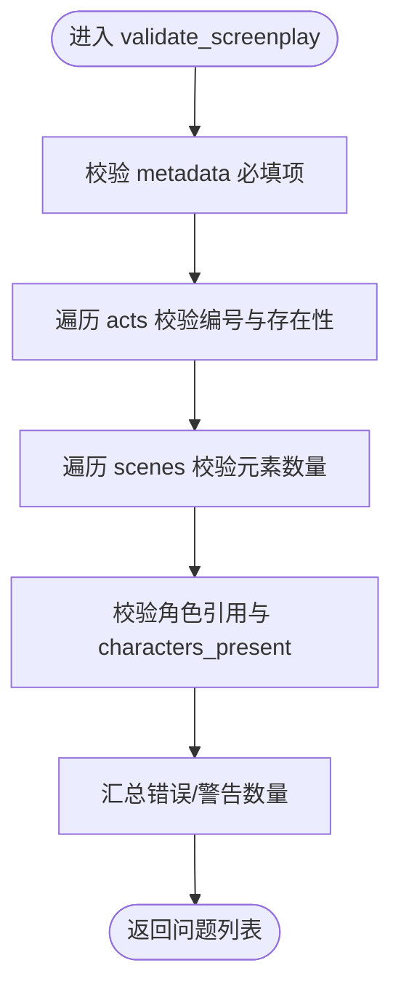
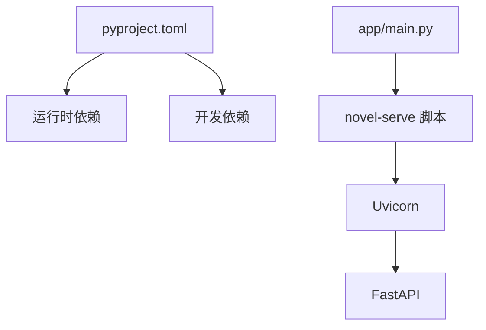

# 调试技巧与测试

<cite>
**本文档引用的文件**
- [app/main.py](file://app/main.py)
- [app/config.py](file://app/config.py)
- [app/services/chapter_splitter.py](file://app/services/chapter_splitter.py)
- [app/services/assembler.py](file://app/services/assembler.py)
- [app/services/validator.py](file://app/services/validator.py)
- [app/models/screenplay.py](file://app/models/screenplay.py)
- [tests/conftest.py](file://tests/conftest.py)
- [tests/test_models.py](file://tests/test_models.py)
- [tests/test_chapter_splitter.py](file://tests/test_chapter_splitter.py)
- [tests/test_assembler.py](file://tests/test_assembler.py)
- [tests/test_file_parser.py](file://tests/test_file_parser.py)
- [tests/test_validator.py](file://tests/test_validator.py)
- [tests/test_yaml_exporter.py](file://tests/test_yaml_exporter.py)
- [pyproject.toml](file://pyproject.toml)
- [README.md](file://README.md)
</cite>

## 目录
1. [简介](#简介)
2. [项目结构](#项目结构)
3. [核心组件](#核心组件)
4. [架构总览](#架构总览)
5. [详细组件分析](#详细组件分析)
6. [依赖分析](#依赖分析)
7. [性能考虑](#性能考虑)
8. [故障排查指南](#故障排查指南)
9. [结论](#结论)
10. [附录](#附录)

## 简介
本指南面向开发者与测试工程师，系统讲解如何在该小说转剧本工具中进行高效调试与测试。内容涵盖：
- 开发服务器调试方法、断点设置与变量检查
- pytest 测试框架使用、异步测试与测试用例编写规范
- 单元测试与集成测试设计原则、测试数据准备与夹具使用
- 性能调试工具与内存泄漏检测方法
- 日志系统使用与调试信息收集
- 常见问题的调试策略与故障排查流程
- 测试覆盖率分析与质量度量方法

## 项目结构
该项目采用“按功能域分层”的组织方式：应用入口、配置、API 路由、模型、服务与测试分别位于独立模块中；前端静态资源与模板位于 app/static 与 app/templates；测试集中在 tests 目录，并通过 conftest.py 提供共享夹具。

图表来源
- [app/main.py:1-46](file://app/main.py#L1-L46)
- [app/config.py:1-45](file://app/config.py#L1-L45)
- [app/models/screenplay.py:1-167](file://app/models/screenplay.py#L1-L167)
- [app/services/chapter_splitter.py:1-163](file://app/services/chapter_splitter.py#L1-L163)
- [app/services/assembler.py:1-101](file://app/services/assembler.py#L1-L101)
- [app/services/validator.py:1-111](file://app/services/validator.py#L1-L111)
- [tests/conftest.py:1-167](file://tests/conftest.py#L1-L167)
- [tests/test_models.py:1-124](file://tests/test_models.py#L1-L124)
- [tests/test_chapter_splitter.py:1-68](file://tests/test_chapter_splitter.py#L1-L68)
- [tests/test_assembler.py:1-111](file://tests/test_assembler.py#L1-L111)
- [tests/test_file_parser.py:1-102](file://tests/test_file_parser.py#L1-L102)
- [tests/test_validator.py:1-63](file://tests/test_validator.py#L1-L63)
- [tests/test_yaml_exporter.py:1-58](file://tests/test_yaml_exporter.py#L1-L58)

章节来源
- [README.md:77-108](file://README.md#L77-L108)

## 核心组件
- 应用入口与生命周期：通过 FastAPI 应用入口与 lifespan 管理运行时目录创建；提供命令行启动脚本 novel-serve。
- 配置管理：基于 pydantic-settings 的 Settings 类，集中管理 API Key、上传/输出目录、LLM 参数等。
- 服务层：
  - 章节切分：正则+启发式策略，支持中英罗马数字等多种章节标题模式。
  - 剧本组装：将各章转换结果合并为完整剧本，重编号、填充出场角色、设置首次出场。
  - 校验：结构完整性校验，包括必填项、角色引用一致性、编号连续性等。
- 模型层：以 Pydantic v2 定义 YAML Schema 的强类型模型，用于序列化、反序列化与 JSON Schema 生成。

章节来源
- [app/main.py:14-46](file://app/main.py#L14-L46)
- [app/config.py:9-44](file://app/config.py#L9-L44)
- [app/services/chapter_splitter.py:42-163](file://app/services/chapter_splitter.py#L42-L163)
- [app/services/assembler.py:18-101](file://app/services/assembler.py#L18-L101)
- [app/services/validator.py:11-111](file://app/services/validator.py#L11-L111)
- [app/models/screenplay.py:17-167](file://app/models/screenplay.py#L17-L167)

## 架构总览
下图展示从请求到处理再到输出的整体流程，以及关键组件之间的交互关系。

图表来源
- [app/main.py:42-46](file://app/main.py#L42-L46)
- [app/services/chapter_splitter.py:42-163](file://app/services/chapter_splitter.py#L42-L163)
- [app/services/assembler.py:18-101](file://app/services/assembler.py#L18-L101)
- [app/services/validator.py:11-111](file://app/services/validator.py#L11-L111)
- [app/models/screenplay.py:17-167](file://app/models/screenplay.py#L17-L167)

## 详细组件分析

### 章节切分服务调试要点
- 关键路径：split_chapters → _regex_split → _heuristic_split → _distribute_paragraphs
- 断点建议：
  - 在 _regex_split 中断点，观察匹配数量与标题提取是否正确
  - 在 _heuristic_split 中断点，检查段落数、目标分段数与字符分布
  - 在 _distribute_paragraphs 中断点，核对分段边界与字符偏移
- 变量检查：
  - 匹配对象集合长度与位置
  - 分段后每段内容长度与结尾是否干净（避免截断单词）
- 日志：关注 info 级别的分割统计信息，便于快速定位异常

图表来源
- [app/services/chapter_splitter.py:42-163](file://app/services/chapter_splitter.py#L42-L163)

章节来源
- [app/services/chapter_splitter.py:42-163](file://app/services/chapter_splitter.py#L42-L163)
- [tests/test_chapter_splitter.py:8-68](file://tests/test_chapter_splitter.py#L8-L68)

### 剧本组装服务调试要点
- 关键路径：assemble_screenplay → _renumber_acts_and_scenes → _populate_characters_present → _set_first_appearances
- 断点建议：
  - 在 _renumber_acts_and_scenes 断点，核对 acts 与 scenes 编号与 ID 是否连续
  - 在 _populate_characters_present 断点，检查 characters_present 是否来自对话元素且去重排序
  - 在 _set_first_appearances 断点，确认首次出场场景 ID 与角色映射
- 变量检查：
  - 全局场景计数器、act/scenes 的 number/id 更新
  - 字符 ID 集合与实际引用一致性
- 日志：关注全局编号与角色出场信息的记录

图表来源
- [app/services/assembler.py:18-101](file://app/services/assembler.py#L18-L101)

章节来源
- [app/services/assembler.py:18-101](file://app/services/assembler.py#L18-L101)
- [tests/test_assembler.py:49-111](file://tests/test_assembler.py#L49-L111)

### 校验服务调试要点
- 关键路径：validate_screenplay → 结构完整性检查 → 角色引用校验 → 编号连续性校验
- 断点建议：
  - 在 metadata 校验处断点，确保必填字段非空
  - 在 acts 校验处断点，检查 Act 数量与编号连续性
  - 在 scenes 校验处断点，检查元素数量与类型
  - 在角色引用处断点，核对 character_id 与 catalog 一致性
- 变量检查：
  - 角色 ID 集合 char_ids
  - 每个元素的 path 与 severity，便于定位问题范围
- 日志：根据错误/警告数量输出统计信息

图表来源
- [app/services/validator.py:11-111](file://app/services/validator.py#L11-L111)

章节来源
- [app/services/validator.py:11-111](file://app/services/validator.py#L11-L111)
- [tests/test_validator.py:19-63](file://tests/test_validator.py#L19-L63)

### 模型层调试要点
- 关键点：Pydantic 模型的字段约束、默认值与派生属性（如 created_at/modified_at）
- 断点建议：
  - 在创建 Metadata/Character/Scene 等模型实例时断点，检查默认值与派生字段
  - 在序列化/反序列化路径断点，验证 YAML 与 JSON Schema 的一致性
- 变量检查：
  - 字段类型与约束是否满足
  - Discriminated Union 的类型判别是否正确

章节来源
- [app/models/screenplay.py:17-167](file://app/models/screenplay.py#L17-L167)
- [tests/test_models.py:22-124](file://tests/test_models.py#L22-L124)

### 测试夹具与用例设计
- 共享夹具：通过 tests/conftest.py 提供 sample_novel_text、sample_chapters、sample_characters、sample_screenplay 等，统一测试数据来源
- 设计原则：
  - 单元测试：隔离被测函数/类，使用最小化输入与明确断言
  - 集成测试：覆盖服务间协作路径（如章节切分 → 组装 → 校验）
  - 异步测试：pytest-asyncio 已启用，注意标记与事件循环
- 测试数据准备：
  - 使用夹具构造典型场景与边界条件（如空标题、无场景、无效角色引用）
  - 使用临时文件与路径进行文件解析测试

章节来源
- [tests/conftest.py:23-167](file://tests/conftest.py#L23-L167)
- [tests/test_file_parser.py:14-102](file://tests/test_file_parser.py#L14-L102)
- [pyproject.toml:37-42](file://pyproject.toml#L37-L42)

## 依赖分析
- 运行时依赖：FastAPI、Uvicorn、Jinja2、HTTPX、OpenAI SDK、Pydantic v2、ruamel.yaml、pdfplumber、python-docx
- 开发依赖：pytest、pytest-asyncio、ruff
- 启动脚本：novel-serve 指向 app.main:run

图表来源
- [pyproject.toml:13-32](file://pyproject.toml#L13-L32)
- [pyproject.toml:34-35](file://pyproject.toml#L34-L35)
- [app/main.py:42-46](file://app/main.py#L42-L46)

章节来源
- [pyproject.toml:13-32](file://pyproject.toml#L13-L32)
- [pyproject.toml:34-35](file://pyproject.toml#L34-L35)
- [app/main.py:42-46](file://app/main.py#L42-L46)

## 性能考虑
- 服务器启动与热重载：开发环境使用 reload=True，便于快速迭代；生产环境应关闭热重载并使用进程/线程池优化
- LLM 调用成本控制：通过配置 max_tokens_per_chunk、max_output_tokens、temperature 等参数限制预算
- 文本处理开销：章节切分与词数统计在长文本上可能成为瓶颈，建议：
  - 对超长章节进行场景断点子切分
  - 使用缓存与惰性计算减少重复工作
- 内存泄漏检测：
  - 使用 tracemalloc 或 memory_profiler 监控请求生命周期内的对象增长
  - 关注大型中间结果（如章节列表、转换结果）的及时释放
- 日志采样：在高频路径上降低日志级别或采样，避免 I/O 成为瓶颈

## 故障排查指南
- 服务器无法启动
  - 检查端口占用与主机绑定（默认 0.0.0.0:8008）
  - 确认 .env 配置与 API Key 设置
- 转换失败或结果为空
  - 核查文件类型检测与文本提取是否成功
  - 检查章节切分是否产生足够段落
  - 使用校验服务输出的问题列表定位具体字段
- 角色引用错误
  - 确保 characters_present 与角色目录一致
  - 检查 first_appearance 设置逻辑
- YAML 导出异常
  - 校验导出字符串可被 ruamel.yaml 解析
  - 确认 Unicode 与注释头信息保留

章节来源
- [app/main.py:42-46](file://app/main.py#L42-L46)
- [app/config.py:18-31](file://app/config.py#L18-L31)
- [app/services/validator.py:11-111](file://app/services/validator.py#L11-L111)
- [tests/test_yaml_exporter.py:10-58](file://tests/test_yaml_exporter.py#L10-L58)

## 结论
本项目提供了完善的测试体系与清晰的服务分层，结合 pytest 夹具与日志系统，能够高效地进行调试与质量保障。建议在开发过程中坚持“先单元后集成”的测试策略，配合覆盖率与静态检查工具，持续提升代码质量与稳定性。

## 附录

### 调试与测试最佳实践
- 断点设置
  - 在关键分支与循环处设置断点，优先验证输入与输出边界
  - 对异步函数使用 asyncio.run 或 pytest-asyncio 标记
- 变量检查
  - 使用 IDE 的变量监视面板或 print 调试，聚焦于模型字段与集合状态
  - 对复杂数据结构（如 acts/scenes/elements）打印层级结构
- 日志使用
  - 在服务入口与关键步骤记录 info/warning/error，便于快速定位
  - 使用结构化日志字段（如 path、severity）统一格式
- 测试覆盖率
  - 使用 pytest-cov 收集覆盖率报告，重点关注未覆盖的分支与异常路径
  - 对核心服务（章节切分、组装、校验）设定覆盖率阈值
- 质量度量
  - 结合 ruff 的静态检查与 pytest 的单元/集成测试，形成闭环
  - 对 LLM 相关逻辑增加“近似正确性”测试（如输出结构符合预期）

章节来源
- [tests/conftest.py:23-167](file://tests/conftest.py#L23-L167)
- [pyproject.toml:37-42](file://pyproject.toml#L37-L42)
- [README.md:152-163](file://README.md#L152-L163)