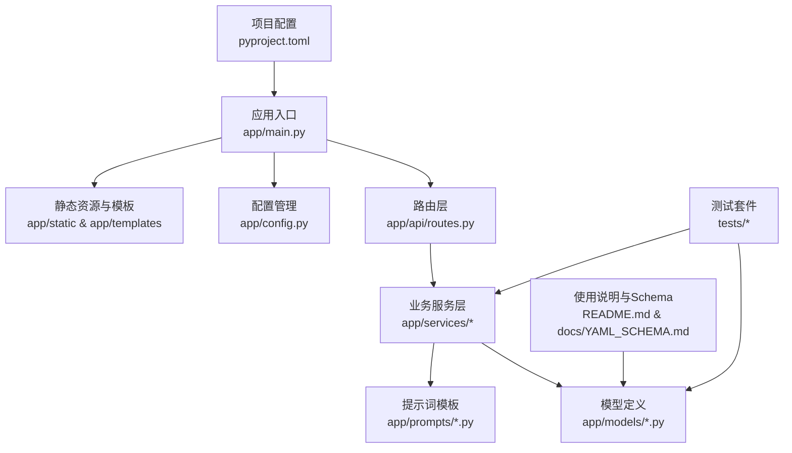
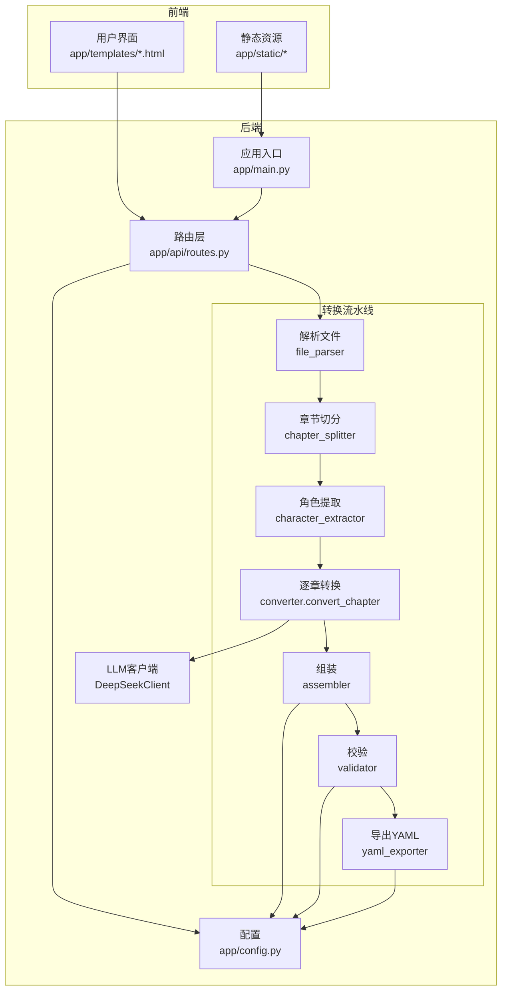
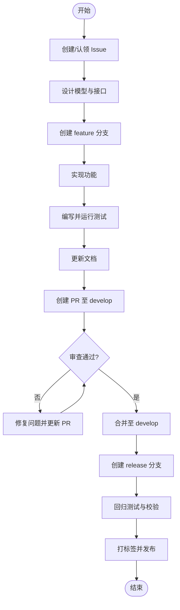
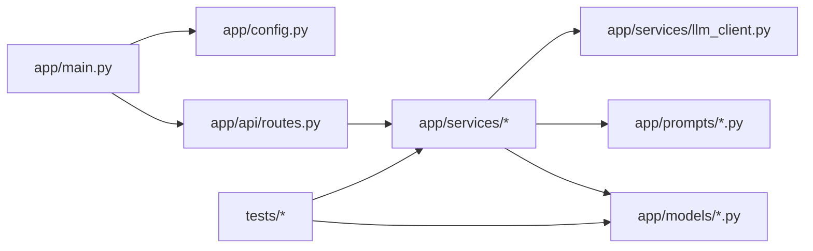
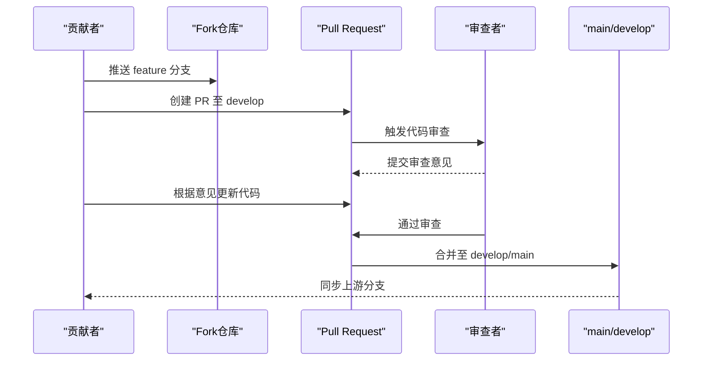

# 贡献流程与协作

<cite>
**本文档引用的文件**
- [README.md](file://README.md)
- [pyproject.toml](file://pyproject.toml)
- [app/main.py](file://app/main.py)
- [app/config.py](file://app/config.py)
- [app/api/routes.py](file://app/api/routes.py)
- [app/models/screenplay.py](file://app/models/screenplay.py)
- [app/models/enums.py](file://app/models/enums.py)
- [app/services/converter.py](file://app/services/converter.py)
- [app/services/llm_client.py](file://app/services/llm_client.py)
- [app/prompts/screenplay_conversion.py](file://app/prompts/screenplay_conversion.py)
- [docs/YAML_SCHEMA.md](file://docs/YAML_SCHEMA.md)
- [tests/conftest.py](file://tests/conftest.py)
- [tests/test_models.py](file://tests/test_models.py)
- [tests/test_validator.py](file://tests/test_validator.py)
</cite>

## 目录
1. [简介](#简介)
2. [项目结构](#项目结构)
3. [核心组件](#核心组件)
4. [架构总览](#架构总览)
5. [详细组件分析](#详细组件分析)
6. [依赖分析](#依赖分析)
7. [性能考量](#性能考量)
8. [故障排查指南](#故障排查指南)
9. [结论](#结论)
10. [附录](#附录)

## 简介
本指南面向希望参与“小说转剧本”项目的贡献者，系统阐述贡献流程与协作规范，覆盖以下方面：
- Git 工作流与分支管理策略（main、develop、feature 分支）
- Pull Request 创建与审查流程、代码审查标准与反馈处理
- Issue 提交规范、Bug 报告模板、功能请求流程
- 社区行为准则与沟通渠道
- 新功能开发的完整流程（从需求分析到代码实现、测试与文档更新）
- 版本发布流程与变更日志维护
- 许可证要求与法律考虑事项

本项目当前未内置正式的贡献指南与分支策略说明，因此本文件基于现有代码结构与技术栈，结合通用最佳实践制定统一的协作规范。

## 项目结构
项目采用模块化组织方式，前端静态资源与模板位于 app/static 与 app/templates，后端服务以 FastAPI 应用入口 app/main.py 为中心，围绕 API 路由、业务服务、模型与提示词构建。

图表来源
- [app/main.py:1-46](file://app/main.py#L1-L46)
- [app/api/routes.py:1-313](file://app/api/routes.py#L1-L313)
- [app/config.py:1-45](file://app/config.py#L1-L45)
- [pyproject.toml:1-47](file://pyproject.toml#L1-L47)
- [README.md:1-178](file://README.md#L1-L178)
- [docs/YAML_SCHEMA.md:1-496](file://docs/YAML_SCHEMA.md#L1-L496)

章节来源
- [README.md:70-108](file://README.md#L70-L108)
- [pyproject.toml:1-47](file://pyproject.toml#L1-L47)

## 核心组件
- 应用入口与生命周期：负责启动 FastAPI 应用、挂载静态资源、注册路由与中间件，并在启动时确保运行目录存在。
- 配置管理：集中读取 .env 与环境变量，提供 LLM 与应用参数默认值。
- API 路由：提供文件上传、转换任务启动、状态查询（SSE/JSON）、结果下载与校验等接口；内部以后台任务执行完整转换流水线。
- 业务服务：包含章节切分、角色提取、逐章转换、剧本组装、校验与 YAML 导出等模块；转换过程通过异步 LLM 客户端完成。
- 模型与枚举：基于 Pydantic 的屏幕剧 YAML Schema 模型与枚举类型，用于数据结构定义、序列化与校验。
- 提示词模板：定义系统提示与用户提示模板，约束 LLM 输出结构与风格。
- 测试：包含模型与校验逻辑的单元测试与共享夹具，保障数据结构与业务规则正确性。

章节来源
- [app/main.py:14-46](file://app/main.py#L14-L46)
- [app/config.py:9-45](file://app/config.py#L9-L45)
- [app/api/routes.py:68-313](file://app/api/routes.py#L68-L313)
- [app/models/screenplay.py:17-167](file://app/models/screenplay.py#L17-L167)
- [app/models/enums.py:6-83](file://app/models/enums.py#L6-L83)
- [app/services/converter.py:36-218](file://app/services/converter.py#L36-L218)
- [app/services/llm_client.py:18-103](file://app/services/llm_client.py#L18-L103)
- [app/prompts/screenplay_conversion.py:1-91](file://app/prompts/screenplay_conversion.py#L1-L91)
- [tests/conftest.py:23-167](file://tests/conftest.py#L23-L167)
- [tests/test_models.py:22-124](file://tests/test_models.py#L22-L124)
- [tests/test_validator.py:19-63](file://tests/test_validator.py#L19-L63)

## 架构总览
下图展示从前端交互到后端转换流水线的整体架构与数据流：

图表来源
- [app/main.py:23-46](file://app/main.py#L23-L46)
- [app/api/routes.py:208-313](file://app/api/routes.py#L208-L313)
- [app/services/converter.py:36-84](file://app/services/converter.py#L36-L84)
- [app/services/llm_client.py:18-103](file://app/services/llm_client.py#L18-L103)
- [app/config.py:9-45](file://app/config.py#L9-L45)

## 详细组件分析

### Git 工作流与分支管理策略
- 分支命名
  - develop：开发主分支，保持最新可合并状态，作为后续 release/feature 合并的目标。
  - feature/<issue或主题>：用于新功能开发，建议与 Issue 编号关联，便于追踪。
  - release/<版本号>：用于发布准备与预发布修复。
  - hotfix/<问题描述>：紧急修复分支，修复后同时合并回 develop 与 main。
- 合并策略
  - feature 分支通过 Pull Request 合并至 develop，需至少一名维护者批准。
  - release 分支通过 Pull Request 合并至 main 与 develop，合并后打标签并发布。
- 提交信息
  - 使用动宾短语，如 feat: 添加角色提取功能；fix: 修复章节切分边界；docs: 更新使用说明。
  - 在提交信息中引用相关 Issue 编号，如 feat: 支持 DOCX 解析 (#123)。

章节来源
- [README.md:175-178](file://README.md#L175-L178)

### Pull Request 创建与审查流程
- PR 模板
  - 标题：简述变更类型与目标（如 feat: 新增 DOCX 支持）。
  - 描述：背景、动机、改动范围、影响评估、兼容性说明。
  - checklist：
    - 是否新增/修改了模型或服务？
    - 是否补充了单元测试与集成测试？
    - 是否更新了文档（README、YAML Schema）？
    - 是否检查了代码风格与性能？
- 审查标准
  - 正确性：通过所有测试，覆盖关键路径与边界条件。
  - 可读性：函数/类命名清晰，注释充分，避免重复逻辑。
  - 性能：避免不必要的 IO 与计算，合理使用缓存与并发。
  - 安全性：输入校验、异常处理、敏感信息脱敏。
- 反馈处理
  - 修改后重新推送，避免 squash 合并覆盖评论上下文。
  - 对于反复出现的问题，建立团队知识库或代码规范链接。

章节来源
- [tests/test_models.py:22-124](file://tests/test_models.py#L22-L124)
- [tests/test_validator.py:19-63](file://tests/test_validator.py#L19-L63)
- [pyproject.toml:37-47](file://pyproject.toml#L37-L47)

### Issue 提交规范、Bug 报告模板与功能请求流程
- Bug 报告模板
  - 标题：简洁描述问题
  - 环境：操作系统、Python 版本、依赖版本
  - 复现步骤：最小可复现实例
  - 预期行为：期望输出/行为
  - 实际行为：实际输出/错误
  - 日志与截图：必要时附上
- 功能请求流程
  - 在创建 Issue 前先搜索是否已有类似请求
  - 描述使用场景、收益与可能的实现方案
  - 维护者评估后分配优先级与里程碑

章节来源
- [app/api/routes.py:68-112](file://app/api/routes.py#L68-L112)
- [app/services/converter.py:36-84](file://app/services/converter.py#L36-L84)

### 社区行为准则与沟通渠道
- 行为准则
  - 尊重与包容：禁止骚扰、歧视与人身攻击
  - 建设性反馈：聚焦问题与改进，避免情绪化表达
  - 开放协作：共享知识，欢迎新手提问
- 沟通渠道
  - GitHub Issues：Bug 报告与功能请求
  - Discussions：设计讨论与使用咨询
  - 代码评审：通过 PR 进行同行评议

章节来源
- [README.md:175-178](file://README.md#L175-L178)

### 新功能开发完整流程（从需求到发布）
- 需求分析
  - 在 Issue 中明确目标、验收标准与风险评估
  - 设计数据模型与 API 接口（如涉及）
- 设计与建模
  - 在 app/models 下新增或扩展 Pydantic 模型
  - 在 app/prompts 下补充/调整提示词模板
- 实现
  - 在 app/services 下新增服务模块或扩展现有模块
  - 在 app/api/routes.py 中添加/修改路由与状态管理
- 测试
  - 在 tests/ 下编写单元测试与集成测试
  - 使用共享夹具（tests/conftest.py）构造测试数据
- 文档更新
  - 更新 README.md 的使用说明与技术栈
  - 更新 docs/YAML_SCHEMA.md（如涉及 Schema 变更）
- 提交与评审
  - 创建 feature 分支并提交 PR 至 develop
  - 修复审查意见并更新 PR
- 发布
  - 在 release 分支进行回归测试与最终校验
  - 合并至 main 并打标签发布

图表来源
- [app/models/screenplay.py:17-167](file://app/models/screenplay.py#L17-L167)
- [app/prompts/screenplay_conversion.py:1-91](file://app/prompts/screenplay_conversion.py#L1-L91)
- [app/api/routes.py:208-313](file://app/api/routes.py#L208-L313)
- [tests/conftest.py:23-167](file://tests/conftest.py#L23-L167)
- [tests/test_models.py:22-124](file://tests/test_models.py#L22-L124)
- [tests/test_validator.py:19-63](file://tests/test_validator.py#L19-L63)

### 版本发布流程与变更日志维护
- 版本号
  - 采用语义化版本（主.次.修订），遵循向后兼容原则
- 发布流程
  - 在 release 分支进行最终测试与文档校对
  - 合并至 main 与 develop，打标签并发布
- 变更日志
  - 记录新增功能、修复缺陷、破坏性变更与迁移指南
  - 与 README.md 的许可证声明保持一致

章节来源
- [README.md:175-178](file://README.md#L175-L178)

### 许可证要求与法律考虑事项
- 许可证
  - 项目采用 MIT 许可证，允许自由使用、复制、修改与再发布，需保留版权与许可声明
- 法律合规
  - 第三方依赖遵守各自许可证（如 MIT、BSD、Apache 等）
  - LLM API 使用需遵循服务提供商的使用条款与配额限制
  - 用户上传文件的处理应遵循隐私与数据保护法规

章节来源
- [README.md:175-178](file://README.md#L175-L178)
- [pyproject.toml:13-25](file://pyproject.toml#L13-L25)

## 依赖分析
- 内部依赖
  - app/main.py 依赖 app/api/routes.py、app/config.py 与 app/dependencies
  - app/api/routes.py 依赖 app/services/* 与 app/models/*
  - app/services/converter.py 依赖 app/prompts/* 与 app/services/llm_client.py
- 外部依赖
  - FastAPI、Uvicorn、Jinja2、Pydantic、ruamel.yaml、httpx 等
  - 测试与质量工具：pytest、pytest-asyncio、ruff

图表来源
- [app/main.py:9-11](file://app/main.py#L9-L11)
- [app/api/routes.py:15-24](file://app/api/routes.py#L15-L24)
- [app/services/converter.py:7-11](file://app/services/converter.py#L7-L11)
- [app/services/llm_client.py:8-11](file://app/services/llm_client.py#L8-L11)
- [tests/conftest.py:6-17](file://tests/conftest.py#L6-L17)

章节来源
- [pyproject.toml:13-32](file://pyproject.toml#L13-L32)

## 性能考量
- LLM 调用
  - 控制单次调用的 token 预算，避免超限；对长章节进行截断与摘要传递
  - 使用指数退避与最大重试次数，提升稳定性
- 并发与异步
  - 转换流水线采用异步执行，减少阻塞
  - SSE 状态推送按需轮询，避免过度刷新
- 存储与缓存
  - 上传与输出目录在启动时初始化，避免运行时 IO 错误
  - 对于频繁使用的配置与模型实例，使用缓存装饰器

章节来源
- [app/services/converter.py:53-57](file://app/services/converter.py#L53-L57)
- [app/services/converter.py:186-218](file://app/services/converter.py#L186-L218)
- [app/services/llm_client.py:71-86](file://app/services/llm_client.py#L71-L86)
- [app/main.py:14-20](file://app/main.py#L14-L20)
- [app/api/routes.py:131-158](file://app/api/routes.py#L131-L158)

## 故障排查指南
- 常见问题
  - 文件过大：检查 MAX_UPLOAD_SIZE_MB 配置，避免超过限制
  - LLM 调用失败：确认 DEEPSEEK_API_KEY 与 DEEPSEEK_BASE_URL，查看重试日志
  - 转换结果为空：检查章节切分与角色提取是否成功，查看转换上下文
  - 校验失败：根据验证器返回的 issues 逐项修正
- 调试建议
  - 使用测试夹具构造最小可复现实例
  - 打开应用日志，定位异常发生阶段
  - 对比 YAML Schema 示例，核对字段与枚举值

章节来源
- [app/config.py:24-31](file://app/config.py#L24-L31)
- [app/api/routes.py:82-83](file://app/api/routes.py#L82-L83)
- [app/services/llm_client.py:80-86](file://app/services/llm_client.py#L80-L86)
- [tests/conftest.py:23-167](file://tests/conftest.py#L23-L167)
- [tests/test_validator.py:19-63](file://tests/test_validator.py#L19-L63)

## 结论
本指南为“小说转剧本”项目提供了统一的贡献流程与协作规范，涵盖从分支策略、PR 审查到 Issue 管理、测试与发布的全流程。建议团队在实践中持续优化流程与工具链，确保高质量交付与可持续发展。

## 附录
- 关键流程时序图（PR 审查与合并）

图表来源
- [app/api/routes.py:208-313](file://app/api/routes.py#L208-L313)