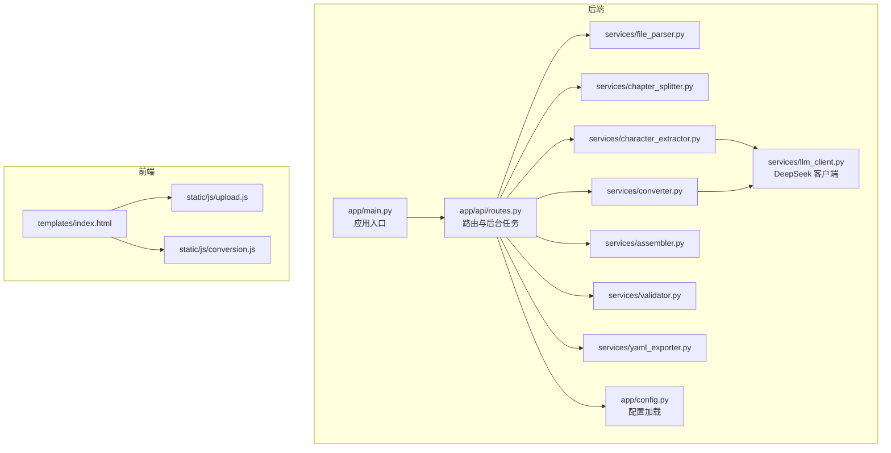
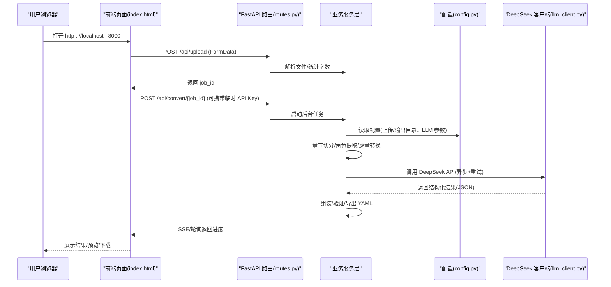
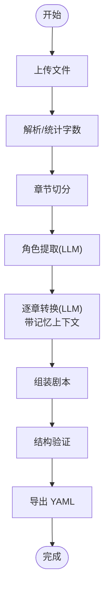
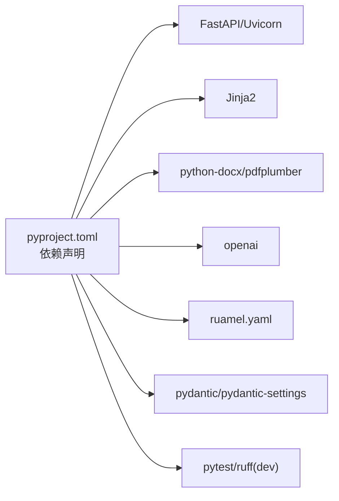

# 快速开始

<cite>
**本文引用的文件**
- [README.md](file://README.md)
- [pyproject.toml](file://pyproject.toml)
- [app/main.py](file://app/main.py)
- [app/config.py](file://app/config.py)
- [app/api/routes.py](file://app/api/routes.py)
- [app/services/llm_client.py](file://app/services/llm_client.py)
- [app/models/screenplay.py](file://app/models/screenplay.py)
- [app/templates/index.html](file://app/templates/index.html)
- [app/static/js/upload.js](file://app/static/js/upload.js)
- [app/static/js/conversion.js](file://app/static/js/conversion.js)
- [docs/YAML_SCHEMA.md](file://docs/YAML_SCHEMA.md)
</cite>

## 目录
1. [简介](#简介)
2. [项目结构](#项目结构)
3. [核心组件](#核心组件)
4. [架构总览](#架构总览)
5. [详细组件分析](#详细组件分析)
6. [依赖分析](#依赖分析)
7. [性能考虑](#性能考虑)
8. [故障排查指南](#故障排查指南)
9. [结论](#结论)
10. [附录](#附录)

## 简介
本指南面向首次使用者，帮助你在最短时间内完成环境准备、安装、配置与启动，并体验从文件上传到结果下载的完整流程。项目基于 FastAPI 提供 Web 服务，前端通过拖拽上传、实时进度展示与 YAML 下载实现端到端体验；后端通过 DeepSeek API（OpenAI 兼容接口）进行智能转换，最终输出结构化的 YAML 剧本。

## 项目结构
- 后端应用入口与路由：app/main.py、app/api/routes.py
- 配置管理：app/config.py（基于 pydantic-settings 加载 .env）
- 核心业务：app/services/*（文件解析、章节切分、角色提取、转换、组装、验证、导出）
- 前端模板与静态资源：app/templates/*、app/static/*
- YAML Schema 文档：docs/YAML_SCHEMA.md
- 项目元信息与依赖：pyproject.toml

图表来源
- [app/main.py:1-46](file://app/main.py#L1-L46)
- [app/api/routes.py:1-313](file://app/api/routes.py#L1-L313)
- [app/config.py:1-45](file://app/config.py#L1-L45)
- [app/services/llm_client.py:1-103](file://app/services/llm_client.py#L1-L103)
- [app/templates/index.html:1-140](file://app/templates/index.html#L1-L140)
- [app/static/js/upload.js:1-131](file://app/static/js/upload.js#L1-L131)
- [app/static/js/conversion.js:1-130](file://app/static/js/conversion.js#L1-L130)

章节来源
- [README.md:77-108](file://README.md#L77-L108)

## 核心组件
- 应用入口与生命周期：在启动时确保上传与输出目录存在，挂载静态资源与路由。
- 配置系统：从 .env 与环境变量读取 DeepSeek API Key、基础 URL、模型、上传大小限制、数据目录等。
- 转换流水线：上传 → 解析 → 章节切分 → 角色提取 → 逐章转换（带记忆上下文）→ 组装 → 验证 → YAML 导出。
- 前端交互：拖拽上传、进度轮询、错误提示、结果预览与下载。

章节来源
- [app/main.py:14-46](file://app/main.py#L14-L46)
- [app/config.py:9-45](file://app/config.py#L9-L45)
- [app/api/routes.py:208-313](file://app/api/routes.py#L208-L313)
- [app/templates/index.html:1-140](file://app/templates/index.html#L1-L140)

## 架构总览
下图展示了从浏览器到后端服务再到 LLM 的调用链路与数据流。

图表来源
- [app/api/routes.py:68-129](file://app/api/routes.py#L68-L129)
- [app/api/routes.py:131-199](file://app/api/routes.py#L131-L199)
- [app/api/routes.py:208-313](file://app/api/routes.py#L208-L313)
- [app/services/llm_client.py:18-103](file://app/services/llm_client.py#L18-L103)
- [app/config.py:9-45](file://app/config.py#L9-L45)

## 详细组件分析

### 环境与安装
- Python 版本要求：>= 3.10
- 安装方式：创建虚拟环境并安装项目及其开发依赖
- 启动方式：使用 uvicorn 运行应用，监听本地 8000 端口

命令示例（来自仓库说明）：
- 创建虚拟环境并激活
- 安装项目（包含开发依赖）
- 复制环境变量模板并填写 API Key
- 启动服务并在浏览器访问

章节来源
- [README.md:30-68](file://README.md#L30-L68)
- [pyproject.toml:12-32](file://pyproject.toml#L12-L32)

### 配置与环境变量
- 关键配置项
  - DEEPSEEK_API_KEY：必填，DeepSeek API 密钥
  - DEEPSEEK_BASE_URL：默认 https://api.deepseek.com
  - DEEPSEEK_MODEL：默认 deepseek-chat
  - MAX_UPLOAD_SIZE_MB：默认 50MB
  - DATA_DIR：默认 ./data
- 配置加载机制：使用 pydantic-settings 从 .env 与环境变量加载

章节来源
- [README.md:165-174](file://README.md#L165-L174)
- [app/config.py:9-45](file://app/config.py#L9-L45)

### 启动流程
- 应用入口：注册中间件、挂载静态资源、注册路由
- 生命周期：启动时创建上传与输出目录
- 启动命令：uvicorn 运行 app.main:app，端口 8000，启用热更新

章节来源
- [app/main.py:14-46](file://app/main.py#L14-L46)

### 转换流水线与后台任务
- 前台：上传文件、触发转换、轮询进度
- 后台：解析 → 章节切分 → 角色提取 → 逐章转换（带记忆上下文）→ 组装 → 验证 → YAML 导出
- LLM 客户端：异步调用 DeepSeek API，支持 JSON 响应格式与重试

图表来源
- [app/api/routes.py:208-313](file://app/api/routes.py#L208-L313)
- [app/services/llm_client.py:18-103](file://app/services/llm_client.py#L18-L103)

章节来源
- [app/api/routes.py:208-313](file://app/api/routes.py#L208-L313)

### 前端交互与进度展示
- 拖拽上传与文件选择
- 显示文件信息、隐藏/移除文件
- 输入 API Key（可切换明文/密码）
- 开始转换后轮询进度，展示阶段、百分比与章节信息
- 成功后提供预览与下载链接，并显示验证摘要

章节来源
- [app/templates/index.html:1-140](file://app/templates/index.html#L1-L140)
- [app/static/js/upload.js:1-131](file://app/static/js/upload.js#L1-L131)
- [app/static/js/conversion.js:1-130](file://app/static/js/conversion.js#L1-L130)

### YAML Schema 概览
- 顶层结构：metadata、characters、structure、notes
- 结构层次：acts → scenes → elements（动作、对白、括号、转场、备注）
- 设计原则：可往返、LLM 友好、人类可编辑
- 详细字段与枚举参考：docs/YAML_SCHEMA.md

章节来源
- [docs/YAML_SCHEMA.md:25-33](file://docs/YAML_SCHEMA.md#L25-L33)
- [docs/YAML_SCHEMA.md:318-327](file://docs/YAML_SCHEMA.md#L318-L327)
- [app/models/screenplay.py:161-167](file://app/models/screenplay.py#L161-L167)

## 依赖分析
- 后端框架：FastAPI、Uvicorn
- 模板与静态资源：Jinja2、静态文件挂载
- 文件解析：python-docx、pdfplumber
- LLM 客户端：openai（AsyncOpenAI）
- 数据模型与验证：pydantic v2、pydantic-settings
- YAML 导出：ruamel.yaml
- 开发工具：pytest、pytest-asyncio、ruff

图表来源
- [pyproject.toml:12-32](file://pyproject.toml#L12-L32)

章节来源
- [pyproject.toml:12-32](file://pyproject.toml#L12-L32)

## 性能考虑
- 上传大小限制：默认 50MB，避免过大数据导致内存压力
- LLM 调用：异步+指数退避重试，减少失败重试成本
- Token 预算：章节文本与输出 JSON 控制在合理范围，超长章节自动子切分
- 进度轮询：前端采用轮询替代 SSE，兼容性更好，建议根据网络状况调整轮询间隔

章节来源
- [app/config.py:24-31](file://app/config.py#L24-L31)
- [app/api/routes.py:131-199](file://app/api/routes.py#L131-L199)
- [app/services/llm_client.py:70-86](file://app/services/llm_client.py#L70-L86)

## 故障排查指南
- 无法启动服务
  - 确认已创建并激活虚拟环境
  - 确认已安装项目依赖（含 dev 依赖）
  - 确认端口 8000 未被占用
- 上传失败或文件过大
  - 检查文件类型是否为 TXT/MD/DOCX/PDF
  - 检查 MAX_UPLOAD_SIZE_MB 设置
- LLM 调用失败
  - 检查 DEEPSEEK_API_KEY 是否正确
  - 检查 DEEPSEEK_BASE_URL 与网络连通性
  - 查看后端日志中的异常堆栈
- 转换进度停滞
  - 前端采用轮询，若网络不稳定可刷新页面重试
  - 等待后台任务完成，查看错误信息并重试
- 无法下载 YAML
  - 确认转换已完成且状态为“完成”
  - 检查 DATA_DIR 下是否存在对应 job_id.yaml 文件

章节来源
- [README.md:152-163](file://README.md#L152-L163)
- [app/api/routes.py:68-129](file://app/api/routes.py#L68-L129)
- [app/api/routes.py:168-199](file://app/api/routes.py#L168-L199)
- [app/config.py:24-25](file://app/config.py#L24-L25)

## 结论
通过本快速开始指南，你可以在本地完成环境准备、安装与启动，并使用 Web 界面完成从文件上传到 YAML 下载的全流程体验。如需进一步定制（如更换模型、调整上传大小、扩展前端交互），可参考配置与源码实现。

## 附录

### 使用流程（从上传到下载）
1. 打开浏览器访问 http://localhost:8000
2. 在首页拖拽或点击选择 TXT/MD/DOCX/PDF 文件
3. 输入 DeepSeek API Key（可临时输入，仅本次会话有效）
4. 点击“开始转换”，页面显示实时进度
5. 转换完成后，点击“预览 YAML”查看语法高亮结果，或点击“下载 YAML”保存文件

章节来源
- [README.md:70-76](file://README.md#L70-L76)
- [app/templates/index.html:1-140](file://app/templates/index.html#L1-L140)
- [app/static/js/upload.js:81-129](file://app/static/js/upload.js#L81-L129)
- [app/static/js/conversion.js:30-71](file://app/static/js/conversion.js#L30-L71)

### 配置文件模板（.env 示例）
- 复制 .env.example 为 .env
- 填写 DEEPSEEK_API_KEY、DEEPSEEK_BASE_URL、DEEPSEEK_MODEL、MAX_UPLOAD_SIZE_MB、DATA_DIR

章节来源
- [README.md:48-60](file://README.md#L48-L60)

### YAML Schema 参考
- 顶层结构、字段说明、枚举值与渲染规则详见 docs/YAML_SCHEMA.md
- 该 Schema 作为单源数据模型，用于验证与序列化

章节来源
- [docs/YAML_SCHEMA.md:25-33](file://docs/YAML_SCHEMA.md#L25-L33)
- [docs/YAML_SCHEMA.md:318-327](file://docs/YAML_SCHEMA.md#L318-L327)