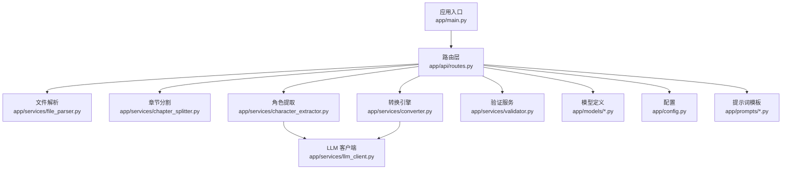
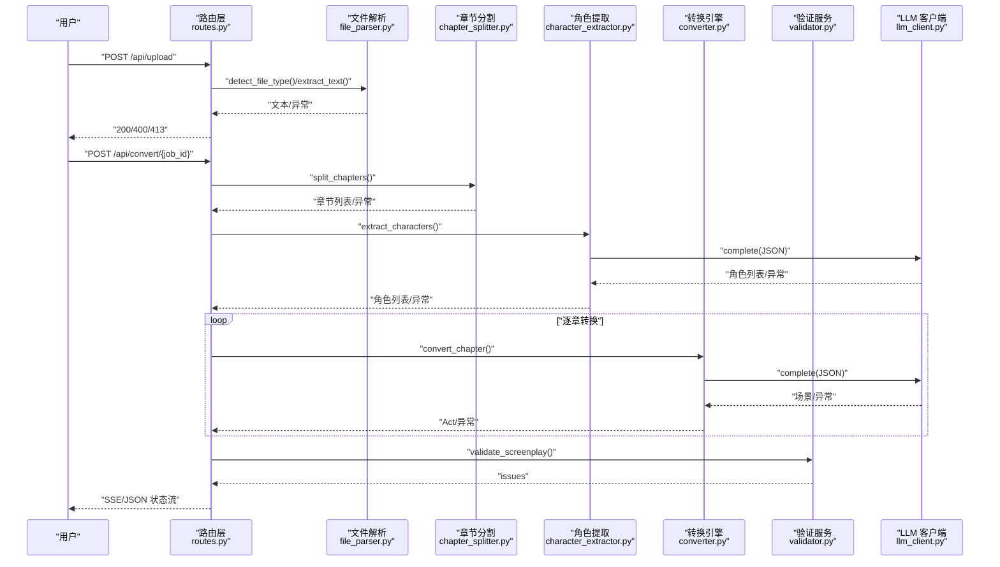
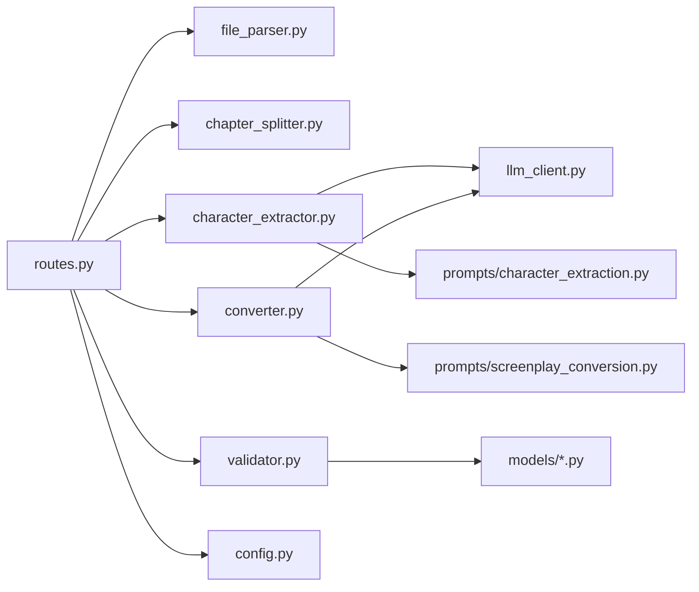

# 常见错误类型

<cite>
**本文引用的文件**
- [app/main.py](file://app/main.py)
- [app/api/routes.py](file://app/api/routes.py)
- [app/services/file_parser.py](file://app/services/file_parser.py)
- [app/services/llm_client.py](file://app/services/llm_client.py)
- [app/services/chapter_splitter.py](file://app/services/chapter_splitter.py)
- [app/services/character_extractor.py](file://app/services/character_extractor.py)
- [app/services/converter.py](file://app/services/converter.py)
- [app/services/validator.py](file://app/services/validator.py)
- [app/models/enums.py](file://app/models/enums.py)
- [app/models/requests.py](file://app/models/requests.py)
- [app/models/screenplay.py](file://app/models/screenplay.py)
- [app/config.py](file://app/config.py)
- [app/prompts/character_extraction.py](file://app/prompts/character_extraction.py)
- [app/prompts/screenplay_conversion.py](file://app/prompts/screenplay_conversion.py)
- [README.md](file://README.md)
</cite>

## 目录
1. [简介](#简介)
2. [项目结构](#项目结构)
3. [核心组件](#核心组件)
4. [架构总览](#架构总览)
5. [详细组件分析](#详细组件分析)
6. [依赖分析](#依赖分析)
7. [性能考虑](#性能考虑)
8. [故障排除指南](#故障排除指南)
9. [结论](#结论)
10. [附录](#附录)

## 简介
本指南聚焦于系统运行过程中可能出现的常见错误类型，覆盖文件上传失败（413 文件过大、400 文件类型错误）、LLM 调用错误（API 密钥无效、网络超时、模型不可用）、转换过程异常（章节分割失败、角色提取错误、转换中断）、验证失败（数据格式错误、角色引用缺失、编号不一致）等具体场景。针对每类错误，提供错误代码说明、可能原因分析、解决方案步骤与预防措施，并给出错误消息的解读与定位方法。

## 项目结构
系统采用 FastAPI 应用入口，路由层负责接收请求、调度后台任务；服务层包含文件解析、章节分割、角色提取、逐章转换、组装、验证与导出等模块；模型层定义了 YAML Schema 的 Pydantic 模型；配置层提供环境变量与默认参数；提示词模板集中于 prompts 目录。

图表来源
- [app/main.py:1-46](file://app/main.py#L1-L46)
- [app/api/routes.py:1-313](file://app/api/routes.py#L1-L313)
- [app/services/file_parser.py:1-187](file://app/services/file_parser.py#L1-L187)
- [app/services/chapter_splitter.py:1-163](file://app/services/chapter_splitter.py#L1-L163)
- [app/services/character_extractor.py:1-154](file://app/services/character_extractor.py#L1-L154)
- [app/services/converter.py:1-218](file://app/services/converter.py#L1-L218)
- [app/services/validator.py:1-111](file://app/services/validator.py#L1-L111)
- [app/models/requests.py:1-41](file://app/models/requests.py#L1-L41)
- [app/models/screenplay.py:1-167](file://app/models/screenplay.py#L1-L167)
- [app/config.py:1-45](file://app/config.py#L1-L45)
- [app/prompts/character_extraction.py:1-47](file://app/prompts/character_extraction.py#L1-L47)
- [app/prompts/screenplay_conversion.py:1-91](file://app/prompts/screenplay_conversion.py#L1-L91)

章节来源
- [app/main.py:1-46](file://app/main.py#L1-L46)
- [app/api/routes.py:1-313](file://app/api/routes.py#L1-L313)
- [README.md:77-117](file://README.md#L77-L117)

## 核心组件
- 路由与后台任务：负责文件上传、状态流式推送、启动转换任务、结果下载与校验查询。
- 文件解析：支持 txt、md、docx、pdf，统一抛出解析异常。
- 章节分割：正则+启发式双策略，不足两章时回退到启发式分割。
- 角色提取：基于 LLM 的抽取与去重合并，必要时生成占位角色。
- 转换引擎：逐章转换，维护连续性上下文，失败时生成最小化备选结构。
- 验证服务：检查元数据、结构完整性、角色引用一致性与编号连续性。
- LLM 客户端：封装异步 OpenAI 兼容客户端，具备重试与 JSON 解析能力。
- 配置：集中管理 API Key、模型、超时、最大上传大小等参数。

章节来源
- [app/api/routes.py:68-128](file://app/api/routes.py#L68-L128)
- [app/services/file_parser.py:16-56](file://app/services/file_parser.py#L16-L56)
- [app/services/chapter_splitter.py:42-63](file://app/services/chapter_splitter.py#L42-L63)
- [app/services/character_extractor.py:21-75](file://app/services/character_extractor.py#L21-L75)
- [app/services/converter.py:36-84](file://app/services/converter.py#L36-L84)
- [app/services/validator.py:11-111](file://app/services/validator.py#L11-L111)
- [app/services/llm_client.py:18-103](file://app/services/llm_client.py#L18-L103)
- [app/config.py:9-44](file://app/config.py#L9-L44)

## 架构总览
系统采用“上传 → 解析 → 分割 → 角色提取 → 转换 → 组装 → 验证 → 导出”的流水线。错误在各阶段以 HTTP 状态码或内部状态暴露，前端通过 SSE 实时感知。

图表来源
- [app/api/routes.py:68-128](file://app/api/routes.py#L68-L128)
- [app/services/file_parser.py:16-56](file://app/services/file_parser.py#L16-L56)
- [app/services/chapter_splitter.py:42-63](file://app/services/chapter_splitter.py#L42-L63)
- [app/services/character_extractor.py:21-75](file://app/services/character_extractor.py#L21-L75)
- [app/services/converter.py:36-84](file://app/services/converter.py#L36-L84)
- [app/services/validator.py:11-111](file://app/services/validator.py#L11-L111)
- [app/services/llm_client.py:33-86](file://app/services/llm_client.py#L33-L86)

## 详细组件分析

### 文件解析与上传
- 错误类型：400 文件类型错误、413 文件过大。
- 触发位置：上传路由对文件类型检测与大小限制。
- 关键逻辑路径：
  - 类型检测与解析：[app/services/file_parser.py:16-56](file://app/services/file_parser.py#L16-L56)
  - 大小限制与存储：[app/api/routes.py:73-83](file://app/api/routes.py#L73-L83)
  - 解析异常抛出：[app/services/file_parser.py:11-13](file://app/services/file_parser.py#L11-L13)

章节来源
- [app/api/routes.py:68-111](file://app/api/routes.py#L68-L111)
- [app/services/file_parser.py:16-56](file://app/services/file_parser.py#L16-L56)

### 章节分割
- 错误类型：章节分割失败（正则未识别、文本过短）。
- 触发位置：分割策略回退至启发式分割。
- 关键逻辑路径：
  - 正则分割与回退：[app/services/chapter_splitter.py:42-63](file://app/services/chapter_splitter.py#L42-L63)
  - 启发式分割与最小章节数：[app/services/chapter_splitter.py:99-134](file://app/services/chapter_splitter.py#L99-L134)

章节来源
- [app/services/chapter_splitter.py:42-134](file://app/services/chapter_splitter.py#L42-L134)

### 角色提取
- 错误类型：角色提取错误（LLM 失败、无角色生成）。
- 触发位置：LLM 抽取失败或返回空。
- 关键逻辑路径：
  - 抽取与合并：[app/services/character_extractor.py:21-75](file://app/services/character_extractor.py#L21-L75)
  - 占位角色生成：[app/services/character_extractor.py:66-74](file://app/services/character_extractor.py#L66-L74)

章节来源
- [app/services/character_extractor.py:21-75](file://app/services/character_extractor.py#L21-L75)

### 转换引擎
- 错误类型：转换中断（LLM 失败、元素解析失败）。
- 触发位置：单章转换失败时生成最小化 Act。
- 关键逻辑路径：
  - 章节转换与回退：[app/services/converter.py:36-84](file://app/services/converter.py#L36-L84)
  - 元素解析与警告：[app/services/converter.py:100-157](file://app/services/converter.py#L100-L157)
  - 连续性摘要生成与回退：[app/services/converter.py:186-217](file://app/services/converter.py#L186-L217)

章节来源
- [app/services/converter.py:36-157](file://app/services/converter.py#L36-L157)
- [app/services/converter.py:186-217](file://app/services/converter.py#L186-L217)

### 验证服务
- 错误类型：验证失败（角色引用缺失、编号不一致、结构缺失）。
- 触发位置：验证阶段收集 issues。
- 关键逻辑路径：
  - 结构与引用校验：[app/services/validator.py:11-111](file://app/services/validator.py#L11-L111)

章节来源
- [app/services/validator.py:11-111](file://app/services/validator.py#L11-L111)

### LLM 客户端
- 错误类型：API 密钥无效、网络超时、模型不可用。
- 触发位置：异步客户端调用与重试。
- 关键逻辑路径：
  - 完整调用与重试：[app/services/llm_client.py:33-86](file://app/services/llm_client.py#L33-L86)
  - JSON 解析与回退：[app/services/llm_client.py:88-98](file://app/services/llm_client.py#L88-L98)

章节来源
- [app/services/llm_client.py:33-86](file://app/services/llm_client.py#L33-L86)

## 依赖分析
- 路由层依赖服务层与模型层；服务层依赖配置与提示词模板；验证与导出依赖模型层；LLM 客户端依赖配置与外部 API。
- 关键耦合点：
  - 路由层与服务层：通过函数调用解耦，便于错误捕获与状态更新。
  - 服务层与 LLM：通过客户端抽象隔离外部依赖。
  - 验证与模型：基于 Pydantic 模型的强约束，确保输出结构正确。

图表来源
- [app/api/routes.py:15-23](file://app/api/routes.py#L15-L23)
- [app/services/character_extractor.py:8-11](file://app/services/character_extractor.py#L8-L11)
- [app/services/converter.py:7-11](file://app/services/converter.py#L7-L11)
- [app/services/validator.py:5-6](file://app/services/validator.py#L5-L6)
- [app/models/requests.py:3-4](file://app/models/requests.py#L3-L4)
- [app/models/screenplay.py:7-12](file://app/models/screenplay.py#L7-L12)
- [app/config.py:9-44](file://app/config.py#L9-L44)
- [app/prompts/character_extraction.py:3-36](file://app/prompts/character_extraction.py#L3-L36)
- [app/prompts/screenplay_conversion.py:3-74](file://app/prompts/screenplay_conversion.py#L3-L74)

## 性能考虑
- LLM 调用：通过温度、最大输出 token 与超时控制成本与稳定性；章节与角色文本截断避免超出预算。
- 分割策略：先正则后启发式，减少无效计算；启发式按字数与段落数平衡章节数量。
- 验证：仅在完成阶段执行，避免重复开销。

## 故障排除指南

### 一、文件上传失败

#### 1. 413 文件过大
- 错误代码：413 Payload Too Large
- 可能原因：
  - 上传文件超过最大允许大小（默认 50MB）。
- 解决方案步骤：
  - 减小文件体积：拆分为多个较小文件或清理冗余内容。
  - 调整配置：增大最大上传大小（需谨慎评估服务器资源）。
- 预防措施：
  - 上传前进行本地压缩与格式优化。
  - 使用支持断点续传的客户端（如适用）。
- 错误消息解读与定位：
  - 定位路径：[app/api/routes.py:81-83](file://app/api/routes.py#L81-L83)
  - 配置项：[app/config.py:24](file://app/config.py#L24)

章节来源
- [app/api/routes.py:81-83](file://app/api/routes.py#L81-L83)
- [app/config.py:24](file://app/config.py#L24)

#### 2. 400 文件类型错误
- 错误代码：400 Bad Request
- 可能原因：
  - 文件扩展名不在支持列表（txt、md、markdown、docx、pdf）。
  - 文件无法被解析（编码问题、空内容、扫描版 PDF）。
- 解决方案步骤：
  - 确认扩展名与实际格式一致。
  - 对 docx/pdf 安装对应依赖并重试。
  - 检查文件编码与内容有效性。
- 预防措施：
  - 上传前使用文本/PDF 工具检查文件质量。
  - 使用官方支持的格式与编码。
- 错误消息解读与定位：
  - 定位路径：[app/api/routes.py:74-77](file://app/api/routes.py#L74-L77)，[app/services/file_parser.py:40-56](file://app/services/file_parser.py#L40-L56)
  - 支持类型映射：[app/services/file_parser.py:164-177](file://app/services/file_parser.py#L164-L177)

章节来源
- [app/api/routes.py:74-77](file://app/api/routes.py#L74-L77)
- [app/services/file_parser.py:40-56](file://app/services/file_parser.py#L40-L56)
- [app/services/file_parser.py:164-177](file://app/services/file_parser.py#L164-L177)

### 二、LLM 调用错误

#### 1. API 密钥无效
- 错误代码：通常表现为 LLM 调用失败或认证错误
- 可能原因：
  - 未设置或设置错误的 API Key。
  - 用户自定义 API Key 与系统配置冲突。
- 解决方案步骤：
  - 在配置文件中填写正确的 DeepSeek API Key。
  - 如使用用户自定义 Key，请确认其有效且有配额。
- 预防措施：
  - 使用环境变量注入，避免硬编码。
  - 定期轮换密钥并监控用量。
- 错误消息解读与定位：
  - 定位路径：[app/services/llm_client.py:21-28](file://app/services/llm_client.py#L21-L28)，[app/config.py:18-21](file://app/config.py#L18-L21)
  - 用户 Key 注入：[app/api/routes.py:122-124](file://app/api/routes.py#L122-L124)

章节来源
- [app/services/llm_client.py:21-28](file://app/services/llm_client.py#L21-L28)
- [app/config.py:18-21](file://app/config.py#L18-L21)
- [app/api/routes.py:122-124](file://app/api/routes.py#L122-L124)

#### 2. 网络超时
- 错误代码：调用异常（最终抛出运行时错误）
- 可能原因：
  - LLM 服务端超时或网络不稳定。
  - 超时阈值过低导致频繁失败。
- 解决方案步骤：
  - 增大超时时间（谨慎评估整体任务耗时）。
  - 重试策略：系统已内置指数回退重试。
- 预防措施：
  - 在边缘节点部署或就近接入 LLM 服务。
  - 监控网络质量与 LLM 服务可用性。
- 错误消息解读与定位：
  - 定位路径：[app/services/llm_client.py:27](file://app/services/llm_client.py#L27)，[app/config.py:31](file://app/config.py#L31)
  - 重试与异常传播：[app/services/llm_client.py:70-86](file://app/services/llm_client.py#L70-L86)

章节来源
- [app/services/llm_client.py:27](file://app/services/llm_client.py#L27)
- [app/config.py:31](file://app/config.py#L31)
- [app/services/llm_client.py:70-86](file://app/services/llm_client.py#L70-L86)

#### 3. 模型不可用
- 错误代码：调用异常（最终抛出运行时错误）
- 可能原因：
  - 指定模型名称不存在或服务端禁用。
- 解决方案步骤：
  - 更换为可用模型名称（参考配置项）。
  - 检查服务端模型列表与权限。
- 预防措施：
  - 在配置中固定受支持的模型。
  - 建立模型可用性探测。
- 错误消息解读与定位：
  - 定位路径：[app/services/llm_client.py:29](file://app/services/llm_client.py#L29)，[app/config.py:21](file://app/config.py#L21)

章节来源
- [app/services/llm_client.py:29](file://app/services/llm_client.py#L29)
- [app/config.py:21](file://app/config.py#L21)

### 三、转换过程异常

#### 1. 章节分割失败
- 表现症状：检测到少于 2 个章节，回退到启发式分割但结果不合理。
- 可能原因：
  - 正则模式未覆盖目标文本格式。
  - 文本过短或段落稀疏。
- 解决方案步骤：
  - 手动调整章节标题格式，使其更接近正则模式。
  - 对超短文本进行扩写或合并。
- 预防措施：
  - 上传前进行章节标题规范化。
  - 使用 Markdown 或 Word 格式，保留明确的层级标题。
- 错误消息解读与定位：
  - 定位路径：[app/services/chapter_splitter.py:42-63](file://app/services/chapter_splitter.py#L42-L63)，[app/services/chapter_splitter.py:99-134](file://app/services/chapter_splitter.py#L99-L134)

章节来源
- [app/services/chapter_splitter.py:42-63](file://app/services/chapter_splitter.py#L42-L63)
- [app/services/chapter_splitter.py:99-134](file://app/services/chapter_splitter.py#L99-L134)

#### 2. 角色提取错误
- 表现症状：角色列表为空或部分章节抽取失败。
- 可能原因：
  - LLM 返回格式不符合预期。
  - 文本中角色出现频率较低或命名不规范。
- 解决方案步骤：
  - 检查 LLM 返回 JSON 是否符合提示词模板。
  - 对章节进行截断后重试（系统已内置截断）。
  - 若仍失败，使用占位角色继续流程。
- 预防措施：
  - 确保文本中角色命名清晰、出现频率合理。
  - 适当增加样本章节数量。
- 错误消息解读与定位：
  - 定位路径：[app/services/character_extractor.py:21-75](file://app/services/character_extractor.py#L21-L75)，[app/prompts/character_extraction.py:3-36](file://app/prompts/character_extraction.py#L3-L36)

章节来源
- [app/services/character_extractor.py:21-75](file://app/services/character_extractor.py#L21-L75)
- [app/prompts/character_extraction.py:3-36](file://app/prompts/character_extraction.py#L3-L36)

#### 3. 转换中断
- 表现症状：某章转换失败，系统生成最小化 Act 作为回退。
- 可能原因：
  - LLM 返回 JSON 结构异常或元素解析失败。
  - 章节文本过长导致预算不足。
- 解决方案步骤：
  - 检查 LLM 返回是否符合提示词模板。
  - 缩短章节文本或调整提示词长度。
  - 查看日志中的元素解析警告并修正输入。
- 预防措施：
  - 保持章节长度适中，避免超过截断阈值。
  - 使用连续性摘要维持上下文连贯。
- 错误消息解读与定位：
  - 定位路径：[app/services/converter.py:36-84](file://app/services/converter.py#L36-L84)，[app/services/converter.py:100-157](file://app/services/converter.py#L100-L157)，[app/prompts/screenplay_conversion.py:3-74](file://app/prompts/screenplay_conversion.py#L3-L74)

章节来源
- [app/services/converter.py:36-84](file://app/services/converter.py#L36-L84)
- [app/services/converter.py:100-157](file://app/services/converter.py#L100-L157)
- [app/prompts/screenplay_conversion.py:3-74](file://app/prompts/screenplay_conversion.py#L3-L74)

### 四、验证失败

#### 1. 数据格式错误
- 表现症状：验证返回包含错误级别的问题。
- 可能原因：
  - 元数据缺失（如标题为空）。
  - 结构不完整（无 acts 或 acts 中无 scenes）。
- 解决方案步骤：
  - 补充缺失字段（如标题）。
  - 检查结构层次是否完整。
- 预防措施：
  - 在导出前运行验证，及时发现并修复。
- 错误消息解读与定位：
  - 定位路径：[app/services/validator.py:11-111](file://app/services/validator.py#L11-L111)

章节来源
- [app/services/validator.py:11-111](file://app/services/validator.py#L11-L111)

#### 2. 角色引用缺失
- 表现症状：元素中引用的角色 ID 不存在于角色目录。
- 可能原因：
  - 角色提取不完整或 ID 不一致。
  - 场景中 characters_present 引用不存在。
- 解决方案步骤：
  - 对照角色目录修正引用 ID。
  - 重新执行角色提取或手动补充角色。
- 预防措施：
  - 严格遵循角色 ID 规范（小写下划线）。
  - 在转换前统一角色 ID。
- 错误消息解读与定位：
  - 定位路径：[app/services/validator.py:80-99](file://app/services/validator.py#L80-L99)

章节来源
- [app/services/validator.py:80-99](file://app/services/validator.py#L80-L99)

#### 3. 编号不一致
- 表现症状：Act 或 Scene 编号非连续或从 1 开始。
- 可能原因：
  - 输入数据编号混乱或缺失。
- 解决方案步骤：
  - 重新编号，确保连续递增。
- 预防措施：
  - 在输入阶段即规范编号。
- 错误消息解读与定位：
  - 定位路径：[app/services/validator.py:52-58](file://app/services/validator.py#L52-L58)

章节来源
- [app/services/validator.py:52-58](file://app/services/validator.py#L52-L58)

## 结论
本指南从系统架构与关键组件出发，结合各阶段的错误触发点与处理策略，提供了面向用户的排错路径与预防建议。建议在生产环境中配合日志监控、健康检查与告警策略，持续优化 LLM 调用与数据质量，以获得稳定可靠的剧本转换体验。

## 附录

### A. 错误分类与定位速查
- 上传阶段：400/413 → [app/api/routes.py:74-83](file://app/api/routes.py#L74-L83)，[app/services/file_parser.py:16-56](file://app/services/file_parser.py#L16-L56)
- 分割阶段：章节不足/启发式异常 → [app/services/chapter_splitter.py:42-63](file://app/services/chapter_splitter.py#L42-L63)
- 角色提取：LLM 失败/空结果 → [app/services/character_extractor.py:21-75](file://app/services/character_extractor.py#L21-L75)
- 转换阶段：元素解析失败/回退 Act → [app/services/converter.py:36-84](file://app/services/converter.py#L36-L84)
- 验证阶段：格式/引用/编号问题 → [app/services/validator.py:11-111](file://app/services/validator.py#L11-L111)
- LLM 阶段：密钥/超时/模型问题 → [app/services/llm_client.py:21-28](file://app/services/llm_client.py#L21-L28)，[app/config.py:18-31](file://app/config.py#L18-L31)

### B. 关键配置项
- API Key/基础 URL/模型：[app/config.py:18-22](file://app/config.py#L18-L22)
- 最大上传大小：[app/config.py:24](file://app/config.py#L24)
- 超时与温度：[app/config.py:27-31](file://app/config.py#L27-L31)
- 数据目录：[app/config.py:25](file://app/config.py#L25)