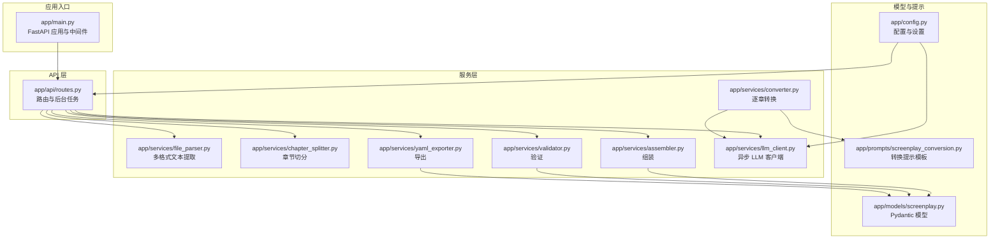
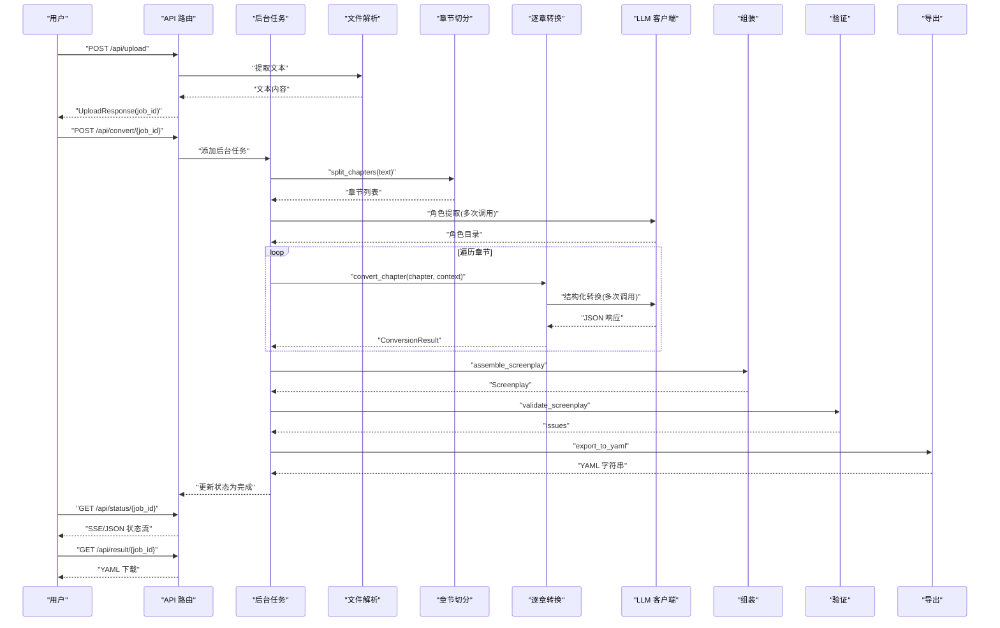
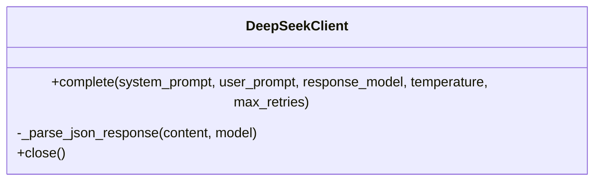
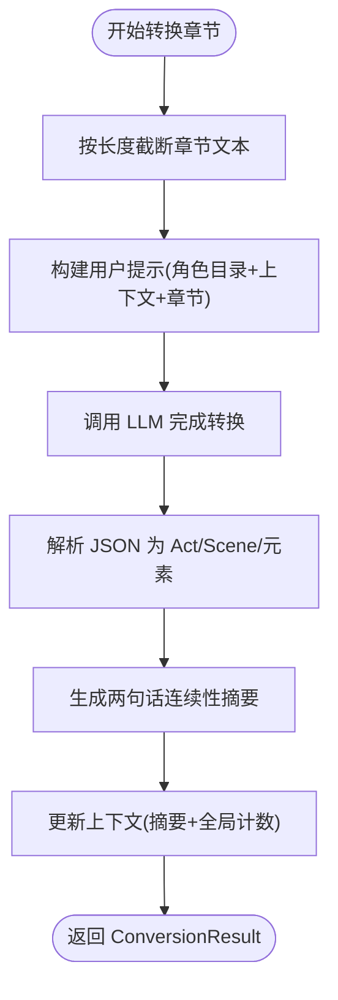
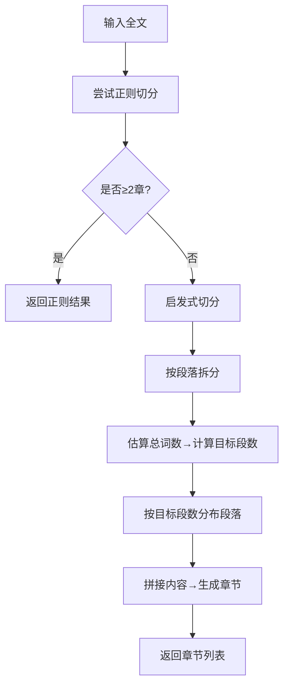
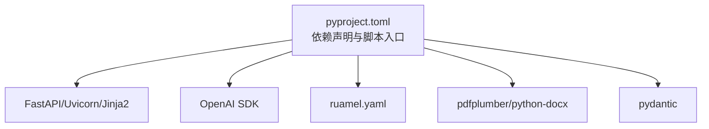

# 性能问题

<cite>
**本文引用的文件**
- [app/main.py](file://app/main.py)
- [app/config.py](file://app/config.py)
- [app/api/routes.py](file://app/api/routes.py)
- [app/services/converter.py](file://app/services/converter.py)
- [app/services/chapter_splitter.py](file://app/services/chapter_splitter.py)
- [app/services/file_parser.py](file://app/services/file_parser.py)
- [app/services/llm_client.py](file://app/services/llm_client.py)
- [app/services/assembler.py](file://app/services/assembler.py)
- [app/services/validator.py](file://app/services/validator.py)
- [app/services/yaml_exporter.py](file://app/services/yaml_exporter.py)
- [app/models/screenplay.py](file://app/models/screenplay.py)
- [app/models/requests.py](file://app/models/requests.py)
- [app/prompts/screenplay_conversion.py](file://app/prompts/screenplay_conversion.py)
- [pyproject.toml](file://pyproject.toml)
- [README.md](file://README.md)
</cite>

## 目录
1. [简介](#简介)
2. [项目结构](#项目结构)
3. [核心组件](#核心组件)
4. [架构总览](#架构总览)
5. [详细组件分析](#详细组件分析)
6. [依赖分析](#依赖分析)
7. [性能考量](#性能考量)
8. [故障排除指南](#故障排除指南)
9. [结论](#结论)
10. [附录](#附录)

## 简介
本指南聚焦于“转换过程中的性能问题”故障排除，覆盖大文件处理缓慢、内存泄漏、并发处理问题、网络延迟等常见瓶颈，并提供性能监控指标解读、优化建议与配置调整方案，以及性能基准测试与压力测试方法。目标是帮助运维与开发者快速定位问题根因并实施有效优化。

## 项目结构
该应用采用 FastAPI + 异步 LLM 客户端的后端架构，前端通过静态文件与模板渲染提供 Web 交互。核心转换管线由“上传 → 解析 → 分章 → 角色提取 → 逐章转换 → 组装 → 验证 → 导出”构成，其中 LLM 调用与文件解析是主要的性能热点。

图表来源
- [app/main.py:1-46](file://app/main.py#L1-L46)
- [app/api/routes.py:1-313](file://app/api/routes.py#L1-L313)
- [app/services/file_parser.py:1-187](file://app/services/file_parser.py#L1-L187)
- [app/services/chapter_splitter.py:1-163](file://app/services/chapter_splitter.py#L1-L163)
- [app/services/converter.py:1-218](file://app/services/converter.py#L1-L218)
- [app/services/assembler.py:1-101](file://app/services/assembler.py#L1-L101)
- [app/services/validator.py:1-111](file://app/services/validator.py#L1-L111)
- [app/services/yaml_exporter.py:1-57](file://app/services/yaml_exporter.py#L1-L57)
- [app/services/llm_client.py:1-103](file://app/services/llm_client.py#L1-L103)
- [app/models/screenplay.py:1-167](file://app/models/screenplay.py#L1-L167)
- [app/prompts/screenplay_conversion.py:1-91](file://app/prompts/screenplay_conversion.py#L1-L91)
- [app/config.py:1-45](file://app/config.py#L1-L45)

章节来源
- [app/main.py:1-46](file://app/main.py#L1-L46)
- [app/api/routes.py:1-313](file://app/api/routes.py#L1-L313)
- [README.md:77-118](file://README.md#L77-L118)

## 核心组件
- 应用入口与中间件：负责启动时目录准备、CORS、静态文件挂载与路由注册。
- API 路由：提供上传、状态流、结果下载、预览、验证等接口；后台任务驱动完整转换流水线。
- 文件解析：支持 TXT/MD/DOCX/PDF，负责文本提取与清洗。
- 章节切分：正则+启发式两级策略，确保大文本分段合理。
- LLM 客户端：基于 OpenAI 兼容接口的异步客户端，具备重试与结构化输出能力。
- 转换引擎：逐章转换，维护连续性上下文，限制单章长度以控制 Token 预算。
- 组装与验证：全局编号、角色出场信息补全、首次出现标记；结构完整性校验。
- 导出：使用 ruamel.yaml 生成格式化 YAML 字符串。

章节来源
- [app/main.py:14-46](file://app/main.py#L14-L46)
- [app/api/routes.py:68-313](file://app/api/routes.py#L68-L313)
- [app/services/file_parser.py:16-187](file://app/services/file_parser.py#L16-L187)
- [app/services/chapter_splitter.py:42-163](file://app/services/chapter_splitter.py#L42-L163)
- [app/services/llm_client.py:18-103](file://app/services/llm_client.py#L18-L103)
- [app/services/converter.py:36-218](file://app/services/converter.py#L36-L218)
- [app/services/assembler.py:18-101](file://app/services/assembler.py#L18-L101)
- [app/services/validator.py:11-111](file://app/services/validator.py#L11-L111)
- [app/services/yaml_exporter.py:14-57](file://app/services/yaml_exporter.py#L14-L57)

## 架构总览
下图展示从上传到导出的完整转换流水线，标注了关键性能节点与潜在瓶颈位置。

图表来源
- [app/api/routes.py:114-313](file://app/api/routes.py#L114-L313)
- [app/services/chapter_splitter.py:42-63](file://app/services/chapter_splitter.py#L42-L63)
- [app/services/converter.py:36-84](file://app/services/converter.py#L36-L84)
- [app/services/llm_client.py:33-86](file://app/services/llm_client.py#L33-L86)
- [app/services/assembler.py:18-50](file://app/services/assembler.py#L18-L50)
- [app/services/validator.py:11-26](file://app/services/validator.py#L11-L26)
- [app/services/yaml_exporter.py:14-57](file://app/services/yaml_exporter.py#L14-L57)

## 详细组件分析

### LLM 客户端与 Token 预算
- 异步调用与指数退避重试，避免瞬时失败放大。
- 结构化 JSON 输出，减少后处理成本。
- 预设最大输出 Token 数与温度，平衡质量与速度。
- 单次请求超时可控，防止阻塞。

图表来源
- [app/services/llm_client.py:18-103](file://app/services/llm_client.py#L18-L103)

章节来源
- [app/services/llm_client.py:18-103](file://app/services/llm_client.py#L18-L103)
- [app/config.py:27-31](file://app/config.py#L27-L31)
- [README.md:119-129](file://README.md#L119-L129)

### 逐章转换与连续性上下文
- 对超长章节进行截断，避免超出 Token 预算。
- 维护上一场景摘要与全局场景号，保证跨章一致性。
- 失败时提供降级策略，保障整体可用性。

图表来源
- [app/services/converter.py:36-84](file://app/services/converter.py#L36-L84)
- [app/services/converter.py:186-218](file://app/services/converter.py#L186-L218)

章节来源
- [app/services/converter.py:36-84](file://app/services/converter.py#L36-L84)
- [app/prompts/screenplay_conversion.py:76-91](file://app/prompts/screenplay_conversion.py#L76-L91)

### 章节切分策略
- 正则优先：覆盖中英/罗马数字章节标题与多种格式。
- 启发式兜底：按段落与字数估算均匀切分，限制最小/最大段落数。
- 分布均衡：按字符数目标分配段落，避免极端不均。

图表来源
- [app/services/chapter_splitter.py:42-63](file://app/services/chapter_splitter.py#L42-L63)
- [app/services/chapter_splitter.py:99-134](file://app/services/chapter_splitter.py#L99-L134)

章节来源
- [app/services/chapter_splitter.py:42-163](file://app/services/chapter_splitter.py#L42-L163)

### 文件解析与编码兼容
- 支持 txt/md/docx/pdf 多格式。
- 编码探测与回退，提升鲁棒性。
- Markdown 清洗规则明确，减少噪声。
- PDF 提取失败时给出明确错误类型。

章节来源
- [app/services/file_parser.py:16-187](file://app/services/file_parser.py#L16-L187)

### 组装与验证
- 全局编号重排，Act/Scene 顺序一致。
- 从对话元素反向补全场景出场角色。
- 首次出现场景标记，便于后续编辑。
- 结构校验：必填项、编号连续性、角色引用有效性。

章节来源
- [app/services/assembler.py:18-101](file://app/services/assembler.py#L18-L101)
- [app/services/validator.py:11-111](file://app/services/validator.py#L11-L111)

### YAML 导出
- 使用 ruamel.yaml 保持有序、块风格、Unicode 支持与注释。
- 生成头部注释包含生成时间与文档链接，便于溯源。

章节来源
- [app/services/yaml_exporter.py:14-57](file://app/services/yaml_exporter.py#L14-L57)

## 依赖分析
- 运行时依赖：FastAPI、Uvicorn、Jinja2、OpenAI SDK、Pydantic、ruamel.yaml、pdfplumber、python-docx 等。
- 脚本入口：novel-serve 指向 app.main:run。
- 关键外部接口：DeepSeek API（OpenAI 兼容）。

图表来源
- [pyproject.toml:13-25](file://pyproject.toml#L13-L25)
- [pyproject.toml:34-35](file://pyproject.toml#L34-L35)

章节来源
- [pyproject.toml:1-47](file://pyproject.toml#L1-L47)

## 性能考量
- LLM 调用是主要瓶颈：请求次数与 Token 消耗决定总体耗时与成本。
- 文件解析与正则匹配：大文件的正则扫描与 PDF/DOCX 解析可能占用 CPU 与内存。
- 内存使用：大文本加载、章节列表、角色目录、中间模型对象与最终 YAML 字符串都会占用内存。
- 并发与队列：当前实现使用后台任务，未见显式并发池；大量并发会放大 LLM 与磁盘 IO 压力。
- 网络延迟：API 基础 URL 与超时配置直接影响端到端时延与稳定性。

章节来源
- [app/services/llm_client.py:21-31](file://app/services/llm_client.py#L21-L31)
- [app/config.py:18-31](file://app/config.py#L18-L31)
- [app/api/routes.py:30-31](file://app/api/routes.py#L30-L31)

## 故障排除指南

### 1. 如何识别性能瓶颈
- 处理时间统计
  - 通过状态接口观察各阶段耗时：解析、切分、角色提取、逐章转换、组装、验证、导出。
  - SSE 接口提供持续进度，结合日志可估算阶段耗时。
- 内存使用曲线
  - 监控进程 RSS/堆使用：大文件加载、章节列表、角色目录、中间模型与 YAML 字符串。
  - 关注长章节与超长角色目录对内存的影响。
- 并发请求数控制
  - 当前未见显式并发池；过多并发会放大 LLM 与磁盘 IO 压力。
  - 建议限制同时运行的转换任务数量，或引入队列与限流。

章节来源
- [app/api/routes.py:131-158](file://app/api/routes.py#L131-L158)
- [app/api/routes.py:219-313](file://app/api/routes.py#L219-L313)

### 2. 常见问题与根因定位
- 大文件处理缓慢
  - 切分策略：确认是否触发启发式切分，目标段数是否合理。
  - LLM 调用：逐章转换次数与 Token 预算是否过高。
  - 文件解析：PDF/DOCX 解析耗时与失败率。
- 内存泄漏
  - 检查是否存在未释放的大对象引用（如临时文本、中间模型）。
  - 确认 LLM 客户端在 finally 中关闭连接。
- 并发处理问题
  - 后台任务是否堆积；是否有未清理的作业状态。
  - LLM 速率限制与重试策略是否导致抖动。
- 网络延迟
  - API 基础 URL 与超时设置；重试间隔是否过长。

章节来源
- [app/services/chapter_splitter.py:99-134](file://app/services/chapter_splitter.py#L99-L134)
- [app/services/converter.py:53-57](file://app/services/converter.py#L53-L57)
- [app/services/llm_client.py:100-103](file://app/services/llm_client.py#L100-L103)
- [app/config.py:27-31](file://app/config.py#L27-L31)

### 3. 性能监控指标解读
- 处理时间
  - 解析：读取与文本提取。
  - 切分：正则匹配与段落分布。
  - 角色提取：LLM 调用次数与耗时。
  - 转换：逐章转换次数与耗时。
  - 组装/验证/导出：模型序列化与 YAML 生成。
- 内存使用
  - 文本加载、章节对象、角色目录、中间模型、最终 YAML 字符串。
- 并发控制
  - 同时运行的任务数；队列深度；LLM 速率限制与重试次数。

章节来源
- [app/api/routes.py:219-313](file://app/api/routes.py#L219-L313)
- [app/services/llm_client.py:70-86](file://app/services/llm_client.py#L70-L86)

### 4. 优化建议与配置调整
- 增加服务器资源
  - CPU/内存：大文件与长文本处理需要更高规格实例。
  - 存储：确保磁盘 IO 能力满足频繁读写。
- 调整批处理大小
  - 章节目标长度：适当缩短单章长度，降低 Token 预算与 LLM 负担。
  - 角色目录压缩：减少角色描述长度，降低提示体积。
- 优化算法参数
  - LLM 温度与最大输出 Token：在质量与速度之间权衡。
  - LLM 超时与重试：避免过长等待与抖动。
- 并发与队列
  - 限制同时运行的转换任务数，或引入队列与速率限制。
- 网络与缓存
  - 选择更近的 API 基础 URL；启用连接复用。
- 日志与可观测性
  - 在关键路径增加耗时与内存采样；记录异常与重试详情。

章节来源
- [app/config.py:27-31](file://app/config.py#L27-L31)
- [app/services/converter.py:53-57](file://app/services/converter.py#L53-L57)
- [app/services/llm_client.py:70-86](file://app/services/llm_client.py#L70-L86)
- [app/api/routes.py:30-31](file://app/api/routes.py#L30-L31)

### 5. 性能基准测试与压力测试
- 基准测试
  - 选择不同规模的样本文件（小/中/大），固定 LLM 参数，测量各阶段耗时与内存峰值。
  - 对比正则与启发式切分在不同文本特征下的表现。
- 压力测试
  - 并发启动多个转换任务，观察队列深度、CPU/内存占用、LLM 调用成功率与平均时延。
  - 模拟网络抖动与 LLM 服务不稳定，评估重试与降级策略的有效性。
- 指标采集
  - 使用系统监控工具采集 CPU、内存、磁盘 IO、网络带宽。
  - 在应用侧记录每个阶段的耗时与错误数。

章节来源
- [app/api/routes.py:131-158](file://app/api/routes.py#L131-L158)
- [app/services/llm_client.py:70-86](file://app/services/llm_client.py#L70-L86)

## 结论
本项目的性能瓶颈主要集中在 LLM 调用、大文本解析与导出阶段。通过合理的参数调优、并发控制、资源扩容与完善的监控体系，可以显著提升大文件处理的稳定性与吞吐量。建议在生产环境中引入队列与限流、优化 Token 预算、增强错误恢复与降级策略，并建立持续的基准与压力测试流程。

## 附录
- 配置项参考
  - LLM 基础 URL、模型、温度、最大输出 Token、超时
  - 上传文件大小上限、数据目录
- 关键路径参考
  - 上传与状态流：[app/api/routes.py:68-158](file://app/api/routes.py#L68-L158)
  - 转换流水线：[app/api/routes.py:219-313](file://app/api/routes.py#L219-L313)
  - LLM 客户端：[app/services/llm_client.py:18-103](file://app/services/llm_client.py#L18-L103)
  - 章节切分：[app/services/chapter_splitter.py:42-163](file://app/services/chapter_splitter.py#L42-L163)
  - 文件解析：[app/services/file_parser.py:16-187](file://app/services/file_parser.py#L16-L187)
  - 组装与验证：[app/services/assembler.py:18-101](file://app/services/assembler.py#L18-L101)、[app/services/validator.py:11-111](file://app/services/validator.py#L11-L111)
  - 导出：[app/services/yaml_exporter.py:14-57](file://app/services/yaml_exporter.py#L14-L57)