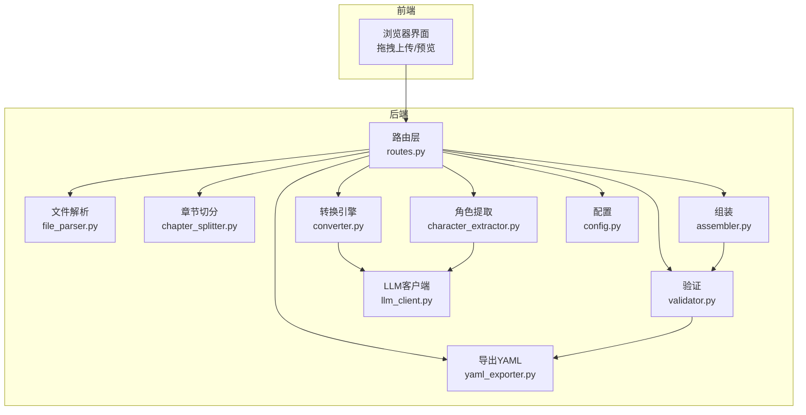
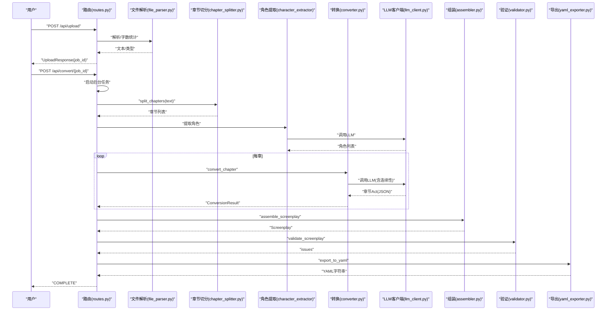
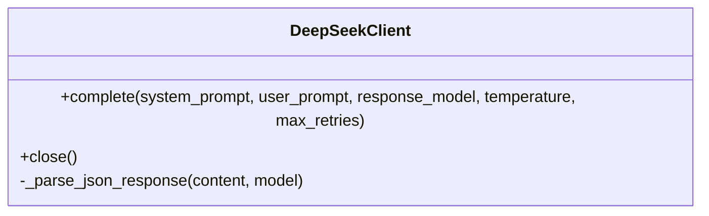
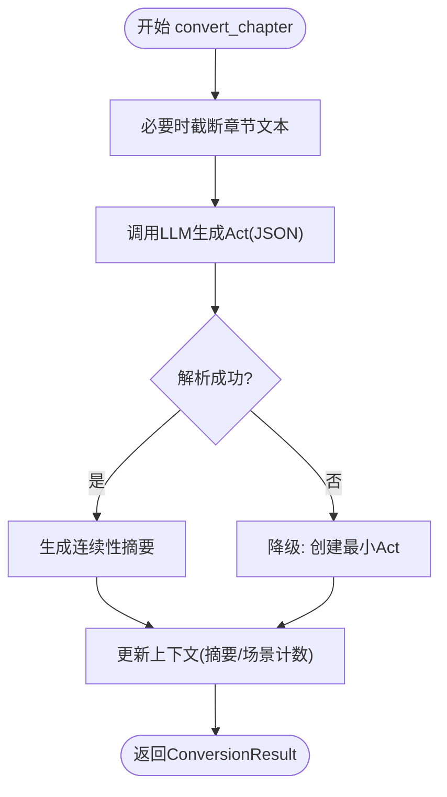
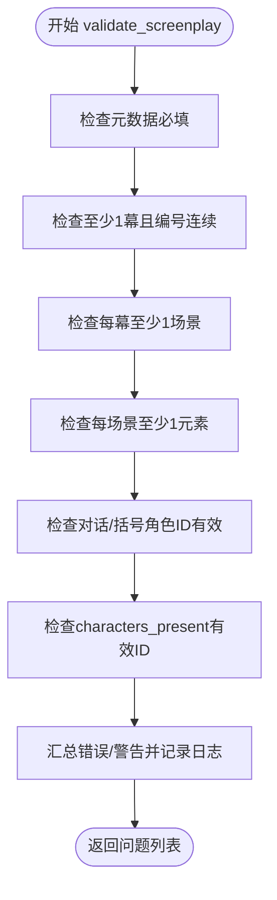
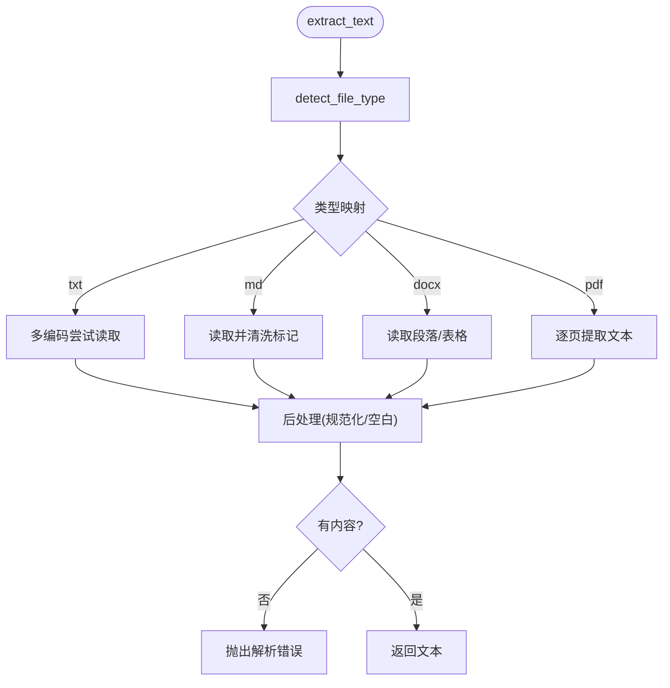
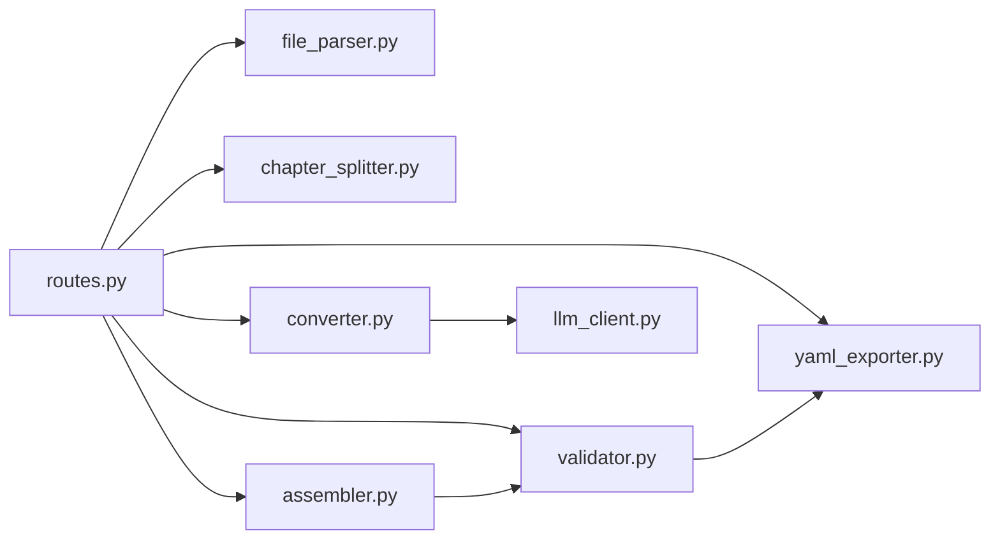

# 故障排除

<cite>
**本文引用的文件**
- [README.md](file://README.md)
- [app/main.py](file://app/main.py)
- [app/config.py](file://app/config.py)
- [app/api/routes.py](file://app/api/routes.py)
- [app/services/llm_client.py](file://app/services/llm_client.py)
- [app/services/converter.py](file://app/services/converter.py)
- [app/services/validator.py](file://app/services/validator.py)
- [app/services/file_parser.py](file://app/services/file_parser.py)
- [app/services/chapter_splitter.py](file://app/services/chapter_splitter.py)
- [app/services/assembler.py](file://app/services/assembler.py)
- [app/services/yaml_exporter.py](file://app/services/yaml_exporter.py)
- [app/models/screenplay.py](file://app/models/screenplay.py)
- [app/models/requests.py](file://app/models/requests.py)
- [app/prompts/screenplay_conversion.py](file://app/prompts/screenplay_conversion.py)
- [app/prompts/continuity.py](file://app/prompts/continuity.py)
- [tests/test_models.py](file://tests/test_models.py)
</cite>

## 目录
1. [简介](#简介)
2. [项目结构](#项目结构)
3. [核心组件](#核心组件)
4. [架构总览](#架构总览)
5. [详细组件分析](#详细组件分析)
6. [依赖分析](#依赖分析)
7. [性能考虑](#性能考虑)
8. [故障排除指南](#故障排除指南)
9. [结论](#结论)
10. [附录](#附录)

## 简介
本指南面向用户与开发者，提供系统化的故障排除方法，覆盖文件上传失败、LLM 调用错误、转换过程异常、验证失败、网络连接问题、API 密钥与配置问题、内存不足与超时、数据格式错误、浏览器兼容性以及紧急降级处理等常见问题。文档结合代码实现，给出诊断流程、日志分析技巧与优化建议。

## 项目结构
该应用基于 FastAPI 提供 Web 接口，后端以“文件解析 → 章节切分 → 角色提取 → 逐章转换 → 组装 → 验证 → YAML 导出”的流水线运行，并通过 SSE 实时反馈转换状态。关键模块职责如下：
- API 层：路由与后台任务调度，状态流与结果下载
- 服务层：文件解析、章节切分、LLM 客户端、角色提取、转换引擎、组装、验证、导出
- 模型层：Pydantic 定义的 YAML Schema
- 提示词层：转换与连续性提示模板
- 配置层：环境变量与运行参数

图表来源
- [app/api/routes.py:1-313](file://app/api/routes.py#L1-L313)
- [app/services/file_parser.py:1-187](file://app/services/file_parser.py#L1-L187)
- [app/services/chapter_splitter.py:1-163](file://app/services/chapter_splitter.py#L1-L163)
- [app/services/converter.py:1-218](file://app/services/converter.py#L1-L218)
- [app/services/assembler.py:1-101](file://app/services/assembler.py#L1-L101)
- [app/services/validator.py:1-111](file://app/services/validator.py#L1-L111)
- [app/services/yaml_exporter.py:1-57](file://app/services/yaml_exporter.py#L1-L57)
- [app/services/llm_client.py:1-103](file://app/services/llm_client.py#L1-L103)
- [app/config.py:1-45](file://app/config.py#L1-L45)

章节来源
- [README.md:77-108](file://README.md#L77-L108)
- [app/main.py:1-46](file://app/main.py#L1-L46)
- [app/config.py:1-45](file://app/config.py#L1-L45)

## 核心组件
- 配置与运行时：加载环境变量、设置上传/输出目录、LLM 参数与超时
- 路由与状态：SSE 推送转换进度、JSON 回退、结果下载与校验查询
- 文件解析：多格式文本抽取、编码与格式清理、字数统计
- 章节切分：正则+启发式双轨策略，短文本回退
- LLM 客户端：异步 OpenAI 兼容封装、重试与 JSON 解析
- 转换引擎：章节到剧本的结构化转换、连续性摘要生成、降级策略
- 组装与验证：全局编号、出场角色归集、首次出场标注、结构完整性校验
- YAML 导出：ruamel.yaml 保持顺序与注释，统一格式

章节来源
- [app/config.py:9-44](file://app/config.py#L9-L44)
- [app/api/routes.py:68-313](file://app/api/routes.py#L68-L313)
- [app/services/file_parser.py:16-187](file://app/services/file_parser.py#L16-L187)
- [app/services/chapter_splitter.py:42-163](file://app/services/chapter_splitter.py#L42-L163)
- [app/services/llm_client.py:18-103](file://app/services/llm_client.py#L18-L103)
- [app/services/converter.py:36-218](file://app/services/converter.py#L36-L218)
- [app/services/assembler.py:18-101](file://app/services/assembler.py#L18-L101)
- [app/services/validator.py:11-111](file://app/services/validator.py#L11-L111)
- [app/services/yaml_exporter.py:14-57](file://app/services/yaml_exporter.py#L14-L57)

## 架构总览
下图展示一次典型转换请求从上传到导出的关键交互与错误处理路径。

图表来源
- [app/api/routes.py:114-313](file://app/api/routes.py#L114-L313)
- [app/services/file_parser.py:16-57](file://app/services/file_parser.py#L16-L57)
- [app/services/chapter_splitter.py:42-64](file://app/services/chapter_splitter.py#L42-L64)
- [app/services/converter.py:36-84](file://app/services/converter.py#L36-L84)
- [app/services/llm_client.py:33-86](file://app/services/llm_client.py#L33-L86)
- [app/services/assembler.py:18-51](file://app/services/assembler.py#L18-L51)
- [app/services/validator.py:11-26](file://app/services/validator.py#L11-L26)
- [app/services/yaml_exporter.py:14-28](file://app/services/yaml_exporter.py#L14-L28)

## 详细组件分析

### LLM 客户端与重试机制
- 支持系统提示词、用户提示词与结构化 JSON 输出
- 内建指数退避重试，最终抛出运行时错误
- JSON 响应去除代码围栏后解析为 Pydantic 模型

图表来源
- [app/services/llm_client.py:18-103](file://app/services/llm_client.py#L18-L103)

章节来源
- [app/services/llm_client.py:33-86](file://app/services/llm_client.py#L33-L86)
- [app/prompts/screenplay_conversion.py:3-74](file://app/prompts/screenplay_conversion.py#L3-L74)

### 转换引擎与降级策略
- 单章转换失败时生成最小可用 Act 作为降级产物
- 连续性摘要失败时回退到最后场景描述
- 章节过长截断，避免超出预算

图表来源
- [app/services/converter.py:36-84](file://app/services/converter.py#L36-L84)
- [app/services/converter.py:160-184](file://app/services/converter.py#L160-L184)
- [app/services/converter.py:186-218](file://app/services/converter.py#L186-L218)

章节来源
- [app/services/converter.py:53-84](file://app/services/converter.py#L53-L84)
- [app/services/converter.py:160-184](file://app/services/converter.py#L160-L184)
- [app/services/converter.py:186-218](file://app/services/converter.py#L186-L218)

### 验证服务与问题定位
- 检查元数据、结构编号、场景元素、角色引用一致性
- 对缺失或无效引用给出路径定位与严重级别

图表来源
- [app/services/validator.py:11-111](file://app/services/validator.py#L11-L111)

章节来源
- [app/services/validator.py:11-111](file://app/services/validator.py#L11-L111)
- [app/models/screenplay.py:16-167](file://app/models/screenplay.py#L16-L167)

### 文件解析与格式错误
- 支持 txt/md/docx/pdf；多编码尝试；Markdown 清洗
- DOCX/PDF 缺依赖会明确报错；空文本与不可解码均抛出解析错误

图表来源
- [app/services/file_parser.py:16-57](file://app/services/file_parser.py#L16-L57)
- [app/services/file_parser.py:59-144](file://app/services/file_parser.py#L59-L144)
- [app/services/file_parser.py:146-187](file://app/services/file_parser.py#L146-L187)

章节来源
- [app/services/file_parser.py:16-57](file://app/services/file_parser.py#L16-L57)
- [app/services/file_parser.py:59-144](file://app/services/file_parser.py#L59-L144)
- [app/services/file_parser.py:146-187](file://app/services/file_parser.py#L146-L187)

### 章节切分策略
- 优先正则模式匹配；少于2章则启发式切分；目标约 3000-5000 字/段
- 段落分布按字符长度近似均衡，避免过多小节

章节来源
- [app/services/chapter_splitter.py:42-135](file://app/services/chapter_splitter.py#L42-L135)

### 组装与导出
- 全局重编号、出场角色归集、首次出场标注
- ruamel.yaml 保留顺序与注释，统一缩进与宽度

章节来源
- [app/services/assembler.py:18-101](file://app/services/assembler.py#L18-L101)
- [app/services/yaml_exporter.py:14-57](file://app/services/yaml_exporter.py#L14-L57)

## 依赖分析
- 路由依赖各服务模块，负责编排与状态推送
- 转换与角色提取依赖 LLM 客户端
- 验证依赖模型定义的结构约束
- 导出依赖 ruamel.yaml 与模型序列化

图表来源
- [app/api/routes.py:15-24](file://app/api/routes.py#L15-L24)
- [app/services/converter.py:10-11](file://app/services/converter.py#L10-L11)
- [app/services/assembler.py:5-13](file://app/services/assembler.py#L5-L13)
- [app/services/validator.py:5-6](file://app/services/validator.py#L5-L6)
- [app/services/yaml_exporter.py:7-9](file://app/services/yaml_exporter.py#L7-L9)

章节来源
- [app/api/routes.py:15-24](file://app/api/routes.py#L15-L24)

## 性能考虑
- LLM 超时与重试：默认超时与温度可控，建议根据网络状况调整
- 章节截断：长章节自动截断，避免预算溢出
- 并发与资源：单次转换为串行流水线，避免并发竞争；注意 CPU/内存占用随章节数量增长
- 导出性能：ruamel.yaml 顺序输出，适合大体量 YAML；建议在低内存设备上分批处理

章节来源
- [app/config.py:27-31](file://app/config.py#L27-L31)
- [app/services/converter.py:53-57](file://app/services/converter.py#L53-L57)
- [app/services/llm_client.py:21-32](file://app/services/llm_client.py#L21-L32)

## 故障排除指南

### 通用诊断流程
- 确认服务已启动并监听端口
- 使用浏览器访问首页，确认静态资源与模板渲染正常
- 通过“开始转换”触发后台任务，使用“/api/status/{job_id}”或“/api/status/{job_id}/json”观察阶段与进度
- 若完成但未生成结果，检查输出目录是否存在对应 YAML 文件
- 如出现错误，查看“/api/validate/{job_id}”中的问题列表

章节来源
- [app/main.py:23-46](file://app/main.py#L23-L46)
- [app/api/routes.py:53-66](file://app/api/routes.py#L53-L66)
- [app/api/routes.py:131-166](file://app/api/routes.py#L131-L166)
- [app/api/routes.py:201-206](file://app/api/routes.py#L201-L206)

### 文件上传失败
- 常见原因
  - 文件类型不受支持：扩展名需为 txt/md/markdown/docx/pdf
  - 文件过大：超过配置的最大上传大小
  - 解析错误：编码不支持、空内容、DOCX/PDF 依赖缺失
- 处理步骤
  - 检查扩展名是否在支持列表
  - 减小文件体积或调整配置中的最大上传大小
  - 确认安装了 docx 与 pdfplumber 依赖
  - 重新保存为 UTF-8 或相应编码的 txt/md
- 相关实现参考
  - [文件类型检测与解析:164-177](file://app/services/file_parser.py#L164-L177)
  - [上传接口与大小限制:68-112](file://app/api/routes.py#L68-L112)
  - [配置项:24-25](file://app/config.py#L24-L25)

章节来源
- [app/services/file_parser.py:16-57](file://app/services/file_parser.py#L16-L57)
- [app/services/file_parser.py:164-177](file://app/services/file_parser.py#L164-L177)
- [app/api/routes.py:68-112](file://app/api/routes.py#L68-L112)
- [app/config.py:24-25](file://app/config.py#L24-L25)

### LLM 调用错误
- 常见原因
  - API 密钥为空或无效
  - 网络超时或不稳定
  - 返回非 JSON 或被代码围栏包裹
  - 模型/基础 URL 配置错误
- 处理步骤
  - 在 .env 中填写 DEEPSEEK_API_KEY，或在请求体中传入 api_key
  - 检查 DEEPSEEK_BASE_URL 与 DEEPSEEK_MODEL
  - 调整 llm_timeout 与 llm_temperature
  - 查看日志中重试次数与最后一次异常
- 相关实现参考
  - [LLM 客户端初始化与重试:21-32](file://app/services/llm_client.py#L21-L32)
  - [complete 调用与 JSON 解析:33-86](file://app/services/llm_client.py#L33-L86)
  - [配置项:18-31](file://app/config.py#L18-L31)

章节来源
- [app/services/llm_client.py:21-32](file://app/services/llm_client.py#L21-L32)
- [app/services/llm_client.py:33-86](file://app/services/llm_client.py#L33-L86)
- [app/config.py:18-31](file://app/config.py#L18-L31)

### 转换过程异常
- 症状：进度卡在某阶段或报错
- 排查要点
  - 检查章节切分是否合理（正则/启发式）
  - 关注单章转换失败时的降级行为
  - 查看连续性摘要生成是否异常
- 相关实现参考
  - [章节切分策略:42-64](file://app/services/chapter_splitter.py#L42-L64)
  - [单章转换与降级:36-84](file://app/services/converter.py#L36-L84)
  - [连续性摘要回退:186-218](file://app/services/converter.py#L186-L218)

章节来源
- [app/services/chapter_splitter.py:42-64](file://app/services/chapter_splitter.py#L42-L64)
- [app/services/converter.py:36-84](file://app/services/converter.py#L36-L84)
- [app/services/converter.py:186-218](file://app/services/converter.py#L186-L218)

### 验证失败
- 常见问题
  - 元数据缺失（如标题）
  - 角色引用不存在或拼写不一致
  - 结构编号不连续、场景无元素
- 处理步骤
  - 根据“/api/validate/{job_id}”返回的路径与消息修正
  - 确保角色 ID 与引用一致
  - 检查导出 YAML 的结构是否符合 Schema
- 相关实现参考
  - [验证逻辑:11-111](file://app/services/validator.py#L11-L111)
  - [Schema 定义:16-167](file://app/models/screenplay.py#L16-L167)

章节来源
- [app/services/validator.py:11-111](file://app/services/validator.py#L11-L111)
- [app/models/screenplay.py:16-167](file://app/models/screenplay.py#L16-L167)

### 网络连接问题
- 症状：LLM 调用超时、偶发失败
- 处理步骤
  - 检查代理/防火墙与 DNS
  - 适当提高 llm_timeout
  - 使用稳定网络或本地部署替代
- 相关实现参考
  - [超时与重试:27-32](file://app/services/llm_client.py#L27-L32)
  - [超时参数:27-31](file://app/config.py#L27-L31)

章节来源
- [app/services/llm_client.py:27-32](file://app/services/llm_client.py#L27-L32)
- [app/config.py:27-31](file://app/config.py#L27-L31)

### API 密钥与配置问题
- 症状：401/鉴权失败或功能受限
- 处理步骤
  - 确认 .env 中 DEEPSEEK_API_KEY 已正确填写
  - 确认 DEEPSEEK_BASE_URL 与 DEEPSEEK_MODEL 与平台一致
  - 如需临时覆盖，可在请求体中传入 api_key
- 相关实现参考
  - [配置加载:9-44](file://app/config.py#L9-L44)
  - [上传与转换接口:68-129](file://app/api/routes.py#L68-L129)

章节来源
- [app/config.py:9-44](file://app/config.py#L9-L44)
- [app/api/routes.py:68-129](file://app/api/routes.py#L68-L129)

### 内存不足与超时错误
- 症状：转换中途失败、进程被杀或超时
- 处理步骤
  - 分割长文本或减少单次处理章节数
  - 降低 llm_temperature 与 max_output_tokens
  - 增加系统内存或使用更高配实例
- 相关实现参考
  - [章节截断:53-57](file://app/services/converter.py#L53-L57)
  - [LLM 参数:27-31](file://app/config.py#L27-L31)

章节来源
- [app/services/converter.py:53-57](file://app/services/converter.py#L53-L57)
- [app/config.py:27-31](file://app/config.py#L27-L31)

### 数据格式错误
- 症状：解析失败、空内容、编码错误
- 处理步骤
  - 将 txt/md 保存为 UTF-8；docx/pdf 使用原生导出
  - 清理 Markdown 格式后再上传
  - 确认文件非只读且可写
- 相关实现参考
  - [编码尝试与错误抛出:59-68](file://app/services/file_parser.py#L59-L68)
  - [PDF/DOCX 依赖检查:97-144](file://app/services/file_parser.py#L97-L144)

章节来源
- [app/services/file_parser.py:59-68](file://app/services/file_parser.py#L59-L68)
- [app/services/file_parser.py:97-144](file://app/services/file_parser.py#L97-L144)

### 浏览器兼容性问题
- 症状：SSE 不生效、预览乱码
- 处理步骤
  - 使用现代浏览器（Chrome/Firefox/Edge）
  - 禁用广告拦截器或允许跨域
  - 若 SSE 不可用，使用“/api/status/{job_id}/json”轮询
- 相关实现参考
  - [SSE 响应头与回退:131-166](file://app/api/routes.py#L131-L166)

章节来源
- [app/api/routes.py:131-166](file://app/api/routes.py#L131-L166)

### 紧急降级处理方案
- 当 LLM 不可用时
  - 使用内置降级：章节转换失败时生成最小 Act
  - 手动修正 YAML 中的角色引用与场景元素
- 当验证失败时
  - 依据“/api/validate/{job_id}”逐项修正
  - 临时放宽规则（仅限调试）后重新生成
- 当导出异常时
  - 检查 ruamel.yaml 是否可用，或改用其他 YAML 工具

章节来源
- [app/services/converter.py:160-184](file://app/services/converter.py#L160-L184)
- [app/services/validator.py:11-111](file://app/services/validator.py#L11-L111)
- [app/services/yaml_exporter.py:14-57](file://app/services/yaml_exporter.py#L14-L57)

## 结论
本指南提供了从上传、转换、验证到导出的全链路故障排除方法。建议在生产环境中：
- 明确配置项与依赖
- 使用 SSE 实时监控，必要时回退 JSON 轮询
- 对 LLM 失败进行重试与降级
- 严格遵循 Schema，确保角色引用与结构完整
- 针对长文本与高并发场景优化参数与资源

## 附录

### 常见错误与定位表
- 上传失败：检查扩展名、大小限制、依赖安装
- LLM 错误：核对密钥、URL、模型、超时与重试
- 转换异常：关注章节切分与单章降级
- 验证失败：按路径修正角色引用与结构
- 导出异常：检查 ruamel.yaml 与编码

### 日志分析与错误追踪技巧
- 关注路由层的日志记录与异常捕获
- 利用 SSE 事件流观察阶段推进
- 通过“/api/validate/{job_id}”获取结构化问题
- 在本地复现：使用测试模型与最小输入

章节来源
- [app/api/routes.py:210-217](file://app/api/routes.py#L210-L217)
- [app/api/routes.py:201-206](file://app/api/routes.py#L201-L206)
- [tests/test_models.py:102-124](file://tests/test_models.py#L102-L124)