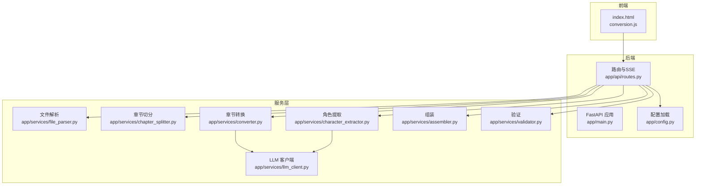
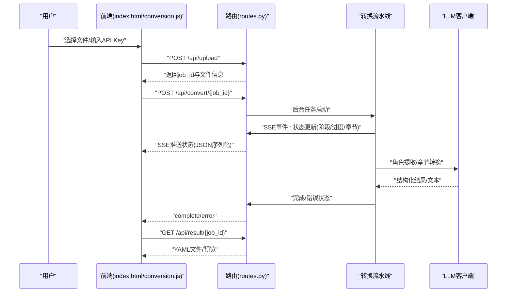
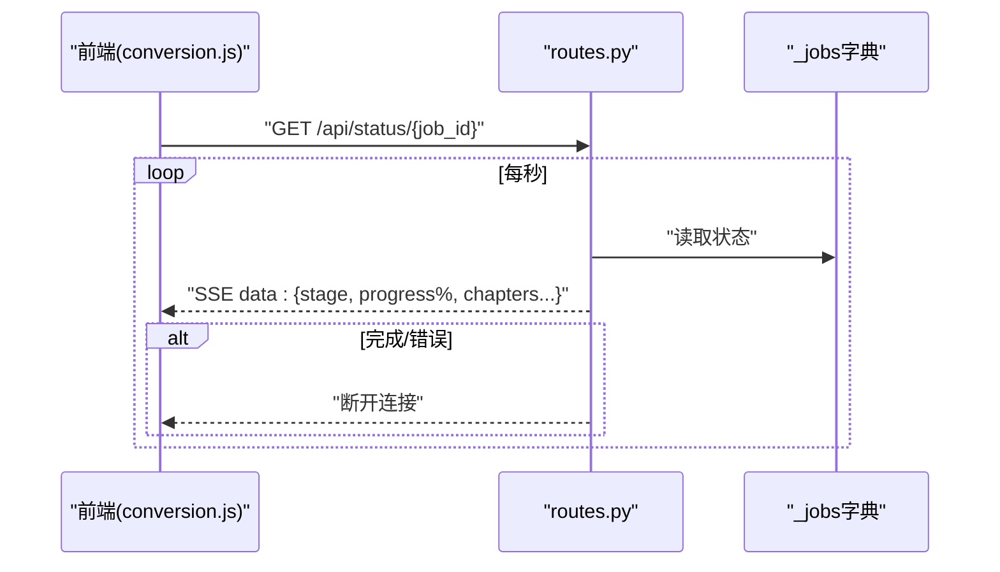
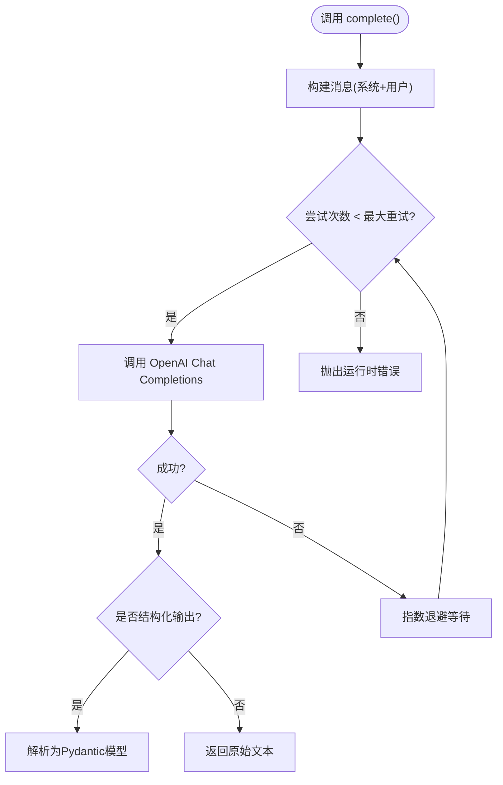
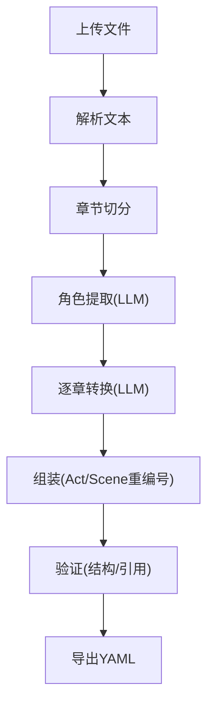
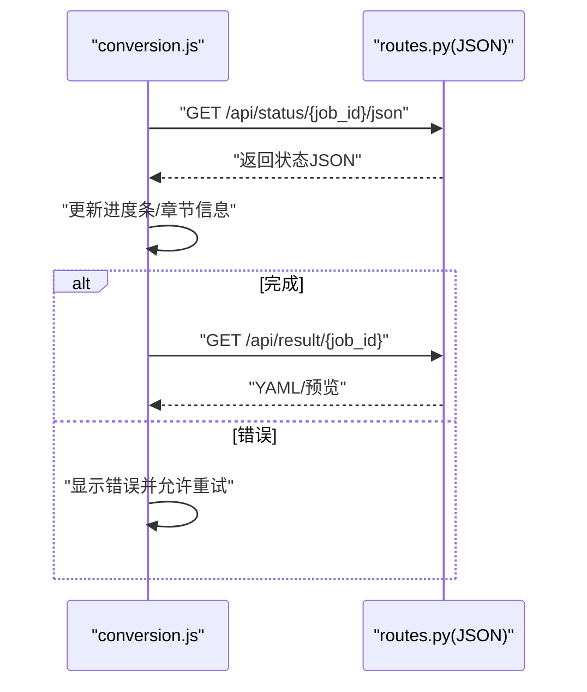
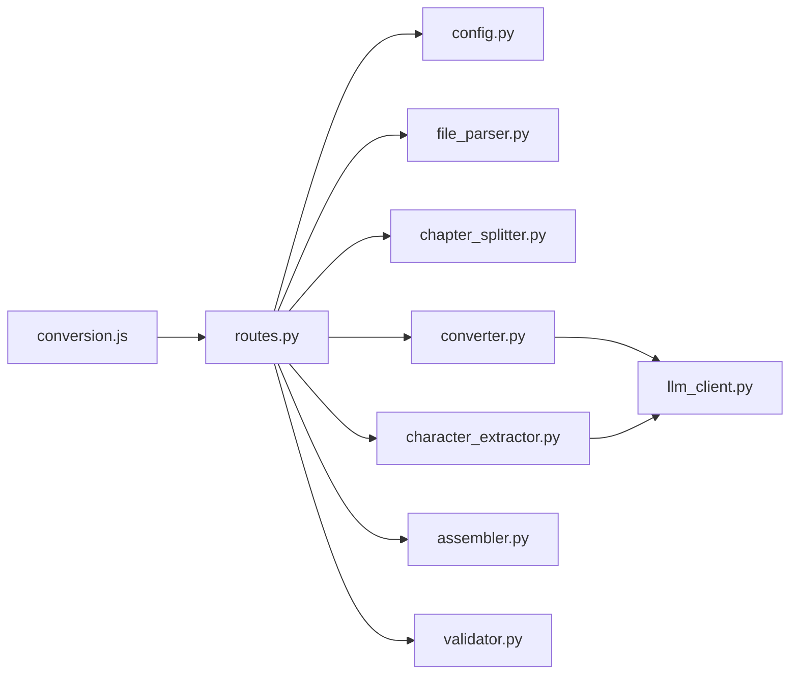

# 诊断流程

<cite>
**本文引用的文件**
- [README.md](file://README.md)
- [app/main.py](file://app/main.py)
- [app/config.py](file://app/config.py)
- [app/api/routes.py](file://app/api/routes.py)
- [app/models/enums.py](file://app/models/enums.py)
- [app/models/requests.py](file://app/models/requests.py)
- [app/static/js/conversion.js](file://app/static/js/conversion.js)
- [app/templates/index.html](file://app/templates/index.html)
- [app/services/llm_client.py](file://app/services/llm_client.py)
- [app/services/converter.py](file://app/services/converter.py)
- [app/services/validator.py](file://app/services/validator.py)
- [app/services/file_parser.py](file://app/services/file_parser.py)
- [app/services/chapter_splitter.py](file://app/services/chapter_splitter.py)
- [app/services/character_extractor.py](file://app/services/character_extractor.py)
- [app/services/assembler.py](file://app/services/assembler.py)
- [tests/test_models.py](file://tests/test_models.py)
</cite>

## 目录
1. [简介](#简介)
2. [项目结构](#项目结构)
3. [核心组件](#核心组件)
4. [架构总览](#架构总览)
5. [详细组件分析](#详细组件分析)
6. [依赖分析](#依赖分析)
7. [性能考虑](#性能考虑)
8. [故障排查指南](#故障排查指南)
9. [结论](#结论)
10. [附录](#附录)

## 简介
本指南面向使用者与维护者，提供从问题发现到解决的系统化故障诊断流程。覆盖范围包括：日志分析方法、错误追踪技巧、网络连接检查、API密钥验证、配置文件检查；如何使用SSE状态流进行实时监控与解读转换进度/错误信息；性能问题识别（内存/CPU/I/O）；以及调试工具与最佳实践。

## 项目结构
该应用采用前后端分离的典型结构：前端使用原生JS与Jinja2模板渲染，后端基于FastAPI提供REST与SSE接口，核心转换逻辑位于服务层，数据模型与枚举位于models目录，配置集中于config模块。

图表来源
- [app/main.py:1-46](file://app/main.py#L1-L46)
- [app/api/routes.py:1-313](file://app/api/routes.py#L1-L313)
- [app/config.py:1-45](file://app/config.py#L1-L45)
- [app/services/llm_client.py:1-103](file://app/services/llm_client.py#L1-L103)
- [app/services/file_parser.py:1-187](file://app/services/file_parser.py#L1-L187)
- [app/services/chapter_splitter.py:1-163](file://app/services/chapter_splitter.py#L1-L163)
- [app/services/character_extractor.py:1-154](file://app/services/character_extractor.py#L1-L154)
- [app/services/converter.py:1-218](file://app/services/converter.py#L1-L218)
- [app/services/assembler.py:1-101](file://app/services/assembler.py#L1-L101)
- [app/services/validator.py:1-111](file://app/services/validator.py#L1-L111)

章节来源
- [README.md:77-108](file://README.md#L77-L108)
- [app/main.py:1-46](file://app/main.py#L1-L46)
- [app/api/routes.py:1-313](file://app/api/routes.py#L1-L313)
- [app/config.py:1-45](file://app/config.py#L1-L45)

## 核心组件
- 应用入口与生命周期：负责启动时创建上传/输出目录，挂载静态资源与路由。
- 配置管理：集中读取环境变量与.env文件，提供LLM参数、上传大小、数据目录等。
- 路由与SSE：提供上传、转换、状态查询、结果下载、验证等接口，并以SSE推送实时进度。
- LLM客户端：封装DeepSeek API调用，支持结构化输出、重试与超时控制。
- 转换流水线：文件解析 → 章节切分 → 角色提取 → 章节转换 → 组装 → 验证 → 导出。
- 前端交互：通过原生JS轮询或SSE接收状态，展示进度、章节信息、错误提示与结果链接。

章节来源
- [app/main.py:14-46](file://app/main.py#L14-L46)
- [app/config.py:9-45](file://app/config.py#L9-L45)
- [app/api/routes.py:68-313](file://app/api/routes.py#L68-L313)
- [app/services/llm_client.py:18-103](file://app/services/llm_client.py#L18-L103)
- [app/static/js/conversion.js:30-130](file://app/static/js/conversion.js#L30-L130)

## 架构总览
下图展示了从用户操作到最终结果的关键交互路径，以及SSE状态流的推送机制。

图表来源
- [app/api/routes.py:114-185](file://app/api/routes.py#L114-L185)
- [app/api/routes.py:131-158](file://app/api/routes.py#L131-L158)
- [app/static/js/conversion.js:30-71](file://app/static/js/conversion.js#L30-L71)
- [app/services/llm_client.py:33-87](file://app/services/llm_client.py#L33-L87)

## 详细组件分析

### 路由与SSE状态流
- SSE端点：/api/status/{job_id} 以Server-Sent Events持续推送ConversionStatus，直至完成或错误。
- JSON回退：/api/status/{job_id}/json 提供轮询兼容接口。
- 错误处理：后台任务捕获异常并写入ERROR阶段状态，前端据此展示错误信息。
- 进度与章节：状态对象包含当前阶段、百分比、总章节数与当前章节数，便于前端渲染。

图表来源
- [app/api/routes.py:131-158](file://app/api/routes.py#L131-L158)
- [app/static/js/conversion.js:34-71](file://app/static/js/conversion.js#L34-L71)

章节来源
- [app/api/routes.py:131-166](file://app/api/routes.py#L131-L166)
- [app/static/js/conversion.js:30-88](file://app/static/js/conversion.js#L30-L88)

### LLM客户端与重试机制
- 支持结构化JSON输出（通过response_format=json_object），失败时自动重试，指数退避。
- 超时与温度：统一从配置读取，确保一致性。
- 错误日志：每次重试失败均记录警告，便于定位网络/配额/模型问题。

图表来源
- [app/services/llm_client.py:33-87](file://app/services/llm_client.py#L33-L87)

章节来源
- [app/services/llm_client.py:18-103](file://app/services/llm_client.py#L18-L103)
- [app/config.py:27-32](file://app/config.py#L27-L32)

### 转换流水线与阶段划分
- 阶段枚举：UPLOADED → PARSING → SPLITTING → EXTRACTING_CHARACTERS → CONVERTING → ASSEMBLING → VALIDATING → COMPLETE/ERROR。
- 章节转换：对每个章节调用LLM，生成Act与连续性摘要，用于后续章节保持一致性。
- 组装与验证：全局重编号、填充出场角色、首次出现标记；随后进行结构与引用校验。

图表来源
- [app/api/routes.py:208-313](file://app/api/routes.py#L208-L313)
- [app/models/enums.py:72-83](file://app/models/enums.py#L72-L83)
- [app/services/converter.py:36-84](file://app/services/converter.py#L36-L84)
- [app/services/assembler.py:18-51](file://app/services/assembler.py#L18-L51)
- [app/services/validator.py:11-111](file://app/services/validator.py#L11-L111)

章节来源
- [app/api/routes.py:208-313](file://app/api/routes.py#L208-L313)
- [app/models/enums.py:72-83](file://app/models/enums.py#L72-L83)
- [app/services/converter.py:16-84](file://app/services/converter.py#L16-L84)
- [app/services/assembler.py:53-101](file://app/services/assembler.py#L53-L101)
- [app/services/validator.py:11-111](file://app/services/validator.py#L11-L111)

### 前端进度与错误展示
- 轮询策略：默认使用轮询获取JSON状态，兼容非SSE环境。
- 进度渲染：根据阶段标签、百分比、当前/总章节数更新UI。
- 错误处理：当状态为error时，显示错误信息并允许重试。
- 结果呈现：完成后显示预览与下载链接，并拉取验证摘要。

图表来源
- [app/static/js/conversion.js:34-114](file://app/static/js/conversion.js#L34-L114)
- [app/templates/index.html:68-133](file://app/templates/index.html#L68-L133)

章节来源
- [app/static/js/conversion.js:30-130](file://app/static/js/conversion.js#L30-L130)
- [app/templates/index.html:68-133](file://app/templates/index.html#L68-L133)

## 依赖分析
- 组件耦合：路由层协调各服务，服务层内部以清晰职责边界解耦；LLM客户端作为共享依赖被角色提取与章节转换复用。
- 外部依赖：DeepSeek API（OpenAI兼容）、python-docx/pdfplumber（文件解析）、ruamel.yaml（YAML导出）。
- 配置集中：所有运行时参数（API Key、URL、模型、超时、Token预算等）集中在配置模块，避免散落。

图表来源
- [app/api/routes.py:15-24](file://app/api/routes.py#L15-L24)
- [app/config.py:9-45](file://app/config.py#L9-L45)
- [app/services/llm_client.py:18-32](file://app/services/llm_client.py#L18-L32)
- [app/static/js/conversion.js:30-71](file://app/static/js/conversion.js#L30-L71)

章节来源
- [app/api/routes.py:15-24](file://app/api/routes.py#L15-L24)
- [app/config.py:9-45](file://app/config.py#L9-L45)
- [app/services/llm_client.py:18-32](file://app/services/llm_client.py#L18-L32)

## 性能考虑
- CPU与I/O瓶颈识别
  - 文本解析与正则匹配：章节切分与文件解析可能受I/O与正则复杂度影响，建议关注超长PDF/DOCX的解析耗时。
  - LLM调用：Token预算与并发请求直接影响吞吐与延迟，需结合超时与重试策略评估。
  - 内存使用：长文本截断与分页处理有助于控制峰值内存；章节过多时注意中间结果累积。
- 优化建议
  - 合理设置最大上传大小与分页策略，避免单次LLM输入过大。
  - 对超长章节进行子切分（系统已内置），减少单次调用成本。
  - 使用结构化输出与严格模式，降低后处理与回退成本。

[本节为通用指导，无需特定文件来源]

## 故障排查指南

### 1. 日志分析方法
- 关键日志位置
  - 路由层：转换失败时记录异常堆栈，便于定位具体阶段。
  - 服务层：章节切分、角色提取、章节转换、验证等均有info/warning日志。
  - LLM客户端：每次重试失败会记录警告，便于判断网络/配额/模型问题。
- 分析要点
  - 查看“Failed to convert chapter”“Failed to extract characters”“Failed to generate continuity summary”等关键字。
  - 关注“LLM call attempt … failed”与“Conversion failed for job …”等错误上下文。

章节来源
- [app/api/routes.py:214-216](file://app/api/routes.py#L214-L216)
- [app/services/chapter_splitter.py:56-62](file://app/services/chapter_splitter.py#L56-L62)
- [app/services/character_extractor.py:59-67](file://app/services/character_extractor.py#L59-L67)
- [app/services/converter.py:73-84](file://app/services/converter.py#L73-L84)
- [app/services/validator.py:105-109](file://app/services/validator.py#L105-L109)
- [app/services/llm_client.py:81-86](file://app/services/llm_client.py#L81-L86)

### 2. 错误追踪技巧
- 阶段定位：根据SSE/JSON状态中的stage字段快速定位问题发生在哪个阶段。
- 章节定位：current_chapter与total_chapters可帮助判断是否卡在某章。
- 错误详情：当stage为error时，前端会显示error_message；可在后端日志中查找对应job_id的异常堆栈。

章节来源
- [app/api/routes.py:131-166](file://app/api/routes.py#L131-L166)
- [app/static/js/conversion.js:116-120](file://app/static/js/conversion.js#L116-L120)

### 3. 网络连接检查
- LLM连通性
  - 确认DeepSeek API Key有效且未过期。
  - 检查base_url与网络代理设置，必要时在防火墙/安全组放行。
  - 观察重试日志，若频繁出现网络异常，优先排查DNS/网络波动。
- 超时与配额
  - 若响应缓慢或超时，适当提高llm_timeout或降低max_output_tokens。
  - 模型不可用或配额不足时，LLM客户端会抛出运行时错误，需在平台侧确认配额。

章节来源
- [app/config.py:18-32](file://app/config.py#L18-L32)
- [app/services/llm_client.py:21-32](file://app/services/llm_client.py#L21-L32)
- [app/services/llm_client.py:70-86](file://app/services/llm_client.py#L70-L86)

### 4. API密钥验证
- 用户级密钥：/api/convert/{job_id}请求体可传入api_key，优先使用该密钥执行LLM调用。
- 系统级密钥：未提供用户密钥时，使用配置中的deepseek_api_key。
- 建议：生产环境优先使用用户级密钥，便于隔离不同租户的用量与错误。

章节来源
- [app/api/routes.py:122-126](file://app/api/routes.py#L122-L126)
- [app/services/llm_client.py:21-29](file://app/services/llm_client.py#L21-L29)

### 5. 配置文件检查
- 环境变量与.env
  - DEEPSEEK_API_KEY、DEEPSEEK_BASE_URL、DEEPSEEK_MODEL、MAX_UPLOAD_SIZE_MB、DATA_DIR、LLM相关参数。
  - 确保DATA_DIR存在且具备读写权限，应用启动时会创建上传/输出目录。
- 参数校验
  - 使用Pydantic设置与缓存加载，避免重复IO；若修改.env，请重启服务使变更生效。

章节来源
- [app/config.py:9-45](file://app/config.py#L9-L45)
- [app/main.py:14-20](file://app/main.py#L14-L20)

### 6. 使用SSE状态流进行实时监控
- SSE端点：/api/status/{job_id}
- 前端行为：默认轮询（兼容非SSE环境），也可切换至SSE；收到complete时停止轮询，收到error时展示错误。
- 实时解读
  - stage：当前阶段（uploaded/parsing/splitting/…/complete/error）
  - progress_percent：整体进度百分比
  - current_chapter/total_chapters：当前章节与总章节数
  - error_message：错误详情（仅stage=error）

章节来源
- [app/api/routes.py:131-158](file://app/api/routes.py#L131-L158)
- [app/static/js/conversion.js:30-88](file://app/static/js/conversion.js#L30-L88)

### 7. 解读转换进度与错误信息
- 前端UI映射：阶段标签、进度条、章节信息、错误弹窗。
- 验证摘要：完成后拉取/api/validate/{job_id}，统计error与warning数量，辅助二次修正。

章节来源
- [app/static/js/conversion.js:97-114](file://app/static/js/conversion.js#L97-L114)
- [app/api/routes.py:201-206](file://app/api/routes.py#L201-L206)

### 8. 性能问题识别与处理
- 内存使用过高
  - 检查长文本截断与分页策略是否生效；避免一次性加载超大文件。
- CPU占用异常
  - 关注正则匹配与角色/章节提取的复杂度；必要时减少样本量或缩短文本。
- I/O等待时间过长
  - PDF/DOCX解析依赖外部库；确保安装正确并优化文件质量（非扫描版）。

章节来源
- [app/services/chapter_splitter.py:104-134](file://app/services/chapter_splitter.py#L104-L134)
- [app/services/file_parser.py:97-143](file://app/services/file_parser.py#L97-L143)

### 9. 调试工具与最佳实践
- 调试工具
  - curl/fetch：直接调用/upload/convert/status/result接口，观察响应与状态。
  - 浏览器开发者工具：查看SSE连接、网络请求与前端错误。
  - 日志级别：在本地开发时可临时提高日志级别，便于定位。
- 最佳实践
  - 使用用户级API Key隔离用量与错误。
  - 控制单次LLM输入长度，避免超出预算或触发截断。
  - 对超长章节启用自动子切分，确保稳定性。
  - 在生产环境开启健康检查与超时保护，避免阻塞。

[本节为通用指导，无需特定文件来源]

## 结论
本指南提供了从上传、转换、SSE监控到结果验证的全链路诊断方法。通过日志定位、阶段与章节信息、LLM重试与超时配置、以及文件解析与章节切分的性能优化，可系统性地识别并解决问题。建议在生产环境中结合轮询与SSE双通道监控，并定期审查配置与日志策略。

[本节为总结，无需特定文件来源]

## 附录

### A. 关键API与状态字段
- 上传：POST /api/upload → 返回job_id与word_count
- 开始转换：POST /api/convert/{job_id}
- 实时状态：GET /api/status/{job_id}（SSE）或 /api/status/{job_id}/json（轮询）
- 下载结果：GET /api/result/{job_id}
- 预览文本：GET /api/result/{job_id}/text
- 验证摘要：GET /api/validate/{job_id}

章节来源
- [app/api/routes.py:68-199](file://app/api/routes.py#L68-L199)

### B. 阶段与进度字段说明
- ConversionStatus：job_id、stage、progress_percent、current_chapter、total_chapters、error_message
- ConversionStage：枚举值对应各阶段名称

章节来源
- [app/models/requests.py:14-22](file://app/models/requests.py#L14-L22)
- [app/models/enums.py:72-83](file://app/models/enums.py#L72-L83)

### C. 数据模型与验证要点
- 模型测试覆盖了元数据、角色、元素、场景与剧本的整体结构，可作为验证期望的参考。
- 验证规则：标题必填、至少一折、至少一场、至少一段、角色引用有效、编号连续等。

章节来源
- [tests/test_models.py:22-124](file://tests/test_models.py#L22-L124)
- [app/services/validator.py:11-111](file://app/services/validator.py#L11-L111)