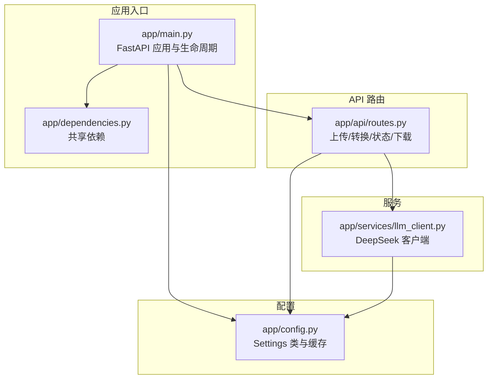
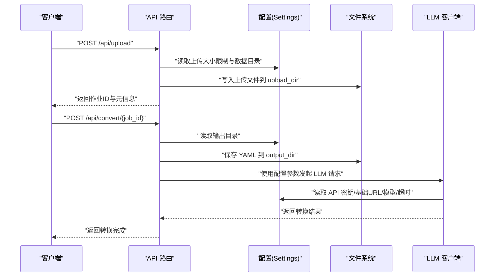
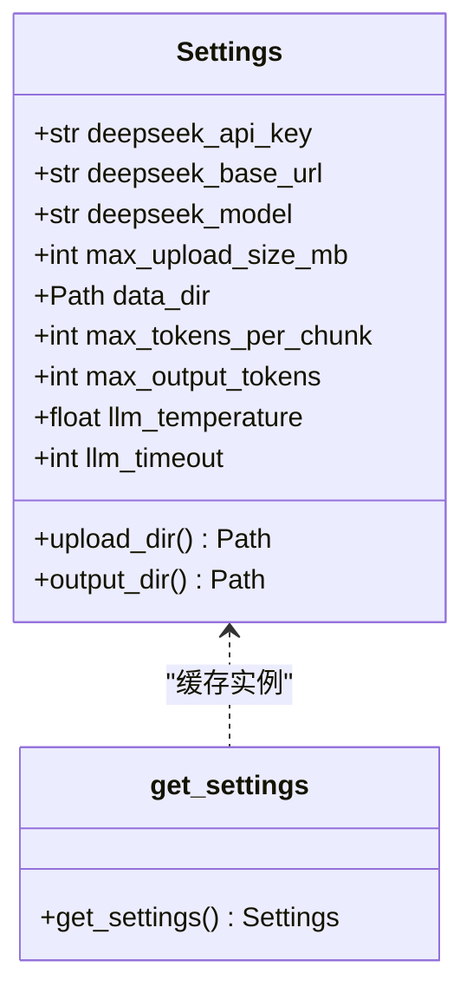
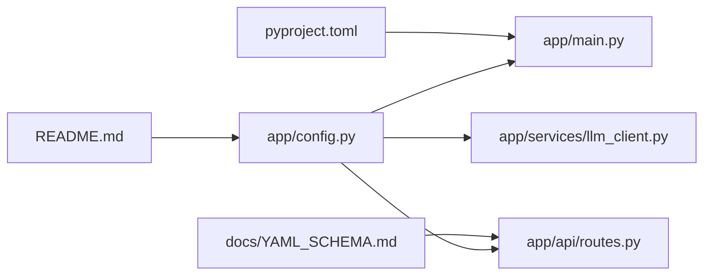

# 配置问题

<cite>
**本文引用的文件**
- [app/config.py](file://app/config.py)
- [app/main.py](file://app/main.py)
- [app/dependencies.py](file://app/dependencies.py)
- [app/api/routes.py](file://app/api/routes.py)
- [app/services/llm_client.py](file://app/services/llm_client.py)
- [pyproject.toml](file://pyproject.toml)
- [README.md](file://README.md)
- [docs/YAML_SCHEMA.md](file://docs/YAML_SCHEMA.md)
</cite>

## 目录
1. [简介](#简介)
2. [项目结构](#项目结构)
3. [核心组件](#核心组件)
4. [架构总览](#架构总览)
5. [详细组件分析](#详细组件分析)
6. [依赖分析](#依赖分析)
7. [性能考虑](#性能考虑)
8. [故障排除指南](#故障排除指南)
9. [结论](#结论)
10. [附录](#附录)

## 简介
本指南聚焦于配置相关问题的系统化排查与修复，覆盖以下方面：
- API密钥配置错误的诊断与修复（环境变量、配置文件、权限）
- 文件上传大小限制、存储路径、输出格式等配置项的检查与调整
- 配置验证方法与工具（语法检查、默认值验证、兼容性测试）
- 安全配置最佳实践与常见陷阱规避

## 项目结构
该应用使用 FastAPI 作为后端，配置通过 pydantic-settings 从 .env 文件与环境变量加载，并在启动时确保运行目录存在。路由层负责文件上传、转换流程控制与结果导出；LLM 客户端封装 DeepSeek API 调用，读取配置中的模型、超时与令牌上限等参数。

图表来源
- [app/main.py:14-46](file://app/main.py#L14-L46)
- [app/config.py:9-44](file://app/config.py#L9-L44)
- [app/api/routes.py:1-313](file://app/api/routes.py#L1-L313)
- [app/services/llm_client.py:18-103](file://app/services/llm_client.py#L18-L103)

章节来源
- [app/main.py:14-46](file://app/main.py#L14-L46)
- [app/config.py:9-44](file://app/config.py#L9-L44)
- [app/api/routes.py:1-313](file://app/api/routes.py#L1-L313)
- [app/services/llm_client.py:18-103](file://app/services/llm_client.py#L18-L103)

## 核心组件
- 配置类 Settings：集中定义所有配置项，支持从 .env 与环境变量加载，提供缓存以避免重复初始化。
- 应用生命周期：启动时确保上传与输出目录存在。
- API 路由：读取配置进行上传大小限制、存储路径与输出格式控制。
- LLM 客户端：读取配置中的 API 密钥、基础 URL、模型、超时与输出令牌上限。

章节来源
- [app/config.py:9-44](file://app/config.py#L9-L44)
- [app/main.py:14-21](file://app/main.py#L14-L21)
- [app/api/routes.py:68-112](file://app/api/routes.py#L68-L112)
- [app/services/llm_client.py:21-32](file://app/services/llm_client.py#L21-L32)

## 架构总览
下图展示配置在系统中的作用与调用链路。

图表来源
- [app/api/routes.py:68-112](file://app/api/routes.py#L68-L112)
- [app/api/routes.py:304-308](file://app/api/routes.py#L304-L308)
- [app/services/llm_client.py:21-32](file://app/services/llm_client.py#L21-L32)
- [app/config.py:24-39](file://app/config.py#L24-L39)

## 详细组件分析

### 配置类 Settings 分析
- 配置来源：优先从 .env 文件加载，支持 UTF-8 编码，额外字段会被忽略。
- 关键配置项：
  - API 密钥与基础 URL：用于 LLM 客户端初始化。
  - 模型名称：决定使用的 LLM 模型。
  - 上传大小限制：以 MB 为单位，用于上传文件大小校验。
  - 数据目录：根数据目录，生成上传与输出子目录。
  - LLM 参数：最大令牌数、温度、超时等。
- 目录属性：upload_dir 与 output_dir 基于 data_dir 动态生成。

图表来源
- [app/config.py:9-44](file://app/config.py#L9-L44)

章节来源
- [app/config.py:9-44](file://app/config.py#L9-L44)

### 应用生命周期与目录准备
- 在应用启动时，读取配置并确保上传与输出目录存在，避免后续写入失败。

章节来源
- [app/main.py:14-21](file://app/main.py#L14-L21)

### API 路由中的配置使用
- 上传接口：
  - 读取上传大小限制，超过阈值返回 413。
  - 写入上传文件至 upload_dir。
  - 解析文本并统计字数。
- 转换流程：
  - 读取输出目录，保存 YAML 至 output_dir。
  - 使用配置中的 LLM 参数与模型。
- 下载与预览：
  - 返回 YAML 或纯文本内容，媒体类型分别为 text/yaml 与 text/plain。

章节来源
- [app/api/routes.py:68-112](file://app/api/routes.py#L68-L112)
- [app/api/routes.py:304-308](file://app/api/routes.py#L304-L308)

### LLM 客户端与配置
- 初始化时读取配置中的 API 密钥、基础 URL、模型、超时与最大输出令牌数。
- 支持按需覆盖温度参数与 JSON 响应格式。
- 包含重试机制与异常记录。

章节来源
- [app/services/llm_client.py:21-32](file://app/services/llm_client.py#L21-L32)
- [app/services/llm_client.py:33-86](file://app/services/llm_client.py#L33-L86)

## 依赖分析
- 配置依赖 pydantic-settings，提供类型安全与环境变量加载。
- FastAPI 应用依赖配置进行目录准备与路由注册。
- LLM 客户端依赖配置进行 API 初始化。
- 项目脚本通过 pyproject.toml 中的入口点运行应用。

图表来源
- [app/config.py:9-44](file://app/config.py#L9-L44)
- [app/main.py:14-46](file://app/main.py#L14-L46)
- [app/api/routes.py:1-313](file://app/api/routes.py#L1-L313)
- [app/services/llm_client.py:18-103](file://app/services/llm_client.py#L18-L103)
- [pyproject.toml:34-35](file://pyproject.toml#L34-L35)
- [README.md:48-68](file://README.md#L48-L68)
- [docs/YAML_SCHEMA.md:1-496](file://docs/YAML_SCHEMA.md#L1-L496)

章节来源
- [pyproject.toml:34-35](file://pyproject.toml#L34-L35)
- [README.md:48-68](file://README.md#L48-L68)

## 性能考虑
- 上传大小限制直接影响内存占用与磁盘 IO，建议根据实际业务量与服务器资源合理设置。
- LLM 超时与最大输出令牌数影响请求耗时与成本，应结合模型能力与任务复杂度调整。
- 目录准备在启动阶段一次性完成，避免运行期频繁 IO。

[本节为通用指导，无需特定文件来源]

## 故障排除指南

### 一、API 密钥配置错误
- 症状
  - LLM 调用报错或返回认证失败。
  - 转换流程中断，出现连接超时或 401/403 错误。
- 诊断步骤
  - 确认 .env 文件已创建且包含 DEEPSEEK_API_KEY、DEEPSEEK_BASE_URL、DEEPSEEK_MODEL。
  - 检查环境变量是否正确导出（例如在 shell 中执行 echo $DEEPSEEK_API_KEY）。
  - 验证配置加载顺序：.env 优先于系统环境变量。
  - 在代码中确认 get_settings() 是否返回非空的 deepseek_api_key。
- 修复方法
  - 补充 .env 文件并填写正确的密钥与基础 URL。
  - 如需临时覆盖，可在请求体中传入 api_key，路由会将其写入作业上下文供 LLM 客户端使用。
  - 确保网络可达基础 URL，必要时配置代理。
- 相关实现参考
  - 配置加载与缓存：[app/config.py:9-44](file://app/config.py#L9-L44)
  - LLM 客户端初始化：[app/services/llm_client.py:21-32](file://app/services/llm_client.py#L21-L32)
  - 路由中对用户提供的 API Key 的处理：[app/api/routes.py:122-125](file://app/api/routes.py#L122-L125)

章节来源
- [app/config.py:9-44](file://app/config.py#L9-L44)
- [app/services/llm_client.py:21-32](file://app/services/llm_client.py#L21-L32)
- [app/api/routes.py:122-125](file://app/api/routes.py#L122-L125)

### 二、环境变量设置与配置文件格式
- 症状
  - 应用启动时报错找不到配置项或类型不匹配。
  - 配置未生效或被覆盖。
- 诊断步骤
  - 检查 .env 文件是否存在且编码为 UTF-8。
  - 确认配置项命名与 Settings 中一致（如 DEEPSEEK_API_KEY、MAX_UPLOAD_SIZE_MB、DATA_DIR）。
  - 使用 pydantic-settings 的类型校验能力，确保数值、路径等类型正确。
- 修复方法
  - 按 README 的示例创建 .env 文件并填入对应值。
  - 避免在 .env 中使用引号包裹整数类型（如 MAX_UPLOAD_SIZE_MB=50 而非 "50"）。
  - 若使用容器部署，确保环境变量注入正确。
- 相关实现参考
  - 配置加载与类型校验：[app/config.py:12-16](file://app/config.py#L12-L16)
  - README 中的配置示例：[README.md:48-60](file://README.md#L48-L60)

章节来源
- [app/config.py:12-16](file://app/config.py#L12-L16)
- [README.md:48-60](file://README.md#L48-L60)

### 三、权限验证问题
- 症状
  - 上传或导出失败，提示权限不足。
  - 目录不存在导致写入异常。
- 诊断步骤
  - 检查 DATA_DIR 指向的目录是否存在且具备写权限。
  - 确认上传目录 upload_dir 与输出目录 output_dir 是否可写。
  - 在启动日志中确认目录创建成功。
- 修复方法
  - 创建 DATA_DIR 指定的目录并赋予写权限。
  - 确保运行用户对 DATA_DIR 及其子目录有读写权限。
  - 如使用 Docker，挂载卷时注意权限映射。
- 相关实现参考
  - 生命周期中目录准备：[app/main.py:17-19](file://app/main.py#L17-L19)
  - 目录属性定义：[app/config.py:33-39](file://app/config.py#L33-L39)

章节来源
- [app/main.py:17-19](file://app/main.py#L17-L19)
- [app/config.py:33-39](file://app/config.py#L33-L39)

### 四、文件上传大小限制
- 症状
  - 上传大文件时报 413 Payload Too Large。
- 诊断步骤
  - 检查 MAX_UPLOAD_SIZE_MB 的值是否过小。
  - 确认前端上传组件未强制限制文件大小。
- 修复方法
  - 在 .env 中增大 MAX_UPLOAD_SIZE_MB。
  - 对应调整 Web 服务器（如 Nginx/Uvicorn）的上传大小限制。
- 相关实现参考
  - 上传大小限制逻辑：[app/api/routes.py:81-83](file://app/api/routes.py#L81-L83)
  - 配置项定义：[app/config.py:24](file://app/config.py#L24)

章节来源
- [app/api/routes.py:81-83](file://app/api/routes.py#L81-L83)
- [app/config.py:24](file://app/config.py#L24)

### 五、存储路径配置
- 症状
  - 上传文件未保存或输出文件未生成。
- 诊断步骤
  - 检查 DATA_DIR 是否指向有效路径。
  - 确认 upload_dir 与 output_dir 存在且可写。
- 修复方法
  - 修改 DATA_DIR 为绝对路径或相对路径下的可写目录。
  - 确保启动时目录准备逻辑正常执行。
- 相关实现参考
  - 目录属性与生命周期准备：[app/config.py:33-39](file://app/config.py#L33-L39), [app/main.py:17-19](file://app/main.py#L17-L19)

章节来源
- [app/config.py:33-39](file://app/config.py#L33-L39)
- [app/main.py:17-19](file://app/main.py#L17-L19)

### 六、输出格式设置
- 症状
  - 下载的 YAML 文件无法被下游工具识别或渲染异常。
- 诊断步骤
  - 确认 YAML Schema 版本与下游工具兼容。
  - 检查生成的 YAML 是否满足 Schema 的字段约束与枚举值。
- 修复方法
  - 使用 docs/YAML_SCHEMA.md 中的字段定义与示例进行比对。
  - 确保 metadata、characters、structure 等顶层结构完整。
- 相关实现参考
  - 下载与预览接口的媒体类型：[app/api/routes.py:170-198](file://app/api/routes.py#L170-L198)
  - YAML Schema 定义：[docs/YAML_SCHEMA.md:1-496](file://docs/YAML_SCHEMA.md#L1-L496)

章节来源
- [app/api/routes.py:170-198](file://app/api/routes.py#L170-L198)
- [docs/YAML_SCHEMA.md:1-496](file://docs/YAML_SCHEMA.md#L1-L496)

### 七、配置验证方法与工具
- 语法检查
  - 使用 pydantic-settings 的类型校验，确保 .env 中的值类型正确。
  - 在 CI 中添加类型检查步骤，避免运行时错误。
- 默认值验证
  - 通过 get_settings() 获取配置实例，检查关键字段是否为预期默认值。
- 兼容性测试
  - 使用 README 中的配置示例运行应用，验证基本功能。
  - 对比不同版本的 YAML Schema，确保输出兼容。
- 相关实现参考
  - 配置加载与缓存：[app/config.py:42-44](file://app/config.py#L42-L44)
  - README 中的配置示例与启动命令：[README.md:48-68](file://README.md#L48-L68)

章节来源
- [app/config.py:42-44](file://app/config.py#L42-L44)
- [README.md:48-68](file://README.md#L48-L68)

### 八、安全配置最佳实践
- 密钥管理
  - 不要在代码仓库中提交 .env 或密钥文件。
  - 使用只读权限的最小权限账户运行服务。
- 网络与代理
  - 仅允许必要的网络访问，必要时通过代理访问外部 API。
- 输入与输出
  - 严格限制上传文件类型与大小，避免恶意文件。
  - 对输出文件进行最小权限保护，防止未授权访问。
- 相关实现参考
  - LLM 客户端超时与重试：[app/services/llm_client.py:33-86](file://app/services/llm_client.py#L33-L86)
  - 上传大小限制：[app/api/routes.py:81-83](file://app/api/routes.py#L81-L83)

章节来源
- [app/services/llm_client.py:33-86](file://app/services/llm_client.py#L33-L86)
- [app/api/routes.py:81-83](file://app/api/routes.py#L81-L83)

### 九、常见配置陷阱与规避
- 陷阱
  - 忘记创建 .env 或字段拼写错误。
  - 将整数类型用引号包裹导致类型不匹配。
  - DATA_DIR 指向不可写目录或相对路径解析错误。
  - 未设置上传大小限制导致大文件上传失败。
- 规避方法
  - 使用 README 的 .env 示例模板。
  - 在启动前打印 get_settings() 的关键配置项进行核对。
  - 使用绝对路径作为 DATA_DIR，并在启动日志中确认目录创建成功。
  - 根据业务需求设置合理的 MAX_UPLOAD_SIZE_MB。
- 相关实现参考
  - 配置项与默认值：[app/config.py:18-31](file://app/config.py#L18-L31)
  - 启动日志与目录准备：[app/main.py:17-19](file://app/main.py#L17-L19)

章节来源
- [app/config.py:18-31](file://app/config.py#L18-L31)
- [app/main.py:17-19](file://app/main.py#L17-L19)

## 结论
- 配置问题的核心在于“来源正确、类型匹配、权限充足、路径可用”。
- 建议在部署前完成 .env 模板校验、默认值核对与目录权限检查。
- 出现问题时，优先检查 .env 与环境变量、DATA_DIR 权限、上传大小限制与 LLM 客户端初始化参数。

[本节为总结，无需特定文件来源]

## 附录
- 快速核对清单
  - .env 已创建且包含 DEEPSEEK_API_KEY、DEEPSEEK_BASE_URL、DEEPSEEK_MODEL、MAX_UPLOAD_SIZE_MB、DATA_DIR。
  - 环境变量导出正确，编码为 UTF-8。
  - DATA_DIR 可写，upload_dir 与 output_dir 存在。
  - 上传大小限制满足业务需求。
  - YAML 输出符合 docs/YAML_SCHEMA.md 的结构与枚举约束。
- 参考文档
  - 配置项与默认值：[README.md:165-174](file://README.md#L165-L174)
  - YAML Schema 定义：[docs/YAML_SCHEMA.md:1-496](file://docs/YAML_SCHEMA.md#L1-L496)

[本节为补充材料，无需特定文件来源]