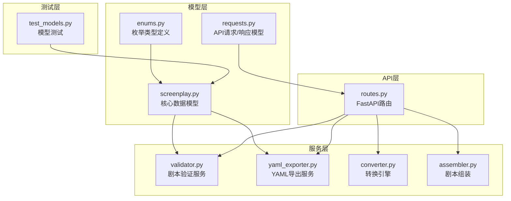
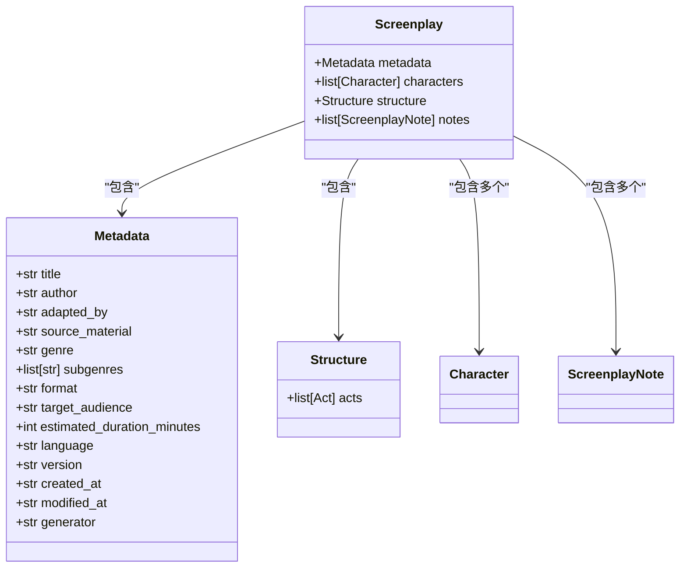
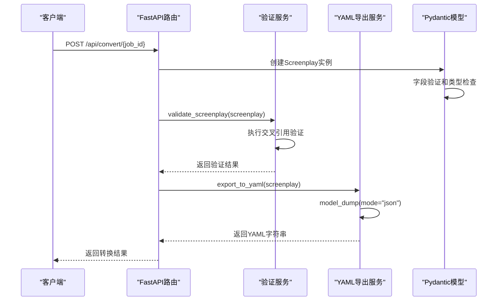
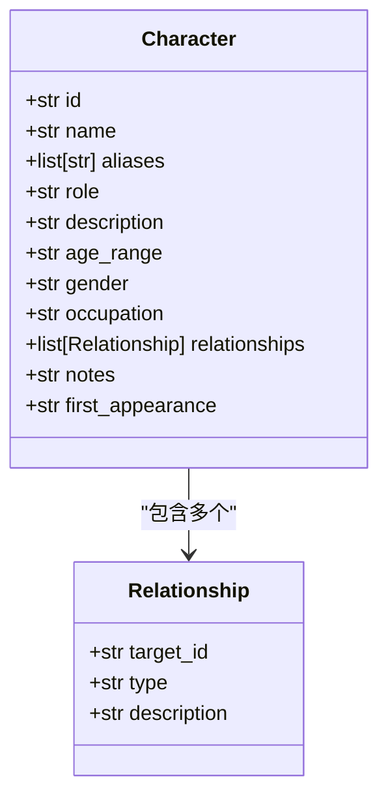
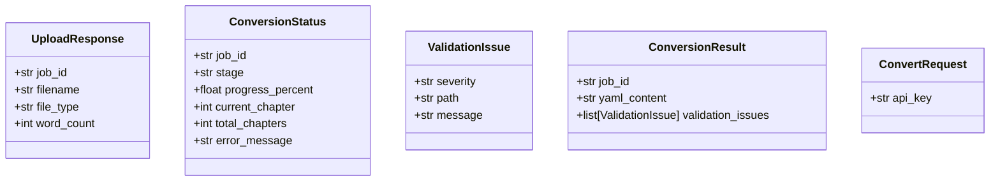
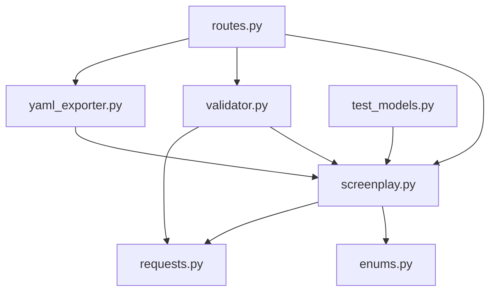

# Pydantic模型实现

<cite>
**本文档引用的文件**
- [app/models/screenplay.py](file://app/models/screenplay.py)
- [app/models/enums.py](file://app/models/enums.py)
- [app/models/requests.py](file://app/models/requests.py)
- [app/services/validator.py](file://app/services/validator.py)
- [app/services/yaml_exporter.py](file://app/services/yaml_exporter.py)
- [app/api/routes.py](file://app/api/routes.py)
- [tests/test_models.py](file://tests/test_models.py)
- [docs/YAML_SCHEMA.md](file://docs/YAML_SCHEMA.md)
- [README.md](file://README.md)
</cite>

## 目录
1. [简介](#简介)
2. [项目结构](#项目结构)
3. [核心组件](#核心组件)
4. [架构概览](#架构概览)
5. [详细组件分析](#详细组件分析)
6. [依赖关系分析](#依赖关系分析)
7. [性能考虑](#性能考虑)
8. [故障排除指南](#故障排除指南)
9. [结论](#结论)

## 简介

本文档详细介绍了小说转剧本工具中的Pydantic模型实现。该系统采用Pydantic v2作为数据验证和序列化的核心，构建了一个完整的剧本数据模型体系，支持从原始小说文本到结构化YAML剧本的转换。

系统的核心设计理念是"单一真实来源"（Single Source of Truth），所有数据模型都基于Pydantic BaseModel，确保数据验证、序列化和JSON Schema生成的一致性。模型设计遵循行业标准，特别是Fountain剧本标记标准和WGA（美国编剧工会）格式规范。

## 项目结构

该项目采用模块化架构，主要包含以下核心模块：



**图表来源**
- [app/models/screenplay.py:1-167](file://app/models/screenplay.py#L1-L167)
- [app/models/enums.py:1-83](file://app/models/enums.py#L1-L83)
- [app/models/requests.py:1-41](file://app/models/requests.py#L1-L41)

**章节来源**
- [README.md:77-108](file://README.md#L77-L108)

## 核心组件

### 根模型 Screenplay

Screenplay是整个系统的根模型，代表完整的剧本结构。它采用组合模式，将元数据、角色目录、结构层次和注释组织在一个统一的数据模型中。



**图表来源**
- [app/models/screenplay.py:161-167](file://app/models/screenplay.py#L161-L167)
- [app/models/screenplay.py:17-39](file://app/models/screenplay.py#L17-L39)
- [app/models/screenplay.py:145-148](file://app/models/screenplay.py#L145-L148)

### Discriminated Union 模式

系统实现了强大的Discriminated Union模式，用于统一处理不同类型的场景元素。通过`ScreenplayElement`联合类型和`type`字段鉴别器，实现了类型安全的多态处理。

```mermaid
classDiagram
class ScreenplayElement {
<<union>>
+ActionElement
+DialogueElement
+ParentheticalElement
+TransitionElement
+NoteElement
}
class ActionElement {
+Literal["action"] type
+str text
+str importance
}
class DialogueElement {
+Literal["dialogue"] type
+str character_id
+str character_name
+str parenthetical
+str line
+bool continuation
}
class ParentheticalElement {
+Literal["parenthetical"] type
+str character_id
+str text
}
class TransitionElement {
+Literal["transition"] type
+str style
+str description
}
class NoteElement {
+Literal["note"] type
+str content
+str author
}
ScreenplayElement --> ActionElement : "鉴别器 : type='action'"
ScreenplayElement --> DialogueElement : "鉴别器 : type='dialogue'"
ScreenplayElement --> ParentheticalElement : "鉴别器 : type='parenthetical'"
ScreenplayElement --> TransitionElement : "鉴别器 : type='transition'"
ScreenplayElement --> NoteElement : "鉴别器 : type='note'"
```

**图表来源**
- [app/models/screenplay.py:105-108](file://app/models/screenplay.py#L105-L108)
- [app/models/screenplay.py:67-103](file://app/models/screenplay.py#L67-L103)

### 枚举类型系统

系统提供了完整的枚举类型定义，确保数据的一致性和类型安全性：

| 枚举类型 | 可能值 | 描述 |
|---------|--------|------|
| RoleType | protagonist, antagonist, supporting, minor, extra | 角色类型分类 |
| TimeOfDay | DAY, NIGHT, DAWN, DUSK, CONTINUOUS, LATER, MOMENTS_LATER | 场景时间分类 |
| IntExt | INT, EXT, INT_EXT, EXT_INT | 室内外场景标识 |
| ElementType | action, dialogue, parenthetical, transition, note | 元素类型 |
| TransitionType | CUT_TO, FADE_OUT, FADE_TO_BLACK, DISSOLVE_TO, SMASH_CUT, MATCH_CUT, WIPE_TO, INTERCUT, MONTAGE, TIME_LAPSE | 转场类型 |
| ScreenplayFormat | feature_film, tv_episode, miniseries, short_film | 剧本格式 |

**章节来源**
- [app/models/enums.py:6-83](file://app/models/enums.py#L6-L83)

## 架构概览

系统采用分层架构，从底层的数据模型到上层的服务层，再到API接口层，形成了完整的数据处理流水线。



**图表来源**
- [app/api/routes.py:219-313](file://app/api/routes.py#L219-L313)
- [app/services/validator.py:11-111](file://app/services/validator.py#L11-L111)
- [app/services/yaml_exporter.py:14-57](file://app/services/yaml_exporter.py#L14-L57)

## 详细组件分析

### Metadata 元数据模型

Metadata模型负责存储剧本的基本信息，包括标题、作者、适配者、源材料等元数据字段。

**关键特性：**
- 必填字段：title、author、genre
- 自动时间戳：created_at和modified_at使用UTC时间
- 默认值：adapted_by、format、language、version等字段提供合理默认值
- 生成器信息：记录生成该剧本的工具版本

**字段验证规则：**
- 所有必填字段必须存在且非空
- 时间戳字段必须符合ISO 8601格式
- 语言代码遵循ISO 639-1标准

### Character 角色模型

Character模型定义了剧本中的角色信息，采用扁平化设计便于跨场景引用。



**图表来源**
- [app/models/screenplay.py:50-63](file://app/models/screenplay.py#L50-L63)
- [app/models/screenplay.py:43-48](file://app/models/screenplay.py#L43-L48)

**设计原则：**
- 角色ID作为主键，在整个剧本中保持唯一性
- first_appearance字段自动计算，便于制作和选角
- relationships数组允许复杂的关系网络建模

### Scene 场景模型

Scene模型代表单个场景，包含场景标题、描述、环境设置、出场角色和场景元素序列。

**场景元素处理：**
- elements字段使用Discriminated Union，确保类型安全
- characters_present字段自动从对话元素中提取
- transition_out字段支持场景间的转场效果

### Act 幕模型

Act模型表示剧本的结构层次，通常对应三幕剧结构。

**关键属性：**
- number字段必须连续递增（1, 2, 3...）
- title和description提供幕的概述信息
- scenes字段包含该幕内的所有场景

### Structure 结构模型

Structure模型提供剧本的整体结构视图，采用层次化设计。

**设计特点：**
- acts字段按顺序排列
- 支持嵌套场景层次
- 便于渲染工具进行结构化输出

### API 请求/响应模型

系统还定义了API层的Pydantic模型，用于处理HTTP请求和响应。



**图表来源**
- [app/models/requests.py:6-41](file://app/models/requests.py#L6-L41)

## 依赖关系分析

系统中的依赖关系相对简单，主要体现了清晰的分层架构：



**图表来源**
- [app/models/screenplay.py:1-167](file://app/models/screenplay.py#L1-L167)
- [app/models/enums.py:1-83](file://app/models/enums.py#L1-L83)
- [app/models/requests.py:1-41](file://app/models/requests.py#L1-L41)
- [app/services/validator.py:1-111](file://app/services/validator.py#L1-L111)
- [app/services/yaml_exporter.py:1-57](file://app/services/yaml_exporter.py#L1-L57)
- [app/api/routes.py:1-313](file://app/api/routes.py#L1-L313)
- [tests/test_models.py:1-124](file://tests/test_models.py#L1-L124)

**章节来源**
- [app/models/screenplay.py:1-167](file://app/models/screenplay.py#L1-L167)

## 性能考虑

### 模型验证性能

系统在验证阶段采用了高效的算法设计：

1. **早期失败**：在发现严重错误时立即停止进一步验证
2. **集合查找优化**：使用集合(set)进行O(1)字符ID查找
3. **流式处理**：支持大型剧本的增量验证

### 序列化性能

YAML导出服务针对大型数据集进行了优化：

1. **内存效率**：使用StringIO避免中间缓冲区
2. **Unicode支持**：正确处理多语言字符
3. **格式控制**：保持YAML的可读性和一致性

### 内存管理

- 使用default_factory避免不必要的列表创建
- 字符串字段使用None作为可选值
- 按需加载大型文件内容

## 故障排除指南

### 常见验证错误

**角色引用错误：**
- 症状：DialogueElement或ParentheticalElement的character_id不存在
- 解决方案：确保所有角色ID在characters数组中定义

**编号不连续：**
- 症状：Act.number与索引不匹配
- 解决方案：确保Act.number按1, 2, 3...顺序递增

**结构完整性错误：**
- 症状：缺少必需字段或空结构
- 解决方案：检查metadata.title、至少一个act、每个act至少一个scene、每个scene至少一个element

### JSON Schema生成

系统支持自动生成JSON Schema，用于前端验证和IDE支持：

```python
# 示例：生成JSON Schema
schema = Screenplay.model_json_schema()
```

**Schema特性：**
- 包含完整的字段描述和约束
- 支持Discriminated Union的类型推断
- 提供默认值和示例数据

### 测试策略

系统包含全面的测试覆盖：

1. **单元测试**：验证单个模型的行为
2. **集成测试**：测试模型间的交互
3. **端到端测试**：验证完整转换流程
4. **回归测试**：确保向后兼容性

**章节来源**
- [tests/test_models.py:22-124](file://tests/test_models.py#L22-L124)

## 结论

该Pydantic模型实现展现了现代数据验证和序列化系统的最佳实践。通过精心设计的数据模型、完善的枚举系统和强大的Discriminated Union模式，系统实现了类型安全、易于维护和高度可扩展的数据处理能力。

**主要优势：**
- 类型安全：编译时和运行时双重验证
- 可扩展性：支持未来功能扩展而不破坏现有结构
- 可读性：清晰的字段命名和结构设计
- 互操作性：符合行业标准的YAML格式

**应用场景：**
- 小说到剧本的自动化转换
- 剧本数据的结构化存储
- 多平台数据交换和同步
- AI辅助创作工具的数据模型

该实现为类似的数据建模项目提供了优秀的参考范例，特别是在需要强类型验证和复杂数据结构的场景中。