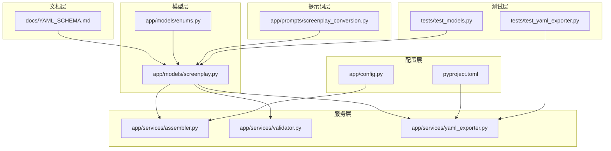
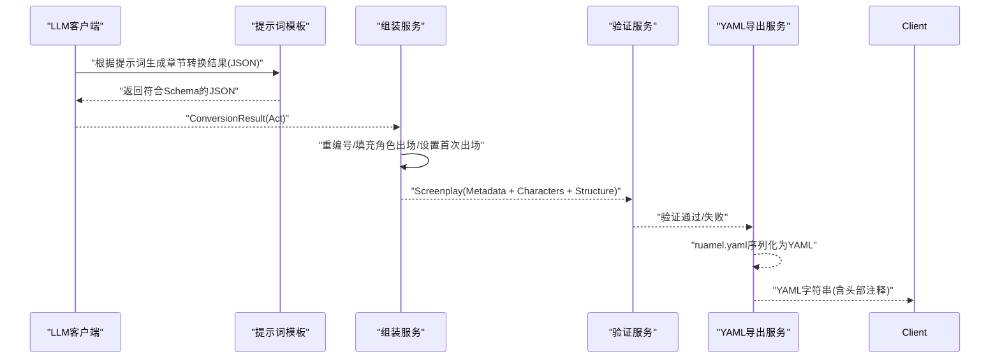
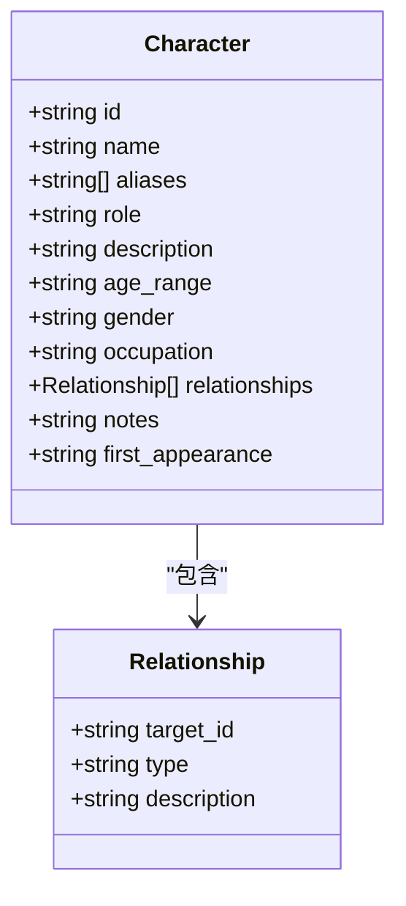
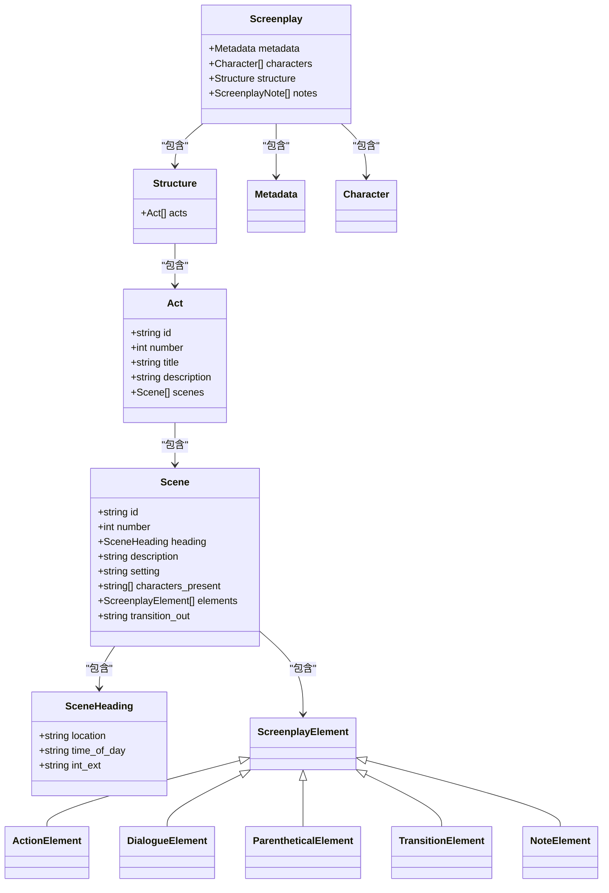
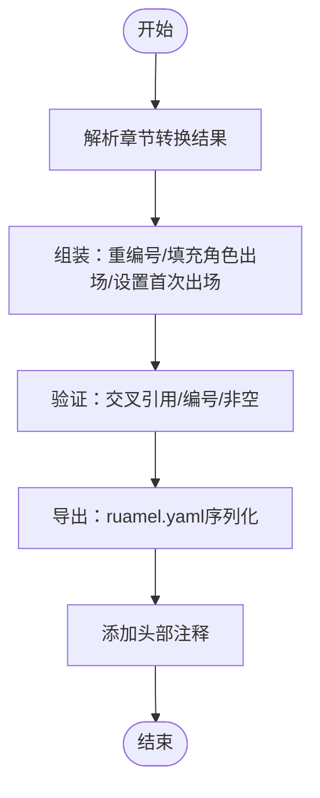
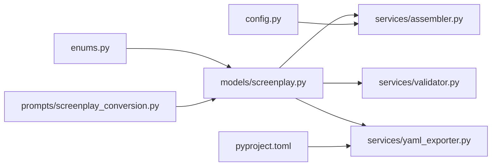

# YAML Schema设计

<cite>
**本文档引用的文件**
- [docs/YAML_SCHEMA.md](file://docs/YAML_SCHEMA.md)
- [app/models/screenplay.py](file://app/models/screenplay.py)
- [app/models/enums.py](file://app/models/enums.py)
- [app/services/yaml_exporter.py](file://app/services/yaml_exporter.py)
- [app/services/validator.py](file://app/services/validator.py)
- [app/services/assembler.py](file://app/services/assembler.py)
- [app/prompts/screenplay_conversion.py](file://app/prompts/screenplay_conversion.py)
- [app/models/requests.py](file://app/models/requests.py)
- [README.md](file://README.md)
- [pyproject.toml](file://pyproject.toml)
- [app/config.py](file://app/config.py)
- [tests/test_yaml_exporter.py](file://tests/test_yaml_exporter.py)
- [tests/test_models.py](file://tests/test_models.py)
</cite>

## 目录
1. [简介](#简介)
2. [项目结构](#项目结构)
3. [核心组件](#核心组件)
4. [架构总览](#架构总览)
5. [详细组件分析](#详细组件分析)
6. [依赖关系分析](#依赖关系分析)
7. [性能考虑](#性能考虑)
8. [故障排除指南](#故障排除指南)
9. [结论](#结论)
10. [附录](#附录)

## 简介
本文件系统化阐述项目采用的剧本数据结构标准，即“YAML Schema”。该Schema以三层结构为核心：metadata元数据层、characters角色层、structure结构层，并通过Pydantic模型实现强类型约束与JSON Schema生成；通过ruamel.yaml实现稳定、可往返的YAML序列化；通过验证服务确保结构完整性与一致性。Schema同时参考了Fountain标准与Final Draft的层级组织，适配AI生成内容的特点，提供版本控制与向后兼容保障，并给出完整的示例与字段说明。

## 项目结构
项目采用模块化分层设计：
- 文档层：docs/YAML_SCHEMA.md 提供Schema设计说明、字段定义、渲染规则与版本控制策略
- 模型层：app/models/screenplay.py 定义Pydantic模型，作为Schema的权威实现
- 枚举层：app/models/enums.py 定义枚举类型，统一约束字段取值
- 服务层：app/services/* 实现转换、组装、验证、导出等核心流程
- 提示词层：app/prompts/screenplay_conversion.py 定义LLM提示模板，指导AI生成符合Schema的结构化内容
- 配置层：app/config.py 与 pyproject.toml 提供运行时配置与依赖声明
- 测试层：tests/* 验证模型、导出与流程正确性

图表来源
- [docs/YAML_SCHEMA.md:1-496](file://docs/YAML_SCHEMA.md#L1-L496)
- [app/models/screenplay.py:1-167](file://app/models/screenplay.py#L1-L167)
- [app/models/enums.py:1-83](file://app/models/enums.py#L1-L83)
- [app/services/assembler.py:1-101](file://app/services/assembler.py#L1-L101)
- [app/services/validator.py:1-111](file://app/services/validator.py#L1-L111)
- [app/services/yaml_exporter.py:1-57](file://app/services/yaml_exporter.py#L1-L57)
- [app/prompts/screenplay_conversion.py:1-91](file://app/prompts/screenplay_conversion.py#L1-L91)
- [app/config.py:1-45](file://app/config.py#L1-L45)
- [pyproject.toml:1-47](file://pyproject.toml#L1-L47)
- [tests/test_models.py:1-124](file://tests/test_models.py#L1-L124)
- [tests/test_yaml_exporter.py:1-58](file://tests/test_yaml_exporter.py#L1-L58)

章节来源
- [README.md:77-108](file://README.md#L77-L108)
- [pyproject.toml:8-25](file://pyproject.toml#L8-L25)

## 核心组件
- 元数据层（metadata）：描述作品基本信息、版本、时间戳、生成器等
- 角色层（characters）：角色目录，包含角色标识、显示名、别名、角色定位、关系、首次出场等
- 结构层（structure）：三幕式结构，包含幕（Act）、场景（Scene）、场景标题（SceneHeading）与元素（Element）
- 元素类型（Element）：动作（action）、对白（dialogue）、括号指示（parenthetical）、转场（transition）、注释（note）
- 枚举类型：角色类型、时间、室内/室外、转场类型、格式、重要性等
- 验证规则：跨引用一致性、编号连续性、非空约束等

章节来源
- [docs/YAML_SCHEMA.md:25-34](file://docs/YAML_SCHEMA.md#L25-L34)
- [docs/YAML_SCHEMA.md:40-240](file://docs/YAML_SCHEMA.md#L40-L240)
- [app/models/screenplay.py:17-167](file://app/models/screenplay.py#L17-L167)
- [app/models/enums.py:6-83](file://app/models/enums.py#L6-L83)

## 架构总览
Schema的实现遵循“模型驱动”的设计：Pydantic模型作为Schema权威定义，配合枚举类型约束取值范围；服务层负责组装、验证与导出；提示词层指导AI生成符合Schema的结构化内容；文档层提供设计说明与渲染规则。

图表来源
- [app/prompts/screenplay_conversion.py:1-91](file://app/prompts/screenplay_conversion.py#L1-L91)
- [app/services/assembler.py:18-50](file://app/services/assembler.py#L18-L50)
- [app/services/validator.py:11-111](file://app/services/validator.py#L11-L111)
- [app/services/yaml_exporter.py:14-57](file://app/services/yaml_exporter.py#L14-L57)

## 详细组件分析

### 元数据层（Metadata）
- 字段职责：作品标题、原作作者、改编者、来源材料、主/次类型、格式、目标受众、时长估算、语言、Schema版本、创建/修改时间、生成器
- 设计要点：保持扁平结构便于编辑；时间戳与生成器可覆盖但默认自动生成；格式字段使用枚举约束下游行为
- 与渲染映射：用于生成YAML头部注释与最终渲染的全局信息

章节来源
- [docs/YAML_SCHEMA.md:40-62](file://docs/YAML_SCHEMA.md#L40-L62)
- [app/models/screenplay.py:17-39](file://app/models/screenplay.py#L17-L39)
- [app/models/enums.py:57-63](file://app/models/enums.py#L57-L63)

### 角色层（Characters）
- 角色目录：唯一标识符（slug）、显示名、别名、角色定位、描述、年龄范围、性别、职业、关系、备注、首次出场
- 关系（Relationship）：目标角色ID、关系类型、简要描述
- 设计要点：角色存储为平面目录，ID为稳定引用；首次出场自动计算；关系完整性由验证服务检查

图表来源
- [app/models/screenplay.py:50-63](file://app/models/screenplay.py#L50-L63)
- [app/models/screenplay.py:43-48](file://app/models/screenplay.py#L43-L48)

章节来源
- [docs/YAML_SCHEMA.md:63-82](file://docs/YAML_SCHEMA.md#L63-L82)
- [app/models/screenplay.py:50-63](file://app/models/screenplay.py#L50-L63)

### 结构层（Structure）
- 三幕式结构：Act包含多个Scene；Scene包含SceneHeading与有序元素数组
- SceneHeading：地点、时间段、室内/室外
- 元素类型（Discriminated Union）：action、dialogue、parenthetical、transition、note
- 设计要点：元素类型通过type字段区分；场景内元素顺序决定呈现顺序；转场可标注在场景末尾

图表来源
- [app/models/screenplay.py:161-167](file://app/models/screenplay.py#L161-L167)
- [app/models/screenplay.py:145-148](file://app/models/screenplay.py#L145-L148)
- [app/models/screenplay.py:134-141](file://app/models/screenplay.py#L134-L141)
- [app/models/screenplay.py:120-130](file://app/models/screenplay.py#L120-L130)
- [app/models/screenplay.py:113-118](file://app/models/screenplay.py#L113-L118)
- [app/models/screenplay.py:67-108](file://app/models/screenplay.py#L67-L108)

章节来源
- [docs/YAML_SCHEMA.md:91-130](file://docs/YAML_SCHEMA.md#L91-L130)
- [docs/YAML_SCHEMA.md:130-240](file://docs/YAML_SCHEMA.md#L130-L240)
- [app/models/screenplay.py:113-167](file://app/models/screenplay.py#L113-L167)

### 元素类型详解
- ActionElement：动作描述，使用现在时态，支持重要性级别（key/standard/background）
- DialogueElement：对白，包含角色ID与显示名、台词、括号指示、是否延续
- ParentheticalElement：括号指示，描述动作细节或情绪
- TransitionElement：显式转场，支持多种类型（如Cut To、Fade Out、Time Lapse等）
- NoteElement：编辑注释，不参与最终渲染

章节来源
- [docs/YAML_SCHEMA.md:134-222](file://docs/YAML_SCHEMA.md#L134-L222)
- [app/models/screenplay.py:67-108](file://app/models/screenplay.py#L67-L108)
- [app/models/enums.py:34-55](file://app/models/enums.py#L34-L55)

### 枚举类型
- 角色类型：protagonist、antagonist、supporting、minor、extra
- 时间：DAY、NIGHT、DAWN、DUSK、CONTINUOUS、LATER、MOMENTS_LATER
- 室内/室外：INT、EXT、INT_EXT、EXT_INT
- 转场类型：CUT_TO、FADE_OUT、FADE_TO_BLACK、DISSOLVE_TO、SMASH_CUT、MATCH_CUT、WIPE_TO、INTERCUT、MONTAGE、TIME_LAPSE
- 格式：feature_film、tv_episode、miniseries、short_film
- 重要性：key、standard、background

章节来源
- [docs/YAML_SCHEMA.md:242-300](file://docs/YAML_SCHEMA.md#L242-L300)
- [app/models/enums.py:6-83](file://app/models/enums.py#L6-L83)

### 渲染指南
- Scene Heading：左对齐，全大写，例如“INT. BENNET HOUSE - DRAWING ROOM - DAY”
- Action：左对齐，现在时态
- Dialogue：居中块：角色名（全大写居中），随后是缩进的台词
- Parenthetical：居中，括号内，位于角色名与台词之间
- Transition：右对齐，全大写，例如“CUT TO:”
- Note：不渲染（仅编辑用途）

章节来源
- [docs/YAML_SCHEMA.md:303-316](file://docs/YAML_SCHEMA.md#L303-L316)

### 验证规则
- 角色引用：dialogue与parenthetical中的character_id必须存在于角色目录
- 编号连续：Act编号从1递增；场景编号全局递增
- 非空约束：至少一个Act；每个Act至少一个Scene；每个Scene至少一个元素
- ID唯一：角色ID与场景ID唯一
- 关系完整性：Relationship.target_id必须指向有效角色ID
- Scene Heading格式：location应为大写；time_of_day与int_ext使用有效枚举值

章节来源
- [docs/YAML_SCHEMA.md:318-329](file://docs/YAML_SCHEMA.md#L318-L329)
- [app/services/validator.py:11-111](file://app/services/validator.py#L11-L111)

### 版本控制与向后兼容
- Schema版本记录于metadata.version
- 版本演进策略：不移除现有字段、只添加可选字段、不改变字段类型、破坏性变更需在变更日志中记录

章节来源
- [docs/YAML_SCHEMA.md:488-496](file://docs/YAML_SCHEMA.md#L488-L496)

### 与Fountain与Final Draft的映射
- Fountain：元素类型（action、dialogue、parenthetical、transition）与Fountain的元素分类一致
- Final Draft：结构层级（Act → Scene → Elements）与Final Draft文档模型一致
- WGA：场景标题格式（INT/EXT. LOCATION - TIME）、现在时动作行、角色名约定遵循WGA标准

章节来源
- [docs/YAML_SCHEMA.md:17-22](file://docs/YAML_SCHEMA.md#L17-L22)

### AI生成适配
- LLM友好字段命名：避免缩写，使用清晰英文名称（如character_id、time_of_day、transition_out）
- 提示词模板：明确输出结构、场景标题规则、角色引用规则、元素类型与数量建议
- 连续性上下文：通过“滑动窗口 + 记忆”策略，每章转换后生成连续性摘要，传递给下一章，保证跨章节一致性

章节来源
- [docs/YAML_SCHEMA.md:13-15](file://docs/YAML_SCHEMA.md#L13-L15)
- [app/prompts/screenplay_conversion.py:1-91](file://app/prompts/screenplay_conversion.py#L1-L91)
- [README.md:10-11](file://README.md#L10-L11)

### 组装与导出流程
- 组装：重编号Act与Scene、填充characters_present、设置first_appearance
- 验证：检查结构完整性与交叉引用
- 导出：ruamel.yaml保留插入顺序、块样式、Unicode支持与注释，输出带头部注释的YAML

图表来源
- [app/services/assembler.py:18-50](file://app/services/assembler.py#L18-L50)
- [app/services/validator.py:11-111](file://app/services/validator.py#L11-L111)
- [app/services/yaml_exporter.py:14-57](file://app/services/yaml_exporter.py#L14-L57)

## 依赖关系分析
- 模型依赖：Screenplay依赖Metadata、Character、Structure；Structure依赖Act；Act依赖Scene；Scene依赖SceneHeading与ScreenplayElement；ScreenplayElement为联合类型
- 枚举依赖：各字段使用对应枚举约束取值
- 服务依赖：assembler依赖screenplay模型；validator依赖screenplay模型与请求模型；yaml_exporter依赖screenplay模型与ruamel.yaml
- 配置依赖：config提供运行时参数，pyproject声明依赖

图表来源
- [app/models/enums.py:1-83](file://app/models/enums.py#L1-L83)
- [app/models/screenplay.py:1-167](file://app/models/screenplay.py#L1-L167)
- [app/services/assembler.py:1-101](file://app/services/assembler.py#L1-L101)
- [app/services/validator.py:1-111](file://app/services/validator.py#L1-L111)
- [app/services/yaml_exporter.py:1-57](file://app/services/yaml_exporter.py#L1-L57)
- [app/prompts/screenplay_conversion.py:1-91](file://app/prompts/screenplay_conversion.py#L1-L91)
- [app/config.py:1-45](file://app/config.py#L1-L45)
- [pyproject.toml:1-47](file://pyproject.toml#L1-L47)

章节来源
- [app/models/screenplay.py:1-167](file://app/models/screenplay.py#L1-L167)
- [app/models/enums.py:1-83](file://app/models/enums.py#L1-L83)
- [app/services/assembler.py:1-101](file://app/services/assembler.py#L1-L101)
- [app/services/validator.py:1-111](file://app/services/validator.py#L1-L111)
- [app/services/yaml_exporter.py:1-57](file://app/services/yaml_exporter.py#L1-L57)

## 性能考虑
- 模型序列化：使用Pydantic的model_dump与ruamel.yaml，避免不必要的对象拷贝
- 验证复杂度：验证服务按Act/Scene/Element遍历，时间复杂度O(N)，适合批量处理
- 导出优化：ruamel.yaml配置indent与width，平衡可读性与体积
- LLM调用：通过连续性上下文减少重复信息，提高Token利用率

## 故障排除指南
- 角色引用错误：检查dialogue/parenthetical的character_id是否存在于角色目录
- 编号不连续：确认Act从1开始且递增；场景全局递增
- 场景无元素：为每个场景至少添加一个元素（action或dialogue）
- Scene Heading格式错误：location应为大写；time_of_day与int_ext使用有效枚举值
- 导出异常：确认ruamel.yaml已安装且配置正确；检查Unicode字符编码

章节来源
- [app/services/validator.py:11-111](file://app/services/validator.py#L11-L111)
- [app/services/yaml_exporter.py:14-57](file://app/services/yaml_exporter.py#L14-L57)
- [tests/test_yaml_exporter.py:10-58](file://tests/test_yaml_exporter.py#L10-L58)
- [tests/test_models.py:1-124](file://tests/test_models.py#L1-L124)

## 结论
本Schema以三层结构为核心，结合Pydantic强类型约束、ruamel.yaml稳定导出、严格验证规则与LLM友好设计，实现了从小说到剧本的高质量转换。其对Fountain与Final Draft的借鉴、对AI生成内容的适配、对版本控制与向后兼容的承诺，使其既满足专业编剧需求，又具备良好的扩展性与可维护性。

## 附录

### 完整Schema示例与字段说明
- 示例位置：docs/YAML_SCHEMA.md 中的“Complete Example”部分
- 字段说明：参见“Field Reference”与“Rendering Guide”
- 渲染规则：参见“Rendering Guide”

章节来源
- [docs/YAML_SCHEMA.md:331-473](file://docs/YAML_SCHEMA.md#L331-L473)
- [docs/YAML_SCHEMA.md:303-316](file://docs/YAML_SCHEMA.md#L303-L316)

### 扩展点
- 自定义字段：未知字段由解析器保留，下游工具可忽略
- 自定义元素类型：新增type值时，已知类型安全解析，未知类型可作为note处理
- 类型特定字段：如恐怖片可为action增加scare_level，音乐片可增加song元素
- 生产元数据：可在场景中添加预算、选角优先级、特效需求等字段

章节来源
- [docs/YAML_SCHEMA.md:477-485](file://docs/YAML_SCHEMA.md#L477-L485)