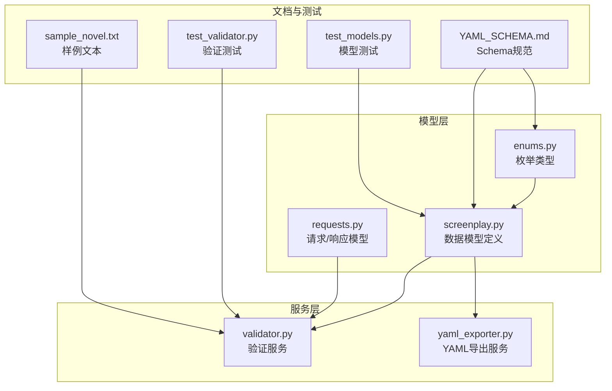
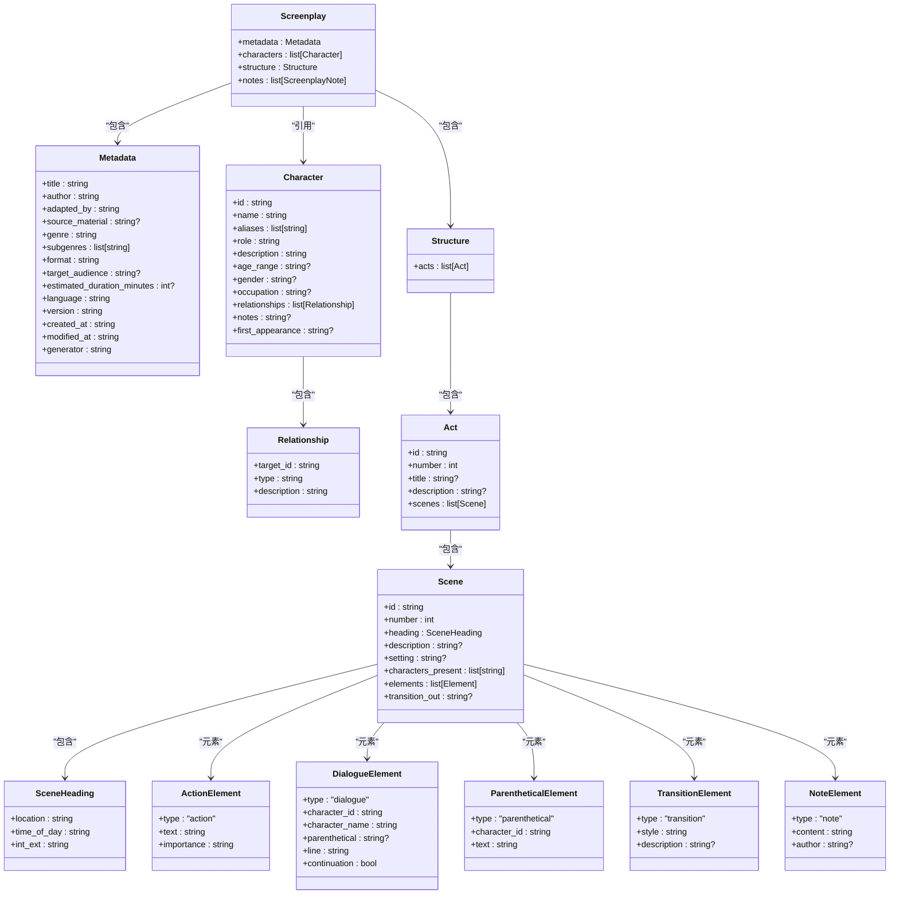
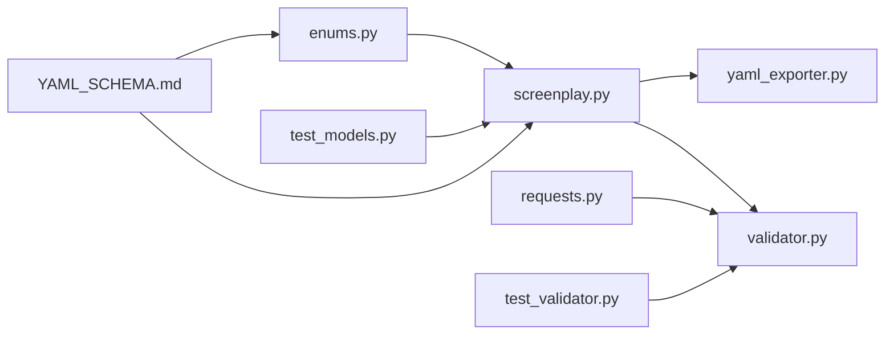
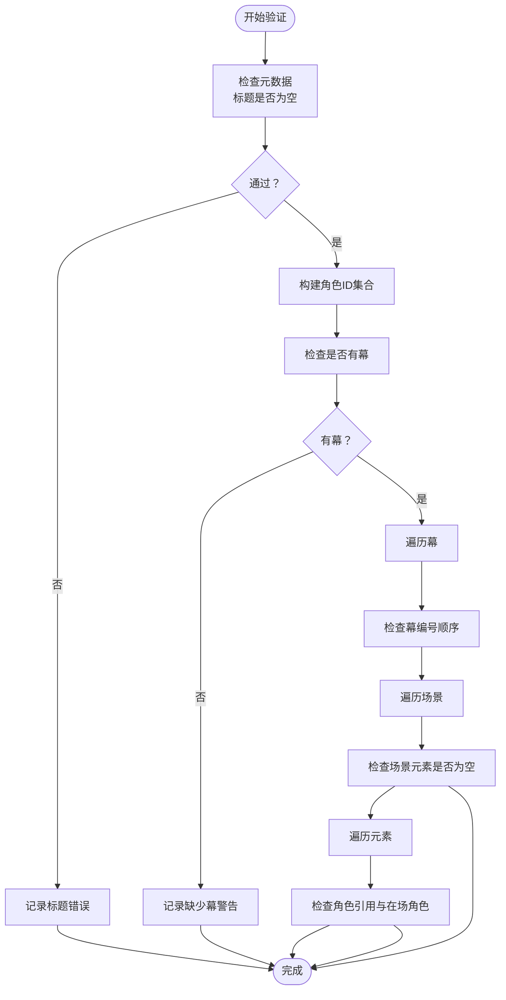

# 数据模型设计

<cite>
**本文档引用的文件**
- [app/models/screenplay.py](file://app/models/screenplay.py)
- [app/models/enums.py](file://app/models/enums.py)
- [app/models/requests.py](file://app/models/requests.py)
- [docs/YAML_SCHEMA.md](file://docs/YAML_SCHEMA.md)
- [app/services/validator.py](file://app/services/validator.py)
- [app/services/yaml_exporter.py](file://app/services/yaml_exporter.py)
- [tests/test_models.py](file://tests/test_models.py)
- [tests/test_validator.py](file://tests/test_validator.py)
- [tests/fixtures/sample_novel.txt](file://tests/fixtures/sample_novel.txt)
</cite>

## 目录
1. [简介](#简介)
2. [项目结构](#项目结构)
3. [核心组件](#核心组件)
4. [架构总览](#架构总览)
5. [详细组件分析](#详细组件分析)
6. [依赖关系分析](#依赖关系分析)
7. [性能考量](#性能考量)
8. [故障排除指南](#故障排除指南)
9. [结论](#结论)
10. [附录](#附录)

## 简介
本文件系统性阐述本项目的数据模型设计与YAML Schema定义，重点覆盖三层结构：metadata（元数据）、characters（角色）、structure（结构）。文档同时解析Pydantic模型的字段定义、数据类型、验证规则与默认值，并说明角色模型（Character）、章节模型（Chapter）、剧本元素模型（Element）等核心数据结构。此外，提供Schema验证规则与约束条件说明、数据模型关系图与依赖关系、LLM友好设计原则的体现，以及实际YAML示例与数据模型映射关系。

## 项目结构
项目采用按功能分层的组织方式：
- app/models：Pydantic数据模型与枚举定义
- app/services：业务服务（验证、导出等）
- docs：Schema规范文档
- tests：模型与验证测试用例
- app/api/routes.py：API路由（在本文件中未直接分析）

图表来源
- [app/models/screenplay.py:1-167](file://app/models/screenplay.py#L1-L167)
- [app/models/enums.py:1-83](file://app/models/enums.py#L1-L83)
- [app/models/requests.py:1-41](file://app/models/requests.py#L1-L41)
- [app/services/validator.py:1-111](file://app/services/validator.py#L1-L111)
- [app/services/yaml_exporter.py:1-57](file://app/services/yaml_exporter.py#L1-L57)
- [docs/YAML_SCHEMA.md:1-496](file://docs/YAML_SCHEMA.md#L1-L496)
- [tests/test_models.py:1-124](file://tests/test_models.py#L1-L124)
- [tests/test_validator.py:1-62](file://tests/test_validator.py#L1-L62)
- [tests/fixtures/sample_novel.txt:1-50](file://tests/fixtures/sample_novel.txt#L1-L50)

章节来源
- [app/models/screenplay.py:1-167](file://app/models/screenplay.py#L1-L167)
- [docs/YAML_SCHEMA.md:1-496](file://docs/YAML_SCHEMA.md#L1-L496)

## 核心组件
本节概述三类核心数据模型及其职责：
- 元数据（Metadata）：顶层工作信息，如标题、作者、格式、语言、版本、时间戳等
- 角色（Character）：角色目录，含角色ID、名称、别名、角色类型、描述、年龄、性别、职业、关系、备注、首次出场场景等
- 结构（Structure）：由Act（幕）与Scene（场）构成的层次化内容结构，每个Scene包含SceneHeading（场景标题）与有序的元素数组（Elements）

章节来源
- [app/models/screenplay.py:17-39](file://app/models/screenplay.py#L17-L39)
- [app/models/screenplay.py:50-63](file://app/models/screenplay.py#L50-L63)
- [app/models/screenplay.py:145-148](file://app/models/screenplay.py#L145-L148)

## 架构总览
下图展示数据模型之间的关系与依赖，强调“角色目录”作为全局引用源、“场景标题”与“元素”作为场景内核心构件，以及“结构”作为顶层容器。

图表来源
- [app/models/screenplay.py:17-167](file://app/models/screenplay.py#L17-L167)

## 详细组件分析

### 元数据（Metadata）模型
- 字段与类型：字符串、整数、可选字符串、枚举约束（通过schema规范限定取值范围）
- 默认值与自动填充：语言默认为中文；版本默认为固定版本号；创建/修改时间使用UTC时间戳自动填充
- 设计要点：扁平化存储便于编辑与检索；保留生成器信息以便溯源

章节来源
- [app/models/screenplay.py:17-39](file://app/models/screenplay.py#L17-L39)
- [docs/YAML_SCHEMA.md:40-62](file://docs/YAML_SCHEMA.md#L40-L62)

### 角色（Character）与关系（Relationship）模型
- 角色ID：唯一标识符，作为跨场景引用的锚点
- 关系：目标角色ID、关系类型、简要描述
- 设计要点：角色目录独立于场景，保证引用一致性；首次出场自动推断以辅助制作

章节来源
- [app/models/screenplay.py:43-63](file://app/models/screenplay.py#L43-L63)
- [docs/YAML_SCHEMA.md:63-90](file://docs/YAML_SCHEMA.md#L63-L90)

### 场景标题（SceneHeading）与场景（Scene）模型
- 场景标题：地点、时间段、内外景标记
- 场景：全局编号、描述、环境、在场角色列表、有序元素序列、转场类型
- 设计要点：结构化场景标题便于工具筛选；在场角色列表可自动汇总但允许手动扩展

章节来源
- [app/models/screenplay.py:113-130](file://app/models/screenplay.py#L113-L130)
- [app/models/screenplay.py:120-130](file://app/models/screenplay.py#L120-L130)
- [docs/YAML_SCHEMA.md:105-129](file://docs/YAML_SCHEMA.md#L105-L129)

### 剧本元素（Element）模型族
- 动作（ActionElement）：动作描述、重要性等级
- 对白（DialogueElement）：角色ID与显示名、对白文本、停顿方向、续接标记
- 副作用（ParentheticalElement）：角色ID与说明文字
- 转场（TransitionElement）：转场样式与上下文描述
- 注释（NoteElement）：仅用于编辑注释，不参与渲染
- 设计要点：通过类型字段进行判别联合（discriminated union），确保安全解析；对白中的显示名便于人类阅读，角色ID用于程序引用

章节来源
- [app/models/screenplay.py:67-108](file://app/models/screenplay.py#L67-L108)
- [docs/YAML_SCHEMA.md:130-222](file://docs/YAML_SCHEMA.md#L130-L222)

### 幕（Act）与结构（Structure）模型
- 幕：编号、标题、描述、场景集合
- 结构：幕列表
- 设计要点：三幕结构适配常见剧作框架；编号顺序性有助于节奏控制

章节来源
- [app/models/screenplay.py:134-141](file://app/models/screenplay.py#L134-L141)
- [app/models/screenplay.py:145-148](file://app/models/screenplay.py#L145-L148)
- [docs/YAML_SCHEMA.md:91-103](file://docs/YAML_SCHEMA.md#L91-L103)

### 全局注释（ScreenplayNote）与根模型（Screenplay）
- 全局注释：作用域（全局/特定场景）、内容、作者
- 根模型：元数据、角色目录、结构、注释集合
- 设计要点：根模型统一承载顶层信息，便于整体校验与导出

章节来源
- [app/models/screenplay.py:152-167](file://app/models/screenplay.py#L152-L167)

### 枚举类型（Enums）
- 角色类型、时间段、内外景、元素类型、转场类型、格式、重要性等级、转换阶段
- 设计要点：通过枚举约束取值，提升Schema稳定性与工具互操作性

章节来源
- [app/models/enums.py:6-83](file://app/models/enums.py#L6-L83)

### 请求/响应模型（API）
- 上传响应、转换状态、验证问题、转换结果、转换请求
- 设计要点：明确错误路径与严重级别，便于前端展示与用户修复

章节来源
- [app/models/requests.py:6-41](file://app/models/requests.py#L6-L41)

## 依赖关系分析
- 模型层内部依赖：元素类型通过判别联合聚合到场景元素数组；场景依赖场景标题与元素；结构依赖幕与场景；根模型依赖元数据、角色与结构
- 服务层依赖：验证服务依赖请求模型与元素类型；YAML导出服务依赖根模型
- 文档与测试：Schema规范指导模型设计；测试覆盖模型构造与验证逻辑

图表来源
- [app/models/enums.py:1-83](file://app/models/enums.py#L1-L83)
- [app/models/screenplay.py:1-167](file://app/models/screenplay.py#L1-L167)
- [app/models/requests.py:1-41](file://app/models/requests.py#L1-L41)
- [app/services/validator.py:1-111](file://app/services/validator.py#L1-L111)
- [app/services/yaml_exporter.py:1-57](file://app/services/yaml_exporter.py#L1-L57)
- [docs/YAML_SCHEMA.md:1-496](file://docs/YAML_SCHEMA.md#L1-L496)
- [tests/test_models.py:1-124](file://tests/test_models.py#L1-L124)
- [tests/test_validator.py:1-62](file://tests/test_validator.py#L1-L62)

## 性能考量
- 模型序列化：使用Pydantic的JSON模式导出，避免None字段，减少YAML体积
- 导出配置：ruamel.yaml保持块风格输出、保留插入顺序、支持Unicode与缩进，兼顾可读性与兼容性
- 验证复杂度：验证服务遍历结构树，时间复杂度与场景数量线性相关；字符ID集合查找为O(1)，整体高效

章节来源
- [app/services/yaml_exporter.py:14-57](file://app/services/yaml_exporter.py#L14-L57)
- [app/services/validator.py:11-111](file://app/services/validator.py#L11-L111)

## 故障排除指南
- 常见验证问题
  - 标题为空：元数据标题必填
  - 缺少幕或场景：至少包含一个幕与一个场景
  - 元素为空：每个场景至少包含一个元素
  - 角色引用无效：对白/副作用中的角色ID必须存在于角色目录
  - 在场角色无效：场景在场角色列表中的ID必须存在
- 定位方法：根据验证问题的路径定位到具体字段，结合Schema规范修正

图表来源
- [app/services/validator.py:11-111](file://app/services/validator.py#L11-L111)
- [docs/YAML_SCHEMA.md:318-328](file://docs/YAML_SCHEMA.md#L318-L328)

章节来源
- [app/services/validator.py:11-111](file://app/services/validator.py#L11-L111)
- [tests/test_validator.py:19-62](file://tests/test_validator.py#L19-L62)
- [docs/YAML_SCHEMA.md:318-328](file://docs/YAML_SCHEMA.md#L318-L328)

## 结论
本项目以Pydantic为核心，构建了清晰、稳定且LLM友好的数据模型体系。通过三层Schema（metadata、characters、structure）与判别联合元素类型，实现了可编辑、可验证、可渲染的YAML剧本格式。枚举类型与严格的验证规则确保了数据一致性与工具互操作性。文档与测试进一步保障了模型的正确性与可维护性。

## 附录

### YAML Schema设计原理与结构
- 三层结构
  - metadata：顶层工作信息，扁平化设计便于编辑与检索
  - characters：角色目录，作为全局引用锚点
  - structure：层次化内容，Act→Scene→Elements
- LLM友好设计
  - 字段命名清晰无歧义（如character_id、time_of_day、transition_out）
  - 提供渲染指南与示例，降低LLM填充难度
- 可扩展性
  - 支持自定义字段与元素类型，未来版本向后兼容

章节来源
- [docs/YAML_SCHEMA.md:7-16](file://docs/YAML_SCHEMA.md#L7-L16)
- [docs/YAML_SCHEMA.md:25-35](file://docs/YAML_SCHEMA.md#L25-L35)
- [docs/YAML_SCHEMA.md:303-315](file://docs/YAML_SCHEMA.md#L303-L315)
- [docs/YAML_SCHEMA.md:477-485](file://docs/YAML_SCHEMA.md#L477-L485)

### 数据模型与Schema映射关系
- 元数据 → metadata
- 角色 → characters[]
- 关系 → characters[].relationships[]
- 幕 → structure.acts[]
- 场景 → structure.acts[].scenes[]
- 场景标题 → structure.acts[].scenes[].heading
- 元素 → structure.acts[].scenes[].elements[]（通过type字段判别）

章节来源
- [app/models/screenplay.py:17-167](file://app/models/screenplay.py#L17-L167)
- [docs/YAML_SCHEMA.md:27-34](file://docs/YAML_SCHEMA.md#L27-L34)

### 实际YAML示例与数据模型映射
- 示例位置：Schema文档中的完整示例部分
- 映射要点
  - metadata：标题、作者、改编者、来源材料、类型、子类型、格式、受众、时长、语言、版本、时间戳、生成器
  - characters：角色ID、名称、别名、角色类型、描述、年龄范围、性别、职业、关系、备注、首次出场
  - structure：幕ID、序号、标题、描述、场景列表
  - scenes：场景ID、全局序号、场景标题、描述、环境、在场角色、元素数组、转场类型
  - elements：动作、对白（含角色ID与显示名）、副作用、转场、注释

章节来源
- [docs/YAML_SCHEMA.md:331-473](file://docs/YAML_SCHEMA.md#L331-L473)