# 枚举类型定义

<cite>
**本文档引用的文件**
- [app/models/enums.py](file://app/models/enums.py)
- [app/models/screenplay.py](file://app/models/screenplay.py)
- [app/prompts/screenplay_conversion.py](file://app/prompts/screenplay_conversion.py)
- [app/services/validator.py](file://app/services/validator.py)
- [docs/YAML_SCHEMA.md](file://docs/YAML_SCHEMA.md)
- [tests/test_models.py](file://tests/test_models.py)
</cite>

## 目录
1. [简介](#简介)
2. [项目结构](#项目结构)
3. [核心组件](#核心组件)
4. [架构概览](#架构概览)
5. [详细组件分析](#详细组件分析)
6. [依赖分析](#依赖分析)
7. [性能考虑](#性能考虑)
8. [故障排除指南](#故障排除指南)
9. [结论](#结论)
10. [附录](#附录)

## 简介

本文件详细介绍了项目中使用的所有枚举类型定义，重点涵盖角色类型（RoleType）、场景时间（TimeOfDay）、场景内外（IntExt）、元素重要性（ElementImportance）、过渡类型（TransitionType）等关键枚举。这些枚举确保了数据的一致性和有效性，为剧本转换工具提供了标准化的数据结构基础。

## 项目结构

项目采用分层架构设计，枚举类型主要位于模型层，服务于验证、转换和渲染等多个业务环节：

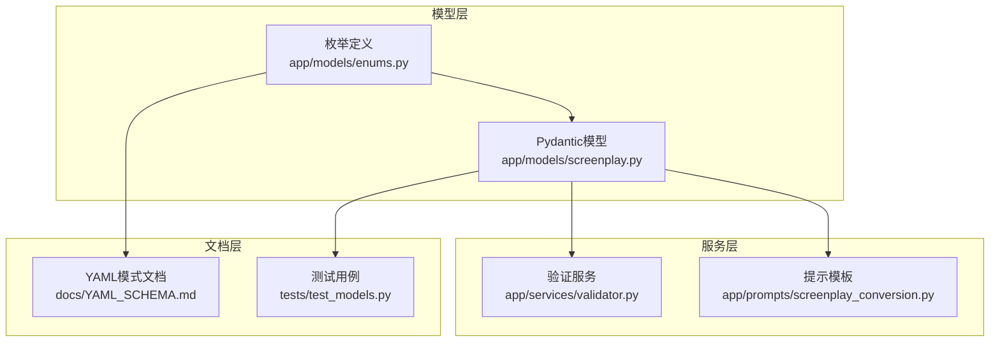

**图表来源**
- [app/models/enums.py:1-83](file://app/models/enums.py#L1-L83)
- [app/models/screenplay.py:1-167](file://app/models/screenplay.py#L1-L167)

**章节来源**
- [app/models/enums.py:1-83](file://app/models/enums.py#L1-L83)
- [app/models/screenplay.py:1-167](file://app/models/screenplay.py#L1-L167)

## 核心组件

项目中的枚举类型定义在统一的模块中管理，每个枚举都遵循一致的设计原则：

### 枚举设计原则

1. **类型安全**: 所有枚举都继承自 `str` 类型，确保与 YAML 序列化兼容
2. **业务语义**: 枚举值直接反映业务含义，避免抽象的数字标识
3. **可读性**: 使用全大写常量名，便于人类理解和维护
4. **扩展性**: 为未来功能扩展预留空间

### 主要枚举分类

| 枚举类别 | 数量 | 用途描述 |
|---------|------|----------|
| 角色类型 | 5个 | 定义角色在故事中的重要程度 |
| 时间类型 | 7个 | 场景时间的分类标识 |
| 空间类型 | 4个 | 场景内外环境的标识 |
| 元素类型 | 5个 | 剧本元素的分类体系 |
| 过渡类型 | 10个 | 场景转换的技术手段 |
| 格式类型 | 4个 | 剧本格式的分类标准 |
| 重要性级别 | 3个 | 动作元素的重要程度 |

**章节来源**
- [app/models/enums.py:6-83](file://app/models/enums.py#L6-L83)

## 架构概览

枚举类型在整个系统中的作用机制如下：

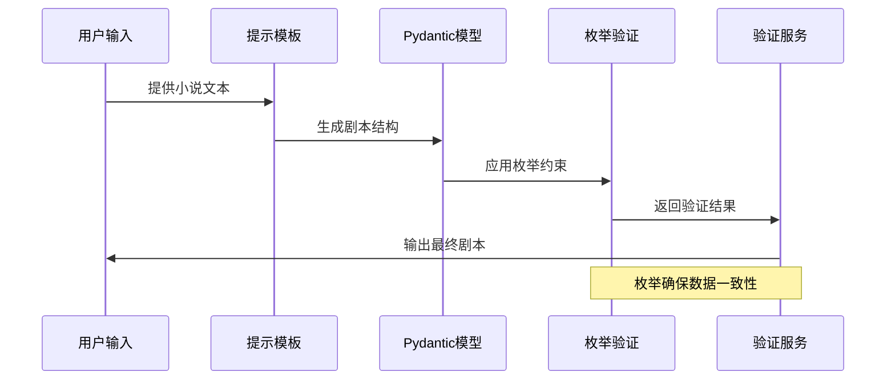

**图表来源**
- [app/prompts/screenplay_conversion.py:1-91](file://app/prompts/screenplay_conversion.py#L1-L91)
- [app/models/screenplay.py:113-130](file://app/models/screenplay.py#L113-L130)
- [app/services/validator.py:11-111](file://app/services/validator.py#L11-L111)

## 详细组件分析

### 角色类型（RoleType）

角色类型枚举定义了角色在故事中的重要程度层次：

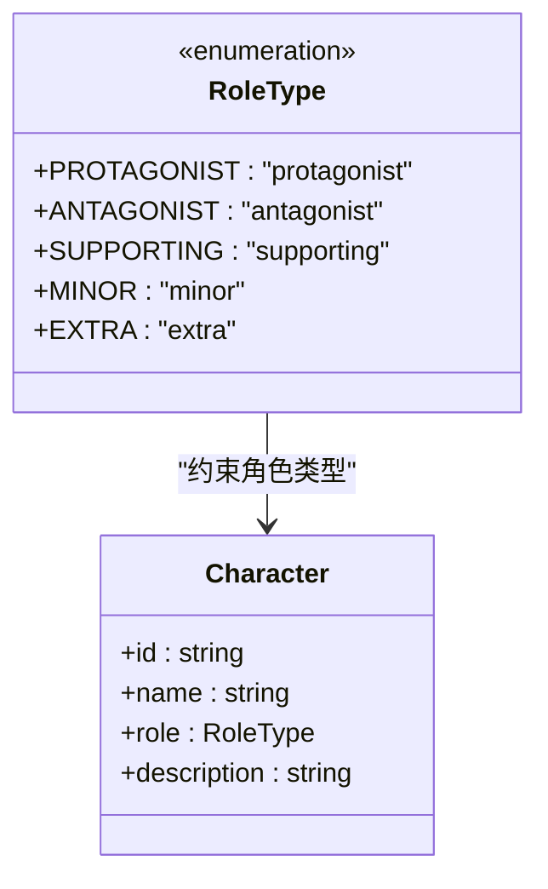

**图表来源**
- [app/models/enums.py:6-12](file://app/models/enums.py#L6-L12)
- [app/models/screenplay.py:50-62](file://app/models/screenplay.py#L50-L62)

#### 业务含义

- **PROTAGONIST**: 故事的主要推动者，通常占主导地位
- **ANTAGONIST**: 主角的主要对立面，推动冲突发展
- **SUPPORTING**: 重要的次要角色，支持主线情节
- **MINOR**: 小角色，但有明确身份
- **EXTRA**: 背景角色，通常无台词

#### 使用场景

角色类型主要用于：
1. 剧本角色分类和管理
2. 演员选角参考
3. 剧情重要性评估
4. 生产制作规划

**章节来源**
- [app/models/enums.py:6-12](file://app/models/enums.py#L6-L12)
- [docs/YAML_SCHEMA.md:252-260](file://docs/YAML_SCHEMA.md#L252-L260)

### 场景时间（TimeOfDay）

场景时间枚举定义了场景发生的时间状态：

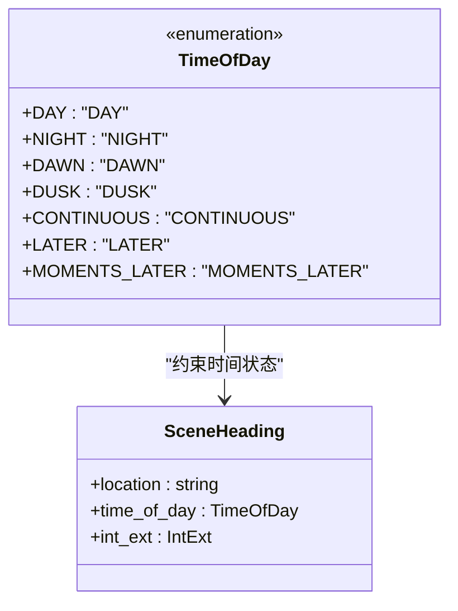

**图表来源**
- [app/models/enums.py:15-23](file://app/models/enums.py#L15-L23)
- [app/models/screenplay.py:113-118](file://app/models/screenplay.py#L113-L118)

#### 业务含义

- **DAY/NIGHT**: 正常的白天和夜晚场景
- **DAWN/DUSK**: 黎明和黄昏的过渡时段
- **CONTINUOUS**: 紧接着前一个场景，无时间跳跃
- **LATER/MOMENTS_LATER**: 同一地点的不同时间点

#### 使用场景

时间类型用于：
1. 场景标题的标准化格式
2. 场景时序的逻辑组织
3. 渲染工具的时间相关处理
4. 制作调度的时间安排

**章节来源**
- [app/models/enums.py:15-23](file://app/models/enums.py#L15-L23)
- [docs/YAML_SCHEMA.md:261-270](file://docs/YAML_SCHEMA.md#L261-L270)

### 场景内外（IntExt）

场景内外枚举定义了场景发生的物理环境：

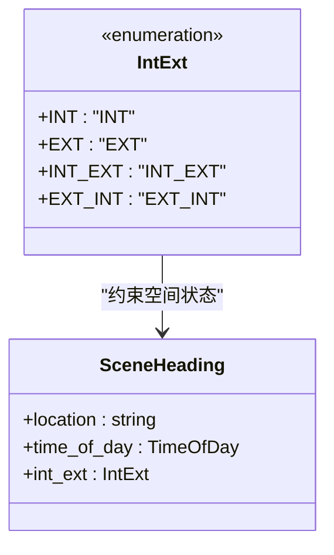

**图表来源**
- [app/models/enums.py:26-31](file://app/models/enums.py#L26-L31)
- [app/models/screenplay.py:113-118](file://app/models/screenplay.py#L113-L118)

#### 业务含义

- **INT/EXT**: 室内或室外场景
- **INT_EXT**: 室内转室外的场景
- **EXT_INT**: 室外转室内场景

#### 使用场景

空间类型用于：
1. 场景标题的完整格式
2. 场景拍摄的场地安排
3. 渲染工具的空间处理
4. 制作预算的空间成本计算

**章节来源**
- [app/models/enums.py:26-31](file://app/models/enums.py#L26-L31)
- [docs/YAML_SCHEMA.md:272-279](file://docs/YAML_SCHEMA.md#L272-L279)

### 元素重要性（ElementImportance）

元素重要性枚举定义了动作元素的重要性级别：

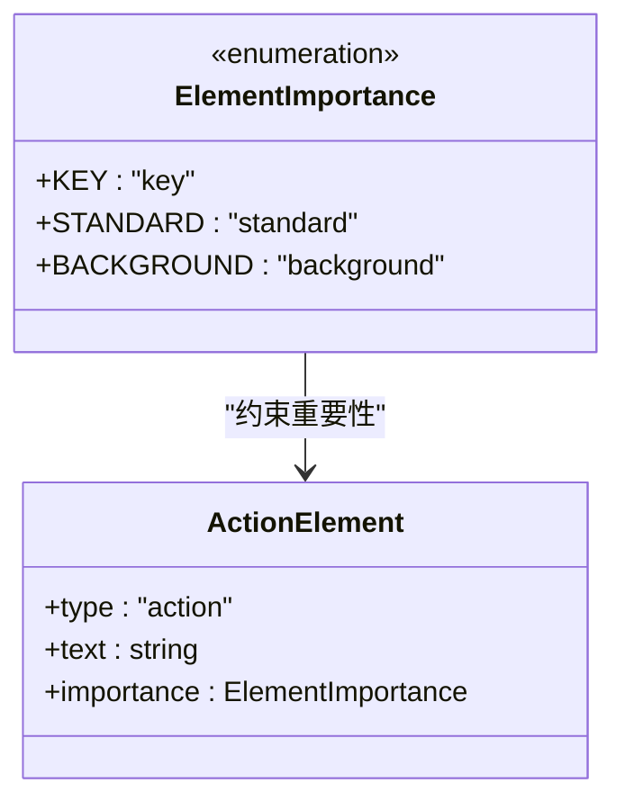

**图表来源**
- [app/models/enums.py:65-69](file://app/models/enums.py#L65-L69)
- [app/models/screenplay.py:67-72](file://app/models/screenplay.py#L67-L72)

#### 业务含义

- **KEY**: 关键剧情动作，必须突出显示
- **STANDARD**: 普通动作，正常呈现
- **BACKGROUND**: 背景细节，作为氛围补充

#### 使用场景

重要性级别用于：
1. 渲染工具的视觉强调
2. 编辑过程中的重点标记
3. 剧本审阅的焦点识别
4. 导演的镜头语言指导

**章节来源**
- [app/models/enums.py:65-69](file://app/models/enums.py#L65-L69)
- [docs/YAML_SCHEMA.md:294-299](file://docs/YAML_SCHEMA.md#L294-L299)

### 过渡类型（TransitionType）

过渡类型枚举定义了场景转换的技术手段：

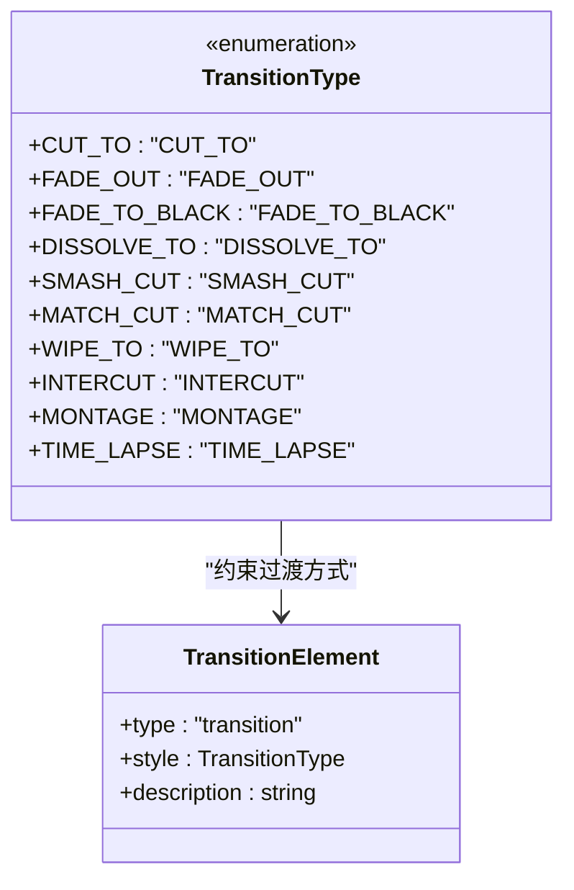

**图表来源**
- [app/models/enums.py:43-54](file://app/models/enums.py#L43-L54)
- [app/models/screenplay.py:91-96](file://app/models/screenplay.py#L91-L96)

#### 业务含义

- **CUT_TO**: 标准场景切换
- **FADE_OUT/FADE_TO_BLACK**: 渐隐渐显效果
- **DISSOLVE_TO**: 重叠溶解过渡
- **SMASH_CUT**: 突兀的强烈切换
- **MATCH_CUT**: 匹配相似画面的切换
- **WIPE_TO**: 擦除式过渡
- **INTERCUT**: 交叉剪辑
- **MONTAGE**: 蒙太奇序列
- **TIME_LAPSE**: 时间流逝

#### 使用场景

过渡类型用于：
1. 场景间的逻辑连接
2. 剪辑师的创作指导
3. 渲染工具的特效处理
4. 剧情节奏的控制

**章节来源**
- [app/models/enums.py:43-54](file://app/models/enums.py#L43-L54)
- [docs/YAML_SCHEMA.md:280-292](file://docs/YAML_SCHEMA.md#L280-L292)

### 元素类型（ElementType）

元素类型枚举定义了剧本的基本组成单元：

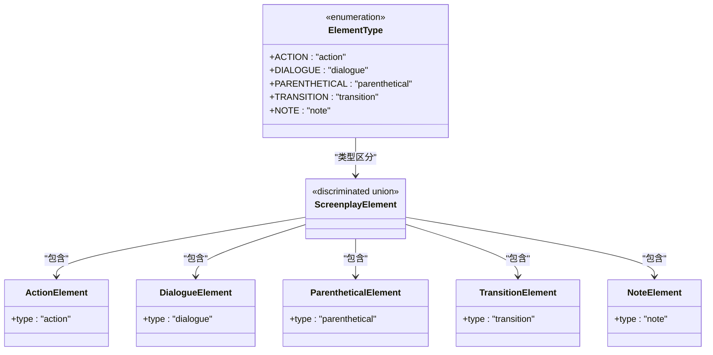

**图表来源**
- [app/models/enums.py:34-41](file://app/models/enums.py#L34-L41)
- [app/models/screenplay.py:105-108](file://app/models/screenplay.py#L105-L108)

#### 业务含义

- **ACTION**: 物理动作描述
- **DIALOGUE**: 角色对话内容
- **PARENTHETICAL**: 对话间的动作指示
- **TRANSITION**: 场景转换说明
- **NOTE**: 编辑注释信息

#### 使用场景

元素类型用于：
1. 剧本结构的类型化管理
2. 解析器的类型区分
3. 渲染工具的格式化
4. 数据验证的约束

**章节来源**
- [app/models/enums.py:34-41](file://app/models/enums.py#L34-L41)
- [app/models/screenplay.py:105-108](file://app/models/screenplay.py#L105-L108)

### 格式类型（ScreenplayFormat）

格式类型枚举定义了剧本的类型分类：

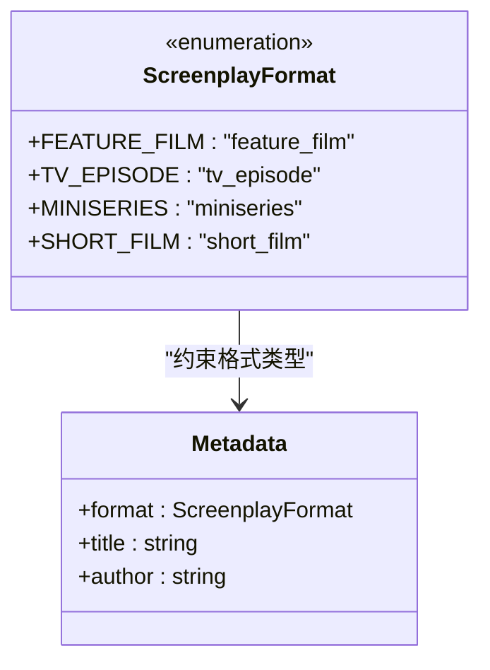

**图表来源**
- [app/models/enums.py:57-63](file://app/models/enums.py#L57-L63)
- [app/models/screenplay.py:17-39](file://app/models/screenplay.py#L17-L39)

#### 业务含义

- **FEATURE_FILM**: 长片电影格式
- **TV_EPISODE**: 电视剧集格式
- **MINISERIES**: 连续剧格式
- **SHORT_FILM**: 短片格式

#### 使用场景

格式类型用于：
1. 渲染工具的格式适配
2. 制作流程的类型区分
3. 分发渠道的格式要求
4. 版权和分级的依据

**章节来源**
- [app/models/enums.py:57-63](file://app/models/enums.py#L57-L63)

### 转换阶段（ConversionStage）

转换阶段枚举定义了转换流程的状态：

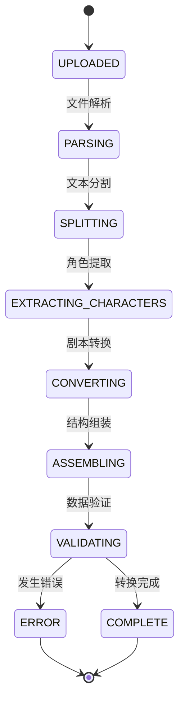

**图表来源**
- [app/models/enums.py:72-83](file://app/models/enums.py#L72-L83)

#### 业务含义

- **UPLOADED/PARSING/SPLITTING**: 输入处理阶段
- **EXTRACTING_CHARACTERS/CONVERTING/ASSEMBLING**: 内容转换阶段
- **VALIDATING**: 质量检查阶段
- **COMPLETE/ERROR**: 结束状态

#### 使用场景

转换阶段用于：
1. 流水线的状态跟踪
2. 用户进度的实时反馈
3. 错误恢复的定位
4. 性能监控的指标

**章节来源**
- [app/models/enums.py:72-83](file://app/models/enums.py#L72-L83)

## 依赖分析

枚举类型之间的依赖关系体现了系统的层次结构：

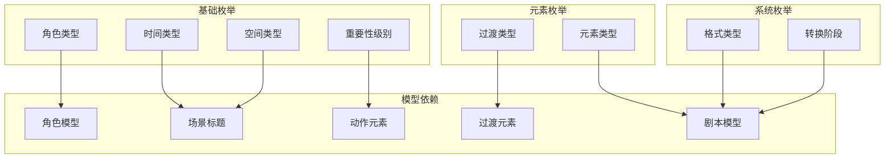

**图表来源**
- [app/models/enums.py:6-83](file://app/models/enums.py#L6-L83)
- [app/models/screenplay.py:50-167](file://app/models/screenplay.py#L50-L167)

**章节来源**
- [app/models/enums.py:6-83](file://app/models/enums.py#L6-L83)
- [app/models/screenplay.py:50-167](file://app/models/screenplay.py#L50-L167)

## 性能考虑

枚举类型的性能特性：

### 内存效率
- 枚举值在内存中以单例形式存储
- 字符串比较比对象比较更高效
- 减少了字符串重复存储的需求

### 计算效率
- 枚举比较是常数时间操作
- 类型检查在编译时进行优化
- 减少了运行时类型转换开销

### 序列化性能
- 枚举值直接序列化为字符串
- YAML序列化无需额外转换
- 减少了中间对象的创建

## 故障排除指南

### 常见问题及解决方案

#### 枚举值不匹配
**问题**: 枚举值不在预定义集合内
**解决方案**: 
1. 检查输入数据的拼写
2. 验证枚举定义的完整性
3. 实施默认值回退机制

#### 类型转换错误
**问题**: 枚举值被错误地当作普通字符串处理
**解决方案**:
1. 在数据验证阶段强制类型检查
2. 使用Pydantic模型的类型约束
3. 实施严格的字段验证

#### 扩展兼容性问题
**问题**: 新增枚举值导致向后不兼容
**解决方案**:
1. 保持现有枚举值不变
2. 为新值提供向后兼容映射
3. 实施版本化的枚举定义

**章节来源**
- [app/services/validator.py:11-111](file://app/services/validator.py#L11-L111)
- [tests/test_models.py:52-80](file://tests/test_models.py#L52-L80)

## 结论

项目中的枚举类型设计体现了以下优势：

1. **强类型约束**: 通过枚举确保数据的有效性和一致性
2. **业务语义清晰**: 枚举值直接反映业务含义，便于理解和维护
3. **扩展性强**: 设计允许未来功能扩展而不破坏现有系统
4. **性能友好**: 枚举的内存和计算效率优于动态类型方案
5. **验证完备**: 与验证服务协同工作，提供多层次的数据质量保证

这些枚举类型为整个剧本转换系统提供了坚实的基础，确保了从输入到输出的全流程数据一致性。

## 附录

### 枚举值选择原则

1. **业务相关性**: 枚举值必须直接对应业务概念
2. **唯一性**: 每个枚举值在集合内必须唯一
3. **稳定性**: 枚举值一旦确定不应随意更改
4. **可扩展性**: 为未来需求预留空间
5. **一致性**: 与其他系统保持命名约定一致

### 最佳实践指导

#### 枚举扩展
- 保持现有值不变，新增值放在末尾
- 为新值提供清晰的业务含义
- 更新相关的验证规则和文档
- 实施向后兼容的迁移策略

#### 枚举使用
- 在所有业务逻辑中优先使用枚举而非原始字符串
- 实施严格的类型检查和验证
- 提供完整的错误处理和回退机制
- 维护枚举值的完整文档和示例

#### 枚举维护
- 定期审查枚举的完整性和准确性
- 建立变更审批流程
- 实施版本管理和兼容性测试
- 提供向后兼容的迁移工具