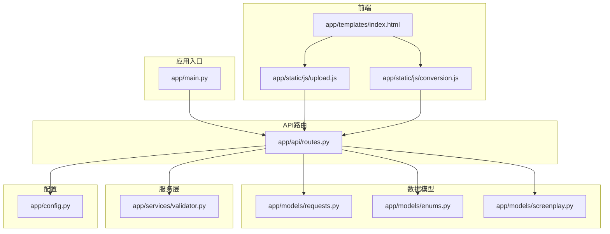
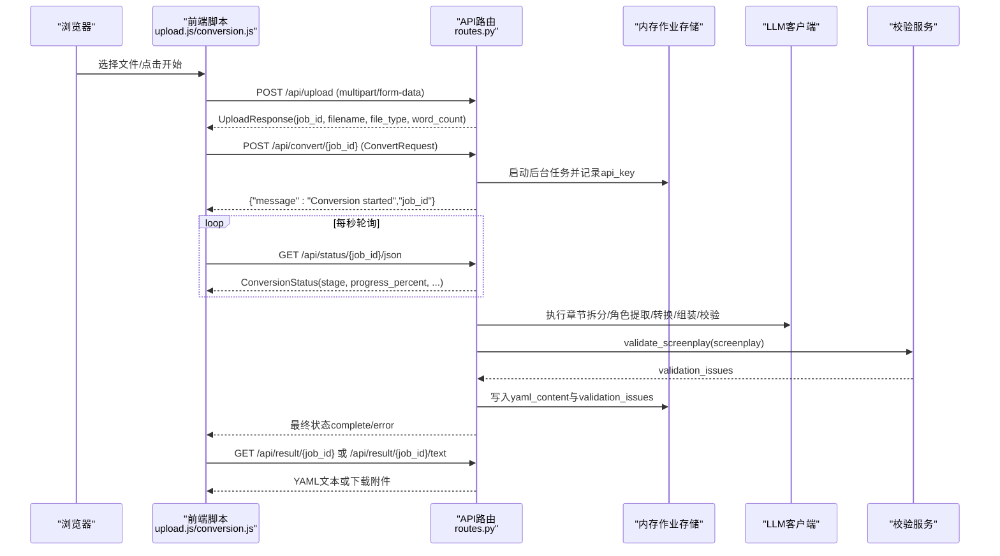
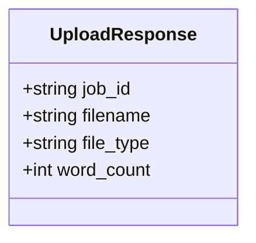
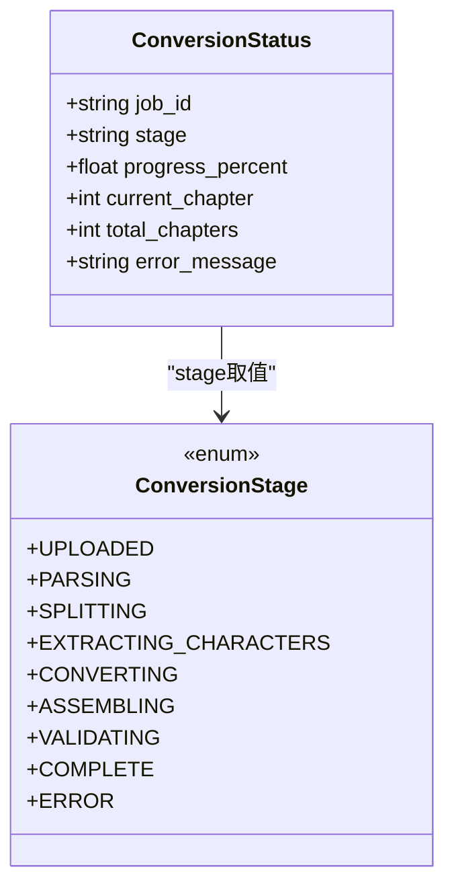
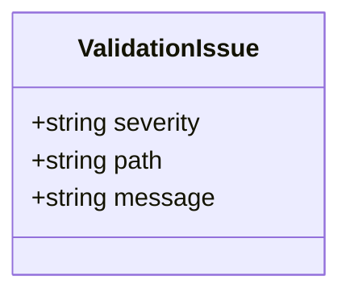
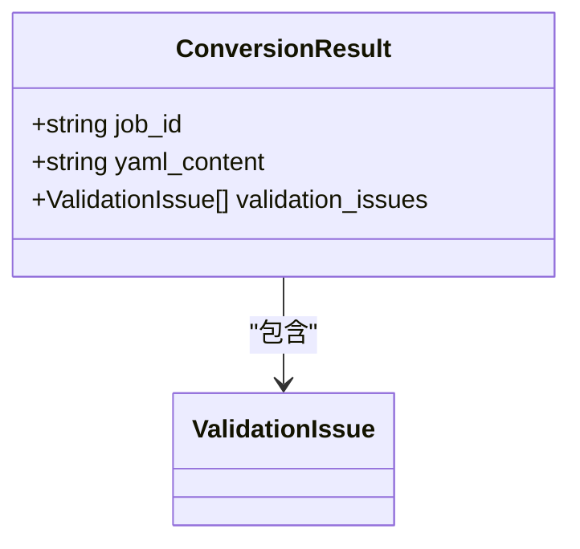
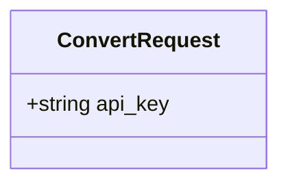
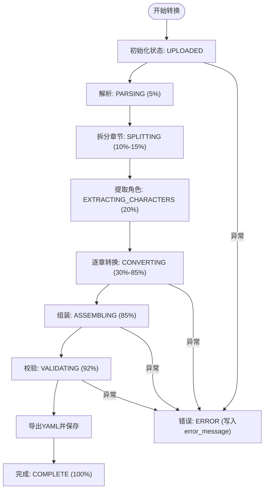
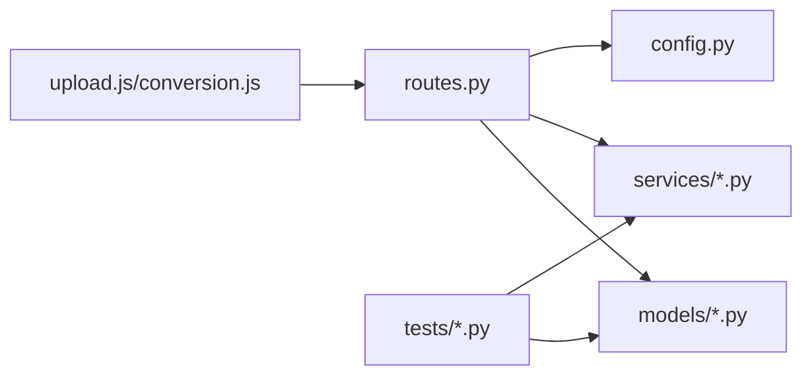

# 请求响应Schema

<cite>
**本文引用的文件**
- [app/api/routes.py](file://app/api/routes.py)
- [app/models/requests.py](file://app/models/requests.py)
- [app/models/enums.py](file://app/models/enums.py)
- [app/models/screenplay.py](file://app/models/screenplay.py)
- [app/services/validator.py](file://app/services/validator.py)
- [app/config.py](file://app/config.py)
- [app/main.py](file://app/main.py)
- [app/static/js/upload.js](file://app/static/js/upload.js)
- [app/static/js/conversion.js](file://app/static/js/conversion.js)
- [app/templates/index.html](file://app/templates/index.html)
- [tests/test_models.py](file://tests/test_models.py)
- [tests/test_validator.py](file://tests/test_validator.py)
</cite>

## 目录
1. [简介](#简介)
2. [项目结构](#项目结构)
3. [核心组件](#核心组件)
4. [架构总览](#架构总览)
5. [详细组件分析](#详细组件分析)
6. [依赖分析](#依赖分析)
7. [性能考虑](#性能考虑)
8. [故障排查指南](#故障排查指南)
9. [结论](#结论)
10. [附录](#附录)

## 简介
本文件系统性梳理本项目的请求与响应Schema，聚焦以下核心模型与流程：
- 请求响应模型：UploadResponse、ConversionStatus、ValidationIssue、ConversionResult、ConvertRequest
- 异步任务状态流转：任务ID生成、进度状态更新、错误信息传递
- 参数校验规则与响应序列化格式
- 完整的API交互示例与错误处理机制说明

目标是帮助前后端开发者以统一的数据契约进行对接，确保数据一致性与可维护性。

## 项目结构
围绕API路由、数据模型与服务层，项目采用“路由-模型-服务”分层组织，关键文件如下：
- 路由与控制流：app/api/routes.py
- 请求/响应模型：app/models/requests.py、app/models/screenplay.py、app/models/enums.py
- 校验服务：app/services/validator.py
- 配置与入口：app/config.py、app/main.py
- 前端交互：app/static/js/upload.js、app/static/js/conversion.js、app/templates/index.html
- 测试用例：tests/test_models.py、tests/test_validator.py

图表来源
- [app/main.py:14-46](file://app/main.py#L14-L46)
- [app/api/routes.py:1-313](file://app/api/routes.py#L1-L313)
- [app/models/requests.py:1-41](file://app/models/requests.py#L1-L41)
- [app/models/enums.py:1-83](file://app/models/enums.py#L1-L83)
- [app/models/screenplay.py:1-167](file://app/models/screenplay.py#L1-L167)
- [app/services/validator.py:1-111](file://app/services/validator.py#L1-L111)
- [app/config.py:1-45](file://app/config.py#L1-L45)
- [app/static/js/upload.js:1-131](file://app/static/js/upload.js#L1-L131)
- [app/static/js/conversion.js:1-130](file://app/static/js/conversion.js#L1-L130)
- [app/templates/index.html:1-140](file://app/templates/index.html#L1-L140)

章节来源
- [app/main.py:14-46](file://app/main.py#L14-L46)
- [app/api/routes.py:1-313](file://app/api/routes.py#L1-L313)

## 核心组件
本节对核心请求/响应模型进行字段定义、数据类型与验证规则说明，并给出序列化格式与典型交互示例。

- UploadResponse（上传后响应）
  - 字段
    - job_id: 字符串，唯一任务标识
    - filename: 字符串，原始文件名
    - file_type: 字符串，检测到的文件类型
    - word_count: 整数，估算字数
  - 数据类型与约束
    - 所有字段均为必填（除默认值外），用于前端展示与后续转换流程
  - 序列化格式
    - JSON；字段名与类型与模型一致
  - 示例路径
    - [上传接口返回:106-111](file://app/api/routes.py#L106-L111)

- ConversionStatus（转换状态）
  - 字段
    - job_id: 字符串，任务ID
    - stage: 字符串，当前流水线阶段（枚举值）
    - progress_percent: 浮点数，0-100的进度百分比
    - current_chapter: 整数或空，当前转换章节数
    - total_chapters: 整数或空，检测到的总章节数
    - error_message: 字符串或空，当阶段为error时的错误详情
  - 数据类型与约束
    - stage取自ConversionStage枚举
    - 进度与章节信息在转换过程中动态更新
  - 序列化格式
    - JSON；通过model_dump_json序列化为Server-Sent Events数据帧
  - 示例路径
    - [状态更新与SSE流:136-158](file://app/api/routes.py#L136-L158)
    - [状态查询(JSON):161-165](file://app/api/routes.py#L161-L165)

- ValidationIssue（校验问题）
  - 字段
    - severity: 字符串，warning或error
    - path: 字符串，JSONPath风格定位，如"structure.acts[0].scenes[2]"
    - message: 字符串，问题描述
  - 数据类型与约束
    - 仅包含上述三字段
  - 序列化格式
    - JSON；用于校验结果列表
  - 示例路径
    - [校验服务返回:11-111](file://app/services/validator.py#L11-L111)

- ConversionResult（转换完成结果）
  - 字段
    - job_id: 字符串，任务ID
    - yaml_content: 字符串，生成的YAML剧本内容
    - validation_issues: 列表，ValidationIssue数组
  - 数据类型与约束
    - 必填字段为job_id与yaml_content
  - 序列化格式
    - JSON；用于下载前预览或作为中间结果
  - 示例路径
    - [下载YAML:168-184](file://app/api/routes.py#L168-L184)

- ConvertRequest（开始转换请求体）
  - 字段
    - api_key: 字符串，用户提供的DeepSeek API Key（可选）
  - 数据类型与约束
    - 可为空字符串，默认不传入
  - 序列化格式
    - JSON；POST /api/convert/{job_id}
  - 示例路径
    - [启动转换:114-128](file://app/api/routes.py#L114-L128)

章节来源
- [app/models/requests.py:6-41](file://app/models/requests.py#L6-L41)
- [app/models/enums.py:72-83](file://app/models/enums.py#L72-L83)
- [app/api/routes.py:131-184](file://app/api/routes.py#L131-L184)
- [app/services/validator.py:11-111](file://app/services/validator.py#L11-L111)

## 架构总览
下图展示了从前端上传到异步转换、状态推送与结果下载的完整流程。

图表来源
- [app/static/js/upload.js:82-129](file://app/static/js/upload.js#L82-L129)
- [app/static/js/conversion.js:30-71](file://app/static/js/conversion.js#L30-L71)
- [app/api/routes.py:68-184](file://app/api/routes.py#L68-L184)
- [app/services/validator.py:11-111](file://app/services/validator.py#L11-L111)

## 详细组件分析

### UploadResponse（上传后响应）
- 字段定义与类型
  - job_id: 字符串
  - filename: 字符串
  - file_type: 字符串
  - word_count: 整数
- 验证规则
  - 所有字段均为必填（除默认值外）
- 序列化格式
  - JSON；字段名与类型与模型一致
- 典型交互
  - 前端上传文件后接收UploadResponse，解析job_id用于后续调用
- 示例路径
  - [上传接口实现:68-111](file://app/api/routes.py#L68-L111)

图表来源
- [app/models/requests.py:6-11](file://app/models/requests.py#L6-L11)

章节来源
- [app/models/requests.py:6-11](file://app/models/requests.py#L6-L11)
- [app/api/routes.py:68-111](file://app/api/routes.py#L68-L111)

### ConversionStatus（转换状态）
- 字段定义与类型
  - job_id: 字符串
  - stage: 字符串（来自枚举）
  - progress_percent: 浮点数
  - current_chapter: 整数或空
  - total_chapters: 整数或空
  - error_message: 字符串或空
- 验证规则
  - stage必须为枚举值之一
  - 进度范围通常为0-100
- 序列化格式
  - JSON；通过model_dump_json序列化为SSE数据帧
- 典型交互
  - SSE流持续推送状态，直到complete或error
  - 非SSE客户端可通过JSON端点轮询
- 示例路径
  - [SSE状态流:131-158](file://app/api/routes.py#L131-L158)
  - [JSON状态查询:161-165](file://app/api/routes.py#L161-L165)

图表来源
- [app/models/requests.py:14-22](file://app/models/requests.py#L14-L22)
- [app/models/enums.py:72-83](file://app/models/enums.py#L72-L83)

章节来源
- [app/models/requests.py:14-22](file://app/models/requests.py#L14-L22)
- [app/models/enums.py:72-83](file://app/models/enums.py#L72-L83)
- [app/api/routes.py:131-165](file://app/api/routes.py#L131-L165)

### ValidationIssue（校验问题）
- 字段定义与类型
  - severity: 字符串（warning或error）
  - path: 字符串（JSONPath风格）
  - message: 字符串
- 验证规则
  - 仅包含上述三字段
- 序列化格式
  - JSON；用于校验结果列表
- 典型交互
  - 转换完成后通过GET /api/validate/{job_id}获取
- 示例路径
  - [校验服务实现:11-111](file://app/services/validator.py#L11-L111)
  - [校验结果端点:201-205](file://app/api/routes.py#L201-L205)

图表来源
- [app/models/requests.py:24-28](file://app/models/requests.py#L24-L28)

章节来源
- [app/models/requests.py:24-28](file://app/models/requests.py#L24-L28)
- [app/services/validator.py:11-111](file://app/services/validator.py#L11-L111)
- [app/api/routes.py:201-205](file://app/api/routes.py#L201-L205)

### ConversionResult（转换完成结果）
- 字段定义与类型
  - job_id: 字符串
  - yaml_content: 字符串（YAML内容）
  - validation_issues: 列表（ValidationIssue）
- 验证规则
  - 必填字段为job_id与yaml_content
- 序列化格式
  - JSON；用于预览或作为中间结果
- 典型交互
  - 下载YAML时直接返回text/yaml；预览时返回纯文本
- 示例路径
  - [下载YAML:168-184](file://app/api/routes.py#L168-L184)
  - [预览文本:187-198](file://app/api/routes.py#L187-L198)

图表来源
- [app/models/requests.py:31-36](file://app/models/requests.py#L31-L36)

章节来源
- [app/models/requests.py:31-36](file://app/models/requests.py#L31-L36)
- [app/api/routes.py:168-198](file://app/api/routes.py#L168-L198)

### ConvertRequest（开始转换请求体）
- 字段定义与类型
  - api_key: 字符串（可选）
- 验证规则
  - 可为空字符串，默认不传入
- 序列化格式
  - JSON；POST /api/convert/{job_id}
- 典型交互
  - 前端提交ConvertRequest，后端记录到作业上下文
- 示例路径
  - [启动转换:114-128](file://app/api/routes.py#L114-L128)

图表来源
- [app/models/requests.py:38-41](file://app/models/requests.py#L38-L41)

章节来源
- [app/models/requests.py:38-41](file://app/models/requests.py#L38-L41)
- [app/api/routes.py:114-128](file://app/api/routes.py#L114-L128)

### 异步任务处理与状态传递机制
- 任务ID生成
  - 使用UUID v4生成job_id，存储于内存作业池
- 状态传递
  - 通过ConversionStatus更新作业状态
  - SSE流推送最新状态；非SSE客户端轮询JSON端点
- 错误处理
  - 异常捕获后设置stage为ERROR并写入error_message
- 进度计算
  - 各阶段按固定权重推进，章节转换阶段按当前章/总数动态更新
- 示例路径
  - [作业存储与状态更新:31-49](file://app/api/routes.py#L31-L49)
  - [SSE状态流:131-158](file://app/api/routes.py#L131-L158)
  - [JSON状态查询:161-165](file://app/api/routes.py#L161-L165)
  - [后台转换流程:208-313](file://app/api/routes.py#L208-L313)

图表来源
- [app/api/routes.py:208-313](file://app/api/routes.py#L208-L313)
- [app/models/enums.py:72-83](file://app/models/enums.py#L72-L83)

章节来源
- [app/api/routes.py:31-49](file://app/api/routes.py#L31-L49)
- [app/api/routes.py:131-165](file://app/api/routes.py#L131-L165)
- [app/api/routes.py:208-313](file://app/api/routes.py#L208-L313)

### 请求参数验证规则与响应序列化
- 上传文件
  - 文件类型检测与大小限制（最大50MB）
  - 成功后返回UploadResponse
- 开始转换
  - 重复启动转换会返回400
  - api_key可选传入，写入作业上下文
- 状态查询
  - SSE流与JSON轮询两种方式
- 结果下载
  - 未完成或无结果时返回400/404
- 响应序列化
  - 所有模型均通过Pydantic自动序列化为JSON
  - SSE使用model_dump_json输出数据帧
- 示例路径
  - [上传与校验:68-111](file://app/api/routes.py#L68-L111)
  - [启动转换与校验:114-128](file://app/api/routes.py#L114-L128)
  - [状态查询与下载:131-198](file://app/api/routes.py#L131-L198)

章节来源
- [app/api/routes.py:68-198](file://app/api/routes.py#L68-L198)

## 依赖分析
- 组件耦合
  - 路由层依赖模型层（请求/响应）与服务层（校验）
  - 前端脚本通过HTTP与SSE与后端交互
- 外部依赖
  - FastAPI（路由与SSE）、Pydantic（模型与序列化）、uuid（任务ID生成）
- 潜在循环依赖
  - 当前结构清晰，无循环导入迹象

图表来源
- [app/api/routes.py:1-313](file://app/api/routes.py#L1-L313)
- [app/models/requests.py:1-41](file://app/models/requests.py#L1-L41)
- [app/models/screenplay.py:1-167](file://app/models/screenplay.py#L1-L167)
- [app/services/validator.py:1-111](file://app/services/validator.py#L1-L111)
- [app/config.py:1-45](file://app/config.py#L1-L45)
- [app/static/js/upload.js:1-131](file://app/static/js/upload.js#L1-L131)
- [app/static/js/conversion.js:1-130](file://app/static/js/conversion.js#L1-L130)

章节来源
- [app/api/routes.py:1-313](file://app/api/routes.py#L1-L313)

## 性能考虑
- SSE vs 轮询
  - SSE适合实时反馈，轮询兼容性更好
  - 建议在浏览器支持SSE时优先使用SSE，否则回退轮询
- 进度更新频率
  - SSE每秒一次，轮询间隔建议≥1s，避免过度请求
- 文件大小与内存
  - 上传文件大小受配置限制，建议前端做本地大小提示
- LLM调用
  - 章节转换阶段为IO密集型，注意超时与重试策略

## 故障排查指南
- 常见错误码与场景
  - 400：文件过大、转换已开始、转换未完成
  - 404：作业不存在、无结果
  - 413：超出最大上传大小
- 错误信息来源
  - 路由层抛出HTTPException，携带detail
  - 校验阶段返回ValidationIssue列表
- 前端处理建议
  - 上传失败：显示错误并允许重新上传
  - 转换失败：展示error_message并提供重试入口
- 示例路径
  - [错误处理与状态检查:34-38](file://app/api/routes.py#L34-L38)
  - [文件大小限制:82-83](file://app/api/routes.py#L82-L83)
  - [转换状态检查:119-120](file://app/api/routes.py#L119-L120)
  - [结果可用性检查:173-174](file://app/api/routes.py#L173-L174)

章节来源
- [app/api/routes.py:34-83](file://app/api/routes.py#L34-L83)
- [app/api/routes.py:119-174](file://app/api/routes.py#L119-L174)

## 结论
本文档基于实际代码梳理了请求与响应Schema，明确了各模型字段、类型与验证规则，并结合异步转换流程与前端交互，给出了统一的数据契约与错误处理机制。建议在前后端开发中严格遵循本文档的字段定义与序列化格式，确保系统的稳定性与一致性。

## 附录

### API交互示例（步骤化）
- 步骤1：上传文件
  - 方法：POST /api/upload
  - 请求体：multipart/form-data，字段file
  - 成功响应：UploadResponse
  - 示例路径：[上传接口:68-111](file://app/api/routes.py#L68-L111)
- 步骤2：开始转换
  - 方法：POST /api/convert/{job_id}
  - 请求体：ConvertRequest（可选api_key）
  - 成功响应：{"message":"Conversion started","job_id"}
  - 示例路径：[启动转换:114-128](file://app/api/routes.py#L114-L128)
- 步骤3：获取状态
  - 方法：GET /api/status/{job_id}/json（轮询）
  - 或：GET /api/status/{job_id}（SSE）
  - 成功响应：ConversionStatus
  - 示例路径：[SSE状态流:131-158](file://app/api/routes.py#L131-L158)、[JSON状态:161-165](file://app/api/routes.py#L161-L165)
- 步骤4：获取校验结果
  - 方法：GET /api/validate/{job_id}
  - 成功响应：{"issues":[...]}
  - 示例路径：[校验结果:201-205](file://app/api/routes.py#L201-L205)
- 步骤5：下载结果
  - 方法：GET /api/result/{job_id}（下载YAML）
  - 或：GET /api/result/{job_id}/text（预览文本）
  - 成功响应：text/yaml或text/plain
  - 示例路径：[下载YAML:168-184](file://app/api/routes.py#L168-L184)、[预览文本:187-198](file://app/api/routes.py#L187-L198)

### 前端交互要点
- 上传页面与拖拽支持
  - 支持TXT、MD、DOCX、PDF
  - 显示文件名与大小
  - 示例路径：[模板:1-140](file://app/templates/index.html#L1-L140)
- 上传与转换流程
  - 通过upload.js发送上传请求，解析UploadResponse.job_id
  - 通过conversion.js轮询状态并展示进度
  - 示例路径：[上传脚本:82-129](file://app/static/js/upload.js#L82-L129)、[进度脚本:30-71](file://app/static/js/conversion.js#L30-L71)

### 测试参考
- 模型正确性
  - 测试覆盖Metadata、Character、元素类型、Scene与Screenplay创建
  - 示例路径：[模型测试:22-124](file://tests/test_models.py#L22-L124)
- 校验逻辑
  - 测试标题为空、无Act、无效角色引用、空场景元素、无效characters_present等场景
  - 示例路径：[校验测试:19-63](file://tests/test_validator.py#L19-L63)