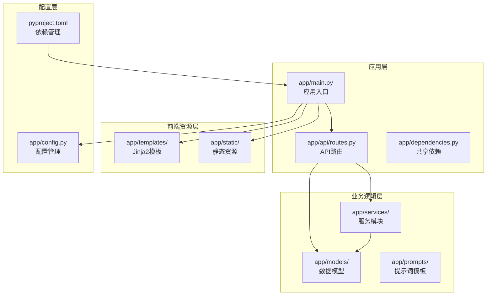
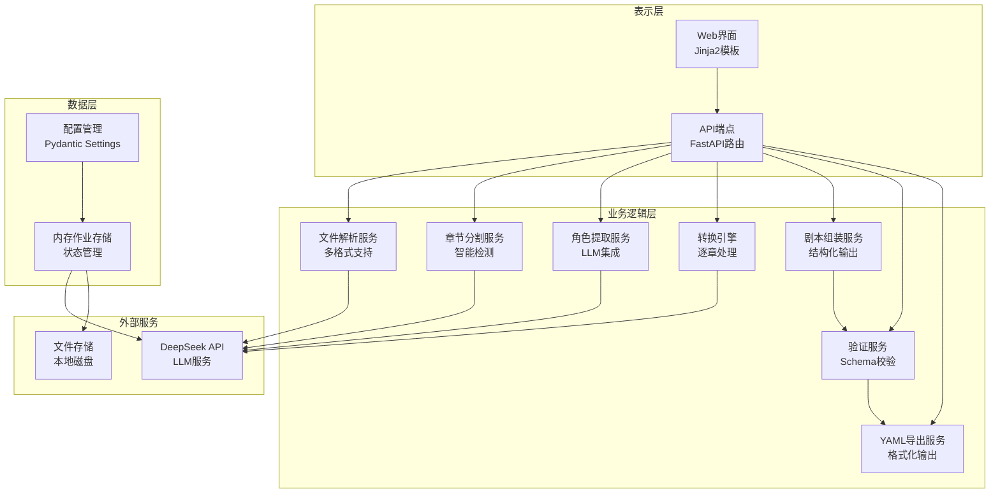
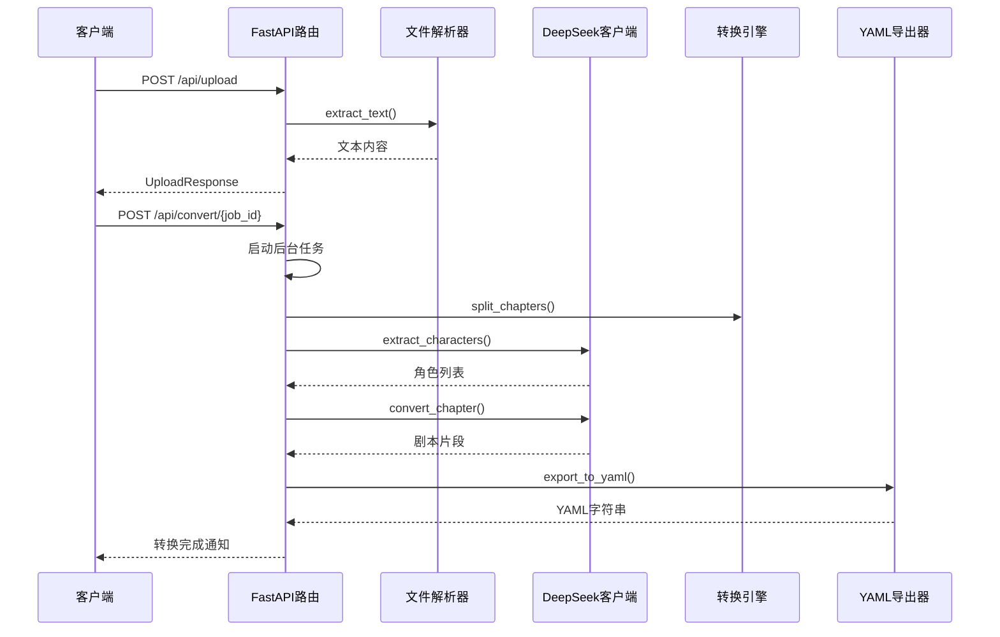
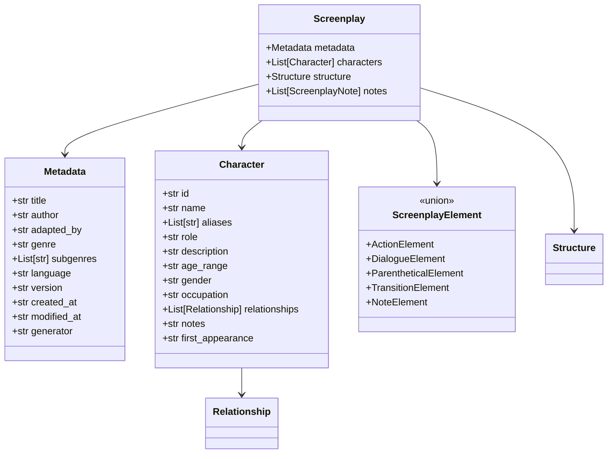
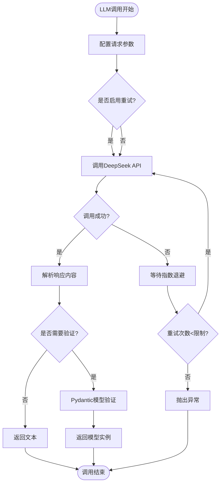
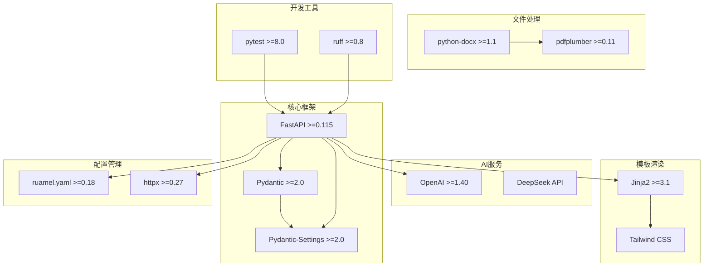

# 技术栈选型

<cite>
**本文档引用的文件**
- [pyproject.toml](file://pyproject.toml)
- [README.md](file://README.md)
- [app/main.py](file://app/main.py)
- [app/config.py](file://app/config.py)
- [app/api/routes.py](file://app/api/routes.py)
- [app/models/screenplay.py](file://app/models/screenplay.py)
- [app/models/requests.py](file://app/models/requests.py)
- [app/services/llm_client.py](file://app/services/llm_client.py)
- [app/services/yaml_exporter.py](file://app/services/yaml_exporter.py)
- [app/services/file_parser.py](file://app/services/file_parser.py)
- [app/dependencies.py](file://app/dependencies.py)
- [app/templates/base.html](file://app/templates/base.html)
- [app/static/css/app.css](file://app/static/css/app.css)
</cite>

## 目录
1. [引言](#引言)
2. [项目结构](#项目结构)
3. [核心组件](#核心组件)
4. [架构概览](#架构概览)
5. [详细组件分析](#详细组件分析)
6. [依赖分析](#依赖分析)
7. [性能考虑](#性能考虑)
8. [故障排除指南](#故障排除指南)
9. [结论](#结论)
10. [附录](#附录)

## 引言

本技术栈选型文档详细阐述了小说转剧本工具项目中关键技术框架的选择原因和实现考量。该项目采用现代化的Python技术栈，结合AI能力实现从小说文本到结构化YAML剧本的自动化转换。技术栈的核心包括FastAPI Web框架、Pydantic数据验证、DeepSeek API集成、Jinja2模板引擎和Tailwind CSS前端样式等组件。

## 项目结构

项目采用模块化的组织方式，按照功能域进行分层：

**图表来源**
- [app/main.py:1-46](file://app/main.py#L1-L46)
- [app/api/routes.py:1-313](file://app/api/routes.py#L1-L313)
- [pyproject.toml:1-47](file://pyproject.toml#L1-L47)

**章节来源**
- [README.md:77-108](file://README.md#L77-L108)
- [pyproject.toml:8-25](file://pyproject.toml#L8-L25)

## 核心组件

### FastAPI Web框架

FastAPI被选为主要Web框架，主要基于以下优势：

**异步处理能力**
- 支持完全异步的请求处理，充分利用现代硬件资源
- 内置的异步任务管理机制，适合长时间运行的AI转换任务
- 基于Starlette的高性能ASGI服务器支持

**自动文档生成功能**
- 自动生成交互式API文档（Swagger UI和ReDoc）
- 基于Pydantic模型的自动数据验证和序列化
- 实时的API测试界面，便于调试和集成

**类型安全和开发效率**
- 基于Python类型注解的自动数据验证
- 编译时类型检查支持，减少运行时错误
- 自动生成的客户端代码和SDK

**章节来源**
- [app/main.py:23-28](file://app/main.py#L23-L28)
- [app/api/routes.py:68-128](file://app/api/routes.py#L68-L128)

### Pydantic数据验证和序列化

Pydantic v2在项目中发挥着核心作用：

**数据模型定义**
- 完整的YAML Schema结构定义，确保数据一致性
- 类型安全的字段验证和默认值处理
- 支持复杂的嵌套数据结构和联合类型

**序列化和反序列化**
- 自动的JSON Schema生成，用于API文档
- 支持多种输出模式（JSON、字典、字符串）
- 严格的字段验证和错误处理

**开发效率提升**
- 减少手动数据验证代码
- 自动生成的类型提示和IDE支持
- 简化的数据转换和格式化

**章节来源**
- [app/models/screenplay.py:15-167](file://app/models/screenplay.py#L15-L167)
- [app/models/requests.py:6-41](file://app/models/requests.py#L6-L41)

### DeepSeek API集成

选择DeepSeek API的原因：

**OpenAI兼容性**
- 完全兼容OpenAI API接口，便于迁移和替换
- 支持标准的聊天完成接口和JSON格式输出
- 丰富的模型选择和参数配置

**异步客户端设计**
- 基于AsyncOpenAI的异步调用支持
- 自动重试机制和错误处理
- 结构化输出解析和缓存支持

**性能优化**
- 可配置的超时时间和温度参数
- 支持自定义基础URL和模型选择
- 连接池管理和资源清理

**章节来源**
- [app/config.py:18-31](file://app/config.py#L18-L31)
- [app/services/llm_client.py:18-103](file://app/services/llm_client.py#L18-L103)

### Jinja2模板引擎和Tailwind CSS

**Jinja2模板引擎**
- 灵活的模板继承和块定义系统
- 内置的过滤器和宏功能
- 与FastAPI的无缝集成

**Tailwind CSS**
- 原子化CSS类名，提高开发效率
- 响应式设计支持，适配不同设备
- 可定制的主题和颜色系统

**章节来源**
- [app/dependencies.py:5-9](file://app/dependencies.py#L5-L9)
- [app/templates/base.html:1-32](file://app/templates/base.html#L1-L32)

### 其他关键依赖

**ruamel.yaml**
- 保持YAML文件的原始结构和注释
- 支持复杂的YAML特性和Unicode字符
- 精确的缩进和格式控制

**python-docx**
- DOCX文档的完整解析支持
- 表格和段落的结构化提取
- 样式和格式信息的保留

**pdfplumber**
- PDF文本提取和布局分析
- 扫描版PDF的文本恢复支持
- 页面级的文本和图像提取

**章节来源**
- [app/services/yaml_exporter.py:14-57](file://app/services/yaml_exporter.py#L14-L57)
- [app/services/file_parser.py:97-143](file://app/services/file_parser.py#L97-L143)

## 架构概览

项目采用分层架构设计，实现了清晰的关注点分离：

**图表来源**
- [app/api/routes.py:15-23](file://app/api/routes.py#L15-L23)
- [app/services/llm_client.py:18-32](file://app/services/llm_client.py#L18-L32)
- [app/config.py:9-44](file://app/config.py#L9-L44)

## 详细组件分析

### API路由架构

FastAPI路由系统提供了RESTful API接口，支持完整的文件转换工作流：

**图表来源**
- [app/api/routes.py:68-128](file://app/api/routes.py#L68-L128)
- [app/api/routes.py:208-313](file://app/api/routes.py#L208-L313)

### 数据模型架构

Pydantic模型定义了完整的YAML Schema结构：

**图表来源**
- [app/models/screenplay.py:17-167](file://app/models/screenplay.py#L17-L167)

### LLM客户端设计

异步LLM客户端提供了可靠的AI服务集成：

**图表来源**
- [app/services/llm_client.py:33-86](file://app/services/llm_client.py#L33-L86)

**章节来源**
- [app/services/llm_client.py:18-103](file://app/services/llm_client.py#L18-L103)

## 依赖分析

项目依赖关系展现了清晰的技术栈层次：

**图表来源**
- [pyproject.toml:13-25](file://pyproject.toml#L13-L25)

**章节来源**
- [pyproject.toml:8-47](file://pyproject.toml#L8-L47)

## 性能考虑

### 异步处理优化

项目充分利用异步编程模型提升性能：

- **非阻塞I/O操作**：文件读写、网络请求均采用异步方式
- **并发任务管理**：支持多个转换任务同时进行
- **内存高效处理**：使用生成器和流式处理避免大文件加载到内存

### 缓存和连接池

- **配置缓存**：使用LRU缓存避免重复读取环境变量
- **HTTP连接池**：复用LLM客户端的HTTP连接
- **文件解析缓存**：避免重复的文件解析操作

### 资源管理

- **自动资源清理**：生命周期管理确保资源正确释放
- **异常安全**：使用try-finally确保资源清理
- **内存监控**：大型转换任务的内存使用监控

## 故障排除指南

### 常见问题诊断

**API密钥相关问题**
- 检查DEEPSEEK_API_KEY环境变量设置
- 验证API密钥的有效性和权限
- 确认网络连接和代理设置

**文件解析失败**
- 检查文件编码格式支持
- 验证文件完整性
- 确认文件类型映射正确

**内存不足问题**
- 调整MAX_UPLOAD_SIZE_MB配置
- 优化单个章节的处理策略
- 监控内存使用情况

**章节来源**
- [app/config.py:18-31](file://app/config.py#L18-L31)
- [app/services/file_parser.py:11-14](file://app/services/file_parser.py#L11-L14)

## 结论

本技术栈选型充分考虑了项目的业务需求和技术挑战。FastAPI提供了高性能的Web框架基础，Pydantic确保了数据的完整性和一致性，DeepSeek API集成了强大的AI能力，Jinja2和Tailwind CSS构建了用户友好的界面。整体架构既满足了当前的功能需求，又为未来的扩展和升级奠定了坚实的基础。

## 附录

### 版本兼容性

项目要求Python >=3.10，确保了对现代Python特性的充分利用。各依赖包的版本选择考虑了稳定性、功能完整性和安全性。

### 升级建议

**短期计划**
- 考虑升级到最新的FastAPI版本以获得更好的性能
- 探索更高效的YAML处理库替代ruamel.yaml
- 评估使用更现代的前端框架替代纯原生JS

**长期规划**
- 实现微服务架构以支持水平扩展
- 集成容器化部署方案
- 添加分布式任务队列支持大规模并发处理

**章节来源**
- [pyproject.toml:12](file://pyproject.toml#L12)
- [README.md:15-26](file://README.md#L15-L26)