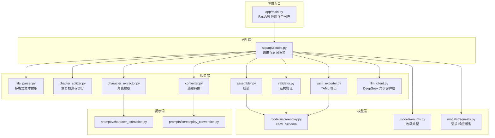
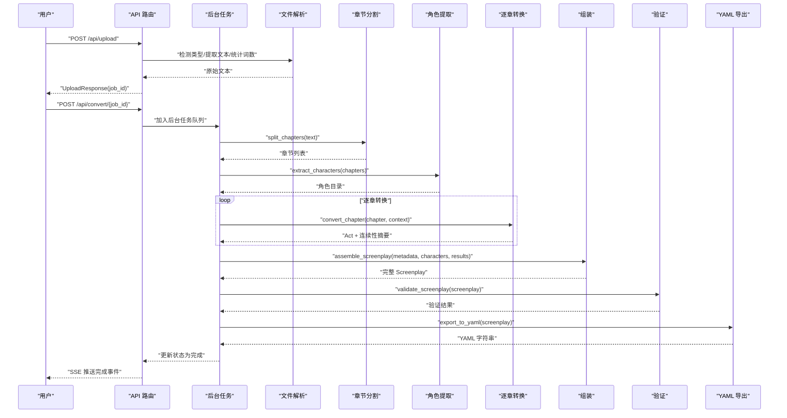
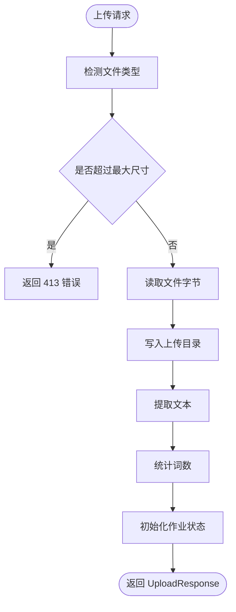
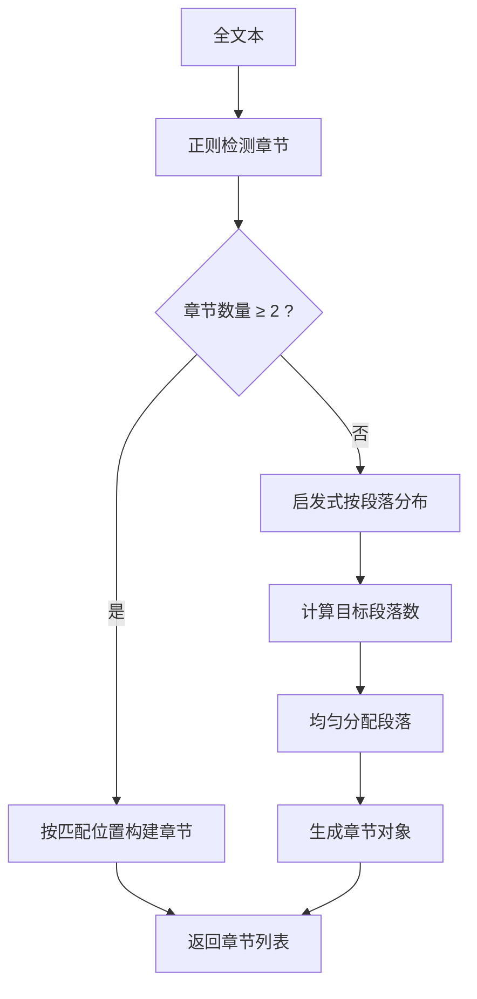
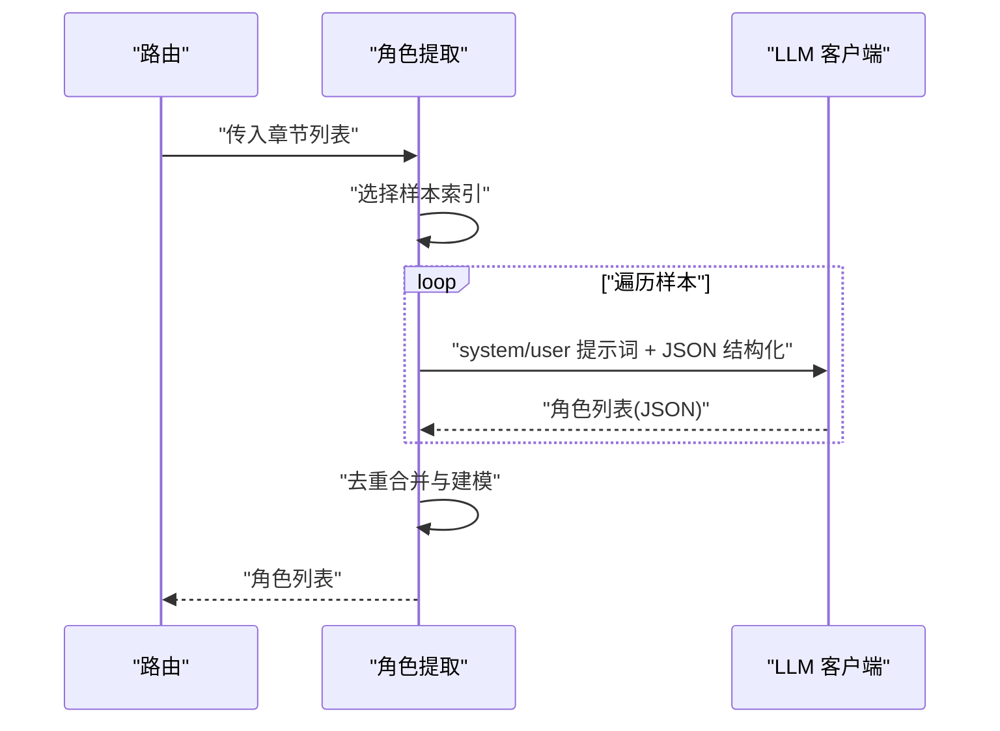
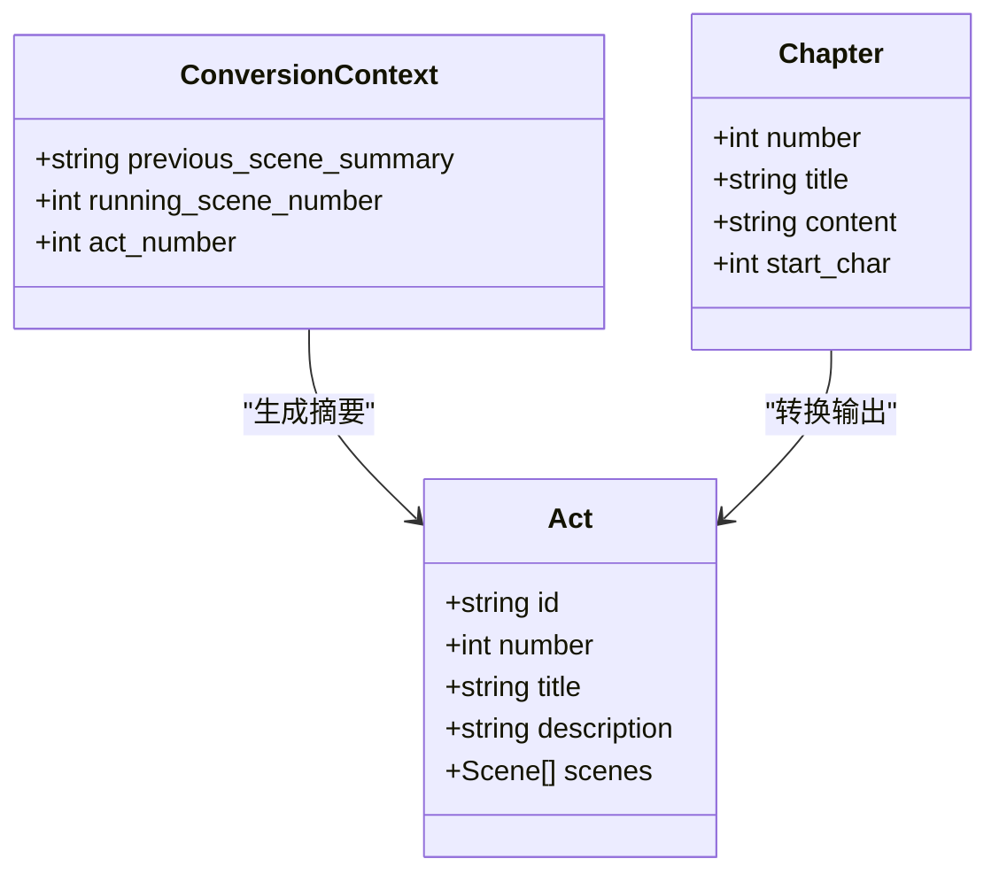
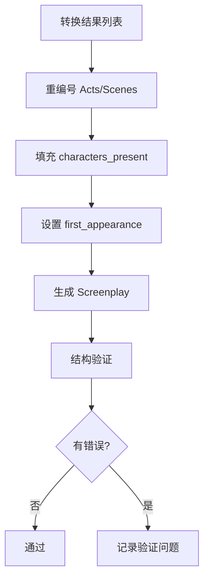
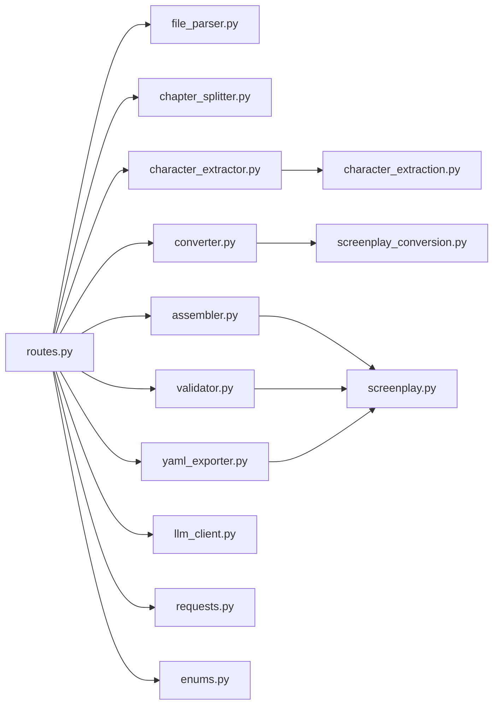

# 数据流架构

<cite>
**本文档引用的文件**
- [app/main.py](file://app/main.py)
- [app/api/routes.py](file://app/api/routes.py)
- [app/config.py](file://app/config.py)
- [app/services/file_parser.py](file://app/services/file_parser.py)
- [app/services/chapter_splitter.py](file://app/services/chapter_splitter.py)
- [app/services/character_extractor.py](file://app/services/character_extractor.py)
- [app/services/converter.py](file://app/services/converter.py)
- [app/services/assembler.py](file://app/services/assembler.py)
- [app/services/validator.py](file://app/services/validator.py)
- [app/services/yaml_exporter.py](file://app/services/yaml_exporter.py)
- [app/services/llm_client.py](file://app/services/llm_client.py)
- [app/models/screenplay.py](file://app/models/screenplay.py)
- [app/models/enums.py](file://app/models/enums.py)
- [app/models/requests.py](file://app/models/requests.py)
- [app/prompts/character_extraction.py](file://app/prompts/character_extraction.py)
- [app/prompts/screenplay_conversion.py](file://app/prompts/screenplay_conversion.py)
- [README.md](file://README.md)
</cite>

## 目录
1. [简介](#简介)
2. [项目结构](#项目结构)
3. [核心组件](#核心组件)
4. [架构总览](#架构总览)
5. [详细组件分析](#详细组件分析)
6. [依赖关系分析](#依赖关系分析)
7. [性能考量](#性能考量)
8. [故障排查指南](#故障排查指南)
9. [结论](#结论)
10. [附录](#附录)

## 简介
本文件面向“小说转剧本”系统的数据流架构，系统以 FastAPI 为基础，提供从文件上传到最终 YAML 输出的完整处理链路。数据在各处理阶段进行解析、章节分割、角色提取、剧本转换、数据验证与 YAML 导出；系统采用异步处理与后台任务机制，结合内存作业状态与 SSE 实时进度反馈；数据缓存与临时存储通过配置化的上传与输出目录实现。

## 项目结构
系统采用按功能域划分的模块化组织方式：
- API 层：路由与控制器，负责请求接入、状态管理与 SSE 推送
- 服务层：文件解析、章节分割、角色提取、转换、组装、验证、导出、LLM 客户端
- 模型层：基于 Pydantic 的 YAML Schema 定义，确保结构一致性与可验证性
- 配置层：统一读取环境变量与运行时目录

图表来源
- [app/main.py:1-46](file://app/main.py#L1-L46)
- [app/api/routes.py:1-313](file://app/api/routes.py#L1-L313)
- [app/services/file_parser.py:1-187](file://app/services/file_parser.py#L1-L187)
- [app/services/chapter_splitter.py:1-163](file://app/services/chapter_splitter.py#L1-L163)
- [app/services/character_extractor.py:1-154](file://app/services/character_extractor.py#L1-L154)
- [app/services/converter.py:1-218](file://app/services/converter.py#L1-L218)
- [app/services/assembler.py:1-101](file://app/services/assembler.py#L1-L101)
- [app/services/validator.py:1-111](file://app/services/validator.py#L1-L111)
- [app/services/yaml_exporter.py:1-57](file://app/services/yaml_exporter.py#L1-L57)
- [app/services/llm_client.py:1-103](file://app/services/llm_client.py#L1-L103)
- [app/models/screenplay.py:1-167](file://app/models/screenplay.py#L1-L167)
- [app/models/enums.py:1-83](file://app/models/enums.py#L1-L83)
- [app/models/requests.py:1-41](file://app/models/requests.py#L1-L41)
- [app/prompts/character_extraction.py:1-47](file://app/prompts/character_extraction.py#L1-L47)
- [app/prompts/screenplay_conversion.py:1-91](file://app/prompts/screenplay_conversion.py#L1-L91)

章节来源
- [README.md:77-117](file://README.md#L77-L117)
- [app/main.py:1-46](file://app/main.py#L1-L46)
- [app/api/routes.py:1-313](file://app/api/routes.py#L1-L313)

## 核心组件
- 文件解析服务：支持 TXT、MD、DOCX、PDF，执行编码探测、格式剥离、空白规范化与词数统计
- 章节分割服务：两阶段策略（正则+启发式），在少于两个章节时回退至按段落均分
- 角色提取服务：对样本章节调用 LLM，去重合并，生成角色目录
- 转换服务：逐章转换，维护连续性上下文，生成场景与元素
- 组装服务：全局重编号、填充出场角色、设置首次出场
- 验证服务：结构完整性校验，角色引用与编号一致性检查
- YAML 导出服务：使用 ruamel.yaml 保持顺序与块风格，添加头部注释
- LLM 客户端：异步 OpenAI 兼容封装，支持 JSON 结构化输出与指数回退

章节来源
- [app/services/file_parser.py:16-187](file://app/services/file_parser.py#L16-L187)
- [app/services/chapter_splitter.py:42-163](file://app/services/chapter_splitter.py#L42-L163)
- [app/services/character_extractor.py:21-154](file://app/services/character_extractor.py#L21-L154)
- [app/services/converter.py:36-218](file://app/services/converter.py#L36-L218)
- [app/services/assembler.py:18-101](file://app/services/assembler.py#L18-L101)
- [app/services/validator.py:11-111](file://app/services/validator.py#L11-L111)
- [app/services/yaml_exporter.py:14-57](file://app/services/yaml_exporter.py#L14-L57)
- [app/services/llm_client.py:18-103](file://app/services/llm_client.py#L18-L103)

## 架构总览
系统采用“请求-后台任务-状态推送”的异步处理模式：
- 上传阶段：校验文件类型与大小，持久化到上传目录，提取文本与词数，初始化作业状态
- 转换阶段：后台任务按阶段推进，更新状态并推送 SSE；每章转换维护连续性上下文
- 输出阶段：生成 YAML，保存到输出目录，提供下载与预览

图表来源
- [app/api/routes.py:114-313](file://app/api/routes.py#L114-L313)
- [app/services/chapter_splitter.py:42-63](file://app/services/chapter_splitter.py#L42-L63)
- [app/services/character_extractor.py:21-75](file://app/services/character_extractor.py#L21-L75)
- [app/services/converter.py:36-84](file://app/services/converter.py#L36-L84)
- [app/services/assembler.py:18-50](file://app/services/assembler.py#L18-L50)
- [app/services/validator.py:11-26](file://app/services/validator.py#L11-L26)
- [app/services/yaml_exporter.py:14-57](file://app/services/yaml_exporter.py#L14-L57)

## 详细组件分析

### 文件上传与解析
- 输入校验：扩展名映射到受支持类型，超大文件拒绝
- 文本提取：TXT/MD/DOCX/PDF 分支处理，异常统一包装为解析错误
- 后处理：Unicode 归一化、空白折叠、去除多余空行
- 词数统计：中英文混合计数，兼顾 CJK 与拉丁字符

图表来源
- [app/api/routes.py:68-112](file://app/api/routes.py#L68-L112)
- [app/services/file_parser.py:16-57](file://app/services/file_parser.py#L16-L57)
- [app/services/file_parser.py:180-187](file://app/services/file_parser.py#L180-L187)

章节来源
- [app/api/routes.py:68-112](file://app/api/routes.py#L68-L112)
- [app/services/file_parser.py:16-187](file://app/services/file_parser.py#L16-L187)

### 章节分割
- 两阶段策略：正则匹配常见章节标题（中/英/罗马数字），若检测不足则启发式按段落均分
- 启发式：按目标词数估算段落数，避免过短片段，最多 30 段
- 结果：Chapter 对象包含序号、标题、内容与起始字符偏移

图表来源
- [app/services/chapter_splitter.py:42-63](file://app/services/chapter_splitter.py#L42-L63)
- [app/services/chapter_splitter.py:99-134](file://app/services/chapter_splitter.py#L99-L134)

章节来源
- [app/services/chapter_splitter.py:42-163](file://app/services/chapter_splitter.py#L42-L163)

### 角色提取
- 样本策略：短文本全采样，长文本采前三段与中间/末尾段，限制单章长度
- LLM 调用：使用角色提取提示词，结构化 JSON 返回
- 合并与去重：按标准化 id 合并描述、别名与关系，缺失时回退占位角色

图表来源
- [app/services/character_extractor.py:21-75](file://app/services/character_extractor.py#L21-L75)
- [app/prompts/character_extraction.py:1-47](file://app/prompts/character_extraction.py#L1-L47)

章节来源
- [app/services/character_extractor.py:21-154](file://app/services/character_extractor.py#L21-L154)

### 剧本转换（逐章）
- 连续性上下文：ConversionContext 维护上一场景摘要、全局场景号与当前幕序
- LLM 调用：使用转换提示词，结构化 JSON 返回 Act
- 解析与回退：失败时生成最小可用 Act，保证流程继续
- 连续性摘要：生成章节结尾的两句话摘要，供下一章使用

图表来源
- [app/services/converter.py:16-84](file://app/services/converter.py#L16-L84)
- [app/models/screenplay.py:134-141](file://app/models/screenplay.py#L134-L141)

章节来源
- [app/services/converter.py:36-218](file://app/services/converter.py#L36-L218)

### 组装与验证
- 组装：全局重编号，填充每个场景的出场角色，设置角色首次出场场景
- 验证：检查元数据、结构连续性、场景元素存在性、角色引用有效性

图表来源
- [app/services/assembler.py:18-101](file://app/services/assembler.py#L18-L101)
- [app/services/validator.py:11-111](file://app/services/validator.py#L11-L111)

章节来源
- [app/services/assembler.py:18-101](file://app/services/assembler.py#L18-L101)
- [app/services/validator.py:11-111](file://app/services/validator.py#L11-L111)

### YAML 导出
- 模型序列化：Pydantic dump，排除 None 值
- 格式配置：块风格、缩进、宽度、Unicode 支持
- 头部注释：生成时间与文档链接
- 存储：同时写入输出目录以便下载

章节来源
- [app/services/yaml_exporter.py:14-57](file://app/services/yaml_exporter.py#L14-L57)

### LLM 客户端与并发控制
- 异步封装：基于 OpenAI 兼容接口，支持结构化 JSON 输出
- 重试策略：指数回退，最多三次
- 资源管理：任务结束时关闭底层 HTTP 客户端

章节来源
- [app/services/llm_client.py:18-103](file://app/services/llm_client.py#L18-L103)

## 依赖关系分析
- 路由层依赖服务层与模型层，负责状态管理与 SSE 推送
- 服务层内部耦合度低，职责单一，便于替换与扩展
- LLM 客户端作为外部依赖，通过配置注入，便于切换供应商
- 模型层为单源真，贯穿验证与导出

图表来源
- [app/api/routes.py:15-24](file://app/api/routes.py#L15-L24)
- [app/services/character_extractor.py:8-11](file://app/services/character_extractor.py#L8-L11)
- [app/services/converter.py:7-11](file://app/services/converter.py#L7-L11)
- [app/services/assembler.py:5-13](file://app/services/assembler.py#L5-L13)
- [app/services/validator.py:5-6](file://app/services/validator.py#L5-L6)
- [app/services/yaml_exporter.py:9](file://app/services/yaml_exporter.py#L9-L9)
- [app/models/screenplay.py:12](file://app/models/screenplay.py#L12-L12)
- [app/models/requests.py:3](file://app/models/requests.py#L3-L3)
- [app/models/enums.py:3](file://app/models/enums.py#L3-L3)

## 性能考量
- 异步与并发
  - 转换流程以后台任务执行，避免阻塞主请求线程
  - LLM 调用为异步，具备指数回退，减少瞬时峰值
- 内存与 IO
  - 作业状态存储于内存字典，适合单实例部署；生产建议持久化
  - 上传与输出目录通过配置管理，便于挂载持久化存储
- Token 与预算
  - 单次 LLM 调用包含系统提示、角色目录、上下文、章节文本与输出 JSON，需合理控制章节长度与输出长度
- 缓存与临时存储
  - 上传文件落地磁盘，转换中间产物仅保留在内存与最终 YAML 文件
  - 建议在网关或反向代理层启用压缩与缓存静态资源

## 故障排查指南
- 上传失败
  - 文件类型不受支持：检查扩展名映射与提示词
  - 文件过大：调整最大上传大小配置
  - 解析错误：确认编码、DOCX/PDF 依赖是否安装
- 转换失败
  - LLM 调用异常：检查 API Key、网络连通性与重试日志
  - 章节过少：正则检测不到章节时回退启发式，确认文本结构
  - 角色提取为空：检查提示词与文本质量，系统会回退占位角色
- 验证失败
  - 角色引用缺失：检查角色目录与场景对话中的角色 ID
  - 编号不连续：确认组装阶段重编号逻辑
- 下载与预览
  - 未完成即下载：等待完成状态后再请求结果
  - 预览为空：确认 YAML 已成功生成并保存

章节来源
- [app/api/routes.py:68-112](file://app/api/routes.py#L68-L112)
- [app/api/routes.py:114-198](file://app/api/routes.py#L114-L198)
- [app/services/validator.py:11-111](file://app/services/validator.py#L11-L111)

## 结论
该系统以清晰的流水线与模块化设计实现了从多格式文本到结构化 YAML 剧本的自动化转换。通过异步后台任务与 SSE 实时反馈，提升了用户体验；通过 Pydantic 模型与验证服务，保障了输出质量。建议在生产环境中引入持久化作业存储、限流与重试队列，以及更完善的错误回滚与审计日志。

## 附录
- 配置项概览
  - DEEPSEEK_API_KEY：LLM 访问密钥
  - DEEPSEEK_BASE_URL：LLM 基础 URL
  - DEEPSEEK_MODEL：模型名称
  - MAX_UPLOAD_SIZE_MB：上传大小上限
  - DATA_DIR：数据目录（包含 uploads 与 outputs）

章节来源
- [app/config.py:9-44](file://app/config.py#L9-L44)
- [README.md:165-174](file://README.md#L165-L174)