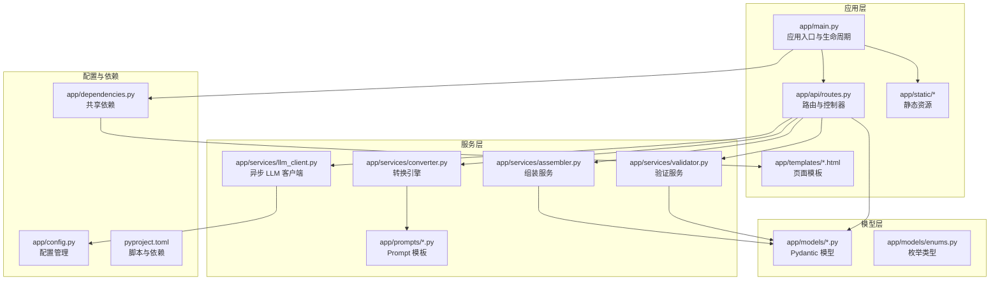
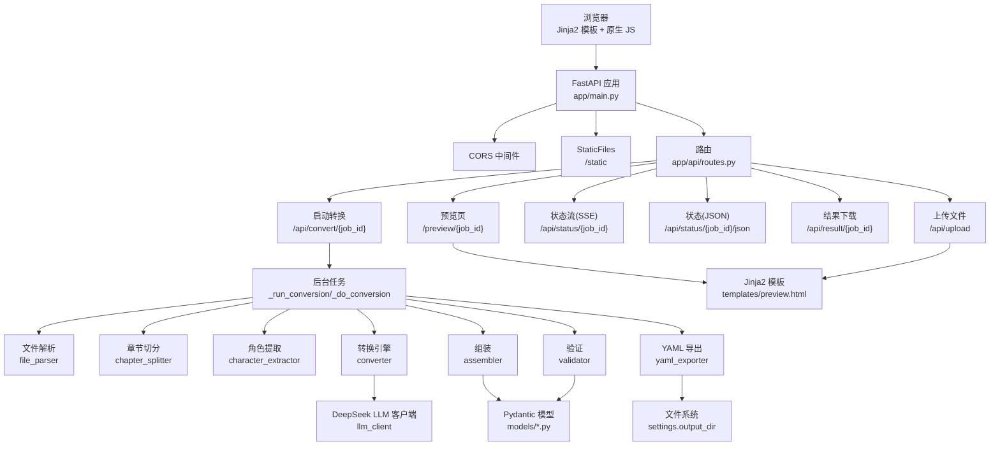
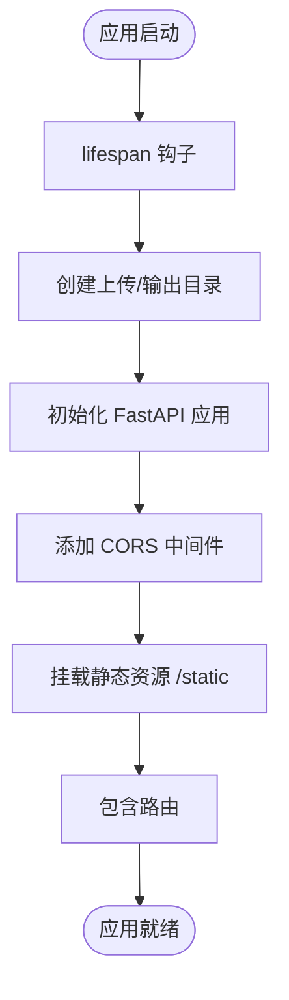
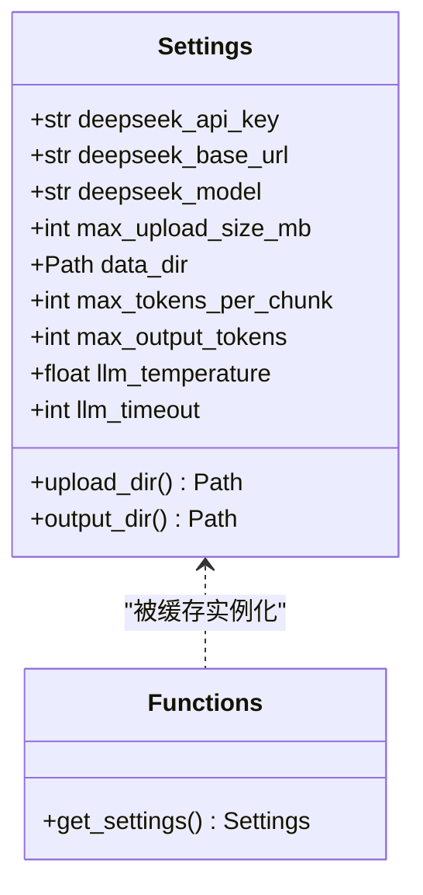
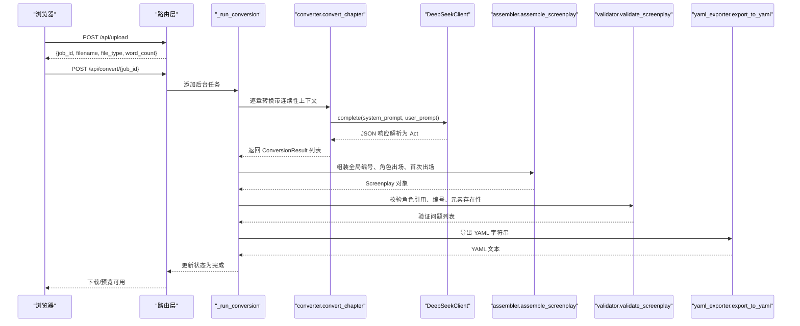
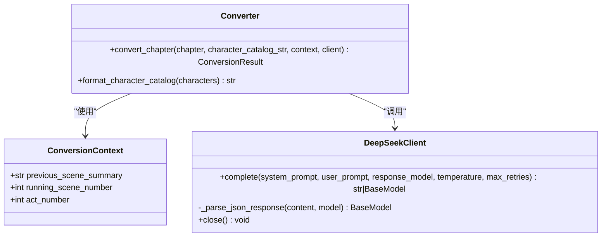
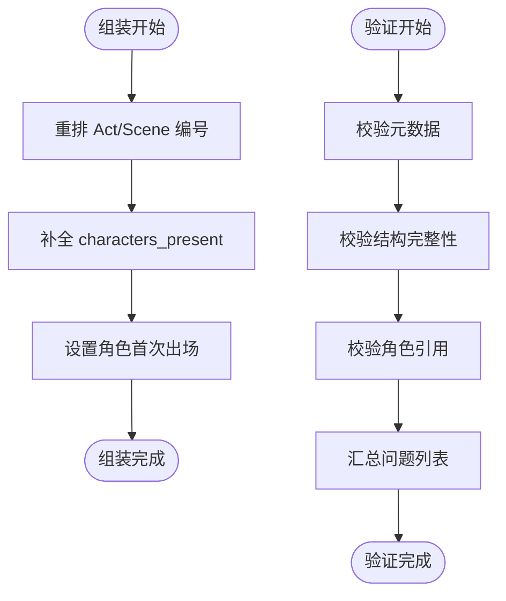
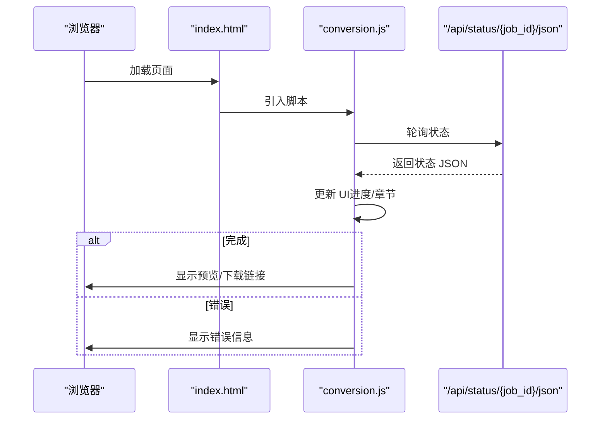
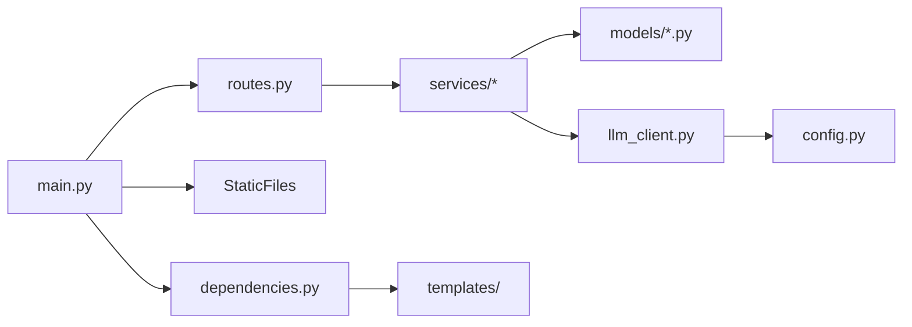

# 整体架构

<cite>
**本文引用的文件**   
- [app/main.py](file://app/main.py)
- [app/config.py](file://app/config.py)
- [app/api/routes.py](file://app/api/routes.py)
- [app/dependencies.py](file://app/dependencies.py)
- [app/models/screenplay.py](file://app/models/screenplay.py)
- [app/models/enums.py](file://app/models/enums.py)
- [app/services/converter.py](file://app/services/converter.py)
- [app/services/llm_client.py](file://app/services/llm_client.py)
- [app/services/assembler.py](file://app/services/assembler.py)
- [app/services/validator.py](file://app/services/validator.py)
- [app/prompts/screenplay_conversion.py](file://app/prompts/screenplay_conversion.py)
- [app/templates/index.html](file://app/templates/index.html)
- [app/static/js/conversion.js](file://app/static/js/conversion.js)
- [pyproject.toml](file://pyproject.toml)
- [README.md](file://README.md)
</cite>

## 目录
1. [简介](#简介)
2. [项目结构](#项目结构)
3. [核心组件](#核心组件)
4. [架构总览](#架构总览)
5. [详细组件分析](#详细组件分析)
6. [依赖关系分析](#依赖关系分析)
7. [性能考虑](#性能考虑)
8. [故障排查指南](#故障排查指南)
9. [结论](#结论)
10. [附录](#附录)

## 简介
本项目是一个基于 FastAPI 的 Web 应用，提供“小说转剧本”的 AI 驱动工具。用户可通过 Web 页面上传小说文件，系统将异步执行解析、章节切分、角色提取、逐章转换、组装、验证与导出等流程，最终输出结构化的 YAML 剧本文件。前端采用 Jinja2 模板与原生 JavaScript，静态资源通过 FastAPI 的 StaticFiles 托管；后端通过 CORS 中间件支持跨域访问。

## 项目结构
项目采用按功能域划分的模块化组织方式，主要目录与职责如下：
- app/main.py：应用入口点，定义 FastAPI 实例、生命周期钩子、CORS、静态资源挂载与路由注册。
- app/config.py：使用 pydantic-settings 管理配置，提供运行时目录、LLM 参数与 API Key 等设置。
- app/api/routes.py：定义页面与 API 路由，实现文件上传、转换任务启动、状态查询、结果下载与预览。
- app/dependencies.py：共享依赖（模板引擎、基础路径），避免循环导入。
- app/models/：Pydantic 模型定义 YAML Schema 的完整结构，用于序列化、反序列化与校验。
- app/services/：核心业务服务，包括文件解析、章节切分、角色提取、转换引擎、组装、验证与 YAML 导出。
- app/prompts/：LLM Prompt 模板，指导转换过程的系统提示与用户提示。
- app/templates/ 与 app/static/：Jinja2 模板与前端静态资源（CSS/JS），用于页面渲染与交互。
- pyproject.toml：项目元数据、依赖与脚本入口（novel-serve）。
- README.md：功能特性、技术栈、快速开始、使用流程与处理流水线说明。

**图示来源**
- [app/main.py:1-46](file://app/main.py#L1-L46)
- [app/api/routes.py:1-313](file://app/api/routes.py#L1-L313)
- [app/config.py:1-45](file://app/config.py#L1-L45)
- [app/dependencies.py:1-9](file://app/dependencies.py#L1-L9)
- [app/models/screenplay.py:1-167](file://app/models/screenplay.py#L1-L167)
- [app/models/enums.py:1-83](file://app/models/enums.py#L1-L83)
- [app/services/converter.py:1-218](file://app/services/converter.py#L1-L218)
- [app/services/llm_client.py:1-103](file://app/services/llm_client.py#L1-L103)
- [app/services/assembler.py:1-101](file://app/services/assembler.py#L1-L101)
- [app/services/validator.py:1-111](file://app/services/validator.py#L1-L111)
- [app/prompts/screenplay_conversion.py:1-91](file://app/prompts/screenplay_conversion.py#L1-L91)
- [pyproject.toml:1-47](file://pyproject.toml#L1-L47)

**章节来源**
- [README.md:77-108](file://README.md#L77-L108)
- [pyproject.toml:8-35](file://pyproject.toml#L8-L35)

## 核心组件
- 应用入口与生命周期
  - 使用 lifespan 钩子在启动时创建上传与输出目录，确保运行时数据目录可用。
  - 注册 CORS 中间件，允许任意来源、方法与头，便于前后端分离部署。
  - 挂载静态资源目录，提供前端 CSS/JS。
  - 包含路由注册，统一暴露页面与 API。
- 配置管理
  - 通过 pydantic-settings 从 .env 与环境变量加载配置，提供 LLM API Key、基础 URL、模型、最大上传大小、数据目录与 LLM 参数等。
  - 暴露 upload_dir 与 output_dir 属性，供路由与服务层使用。
- 路由与控制器
  - 页面路由：首页上传页与 YAML 预览页。
  - API 路由：上传文件、启动转换（后台任务）、SSE/JSON 状态查询、结果下载与文本预览、验证结果查询。
  - 内存级作业存储（字典）与状态枚举，支持转换阶段跟踪。
- 模型与枚举
  - 完整的 YAML Schema 模型（Metadata、Character、Scene、Act、Structure、ScreenplayElement 等），用于强类型校验与序列化。
  - 枚举类型覆盖角色类型、时间、内外景、元素类型、转场类型、格式与重要性等。
- 服务层
  - LLM 客户端：封装 OpenAI 兼容的异步调用，支持结构化 JSON 输出与重试。
  - 转换引擎：章节级转换、连续性上下文传递、场景元素解析与回退策略。
  - 组装服务：全局编号重排、角色出场信息与首次出场标记。
  - 验证服务：结构完整性校验（角色引用、编号、元素存在性等）。
- 前后端分离与静态资源
  - 模板引擎（Jinja2）渲染页面，静态资源通过 StaticFiles 挂载。
  - 前端 JavaScript 通过轮询方式兼容地获取转换状态，支持预览与下载。

**章节来源**
- [app/main.py:14-46](file://app/main.py#L14-L46)
- [app/config.py:9-44](file://app/config.py#L9-L44)
- [app/api/routes.py:53-313](file://app/api/routes.py#L53-L313)
- [app/models/screenplay.py:17-167](file://app/models/screenplay.py#L17-L167)
- [app/models/enums.py:6-83](file://app/models/enums.py#L6-L83)
- [app/services/llm_client.py:18-103](file://app/services/llm_client.py#L18-L103)
- [app/services/converter.py:16-218](file://app/services/converter.py#L16-L218)
- [app/services/assembler.py:18-101](file://app/services/assembler.py#L18-L101)
- [app/services/validator.py:11-111](file://app/services/validator.py#L11-L111)
- [app/templates/index.html:1-140](file://app/templates/index.html#L1-L140)
- [app/static/js/conversion.js:30-130](file://app/static/js/conversion.js#L30-L130)

## 架构总览
下图展示了系统的高层架构与组件交互关系，涵盖请求进入、路由处理、业务服务调用、LLM 推理、数据持久化与前端渲染。

**图示来源**
- [app/main.py:23-46](file://app/main.py#L23-L46)
- [app/api/routes.py:68-313](file://app/api/routes.py#L68-L313)
- [app/services/converter.py:36-84](file://app/services/converter.py#L36-L84)
- [app/services/llm_client.py:33-86](file://app/services/llm_client.py#L33-L86)
- [app/models/screenplay.py:161-167](file://app/models/screenplay.py#L161-L167)
- [app/templates/index.html:136-139](file://app/templates/index.html#L136-L139)

## 详细组件分析

### 应用入口与生命周期（FastAPI）
- 生命周期管理：通过 lifespan 在启动时创建上传与输出目录，确保数据目录存在。
- 中间件配置：启用 CORS，允许任意来源、方法与头，便于前端跨域访问。
- 静态资源：挂载 /static，映射到 app/static 目录。
- 路由注册：include_router(router) 将所有 API 与页面路由接入应用。
- 启动入口：run() 函数通过 uvicorn 在 0.0.0.0:8008 启动，支持热重载。

**图示来源**
- [app/main.py:14-46](file://app/main.py#L14-L46)

**章节来源**
- [app/main.py:14-46](file://app/main.py#L14-L46)

### 配置管理（pydantic-settings）
- 配置项：DeepSeek API Key、基础 URL、模型名称、最大上传大小、数据目录、LLM 参数（最大分块 token、输出 token、温度、超时）。
- 运行时目录：upload_dir 与 output_dir 基于 data_dir 生成。
- 缓存：使用 lru_cache 缓存 Settings 实例，减少重复读取。

**图示来源**
- [app/config.py:9-44](file://app/config.py#L9-L44)

**章节来源**
- [app/config.py:9-44](file://app/config.py#L9-L44)

### 路由与控制器（API 与页面）
- 页面路由
  - GET /：返回上传/转换页面。
  - GET /preview/{job_id}：返回 YAML 预览页面。
- API 路由
  - POST /api/upload：上传文件，进行类型检测、大小限制、文本提取与词数统计，生成 job_id 并写入内存作业池。
  - POST /api/convert/{job_id}：启动后台转换任务，支持传入临时 API Key。
  - GET /api/status/{job_id}：Server-Sent Events 流式推送状态。
  - GET /api/status/{job_id}/json：轮询兼容的状态查询。
  - GET /api/result/{job_id}：下载 YAML 文件。
  - GET /api/result/{job_id}/text：返回纯文本预览。
  - GET /api/validate/{job_id}：返回验证问题列表。
- 状态管理：使用内存字典保存作业数据与状态，支持更新与错误处理。

**图示来源**
- [app/api/routes.py:68-313](file://app/api/routes.py#L68-L313)
- [app/services/converter.py:36-84](file://app/services/converter.py#L36-L84)
- [app/services/llm_client.py:33-86](file://app/services/llm_client.py#L33-L86)
- [app/services/assembler.py:18-51](file://app/services/assembler.py#L18-L51)
- [app/services/validator.py:11-47](file://app/services/validator.py#L11-L47)

**章节来源**
- [app/api/routes.py:68-313](file://app/api/routes.py#L68-L313)

### 转换引擎与 LLM 客户端
- 转换引擎
  - ConversionContext：维护上一场景摘要、全局场景号与幕序号，用于跨章节连续性。
  - convert_chapter：对单章进行转换，截断过长文本，构造用户提示，调用 LLM 获取结构化 JSON，解析为 Act；生成两句话的连续性摘要并更新上下文。
  - 回退策略：当 LLM 失败时生成最小化 Act 以保证流程继续。
- LLM 客户端
  - 封装 AsyncOpenAI，支持结构化 JSON 输出与指数退避重试。
  - 从配置读取模型、基础 URL、超时与温度等参数。

**图示来源**
- [app/services/converter.py:16-84](file://app/services/converter.py#L16-L84)
- [app/services/llm_client.py:18-86](file://app/services/llm_client.py#L18-L86)

**章节来源**
- [app/services/converter.py:16-218](file://app/services/converter.py#L16-L218)
- [app/services/llm_client.py:18-103](file://app/services/llm_client.py#L18-L103)

### 组装与验证服务
- 组装服务
  - 重排 Act 与 Scene 的全局编号，补全 characters_present，设置每个角色的 first_appearance。
- 验证服务
  - 校验元数据完整性、Act/Scene 编号连续性、场景元素存在性与角色引用有效性，输出问题列表。

**图示来源**
- [app/services/assembler.py:53-101](file://app/services/assembler.py#L53-L101)
- [app/services/validator.py:11-111](file://app/services/validator.py#L11-L111)

**章节来源**
- [app/services/assembler.py:18-101](file://app/services/assembler.py#L18-L101)
- [app/services/validator.py:11-111](file://app/services/validator.py#L11-L111)

### 前后端分离与静态资源
- 页面渲染：Jinja2 模板（index.html、preview.html、base.html）由依赖注入的模板引擎渲染。
- 静态资源：通过 StaticFiles 挂载 /static，前端 JS（upload.js、conversion.js、preview.js）与 CSS（app.css）按需加载。
- 前端交互：conversion.js 通过轮询 /api/status/{job_id}/json 获取状态，更新进度条与章节信息；完成后跳转预览或下载。

**图示来源**
- [app/templates/index.html:136-139](file://app/templates/index.html#L136-L139)
- [app/static/js/conversion.js:30-130](file://app/static/js/conversion.js#L30-L130)

**章节来源**
- [app/templates/index.html:1-140](file://app/templates/index.html#L1-140)
- [app/static/js/conversion.js:30-130](file://app/static/js/conversion.js#L30-L130)

## 依赖关系分析
- 模块耦合
  - 路由层依赖服务层（converter、assembler、validator、llm_client 等），但避免直接依赖具体实现细节，通过抽象接口与模型解耦。
  - 服务层内部协作紧密（转换 → 组装 → 验证），LLM 客户端作为外部依赖被统一注入。
  - 模型层为单源真理，被路由与服务层广泛使用，确保数据结构一致性。
- 外部依赖
  - FastAPI、Uvicorn、Jinja2、pydantic/pydantic-settings、openai(httpx)、ruamel.yaml、pdfplumber、python-docx 等。
- 可能的改进
  - 将内存作业池替换为持久化存储（如 Redis 或数据库），以支持多实例扩展与重启恢复。
  - 将静态资源托管迁移到 CDN，提升前端加载性能。

**图示来源**
- [app/api/routes.py:15-23](file://app/api/routes.py#L15-L23)
- [app/main.py:37-39](file://app/main.py#L37-L39)
- [app/dependencies.py:7-8](file://app/dependencies.py#L7-L8)

**章节来源**
- [pyproject.toml:13-25](file://pyproject.toml#L13-L25)

## 性能考虑
- LLM 调用
  - 使用异步客户端与指数退避重试，避免瞬时失败导致任务中断。
  - 控制输出 token 数量与温度，平衡质量与成本。
- 转换流程
  - 对长章节进行长度截断，避免超出 token 预算；通过连续性摘要维持跨章节一致性。
- 前端交互
  - 使用轮询替代 SSE，提高兼容性；合理设置轮询间隔，避免过度请求。
- 存储与并发
  - 后台任务使用 BackgroundTasks，避免阻塞主请求；建议引入队列（如 Celery/RQ）与工作进程池以提升吞吐。

## 故障排查指南
- CORS 相关
  - 若出现跨域错误，确认 CORS 中间件已正确添加且允许来源、方法与头。
- LLM 调用失败
  - 检查 DEEPSEEK_API_KEY、DEEPSEEK_BASE_URL 与 DEEPSEEK_MODEL 是否正确配置；查看重试日志与异常堆栈。
- 文件上传失败
  - 检查文件类型是否受支持、大小是否超过限制、上传目录权限是否正确。
- 转换未完成
  - 通过 /api/status/{job_id}/json 查看当前阶段与进度；若处于 ERROR，查看错误消息并重试。
- 验证失败
  - 根据 /api/validate/{job_id} 返回的问题列表修正角色引用、编号或元素缺失问题。

**章节来源**
- [app/main.py:30-35](file://app/main.py#L30-L35)
- [app/api/routes.py:114-128](file://app/api/routes.py#L114-L128)
- [app/services/llm_client.py:70-86](file://app/services/llm_client.py#L70-L86)

## 结论
该系统以 FastAPI 为核心，采用前后端分离与模块化设计，结合 Pydantic 模型与 LLM 推理，实现了从“小说文本”到“结构化 YAML 剧本”的自动化转换。通过清晰的生命周期管理、CORS 支持、静态资源托管与健壮的转换流水线，系统具备良好的可扩展性与可维护性。后续可在持久化、并发与前端性能方面进一步优化。

## 附录
- 快速启动
  - 安装依赖后，使用 novel-serve 或 uvicorn 启动应用，默认监听 0.0.0.0:8008。
- 环境变量
  - DEEPSEEK_API_KEY、DEEPSEEK_BASE_URL、DEEPSEEK_MODEL、MAX_UPLOAD_SIZE_MB、DATA_DIR。
- 技术栈概览
  - 后端：FastAPI、Uvicorn、Jinja2、Pydantic/Settings
  - LLM：DeepSeek（OpenAI 兼容）
  - 前端：Jinja2 + Tailwind CSS + 原生 JS
  - 工具：ruamel.yaml、pdfplumber、python-docx、httpx

**章节来源**
- [README.md:28-68](file://README.md#L28-L68)
- [pyproject.toml:34-35](file://pyproject.toml#L34-L35)
- [app/main.py:42-46](file://app/main.py#L42-L46)