# 架构设计

<cite>
**本文档引用的文件**
- [app/main.py](file://app/main.py)
- [app/api/routes.py](file://app/api/routes.py)
- [app/config.py](file://app/config.py)
- [app/models/enums.py](file://app/models/enums.py)
- [app/models/screenplay.py](file://app/models/screenplay.py)
- [app/services/chapter_splitter.py](file://app/services/chapter_splitter.py)
- [app/services/converter.py](file://app/services/converter.py)
- [app/services/llm_client.py](file://app/services/llm_client.py)
- [app/services/assembler.py](file://app/services/assembler.py)
- [app/services/validator.py](file://app/services/validator.py)
- [app/services/yaml_exporter.py](file://app/services/yaml_exporter.py)
- [app/templates/index.html](file://app/templates/index.html)
- [app/static/js/conversion.js](file://app/static/js/conversion.js)
- [pyproject.toml](file://pyproject.toml)
- [README.md](file://README.md)
</cite>

## 目录
1. [引言](#引言)
2. [项目结构](#项目结构)
3. [核心组件](#核心组件)
4. [架构总览](#架构总览)
5. [详细组件分析](#详细组件分析)
6. [依赖分析](#依赖分析)
7. [性能考虑](#性能考虑)
8. [故障排查指南](#故障排查指南)
9. [结论](#结论)
10. [附录](#附录)

## 引言
本项目是一个“小说转剧本”工具，目标是将小说文本自动转换为结构化的 YAML 剧本，降低改编门槛并提升创作效率。系统采用前后端分离架构，后端基于 FastAPI 提供 REST API 与 Server-Sent Events 实时状态推送；前端使用 Jinja2 模板与原生 JavaScript 构建用户界面，支持拖拽上传、实时进度展示与 YAML 预览下载。

系统以分层架构组织：表示层（API 路由）、业务逻辑层（服务模块）、数据访问层（配置管理）。数据流从文件上传开始，经过解析、章节切分、角色提取、逐章转换、组装、验证，最终导出 YAML。技术选型上，FastAPI 提供高性能异步能力与自动生成 OpenAPI 文档；Pydantic 用于强类型数据模型与自动校验；DeepSeek API（OpenAI 兼容）提供 LLM 推理能力；ruamel.yaml 保障 YAML 输出质量与可读性。

## 项目结构
项目采用按功能域分层的目录组织方式：
- app/main.py：应用入口，初始化 FastAPI、中间件、静态资源挂载与路由注册
- app/api/routes.py：API 路由定义，包含页面渲染与后台任务触发、状态查询、结果下载等
- app/config.py：配置管理，使用 pydantic-settings 加载 .env 与环境变量
- app/models/：数据模型与枚举，定义 YAML Schema 的 Pydantic 模型
- app/services/：核心业务服务，包括章节切分、角色提取、转换引擎、组装、验证、导出等
- app/prompts/：LLM Prompt 模板（未在本节展开）
- app/templates/ 与 app/static/：Jinja2 模板与前端静态资源
- tests/：单元与集成测试
- docs/YAML_SCHEMA.md：YAML Schema 定义文档

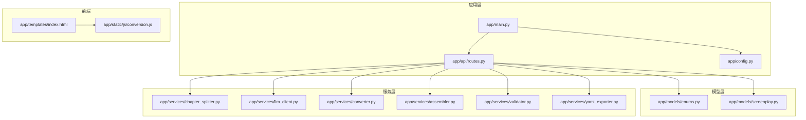

图表来源
- [app/main.py:1-46](file://app/main.py#L1-L46)
- [app/api/routes.py:1-313](file://app/api/routes.py#L1-L313)
- [app/config.py:1-45](file://app/config.py#L1-L45)
- [app/models/enums.py:1-83](file://app/models/enums.py#L1-L83)
- [app/models/screenplay.py:1-167](file://app/models/screenplay.py#L1-L167)
- [app/services/chapter_splitter.py:1-163](file://app/services/chapter_splitter.py#L1-L163)
- [app/services/llm_client.py:1-103](file://app/services/llm_client.py#L1-L103)
- [app/services/converter.py:1-218](file://app/services/converter.py#L1-L218)
- [app/services/assembler.py:1-101](file://app/services/assembler.py#L1-L101)
- [app/services/validator.py:1-111](file://app/services/validator.py#L1-L111)
- [app/services/yaml_exporter.py:1-57](file://app/services/yaml_exporter.py#L1-L57)
- [app/templates/index.html:1-140](file://app/templates/index.html#L1-L140)
- [app/static/js/conversion.js:1-130](file://app/static/js/conversion.js#L1-L130)

章节来源
- [README.md:77-108](file://README.md#L77-L108)

## 核心组件
- 表示层（API 路由）：负责接收上传请求、启动后台转换任务、提供状态查询与结果下载接口，以及页面渲染
- 业务逻辑层（服务模块）：包含章节切分、角色提取、逐章转换、组装、验证、YAML 导出等核心算法
- 数据访问层（配置管理）：集中管理运行时配置，包括 LLM 参数、文件上传限制、数据目录等
- 前端界面：Jinja2 模板与原生 JS，提供拖拽上传、进度跟踪、预览与下载功能

章节来源
- [app/api/routes.py:52-206](file://app/api/routes.py#L52-L206)
- [app/services/chapter_splitter.py:42-63](file://app/services/chapter_splitter.py#L42-L63)
- [app/services/converter.py:36-84](file://app/services/converter.py#L36-L84)
- [app/services/assembler.py:18-50](file://app/services/assembler.py#L18-L50)
- [app/services/validator.py:11-26](file://app/services/validator.py#L11-L26)
- [app/services/yaml_exporter.py:14-28](file://app/services/yaml_exporter.py#L14-L28)
- [app/config.py:9-44](file://app/config.py#L9-L44)

## 架构总览
系统采用“异步后台任务 + SSE/轮询”的实时反馈机制。用户上传文件后，后端进行文件解析与章节切分，随后通过 LLM 完成角色提取与逐章转换，再进行组装、验证与 YAML 导出。前端通过轮询或 SSE 获取进度，完成后提供预览与下载。

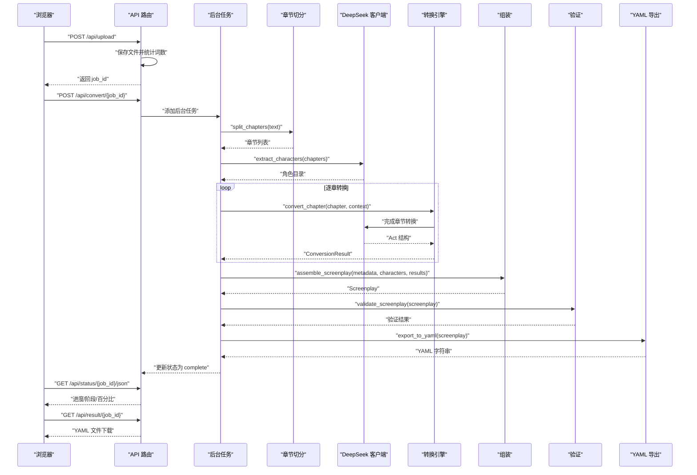

图表来源
- [app/api/routes.py:114-184](file://app/api/routes.py#L114-L184)
- [app/api/routes.py:208-313](file://app/api/routes.py#L208-L313)
- [app/services/chapter_splitter.py:42-63](file://app/services/chapter_splitter.py#L42-L63)
- [app/services/converter.py:36-84](file://app/services/converter.py#L36-L84)
- [app/services/assembler.py:18-50](file://app/services/assembler.py#L18-L50)
- [app/services/validator.py:11-26](file://app/services/validator.py#L11-L26)
- [app/services/yaml_exporter.py:14-28](file://app/services/yaml_exporter.py#L14-L28)
- [app/static/js/conversion.js:30-71](file://app/static/js/conversion.js#L30-L71)

## 详细组件分析

### 表示层（API 路由）
- 页面路由：首页与预览页渲染，使用模板引擎返回 HTML
- 文件上传：校验文件类型与大小，持久化到上传目录，计算词数并记录状态
- 后台转换：启动异步转换任务，支持传入用户 API Key
- 状态查询：SSE 流与 JSON 轮询两种方式，返回当前阶段、进度与章节信息
- 结果下载：提供 YAML 下载与纯文本预览

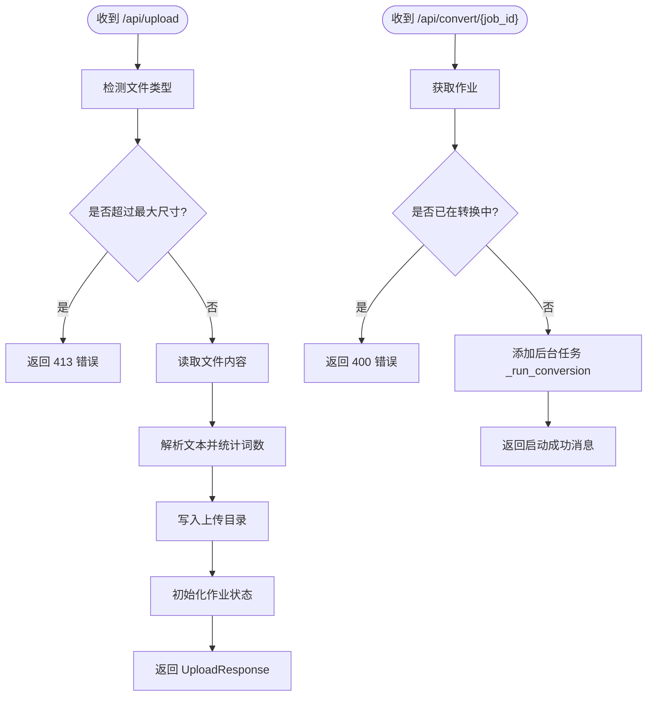

图表来源
- [app/api/routes.py:68-128](file://app/api/routes.py#L68-L128)

章节来源
- [app/api/routes.py:52-206](file://app/api/routes.py#L52-L206)

### 业务逻辑层（服务模块）

#### 章节切分服务
- 两阶段策略：正则匹配（中/英章节标题）+ 启发式切分（按段落与字数分布）
- 输出结构化章节对象，包含序号、标题、内容与起始字符偏移

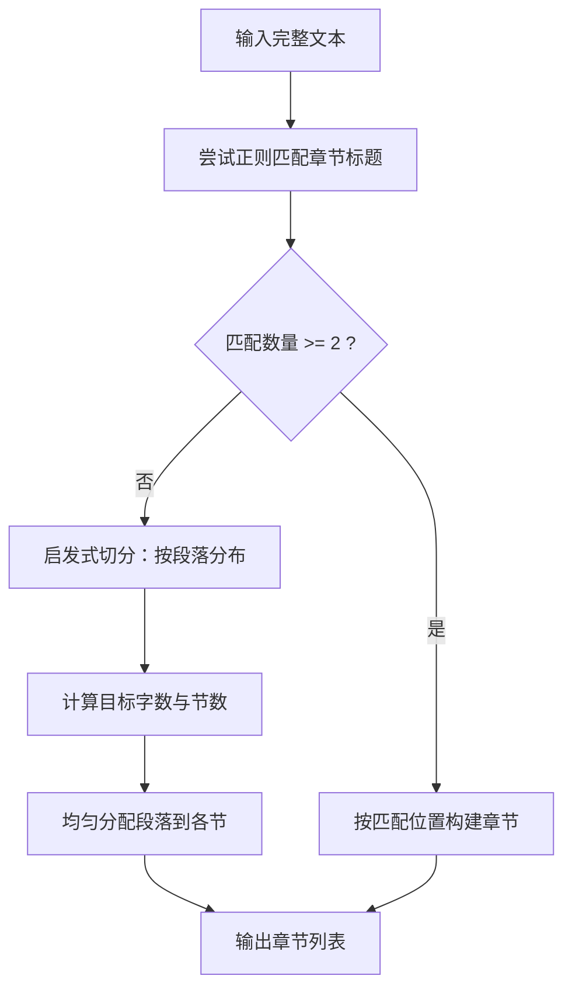

图表来源
- [app/services/chapter_splitter.py:42-63](file://app/services/chapter_splitter.py#L42-L63)
- [app/services/chapter_splitter.py:99-134](file://app/services/chapter_splitter.py#L99-L134)

章节来源
- [app/services/chapter_splitter.py:1-163](file://app/services/chapter_splitter.py#L1-L163)

#### LLM 客户端（DeepSeek）
- 异步封装 OpenAI 兼容接口，支持结构化 JSON 输出、温度与超时控制、指数退避重试
- 支持动态 API Key 注入，便于用户覆盖默认配置

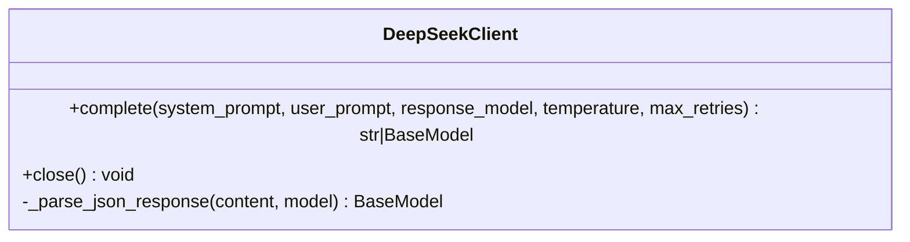

图表来源
- [app/services/llm_client.py:18-103](file://app/services/llm_client.py#L18-L103)

章节来源
- [app/services/llm_client.py:1-103](file://app/services/llm_client.py#L1-L103)

#### 转换引擎
- 逐章转换：对每章生成“滑动窗口 + 记忆”的连续性摘要，传递给下一章以保持一致性
- 角色目录格式化：将角色列表压缩为提示词，减少 Token 消耗
- 容错回退：当 LLM 失败时生成最小可用 Act 以保证流程继续

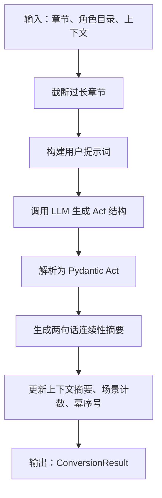

图表来源
- [app/services/converter.py:36-84](file://app/services/converter.py#L36-L84)
- [app/services/converter.py:186-217](file://app/services/converter.py#L186-L217)

章节来源
- [app/services/converter.py:1-218](file://app/services/converter.py#L1-L218)

#### 组装服务
- 合并各章 Act，重编号 Acts 与 Scenes，填充每个场景中的出场角色，设置角色首次出现场景

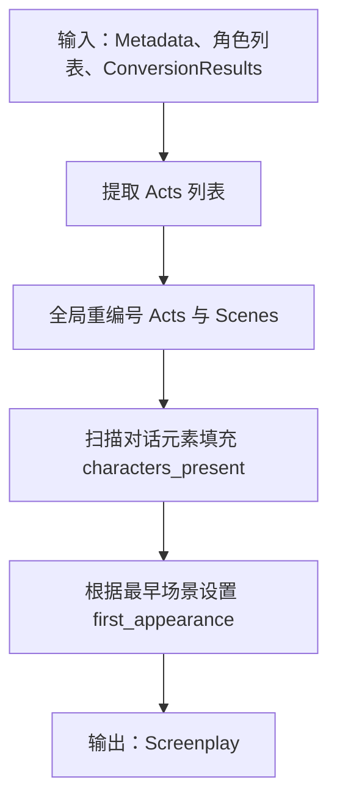

图表来源
- [app/services/assembler.py:18-50](file://app/services/assembler.py#L18-L50)

章节来源
- [app/services/assembler.py:1-101](file://app/services/assembler.py#L1-L101)

#### 验证服务
- 校验元数据完整性、Act/Scene 编号连续性、场景元素存在性、角色引用有效性
- 返回结构化验证问题列表，便于前端展示

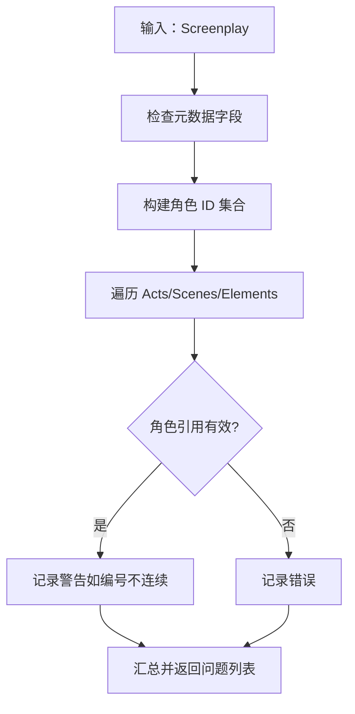

图表来源
- [app/services/validator.py:11-26](file://app/services/validator.py#L11-L26)

章节来源
- [app/services/validator.py:1-111](file://app/services/validator.py#L1-L111)

#### YAML 导出服务
- 使用 ruamel.yaml 保持插入顺序、块样式输出、Unicode 支持与注释
- 包裹顶层键并添加头部注释，输出标准化 YAML 字符串

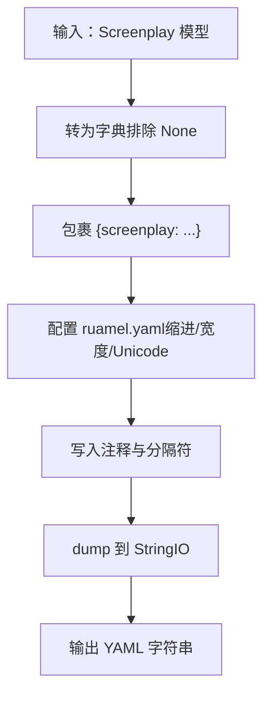

图表来源
- [app/services/yaml_exporter.py:14-28](file://app/services/yaml_exporter.py#L14-L28)

章节来源
- [app/services/yaml_exporter.py:1-57](file://app/services/yaml_exporter.py#L1-L57)

### 数据模型与枚举
- 元数据、角色、场景、幕、元素（动作、对白、括号、转场、备注）等模型
- 枚举类型涵盖角色类型、时间、内外景、元素重要性、转场类型、格式类型、转换阶段等

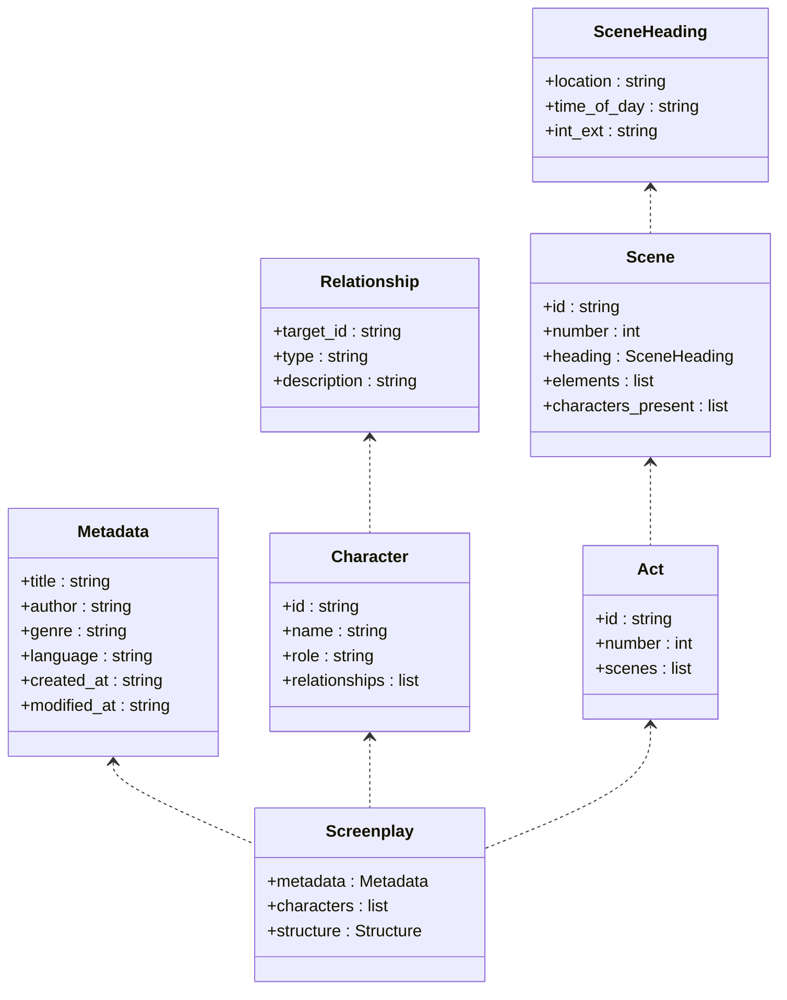

图表来源
- [app/models/screenplay.py:17-167](file://app/models/screenplay.py#L17-L167)
- [app/models/enums.py:6-83](file://app/models/enums.py#L6-L83)

章节来源
- [app/models/screenplay.py:1-167](file://app/models/screenplay.py#L1-L167)
- [app/models/enums.py:1-83](file://app/models/enums.py#L1-L83)

### 前后端交互与数据流
- 前端通过拖拽上传文件，提交后显示进度条与阶段标签
- 后端通过轮询或 SSE 推送状态，完成后提供预览与下载链接
- 验证结果在结果页展示错误/警告数量

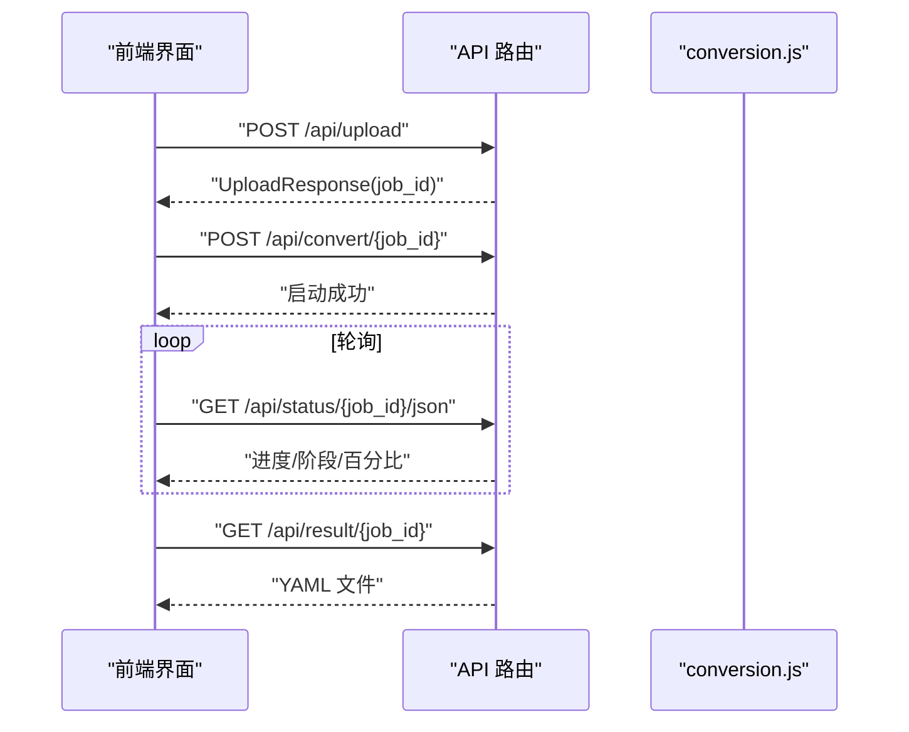

图表来源
- [app/static/js/conversion.js:30-71](file://app/static/js/conversion.js#L30-L71)
- [app/api/routes.py:131-165](file://app/api/routes.py#L131-L165)
- [app/api/routes.py:168-198](file://app/api/routes.py#L168-L198)

章节来源
- [app/templates/index.html:1-140](file://app/templates/index.html#L1-L140)
- [app/static/js/conversion.js:1-130](file://app/static/js/conversion.js#L1-L130)

## 依赖分析
- 运行时依赖：FastAPI、Uvicorn、Jinja2、Pydantic v2、Pydantic Settings、OpenAI SDK、httpx、ruamel.yaml、python-docx、pdfplumber 等
- 开发依赖：pytest、pytest-asyncio、ruff
- 应用脚本：novel-serve 指向 app.main:run

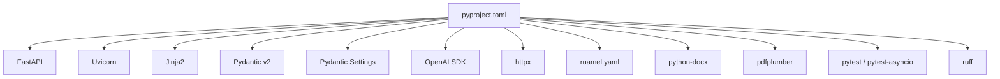

图表来源
- [pyproject.toml:13-25](file://pyproject.toml#L13-L25)
- [pyproject.toml:27-32](file://pyproject.toml#L27-L32)
- [pyproject.toml:34-35](file://pyproject.toml#L34-L35)

章节来源
- [pyproject.toml:1-47](file://pyproject.toml#L1-L47)

## 性能考虑
- 异步与并发：FastAPI 异步路由与后台任务，避免阻塞；LLM 调用采用异步客户端
- 分片与限流：章节长度截断与 Token 预算控制，防止超限；指数退避重试降低瞬时失败影响
- 内存与 IO：上传/输出目录在内存中维护作业状态，同时持久化到磁盘，平衡速度与可靠性
- 前端体验：轮询间隔与 SSE 备选方案兼顾兼容性与实时性

## 故障排查指南
- 上传失败
  - 文件过大：检查最大上传大小配置与前端提示
  - 文件类型不支持：确认文件扩展名与解析器支持范围
- 转换失败
  - LLM 调用异常：检查 API Key、网络连通性与超时设置
  - 角色提取/章节转换失败：查看日志与回退机制是否生效
- 验证失败
  - 角色引用缺失：核对角色目录与场景元素中的角色 ID
  - 编号不连续：检查 Acts/Scenes 是否被手动修改
- 前端无法显示进度
  - 确认后端状态接口可用与跨域配置
  - 若 SSE 不可用，切换到轮询接口

章节来源
- [app/api/routes.py:73-95](file://app/api/routes.py#L73-L95)
- [app/services/llm_client.py:70-86](file://app/services/llm_client.py#L70-L86)
- [app/services/validator.py:84-99](file://app/services/validator.py#L84-L99)
- [app/static/js/conversion.js:34-71](file://app/static/js/conversion.js#L34-L71)

## 结论
该系统以 FastAPI 为核心，结合 Pydantic 数据模型与 DeepSeek LLM，实现了从多格式小说到结构化 YAML 剧本的自动化转换。通过分层架构与异步处理，系统具备良好的可扩展性与用户体验。建议后续可在以下方面持续优化：引入缓存与队列、增强错误恢复与可观测性、支持批量转换与并发作业管理。

## 附录
- 技术选型说明
  - FastAPI：高性能异步 Web 框架，自动生成 OpenAPI 文档，适合本项目的 API 需求
  - Pydantic v2：强类型数据模型与自动校验，确保数据一致性
  - DeepSeek API：OpenAI 兼容接口，支持结构化 JSON 输出与温度控制
  - ruamel.yaml：高质量 YAML 导出，保留顺序与注释
  - Jinja2 + 原生 JS：轻量级前端模板与交互，易于部署与维护

章节来源
- [README.md:15-26](file://README.md#L15-L26)
- [app/config.py:18-32](file://app/config.py#L18-L32)