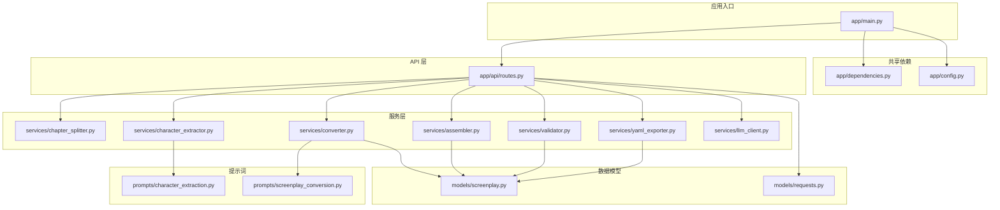
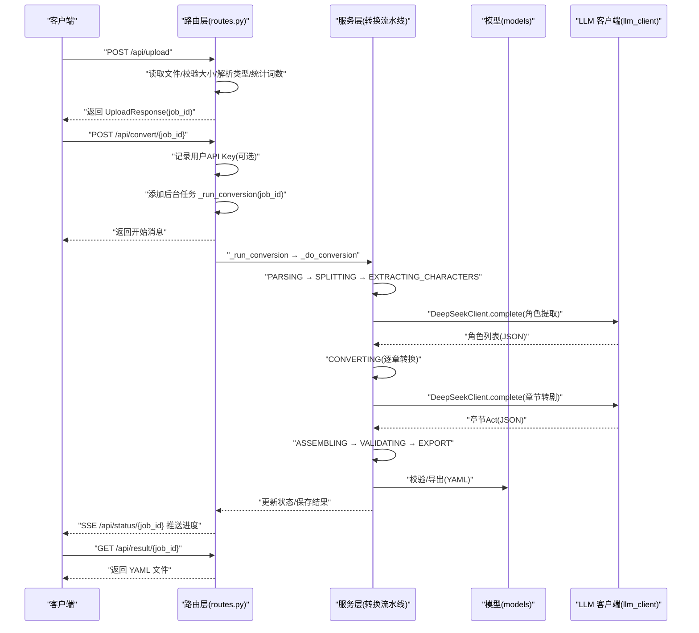
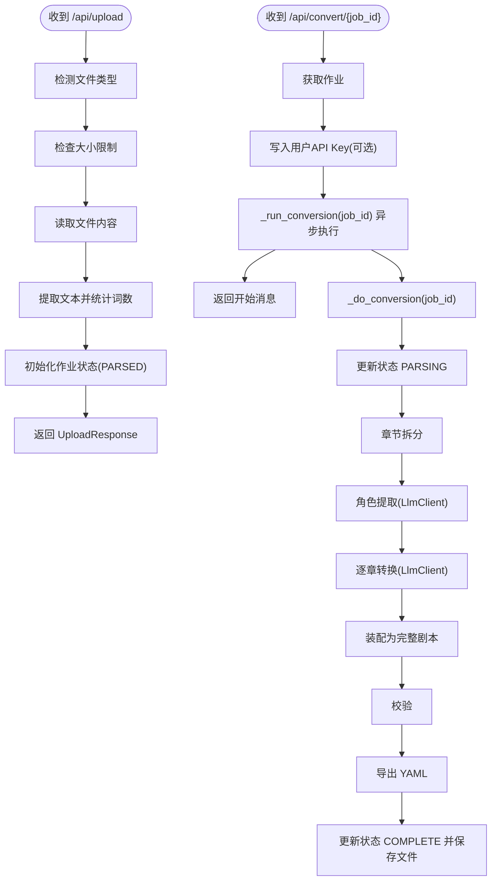
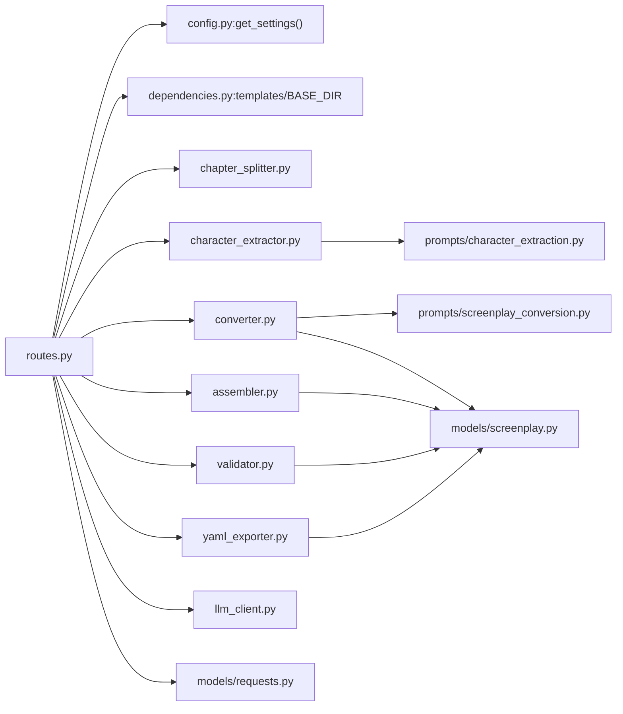

# 组件交互关系

<cite>
**本文引用的文件**
- [app/main.py](file://app/main.py)
- [app/api/routes.py](file://app/api/routes.py)
- [app/dependencies.py](file://app/dependencies.py)
- [app/config.py](file://app/config.py)
- [app/services/assembler.py](file://app/services/assembler.py)
- [app/services/chapter_splitter.py](file://app/services/chapter_splitter.py)
- [app/services/character_extractor.py](file://app/services/character_extractor.py)
- [app/services/converter.py](file://app/services/converter.py)
- [app/services/validator.py](file://app/services/validator.py)
- [app/services/yaml_exporter.py](file://app/services/yaml_exporter.py)
- [app/services/llm_client.py](file://app/services/llm_client.py)
- [app/prompts/character_extraction.py](file://app/prompts/character_extraction.py)
- [app/prompts/screenplay_conversion.py](file://app/prompts/screenplay_conversion.py)
- [app/models/screenplay.py](file://app/models/screenplay.py)
- [app/models/requests.py](file://app/models/requests.py)
</cite>

## 目录
1. [简介](#简介)
2. [项目结构](#项目结构)
3. [核心组件](#核心组件)
4. [架构总览](#架构总览)
5. [详细组件分析](#详细组件分析)
6. [依赖分析](#依赖分析)
7. [性能考虑](#性能考虑)
8. [故障排查指南](#故障排查指南)
9. [结论](#结论)
10. [附录](#附录)

## 简介
本文件聚焦于系统中各组件之间的交互模式与依赖关系，涵盖：
- API 路由层如何编排服务模块与数据模型
- 服务模块内部的调用链路与职责边界
- 数据模型在转换过程中的流转与约束
- 依赖注入与共享依赖（如模板引擎、配置）的管理方式
- 中间件在请求处理链中的作用
- 典型请求的端到端处理序列图
- 组件解耦的设计原则与实现方式

## 项目结构
系统采用分层与按功能域划分的组织方式：
- 应用入口与生命周期：app/main.py
- API 路由与中间件：app/api/routes.py
- 共享依赖与静态资源挂载：app/dependencies.py、app/main.py
- 配置中心：app/config.py
- 业务服务：章节拆分、角色提取、转换、装配、校验、导出、LLM 客户端
- 提示词模板：app/prompts/*
- 数据模型：app/models/*

图表来源
- [app/main.py:1-46](file://app/main.py#L1-L46)
- [app/api/routes.py:1-313](file://app/api/routes.py#L1-L313)
- [app/dependencies.py:1-9](file://app/dependencies.py#L1-L9)
- [app/config.py:1-45](file://app/config.py#L1-L45)
- [app/services/chapter_splitter.py:1-163](file://app/services/chapter_splitter.py#L1-L163)
- [app/services/character_extractor.py:1-154](file://app/services/character_extractor.py#L1-L154)
- [app/services/converter.py:1-218](file://app/services/converter.py#L1-L218)
- [app/services/assembler.py:1-101](file://app/services/assembler.py#L1-L101)
- [app/services/validator.py:1-111](file://app/services/validator.py#L1-L111)
- [app/services/yaml_exporter.py:1-57](file://app/services/yaml_exporter.py#L1-L57)
- [app/services/llm_client.py:1-103](file://app/services/llm_client.py#L1-L103)
- [app/prompts/character_extraction.py:1-47](file://app/prompts/character_extraction.py#L1-L47)
- [app/prompts/screenplay_conversion.py:1-91](file://app/prompts/screenplay_conversion.py#L1-L91)
- [app/models/screenplay.py:1-167](file://app/models/screenplay.py#L1-L167)
- [app/models/requests.py:1-41](file://app/models/requests.py#L1-L41)

章节来源
- [app/main.py:1-46](file://app/main.py#L1-L46)
- [app/api/routes.py:1-313](file://app/api/routes.py#L1-L313)

## 核心组件
- 应用入口与生命周期
  - FastAPI 应用实例化、CORS 中间件注册、静态资源挂载、路由注册、启动时目录准备
- API 路由与后台任务
  - 页面路由与 SSE 状态流、上传/转换/下载/校验等端点、后台转换流水线
- 服务模块
  - 章节拆分、角色提取、逐章转换、装配为完整剧本、校验、YAML 导出、LLM 客户端
- 数据模型
  - 剧本元数据、角色、场景元素、场景、幕、结构、根模型；请求/状态/校验结果模型
- 提示词模板
  - 角色提取与剧本转换的系统/用户提示词
- 共享依赖
  - 模板引擎、基础路径、静态资源挂载

章节来源
- [app/main.py:14-46](file://app/main.py#L14-L46)
- [app/api/routes.py:52-313](file://app/api/routes.py#L52-L313)
- [app/dependencies.py:1-9](file://app/dependencies.py#L1-L9)
- [app/models/screenplay.py:15-167](file://app/models/screenplay.py#L15-L167)
- [app/models/requests.py:6-41](file://app/models/requests.py#L6-L41)
- [app/prompts/character_extraction.py:1-47](file://app/prompts/character_extraction.py#L1-L47)
- [app/prompts/screenplay_conversion.py:1-91](file://app/prompts/screenplay_conversion.py#L1-L91)

## 架构总览
系统采用“路由编排 + 服务流水线”的架构：
- 路由层负责请求接入、参数解析、状态存储、SSE 流式状态推送、后台任务调度
- 服务层以函数式模块为主，围绕“章节拆分 → 角色提取 → 剧本转换 → 装配 → 校验 → 导出”形成清晰的转换流水线
- 数据模型作为契约贯穿全链路，确保输入输出一致性与可验证性
- LLM 客户端提供统一的异步调用能力，并支持结构化解析

图表来源
- [app/api/routes.py:114-313](file://app/api/routes.py#L114-L313)
- [app/services/llm_client.py:33-103](file://app/services/llm_client.py#L33-L103)
- [app/services/converter.py:36-84](file://app/services/converter.py#L36-L84)
- [app/services/character_extractor.py:21-75](file://app/services/character_extractor.py#L21-L75)
- [app/services/assembler.py:18-50](file://app/services/assembler.py#L18-L50)
- [app/services/validator.py:11-111](file://app/services/validator.py#L11-L111)
- [app/services/yaml_exporter.py:14-57](file://app/services/yaml_exporter.py#L14-L57)

## 详细组件分析

### 路由层（APIRouter）
- 责任边界
  - 页面渲染：首页、预览页
  - 文件上传：类型检测、大小限制、内容读取、词数统计、作业状态初始化
  - 转换控制：启动后台任务、SSE 状态流、JSON 回退、结果下载、文本预览、校验查询
  - 后台流水线：按阶段推进、错误捕获、状态持久化
- 关键交互
  - 使用内存字典维护作业状态，避免引入外部缓存或数据库
  - SSE 通过生成器持续推送状态，非 SSE 客户端提供 JSON 接口
  - 将用户提供的 API Key 写入作业上下文，供 LLM 客户端使用

图表来源
- [app/api/routes.py:68-128](file://app/api/routes.py#L68-L128)
- [app/api/routes.py:131-198](file://app/api/routes.py#L131-L198)
- [app/api/routes.py:208-313](file://app/api/routes.py#L208-L313)

章节来源
- [app/api/routes.py:52-313](file://app/api/routes.py#L52-L313)

### 服务模块

#### 章节拆分（chapter_splitter）
- 功能：基于正则表达式识别章节标题，若失败则按段落与字数启发式切分
- 输出：Chapter 列表，包含序号、标题、内容与起始位置
- 复杂度：正则匹配 O(n)，启发式分布 O(n)

章节来源
- [app/services/chapter_splitter.py:42-163](file://app/services/chapter_splitter.py#L42-L163)

#### 角色提取（character_extractor）
- 功能：从抽样章节中抽取角色，合并去重，必要时生成占位角色
- 依赖：DeepSeekClient、提示词模板 character_extraction
- 输出：Character 列表

章节来源
- [app/services/character_extractor.py:21-154](file://app/services/character_extractor.py#L21-L154)
- [app/prompts/character_extraction.py:1-47](file://app/prompts/character_extraction.py#L1-L47)

#### 剧本转换（converter）
- 功能：将单章文本转换为 Act/Scene/元素，维护连续性上下文
- 依赖：DeepSeekClient、提示词模板 screenplay_conversion
- 输出：ConversionResult（含 Act 与连续性摘要）

章节来源
- [app/services/converter.py:36-218](file://app/services/converter.py#L36-L218)
- [app/prompts/screenplay_conversion.py:1-91](file://app/prompts/screenplay_conversion.py#L1-L91)

#### 装配（assembler）
- 功能：将多章节 Act 合并为完整结构，重编号、填充出场角色、设置首次出场
- 输出：完整的 Screenplay 对象

章节来源
- [app/services/assembler.py:18-101](file://app/services/assembler.py#L18-L101)

#### 校验（validator）
- 功能：对完整剧本进行结构完整性与引用有效性校验
- 输出：ValidationIssue 列表

章节来源
- [app/services/validator.py:11-111](file://app/services/validator.py#L11-L111)

#### YAML 导出（yaml_exporter）
- 功能：将 Screenplay 序列化为格式化的 YAML 字符串
- 输出：YAML 文本

章节来源
- [app/services/yaml_exporter.py:14-57](file://app/services/yaml_exporter.py#L14-L57)

#### LLM 客户端（llm_client）
- 功能：封装 DeepSeek API 的异步调用，支持结构化 JSON 解析与重试
- 输出：原始文本或按 Pydantic 模型解析的结果

章节来源
- [app/services/llm_client.py:18-103](file://app/services/llm_client.py#L18-L103)

### 数据模型

#### 剧本模型（models/screenplay）
- 元数据、角色、场景元素（动作/对白/括号/转场/注释）、场景、幕、结构、根模型
- 作为 YAML 结构的单一事实来源，用于序列化、反序列化与 JSON Schema 生成

章节来源
- [app/models/screenplay.py:15-167](file://app/models/screenplay.py#L15-L167)

#### 请求/响应/状态模型（models/requests）
- UploadResponse、ConversionStatus、ValidationIssue、ConversionResult、ConvertRequest
- 用于 API 输入输出与状态传输

章节来源
- [app/models/requests.py:6-41](file://app/models/requests.py#L6-L41)

### 提示词模板
- 角色提取：定义系统提示与用户模板，约束输出结构
- 剧本转换：定义系统提示与用户模板，约束输出结构与风格

章节来源
- [app/prompts/character_extraction.py:1-47](file://app/prompts/character_extraction.py#L1-L47)
- [app/prompts/screenplay_conversion.py:1-91](file://app/prompts/screenplay_conversion.py#L1-L91)

## 依赖分析
- 组件内聚与耦合
  - 服务模块以函数式为主，彼此通过明确的输入/输出类型耦合，降低类层次复杂度
  - 路由层仅负责编排与状态管理，不直接持有业务逻辑，保持高内聚低耦合
- 外部依赖
  - LLM 客户端封装 OpenAI SDK，统一异常与重试策略
  - 模板引擎与静态资源通过共享依赖注入，避免循环导入
- 配置中心
  - 使用 pydantic-settings 与缓存装饰器集中管理配置，提供统一访问入口

图表来源
- [app/api/routes.py:10-24](file://app/api/routes.py#L10-L24)
- [app/dependencies.py:1-9](file://app/dependencies.py#L1-L9)
- [app/config.py:42-45](file://app/config.py#L42-L45)
- [app/services/llm_client.py:21-32](file://app/services/llm_client.py#L21-L32)

章节来源
- [app/api/routes.py:10-24](file://app/api/routes.py#L10-L24)
- [app/dependencies.py:1-9](file://app/dependencies.py#L1-L9)
- [app/config.py:9-45](file://app/config.py#L9-L45)

## 性能考虑
- I/O 与并发
  - 使用异步 FastAPI 与异步 LLM 客户端，提升并发吞吐
  - SSE 流式状态推送避免轮询开销
- 计算与内存
  - 章节拆分与角色提取采用抽样策略，减少 LLM 调用次数
  - 转换前对长文本截断，控制 token 预算
- 缓存与持久化
  - 作业状态驻留内存，避免额外缓存依赖；结果持久化至磁盘
- 可观测性
  - 在关键节点记录日志，便于定位瓶颈与异常

## 故障排查指南
- 常见问题
  - 上传文件过大：检查配置项与前端限制
  - LLM 调用失败：确认 API Key、网络连通性与重试策略
  - 转换未完成：通过状态接口确认当前阶段与错误信息
  - 下载为空：确认转换已完成且已保存结果
- 定位方法
  - 查看路由层的日志与异常处理
  - 检查服务层的异常捕获与降级策略
  - 校验模型字段与引用一致性

章节来源
- [app/api/routes.py:80-95](file://app/api/routes.py#L80-L95)
- [app/api/routes.py:210-217](file://app/api/routes.py#L210-L217)
- [app/services/validator.py:11-111](file://app/services/validator.py#L11-L111)

## 结论
该系统通过清晰的分层与模块化设计，实现了从文件上传到 YAML 导出的完整转换链路。路由层承担编排职责，服务层以纯函数模块串联转换步骤，数据模型作为契约保障一致性，LLM 客户端提供稳定的结构化输出能力。整体设计强调解耦、可观测与可扩展，适合在后续迭代中引入更复杂的校验规则、缓存策略或并行化处理。

## 附录
- 组件解耦原则
  - 单一职责：每个服务模块专注一个转换环节
  - 明确输入输出：通过 Pydantic 模型约束契约
  - 依赖倒置：路由层依赖抽象（函数/模型），不依赖具体实现细节
  - 可替换性：LLM 客户端可替换为其他兼容实现
- 实现要点
  - 使用共享依赖避免循环导入
  - 通过配置中心集中管理外部参数
  - 在关键路径增加日志与异常处理，提升可维护性