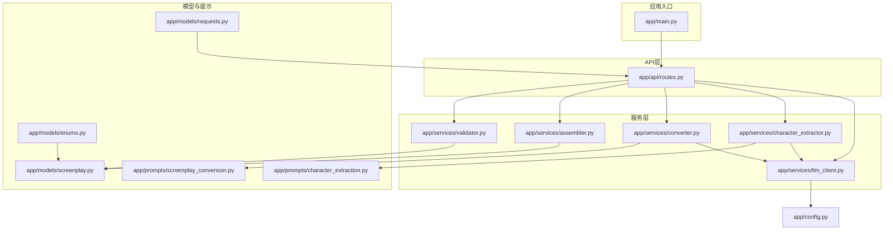
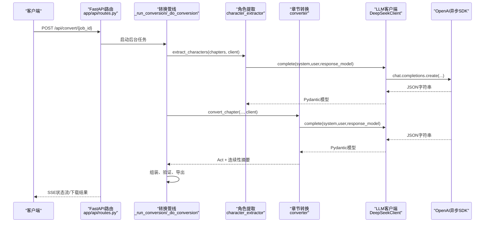
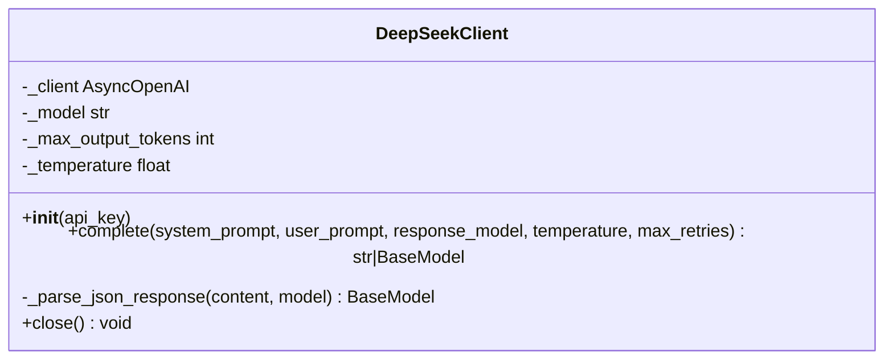
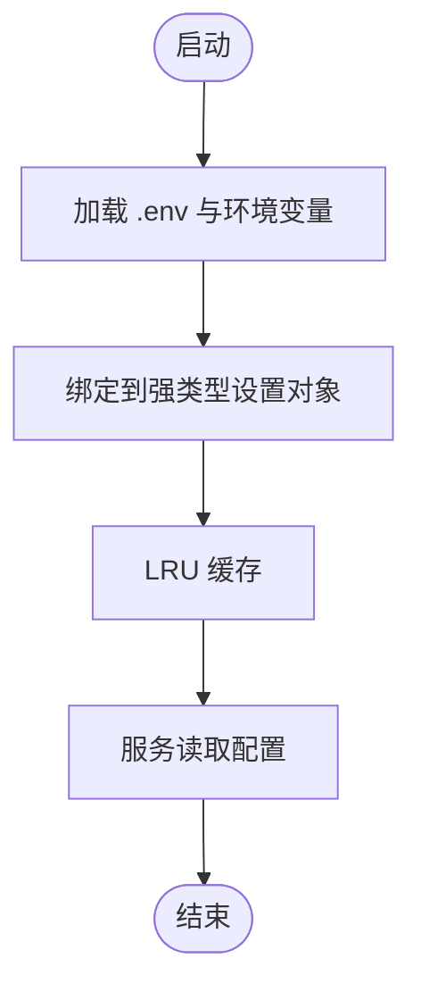
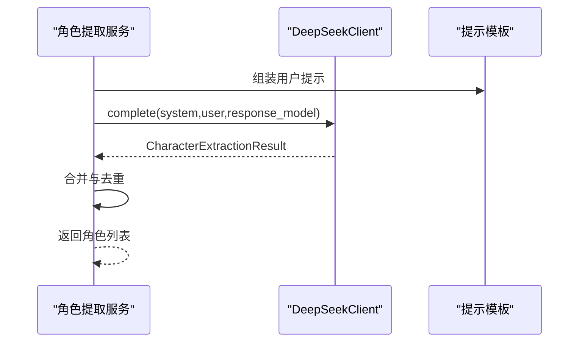
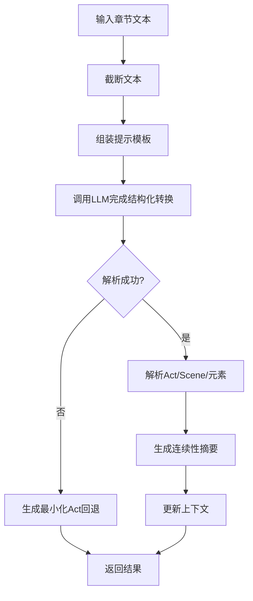
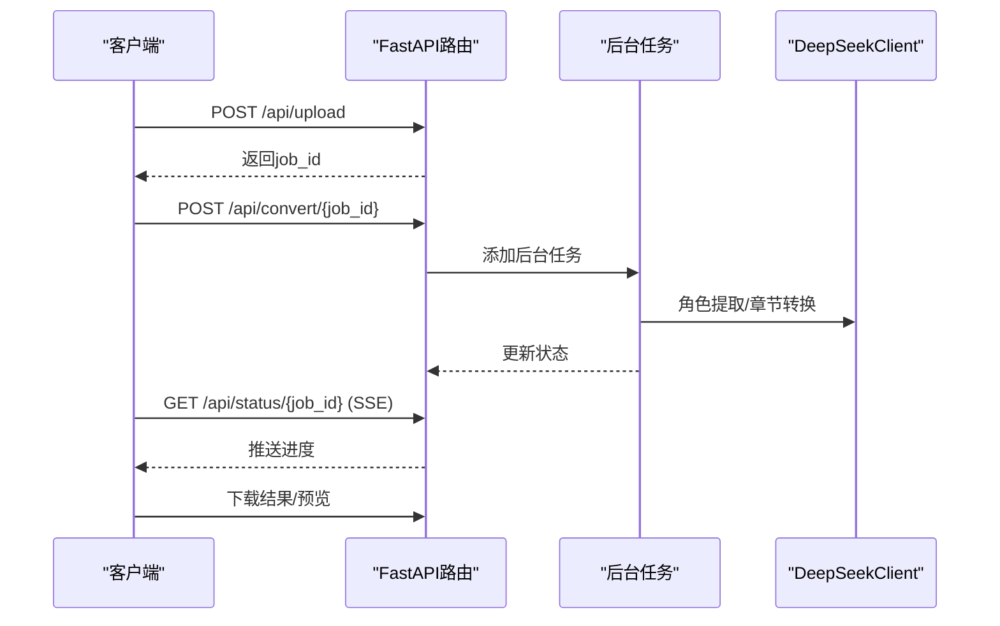
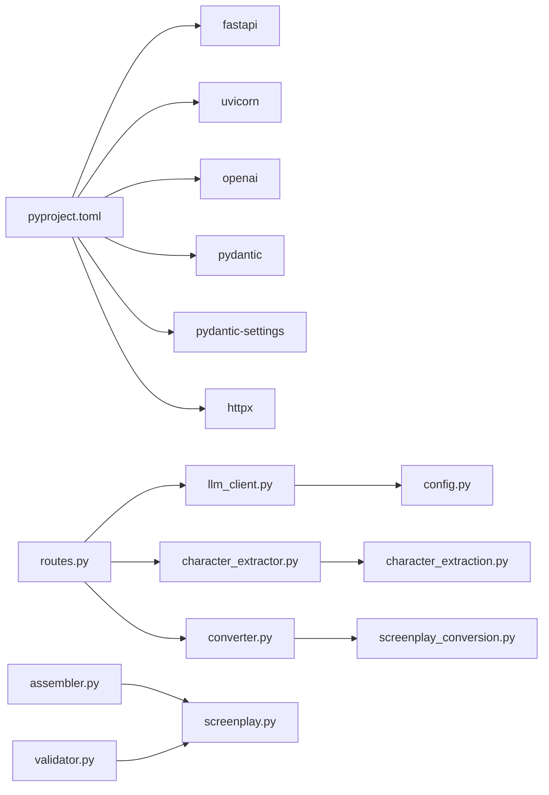

# LLM客户端服务

<cite>
**本文档引用的文件**
- [app/services/llm_client.py](file://app/services/llm_client.py)
- [app/config.py](file://app/config.py)
- [app/api/routes.py](file://app/api/routes.py)
- [app/models/screenplay.py](file://app/models/screenplay.py)
- [app/services/character_extractor.py](file://app/services/character_extractor.py)
- [app/services/converter.py](file://app/services/converter.py)
- [app/prompts/character_extraction.py](file://app/prompts/character_extraction.py)
- [app/prompts/screenplay_conversion.py](file://app/prompts/screenplay_conversion.py)
- [app/models/requests.py](file://app/models/requests.py)
- [app/models/enums.py](file://app/models/enums.py)
- [app/services/assembler.py](file://app/services/assembler.py)
- [app/services/validator.py](file://app/services/validator.py)
- [app/main.py](file://app/main.py)
- [pyproject.toml](file://pyproject.toml)
</cite>

## 目录
1. [简介](#简介)
2. [项目结构](#项目结构)
3. [核心组件](#核心组件)
4. [架构总览](#架构总览)
5. [详细组件分析](#详细组件分析)
6. [依赖分析](#依赖分析)
7. [性能考虑](#性能考虑)
8. [故障排除指南](#故障排除指南)
9. [结论](#结论)
10. [附录](#附录)

## 简介
本项目是一个基于FastAPI的“小说到剧本”转换工具，其核心能力之一是通过异步客户端调用DeepSeek（OpenAI兼容）API，完成角色提取与章节到剧本格式的转换。本文档聚焦于LLM客户端服务，特别是DeepSeek API的异步客户端实现，系统性阐述以下主题：
- 异步HTTP客户端设计模式：连接池与并发请求处理
- API密钥安全与环境变量配置
- 请求重试策略、超时处理与错误恢复
- JSON模式约束与Pydantic模型解析
- 异步调用最佳实践与性能优化
- 错误码处理、速率限制应对与监控指标
- 与提示工程模块的集成与数据流

## 项目结构
该项目采用按功能分层的组织方式，核心围绕“服务层（services）+ 模型（models）+ 提示（prompts）+ API路由（api）”展开。LLM客户端位于服务层，为角色提取与章节转换提供统一的异步调用接口。

图表来源
- [app/main.py:1-46](file://app/main.py#L1-L46)
- [app/api/routes.py:1-313](file://app/api/routes.py#L1-L313)
- [app/services/llm_client.py:1-103](file://app/services/llm_client.py#L1-L103)
- [app/services/character_extractor.py:1-154](file://app/services/character_extractor.py#L1-L154)
- [app/services/converter.py:1-218](file://app/services/converter.py#L1-L218)
- [app/services/assembler.py:1-101](file://app/services/assembler.py#L1-L101)
- [app/services/validator.py:1-111](file://app/services/validator.py#L1-L111)
- [app/models/screenplay.py:1-167](file://app/models/screenplay.py#L1-L167)
- [app/models/requests.py:1-41](file://app/models/requests.py#L1-L41)
- [app/models/enums.py:1-83](file://app/models/enums.py#L1-L83)
- [app/prompts/character_extraction.py:1-47](file://app/prompts/character_extraction.py#L1-L47)
- [app/prompts/screenplay_conversion.py:1-91](file://app/prompts/screenplay_conversion.py#L1-L91)
- [app/config.py:1-45](file://app/config.py#L1-L45)

章节来源
- [app/main.py:1-46](file://app/main.py#L1-L46)
- [app/api/routes.py:1-313](file://app/api/routes.py#L1-L313)
- [app/config.py:1-45](file://app/config.py#L1-L45)

## 核心组件
- 异步LLM客户端（DeepSeekClient）
  - 基于OpenAI异步SDK封装，支持系统消息、用户消息、温度、最大输出等参数
  - 支持结构化输出（JSON模式），通过response_format强制模型返回JSON对象
  - 内置指数退避重试与异常记录
  - 提供关闭底层HTTP客户端的能力
- 配置中心（Settings）
  - 从.env文件与环境变量加载，集中管理DeepSeek API密钥、基础URL、模型名、温度、超时、令牌上限等
- 角色提取服务（character_extractor）
  - 采样多章节文本，调用LLM提取角色清单，并进行去重与合并
- 章节转换服务（converter）
  - 将单章小说转换为剧本场景，维护连续性上下文
- 组装与验证服务（assembler、validator）
  - 将各章结果组装为完整剧本，并进行结构与引用校验

章节来源
- [app/services/llm_client.py:18-103](file://app/services/llm_client.py#L18-L103)
- [app/config.py:9-44](file://app/config.py#L9-L44)
- [app/services/character_extractor.py:21-76](file://app/services/character_extractor.py#L21-L76)
- [app/services/converter.py:36-85](file://app/services/converter.py#L36-L85)
- [app/services/assembler.py:18-51](file://app/services/assembler.py#L18-L51)
- [app/services/validator.py:11-111](file://app/services/validator.py#L11-L111)

## 架构总览
下图展示了从API路由到LLM客户端，再到提示工程与模型解析的整体流程。

图表来源
- [app/api/routes.py:210-313](file://app/api/routes.py#L210-L313)
- [app/services/character_extractor.py:21-76](file://app/services/character_extractor.py#L21-L76)
- [app/services/converter.py:36-85](file://app/services/converter.py#L36-L85)
- [app/services/llm_client.py:33-87](file://app/services/llm_client.py#L33-L87)

## 详细组件分析

### 异步LLM客户端（DeepSeekClient）
- 设计要点
  - 使用AsyncOpenAI作为底层HTTP客户端，自动复用连接池与并发请求
  - 通过response_format强制模型返回JSON对象，结合Pydantic模型进行结构化解析
  - 指数退避重试（最多N次），每次等待2^attempt秒，避免瞬时错误放大
  - 超时由配置中心统一注入，确保长请求不会阻塞
  - 关闭方法用于释放底层连接资源
- 数据流与复杂度
  - 输入：系统提示、用户提示、可选的响应模型类型
  - 输出：原始文本或Pydantic模型实例
  - 复杂度近似O(1)请求开销，受网络与模型响应时间主导
- 安全与配置
  - API密钥优先使用调用方传入值，否则回退至配置中心；最终传递给AsyncOpenAI
  - 基础URL、模型名、温度、最大输出、超时均来自配置中心
- 错误处理
  - 捕获异常并记录警告日志，最后一次失败抛出运行时错误
  - JSON解析前清理Markdown代码块围栏，增强鲁棒性

图表来源
- [app/services/llm_client.py:18-103](file://app/services/llm_client.py#L18-L103)

章节来源
- [app/services/llm_client.py:18-103](file://app/services/llm_client.py#L18-L103)
- [app/config.py:18-31](file://app/config.py#L18-L31)

### 配置中心（Settings）
- 功能
  - 从.env文件与环境变量加载键值，提供强类型访问
  - 集中管理DeepSeek相关参数（API密钥、基础URL、模型名）、应用参数（上传大小、目录）、LLM参数（最大分块长度、最大输出、温度、超时）
- 作用
  - 为LLM客户端与业务服务提供统一配置源
  - 通过缓存函数减少重复读取成本

图表来源
- [app/config.py:9-44](file://app/config.py#L9-L44)

章节来源
- [app/config.py:9-44](file://app/config.py#L9-L44)

### 角色提取服务（character_extractor）
- 流程
  - 选择样本章节（首三章及中间/末尾章节），截断过长文本
  - 组装提示模板，调用LLM客户端完成结构化输出
  - 合并多次抽取结果，去重并生成Character模型列表
- 与LLM客户端集成
  - 通过response_model参数强制返回JSON，随后由客户端解析为Pydantic模型
- 容错
  - 单章节失败不中断整体流程，记录警告并继续

图表来源
- [app/services/character_extractor.py:21-76](file://app/services/character_extractor.py#L21-L76)
- [app/prompts/character_extraction.py:1-47](file://app/prompts/character_extraction.py#L1-L47)
- [app/services/llm_client.py:33-87](file://app/services/llm_client.py#L33-L87)

章节来源
- [app/services/character_extractor.py:21-76](file://app/services/character_extractor.py#L21-L76)
- [app/prompts/character_extraction.py:1-47](file://app/prompts/character_extraction.py#L1-L47)

### 章节转换服务（converter）
- 流程
  - 截断超长章节以控制令牌预算
  - 组装角色目录与连续性上下文，调用LLM完成结构化转换
  - 解析Act/Scene/元素，生成连续性摘要并更新上下文
- 容错与回退
  - 转换失败时生成最小化Act作为回退
  - 连续性摘要生成失败时回退到最后场景描述
- 与LLM客户端集成
  - 使用response_model解析Act结构，温度较低以提升确定性

图表来源
- [app/services/converter.py:36-85](file://app/services/converter.py#L36-L85)
- [app/prompts/screenplay_conversion.py:1-91](file://app/prompts/screenplay_conversion.py#L1-L91)
- [app/services/llm_client.py:33-87](file://app/services/llm_client.py#L33-L87)

章节来源
- [app/services/converter.py:36-85](file://app/services/converter.py#L36-L85)
- [app/prompts/screenplay_conversion.py:1-91](file://app/prompts/screenplay_conversion.py#L1-L91)

### 组装与验证服务
- 组装（assembler）
  - 重编号 Acts/Scenes，填充characters_present，设置first_appearance
- 验证（validator）
  - 结构完整性检查：元数据必填、至少一Act、每Act至少一Scene、每Scene至少一元素
  - 引用一致性检查：对话/括号元素的character_id必须存在于角色目录
  - 记录警告与错误，便于前端展示

章节来源
- [app/services/assembler.py:18-101](file://app/services/assembler.py#L18-L101)
- [app/services/validator.py:11-111](file://app/services/validator.py#L11-L111)
- [app/models/screenplay.py:161-167](file://app/models/screenplay.py#L161-L167)

### API路由与作业流
- 作业存储
  - 在内存字典中保存作业状态、进度、结果与验证问题
- SSE状态流
  - 通过Server-Sent Events向客户端推送实时进度
- 背景转换管线
  - 串行执行解析、拆分、角色提取、章节转换、组装、验证、导出
  - 每个阶段更新进度百分比与当前/总章节数
  - 最终关闭LLM客户端以释放连接

图表来源
- [app/api/routes.py:68-129](file://app/api/routes.py#L68-L129)
- [app/api/routes.py:131-199](file://app/api/routes.py#L131-L199)
- [app/api/routes.py:210-313](file://app/api/routes.py#L210-L313)

章节来源
- [app/api/routes.py:68-199](file://app/api/routes.py#L68-L199)
- [app/api/routes.py:210-313](file://app/api/routes.py#L210-L313)

## 依赖分析
- 外部依赖
  - FastAPI、Uvicorn：Web框架与ASGI服务器
  - OpenAI：异步客户端SDK，提供连接池与并发能力
  - Pydantic/Pydantic-Settings：配置与模型定义
  - httpx：底层HTTP传输（OpenAI SDK内部使用）
- 内部耦合
  - API路由依赖服务层；服务层依赖配置中心与提示模板
  - LLM客户端被角色提取与章节转换服务共同依赖
  - 模型层为所有服务提供统一的数据契约

图表来源
- [pyproject.toml:13-25](file://pyproject.toml#L13-L25)
- [app/api/routes.py:15-24](file://app/api/routes.py#L15-L24)
- [app/services/llm_client.py:8-11](file://app/services/llm_client.py#L8-L11)
- [app/config.py:6-16](file://app/config.py#L6-L16)

章节来源
- [pyproject.toml:13-25](file://pyproject.toml#L13-L25)
- [app/api/routes.py:15-24](file://app/api/routes.py#L15-L24)

## 性能考虑
- 并发与连接池
  - 使用AsyncOpenAI默认连接池与并发请求，适合高QPS场景
  - 建议在生产环境中通过环境变量调整连接池大小与超时参数（如需扩展）
- 重试策略
  - 指数退避重试已内置，避免瞬时错误导致的级联失败
  - 可根据SLA调整max_retries与初始等待时间
- 超时与令牌预算
  - 超时由配置中心统一注入，避免单次请求长时间阻塞
  - 章节与角色提取前进行文本截断，控制令牌消耗
- I/O与CPU平衡
  - LLM调用为I/O瓶颈，建议在高并发场景下配合限流与背压策略
  - 对于长文本，优先采用分段处理与增量式验证

## 故障排除指南
- 常见错误与定位
  - API密钥无效：检查配置中心与请求体中的api_key是否正确
  - 超时错误：增大llm_timeout或减少输入文本长度
  - JSON解析失败：确认提示模板输出严格遵循JSON结构，客户端会自动清理代码围栏
  - 引用缺失：验证角色目录与场景元素的character_id一致性
- 日志与监控
  - 客户端与服务层广泛使用日志记录，便于追踪失败点
  - 建议在网关或代理层增加请求计数、错误率与P95/P99延迟指标
- 速率限制应对
  - 当遇到429/5xx时，利用内置重试；若持续失败，建议引入外部限流器与熔断策略
  - 对于批量转换，建议分批提交并加入队列与背压

章节来源
- [app/services/llm_client.py:70-86](file://app/services/llm_client.py#L70-L86)
- [app/services/validator.py:80-99](file://app/services/validator.py#L80-L99)
- [app/api/routes.py:210-217](file://app/api/routes.py#L210-L217)

## 结论
本项目的LLM客户端服务以AsyncOpenAI为基础，结合Pydantic模型与严格的提示工程，实现了从角色提取到章节转换的端到端异步流程。通过统一配置中心、指数退避重试与结构化输出，系统在可用性与数据质量之间取得了良好平衡。建议在生产环境中进一步完善监控、限流与弹性伸缩策略，以应对高峰流量与复杂场景。

## 附录

### JSON模式约束与数据结构
- 角色提取
  - 系统提示要求返回包含角色数组的JSON对象，客户端解析为CharacterExtractionResult
- 章节转换
  - 系统提示要求返回包含Act结构的JSON对象，客户端解析为ChapterActResult，再映射为Act/Scene/元素
- 剧本根模型
  - Screenplay作为根模型，包含Metadata、Characters、Structure与Notes，用于序列化与导出

章节来源
- [app/prompts/character_extraction.py:14-36](file://app/prompts/character_extraction.py#L14-L36)
- [app/prompts/screenplay_conversion.py:23-74](file://app/prompts/screenplay_conversion.py#L23-L74)
- [app/models/screenplay.py:161-167](file://app/models/screenplay.py#L161-L167)

### API密钥与环境变量配置
- 配置项
  - deepseek_api_key：DeepSeek API密钥
  - deepseek_base_url：API基础URL
  - deepseek_model：模型名称
  - llm_temperature、max_output_tokens、llm_timeout：LLM参数
- 加载方式
  - 从.env文件与环境变量加载，支持运行时覆盖

章节来源
- [app/config.py:18-31](file://app/config.py#L18-L31)

### 与提示工程模块的集成
- 角色提取提示
  - 系统提示定义角色提取规则与输出结构
  - 用户提示模板包含章节标题与文本片段
- 章节转换提示
  - 系统提示定义剧本转换原则、场景标题规则与元素类型
  - 用户提示模板包含角色目录、先前上下文与章节内容

章节来源
- [app/prompts/character_extraction.py:3-36](file://app/prompts/character_extraction.py#L3-L36)
- [app/prompts/screenplay_conversion.py:3-74](file://app/prompts/screenplay_conversion.py#L3-L74)