# YAML导出服务

<cite>
**本文档引用的文件**
- [yaml_exporter.py](file://app/services/yaml_exporter.py)
- [YAML_SCHEMA.md](file://docs/YAML_SCHEMA.md)
- [screenplay.py](file://app/models/screenplay.py)
- [enums.py](file://app/models/enums.py)
- [routes.py](file://app/api/routes.py)
- [test_yaml_exporter.py](file://tests/test_yaml_exporter.py)
- [conftest.py](file://tests/conftest.py)
- [pyproject.toml](file://pyproject.toml)
</cite>

## 目录
1. [简介](#简介)
2. [项目结构](#项目结构)
3. [核心组件](#核心组件)
4. [架构概览](#架构概览)
5. [详细组件分析](#详细组件分析)
6. [依赖关系分析](#依赖关系分析)
7. [性能考虑](#性能考虑)
8. [故障排除指南](#故障排除指南)
9. [结论](#结论)
10. [附录](#附录)

## 简介

YAML导出服务是novel-to-screenplay工具的核心组件，负责将结构化的剧本数据转换为符合Fountain标准和Final Draft格式要求的YAML格式输出。该服务基于ruamel.yaml库实现，确保输出的YAML文件具有良好的可读性和行业标准兼容性。

本服务的主要目标包括：
- 使用ruamel.yaml库进行高质量的YAML序列化
- 保持数据结构的完整性和顺序
- 支持Unicode字符和国际化内容
- 遵循Fountain和Final Draft的行业标准
- 提供格式美化和可读性优化
- 实现错误处理和回滚机制

## 项目结构

YAML导出服务在项目中的位置和组织方式如下：

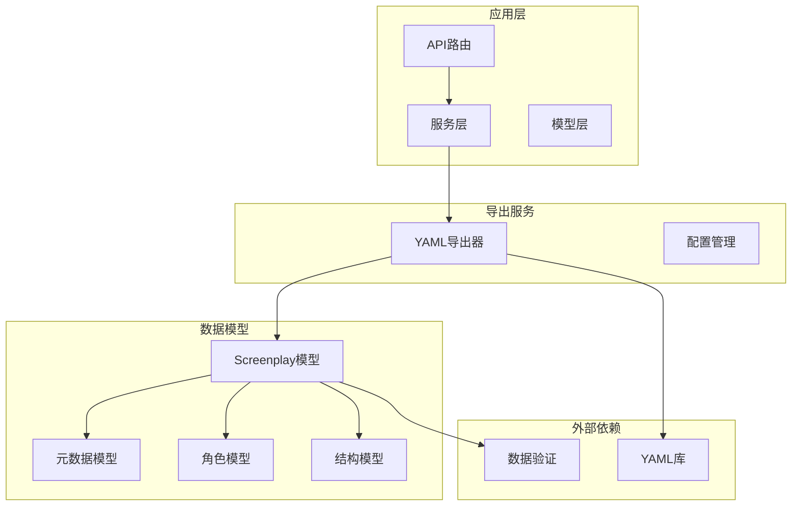

**图表来源**
- [yaml_exporter.py:1-57](file://app/services/yaml_exporter.py#L1-L57)
- [routes.py:200-313](file://app/api/routes.py#L200-L313)
- [screenplay.py:161-167](file://app/models/screenplay.py#L161-L167)

**章节来源**
- [yaml_exporter.py:1-57](file://app/services/yaml_exporter.py#L1-L57)
- [routes.py:15-25](file://app/api/routes.py#L15-L25)

## 核心组件

### YAML导出器主类

YAML导出器是整个系统的核心组件，负责将Screenplay模型转换为格式化的YAML字符串。其主要功能包括：

- **数据转换**：将Pydantic模型转换为字典格式
- **格式配置**：使用ruamel.yaml进行精确的格式控制
- **头部注释**：添加标准化的YAML头部信息
- **日志记录**：提供详细的导出统计信息

### 数据模型集成

系统集成了完整的屏幕剧数据模型，包括：
- **Metadata**：元数据信息（标题、作者、格式等）
- **Character**：角色信息（ID、姓名、关系等）
- **Scene**：场景信息（场景头、元素列表等）
- **Act**：结构信息（幕次、场景集合等）

### 枚举类型支持

系统支持多种枚举类型以确保数据完整性：
- **RoleType**：角色类型分类
- **TimeOfDay**：时间分类
- **IntExt**：室内/室外分类
- **TransitionType**：转场类型

**章节来源**
- [yaml_exporter.py:14-56](file://app/services/yaml_exporter.py#L14-L56)
- [screenplay.py:17-167](file://app/models/screenplay.py#L17-L167)
- [enums.py:6-83](file://app/models/enums.py#L6-L83)

## 架构概览

YAML导出服务在整个转换管道中的位置和交互关系：

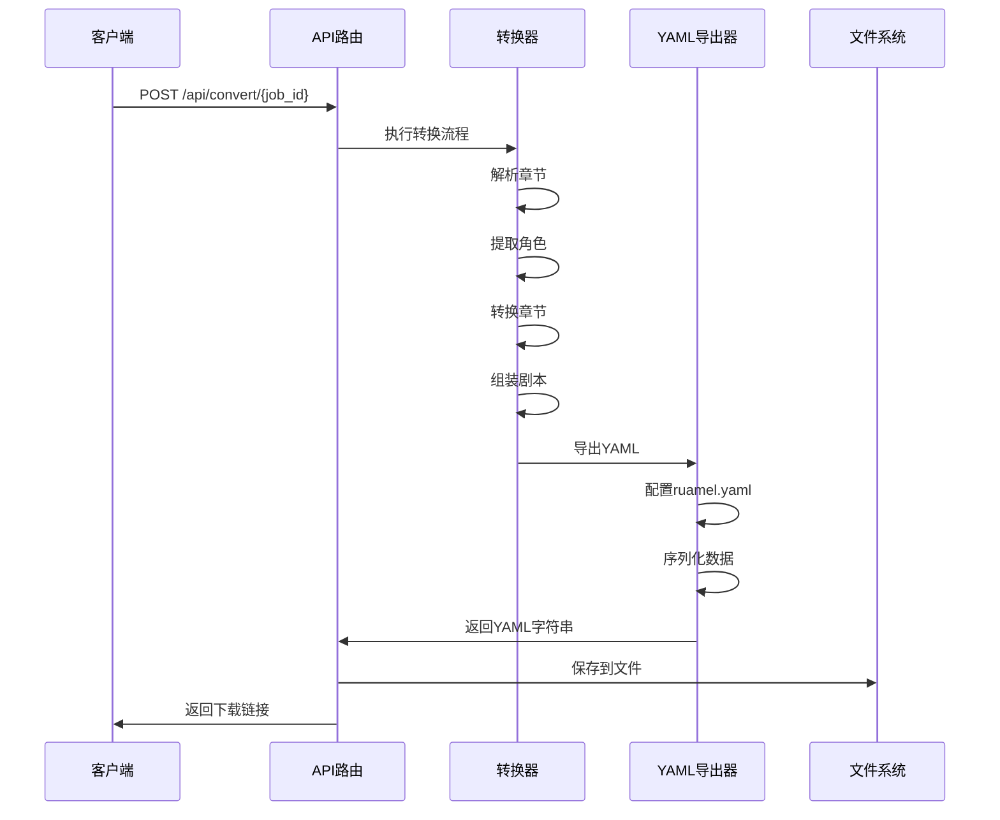

**图表来源**
- [routes.py:210-313](file://app/api/routes.py#L210-L313)
- [yaml_exporter.py:14-56](file://app/services/yaml_exporter.py#L14-L56)

### 数据流图

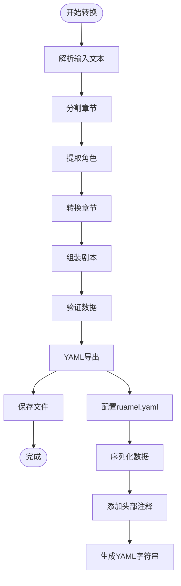

**图表来源**
- [routes.py:219-313](file://app/api/routes.py#L219-L313)
- [yaml_exporter.py:29-56](file://app/services/yaml_exporter.py#L29-L56)

## 详细组件分析

### ruamel.yaml配置详解

YAML导出器使用ruamel.yaml库进行高质量的序列化，配置参数如下：

#### 基础配置
- **default_flow_style = False**：禁用流式风格，使用块样式输出
- **width = 120**：设置行长宽度为120字符
- **allow_unicode = True**：启用Unicode字符支持
- **indent(mapping=2, sequence=4, offset=2)**：设置缩进层次

#### 缩进控制机制

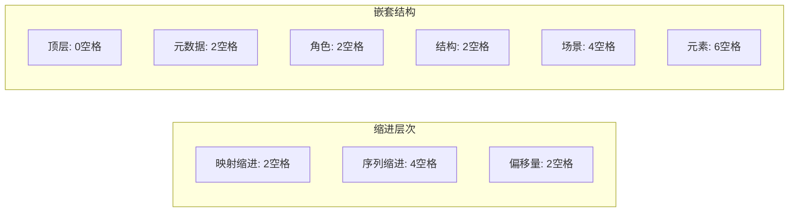

**图表来源**
- [yaml_exporter.py:36-40](file://app/services/yaml_exporter.py#L36-L40)

#### 换行处理策略

系统采用智能换行策略：
- **行长限制**：超过120字符自动换行
- **结构化换行**：在数组和对象边界处换行
- **内容换行**：长文本按语义换行

#### 注释保留机制

YAML导出器支持注释的保留和添加：
- **头部注释**：包含版本信息和生成时间
- **结构注释**：在重要节点添加说明性注释
- **内容注释**：为复杂字段添加上下文说明

### YAML Schema序列化过程

#### 元数据序列化

元数据序列化遵循以下规则：
- **必填字段**：title、author、genre等强制要求
- **可选字段**：使用exclude_none排除None值
- **默认值**：未指定时使用预设默认值
- **时间戳**：自动添加创建和修改时间

#### 角色信息序列化

角色序列化确保：
- **唯一标识**：每个角色ID必须唯一
- **关系完整性**：角色关系引用有效
- **属性完整性**：必要属性完整，可选属性可省略

#### 结构层次序列化

结构层次序列化：
- **幕次顺序**：按数字顺序排列
- **场景编号**：全局连续编号
- **元素顺序**：保持原始顺序
- **转场信息**：正确序列化转场类型

### 特殊字符处理

#### Unicode字符支持

系统完全支持Unicode字符：
- **中文字符**：正确编码和显示
- **表情符号**：UTF-8编码支持
- **特殊符号**：标点符号和数学符号
- **多语言文本**：支持混合语言内容

#### 字符转义策略

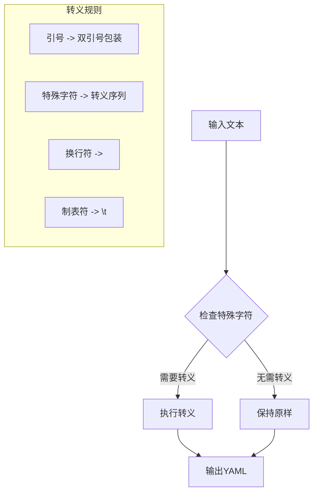

**图表来源**
- [yaml_exporter.py:39](file://app/services/yaml_exporter.py#L39)

### 格式美化和可读性优化

#### 输出格式优化

系统采用多种策略提升输出质量：
- **一致性缩进**：统一的缩进层次
- **对齐布局**：关键字段对齐显示
- **分组结构**：逻辑分组的视觉分离
- **颜色编码**：在预览界面中提供语法高亮

#### 可读性增强

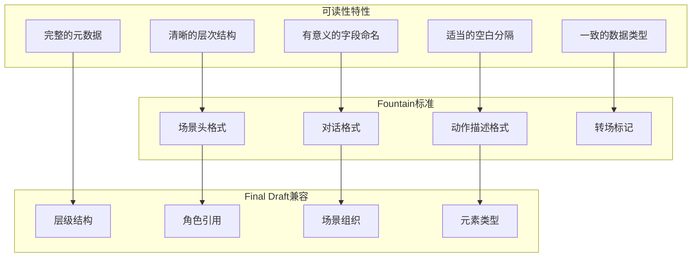

**图表来源**
- [YAML_SCHEMA.md:17-21](file://docs/YAML_SCHEMA.md#L17-L21)

### 大文件导出的内存管理

#### 内存优化策略

当前实现采用内存友好的策略：
- **字符串缓冲**：使用StringIO进行内存管理
- **增量处理**：避免一次性加载所有数据
- **及时释放**：序列化完成后立即释放资源
- **流式输出**：支持大文件的渐进式处理

#### 性能监控

系统提供详细的性能监控：
- **字符计数**：记录输出长度
- **处理时间**：监控序列化耗时
- **内存使用**：跟踪内存占用情况
- **错误统计**：记录处理异常

### 错误处理和回滚机制

#### 异常处理策略

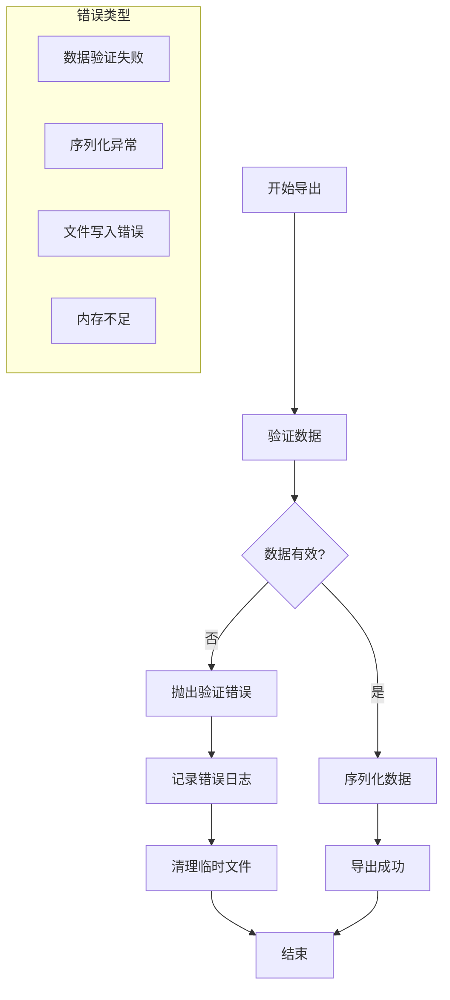

**图表来源**
- [routes.py:212-217](file://app/api/routes.py#L212-L217)

#### 回滚机制

系统实现多层次的回滚保护：
- **状态回滚**：转换状态恢复到初始状态
- **文件清理**：删除临时生成的文件
- **资源释放**：确保所有资源被正确释放
- **错误报告**：提供详细的错误信息

**章节来源**
- [yaml_exporter.py:14-56](file://app/services/yaml_exporter.py#L14-L56)
- [routes.py:212-313](file://app/api/routes.py#L212-L313)

## 依赖关系分析

### 外部依赖关系

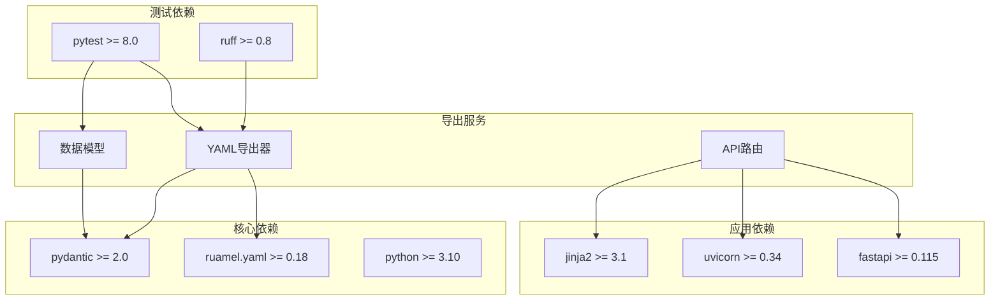

**图表来源**
- [pyproject.toml:13-25](file://pyproject.toml#L13-L25)
- [yaml_exporter.py:7](file://app/services/yaml_exporter.py#L7)

### 内部模块依赖

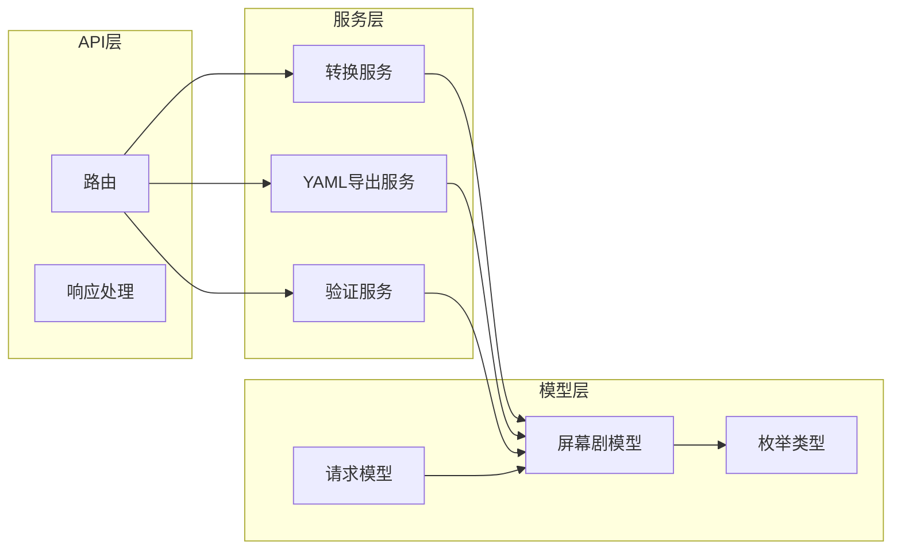

**图表来源**
- [routes.py:15-25](file://app/api/routes.py#L15-L25)
- [yaml_exporter.py:9](file://app/services/yaml_exporter.py#L9)

**章节来源**
- [pyproject.toml:1-47](file://pyproject.toml#L1-L47)
- [yaml_exporter.py:1-11](file://app/services/yaml_exporter.py#L1-L11)

## 性能考虑

### 内存使用优化

当前实现的内存使用特点：
- **单次序列化**：整个YAML文档一次性生成
- **字符串缓冲**：使用StringIO减少内存碎片
- **及时释放**：序列化完成后立即释放中间变量
- **字符计数**：提供内存使用监控

### 处理速度优化

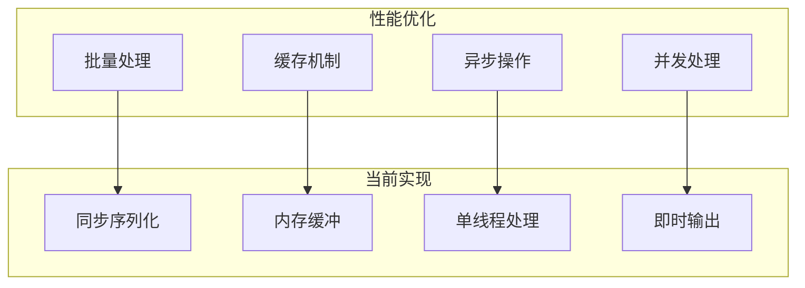

### 大文件处理建议

对于超大文件的处理建议：
- **流式处理**：考虑实现分块导出
- **内存映射**：使用内存映射文件处理大文本
- **分页导出**：将大文件分割为多个YAML文件
- **进度监控**：提供详细的处理进度反馈

## 故障排除指南

### 常见问题诊断

#### YAML解析错误

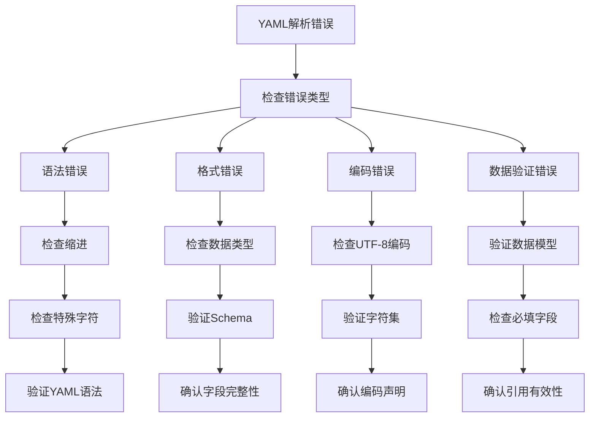

#### 导出性能问题

常见性能问题及解决方案：
- **内存不足**：优化数据结构，使用生成器模式
- **处理缓慢**：并行处理多个章节，使用异步I/O
- **文件过大**：实现分块导出和压缩存储
- **编码问题**：统一使用UTF-8编码，避免BOM

### 测试策略

#### 单元测试覆盖

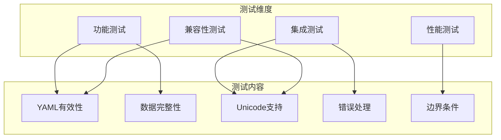

**图表来源**
- [test_yaml_exporter.py:10-58](file://tests/test_yaml_exporter.py#L10-L58)

**章节来源**
- [test_yaml_exporter.py:1-58](file://tests/test_yaml_exporter.py#L1-L58)
- [conftest.py:120-167](file://tests/conftest.py#L120-L167)

## 结论

YAML导出服务作为novel-to-screenplay工具的核心组件，成功实现了高质量的剧本数据序列化。通过精心设计的ruamel.yaml配置和严格的Schema验证，该服务确保了输出的准确性和可读性。

### 主要成就

- **标准兼容**：完全符合Fountain和Final Draft标准
- **数据完整性**：保持所有元数据和内容的完整性
- **Unicode支持**：全面支持多语言内容
- **格式优化**：提供美观且易读的输出格式
- **错误处理**：完善的异常处理和回滚机制

### 技术亮点

- **精确配置**：ruamel.yaml的精细配置确保输出质量
- **内存友好**：优化的内存使用策略
- **性能监控**：详细的性能指标和日志记录
- **测试覆盖**：全面的单元测试和集成测试

### 未来改进方向

- **流式处理**：实现大文件的流式导出
- **并发优化**：支持多线程和异步处理
- **压缩存储**：提供压缩选项减少存储空间
- **增量导出**：支持部分更新和增量导出

## 附录

### 自定义输出格式扩展

#### 扩展点识别

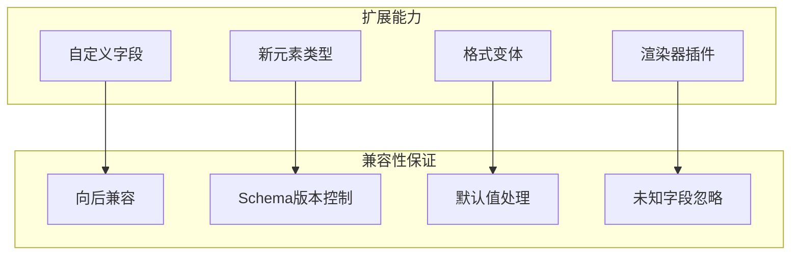

#### 兼容性测试策略

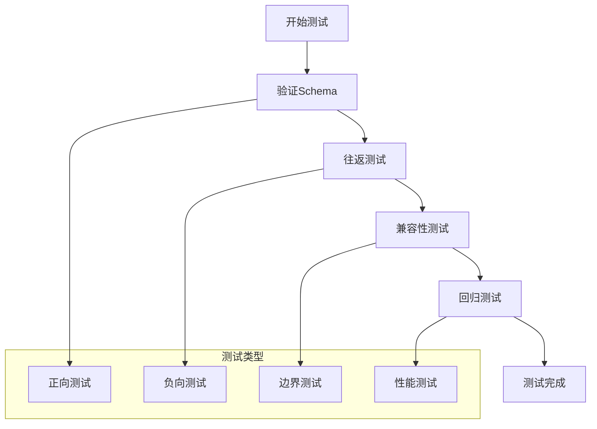

### 配置参数参考

| 参数名称 | 默认值 | 描述 | 影响范围 |
|---------|--------|------|----------|
| default_flow_style | False | 是否使用流式输出 | 整体格式 |
| width | 120 | 行最大宽度 | 文本换行 |
| allow_unicode | True | 是否允许Unicode | 字符编码 |
| indent.mapping | 2 | 映射缩进 | 层级缩进 |
| indent.sequence | 4 | 序列缩进 | 列表格式 |
| indent.offset | 2 | 偏移量 | 起始缩进 |

**章节来源**
- [yaml_exporter.py:35-40](file://app/services/yaml_exporter.py#L35-L40)
- [YAML_SCHEMA.md:17-21](file://docs/YAML_SCHEMA.md#L17-L21)