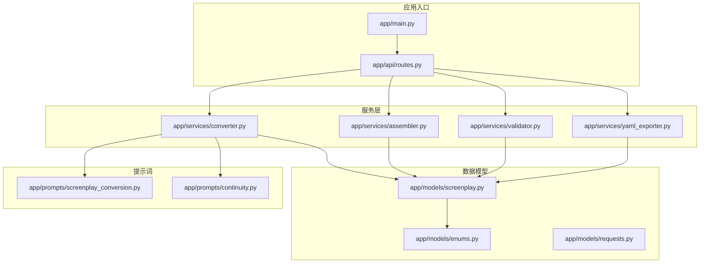
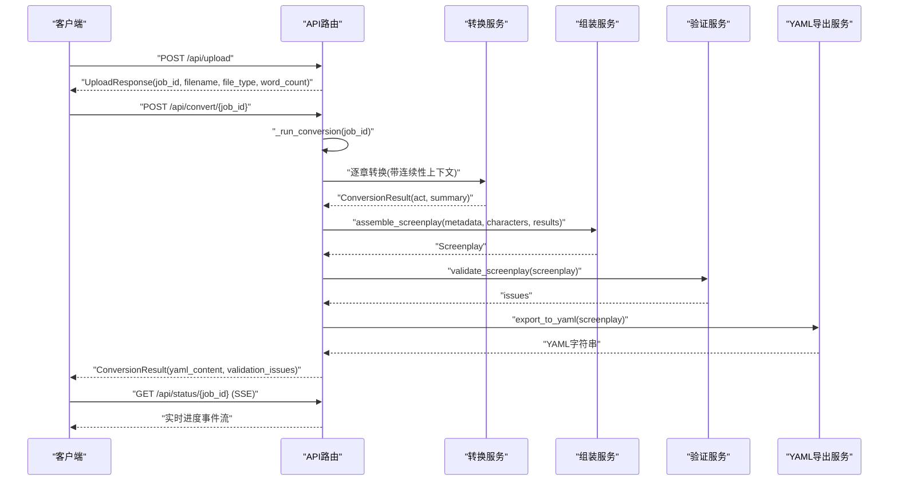
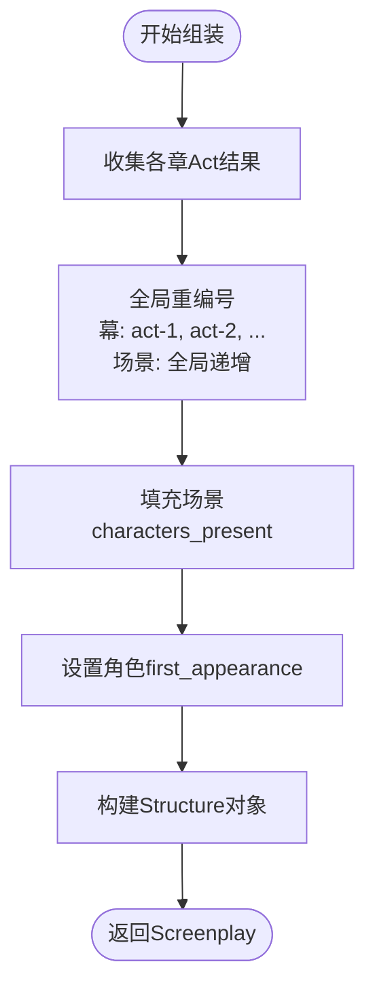
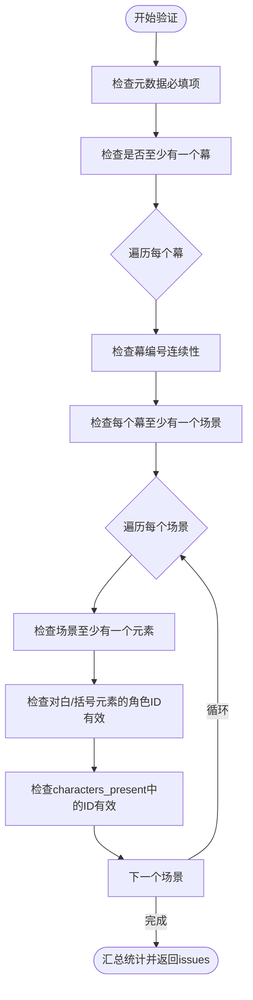
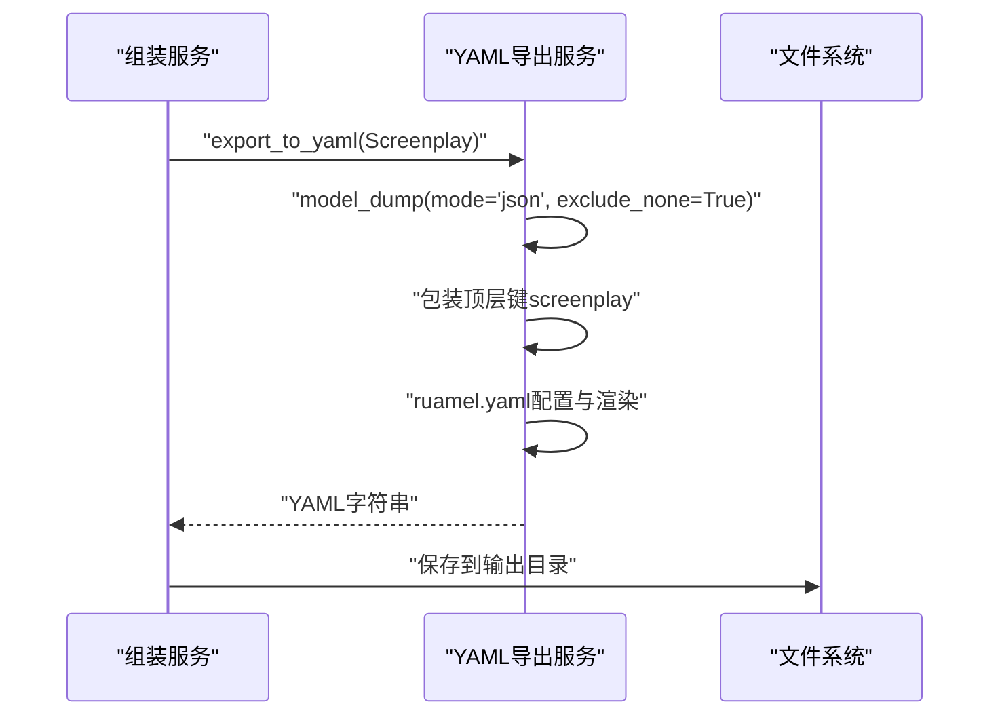
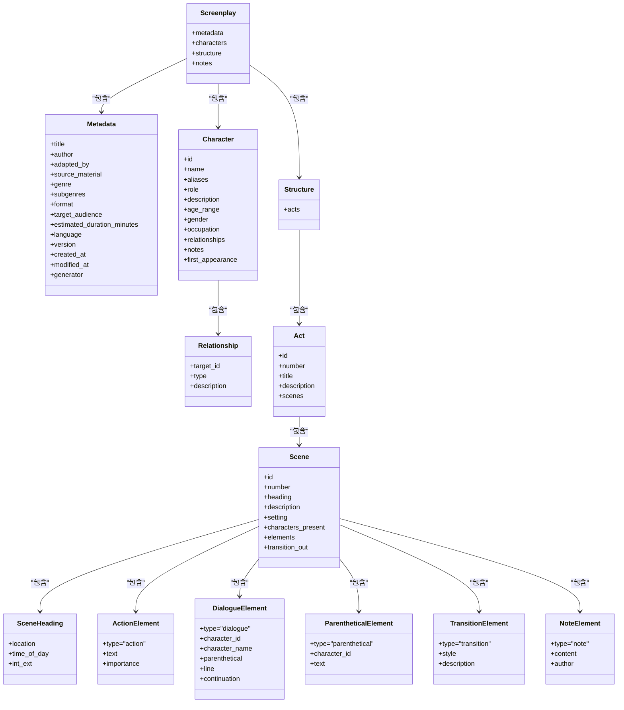
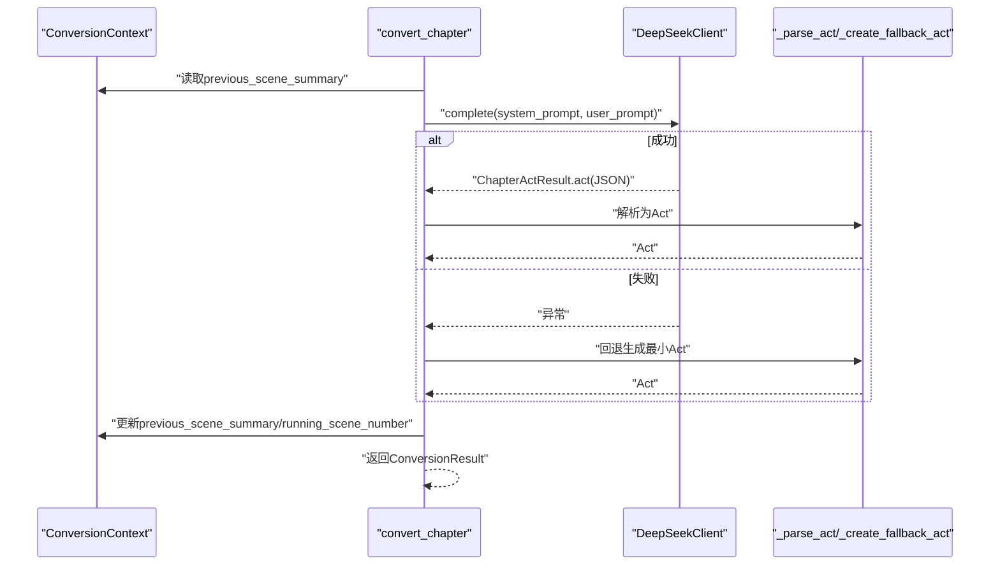
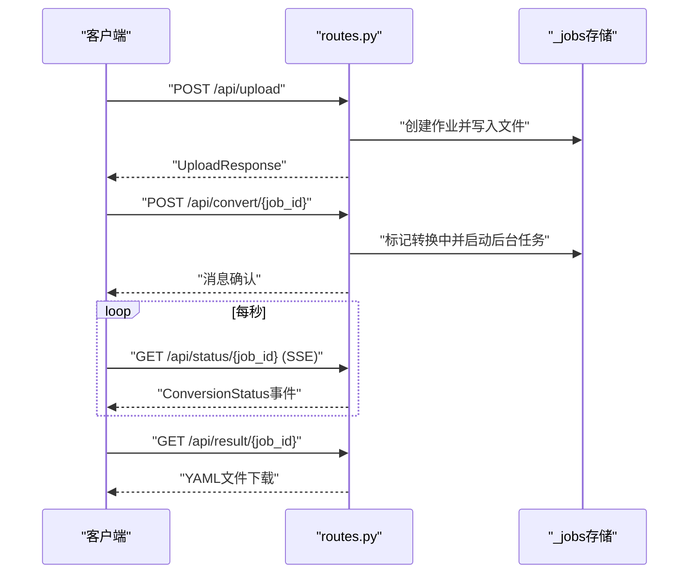
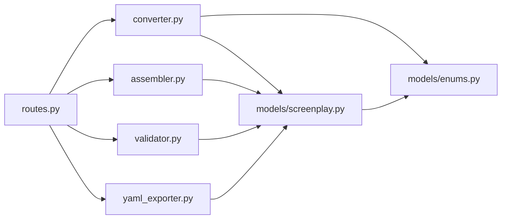

# 剧本组装服务

<cite>
**本文档引用的文件**
- [app/main.py](file://app/main.py)
- [app/api/routes.py](file://app/api/routes.py)
- [app/models/screenplay.py](file://app/models/screenplay.py)
- [app/models/enums.py](file://app/models/enums.py)
- [app/models/requests.py](file://app/models/requests.py)
- [app/services/assembler.py](file://app/services/assembler.py)
- [app/services/converter.py](file://app/services/converter.py)
- [app/services/validator.py](file://app/services/validator.py)
- [app/services/yaml_exporter.py](file://app/services/yaml_exporter.py)
- [app/prompts/screenplay_conversion.py](file://app/prompts/screenplay_conversion.py)
- [app/prompts/continuity.py](file://app/prompts/continuity.py)
- [docs/YAML_SCHEMA.md](file://docs/YAML_SCHEMA.md)
- [tests/test_assembler.py](file://tests/test_assembler.py)
- [README.md](file://README.md)
</cite>

## 目录
1. [简介](#简介)
2. [项目结构](#项目结构)
3. [核心组件](#核心组件)
4. [架构总览](#架构总览)
5. [详细组件分析](#详细组件分析)
6. [依赖关系分析](#依赖关系分析)
7. [性能考量](#性能考量)
8. [故障排查指南](#故障排查指南)
9. [结论](#结论)
10. [附录](#附录)

## 简介
本文件面向“剧本组装服务”，聚焦于结构化数据整合与组装算法，系统阐述以下主题：
- 层次关系构建：章节、场景、角色对话的嵌套结构设计与全局编号策略
- 元数据处理：标题、作者、创作时间等信息的提取与标准化
- 数据完整性检查与缺失值处理：跨引用一致性、编号连续性、非空约束
- 组装过程中的验证规则与错误修正机制
- 内存优化与大数据集处理的性能策略
- 与YAML导出服务的数据传递格式与协议
- 自定义组装规则的扩展方法与调试技巧

## 项目结构
该服务围绕“FastAPI应用”组织，核心模块包括：
- API路由与后台任务：负责作业状态管理、进度流式推送、转换流程编排
- 数据模型：基于Pydantic的YAML Schema模型，统一结构与验证
- 服务层：转换、组装、验证、导出等独立职责的服务
- 提示词模板：面向LLM的系统提示与用户提示，确保输出结构化
- 文档：YAML Schema定义与渲染指南，明确字段语义与约束

图表来源
- [app/main.py:1-46](file://app/main.py#L1-L46)
- [app/api/routes.py:1-313](file://app/api/routes.py#L1-L313)
- [app/models/screenplay.py:1-167](file://app/models/screenplay.py#L1-L167)
- [app/models/enums.py:1-83](file://app/models/enums.py#L1-L83)
- [app/models/requests.py:1-41](file://app/models/requests.py#L1-L41)
- [app/services/converter.py:1-218](file://app/services/converter.py#L1-L218)
- [app/services/assembler.py:1-101](file://app/services/assembler.py#L1-L101)
- [app/services/validator.py:1-111](file://app/services/validator.py#L1-L111)
- [app/services/yaml_exporter.py:1-57](file://app/services/yaml_exporter.py#L1-L57)
- [app/prompts/screenplay_conversion.py:1-91](file://app/prompts/screenplay_conversion.py#L1-L91)
- [app/prompts/continuity.py:1-20](file://app/prompts/continuity.py#L1-L20)

章节来源
- [README.md:77-117](file://README.md#L77-L117)

## 核心组件
- 数据模型与Schema
  - 元数据、角色、场景、幕、元素类型、全局注释等均以Pydantic模型定义，作为YAML结构的单源真理，用于序列化、反序列化与JSON Schema生成
  - 关键枚举类型：角色类型、时间/室内外、元素重要度、转场类型、格式类型、转换阶段等
- 组装服务
  - 将逐章转换结果合并为完整剧本文本，执行全局编号、角色出场列表填充、首次出场设置
- 验证服务
  - 对完成的剧本文本进行结构完整性校验，包括必填字段、跨引用有效性、编号连续性、非空约束等
- YAML导出服务
  - 使用ruamel.yaml将模型序列化为格式化的YAML字符串，保留插入顺序、块样式、Unicode与注释

章节来源
- [app/models/screenplay.py:15-167](file://app/models/screenplay.py#L15-L167)
- [app/models/enums.py:1-83](file://app/models/enums.py#L1-L83)
- [app/services/assembler.py:18-101](file://app/services/assembler.py#L18-L101)
- [app/services/validator.py:11-111](file://app/services/validator.py#L11-L111)
- [app/services/yaml_exporter.py:14-57](file://app/services/yaml_exporter.py#L14-L57)

## 架构总览
下图展示从上传到导出的完整流水线，以及各组件之间的交互关系。

图表来源
- [app/api/routes.py:114-313](file://app/api/routes.py#L114-L313)
- [app/services/converter.py:36-84](file://app/services/converter.py#L36-L84)
- [app/services/assembler.py:18-51](file://app/services/assembler.py#L18-L51)
- [app/services/validator.py:11-111](file://app/services/validator.py#L11-L111)
- [app/services/yaml_exporter.py:14-57](file://app/services/yaml_exporter.py#L14-L57)

## 详细组件分析

### 组装服务：层次关系构建与全局编号
- 全局编号策略
  - 幕编号：按出现顺序从1递增，ID形如“act-N”
  - 场景编号：全局递增，ID形如“act-M-scene-N”，确保跨幕连续
- 角色出场列表填充
  - 若场景已提供出场列表，则进行合法性校验（仅保留存在于角色目录的ID）
  - 否则扫描场景内所有对白元素，收集出现过的角色ID，去重并排序
- 首次出场设置
  - 遍历场景出场列表，记录最早出现的场景ID，写入角色的首次出场字段
- 返回结构
  - 组装为完整的剧本文本对象，包含元数据、角色目录、结构体（幕→场景→元素）

图表来源
- [app/services/assembler.py:53-101](file://app/services/assembler.py#L53-L101)

章节来源
- [app/services/assembler.py:18-101](file://app/services/assembler.py#L18-L101)
- [tests/test_assembler.py:49-111](file://tests/test_assembler.py#L49-L111)

### 验证服务：数据完整性与跨引用校验
- 校验清单
  - 元数据完整性：标题必填
  - 结构完整性：至少一个幕；每个幕至少一个场景；每个场景至少一个元素
  - 编号连续性：幕与场景编号必须连续
  - 跨引用一致性：对白与括号元素的“角色ID”必须存在于角色目录
  - 场景出场列表一致性：出场角色ID必须存在于角色目录
- 错误分类
  - 错误：破坏结构完整性的严重问题（如缺少幕/场景/元素、角色ID不存在）
  - 警告：可修复但影响质量的问题（如编号不连续、场景无元素、出场ID无效）
- 日志输出
  - 统计错误与警告数量，便于前端展示与人工复核

图表来源
- [app/services/validator.py:11-111](file://app/services/validator.py#L11-L111)

章节来源
- [app/services/validator.py:11-111](file://app/services/validator.py#L11-L111)
- [docs/YAML_SCHEMA.md:318-328](file://docs/YAML_SCHEMA.md#L318-L328)

### YAML导出服务：格式化与协议
- 序列化流程
  - 使用模型的JSON模式导出字典，排除None值
  - 包裹顶层键“screenplay”，形成最终字典
- 渲染配置
  - 块样式输出、禁止流式风格、宽度适配、Unicode支持、缩进控制
  - 添加头部注释（版本、生成时间、Schema文档链接）
- 输出协议
  - Content-Type: text/yaml
  - 下载文件名：screenplay_{job_id前缀}.yaml
  - 字符编码：UTF-8

图表来源
- [app/services/yaml_exporter.py:14-57](file://app/services/yaml_exporter.py#L14-L57)

章节来源
- [app/services/yaml_exporter.py:14-57](file://app/services/yaml_exporter.py#L14-L57)
- [docs/YAML_SCHEMA.md:1-496](file://docs/YAML_SCHEMA.md#L1-L496)

### 数据模型与Schema：层次结构与字段语义
- 层次结构
  - 元数据 → 角色目录 → 结构（幕→场景→元素）
  - 场景元素为判别联合类型：动作、对白、括号、转场、注释
- 关键字段与默认值
  - 元数据：标题、作者、适配者、类型、语言、版本、创建/修改时间、生成器等
  - 角色：ID、名称、别名、角色类型、描述、年龄/性别/职业、关系、首次出场等
  - 场景：ID、全局编号、场景标题（地点、室内外、时段）、描述、环境、出场角色、元素数组、转场
  - 幕：ID、编号、标题、描述、场景数组
- 枚举约束
  - 角色类型、时间/室内外、转场类型、格式类型、元素重要度、转换阶段等

图表来源
- [app/models/screenplay.py:15-167](file://app/models/screenplay.py#L15-L167)

章节来源
- [app/models/screenplay.py:15-167](file://app/models/screenplay.py#L15-L167)
- [docs/YAML_SCHEMA.md:25-34](file://docs/YAML_SCHEMA.md#L25-L34)

### 转换服务：逐章转换与连续性上下文
- 连续性上下文
  - 保存上一场景摘要、累计场景编号、当前幕编号
  - 每章转换后生成两句话的连续性摘要，作为下章上下文
- 输出解析
  - 将LLM返回的JSON结构解析为Act模型，自动分配全局场景编号
  - 对场景标题、元素类型进行默认值填充与校验
- 容错回退
  - LLM失败时生成最小可用Act，保留章节标题与位置信息

图表来源
- [app/services/converter.py:36-84](file://app/services/converter.py#L36-L84)
- [app/services/converter.py:100-157](file://app/services/converter.py#L100-L157)
- [app/services/converter.py:160-183](file://app/services/converter.py#L160-L183)
- [app/prompts/screenplay_conversion.py:1-91](file://app/prompts/screenplay_conversion.py#L1-L91)
- [app/prompts/continuity.py:1-20](file://app/prompts/continuity.py#L1-L20)

章节来源
- [app/services/converter.py:16-84](file://app/services/converter.py#L16-L84)
- [app/prompts/screenplay_conversion.py:1-91](file://app/prompts/screenplay_conversion.py#L1-L91)
- [app/prompts/continuity.py:1-20](file://app/prompts/continuity.py#L1-L20)

### API路由：作业状态与进度流
- 作业存储
  - 使用内存字典维护作业状态，包含文件路径、文本、状态、结果与验证问题
- 进度流
  - SSE实时推送状态，包含阶段、进度百分比、当前章节、总章节、错误信息
- 转换流水线
  - 解析 → 分章 → 提取角色 → 逐章转换 → 组装 → 验证 → 导出

图表来源
- [app/api/routes.py:30-50](file://app/api/routes.py#L30-L50)
- [app/api/routes.py:114-166](file://app/api/routes.py#L114-L166)
- [app/api/routes.py:208-313](file://app/api/routes.py#L208-L313)

章节来源
- [app/api/routes.py:30-50](file://app/api/routes.py#L30-L50)
- [app/api/routes.py:208-313](file://app/api/routes.py#L208-L313)

## 依赖关系分析
- 组件耦合
  - 组装服务依赖数据模型与转换结果；验证服务依赖数据模型；导出服务依赖数据模型
  - API路由编排转换、组装、验证、导出流程，是核心协调者
- 外部依赖
  - LLM服务（DeepSeek）用于角色提取与剧本转换
  - ruamel.yaml用于高质量YAML输出
  - Pydantic用于模型定义与验证
- 循环依赖
  - 未发现直接循环依赖；服务间通过模型与函数接口解耦

图表来源
- [app/api/routes.py:15-24](file://app/api/routes.py#L15-L24)
- [app/services/converter.py:7-11](file://app/services/converter.py#L7-L11)
- [app/services/assembler.py:5-12](file://app/services/assembler.py#L5-L12)
- [app/services/validator.py:6-6](file://app/services/validator.py#L6-L6)
- [app/services/yaml_exporter.py:9-9](file://app/services/yaml_exporter.py#L9-L9)
- [app/models/screenplay.py:12-12](file://app/models/screenplay.py#L12-L12)
- [app/models/enums.py:3-3](file://app/models/enums.py#L3-L3)

章节来源
- [app/api/routes.py:15-24](file://app/api/routes.py#L15-L24)
- [app/services/converter.py:7-11](file://app/services/converter.py#L7-L11)
- [app/services/assembler.py:5-12](file://app/services/assembler.py#L5-L12)
- [app/services/validator.py:6-6](file://app/services/validator.py#L6-L6)
- [app/services/yaml_exporter.py:9-9](file://app/services/yaml_exporter.py#L9-L9)
- [app/models/screenplay.py:12-12](file://app/models/screenplay.py#L12-L12)
- [app/models/enums.py:3-3](file://app/models/enums.py#L3-L3)

## 性能考量
- 内存优化
  - 逐章转换：每章结束后丢弃中间结果，避免累积占用
  - 全局编号与出场列表填充：使用集合与一次遍历完成，空间复杂度O(N)
  - YAML导出：使用StringIO流式写入，避免中间缓冲过大
- 大数据集处理
  - 章节截断：当单章过长时进行截断，控制LLM输入长度，防止Token溢出
  - 连续性摘要：限制场景摘要数量与长度，避免上下文膨胀
- I/O与并发
  - SSE流式状态推送，降低轮询开销
  - 后台任务异步执行，避免阻塞主线程

章节来源
- [app/services/converter.py:53-57](file://app/services/converter.py#L53-L57)
- [app/services/converter.py:197-198](file://app/services/converter.py#L197-L198)
- [app/services/yaml_exporter.py:43-55](file://app/services/yaml_exporter.py#L43-L55)
- [app/api/routes.py:136-158](file://app/api/routes.py#L136-L158)

## 故障排查指南
- 常见问题与定位
  - 标题缺失：验证服务会报告元数据.title为空；检查上传文件与解析逻辑
  - 角色ID不存在：对白/括号元素的character_id不在角色目录；检查角色提取与转换输出
  - 编号不连续：幕或场景编号非连续；检查组装服务的全局编号逻辑
  - 场景无元素：场景elements为空；检查转换输出或回退逻辑
- 错误修正建议
  - 在角色目录中补充缺失角色，或修正对白元素的角色ID
  - 手动调整场景元素顺序，确保至少包含一个动作或对白
  - 重新运行转换，利用连续性摘要改善上下文一致性
- 调试技巧
  - 使用SSE接口观察实时进度，定位卡顿阶段
  - 在验证接口查看issues列表，快速定位问题范围
  - 通过预览接口获取纯文本YAML，便于对比差异

章节来源
- [app/services/validator.py:11-111](file://app/services/validator.py#L11-L111)
- [app/api/routes.py:201-206](file://app/api/routes.py#L201-L206)
- [app/api/routes.py:131-166](file://app/api/routes.py#L131-L166)

## 结论
本服务通过清晰的分层设计与严格的Schema约束，实现了从章节级转换到完整剧本文本的可靠组装。组装服务承担了全局编号、角色出场与首次出场的关键职责；验证服务保障结构完整性与跨引用正确性；YAML导出服务提供高质量、可编辑的输出。配合LLM驱动的角色提取与转换，以及SSE进度流与内存优化策略，整体具备良好的可扩展性与生产可用性。

## 附录
- YAML Schema参考：详见docs/YAML_SCHEMA.md，涵盖字段定义、枚举值、渲染规则与扩展点
- API请求/响应模型：UploadResponse、ConversionStatus、ValidationIssue、ConversionResult等
- 枚举类型：角色类型、时间/室内外、转场类型、格式类型、元素重要度、转换阶段

章节来源
- [docs/YAML_SCHEMA.md:1-496](file://docs/YAML_SCHEMA.md#L1-L496)
- [app/models/requests.py:6-41](file://app/models/requests.py#L6-L41)
- [app/models/enums.py:6-83](file://app/models/enums.py#L6-L83)