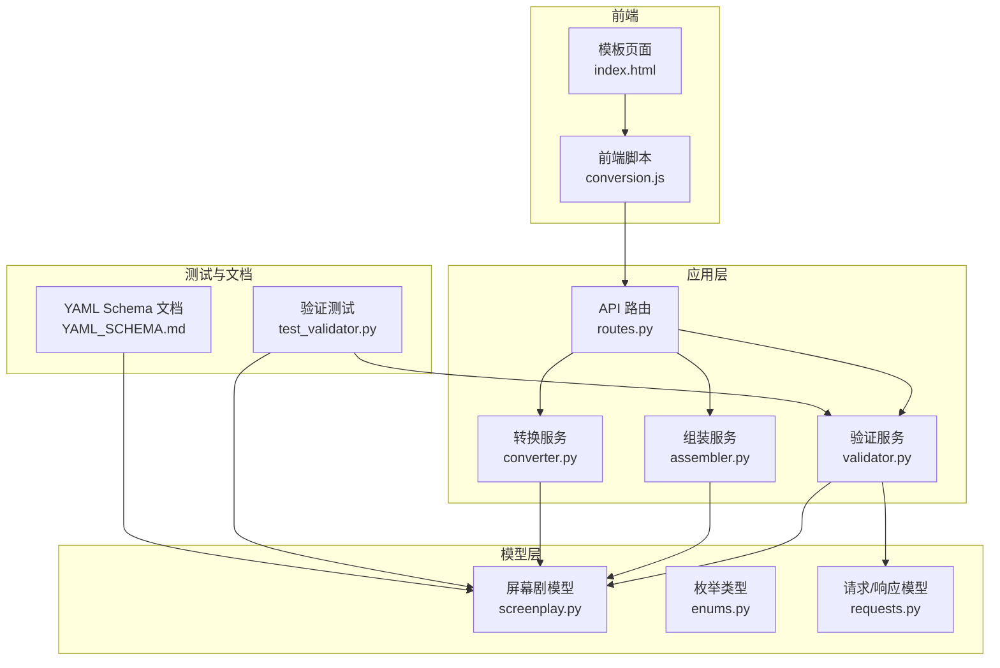
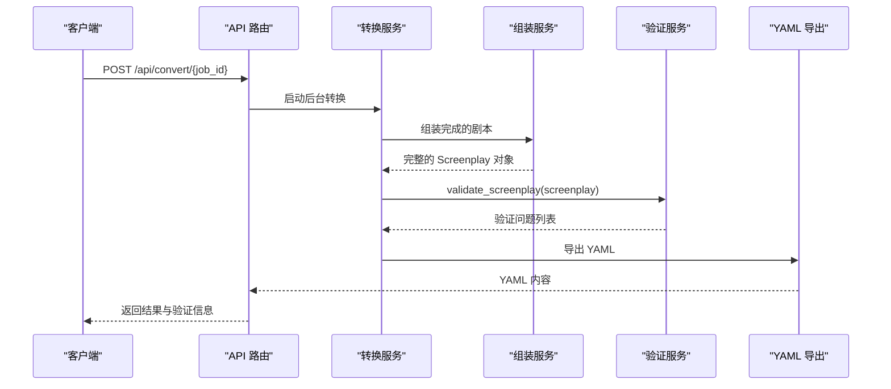
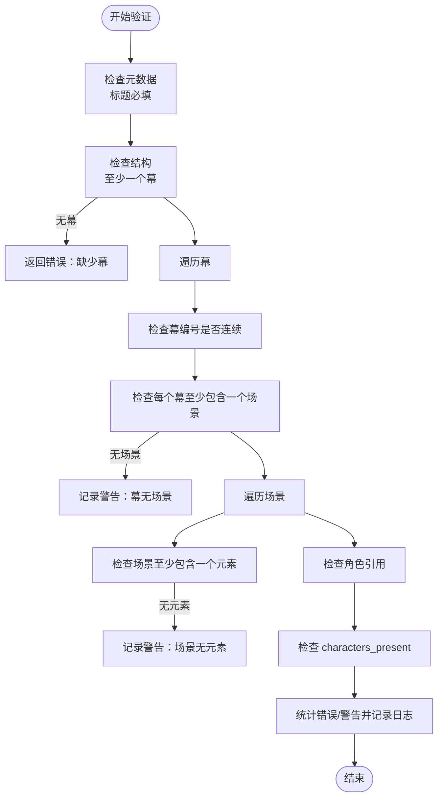
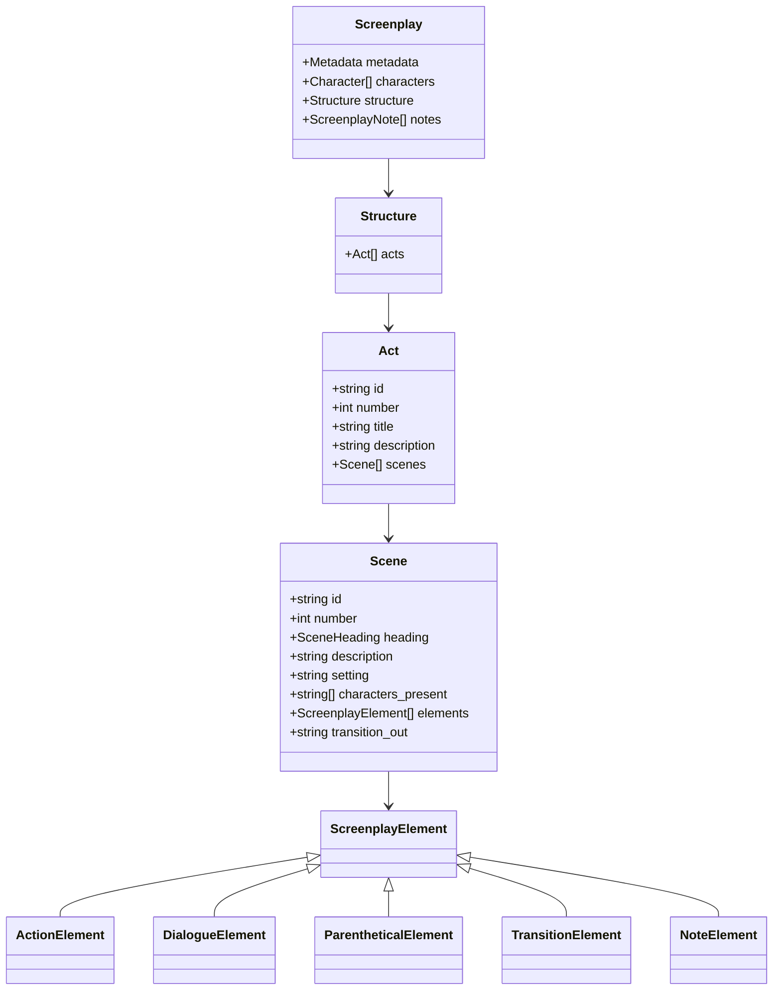
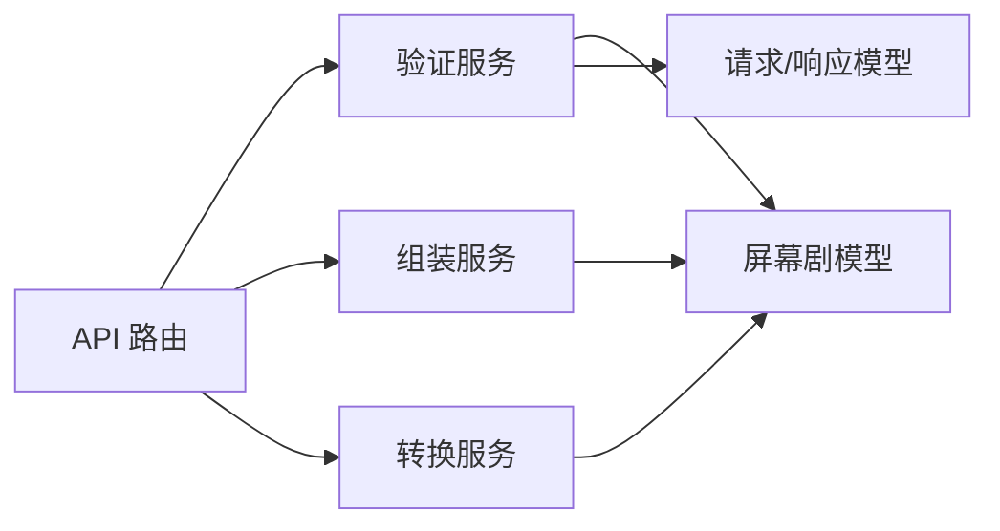

# 数据验证服务

<cite>
**本文引用的文件**
- [validator.py](file://app/services/validator.py)
- [screenplay.py](file://app/models/screenplay.py)
- [enums.py](file://app/models/enums.py)
- [requests.py](file://app/models/requests.py)
- [routes.py](file://app/api/routes.py)
- [assembler.py](file://app/services/assembler.py)
- [converter.py](file://app/services/converter.py)
- [test_validator.py](file://tests/test_validator.py)
- [YAML_SCHEMA.md](file://docs/YAML_SCHEMA.md)
- [conversion.js](file://app/static/js/conversion.js)
- [index.html](file://app/templates/index.html)
- [README.md](file://README.md)
</cite>

## 目录
1. [简介](#简介)
2. [项目结构](#项目结构)
3. [核心组件](#核心组件)
4. [架构总览](#架构总览)
5. [详细组件分析](#详细组件分析)
6. [依赖分析](#依赖分析)
7. [性能考量](#性能考量)
8. [故障排查指南](#故障排查指南)
9. [结论](#结论)
10. [附录](#附录)

## 简介
本文件面向“数据验证服务”，聚焦于输出完整性检查与质量控制机制。文档从以下维度展开：
- 完整性检查规则的设计原理：必需字段验证、数据类型检查、范围约束
- 角色引用验证算法：确保场景中的角色名称与角色目录一致
- 编号一致性验证：章节编号、场景编号的递增与唯一性检查
- 错误分类与严重程度评估标准
- 验证报告生成格式与可读性优化
- 验证失败的处理策略与自动修复建议
- 自定义验证规则的扩展接口与性能优化技巧

## 项目结构
该服务位于应用层的验证模块，配合模型定义、API 路由与前端展示共同构成完整的验证闭环。

图表来源
- [routes.py:200-313](file://app/api/routes.py#L200-L313)
- [validator.py:11-111](file://app/services/validator.py#L11-L111)
- [assembler.py:18-101](file://app/services/assembler.py#L18-L101)
- [converter.py:36-218](file://app/services/converter.py#L36-L218)
- [screenplay.py:161-167](file://app/models/screenplay.py#L161-L167)
- [enums.py:1-83](file://app/models/enums.py#L1-L83)
- [requests.py:24-41](file://app/models/requests.py#L24-L41)
- [test_validator.py:19-63](file://tests/test_validator.py#L19-L63)
- [YAML_SCHEMA.md:318-328](file://docs/YAML_SCHEMA.md#L318-L328)
- [conversion.js:73-129](file://app/static/js/conversion.js#L73-L129)
- [index.html:94-120](file://app/templates/index.html#L94-L120)

章节来源
- [README.md:77-108](file://README.md#L77-L108)
- [routes.py:200-313](file://app/api/routes.py#L200-L313)

## 核心组件
- 验证服务：负责对完整剧本进行结构完整性与交叉引用一致性检查，返回标准化的验证问题列表。
- 屏幕剧模型：基于 Pydantic 的强类型模型，定义元数据、角色、场景、元素等结构，提供类型与范围约束。
- 枚举类型：统一时间、地点、转场、格式等枚举值，确保字段取值合法。
- 请求/响应模型：定义验证问题的数据结构，便于 API 返回与前端展示。
- 组装服务：在转换完成后对编号进行全局重排，确保编号连续且唯一。
- API 路由：在转换流程中调用验证服务，并将结果写入作业状态，供前端查询。

章节来源
- [validator.py:11-111](file://app/services/validator.py#L11-L111)
- [screenplay.py:161-167](file://app/models/screenplay.py#L161-L167)
- [enums.py:1-83](file://app/models/enums.py#L1-L83)
- [requests.py:24-41](file://app/models/requests.py#L24-L41)
- [assembler.py:53-64](file://app/services/assembler.py#L53-L64)
- [routes.py:291-299](file://app/api/routes.py#L291-L299)

## 架构总览
验证服务在转换流水线的“验证”阶段执行，其职责是：
- 必需字段检查：如标题为空、缺少幕/场景/元素等
- 角色引用验证：对话与括号元素中的角色 ID 是否存在于角色目录
- 编号一致性验证：幕编号必须连续（1,2,3…），场景编号必须全局连续
- 总结统计：记录错误与警告数量，便于前端展示

图表来源
- [routes.py:219-313](file://app/api/routes.py#L219-L313)
- [assembler.py:18-51](file://app/services/assembler.py#L18-L51)
- [validator.py:11-111](file://app/services/validator.py#L11-L111)
- [converter.py:36-84](file://app/services/converter.py#L36-L84)

## 详细组件分析

### 验证服务（validator.py）
- 设计目标：在转换完成后对生成的完整剧本进行一次性完整性检查，覆盖必需字段、角色引用、编号连续性与非空约束。
- 关键检查点：
  - 元数据标题必填
  - 至少存在一个幕；每个幕至少包含一个场景；每个场景至少包含一个元素
  - 角色引用验证：对话与括号元素中的角色 ID 必须存在于角色目录；场景的“出场角色”也需在角色目录中
  - 编号一致性：幕编号必须连续（1,2,3…）；场景编号必须全局连续
- 严重程度：
  - 必需字段缺失或结构缺失：错误
  - 角色引用无效：错误
  - 场景无元素或幕无场景：警告
  - 幕编号不连续：警告
- 日志与统计：统计错误与警告数量，便于运维与前端展示。

图表来源
- [validator.py:11-111](file://app/services/validator.py#L11-L111)

章节来源
- [validator.py:11-111](file://app/services/validator.py#L11-L111)
- [test_validator.py:19-63](file://tests/test_validator.py#L19-L63)

### 屏幕剧模型（screenplay.py）
- 元数据：标题、作者、格式、语言、版本、时间戳等字段均具备明确的类型与默认值，确保序列化与反序列化的稳定性。
- 角色：角色 ID 作为唯一标识，用于跨场景与元素的引用；角色目录在转换后由组装服务统一维护。
- 场景：包含场景头（地点、时间段、室内/室外）、描述、环境、出场角色、元素序列与转场等字段。
- 元素：动作、对白、括号、转场、注释五类元素，使用判别联合类型确保类型安全。
- 结构：幕与场景的层级组织，支持全局场景编号与 ID 的生成与重排。

图表来源
- [screenplay.py:161-167](file://app/models/screenplay.py#L161-L167)
- [screenplay.py:145-148](file://app/models/screenplay.py#L145-L148)
- [screenplay.py:134-141](file://app/models/screenplay.py#L134-L141)
- [screenplay.py:120-130](file://app/models/screenplay.py#L120-L130)
- [screenplay.py:67-108](file://app/models/screenplay.py#L67-L108)

章节来源
- [screenplay.py:161-167](file://app/models/screenplay.py#L161-L167)
- [screenplay.py:145-148](file://app/models/screenplay.py#L145-L148)
- [screenplay.py:134-141](file://app/models/screenplay.py#L134-L141)
- [screenplay.py:120-130](file://app/models/screenplay.py#L120-L130)
- [screenplay.py:67-108](file://app/models/screenplay.py#L67-L108)

### 枚举类型（enums.py）
- 角色类型：主角、反派、配角、次要角色、群众角色
- 时间：白天、夜晚、黎明、黄昏、连续、稍后、片刻之后
- 室内/室外：室内、室外、室内外、外室内
- 元素类型：动作、对白、括号、转场、注释
- 转场类型：切、淡出、淡黑、溶解、爆炸剪辑、匹配剪辑、擦除、交叉剪辑、蒙太奇、时间流逝
- 剧本格式：故事片、电视单集、迷你剧、短片
- 元素重要度：关键、标准、背景
- 转换阶段：上传、解析、拆分、提取角色、转换、组装、验证、完成、错误

章节来源
- [enums.py:1-83](file://app/models/enums.py#L1-L83)

### 请求/响应模型（requests.py）
- ValidationIssue：包含严重程度、路径（JSONPath 风格）、消息三要素，用于标准化验证报告。
- ConversionResult：包含 YAML 内容与验证问题列表，便于前端展示与下载。

章节来源
- [requests.py:24-41](file://app/models/requests.py#L24-L41)

### 组装服务（assembler.py）
- 在转换完成后对幕与场景进行全局重排，确保：
  - 幕编号连续（1,2,3…）
  - 场景编号全局连续（跨幕累加）
  - 自动生成场景 ID（act-{act}-scene-{scene}）
- 同时填充每个场景的出场角色列表，并设置角色首次出现场景。

章节来源
- [assembler.py:53-64](file://app/services/assembler.py#L53-L64)
- [assembler.py:66-86](file://app/services/assembler.py#L66-L86)
- [assembler.py:88-101](file://app/services/assembler.py#L88-L101)

### API 路由（routes.py）
- 在“验证”阶段调用验证服务，将问题列表保存到作业状态，供前端查询。
- 提供验证结果查询接口，返回 issues 数组。

章节来源
- [routes.py:291-299](file://app/api/routes.py#L291-L299)
- [routes.py:201-206](file://app/api/routes.py#L201-L206)

### 前端展示（conversion.js 与 index.html）
- 前端在转换完成后主动拉取验证结果，统计错误与警告数量并展示摘要。
- 页面提供错误区域与结果区域，支持重试操作。

章节来源
- [conversion.js:73-129](file://app/static/js/conversion.js#L73-L129)
- [index.html:94-120](file://app/templates/index.html#L94-L120)

## 依赖分析
- 验证服务依赖：
  - 屏幕剧模型：用于结构与字段的类型与范围约束
  - 请求/响应模型：用于标准化输出格式
- 组装服务与转换服务：
  - 通过全局重排与出场角色填充，为验证服务提供稳定的编号与引用基础
- API 路由：
  - 在转换流水线中注入验证步骤，确保输出质量

图表来源
- [validator.py:5-6](file://app/services/validator.py#L5-L6)
- [assembler.py:5-13](file://app/services/assembler.py#L5-L13)
- [converter.py:7-11](file://app/services/converter.py#L7-L11)
- [routes.py:15-24](file://app/api/routes.py#L15-L24)

章节来源
- [validator.py:5-6](file://app/services/validator.py#L5-L6)
- [assembler.py:5-13](file://app/services/assembler.py#L5-L13)
- [converter.py:7-11](file://app/services/converter.py#L7-L11)
- [routes.py:15-24](file://app/api/routes.py#L15-L24)

## 性能考量
- 验证复杂度：验证过程为一次线性扫描，时间复杂度 O(N)，其中 N 为场景与元素总数；空间复杂度 O(C)，其中 C 为角色数量（用于构建角色 ID 集合）。
- 优化建议：
  - 在组装阶段提前去重与过滤无效角色 ID，减少验证阶段的集合查找开销
  - 对超长章节进行断点切分，避免单次 LLM 调用导致的内存压力
  - 前端轮询频率控制，避免频繁请求造成服务器压力
  - 将验证结果缓存至作业状态，避免重复计算

[本节为通用性能讨论，无需特定文件来源]

## 故障排查指南
- 常见问题与定位：
  - 标题为空：检查元数据标题字段
  - 缺少幕/场景/元素：检查结构层次是否完整
  - 角色引用无效：检查对话/括号元素与场景出场角色中的角色 ID 是否存在于角色目录
  - 幕编号不连续：检查组装阶段的编号重排逻辑
- 前端展示：
  - 转换完成后，前端会显示错误与警告数量摘要；若无问题则提示“无验证问题”
- 单元测试参考：
  - 测试覆盖了标题为空、无幕、无效角色引用、场景无元素、出场角色无效等典型场景

章节来源
- [test_validator.py:19-63](file://tests/test_validator.py#L19-L63)
- [conversion.js:73-129](file://app/static/js/conversion.js#L73-L129)
- [index.html:94-120](file://app/templates/index.html#L94-L120)

## 结论
本数据验证服务以“一次性完整性检查”为核心，结合模型层的强类型约束与组装阶段的编号重排，实现了对输出质量的可靠保障。通过标准化的验证问题格式与前端可视化展示，用户可以快速定位并修复问题。未来可在保持现有稳定性的基础上，引入可配置规则与增量验证能力，进一步提升灵活性与性能。

[本节为总结性内容，无需特定文件来源]

## 附录

### 完整性检查规则与设计原理
- 必需字段验证：标题、角色 ID、场景元素等字段在模型层已具备必填约束；验证服务补充结构完整性检查（至少一个幕、至少一个场景、至少一个元素）。
- 数据类型检查：通过 Pydantic 类型注解与枚举约束，确保字段取值合法。
- 范围约束：编号必须连续；角色 ID 必须唯一；场景头字段必须使用有效枚举值。

章节来源
- [YAML_SCHEMA.md:318-328](file://docs/YAML_SCHEMA.md#L318-L328)
- [screenplay.py:161-167](file://app/models/screenplay.py#L161-L167)
- [enums.py:1-83](file://app/models/enums.py#L1-L83)

### 角色引用验证算法
- 算法思路：
  - 构建角色 ID 集合（O(C)）
  - 遍历场景元素，对对话与括号元素检查角色 ID 是否存在于集合
  - 遍历场景出场角色列表，同样进行集合查找
  - 对未找到的角色 ID 记录为验证问题
- 复杂度：O(E + S)，E 为场景元素数，S 为出场角色列表长度

章节来源
- [validator.py:84-100](file://app/services/validator.py#L84-L100)
- [assembler.py:66-86](file://app/services/assembler.py#L66-L86)

### 编号一致性验证
- 幕编号：按顺序赋值为 1,2,3…，与索引一致
- 场景编号：全局累加，确保跨幕连续
- ID 生成：场景 ID 采用“act-{act}-scene-{scene}”模式，便于调试与追踪

章节来源
- [assembler.py:53-64](file://app/services/assembler.py#L53-L64)

### 错误分类与严重程度评估标准
- 错误（error）：标题缺失、缺少幕/场景/元素、角色引用无效
- 警告（warning）：幕无场景、场景无元素、幕编号不连续、出场角色无效

章节来源
- [validator.py:30-108](file://app/services/validator.py#L30-L108)

### 验证报告生成格式与可读性优化
- 格式：ValidationIssue（严重程度、路径、消息）
- 路径：采用 JSONPath 风格，便于精确定位问题字段
- 前端优化：统计错误与警告数量，展示摘要；提供重试与下载功能

章节来源
- [requests.py:24-28](file://app/models/requests.py#L24-L28)
- [conversion.js:73-129](file://app/static/js/conversion.js#L73-L129)
- [index.html:94-120](file://app/templates/index.html#L94-L120)

### 验证失败的处理策略与自动修复建议
- 处理策略：
  - 对于标题缺失、缺少幕/场景/元素等致命问题，阻断后续流程并返回错误
  - 对于角色引用无效，建议回溯角色目录修正 ID 或删除无效引用
  - 对于编号不连续，建议重新触发组装阶段以重排编号
- 自动修复建议：
  - 自动补全缺失的场景元素（如添加占位动作元素）
  - 自动清理出场角色列表中的无效 ID
  - 自动重排编号并更新场景 ID

章节来源
- [validator.py:30-108](file://app/services/validator.py#L30-L108)
- [assembler.py:66-86](file://app/services/assembler.py#L66-L86)

### 自定义验证规则的扩展接口与性能优化技巧
- 扩展接口：
  - 新增验证规则：在验证函数中追加检查逻辑，并返回新的 ValidationIssue 实例
  - 可配置规则：通过外部配置文件或环境变量控制启用/禁用某些规则
- 性能优化：
  - 使用集合查找替代线性搜索
  - 在组装阶段预处理数据，减少验证阶段的计算量
  - 控制前端轮询频率，避免过度请求

章节来源
- [validator.py:11-111](file://app/services/validator.py#L11-L111)
- [assembler.py:53-64](file://app/services/assembler.py#L53-L64)