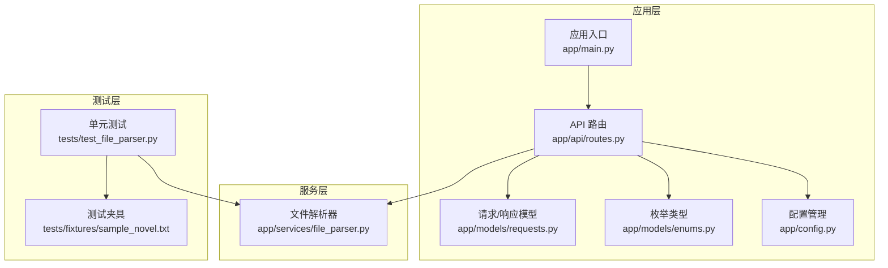
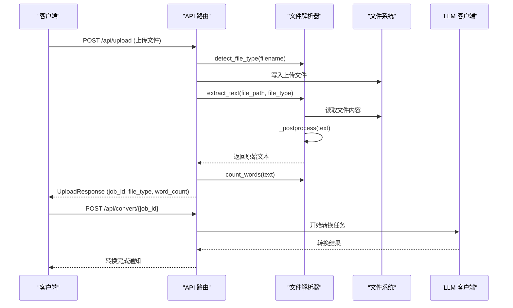
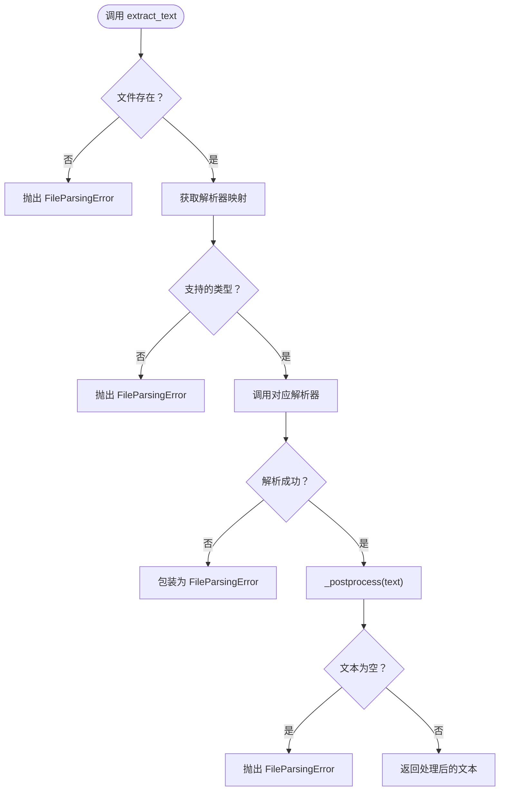
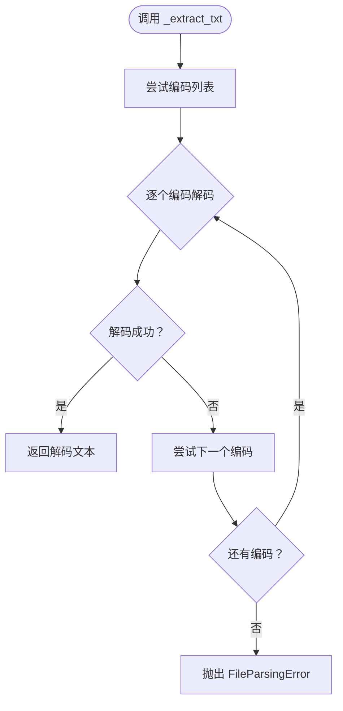
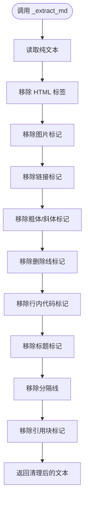
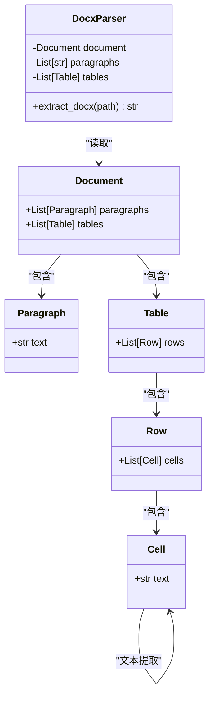
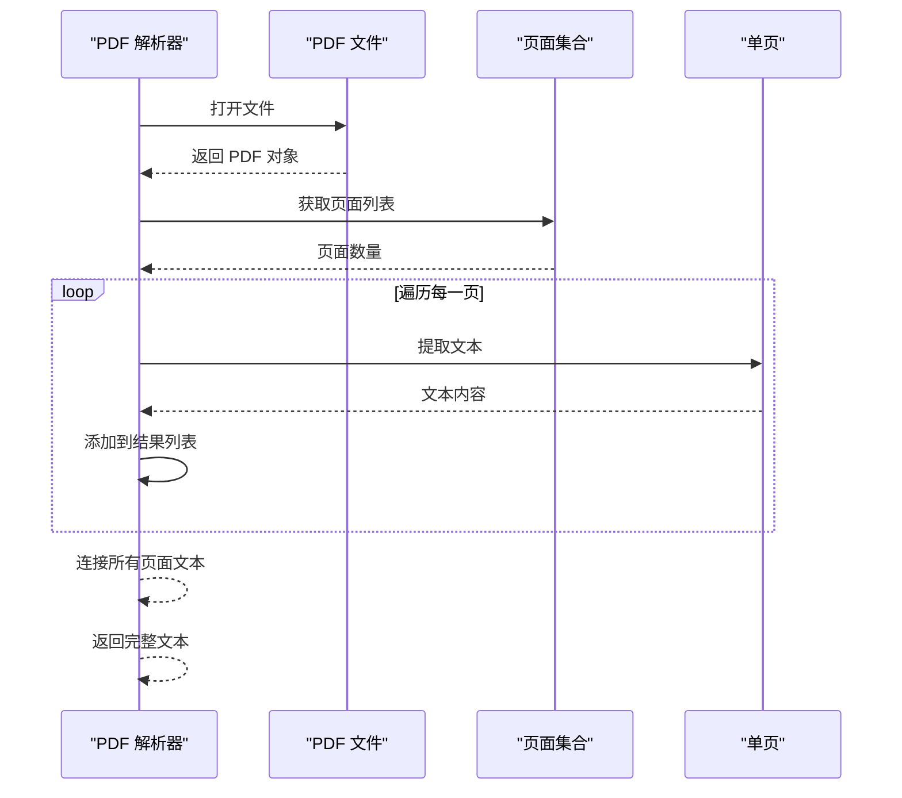
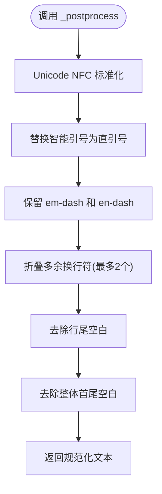
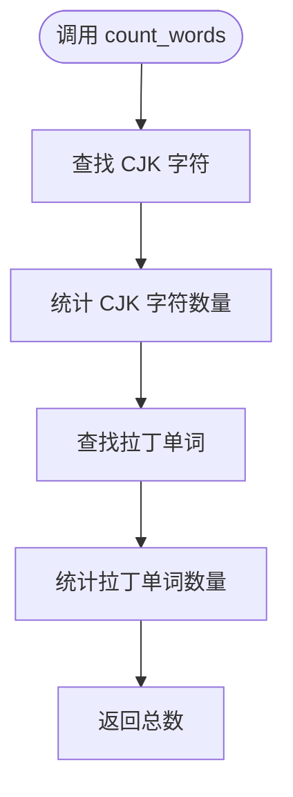
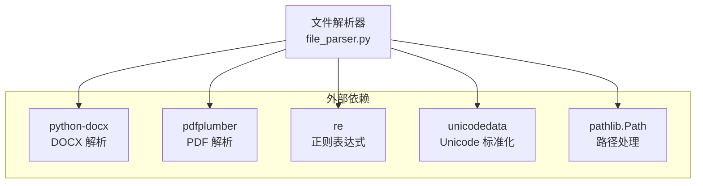

# 文件处理服务

<cite>
**本文档引用的文件**
- [app/services/file_parser.py](file://app/services/file_parser.py)
- [tests/test_file_parser.py](file://tests/test_file_parser.py)
- [app/api/routes.py](file://app/api/routes.py)
- [app/models/requests.py](file://app/models/requests.py)
- [app/models/enums.py](file://app/models/enums.py)
- [app/main.py](file://app/main.py)
- [app/config.py](file://app/config.py)
- [pyproject.toml](file://pyproject.toml)
- [README.md](file://README.md)
- [tests/fixtures/sample_novel.txt](file://tests/fixtures/sample_novel.txt)
</cite>

## 目录
1. [简介](#简介)
2. [项目结构](#项目结构)
3. [核心组件](#核心组件)
4. [架构总览](#架构总览)
5. [详细组件分析](#详细组件分析)
6. [依赖关系分析](#依赖关系分析)
7. [性能考虑](#性能考虑)
8. [故障排除指南](#故障排除指南)
9. [结论](#结论)
10. [附录](#附录)

## 简介
本文件处理服务是小说到剧本转换系统的核心模块之一，负责从多种文件格式中提取原始文本，并进行统一的文本规范化处理。该服务实现了统一的 extract_text 接口，支持 TXT、Markdown、DOCX、PDF 四种格式的文本提取；提供了文件类型检测、双语词数统计、以及完善的错误处理策略。本文档将深入解析各格式解析器的实现机制、文本后处理流程、以及如何扩展新的文件格式支持。

## 项目结构
文件处理服务位于 app/services/file_parser.py，配合 API 层在 app/api/routes.py 中被调用，测试用例位于 tests/test_file_parser.py。系统整体采用 FastAPI 架构，文件解析作为转换流水线的第一步，为后续的章节切分、角色提取、逐章转换等步骤提供基础文本数据。



**图表来源**
- [app/api/routes.py:1-313](file://app/api/routes.py#L1-L313)
- [app/services/file_parser.py:1-187](file://app/services/file_parser.py#L1-L187)
- [tests/test_file_parser.py:1-102](file://tests/test_file_parser.py#L1-L102)

**章节来源**
- [README.md:77-108](file://README.md#L77-L108)
- [pyproject.toml:8-25](file://pyproject.toml#L8-L25)

## 核心组件
文件处理服务的核心由以下组件构成：
- 统一接口 extract_text：根据文件类型路由到对应的解析器
- 四种专用解析器：纯文本多编码支持、Markdown 格式剥离、DOCX 段落和表格提取、PDF 文本提取
- 文本后处理 _postprocess：Unicode 标准化和空白字符规范化
- 文件类型检测 detect_file_type：基于扩展名的类型识别
- 双语词数统计 count_words：同时处理 CJK 和拉丁文字

**章节来源**
- [app/services/file_parser.py:16-187](file://app/services/file_parser.py#L16-L187)

## 架构总览
文件处理服务在整个转换流水线中的位置如下：



**图表来源**
- [app/api/routes.py:68-112](file://app/api/routes.py#L68-L112)
- [app/api/routes.py:114-128](file://app/api/routes.py#L114-L128)
- [app/services/file_parser.py:16-56](file://app/services/file_parser.py#L16-L56)

## 详细组件分析

### 统一接口设计：extract_text
extract_text 函数提供统一的文本提取接口，支持四种文件类型：
- txt：纯文本文件
- md/markdown：Markdown 文件
- docx：Word 文档
- pdf：PDF 文档

该函数通过字典映射将文件类型映射到相应的解析器，并在解析过程中进行统一的错误处理和文本后处理。



**图表来源**
- [app/services/file_parser.py:16-56](file://app/services/file_parser.py#L16-L56)

**章节来源**
- [app/services/file_parser.py:16-56](file://app/services/file_parser.py#L16-L56)

### 纯文本文件解析器：_extract_txt
纯文本解析器支持多种编码格式，包括 UTF-8、GBK、GB2312、Latin-1 等。实现采用尝试-捕获策略，按优先级顺序尝试不同的编码解码，直到成功或穷尽所有选项。



**图表来源**
- [app/services/file_parser.py:59-67](file://app/services/file_parser.py#L59-L67)

**章节来源**
- [app/services/file_parser.py:59-67](file://app/services/file_parser.py#L59-L67)

### Markdown 文件解析器：_extract_md
Markdown 解析器在纯文本基础上，使用正则表达式进行格式剥离，移除各种 Markdown 标记：
- HTML 标签：`<[^>]+>`
- 图片：`` → 保留 alt 文本
- 链接：`[text](url)` → 保留文本
- 粗体/斜体/删除线：`***text***`、`__text__`、`~~text~~`
- 行内代码：`` `text` ``
- 标题：`# 标题` 移除 # 标记
- 分隔线：`---`、`***` 等
- 引用块：`> 块引用`



**图表来源**
- [app/services/file_parser.py:70-94](file://app/services/file_parser.py#L70-L94)

**章节来源**
- [app/services/file_parser.py:70-94](file://app/services/file_parser.py#L70-L94)

### DOCX 文件解析器：_extract_docx
DOCX 解析器使用 python-docx 库提取文档内容：
- 读取所有段落文本并去除空白
- 提取表格中的单元格文本，按行拼接
- 将段落和表格内容以双换行符连接



**图表来源**
- [app/services/file_parser.py:97-119](file://app/services/file_parser.py#L97-L119)

**章节来源**
- [app/services/file_parser.py:97-119](file://app/services/file_parser.py#L97-L119)

### PDF 文件解析器：_extract_pdf
PDF 解析器使用 pdfplumber 库提取文本：
- 打开 PDF 文件并检查页数
- 逐页提取文本内容
- 将所有页面文本以双换行符连接



**图表来源**
- [app/services/file_parser.py:122-143](file://app/services/file_parser.py#L122-L143)

**章节来源**
- [app/services/file_parser.py:122-143](file://app/services/file_parser.py#L122-L143)

### 文本后处理：_postprocess
文本后处理函数执行以下规范化操作：
- Unicode NFC 标准化，将智能引号转换为直引号
- 保留 em-dash 和 en-dash 等特殊字符
- 将连续三个以上的换行符折叠为最多两个
- 去除每行末尾的空白字符
- 去除整个文本的首尾空白



**图表来源**
- [app/services/file_parser.py:146-161](file://app/services/file_parser.py#L146-L161)

**章节来源**
- [app/services/file_parser.py:146-161](file://app/services/file_parser.py#L146-L161)

### 文件类型检测：detect_file_type
基于文件扩展名的类型检测函数，支持以下映射：
- .txt → txt
- .md/.markdown → md
- .docx → docx
- .pdf → pdf

对于不支持的扩展名，抛出 FileParsingError 异常。

**章节来源**
- [app/services/file_parser.py:164-177](file://app/services/file_parser.py#L164-L177)

### 双语词数统计：count_words
双语词数统计函数同时处理 CJK 和拉丁文字：
- CJK 字符：使用 Unicode 范围匹配，每个字符计为 1 个词
- 拉丁单词：使用正则表达式匹配字母数字组合，包含撇号的缩写形式
- 标点符号：不影响词数统计



**图表来源**
- [app/services/file_parser.py:180-186](file://app/services/file_parser.py#L180-L186)

**章节来源**
- [app/services/file_parser.py:180-186](file://app/services/file_parser.py#L180-L186)

## 依赖关系分析
文件处理服务的依赖关系相对简单，主要依赖外部库用于不同格式的解析：



**图表来源**
- [pyproject.toml:18-19](file://pyproject.toml#L18-L19)
- [app/services/file_parser.py:1-8](file://app/services/file_parser.py#L1-L8)

**章节来源**
- [pyproject.toml:13-25](file://pyproject.toml#L13-L25)

## 性能考虑
基于代码分析，文件处理服务在性能方面有以下特点和优化建议：

### 现有实现的优势
- **多编码支持**：纯文本解析器采用渐进式编码尝试，确保兼容性
- **内存友好**：DOCX 和 PDF 解析器按页/段落处理，避免一次性加载大文件
- **正则优化**：Markdown 格式剥离使用编译后的正则表达式模式

### 性能优化建议
1. **缓存策略**：对已解析的文件内容进行缓存，避免重复解析
2. **异步处理**：将耗时的 PDF OCR 处理改为异步执行
3. **流式处理**：对于超大文件，考虑使用流式读取而非一次性读入内存
4. **并发解析**：在支持的情况下，允许多个文件并行解析
5. **预编译正则**：将常用的正则表达式预编译，减少运行时开销

### 错误处理策略
文件处理服务采用统一的错误处理策略：
- 明确的异常类型：FileParsingError 用于解析失败
- 详细的错误信息：包含文件路径和具体原因
- 类型安全：通过类型注解确保接口契约
- 单元测试覆盖：完整的测试用例确保功能正确性

**章节来源**
- [app/services/file_parser.py:11-13](file://app/services/file_parser.py#L11-L13)
- [tests/test_file_parser.py:66-81](file://tests/test_file_parser.py#L66-L81)

## 故障排除指南
### 常见问题及解决方案

#### 文件无法解析
**症状**：抛出 FileParsingError 异常
**可能原因**：
- 文件不存在或路径错误
- 不支持的文件类型
- 编码格式不兼容

**解决方法**：
- 检查文件路径是否正确
- 确认文件扩展名是否在支持列表中
- 对于文本文件，确认编码格式

#### PDF 文本提取失败
**症状**：PDF 解析器提示无法提取文本
**可能原因**：
- PDF 为扫描版图像文件
- PDF 无可用页面
- 缺少 pdfplumber 依赖

**解决方法**：
- 确认 PDF 包含可搜索文本
- 检查 PDF 是否损坏
- 安装 pdfplumber 依赖

#### DOCX 文件解析异常
**症状**：python-docx 导入失败
**解决方法**：
- 安装 python-docx 依赖
- 确认 DOCX 文件格式正确

**章节来源**
- [app/services/file_parser.py:101-102](file://app/services/file_parser.py#L101-L102)
- [app/services/file_parser.py:126-127](file://app/services/file_parser.py#L126-L127)

## 结论
文件处理服务通过统一的接口设计和模块化的实现，成功地将多种文件格式的文本提取过程抽象化。其核心优势在于：

1. **统一接口**：extract_text 提供一致的调用方式
2. **格式兼容**：支持主流的文本格式，满足多样化需求
3. **质量保证**：完善的错误处理和测试覆盖
4. **可扩展性**：清晰的架构便于添加新的文件格式支持

该服务为小说到剧本转换系统的后续处理步骤提供了高质量的原始文本数据，是整个转换流水线的重要基石。

## 附录

### 支持的文件格式
- **TXT**：纯文本文件，支持 UTF-8、GBK、GB2312、Latin-1 等编码
- **MD/MARKDOWN**：Markdown 文件，自动剥离格式标记
- **DOCX**：Word 文档，提取段落和表格内容
- **PDF**：PDF 文档，提取可搜索文本

### API 使用示例
```python
from pathlib import Path
from app.services.file_parser import extract_text, detect_file_type, count_words

# 检测文件类型
file_type = detect_file_type("novel.txt")

# 提取文本
text = extract_text(Path("novel.txt"), file_type)

# 统计词数
word_count = count_words(text)
```

### 扩展新格式支持的步骤
1. 在 extract_text 函数的映射表中添加新格式
2. 实现对应的解析器函数
3. 在 detect_file_type 中添加扩展名映射
4. 编写单元测试验证功能
5. 更新依赖配置（如需要）

**章节来源**
- [app/services/file_parser.py:32-38](file://app/services/file_parser.py#L32-L38)
- [app/services/file_parser.py:167-177](file://app/services/file_parser.py#L167-L177)