# 样例小说系统

<cite>
**本文档引用的文件**
- [README.md](file://README.md)
- [pyproject.toml](file://pyproject.toml)
- [app/main.py](file://app/main.py)
- [app/config.py](file://app/config.py)
- [app/dependencies.py](file://app/dependencies.py)
- [app/api/routes.py](file://app/api/routes.py)
- [app/models/enums.py](file://app/models/enums.py)
- [app/models/requests.py](file://app/models/requests.py)
- [app/models/screenplay.py](file://app/models/screenplay.py)
- [app/services/file_parser.py](file://app/services/file_parser.py)
- [app/services/chapter_splitter.py](file://app/services/chapter_splitter.py)
- [app/services/character_extractor.py](file://app/services/character_extractor.py)
- [app/services/converter.py](file://app/services/converter.py)
- [app/services/assembler.py](file://app/services/assembler.py)
- [app/services/validator.py](file://app/services/validator.py)
- [app/services/yaml_exporter.py](file://app/services/yaml_exporter.py)
- [app/services/llm_client.py](file://app/services/llm_client.py)
- [app/templates/index.html](file://app/templates/index.html)
- [app/static/js/conversion.js](file://app/static/js/conversion.js)
- [app/static/js/samples.js](file://app/static/js/samples.js)
- [data/samples/sample1_三国演义草船借箭.md](file://data/samples/sample1_三国演义草船借箭.md)
</cite>

## 更新摘要
**变更内容**
- 更新样例小说处理逻辑部分，反映使用BASE_DIR.parent替代settings.data_dir的改进
- 新增样例小说系统架构图，展示新的数据路径处理方式
- 更新配置管理和环境兼容性相关内容
- 增强开发和生产环境兼容性的说明

## 目录
1. [简介](#简介)
2. [项目结构](#项目结构)
3. [核心组件](#核心组件)
4. [架构概览](#架构概览)
5. [详细组件分析](#详细组件分析)
6. [依赖关系分析](#依赖关系分析)
7. [性能考虑](#性能考虑)
8. [故障排除指南](#故障排除指南)
9. [结论](#结论)

## 简介

样例小说系统是一个AI驱动的小说转剧本工具，能够将小说文本自动转换为结构化的YAML剧本格式。该系统提供了完整的Web界面，支持多种文件格式输入，并具备智能章节检测、角色提取、逐章转换等功能。

### 主要特性

- **多格式输入**：支持TXT、Markdown、DOCX、PDF四种格式的小说文件
- **智能章节检测**：使用正则表达式和启发式算法自动识别章节边界
- **角色目录提取**：通过LLM从小说文本中提取完整角色列表
- **逐章剧本转换**：采用"滑动窗口+记忆"策略保证多章节间的一致性
- **结构化YAML输出**：生成符合行业标准的剧本YAML文件
- **Web界面**：提供拖拽上传、实时进度条、YAML语法高亮预览等功能
- **样例小说系统**：内置样例小说库，支持开发和生产环境的兼容性处理

## 项目结构

该项目采用模块化设计，按照功能层次组织代码结构：

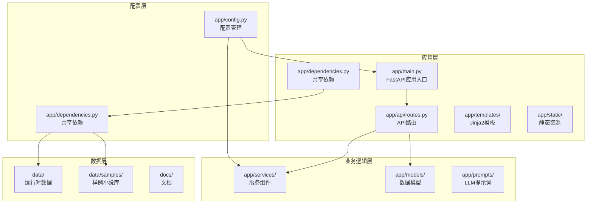

**图表来源**
- [app/main.py:1-48](file://app/main.py#L1-L48)
- [app/api/routes.py:1-397](file://app/api/routes.py#L1-L397)
- [app/dependencies.py:1-9](file://app/dependencies.py#L1-L9)

**章节来源**
- [README.md:77-108](file://README.md#L77-L108)
- [pyproject.toml:8-47](file://pyproject.toml#L8-L47)

## 核心组件

### 应用入口与配置

系统使用FastAPI作为Web框架，提供RESTful API接口。主要配置包括：

- **设置管理**：使用pydantic-settings管理环境变量和配置参数
- **中间件**：启用CORS支持跨域请求
- **静态文件**：提供CSS和JavaScript资源
- **生命周期管理**：确保运行时目录在启动时创建

### 数据模型

系统定义了完整的YAML剧本数据结构，包括：

- **元数据**：标题、作者、类型、语言、版本等信息
- **角色系统**：角色ID、名称、别名、角色类型、描述等
- **场景元素**：动作、对白、括号说明、转场、备注等
- **结构层次**：幕、场景、元素的嵌套关系

### 样例小说系统

样例小说系统提供内置的样例小说库，支持开发和生产环境的兼容性处理：

- **路径管理**：使用BASE_DIR.parent替代settings.data_dir，确保在不同环境中正确定位样例文件
- **环境适配**：开发模式下从项目根目录访问样例，生产模式下从运行时数据目录访问
- **文件发现**：自动扫描data/samples目录中的TXT和Markdown文件
- **内容预览**：提供样例小说的标题、字数统计和内容预览功能

**章节来源**
- [app/config.py:9-45](file://app/config.py#L9-L45)
- [app/models/screenplay.py:17-167](file://app/models/screenplay.py#L17-L167)
- [app/dependencies.py:7](file://app/dependencies.py#L7)
- [app/api/routes.py:429-484](file://app/api/routes.py#L429-L484)

## 架构概览

系统采用分层架构设计，实现了清晰的关注点分离：

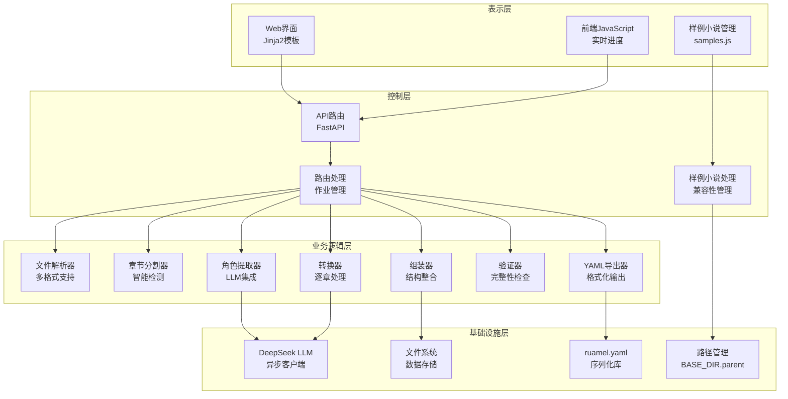

**图表来源**
- [app/main.py:23-48](file://app/main.py#L23-L48)
- [app/api/routes.py:15-25](file://app/api/routes.py#L15-L25)
- [app/dependencies.py:7](file://app/dependencies.py#L7)

## 详细组件分析

### 文件解析服务

文件解析服务支持多种文档格式的文本提取：

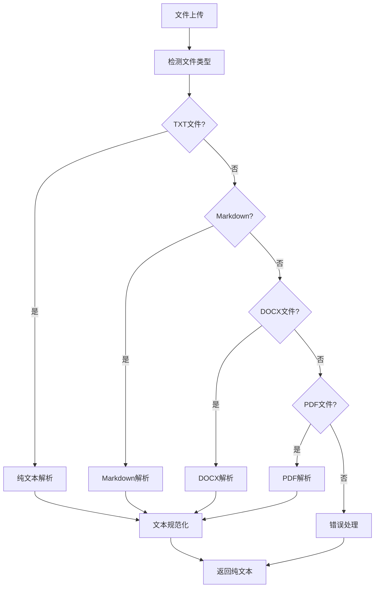

**图表来源**
- [app/services/file_parser.py:16-57](file://app/services/file_parser.py#L16-L57)

**章节来源**
- [app/services/file_parser.py:16-187](file://app/services/file_parser.py#L16-L187)

### 章节分割器

章节分割器采用两阶段策略确保准确的章节检测：

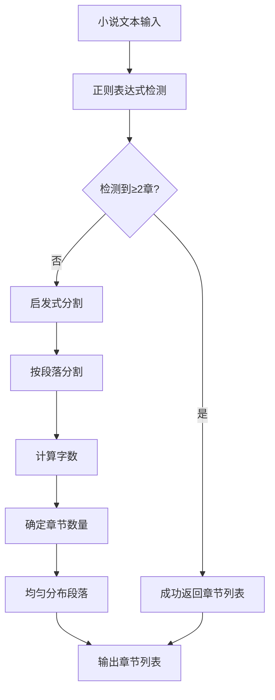

**图表来源**
- [app/services/chapter_splitter.py:42-64](file://app/services/chapter_splitter.py#L42-L64)

**章节来源**
- [app/services/chapter_splitter.py:42-163](file://app/services/chapter_splitter.py#L42-L163)

### 角色提取器

角色提取器通过LLM从小说文本中提取角色信息：

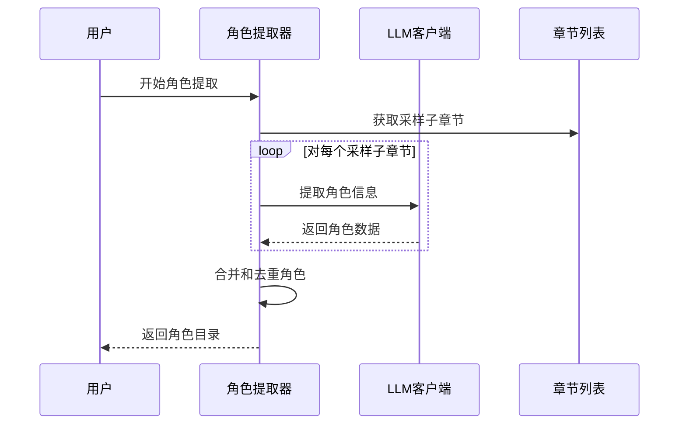

**图表来源**
- [app/services/character_extractor.py:21-76](file://app/services/character_extractor.py#L21-L76)

**章节来源**
- [app/services/character_extractor.py:21-154](file://app/services/character_extractor.py#L21-L154)

### 转换器

转换器实现小说到剧本的逐章转换：

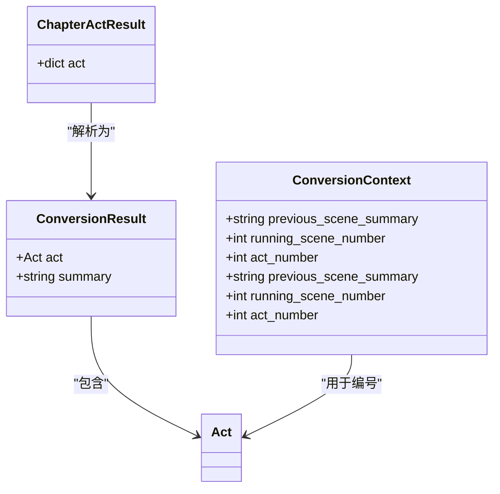

**图表来源**
- [app/services/converter.py:16-35](file://app/services/converter.py#L16-L35)

**章节来源**
- [app/services/converter.py:36-218](file://app/services/converter.py#L36-L218)

### 组装器

组装器将各章节转换结果整合为完整的剧本：

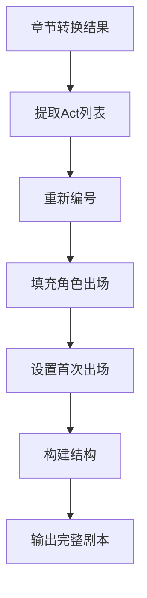

**图表来源**
- [app/services/assembler.py:18-51](file://app/services/assembler.py#L18-L51)

**章节来源**
- [app/services/assembler.py:18-101](file://app/services/assembler.py#L18-L101)

### 验证器

验证器检查生成的剧本是否符合规范：

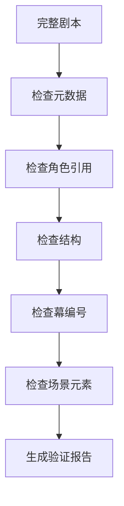

**图表来源**
- [app/services/validator.py:11-111](file://app/services/validator.py#L11-L111)

**章节来源**
- [app/services/validator.py:11-111](file://app/services/validator.py#L11-L111)

### YAML导出器

YAML导出器负责将剧本模型序列化为格式化的YAML文件：

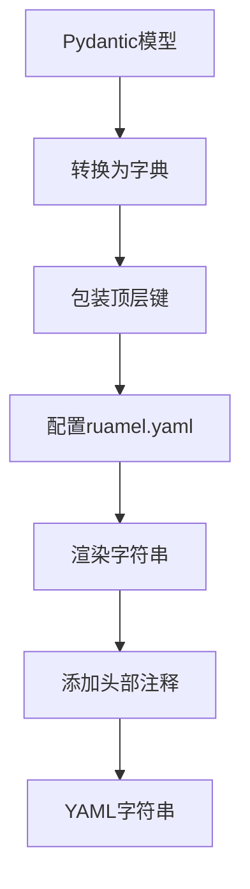

**图表来源**
- [app/services/yaml_exporter.py:14-57](file://app/services/yaml_exporter.py#L14-L57)

**章节来源**
- [app/services/yaml_exporter.py:14-57](file://app/services/yaml_exporter.py#L14-L57)

### LLM客户端

LLM客户端提供异步的DeepSeek API调用：

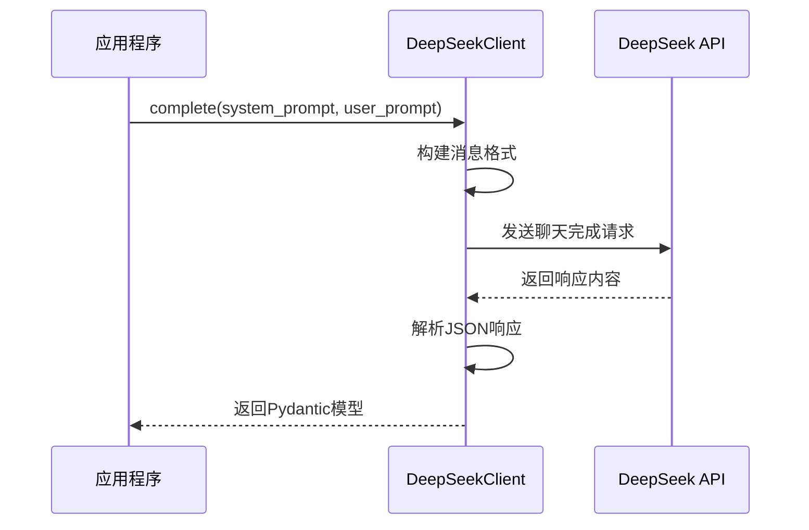

**图表来源**
- [app/services/llm_client.py:33-87](file://app/services/llm_client.py#L33-L87)

**章节来源**
- [app/services/llm_client.py:18-103](file://app/services/llm_client.py#L18-L103)

### 样例小说处理系统

样例小说处理系统提供内置样例小说的访问和管理功能：

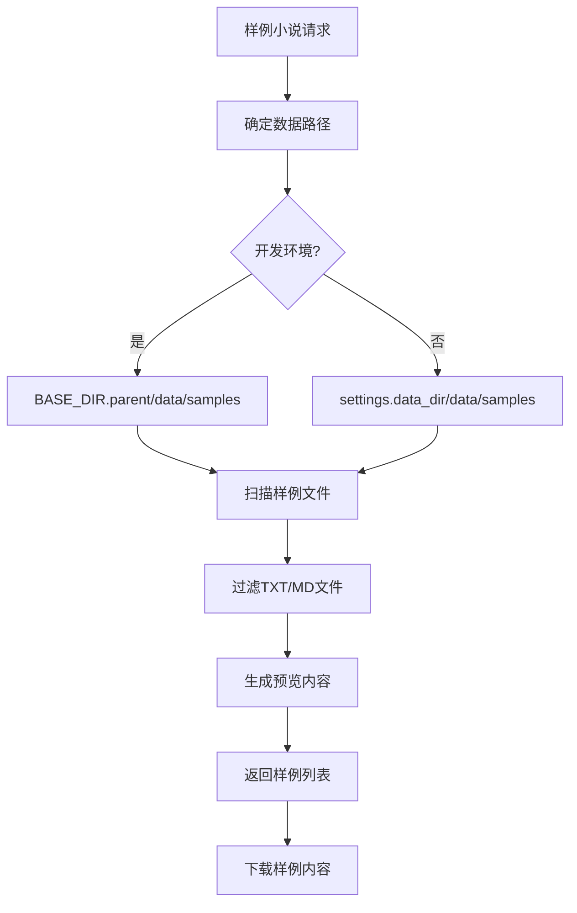

**图表来源**
- [app/api/routes.py:429-484](file://app/api/routes.py#L429-L484)
- [app/dependencies.py:7](file://app/dependencies.py#L7)

**章节来源**
- [app/api/routes.py:429-484](file://app/api/routes.py#L429-L484)
- [app/static/js/samples.js:14-116](file://app/static/js/samples.js#L14-L116)

## 依赖关系分析

系统依赖关系清晰，遵循单一职责原则：

```mermaid
graph TB
subgraph "外部依赖"
FASTAPI[FastAPI]
PYDANTIC[Pydantic v2]
OPENAI[OpenAI SDK]
RUAMEL[ruamel.yaml]
DOCX[python-docx]
PDF[PDFPlumber]
END
subgraph "内部模块"
MAIN[app/main.py]
ROUTES[app/api/routes.py]
MODELS[app/models/*]
SERVICES[app/services/*]
DEPENDENCIES[app/dependencies.py]
CONFIG[app/config.py]
end
MAIN --> FASTAPI
ROUTES --> PYDANTIC
DEPENDENCIES --> PYDANTIC
CONFIG --> PYDANTIC
SERVICES --> OPENAI
SERVICES --> RUAMEL
SERVICES --> DOCX
SERVICES --> PDF
SERVICES --> MODELS
```

**图表来源**
- [pyproject.toml:13-25](file://pyproject.toml#L13-L25)

**章节来源**
- [pyproject.toml:13-47](file://pyproject.toml#L13-L47)

## 性能考虑

系统在多个层面考虑了性能优化：

### 内存管理
- 使用异步I/O避免阻塞
- 内存中的作业存储限制在合理范围内
- 及时清理临时文件和缓存

### LLM调用优化
- 实现指数退避重试机制
- 合理的温度参数设置
- Token预算分配策略

### 文件处理优化
- 支持大文件分块处理
- 智能的章节分割算法
- 多编码格式自动检测

### 样例小说系统优化
- **路径缓存**：BASE_DIR使用lru_cache进行缓存，避免重复计算
- **延迟加载**：样例文件按需读取，减少内存占用
- **文件系统优化**：使用iterdir()进行高效目录遍历
- **编码处理**：统一UTF-8编码，避免编码转换开销

## 故障排除指南

### 常见问题及解决方案

**文件上传失败**
- 检查文件大小限制（默认50MB）
- 验证文件格式支持
- 确认磁盘空间充足

**LLM调用错误**
- 验证API密钥配置
- 检查网络连接
- 查看重试日志

**转换过程卡住**
- 检查内存使用情况
- 验证章节数量合理性
- 查看具体错误信息

**章节检测不准确**
- 检查文本格式
- 调整章节检测参数
- 考虑手动分割

**样例小说加载失败**
- **路径问题**：确认BASE_DIR.parent指向正确的项目根目录
- **权限问题**：检查data/samples目录的读取权限
- **文件损坏**：验证样例文件的UTF-8编码和格式
- **环境差异**：区分开发环境和生产环境的路径配置

**章节来源**
- [app/api/routes.py:34-49](file://app/api/routes.py#L34-L49)
- [app/services/llm_client.py:80-86](file://app/services/llm_client.py#L80-L86)
- [app/api/routes.py:429-484](file://app/api/routes.py#L429-L484)

## 结论

样例小说系统展示了现代AI驱动内容转换工具的最佳实践。系统具有以下优势：

1. **模块化设计**：清晰的分层架构便于维护和扩展
2. **多格式支持**：灵活的文件解析机制
3. **智能处理**：结合规则和机器学习的混合方法
4. **用户友好**：直观的Web界面和实时反馈
5. **质量保证**：完整的验证和错误处理机制
6. **环境兼容性**：BASE_DIR.parent路径管理确保开发和生产环境的无缝切换
7. **内置样例**：丰富的样例小说库提升用户体验

该系统为小说改编为剧本提供了高效的技术解决方案，具有良好的可扩展性和维护性。通过使用BASE_DIR.parent替代settings.data_dir，系统在不同部署环境中都能正确访问样例小说资源，显著提升了开发和生产环境的兼容性。