# 核心服务模块

<cite>
**本文引用的文件**
- [app/services/file_parser.py](file://app/services/file_parser.py)
- [app/services/chapter_splitter.py](file://app/services/chapter_splitter.py)
- [app/services/character_extractor.py](file://app/services/character_extractor.py)
- [app/services/llm_client.py](file://app/services/llm_client.py)
- [app/services/converter.py](file://app/services/converter.py)
- [app/services/assembler.py](file://app/services/assembler.py)
- [app/services/validator.py](file://app/services/validator.py)
- [app/services/yaml_exporter.py](file://app/services/yaml_exporter.py)
- [app/models/screenplay.py](file://app/models/screenplay.py)
- [app/prompts/screenplay_conversion.py](file://app/prompts/screenplay_conversion.py)
- [app/prompts/continuity.py](file://app/prompts/continuity.py)
- [app/config.py](file://app/config.py)
- [app/api/routes.py](file://app/api/routes.py)
- [tests/test_file_parser.py](file://tests/test_file_parser.py)
- [tests/test_chapter_splitter.py](file://tests/test_chapter_splitter.py)
- [tests/test_assembler.py](file://tests/test_assembler.py)
- [tests/test_validator.py](file://tests/test_validator.py)
</cite>

## 目录
1. [简介](#简介)
2. [项目结构](#项目结构)
3. [核心组件](#核心组件)
4. [架构总览](#架构总览)
5. [详细组件分析](#详细组件分析)
6. [依赖关系分析](#依赖关系分析)
7. [性能考虑](#性能考虑)
8. [故障排查指南](#故障排查指南)
9. [结论](#结论)
10. [附录](#附录)

## 简介
本文件系统性梳理小说转剧本工具的核心服务模块，覆盖从原始文本解析、章节切分、角色提取、LLM 异步调用、转换引擎、连续性维护、剧本组装、数据校验到 YAML 导出的完整链路。文档重点解释：
- 文件处理服务的多格式支持与编码容错
- 章节分割服务的"正则优先 + 候选 + 基于段落的启发式"三段式策略
- 角色提取服务的角色ID规范化与合并策略
- LLM 客户端的异步调用与重试机制
- 转换引擎的滑动窗口与连续性保持，以及角色ID规范化
- 剧本组装服务的全局编号与角色出场信息补全
- 数据验证服务的完整性检查与警告级别调整
- YAML 导出服务的格式化输出
- 自动修复功能的实现机制

同时给出服务间依赖关系图、关键流程时序图与算法流程图，并提供扩展与优化建议。

## 项目结构
核心服务位于 app/services 下，模型与提示词分别位于 app/models 与 app/prompts，API路由位于 app/api，测试位于 tests。下图展示与本文相关的关键文件与模块：

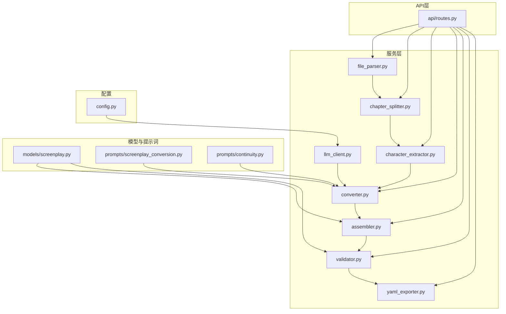

**图表来源**
- [app/services/file_parser.py:1-187](file://app/services/file_parser.py#L1-L187)
- [app/services/chapter_splitter.py:1-163](file://app/services/chapter_splitter.py#L1-L163)
- [app/services/character_extractor.py:1-213](file://app/services/character_extractor.py#L1-L213)
- [app/services/llm_client.py:1-103](file://app/services/llm_client.py#L1-L103)
- [app/services/converter.py:1-262](file://app/services/converter.py#L1-L262)
- [app/services/assembler.py:1-101](file://app/services/assembler.py#L1-L101)
- [app/services/validator.py:1-111](file://app/services/validator.py#L1-L111)
- [app/services/yaml_exporter.py:1-57](file://app/services/yaml_exporter.py#L1-L57)
- [app/models/screenplay.py:1-167](file://app/models/screenplay.py#L1-L167)
- [app/prompts/screenplay_conversion.py:1-91](file://app/prompts/screenplay_conversion.py#L1-L91)
- [app/prompts/continuity.py:1-20](file://app/prompts/continuity.py#L1-L20)
- [app/api/routes.py:1-857](file://app/api/routes.py#L1-L857)
- [app/config.py:1-45](file://app/config.py#L1-L45)

**章节来源**
- [app/services/file_parser.py:1-187](file://app/services/file_parser.py#L1-L187)
- [app/services/chapter_splitter.py:1-163](file://app/services/chapter_splitter.py#L1-L163)
- [app/services/character_extractor.py:1-213](file://app/services/character_extractor.py#L1-L213)
- [app/services/llm_client.py:1-103](file://app/services/llm_client.py#L1-L103)
- [app/services/converter.py:1-262](file://app/services/converter.py#L1-L262)
- [app/services/assembler.py:1-101](file://app/services/assembler.py#L1-L101)
- [app/services/validator.py:1-111](file://app/services/validator.py#L1-L111)
- [app/services/yaml_exporter.py:1-57](file://app/services/yaml_exporter.py#L1-L57)
- [app/models/screenplay.py:1-167](file://app/models/screenplay.py#L1-L167)
- [app/prompts/screenplay_conversion.py:1-91](file://app/prompts/screenplay_conversion.py#L1-L91)
- [app/prompts/continuity.py:1-20](file://app/prompts/continuity.py#L1-L20)
- [app/api/routes.py:1-857](file://app/api/routes.py#L1-L857)
- [app/config.py:1-45](file://app/config.py#L1-L45)

## 核心组件
- 文件处理服务（file_parser）
  - 支持 txt、md、docx、pdf 多格式；自动尝试多种编码；Markdown 清洗；DOCX/ PDF 使用第三方库提取文本；统一后处理规范化空白与标点。
- 章节分割服务（chapter_splitter）
  - 正则模式优先识别中英文章节标题；不足两条时采用基于段落的启发式等分；保证段落边界与字数目标（约 3–5k 字/段）。
- 角色提取服务（character_extractor）
  - 基于LLM的角色提取与合并；使用_slug函数生成规范化的角色ID；合并同名角色与别名；构建角色ID映射表用于后续转换。
- LLM 客户端服务（llm_client）
  - 基于 OpenAI 兼容接口的异步客户端；支持结构化 JSON 输出；指数退避重试；可注入温度与最大输出长度。
- 转换引擎（converter）
  - 将章节转换为场景元素；通过"前一章摘要"维持连续性；对超长章节截断以控制令牌预算；失败时降级生成最小化场景；支持角色ID规范化。
- 剧本组装服务（assembler）
  - 合并各章节结果为完整剧本文本；全局重编号；补全 characters_present；设置角色首次出场。
- 数据验证服务（validator）
  - 结构完整性校验：元数据必填、编号连续、每幕至少一场、每场至少一个元素；角色引用一致性；错误/警告分级（现为warning级别）。
- YAML 导出服务（yaml_exporter）
  - 使用 ruamel.yaml 输出带注释、块风格、Unicode 支持的 YAML；包含生成时间戳与版本信息。
- 自动修复服务（集成在API层）
  - 在验证失败时自动尝试修复，最多2次尝试；使用LLM生成修复后的YAML内容。

**章节来源**
- [app/services/file_parser.py:16-187](file://app/services/file_parser.py#L16-L187)
- [app/services/chapter_splitter.py:42-163](file://app/services/chapter_splitter.py#L42-L163)
- [app/services/character_extractor.py:21-213](file://app/services/character_extractor.py#L21-L213)
- [app/services/llm_client.py:18-103](file://app/services/llm_client.py#L18-L103)
- [app/services/converter.py:36-262](file://app/services/converter.py#L36-L262)
- [app/services/assembler.py:18-101](file://app/services/assembler.py#L18-L101)
- [app/services/validator.py:11-111](file://app/services/validator.py#L11-L111)
- [app/services/yaml_exporter.py:14-57](file://app/services/yaml_exporter.py#L14-L57)
- [app/api/routes.py:774-843](file://app/api/routes.py#L774-L843)

## 架构总览
下图展示从输入文件到最终 YAML 的端到端流程与服务交互：

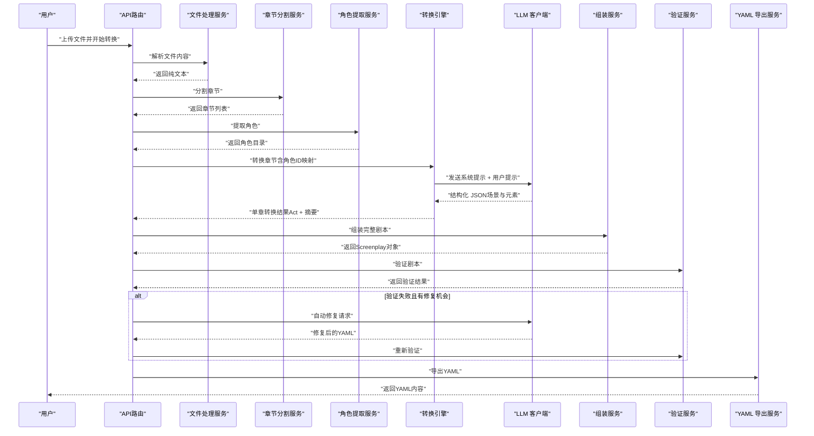

**图表来源**
- [app/api/routes.py:604-857](file://app/api/routes.py#L604-L857)
- [app/services/file_parser.py:16-57](file://app/services/file_parser.py#L16-L57)
- [app/services/chapter_splitter.py:42-64](file://app/services/chapter_splitter.py#L42-L64)
- [app/services/character_extractor.py:21-75](file://app/services/character_extractor.py#L21-L75)
- [app/services/converter.py:37-103](file://app/services/converter.py#L37-L103)
- [app/services/llm_client.py:33-87](file://app/services/llm_client.py#L33-L87)
- [app/services/assembler.py:18-51](file://app/services/assembler.py#L18-L51)
- [app/services/validator.py:11-111](file://app/services/validator.py#L11-L111)
- [app/services/yaml_exporter.py:14-57](file://app/services/yaml_exporter.py#L14-L57)

## 详细组件分析

### 文件处理服务（file_parser）
- 多格式支持
  - txt：尝试 utf-8-sig、utf-8、gbk、gb2312、latin-1；任一成功即返回。
  - md：先读取，再用正则清洗 HTML、图片、链接、粗体/斜体、删除线、行内代码、标题、水平线、引用等标记，仅保留纯文本。
  - docx：使用 python-docx 读取段落与表格内容，合并为文本。
  - pdf：使用 pdfplumber 打开并逐页提取文本，拼接；空页或无法提取时报错。
- 编码与后处理
  - 统一 NFC 规范化；替换智能引号；压缩多余空行；去除行尾空白；去首尾空白。
- 类型检测与词数统计
  - 基于扩展名映射；CJK 单字符计数 + 英文单词计数。

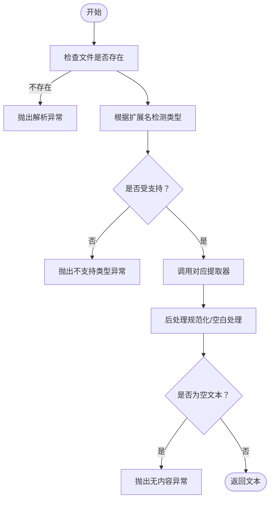

**图表来源**
- [app/services/file_parser.py:16-57](file://app/services/file_parser.py#L16-L57)
- [app/services/file_parser.py:59-161](file://app/services/file_parser.py#L59-L161)

**章节来源**
- [app/services/file_parser.py:16-187](file://app/services/file_parser.py#L16-L187)
- [tests/test_file_parser.py:1-102](file://tests/test_file_parser.py#L1-L102)

### 章节分割服务（chapter_splitter）
- 两阶段策略
  - 正则检测：匹配英文"Chapter/Part/Book"、中文"第X章/回/卷/集/篇"、带顿号的中文序号、Markdown 标题等；若找到≥2个标题即按匹配位置切分。
  - 启发式切分：若正则未检测到足够标题，则按段落边界进行等分；目标每段约 3–5k 字；最少 3 段；最多 30 段。
- 关键算法
  - 基于段落的均匀分配，累计字符数接近目标即切分一次，最后剩余段落并入最后一段。

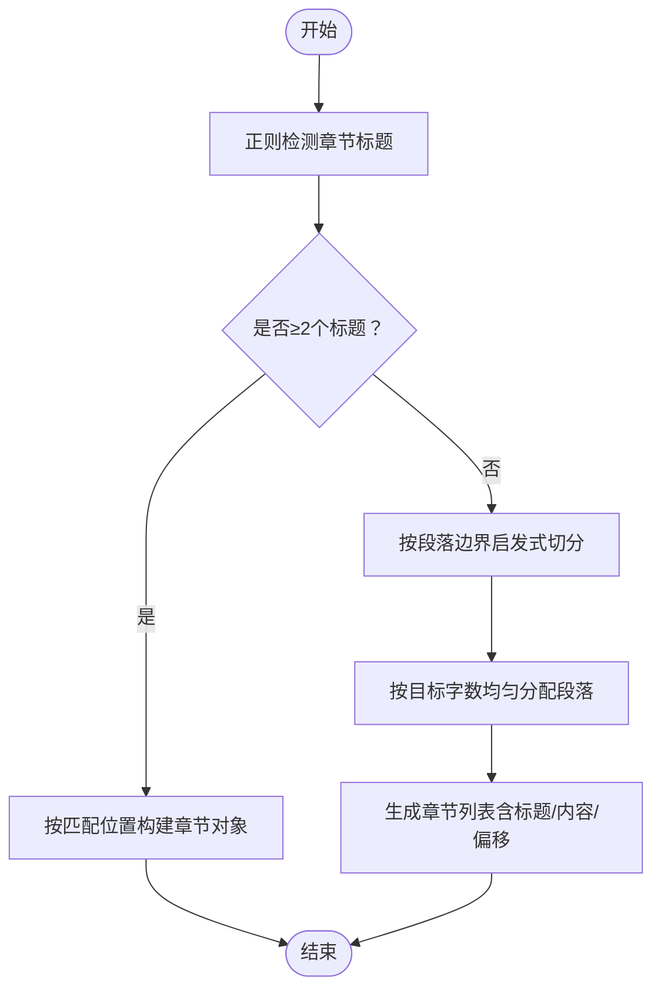

**图表来源**
- [app/services/chapter_splitter.py:42-64](file://app/services/chapter_splitter.py#L42-L64)
- [app/services/chapter_splitter.py:99-135](file://app/services/chapter_splitter.py#L99-L135)
- [app/services/chapter_splitter.py:137-163](file://app/services/chapter_splitter.py#L137-L163)

**章节来源**
- [app/services/chapter_splitter.py:1-163](file://app/services/chapter_splitter.py#L1-L163)
- [tests/test_chapter_splitter.py:1-68](file://tests/test_chapter_splitter.py#L1-L68)

### 角色提取服务（character_extractor）
- 角色提取策略
  - 从样本章节中提取角色信息；对于长小说，选择前3章、中间章节和最后一章进行抽样；每章截断8000字符以控制令牌预算。
  - 使用LLM生成角色目录，包含角色ID、姓名、别名、角色类型、描述等信息。
- 角色ID规范化与合并
  - 使用_slug函数将角色ID转换为小写连字符格式；合并同名角色与别名；构建角色ID映射表用于后续转换。
  - 支持中文姓名的ID生成，确保角色ID的唯一性和可读性。
- 回退机制
  - 如果LLM提取失败，使用占位符角色"Narrator"作为回退方案。

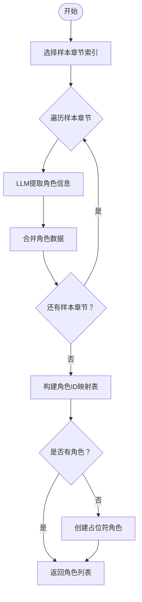

**图表来源**
- [app/services/character_extractor.py:21-75](file://app/services/character_extractor.py#L21-L75)
- [app/services/character_extractor.py:95-167](file://app/services/character_extractor.py#L95-L167)
- [app/services/character_extractor.py:207-212](file://app/services/character_extractor.py#L207-L212)

**章节来源**
- [app/services/character_extractor.py:1-213](file://app/services/character_extractor.py#L1-L213)

### LLM 客户端服务（llm_client）
- 异步与结构化输出
  - 使用 AsyncOpenAI；支持 response_format=json_object；可指定温度与最大输出长度。
- 重试机制
  - 最多重试 3 次；指数退避等待；记录警告日志；最终失败抛出运行时错误。
- 生命周期管理
  - 提供 close 方法用于关闭底层 HTTP 客户端。

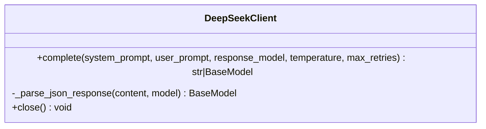

**图表来源**
- [app/services/llm_client.py:18-103](file://app/services/llm_client.py#L18-L103)

**章节来源**
- [app/services/llm_client.py:1-103](file://app/services/llm_client.py#L1-L103)
- [app/config.py:18-32](file://app/config.py#L18-L32)

### 转换引擎（converter）
- 连续性上下文
  - ConversionContext 维护"上一场景摘要""全局场景号""当前幕号"，用于跨章节连续性保持。
- 章节转换
  - 对超长章节截断（约 12k 字），避免超出令牌预算；构造用户提示（包含角色目录、上文摘要、章节编号/标题、章节文本）；调用 LLM 返回结构化 JSON；解析为 Act/Scene/Elements。
- 角色ID规范化
  - 在解析场景元素时使用_character_id_map进行角色ID规范化；支持直接匹配和大小写不敏感匹配。
- 连续性摘要
  - 从生成的场景中抽取前几个元素的摘要，构造"两句话"的连续性总结；失败时回退至最后场景地点描述。
- 降级策略
  - LLM 失败时生成最小化 Act（单场景，动作元素说明失败原因）。

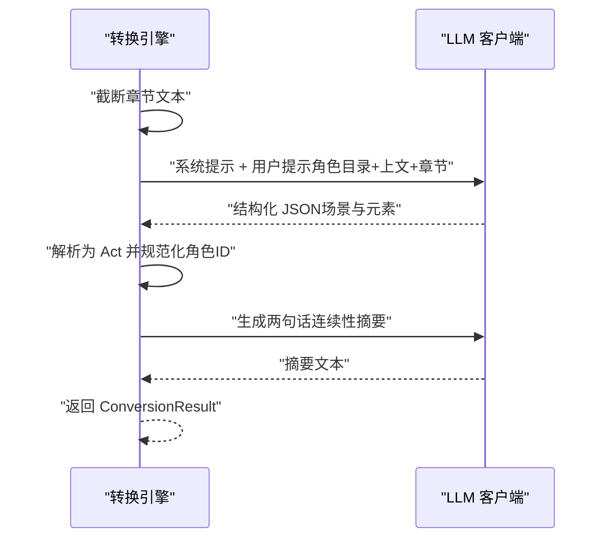

**图表来源**
- [app/services/converter.py:37-103](file://app/services/converter.py#L37-L103)
- [app/services/converter.py:129-201](file://app/services/converter.py#L129-L201)
- [app/services/converter.py:230-262](file://app/services/converter.py#L230-L262)
- [app/prompts/screenplay_conversion.py:1-91](file://app/prompts/screenplay_conversion.py#L1-L91)
- [app/prompts/continuity.py:1-20](file://app/prompts/continuity.py#L1-L20)

**章节来源**
- [app/services/converter.py:1-262](file://app/services/converter.py#L1-L262)
- [app/prompts/screenplay_conversion.py:1-91](file://app/prompts/screenplay_conversion.py#L1-L91)
- [app/prompts/continuity.py:1-20](file://app/prompts/continuity.py#L1-L20)

### 剧本组装服务（assembler）
- 全局重编号
  - 重新编号 Acts 与 Scenes，确保顺序连续。
- 角色出场信息补全
  - 若场景未提供 characters_present，则扫描对话元素提取；并对非法 ID 进行过滤。
- 首次出场设置
  - 遍历场景，记录角色最早出现的场景 ID 并写入 Character.first_appearance。

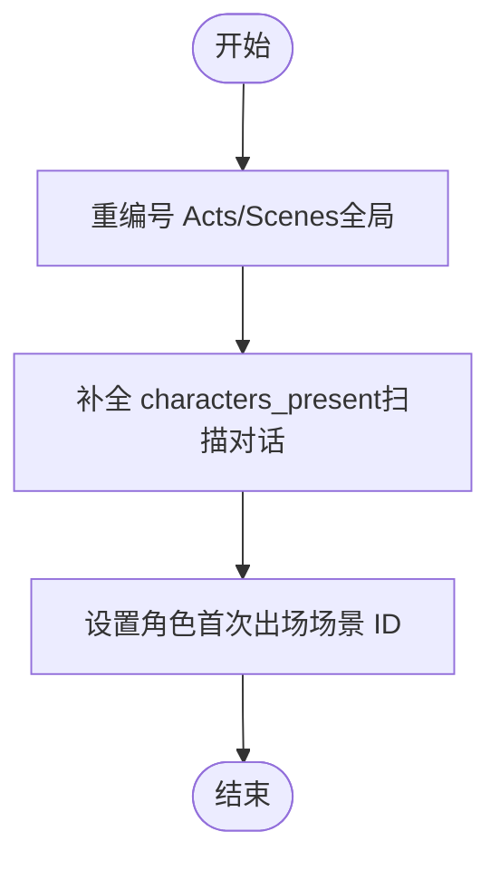

**图表来源**
- [app/services/assembler.py:18-51](file://app/services/assembler.py#L18-L51)
- [app/services/assembler.py:53-101](file://app/services/assembler.py#L53-L101)

**章节来源**
- [app/services/assembler.py:1-101](file://app/services/assembler.py#L1-L101)
- [tests/test_assembler.py:1-111](file://tests/test_assembler.py#L1-L111)

### 数据验证服务（validator）
- 校验项
  - 元数据必填（如标题）；至少一个 Act；Act 编号连续；每 Act 至少一个 Scene；每 Scene 至少一个元素；角色引用一致性（对话/Parenthetical 中的 character_id 必须存在于角色目录）。
- 输出
  - 返回 ValidationIssue 列表，包含严重级别、路径与消息；日志记录错误/警告数量。
- **更新** 警告级别调整
  - 现在使用"warning"级别而非之前的"error"级别，提高了容错性。

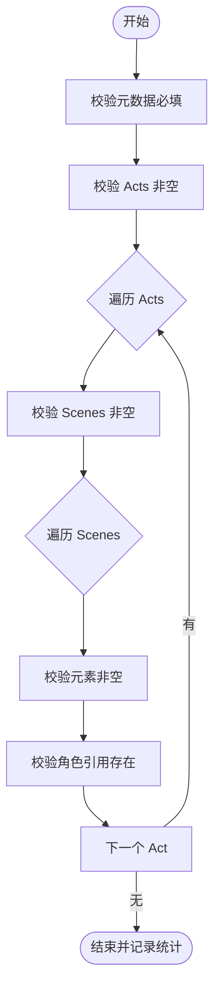

**图表来源**
- [app/services/validator.py:11-111](file://app/services/validator.py#L11-L111)

**章节来源**
- [app/services/validator.py:1-111](file://app/services/validator.py#L1-L111)
- [tests/test_validator.py:1-63](file://tests/test_validator.py#L1-L63)

### YAML 导出服务（yaml_exporter）
- 输出特性
  - 使用 ruamel.yaml：块风格、保留插入顺序、Unicode 支持、缩进与宽度控制；在顶部添加注释头（版本、生成时间、文档链接）。
- 数据准备
  - 将 Pydantic 模型转为字典（排除 None），包裹顶层键 screenplay，再序列化为字符串。

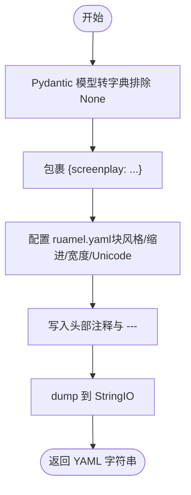

**图表来源**
- [app/services/yaml_exporter.py:14-57](file://app/services/yaml_exporter.py#L14-L57)

**章节来源**
- [app/services/yaml_exporter.py:1-57](file://app/services/yaml_exporter.py#L1-L57)

### 自动修复服务（集成在API层）
- 自动修复机制
  - 在验证失败时自动尝试修复，最多2次尝试；使用LLM生成修复后的YAML内容。
- 修复流程
  - 格式化验证问题列表；调用LLM生成修复建议；流式显示修复过程；重新解析并验证修复结果。
- 错误处理
  - 修复失败时记录警告并停止自动修复；最终返回修复后的YAML内容。

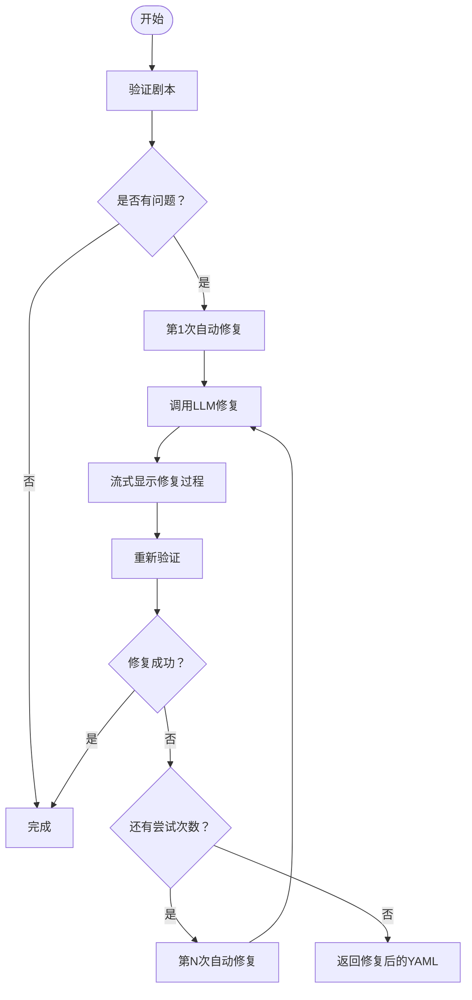

**图表来源**
- [app/api/routes.py:774-843](file://app/api/routes.py#L774-L843)

**章节来源**
- [app/api/routes.py:774-843](file://app/api/routes.py#L774-L843)

## 依赖关系分析
- 内聚与耦合
  - 各服务职责清晰：解析、切分、角色提取、调用 LLM、转换、组装、校验、导出。
  - 耦合点主要在：
    - converter 依赖 llm_client、chapter_splitter、prompts
    - character_extractor 依赖 llm_client、chapter_splitter、prompts
    - assembler 依赖 models.screenplay 与 converter 的 ConversionResult
    - validator 依赖 models.screenplay
    - yaml_exporter 依赖 models.screenplay
    - file_parser 与 chapter_splitter 之间通过字符串文本传递
    - API层协调所有服务的调用顺序
- 外部依赖
  - LLM 客户端依赖 openai 异步接口与配置；docx/pdf 解析依赖第三方库；ruamel.yaml 用于 YAML 序列化。

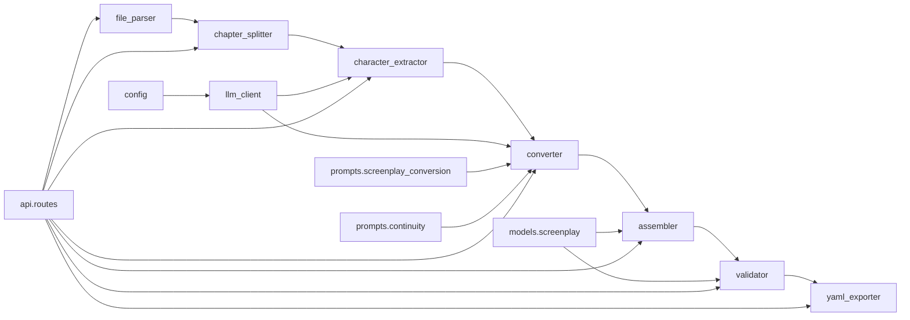

**图表来源**
- [app/services/converter.py:1-12](file://app/services/converter.py#L1-L12)
- [app/services/character_extractor.py:1-11](file://app/services/character_extractor.py#L1-L11)
- [app/services/assembler.py:1-14](file://app/services/assembler.py#L1-L14)
- [app/services/validator.py:1-7](file://app/services/validator.py#L1-L7)
- [app/services/yaml_exporter.py:1-10](file://app/services/yaml_exporter.py#L1-L10)
- [app/services/llm_client.py:1-12](file://app/services/llm_client.py#L1-L12)
- [app/prompts/screenplay_conversion.py:1-2](file://app/prompts/screenplay_conversion.py#L1-L2)
- [app/prompts/continuity.py:1-2](file://app/prompts/continuity.py#L1-L2)
- [app/config.py:1-7](file://app/config.py#L1-L7)
- [app/api/routes.py:24-33](file://app/api/routes.py#L24-L33)

**章节来源**
- [app/services/converter.py:1-12](file://app/services/converter.py#L1-L12)
- [app/services/character_extractor.py:1-11](file://app/services/character_extractor.py#L1-L11)
- [app/services/assembler.py:1-14](file://app/services/assembler.py#L1-L14)
- [app/services/validator.py:1-7](file://app/services/validator.py#L1-L7)
- [app/services/yaml_exporter.py:1-10](file://app/services/yaml_exporter.py#L1-L10)
- [app/services/llm_client.py:1-12](file://app/services/llm_client.py#L1-L12)
- [app/prompts/screenplay_conversion.py:1-2](file://app/prompts/screenplay_conversion.py#L1-L2)
- [app/prompts/continuity.py:1-2](file://app/prompts/continuity.py#L1-L2)
- [app/config.py:1-7](file://app/config.py#L1-L7)
- [app/api/routes.py:24-33](file://app/api/routes.py#L24-L33)

## 性能考虑
- 文本预处理
  - file_parser 的编码尝试与正则清洗成本较低；建议在批量任务中缓存已知编码成功的文件以减少重复尝试。
- 章节切分
  - 正则检测复杂度与文本长度线性相关；启发式切分按段落均分，适合大文本快速切分。可考虑对超长文本分块预处理以降低正则压力。
- 角色提取
  - 抽样策略减少了LLM调用次数；每章8000字符截断控制了令牌预算；角色ID映射表避免了重复计算。
- LLM 调用
  - 异步并发调用可提升吞吐；注意控制温度与最大输出长度以稳定令牌消耗。对失败请求采用指数退避，避免雪崩。
- 转换引擎
  - 截断策略避免超长输入；连续性摘要可复用上文以减少重复提示长度。角色ID规范化使用字典查找，时间复杂度O(1)。
- 组装与导出
  - 组装阶段的扫描与重编号为 O(N)；YAML 导出为 I/O 密集，建议流式写入与合理缓冲。
- 自动修复
  - 最多2次尝试避免了无限循环；流式修复过程提供用户体验；修复失败时及时停止。

## 故障排查指南
- 文件解析错误
  - 现象：报"文件未找到/不支持类型/无法解码/无内容"
  - 排查：确认扩展名与类型映射；检查文件编码；确认第三方库安装（docx、pdfplumber）。
- 章节切分异常
  - 现象：未检测到章节或切分不合理
  - 排查：检查章节标题正则是否覆盖目标文本；短文本会触发启发式切分，确认段落边界是否符合预期。
- 角色提取失败
  - 现象：LLM提取角色失败或返回空列表
  - 排查：检查API密钥和模型配置；确认样本章节数量；查看日志中的警告信息。
- LLM 调用失败
  - 现象：异步调用抛出运行时错误
  - 排查：检查 API Key、基础 URL、模型名称、超时与重试次数；查看日志中的警告与退避等待。
- 转换失败降级
  - 现象：章节转换异常但系统仍产出最小化场景
  - 排查：确认提示模板与角色目录；必要时降低温度或缩短输入。
- 角色ID规范化问题
  - 现象：角色ID不一致或引用失败
  - 排查：检查角色ID映射表构建；确认_slug函数的规范化规则；验证角色目录的完整性。
- 组装与验证
  - 现象：编号不连续、角色引用缺失、场景无元素
  - 排查：检查对话元素中的 character_id 是否存在于角色目录；确认 characters_present 是否正确填充；核对 Act/Scene 数量。
- 验证警告级别
  - 现象：验证报告中显示warning而非error
  - 排查：这是预期行为，提高系统容错性；warning级别的问题通常不会阻止转换完成。
- YAML 导出问题
  - 现象：导出格式异常或缺少注释
  - 排查：确认 ruamel.yaml 版本与配置；检查模型字段是否包含 None 导致被排除。
- 自动修复失败
  - 现象：自动修复多次尝试后仍失败
  - 排查：检查修复提示模板；确认YAML格式正确；查看修复过程中的错误信息。

**章节来源**
- [app/services/file_parser.py:11-14](file://app/services/file_parser.py#L11-L14)
- [app/services/chapter_splitter.py:42-64](file://app/services/chapter_splitter.py#L42-L64)
- [app/services/character_extractor.py:52-61](file://app/services/character_extractor.py#L52-L61)
- [app/services/llm_client.py:70-87](file://app/services/llm_client.py#L70-L87)
- [app/services/converter.py:73-85](file://app/services/converter.py#L73-L85)
- [app/services/assembler.py:66-86](file://app/services/assembler.py#L66-L86)
- [app/services/validator.py:84-111](file://app/services/validator.py#L84-L111)
- [app/services/yaml_exporter.py:14-57](file://app/services/yaml_exporter.py#L14-L57)
- [app/api/routes.py:774-843](file://app/api/routes.py#L774-L843)

## 结论
该核心服务模块以清晰的职责划分与稳健的错误处理实现了从多格式文本到结构化剧本的自动化转换。通过正则与启发式相结合的章节切分、角色提取与ID规范化、异步 LLM 调用与连续性摘要、全局编号与角色出场补全、严格的数据验证与格式化 YAML 导出，以及智能的自动修复机制，形成了高可用的转换流水线。最新的改进包括角色ID规范化、验证服务的警告级别调整和自动修复功能，显著提升了系统的鲁棒性和用户体验。建议在生产环境中结合并发与缓存策略进一步优化吞吐与稳定性。

## 附录
- 扩展与自定义建议
  - 新增文件格式：在 file_parser 中新增提取器与类型映射，并补充测试。
  - 自定义章节检测：调整 CHAPTER_PATTERNS 或引入外部规则引擎。
  - LLM 提示优化：针对不同题材定制提示模板与角色目录格式。
  - 角色提取增强：支持更多角色属性（年龄、性别、职业等）。
  - 组装策略扩展：支持按幕/场景维度的注释与交叉引用。
  - 导出格式扩展：增加 JSON/HTML 等其他格式导出服务。
  - 自动修复策略：根据问题类型制定不同的修复策略。
- 测试参考
  - 参考 tests/test_file_parser.py、tests/test_chapter_splitter.py、tests/test_assembler.py、tests/test_validator.py 获取典型用例与断言方式。
- 性能优化建议
  - 实现角色ID映射表的缓存机制
  - 优化LLM调用的批处理策略
  - 添加进度监控和超时控制
  - 实现转换结果的增量保存