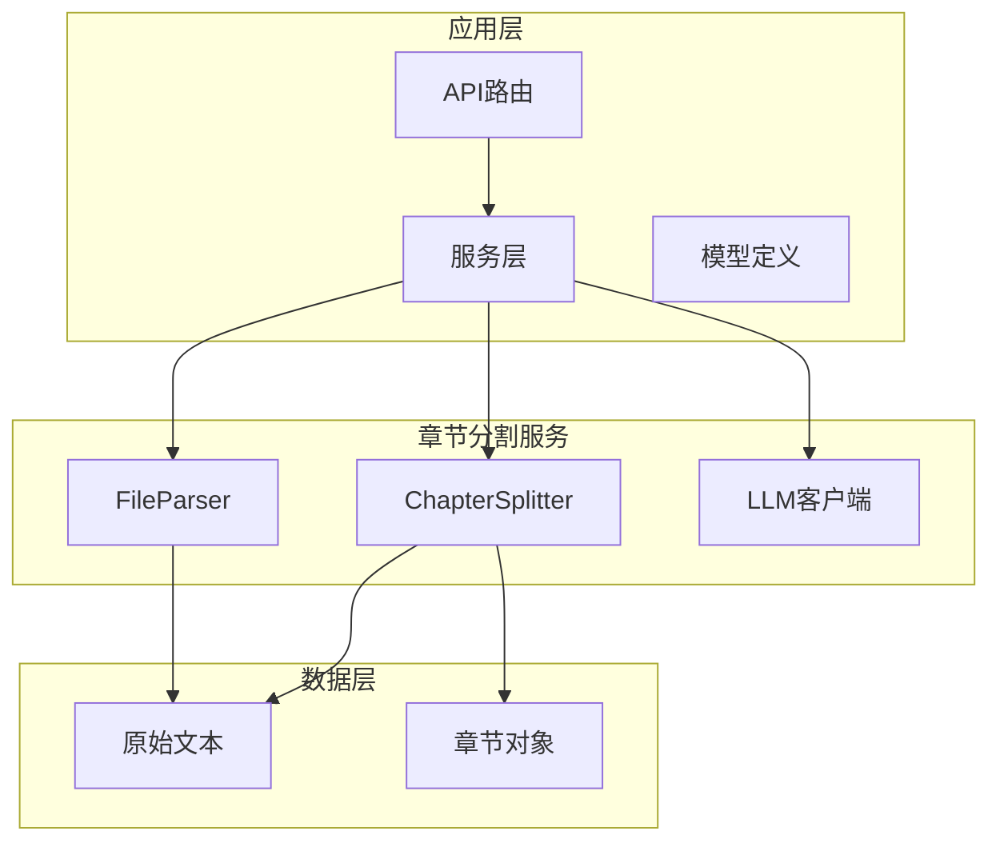
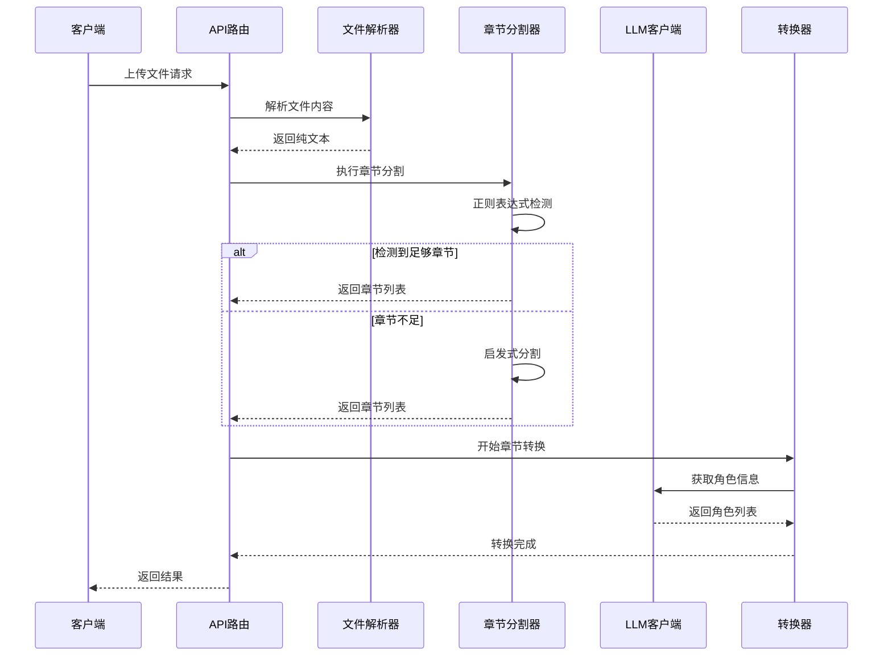
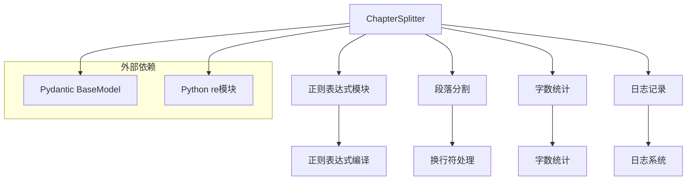

# 章节分割服务

<cite>
**本文档引用的文件**
- [app/services/chapter_splitter.py](file://app/services/chapter_splitter.py)
- [app/prompts/chapter_detection.py](file://app/prompts/chapter_detection.py)
- [app/services/file_parser.py](file://app/services/file_parser.py)
- [app/api/routes.py](file://app/api/routes.py)
- [app/models/requests.py](file://app/models/requests.py)
- [app/models/enums.py](file://app/models/enums.py)
- [app/services/llm_client.py](file://app/services/llm_client.py)
- [tests/test_chapter_splitter.py](file://tests/test_chapter_splitter.py)
- [tests/fixtures/sample_novel.txt](file://tests/fixtures/sample_novel.txt)
- [README.md](file://README.md)
</cite>

## 目录
1. [简介](#简介)
2. [项目结构](#项目结构)
3. [核心组件](#核心组件)
4. [架构概览](#架构概览)
5. [详细组件分析](#详细组件分析)
6. [依赖分析](#依赖分析)
7. [性能考虑](#性能考虑)
8. [故障排除指南](#故障排除指南)
9. [结论](#结论)
10. [附录](#附录)

## 简介

章节分割服务是小说到剧本转换系统中的关键组件，负责将连续的小说文本智能地分割成独立的章节。该服务实现了多层次的检测策略，包括基于正则表达式的章节标题识别、启发式分割算法，以及可选的LLM辅助检测机制。

本服务特别针对中文和英文小说的章节格式进行了优化，能够识别多种章节标题格式，包括传统的"第X章"、"Chapter X"、罗马数字章节标题，以及中文特有的"一、"、"二、"等格式。通过智能的分割算法，确保章节内容的完整性和逻辑连贯性。

## 项目结构

章节分割服务位于应用的服务层，与文件解析、LLM客户端、API路由等组件协同工作。整个项目采用模块化设计，每个功能组件都有明确的职责分工。

**图表来源**
- [app/services/chapter_splitter.py:1-163](file://app/services/chapter_splitter.py#L1-L163)
- [app/api/routes.py:1-313](file://app/api/routes.py#L1-L313)

**章节来源**
- [app/services/chapter_splitter.py:1-163](file://app/services/chapter_splitter.py#L1-L163)
- [app/api/routes.py:1-313](file://app/api/routes.py#L1-L313)

## 核心组件

章节分割服务的核心由以下组件构成：

### Chapter模型
章节分割服务使用Pydantic模型来表示章节信息，包含章节编号、标题、内容和起始字符位置等属性。这个模型确保了数据结构的一致性和类型安全。

### 正则表达式模式集合
服务定义了多个正则表达式模式来识别不同语言和格式的章节标题：
- 英文章节："Chapter"、"CHAPTER"后跟数字或罗马数字
- 中文章节："第X章"、"第X回"等传统格式
- 数字章节："1."、"2."等编号格式
- Markdown标题：支持Markdown风格的章节标题

### 分割算法
服务实现了两层分割策略：
1. **正则表达式分割**：优先使用预定义的正则表达式模式进行章节检测
2. **启发式分割**：当正则表达式无法检测到足够数量的章节时，使用启发式算法进行分割

**章节来源**
- [app/services/chapter_splitter.py:34-96](file://app/services/chapter_splitter.py#L34-L96)
- [app/services/chapter_splitter.py:16-31](file://app/services/chapter_splitter.py#L16-L31)

## 架构概览

章节分割服务在整个转换管道中扮演着关键角色，它与文件解析、LLM客户端和API路由紧密协作。

**图表来源**
- [app/api/routes.py:219-313](file://app/api/routes.py#L219-L313)
- [app/services/chapter_splitter.py:42-63](file://app/services/chapter_splitter.py#L42-L63)

## 详细组件分析

### 正则表达式章节检测

章节分割服务使用精心设计的正则表达式模式来识别各种格式的章节标题。这些模式经过优化，能够处理不同语言和格式的章节标识符。

#### 英文章节模式
英文章节模式支持多种格式：
- "Chapter 1"、"Chapter One"、"CHAPTER 1"
- "Chapter 1: The Beginning"等带有副标题的格式
- "Part 1"、"Book 1"等部分标识

#### 中文章节模式
中文章节模式专门针对中文小说的特点：
- "第一章"、"第二章"、"第1章"等传统格式
- "一、"、"二、"等中文数字格式
- 支持"章"、"回"、"卷"、"集"、"篇"等不同的章节单位

#### 数字章节模式
数字章节模式用于识别简单的编号格式：
- "1."、"2."等阿拉伯数字编号
- "一二三四五"等中文数字序列

**章节来源**
- [app/services/chapter_splitter.py:16-31](file://app/services/chapter_splitter.py#L16-L31)

### 启发式分割策略

当正则表达式无法有效检测章节时，服务会启用启发式分割策略。这种方法基于文本的自然结构特征进行分割。

#### 段落边界分割
启发式算法首先将文本按段落边界分割，然后根据目标字数分布到各个章节中。这种方法确保分割点位于自然的语义边界上。

#### 字数分布算法
算法计算总字数并确定目标每章节字数，然后将段落均匀分布在各个章节中。对于中文文本，算法会正确处理CJK字符的计数。

#### 章节数量控制
算法会根据文本长度动态调整章节数量，确保每个章节都有足够的内容，同时避免产生过多过小的章节。

**章节来源**
- [app/services/chapter_splitter.py:99-134](file://app/services/chapter_splitter.py#L99-L134)
- [app/services/chapter_splitter.py:137-162](file://app/services/chapter_splitter.py#L137-L162)

### 滑动窗口算法应用

虽然滑动窗口算法主要用于后续的章节转换阶段，但在章节分割过程中也体现了类似的思想。通过维护章节边界的位置信息，确保分割的准确性和完整性。

#### 章节边界跟踪
服务在分割过程中维护每个章节的起始字符位置，这有助于后续处理阶段的精确定位。

#### 内容完整性保证
通过跟踪章节边界，服务确保每个章节的内容都包含完整的段落，避免在句子中间截断。

**章节来源**
- [app/services/chapter_splitter.py:75-96](file://app/services/chapter_splitter.py#L75-L96)

### 章节内容清洗和标准化

章节分割服务不仅负责检测章节边界，还负责对章节内容进行清洗和标准化处理。

#### 标准化处理
服务确保章节标题的标准化格式，移除多余的空白字符和格式标记，保持输出的一致性。

#### 内容保留策略
在分割过程中，服务会保留章节标题行，并将其从正文内容中移除，确保每个章节只包含正文内容。

#### 字符编码处理
服务支持多种字符编码，包括UTF-8、GBK、GB2312等，确保不同编码格式的文本都能正确处理。

**章节来源**
- [app/services/chapter_splitter.py:83-94](file://app/services/chapter_splitter.py#L83-L94)
- [app/services/file_parser.py:146-161](file://app/services/file_parser.py#L146-L161)

## 依赖分析

章节分割服务的依赖关系相对简单，主要依赖于正则表达式处理和文件解析功能。

**图表来源**
- [app/services/chapter_splitter.py:1-163](file://app/services/chapter_splitter.py#L1-L163)

### 内部依赖关系

章节分割服务内部的依赖关系主要体现在函数间的调用关系上：

- `split_chapters`函数作为主入口，协调正则表达式检测和启发式分割
- `_regex_split`函数负责正则表达式模式的匹配
- `_heuristic_split`函数实现启发式分割算法
- `_build_chapters_from_matches`函数构建章节对象

**章节来源**
- [app/services/chapter_splitter.py:42-63](file://app/services/chapter_splitter.py#L42-L63)
- [app/services/chapter_splitter.py:66-72](file://app/services/chapter_splitter.py#L66-L72)
- [app/services/chapter_splitter.py:99-134](file://app/services/chapter_splitter.py#L99-L134)

## 性能考虑

章节分割服务在设计时充分考虑了性能优化，特别是在处理大型文本时的效率问题。

### 时间复杂度分析
- 正则表达式检测：O(n)时间复杂度，其中n是文本长度
- 启发式分割：O(n)时间复杂度，需要遍历所有段落
- 字数统计：O(n)时间复杂度，需要扫描整个文本

### 空间复杂度分析
- 章节对象存储：O(n)空间复杂度
- 正则表达式匹配：通常为O(k)空间复杂度，其中k是匹配数量
- 段落分割：O(n)空间复杂度

### 优化策略

#### 正则表达式优化
服务使用预编译的正则表达式，避免重复编译的开销。同时，正则表达式模式经过精心设计，减少回溯和匹配失败的情况。

#### 内存使用优化
服务采用流式处理方式，避免一次性加载整个文本到内存中。对于大型文件，可以考虑分块处理。

#### 缓存机制
服务使用LRU缓存来存储配置设置，减少重复读取配置文件的开销。

**章节来源**
- [app/services/chapter_splitter.py:16-31](file://app/services/chapter_splitter.py#L16-L31)
- [app/config.py:42-45](file://app/config.py#L42-L45)

## 故障排除指南

章节分割服务提供了完善的错误处理机制，能够处理各种异常情况。

### 常见问题及解决方案

#### 章节检测失败
当正则表达式无法检测到足够的章节时，服务会自动降级到启发式分割。如果文本过短，服务会返回单个章节。

#### 编码问题
服务支持多种编码格式，但如果遇到特殊编码的文件，可能需要手动指定编码格式。

#### 性能问题
对于超大文本，服务可能会消耗较多内存。建议分批处理或增加服务器内存。

### 错误处理机制

#### 异常类型
- `FileParsingError`：文件解析错误
- `RuntimeError`：运行时错误
- `ValueError`：参数验证错误

#### 日志记录
服务使用结构化日志记录，便于问题诊断和性能监控。

#### 重试机制
对于外部依赖（如LLM服务），服务实现了指数退避的重试机制。

**章节来源**
- [app/services/chapter_splitter.py:11-14](file://app/services/chapter_splitter.py#L11-L14)
- [app/services/llm_client.py:80-86](file://app/services/llm_client.py#L80-L86)

## 结论

章节分割服务是一个高度模块化的组件，通过多层次的检测策略确保了章节分割的准确性和鲁棒性。其设计充分考虑了不同语言和格式的需求，能够处理从简单到复杂的各种文本格式。

服务的主要优势包括：
- 支持多种语言和格式的章节标题识别
- 智能的启发式分割算法
- 完善的错误处理和性能优化
- 与整个转换管道的无缝集成

未来可以考虑的功能增强包括：
- 更高级的LLM辅助检测
- 自定义分割规则的支持
- 实时分割质量评估
- 分布式处理能力

## 附录

### API定义

章节分割服务通过API路由集成到整个转换系统中，提供统一的接口来启动转换任务。

#### 转换状态模型
服务使用`ConversionStatus`模型来跟踪转换进度，包含作业ID、当前阶段、进度百分比等信息。

#### 章节模型
`Chapter`模型定义了章节的基本属性，包括编号、标题、内容和起始字符位置。

**章节来源**
- [app/models/requests.py:14-22](file://app/models/requests.py#L14-L22)
- [app/models/requests.py:31-36](file://app/models/requests.py#L31-L36)
- [app/models/enums.py:72-83](file://app/models/enums.py#L72-L83)

### 测试覆盖

章节分割服务具有完善的测试套件，涵盖了各种使用场景和边界条件。

#### 单元测试
测试包括英文章节、中文章节、罗马数字章节等多种格式的识别测试。

#### 集成测试
测试验证了分割算法在不同文本长度和格式下的表现。

#### 边界条件测试
测试覆盖了空文本、极短文本、格式不规范文本等边界情况。

**章节来源**
- [tests/test_chapter_splitter.py:8-68](file://tests/test_chapter_splitter.py#L8-L68)

### 配置选项

章节分割服务的配置选项相对简单，主要涉及LLM相关的参数设置。

#### LLM参数
- `max_tokens_per_chunk`: 每个处理块的最大令牌数
- `max_output_tokens`: 最大输出令牌数
- `llm_temperature`: 生成温度参数

#### 文件处理参数
- `max_upload_size_mb`: 最大上传文件大小
- `data_dir`: 数据目录路径

**章节来源**
- [app/config.py:27-31](file://app/config.py#L27-L31)
- [app/config.py:24-25](file://app/config.py#L24-L25)