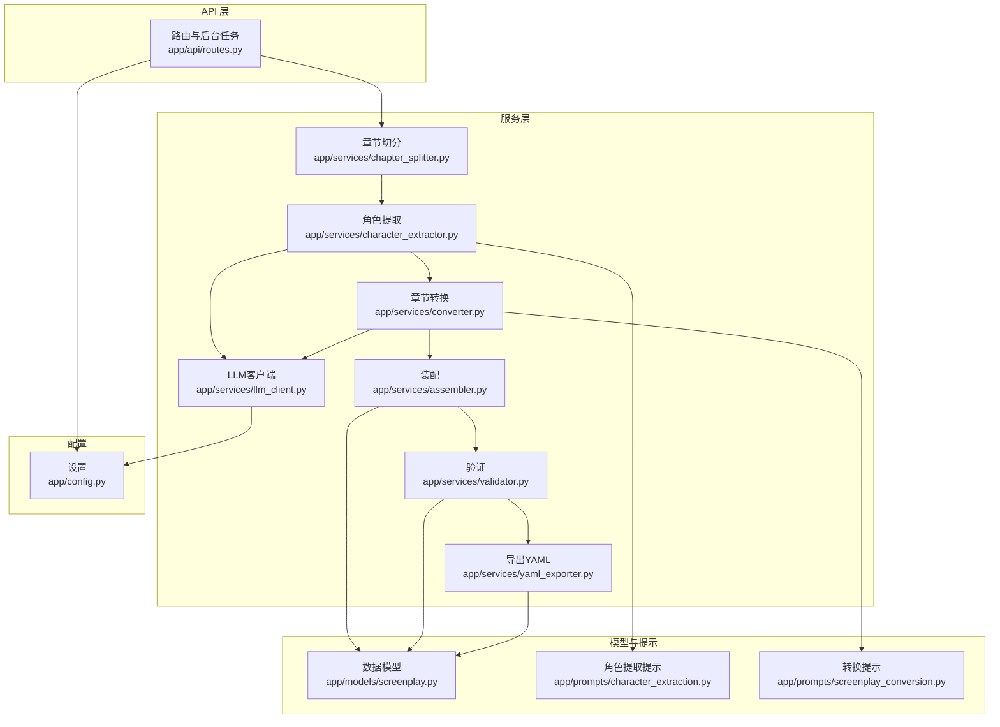
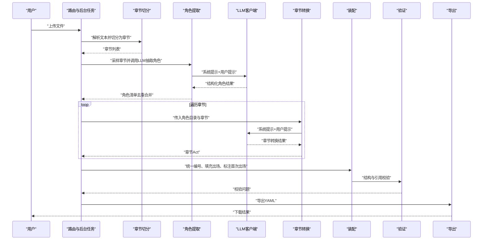
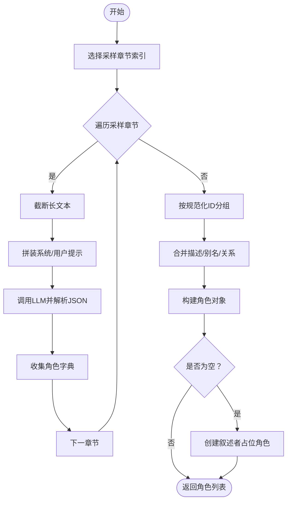
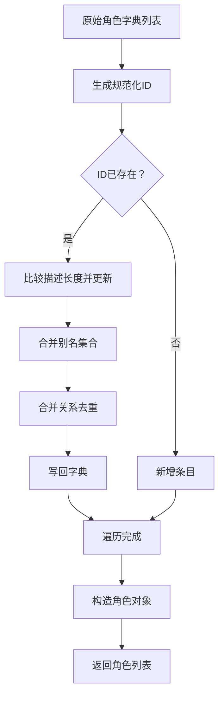
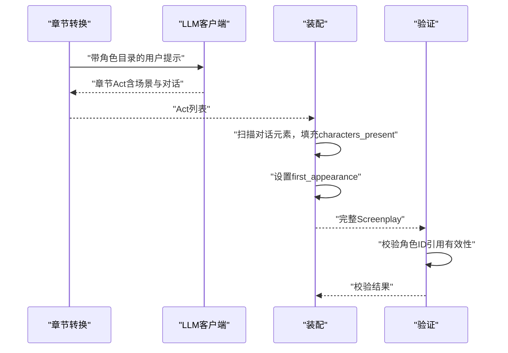
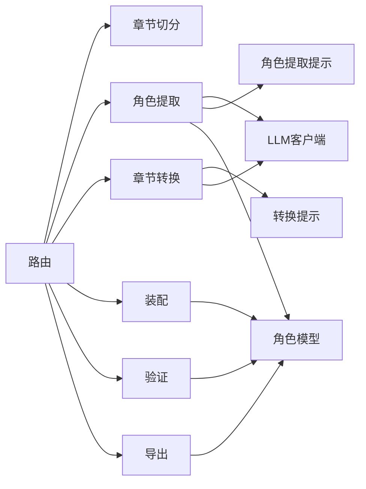

# 角色提取服务

<cite>
**本文档引用的文件**
- [app/services/character_extractor.py](file://app/services/character_extractor.py)
- [app/prompts/character_extraction.py](file://app/prompts/character_extraction.py)
- [app/models/screenplay.py](file://app/models/screenplay.py)
- [app/services/llm_client.py](file://app/services/llm_client.py)
- [app/api/routes.py](file://app/api/routes.py)
- [app/config.py](file://app/config.py)
- [app/services/assembler.py](file://app/services/assembler.py)
- [app/services/converter.py](file://app/services/converter.py)
- [app/prompts/screenplay_conversion.py](file://app/prompts/screenplay_conversion.py)
- [app/services/chapter_splitter.py](file://app/services/chapter_splitter.py)
- [app/services/validator.py](file://app/services/validator.py)
- [app/services/yaml_exporter.py](file://app/services/yaml_exporter.py)
- [app/models/requests.py](file://app/models/requests.py)
- [app/models/enums.py](file://app/models/enums.py)
- [app/main.py](file://app/main.py)
</cite>

## 目录
1. [简介](#简介)
2. [项目结构](#项目结构)
3. [核心组件](#核心组件)
4. [架构总览](#架构总览)
5. [详细组件分析](#详细组件分析)
6. [依赖关系分析](#依赖关系分析)
7. [性能考虑](#性能考虑)
8. [故障排查指南](#故障排查指南)
9. [结论](#结论)
10. [附录](#附录)

## 简介
本文件面向“角色提取服务”，系统化阐述基于大语言模型（LLM）的角色信息抽取与处理流程，覆盖提示工程设计、角色去重与合并、角色关系建模、标准化处理、质量评估与人工校验、与转换引擎的角色引用匹配机制，以及规则扩展与性能优化建议。该服务是“小说转剧本”工具链中的关键环节，负责从章节文本中抽取角色清单，并为后续的剧本转换提供角色目录与关系基础。

## 项目结构
该项目采用分层与功能模块化组织方式：
- API 层：提供上传、转换、状态查询等接口，调度后台任务执行完整流水线。
- 服务层：包含章节切分、角色提取、转换、装配、验证、导出等独立服务。
- 模型层：使用 Pydantic 定义 YAML 结构化的数据模型，确保一致性与可验证性。
- 提示词层：为角色提取与剧本转换分别提供系统提示与用户提示模板。
- 配置层：集中管理 LLM 与应用参数。

图表来源
- [app/api/routes.py:209-313](file://app/api/routes.py#L209-L313)
- [app/services/chapter_splitter.py:42-64](file://app/services/chapter_splitter.py#L42-L64)
- [app/services/character_extractor.py:21-76](file://app/services/character_extractor.py#L21-L76)
- [app/services/converter.py:36-85](file://app/services/converter.py#L36-L85)
- [app/services/assembler.py:18-51](file://app/services/assembler.py#L18-L51)
- [app/services/validator.py:11-111](file://app/services/validator.py#L11-L111)
- [app/services/yaml_exporter.py:14-57](file://app/services/yaml_exporter.py#L14-L57)
- [app/services/llm_client.py:18-103](file://app/services/llm_client.py#L18-L103)
- [app/models/screenplay.py:50-62](file://app/models/screenplay.py#L50-L62)
- [app/prompts/character_extraction.py:3-47](file://app/prompts/character_extraction.py#L3-L47)
- [app/prompts/screenplay_conversion.py:3-91](file://app/prompts/screenplay_conversion.py#L3-L91)
- [app/config.py:9-45](file://app/config.py#L9-L45)

章节来源
- [app/main.py:14-46](file://app/main.py#L14-L46)
- [app/api/routes.py:209-313](file://app/api/routes.py#L209-L313)

## 核心组件
- 角色提取服务：从多章节采样文本中抽取角色清单，进行去重与合并，生成标准化角色对象。
- LLM 客户端：封装 DeepSeek API（OpenAI 兼容），支持结构化解析、重试与超时控制。
- 提示词模板：为角色提取与剧本转换提供明确的输出结构约束与上下文引导。
- 数据模型：以 Pydantic 模型定义角色、关系、场景等结构，确保后续转换与验证一致。
- 章节切分：基于正则与启发式策略将长文本拆分为章节，保障角色提取的代表性与稳定性。
- 装配与验证：在转换完成后统一遍历编号、填充出场角色、标注首次出场，并进行交叉引用校验。
- 导出：将最终剧本序列化为 YAML 字符串，保留注释与顺序。

章节来源
- [app/services/character_extractor.py:21-154](file://app/services/character_extractor.py#L21-L154)
- [app/services/llm_client.py:18-103](file://app/services/llm_client.py#L18-L103)
- [app/prompts/character_extraction.py:3-47](file://app/prompts/character_extraction.py#L3-L47)
- [app/models/screenplay.py:50-62](file://app/models/screenplay.py#L50-L62)
- [app/services/chapter_splitter.py:42-163](file://app/services/chapter_splitter.py#L42-L163)
- [app/services/assembler.py:18-101](file://app/services/assembler.py#L18-L101)
- [app/services/validator.py:11-111](file://app/services/validator.py#L11-L111)
- [app/services/yaml_exporter.py:14-57](file://app/services/yaml_exporter.py#L14-L57)

## 架构总览
角色提取服务位于“上传—切分—角色提取—转换—装配—验证—导出”的流水线中，作为第3步的关键节点，其输入为章节列表，输出为角色清单；随后由转换服务消费角色目录，生成每章的场景与对话，并在装配阶段统一编号与出场信息。

图表来源
- [app/api/routes.py:219-313](file://app/api/routes.py#L219-L313)
- [app/services/character_extractor.py:21-76](file://app/services/character_extractor.py#L21-L76)
- [app/services/llm_client.py:33-87](file://app/services/llm_client.py#L33-L87)
- [app/services/converter.py:36-85](file://app/services/converter.py#L36-L85)
- [app/services/assembler.py:18-51](file://app/services/assembler.py#L18-L51)
- [app/services/validator.py:11-111](file://app/services/validator.py#L11-L111)
- [app/services/yaml_exporter.py:14-57](file://app/services/yaml_exporter.py#L14-L57)

## 详细组件分析

### 角色提取服务（Character Extraction）
- 输入：章节列表（Chapter），LLM 客户端。
- 输出：去重合并后的角色列表（Character）。
- 关键流程：
  - 采样策略：对少于等于3章的文本全采样；超过3章时采样前3章及中间与末章，避免长文本的重复与偏差。
  - 文本截断：单章文本超过阈值时截断，保证 Token 预算与稳定性。
  - 提示工程：系统提示明确角色 ID 规范（小写连字符）、角色角色分类、别名与关系抽取要求；用户提示包含章节标题与正文。
  - LLM 调用：结构化 JSON 解析，失败时记录警告并跳过该章。
  - 去重合并：按规范化 ID 分组，优先保留更丰富的描述，合并别名与关系，最后构造角色对象。

图表来源
- [app/services/character_extractor.py:21-154](file://app/services/character_extractor.py#L21-L154)
- [app/prompts/character_extraction.py:3-47](file://app/prompts/character_extraction.py#L3-L47)

章节来源
- [app/services/character_extractor.py:21-154](file://app/services/character_extractor.py#L21-L154)
- [app/prompts/character_extraction.py:3-47](file://app/prompts/character_extraction.py#L3-L47)

### 提示工程设计（角色名称识别与上下文分析）
- 系统提示要点：
  - 明确输出结构与字段，包括角色 ID、显示名、别名、角色类型、描述、年龄范围、性别、职业、关系列表。
  - 强制角色 ID 使用小写连字符的 slug 规范，便于跨模块稳定引用。
  - 要求从上下文推断关系，即使未直接命名。
  - 要求对角色进行角色分类（主角、反派、配角、次要、额外）。
- 用户提示要点：
  - 包含章节标题与正文边界标记，减少幻觉。
  - 通过“Return a JSON object with a 'characters' array”明确输出格式。
- 上下文分析：
  - 采样多章节并截断长文本，兼顾代表性与 Token 预算。
  - 通过章节标题与正文内容，帮助 LLM 在不同语境下识别同一角色的不同称谓或代词指代。

章节来源
- [app/prompts/character_extraction.py:3-47](file://app/prompts/character_extraction.py#L3-L47)

### 角色去重与合并算法
- 规范化 ID：将名称转为小写、去除多余空白、非字母数字与中文字符替换为连字符，再去除首尾连字符。
- 合并策略：
  - 描述长度优先：保留更长的描述。
  - 别名集合去重并合并。
  - 关系去重：以 (目标ID, 关系类型) 作为键，避免重复关系。
- 异常处理：当角色字典无法构造角色对象时记录警告并跳过。

图表来源
- [app/services/character_extractor.py:95-146](file://app/services/character_extractor.py#L95-L146)
- [app/services/character_extractor.py:148-154](file://app/services/character_extractor.py#L148-L154)

章节来源
- [app/services/character_extractor.py:95-146](file://app/services/character_extractor.py#L95-L146)
- [app/services/character_extractor.py:148-154](file://app/services/character_extractor.py#L148-L154)

### 角色关系建模机制
- 关系数据结构：包含目标角色 ID、关系类型、简要描述。
- 建模流程：
  - LLM 在角色提取阶段直接输出关系列表。
  - 去重合并阶段以 (target_id, type) 为键去重，避免重复关系。
  - 转换阶段通过角色目录字符串与提示词约束，确保关系引用的角色 ID 与角色目录一致。
- 重要性评估：
  - 当前实现未内置关系重要性评分；可在后续扩展中引入基于出现频次、对话权重、场景共现等指标的打分逻辑。

章节来源
- [app/prompts/character_extraction.py:26-32](file://app/prompts/character_extraction.py#L26-L32)
- [app/services/character_extractor.py:117-122](file://app/services/character_extractor.py#L117-L122)
- [app/services/converter.py:87-97](file://app/services/converter.py#L87-L97)

### 角色信息标准化处理
- 称谓统一：通过规范化 ID 与角色目录字符串统一引用；角色目录字符串包含“显示名（aka: 别名）”形式，便于 LLM 识别别名。
- 性别识别：系统提示要求输出性别字段，若 LLM 未识别则保持空值，后续可结合外部知识库或规则进行补全。
- 年龄范围与职业：系统提示要求输出年龄范围与职业，便于角色画像完整化。

章节来源
- [app/prompts/character_extraction.py:23-26](file://app/prompts/character_extraction.py#L23-L26)
- [app/services/converter.py:87-97](file://app/services/converter.py#L87-L97)

### 与转换引擎的角色引用匹配机制
- 角色目录传递：将角色清单格式化为紧凑字符串，随章节转换请求传入，确保 LLM 在转换过程中严格引用角色目录中的 ID。
- 引用校验：装配阶段扫描场景元素，若场景已包含出场角色则校验 ID 是否存在于角色目录；否则从对话元素中提取并校验。
- 首次出场标注：根据最早出现的场景为每个角色设置 first_appearance 字段，便于后续编辑与演员安排。

图表来源
- [app/services/converter.py:87-97](file://app/services/converter.py#L87-L97)
- [app/services/assembler.py:66-101](file://app/services/assembler.py#L66-L101)
- [app/services/validator.py:80-99](file://app/services/validator.py#L80-L99)

章节来源
- [app/services/converter.py:87-97](file://app/services/converter.py#L87-L97)
- [app/services/assembler.py:66-101](file://app/services/assembler.py#L66-L101)
- [app/services/validator.py:80-99](file://app/services/validator.py#L80-L99)

### 角色提取质量评估与人工校验
- 自动评估：
  - 角色数量与分布：统计角色总数、角色类型分布、别名数量。
  - 关系完整性：统计关系总数、重复关系比例、未解析关系数。
  - 引用一致性：校验角色目录与场景/对话引用的一致性。
- 人工校验：
  - 抽样检查：随机抽选若干章节，核对角色 ID、别名、关系与角色描述。
  - 上下文一致性：检查角色在不同章节中的称谓与身份是否前后一致。
  - 关系合理性：人工判断关系类型与描述是否符合文本语义。
- 可视化建议：在前端展示角色目录与关系图谱，辅助编辑校对。

章节来源
- [app/services/validator.py:11-111](file://app/services/validator.py#L11-L111)
- [app/models/screenplay.py:50-62](file://app/models/screenplay.py#L50-L62)

### 规则自定义扩展与性能优化建议
- 规则扩展：
  - 角色 ID 规范：可扩展为支持拼音首字母+数字组合或基于内容指纹的稳定 ID。
  - 关系类型：引入更细粒度的关系类型枚举与权重字段，支持重要性排序。
  - 性别/年龄补全：集成外部知识库或规则引擎，对空缺字段进行自动补全。
- 性能优化：
  - 采样策略：对超长文本增加自适应采样比例，减少不必要的 LLM 调用。
  - 批量与并发：在章节转换阶段引入批处理与并发控制，降低等待时间。
  - 缓存与重用：缓存角色提取结果与常用提示词，减少重复计算。
  - Token 预算：动态调整截断阈值与温度参数，平衡质量与成本。

章节来源
- [app/services/character_extractor.py:78-92](file://app/services/character_extractor.py#L78-L92)
- [app/services/llm_client.py:33-87](file://app/services/llm_client.py#L33-L87)
- [app/config.py:27-31](file://app/config.py#L27-L31)

## 依赖关系分析
- 组件耦合：
  - 角色提取服务依赖 LLM 客户端与提示模板，输出角色模型供转换与装配使用。
  - 转换服务依赖角色目录字符串与提示模板，装配与验证依赖角色模型。
- 外部依赖：
  - LLM API（DeepSeek，OpenAI 兼容）。
  - Pydantic 用于数据模型与校验。
  - ruamel.yaml 用于 YAML 序列化。
- 循环依赖：
  - 未发现循环导入；模块间为单向依赖。

图表来源
- [app/services/character_extractor.py:21-76](file://app/services/character_extractor.py#L21-L76)
- [app/services/llm_client.py:18-103](file://app/services/llm_client.py#L18-L103)
- [app/prompts/character_extraction.py:3-47](file://app/prompts/character_extraction.py#L3-L47)
- [app/prompts/screenplay_conversion.py:3-91](file://app/prompts/screenplay_conversion.py#L3-L91)
- [app/models/screenplay.py:50-62](file://app/models/screenplay.py#L50-L62)
- [app/api/routes.py:219-313](file://app/api/routes.py#L219-L313)

章节来源
- [app/api/routes.py:219-313](file://app/api/routes.py#L219-L313)
- [app/services/character_extractor.py:21-76](file://app/services/character_extractor.py#L21-L76)
- [app/services/llm_client.py:18-103](file://app/services/llm_client.py#L18-L103)
- [app/models/screenplay.py:50-62](file://app/models/screenplay.py#L50-L62)

## 性能考虑
- Token 与成本控制：
  - 控制单章文本长度与采样数量，避免超出最大输出与上下文限制。
  - 动态调整温度与最大输出令牌数，权衡创造性与稳定性。
- 并发与吞吐：
  - 将章节转换改为异步并发执行，结合速率限制与重试策略。
- 缓存与复用：
  - 对常见提示词与角色目录进行缓存，减少重复请求。
- 错误恢复：
  - 单章失败不阻塞整体流程，记录警告并继续处理剩余章节。

章节来源
- [app/services/character_extractor.py:42-61](file://app/services/character_extractor.py#L42-L61)
- [app/services/llm_client.py:70-86](file://app/services/llm_client.py#L70-L86)
- [app/config.py:27-31](file://app/config.py#L27-L31)

## 故障排查指南
- LLM 调用失败：
  - 检查 API Key、Base URL 与超时设置；查看重试日志与错误消息。
  - 适当提高温度或增大最大输出令牌数，改善 JSON 解析稳定性。
- 角色提取异常：
  - 确认提示词模板未被修改；检查章节文本是否过短或包含不可见字符。
  - 若角色为空，确认是否触发了占位角色逻辑。
- 转换后引用缺失：
  - 校验角色目录字符串是否正确传入；检查装配阶段是否正确提取对话中的角色 ID。
- 导出异常：
  - 确认 YAML 配置与 ruamel.yaml 版本兼容；检查编码与宽度设置。

章节来源
- [app/services/llm_client.py:70-86](file://app/services/llm_client.py#L70-L86)
- [app/services/character_extractor.py:63-75](file://app/services/character_extractor.py#L63-L75)
- [app/services/assembler.py:66-86](file://app/services/assembler.py#L66-L86)
- [app/services/yaml_exporter.py:14-57](file://app/services/yaml_exporter.py#L14-L57)

## 结论
角色提取服务通过精心设计的提示工程、稳健的采样与截断策略、严格的去重合并与关系建模，实现了从小说文本到结构化角色目录的高质量抽取。配合转换、装配、验证与导出的完整流水线，为后续的剧本生成提供了可靠的数据基础。未来可在关系重要性评估、规则扩展与性能优化方面持续演进，进一步提升自动化程度与人工校验效率。

## 附录
- 角色模型字段与取值范围参考：
  - 角色 ID：小写连字符 slug。
  - 角色类型：支持多种角色类型枚举。
  - 关系类型：支持多种关系类型枚举。
- 相关枚举类型定义参见相应模型文件。

章节来源
- [app/models/screenplay.py:50-62](file://app/models/screenplay.py#L50-L62)
- [app/models/enums.py:6-13](file://app/models/enums.py#L6-L13)
- [app/models/enums.py:43-55](file://app/models/enums.py#L43-L55)