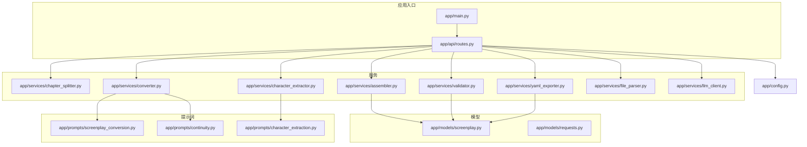
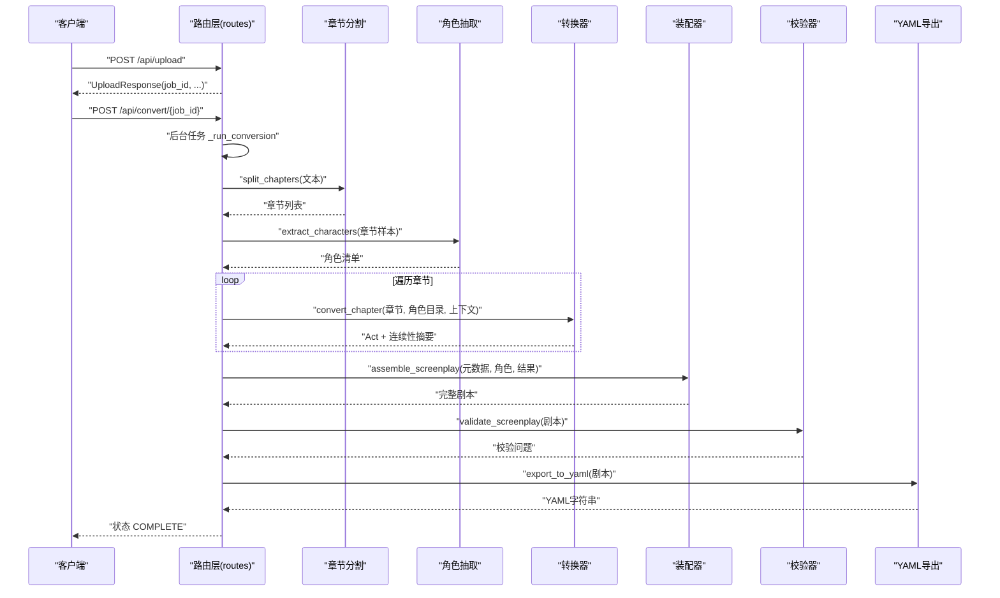
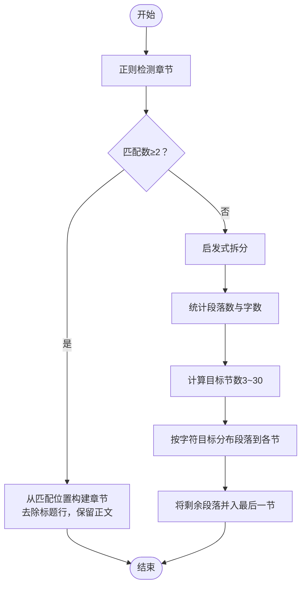
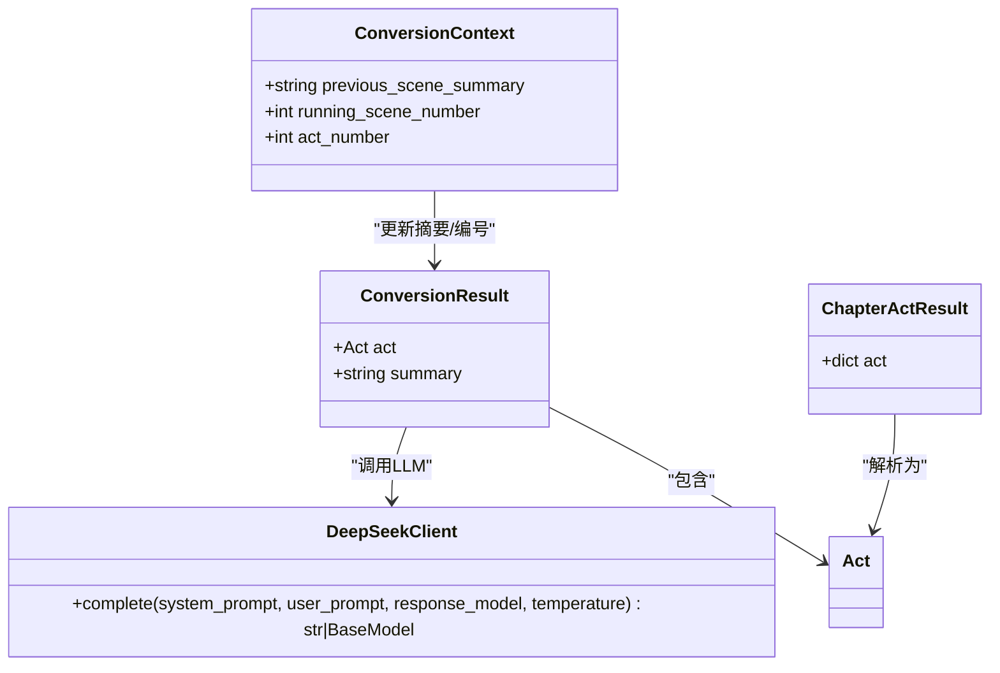
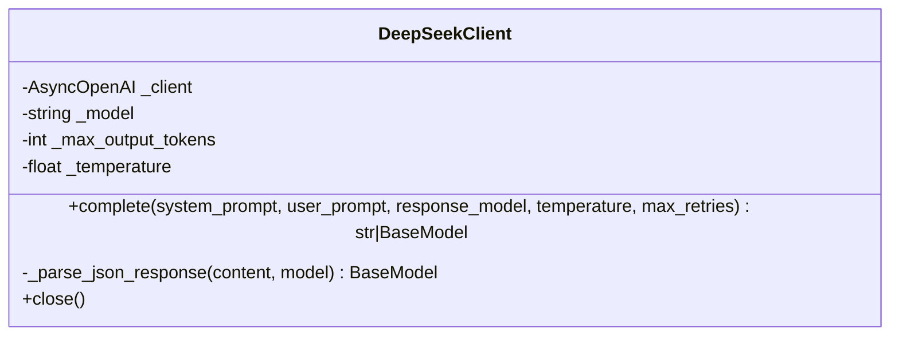
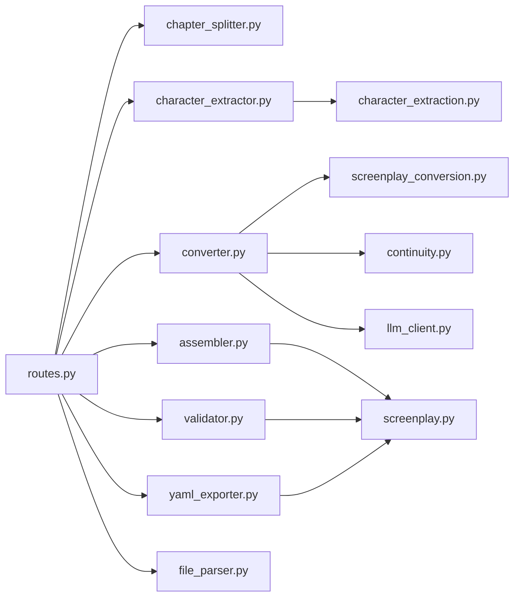

# 转换引擎

<cite>
**本文引用的文件**
- [app/main.py](file://app/main.py)
- [app/api/routes.py](file://app/api/routes.py)
- [app/config.py](file://app/config.py)
- [app/models/screenplay.py](file://app/models/screenplay.py)
- [app/models/requests.py](file://app/models/requests.py)
- [app/services/chapter_splitter.py](file://app/services/chapter_splitter.py)
- [app/services/character_extractor.py](file://app/services/character_extractor.py)
- [app/services/converter.py](file://app/services/converter.py)
- [app/services/assembler.py](file://app/services/assembler.py)
- [app/services/llm_client.py](file://app/services/llm_client.py)
- [app/services/validator.py](file://app/services/validator.py)
- [app/services/yaml_exporter.py](file://app/services/yaml_exporter.py)
- [app/services/file_parser.py](file://app/services/file_parser.py)
- [app/prompts/screenplay_conversion.py](file://app/prompts/screenplay_conversion.py)
- [app/prompts/continuity.py](file://app/prompts/continuity.py)
- [app/prompts/character_extraction.py](file://app/prompts/character_extraction.py)
- [README.md](file://README.md)
- [pyproject.toml](file://pyproject.toml)
</cite>

## 目录
1. [简介](#简介)
2. [项目结构](#项目结构)
3. [核心组件](#核心组件)
4. [架构总览](#架构总览)
5. [详细组件分析](#详细组件分析)
6. [依赖关系分析](#依赖关系分析)
7. [性能考量](#性能考量)
8. [故障排查指南](#故障排查指南)
9. [结论](#结论)
10. [附录](#附录)

## 简介
本项目是一个“小说到剧本”的转换引擎，目标是将小说文本自动转换为结构化的 YAML 剧本。系统采用模块化设计，通过章节分割、角色抽取、逐章转换、装配合并、校验与导出等步骤完成端到端流程。转换过程强调“连续性保持”（通过跨章节上下文摘要）、“元素类型映射”（动作、对白、括号指示、转场、注释）以及“时间线与情节连贯性”的维护。

## 项目结构
- 应用入口与路由：FastAPI 应用、路由定义、静态资源挂载
- 模型层：基于 Pydantic 的 YAML 结构模型（元数据、角色、场景、剧幕、元素）
- 服务层：章节分割、角色抽取、转换器、装配器、LLM 客户端、校验器、YAML 导出器、文件解析器
- 提示词模板：章节转换、连续性摘要、角色抽取
- 配置：应用设置（API Key、模型、超时、分片长度等）

图表来源
- [app/main.py:1-46](file://app/main.py#L1-L46)
- [app/api/routes.py:1-313](file://app/api/routes.py#L1-L313)
- [app/config.py:1-45](file://app/config.py#L1-L45)
- [app/models/screenplay.py:1-167](file://app/models/screenplay.py#L1-L167)
- [app/models/requests.py:1-41](file://app/models/requests.py#L1-L41)
- [app/services/chapter_splitter.py:1-163](file://app/services/chapter_splitter.py#L1-L163)
- [app/services/character_extractor.py:1-154](file://app/services/character_extractor.py#L1-L154)
- [app/services/converter.py:1-218](file://app/services/converter.py#L1-L218)
- [app/services/assembler.py:1-101](file://app/services/assembler.py#L1-L101)
- [app/services/validator.py:1-111](file://app/services/validator.py#L1-L111)
- [app/services/yaml_exporter.py:1-57](file://app/services/yaml_exporter.py#L1-L57)
- [app/services/file_parser.py:1-187](file://app/services/file_parser.py#L1-L187)
- [app/services/llm_client.py:1-103](file://app/services/llm_client.py#L1-L103)
- [app/prompts/screenplay_conversion.py:1-91](file://app/prompts/screenplay_conversion.py#L1-L91)
- [app/prompts/continuity.py:1-20](file://app/prompts/continuity.py#L1-L20)
- [app/prompts/character_extraction.py:1-47](file://app/prompts/character_extraction.py#L1-L47)

章节来源
- [app/main.py:1-46](file://app/main.py#L1-L46)
- [app/api/routes.py:1-313](file://app/api/routes.py#L1-L313)
- [app/config.py:1-45](file://app/config.py#L1-L45)

## 核心组件
- 应用入口与路由：负责启动、CORS、静态资源挂载、路由注册与后台任务调度
- 模型层：定义 YAML 结构的强类型模型，确保输出一致性与可验证性
- 章节分割：两阶段策略（正则检测 + 候选 + 基于段落的启发式拆分），保证最小章节数量与字符偏移记录
- 角色抽取：从样本章节中抽取角色清单，去重与关系合并，生成稳定的角色 ID
- 转换器：逐章转换，使用连续性上下文摘要与角色目录，生成场景与元素；失败时降级
- 装配器：全局编号重排、填充出场角色、设定首次出场场景
- LLM 客户端：统一的异步 OpenAI 兼容客户端，支持结构化 JSON 输出与指数回退
- 校验器：结构完整性检查（元数据、编号、角色引用、场景元素存在性）
- YAML 导出器：格式化输出，保留顺序与注释
- 文件解析器：多格式文本提取与后处理
- 提示词模板：转换、连续性摘要、角色抽取的系统与用户提示

章节来源
- [app/models/screenplay.py:1-167](file://app/models/screenplay.py#L1-L167)
- [app/services/chapter_splitter.py:1-163](file://app/services/chapter_splitter.py#L1-L163)
- [app/services/character_extractor.py:1-154](file://app/services/character_extractor.py#L1-L154)
- [app/services/converter.py:1-218](file://app/services/converter.py#L1-L218)
- [app/services/assembler.py:1-101](file://app/services/assembler.py#L1-L101)
- [app/services/llm_client.py:1-103](file://app/services/llm_client.py#L1-L103)
- [app/services/validator.py:1-111](file://app/services/validator.py#L1-L111)
- [app/services/yaml_exporter.py:1-57](file://app/services/yaml_exporter.py#L1-L57)
- [app/services/file_parser.py:1-187](file://app/services/file_parser.py#L1-L187)
- [app/prompts/screenplay_conversion.py:1-91](file://app/prompts/screenplay_conversion.py#L1-L91)
- [app/prompts/continuity.py:1-20](file://app/prompts/continuity.py#L1-L20)
- [app/prompts/character_extraction.py:1-47](file://app/prompts/character_extraction.py#L1-L47)

## 架构总览
系统采用“流水线式”后台任务执行，按阶段推进：上传解析 → 章节拆分 → 角色抽取 → 逐章转换 → 装配合并 → 校验 → YAML 导出。转换器通过“连续性上下文摘要”维持跨章节时间线与情节连贯性；章节拆分采用正则与启发式双轨策略，避免过短或过长片段影响 LLM 输入预算。

图表来源
- [app/api/routes.py:208-313](file://app/api/routes.py#L208-L313)
- [app/services/chapter_splitter.py:42-63](file://app/services/chapter_splitter.py#L42-L63)
- [app/services/character_extractor.py:21-75](file://app/services/character_extractor.py#L21-L75)
- [app/services/converter.py:36-84](file://app/services/converter.py#L36-L84)
- [app/services/assembler.py:18-50](file://app/services/assembler.py#L18-L50)
- [app/services/validator.py:11-111](file://app/services/validator.py#L11-L111)
- [app/services/yaml_exporter.py:14-57](file://app/services/yaml_exporter.py#L14-L57)

## 详细组件分析

### 章节分割服务（滑动窗口策略与重叠区域）
- 设计理念
  - 优先使用正则表达式识别常见章节标题（英文“Chapter/Part/Book”、中文“第X章/回/卷/集/篇”、Markdown 标题、数字序号等），以提高准确性与稳定性
  - 若正则未检测到足够章节，则回退到“启发式拆分”，按段落边界均匀分配，目标每节约 3000–5000 字，最少 3 节，最多不超过 30 节
  - 记录每个章节的起始字符偏移，便于后续定位与调试
- 实现细节
  - 正则阶段：遍历多个模式匹配，若匹配数 ≥ 2 则构建章节对象（去除标题行，保留正文）
  - 启发式阶段：统计段落数与字数，计算目标节数，按字符目标进行分布，最后将剩余段落并入最后一节
  - 分布函数：累计当前节字符数，达到阈值即切分一次，保留最后一节
- 窗口大小与重叠
  - 当前实现未显式设置“滑动窗口”与“重叠区域”参数；但通过“字符目标分布”与“段落边界”天然形成“近似重叠”效果（段落被分配到最近的目标区间）
  - 若需更严格的滑动窗口控制，可在现有分布逻辑基础上引入“步进窗口”与“重叠百分比”参数

图表来源
- [app/services/chapter_splitter.py:42-163](file://app/services/chapter_splitter.py#L42-L163)

章节来源
- [app/services/chapter_splitter.py:1-163](file://app/services/chapter_splitter.py#L1-L163)

### 角色抽取服务（角色目录与关系映射）
- 流程
  - 选择样本章节（前 3 章 + 中间 + 尾章），避免全量 LLM 调用
  - 对每个样本截断文本长度，发送提示词抽取角色
  - 合并结果：按标准化 ID 分组，保留更丰富的描述，合并别名与关系
  - 生成稳定的角色 ID（slug 化），默认占位角色以防空结果
- 关系映射
  - 支持双向关系去重与补充，关系三元组（目标ID, 类型）作为键去重
  - 角色字段包含：ID、名称、别名、角色定位、描述、年龄范围、性别、职业、关系、备注、首次出场场景

图表来源
- [app/services/character_extractor.py:21-154](file://app/services/character_extractor.py#L21-L154)

章节来源
- [app/services/character_extractor.py:1-154](file://app/services/character_extractor.py#L1-L154)

### 转换器（逐章转换与连续性保持）
- 连续性保持机制
  - 使用“转换上下文”传递上一章场景摘要，作为下一章输入的一部分，确保时间线与情节连贯
  - 每章结束后生成“两句话的连续性摘要”，用于下一轮转换
  - 上下文包含：上一章场景摘要、全局场景编号、当前剧幕编号
- 元素类型映射
  - 动作（action）：呈现时态、重要性（关键/标准/背景）
  - 对话（dialogue）：角色ID、显示名、括号指示、台词、续接标记
  - 括号指示（parenthetical）：插入对话之间的动作/情绪说明
  - 转场（transition）：明确的场景/镜头过渡样式
  - 注释（note）：适配者/编辑说明（不参与渲染）
- 错误处理与降级
  - LLM 转换失败时，生成最小化场景（含降级动作元素），保证流程继续
- 提示词与约束
  - 系统提示强调“展示而非讲述”、“现时态”、“忠实改编”、“场景标题格式”、“对白自然化”
  - 输出严格遵循 JSON 模式，包含剧幕、场景、元素等字段

图表来源
- [app/services/converter.py:16-84](file://app/services/converter.py#L16-L84)
- [app/prompts/screenplay_conversion.py:1-91](file://app/prompts/screenplay_conversion.py#L1-L91)
- [app/prompts/continuity.py:1-20](file://app/prompts/continuity.py#L1-L20)
- [app/services/llm_client.py:18-103](file://app/services/llm_client.py#L18-L103)

章节来源
- [app/services/converter.py:1-218](file://app/services/converter.py#L1-L218)
- [app/prompts/screenplay_conversion.py:1-91](file://app/prompts/screenplay_conversion.py#L1-L91)
- [app/prompts/continuity.py:1-20](file://app/prompts/continuity.py#L1-L20)

### 装配器（全局编号与出场角色）
- 全局编号重排：确保剧幕与场景编号连续且唯一
- 出场角色填充：若 LLM 未提供，则扫描对话元素提取；否则校验 ID 有效性
- 首次出场设定：遍历场景，记录每个角色最早出现的场景 ID

图表来源
- [app/services/assembler.py:18-101](file://app/services/assembler.py#L18-L101)

章节来源
- [app/services/assembler.py:1-101](file://app/services/assembler.py#L1-L101)

### LLM 客户端（结构化输出与重试）
- 统一接口：支持结构化 JSON 输出（通过 response_format），自动去除代码围栏
- 重试策略：指数回退，最多重试若干次
- 参数：模型、温度、最大输出 token、超时

图表来源
- [app/services/llm_client.py:18-103](file://app/services/llm_client.py#L18-L103)

章节来源
- [app/services/llm_client.py:1-103](file://app/services/llm_client.py#L1-L103)

### 校验器与 YAML 导出
- 校验内容：元数据完整性、编号连续性、场景元素存在性、角色引用有效性、出场角色校验
- YAML 导出：保留插入顺序、块风格、Unicode 支持、添加头部注释与时间戳

章节来源
- [app/services/validator.py:1-111](file://app/services/validator.py#L1-L111)
- [app/services/yaml_exporter.py:1-57](file://app/services/yaml_exporter.py#L1-L57)

### 文件解析器与配置
- 文件解析：支持 txt、md、docx、pdf，多编码尝试与后处理（空白规范化、标点处理）
- 配置：API Key、模型、超时、分片长度、输出长度、上传大小限制、数据目录

章节来源
- [app/services/file_parser.py:1-187](file://app/services/file_parser.py#L1-L187)
- [app/config.py:1-45](file://app/config.py#L1-L45)

## 依赖关系分析
- 组件耦合
  - 路由层串联所有服务，形成清晰的管道
  - 转换器依赖章节分割结果与角色目录，同时向装配器输出结构化数据
  - 装配器依赖模型层的结构定义，校验器与导出器均消费模型
- 外部依赖
  - LLM API（DeepSeek，OpenAI 兼容）
  - 第三方解析库（docx、pdfplumber）
  - YAML 渲染（ruamel.yaml）

图表来源
- [app/api/routes.py:15-24](file://app/api/routes.py#L15-L24)
- [app/services/converter.py:8-11](file://app/services/converter.py#L8-L11)
- [app/services/character_extractor.py:9-11](file://app/services/character_extractor.py#L9-L11)
- [app/prompts/screenplay_conversion.py:1-2](file://app/prompts/screenplay_conversion.py#L1-L2)
- [app/prompts/continuity.py:1-2](file://app/prompts/continuity.py#L1-L2)
- [app/prompts/character_extraction.py:1-2](file://app/prompts/character_extraction.py#L1-L2)
- [app/models/screenplay.py:1-5](file://app/models/screenplay.py#L1-L5)

## 性能考量
- 并发与批处理
  - 当前转换流程为顺序执行章节，适合中小规模文本
  - 可通过并发调用章节转换（注意上下文共享与 LLM 速率限制）提升吞吐
- LLM 成本与预算
  - 控制每章输入长度（已做截断）与输出长度（max_output_tokens）
  - 降低温度以减少不确定性带来的重复与修正
- 缓存与复用
  - 角色目录可缓存至会话，避免重复抽取
  - 连续性摘要可用于快速回放，减少重复计算
- I/O 与中间文件
  - 上传与导出路径在数据目录下，建议使用本地 SSD 与合理配额
- 资源限制
  - 上传大小限制、LLM 超时、最大输出 token 数均可在配置中调整

## 故障排查指南
- 常见错误
  - 文件类型不支持或解析失败：检查扩展名与安装依赖（python-docx、pdfplumber）
  - LLM 调用失败：确认 API Key、Base URL、模型名与网络连通性；查看重试日志
  - 角色引用缺失：校验器会报告无效角色 ID；检查角色目录与场景元素中的 character_id
  - 章节过少或过多：正则未识别时回退启发式拆分，检查文本格式与章节标题
- 排查步骤
  - 查看状态流事件（SSE）或 JSON 状态接口，定位卡顿阶段
  - 下载 YAML 预览，核对结构与元素类型
  - 获取校验结果，逐项修复警告与错误
  - 在配置中适当放宽超时与输出长度，观察是否改善

章节来源
- [app/api/routes.py:131-166](file://app/api/routes.py#L131-L166)
- [app/services/validator.py:11-111](file://app/services/validator.py#L11-L111)
- [app/services/llm_client.py:33-86](file://app/services/llm_client.py#L33-L86)

## 结论
该转换引擎通过“章节分割 + 角色抽取 + 逐章转换 + 装配校验 + YAML 导出”的流水线，实现了从小说到剧本的自动化转换。其核心优势在于：
- 明确的连续性保持机制（跨章节摘要）
- 严谨的元素类型映射与结构化输出
- 可靠的错误处理与降级策略
- 可扩展的配置与外部依赖管理

建议在大规模批量处理时引入并发与缓存策略，在复杂文本中增强章节标题识别规则与角色关系抽取的鲁棒性。

## 附录

### 转换质量评估指标与人工校验方法
- 结构完整性
  - 指标：剧幕/场景编号连续性、场景元素存在性、角色引用有效
  - 方法：运行校验器，逐条修复错误与警告
- 内容一致性
  - 指标：角色 ID 一致性、出场顺序与首次出场场景一致
  - 方法：对比装配前后角色 present 与 first_appearance 字段
- 文学质量
  - 指标：对白自然度、动作描述可视化程度、场景节奏
  - 方法：人工审读代表性章节，标注改进建议
- 连续性
  - 指标：章节摘要与实际结尾契合度、时间线连贯性
  - 方法：对比连续性摘要与最终场景标题、地点与情境

章节来源
- [app/services/validator.py:11-111](file://app/services/validator.py#L11-L111)
- [app/services/assembler.py:88-101](file://app/services/assembler.py#L88-L101)

### 转换参数调优建议
- LLM 参数
  - 温度：降低以提升一致性（如 0.2–0.3）
  - 最大输出 token：根据场景数量与元素密度调整
  - 截断长度：章节文本截断阈值（当前约 6000–12000）
- 章节拆分
  - 目标字数：根据文本体量调整（当前约 4000/节）
  - 最小/最大节数：避免过碎或过长
- 角色抽取
  - 样本数量：平衡成本与覆盖度（当前前3+中+尾）
  - 截断长度：避免超出 LLM 上下文
- 导出与校验
  - YAML 宽度与缩进：提升可读性
  - 校验严格度：生产环境建议“错误必纠”

章节来源
- [app/config.py:27-31](file://app/config.py#L27-L31)
- [app/services/chapter_splitter.py:111-117](file://app/services/chapter_splitter.py#L111-L117)
- [app/services/character_extractor.py:44-45](file://app/services/character_extractor.py#L44-L45)
- [app/services/converter.py:54-56](file://app/services/converter.py#L54-L56)

### 批量处理性能优化策略
- 并发执行：对章节转换进行并发（注意上下文与速率限制）
- 缓存复用：角色目录与连续性摘要缓存
- 分片与限速：按 LLM 速率限制分批提交，避免触发限流
- 存储与 I/O：使用高性能存储，预估输出文件大小，预留磁盘空间
- 日志与监控：记录每阶段耗时与错误率，持续优化

[本节为通用建议，无需特定文件来源]