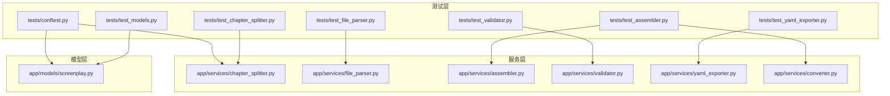
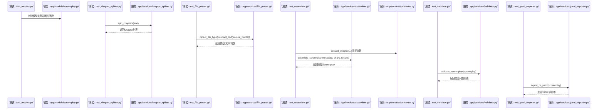
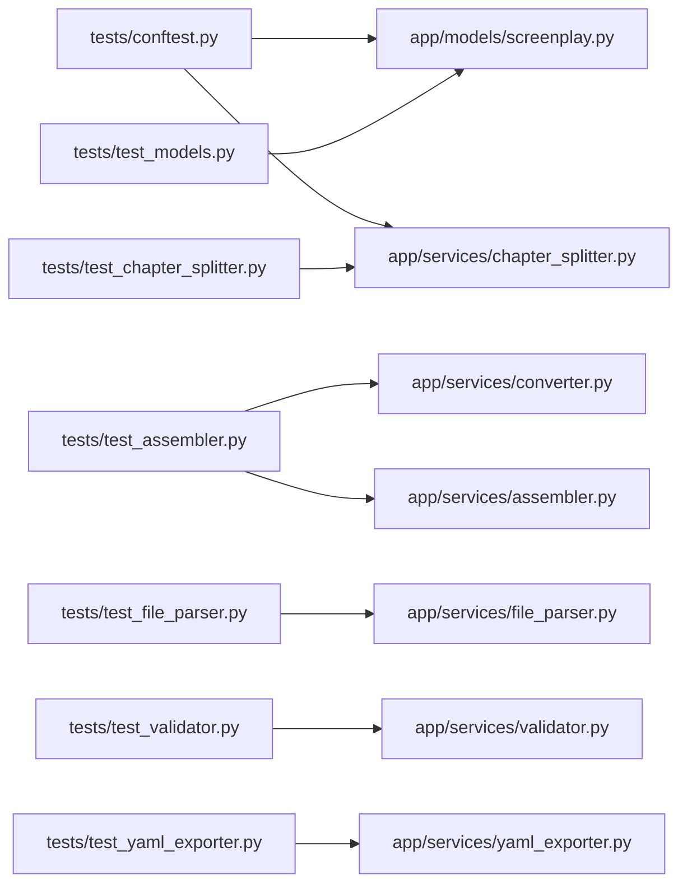

# 单元测试

<cite>
**本文引用的文件**
- [tests/test_models.py](file://tests/test_models.py)
- [app/models/screenplay.py](file://app/models/screenplay.py)
- [tests/test_chapter_splitter.py](file://tests/test_chapter_splitter.py)
- [app/services/chapter_splitter.py](file://app/services/chapter_splitter.py)
- [tests/test_file_parser.py](file://tests/test_file_parser.py)
- [app/services/file_parser.py](file://app/services/file_parser.py)
- [tests/test_assembler.py](file://tests/test_assembler.py)
- [app/services/assembler.py](file://app/services/assembler.py)
- [app/services/converter.py](file://app/services/converter.py)
- [tests/test_validator.py](file://tests/test_validator.py)
- [app/services/validator.py](file://app/services/validator.py)
- [tests/test_yaml_exporter.py](file://tests/test_yaml_exporter.py)
- [app/services/yaml_exporter.py](file://app/services/yaml_exporter.py)
- [tests/conftest.py](file://tests/conftest.py)
- [tests/fixtures/sample_novel.txt](file://tests/fixtures/sample_novel.txt)
</cite>

## 目录
1. [引言](#引言)
2. [项目结构](#项目结构)
3. [核心组件](#核心组件)
4. [架构总览](#架构总览)
5. [详细组件分析](#详细组件分析)
6. [依赖分析](#依赖分析)
7. [性能考虑](#性能考虑)
8. [故障排查指南](#故障排查指南)
9. [结论](#结论)
10. [附录](#附录)

## 引言
本文件系统性梳理并解读本项目各核心模块的单元测试实现与验证方法，覆盖数据模型、章节分割、文件解析、剧本组装、数据验证与YAML导出六大方面。文档以测试驱动的方式，逐项说明测试目标、断言策略、边界条件与最佳实践，帮助开发者快速理解模块行为、定位问题并持续改进。

## 项目结构
围绕“测试即规范”的理念，测试文件与被测模块一一对应，形成清晰的职责边界：
- 数据模型层：通过Pydantic模型定义数据结构与约束，测试覆盖字段默认值、必填项、序列化等。
- 服务层：对章节分割、文件解析、组装、验证、导出等服务进行功能与边界测试。
- 测试夹具：集中提供样本数据与共享Fixture，确保测试可重复与可维护。

图表来源
- [tests/test_models.py:1-124](file://tests/test_models.py#L1-L124)
- [app/models/screenplay.py:1-167](file://app/models/screenplay.py#L1-L167)
- [tests/test_chapter_splitter.py:1-68](file://tests/test_chapter_splitter.py#L1-L68)
- [app/services/chapter_splitter.py:1-163](file://app/services/chapter_splitter.py#L1-L163)
- [tests/test_file_parser.py:1-102](file://tests/test_file_parser.py#L1-L102)
- [app/services/file_parser.py:1-187](file://app/services/file_parser.py#L1-L187)
- [tests/test_assembler.py:1-111](file://tests/test_assembler.py#L1-L111)
- [app/services/assembler.py:1-101](file://app/services/assembler.py#L1-L101)
- [app/services/converter.py:1-218](file://app/services/converter.py#L1-L218)
- [tests/test_validator.py:1-63](file://tests/test_validator.py#L1-L63)
- [app/services/validator.py:1-111](file://app/services/validator.py#L1-L111)
- [tests/test_yaml_exporter.py:1-58](file://tests/test_yaml_exporter.py#L1-L58)
- [app/services/yaml_exporter.py:1-57](file://app/services/yaml_exporter.py#L1-L57)
- [tests/conftest.py:1-167](file://tests/conftest.py#L1-L167)

章节来源
- [tests/test_models.py:1-124](file://tests/test_models.py#L1-L124)
- [tests/test_chapter_splitter.py:1-68](file://tests/test_chapter_splitter.py#L1-L68)
- [tests/test_file_parser.py:1-102](file://tests/test_file_parser.py#L1-L102)
- [tests/test_assembler.py:1-111](file://tests/test_assembler.py#L1-L111)
- [tests/test_validator.py:1-63](file://tests/test_validator.py#L1-L63)
- [tests/test_yaml_exporter.py:1-58](file://tests/test_yaml_exporter.py#L1-L58)
- [tests/conftest.py:1-167](file://tests/conftest.py#L1-L167)

## 核心组件
本节概述六大测试模块的目标与验证要点，便于快速定位到具体测试文件与被测代码。

- 数据模型测试（test_models.py）
  - 验证Metadata默认值与时间戳自动生成
  - 验证Character关系与属性
  - 验证各类场景元素（动作、对白、括号、转场、备注）的类型与默认值
  - 验证Scene与Screenplay的层级组合与完整性

- 章节分割服务测试（test_chapter_splitter.py）
  - 正则匹配：英文、中文、罗马数字章节标题识别
  - 内容保留：章节正文不丢失
  - 健壮性：无章节标题时的启发式分割与段落边界处理
  - 模型：Chapter对象的字段完整性

- 文件解析器测试（test_file_parser.py）
  - 类型检测：txt、md、docx、pdf识别
  - 文本抽取：txt支持UTF-8-BOM；md剥离格式符号但保留纯文本；docx/ pdf按段落拼接
  - 错误处理：文件不存在、空文件、不支持类型抛出异常
  - 统计：中英混排词数统计

- 剧本组装服务测试（test_assembler.py）
  - 结构合并：多章节结果合并为完整剧本文本
  - 编号重置：全局场景编号连续且唯一
  - 角色呈现：从对话元素推断场景出场角色
  - 首次出场：基于最早出现场景设置角色首次出场

- 数据验证服务测试（test_validator.py）
  - 完整性：标题为空、无 Acts 等错误路径
  - 一致性：角色引用校验、场景元素非空
  - 可诊断：返回带严重级别与路径的校验问题列表

- YAML 导出服务测试（test_yaml_exporter.py）
  - 合法性：输出可被YAML解析器加载
  - 元信息：包含元数据、角色、场景等关键字段
  - 注释头：包含版本与生成时间注释
  - 回读一致性：YAML -> 解析 -> 数据与原始模型一致

章节来源
- [tests/test_models.py:1-124](file://tests/test_models.py#L1-L124)
- [tests/test_chapter_splitter.py:1-68](file://tests/test_chapter_splitter.py#L1-L68)
- [tests/test_file_parser.py:1-102](file://tests/test_file_parser.py#L1-L102)
- [tests/test_assembler.py:1-111](file://tests/test_assembler.py#L1-L111)
- [tests/test_validator.py:1-63](file://tests/test_validator.py#L1-L63)
- [tests/test_yaml_exporter.py:1-58](file://tests/test_yaml_exporter.py#L1-L58)

## 架构总览
下图展示测试与被测模块之间的调用关系与数据流，体现测试如何覆盖模型、服务与集成点。

图表来源
- [tests/test_models.py:1-124](file://tests/test_models.py#L1-L124)
- [app/models/screenplay.py:1-167](file://app/models/screenplay.py#L1-L167)
- [tests/test_chapter_splitter.py:1-68](file://tests/test_chapter_splitter.py#L1-L68)
- [app/services/chapter_splitter.py:1-163](file://app/services/chapter_splitter.py#L1-L163)
- [tests/test_file_parser.py:1-102](file://tests/test_file_parser.py#L1-L102)
- [app/services/file_parser.py:1-187](file://app/services/file_parser.py#L1-L187)
- [tests/test_assembler.py:1-111](file://tests/test_assembler.py#L1-L111)
- [app/services/assembler.py:1-101](file://app/services/assembler.py#L1-L101)
- [app/services/converter.py:1-218](file://app/services/converter.py#L1-L218)
- [tests/test_validator.py:1-63](file://tests/test_validator.py#L1-L63)
- [app/services/validator.py:1-111](file://app/services/validator.py#L1-L111)
- [tests/test_yaml_exporter.py:1-58](file://tests/test_yaml_exporter.py#L1-L58)
- [app/services/yaml_exporter.py:1-57](file://app/services/yaml_exporter.py#L1-L57)

## 详细组件分析

### 数据模型测试（test_models.py）
- 测试目标
  - 验证Metadata默认值与时间戳自动生成
  - 验证Character关系与属性
  - 验证各类场景元素（动作、对白、括号、转场、备注）的类型与默认值
  - 验证Scene与Screenplay的层级组合与完整性
- 关键断言
  - 必填字段存在且默认值合理
  - 元素类型与重要度默认值符合预期
  - 层级组合后数量与结构正确
- 最佳实践
  - 使用最小必要字段构造模型，避免冗余初始化
  - 对复杂嵌套结构（Act/Scene/Element）分别断言，提升定位效率
  - 利用Pydantic的模型序列化能力验证输出一致性

章节来源
- [tests/test_models.py:1-124](file://tests/test_models.py#L1-L124)
- [app/models/screenplay.py:1-167](file://app/models/screenplay.py#L1-L167)

### 章节分割服务测试（test_chapter_splitter.py）
- 测试目标
  - 正则表达式匹配：英文、中文、罗马数字章节标题识别
  - 内容保留：章节正文不丢失
  - 健壮性：无章节标题时的启发式分割与段落边界处理
  - 模型：Chapter对象的字段完整性
- 关键断言
  - 英文/中文/罗马数字章节数量与顺序正确
  - 各章节内容包含预期关键词
  - 无章节标题时至少产生若干段落级分段
  - 启发式分割尊重段落边界，避免截断单词
  - Chapter对象字段齐全（number/title/content/start_char）
- 最佳实践
  - 针对不同语言与格式编写独立用例，覆盖常见边界
  - 使用真实样本文本（来自fixtures）提高可信度
  - 对启发式分割的段落数量与字符偏移进行稳定性测试

章节来源
- [tests/test_chapter_splitter.py:1-68](file://tests/test_chapter_splitter.py#L1-L68)
- [app/services/chapter_splitter.py:1-163](file://app/services/chapter_splitter.py#L1-L163)
- [tests/fixtures/sample_novel.txt:1-50](file://tests/fixtures/sample_novel.txt#L1-L50)

### 文件解析器测试（test_file_parser.py）
- 测试目标
  - 类型检测：txt、md、docx、pdf识别
  - 文本抽取：txt支持UTF-8-BOM；md剥离格式符号但保留纯文本；docx/ pdf按段落拼接
  - 错误处理：文件不存在、空文件、不支持类型抛出异常
  - 统计：中英混排词数统计
- 关键断言
  - 扩展名映射到正确内部类型
  - txt含BOM时能正确读取
  - md去除加粗、斜体、链接等格式标记
  - docx/pdf按段落拼接，无页眉页脚干扰
  - 文件不存在、空文件、不支持类型触发异常
  - 词数统计对CJK与拉丁文混合场景准确
- 最佳实践
  - 使用临时文件写入与读取，避免污染测试环境
  - 对异常路径使用pytest.raises精确捕获
  - 针对不同编码与格式编写独立用例，覆盖边界字符

章节来源
- [tests/test_file_parser.py:1-102](file://tests/test_file_parser.py#L1-L102)
- [app/services/file_parser.py:1-187](file://app/services/file_parser.py#L1-L187)

### 剧本组装服务测试（test_assembler.py）
- 测试目标
  - 结构合并：多章节结果合并为完整剧本文本
  - 编号重置：全局场景编号连续且唯一
  - 角色呈现：从对话元素推断场景出场角色
  - 首次出场：基于最早出现场景设置角色首次出场
- 关键断言
  - 多Act合并后Act数量与场景数量正确
  - 全局场景编号连续递增
  - 场景characters_present包含实际出现的角色ID
  - 角色first_appearance指向其首次出现场景ID
- 最佳实践
  - 使用测试夹具提供的ConversionResult与Sample Screenplay，保证输入一致性
  - 对边界情况（单章节、空角色表）进行覆盖
  - 通过断言全局编号与角色映射，确保组装逻辑正确性

章节来源
- [tests/test_assembler.py:1-111](file://tests/test_assembler.py#L1-L111)
- [app/services/assembler.py:1-101](file://app/services/assembler.py#L1-L101)
- [app/services/converter.py:1-218](file://app/services/converter.py#L1-L218)
- [tests/conftest.py:1-167](file://tests/conftest.py#L1-L167)

### 数据验证服务测试（test_validator.py）
- 测试目标
  - 完整性：标题为空、无 Acts 等错误路径
  - 一致性：角色引用校验、场景元素非空
  - 可诊断：返回带严重级别与路径的校验问题列表
- 关键断言
  - 有效剧本无错误
  - 标题为空时返回错误
  - 无 Acts 时返回错误
  - 非法角色引用返回错误
  - 空场景元素返回警告
  - characters_present中的非法ID返回警告
- 最佳实践
  - 使用测试夹具提供的sample_screenplay作为基线，再针对性修改字段
  - 区分错误与警告，确保关键完整性问题不被忽略
  - 对路径与消息进行精确断言，便于定位问题

章节来源
- [tests/test_validator.py:1-63](file://tests/test_validator.py#L1-L63)
- [app/services/validator.py:1-111](file://app/services/validator.py#L1-L111)
- [tests/conftest.py:1-167](file://tests/conftest.py#L1-L167)

### YAML 导出服务测试（test_yaml_exporter.py）
- 测试目标
  - 合法性：输出可被YAML解析器加载
  - 元信息：包含元数据、角色、场景等关键字段
  - 注释头：包含版本与生成时间注释
  - 回读一致性：YAML -> 解析 -> 数据与原始模型一致
- 关键断言
  - 输出非空且可解析
  - 包含标题、作者、角色ID与场景ID等关键字段
  - 包含注释头信息
  - Unicode字符保留
  - roundtrip校验字段与数量一致
- 最佳实践
  - 使用ruamel.yaml严格配置缩进与宽度，保证可读性
  - 对Unicode与注释头进行显式断言，避免格式回归
  - 通过roundtrip验证序列化/反序列化一致性

章节来源
- [tests/test_yaml_exporter.py:1-58](file://tests/test_yaml_exporter.py#L1-L58)
- [app/services/yaml_exporter.py:1-57](file://app/services/yaml_exporter.py#L1-L57)
- [tests/conftest.py:1-167](file://tests/conftest.py#L1-L167)

## 依赖分析
- 测试夹具（conftest.py）
  - 提供sample_novel_text、sample_chapters、sample_characters、sample_screenplay等Fixture
  - 用于统一输入，减少重复构造成本，提升测试稳定性
- 模块间耦合
  - assembler依赖converter生成的ConversionResult
  - chapter_splitter与file_parser在不同场景下被上层服务复用
  - validator与yaml_exporter均消费screenplay模型
- 循环依赖
  - 当前测试文件未发现循环导入；服务间通过接口契约解耦

图表来源
- [tests/conftest.py:1-167](file://tests/conftest.py#L1-L167)
- [app/models/screenplay.py:1-167](file://app/models/screenplay.py#L1-L167)
- [app/services/chapter_splitter.py:1-163](file://app/services/chapter_splitter.py#L1-L163)
- [app/services/file_parser.py:1-187](file://app/services/file_parser.py#L1-L187)
- [app/services/assembler.py:1-101](file://app/services/assembler.py#L1-L101)
- [app/services/converter.py:1-218](file://app/services/converter.py#L1-L218)
- [app/services/validator.py:1-111](file://app/services/validator.py#L1-L111)
- [app/services/yaml_exporter.py:1-57](file://app/services/yaml_exporter.py#L1-L57)

章节来源
- [tests/conftest.py:1-167](file://tests/conftest.py#L1-L167)
- [app/services/converter.py:1-218](file://app/services/converter.py#L1-L218)

## 性能考虑
- 测试执行效率
  - 尽量使用小规模样本数据（如短文本、少量章节）进行单元测试，避免长耗时
  - 对文件解析与导出类测试，优先使用内存I/O与最小化文件大小
- 计算复杂度
  - 章节分割的启发式分布采用线性扫描与分段累加，时间复杂度O(n)，适合大规模文本
  - 组装服务的全局编号与角色映射为一次遍历，整体O(N)规模
- 并发与隔离
  - 使用pytest的并发执行能力（如-x、--tb等参数）加速失败定位
  - Fixture作用域合理划分，避免跨用例状态污染

## 故障排查指南
- 模型相关
  - 若Metadata默认值或时间戳断言失败，检查模型字段默认值与工厂函数
  - 若Scene/Element断言失败，核对层级构造顺序与字段命名
- 章节分割
  - 正则匹配失败时，确认CHAPTER_PATTERNS是否覆盖目标格式
  - 启发式分割结果异常时，检查段落切分与字符偏移计算
- 文件解析
  - UTF-8-BOM读取失败时，确认编码尝试顺序与异常捕获
  - md格式剥离不彻底时，检查正则替换顺序与边界
- 组装服务
  - 全局编号错乱时，检查_renumber_acts_and_scenes的遍历顺序
  - 角色首次出场错误时，核对_set_first_appearances的字典更新逻辑
- 验证服务
  - 校验结果为空但应有警告时，检查Act/Scene索引与路径拼接
- YAML导出
  - roundtrip失败时，检查exclude_none与model_dump模式
  - 注释头缺失时，确认头部写入顺序与换行符

章节来源
- [app/models/screenplay.py:1-167](file://app/models/screenplay.py#L1-L167)
- [app/services/chapter_splitter.py:1-163](file://app/services/chapter_splitter.py#L1-L163)
- [app/services/file_parser.py:1-187](file://app/services/file_parser.py#L1-L187)
- [app/services/assembler.py:1-101](file://app/services/assembler.py#L1-L101)
- [app/services/validator.py:1-111](file://app/services/validator.py#L1-L111)
- [app/services/yaml_exporter.py:1-57](file://app/services/yaml_exporter.py#L1-L57)

## 结论
本项目的单元测试体系以“模型-服务-集成”三层覆盖为核心，结合测试夹具与明确断言策略，有效保障了数据结构完整性、处理流程正确性与输出质量。建议持续补充边界与异常路径用例，保持测试与实现同步演进，进一步提升系统的可靠性与可维护性。

## 附录
- 测试运行建议
  - 使用pytest命令执行单文件或全量测试，配合--tb=short快速定位
  - 对涉及外部依赖（docx/pdf）的测试，提前安装对应依赖包
- 参考文件
  - YAML模式文档：docs/YAML_SCHEMA.md（由导出服务注释引用）